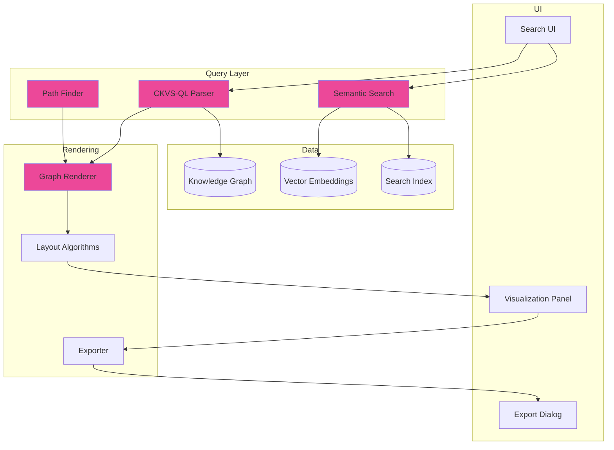

# LCS-SBD-104-KG: Scope Overview — Graph Visualization & Search

## Document Control

| Field            | Value                                                        |
| :--------------- | :----------------------------------------------------------- |
| **Document ID**  | LCS-SBD-104-KG                                               |
| **Version**      | v0.10.4                                                      |
| **Codename**     | Graph Visualization & Search (CKVS Phase 5d)                 |
| **Status**       | Draft                                                        |
| **Last Updated** | 2026-01-31                                                   |
| **Owner**        | Lead Architect                                               |
| **Depends On**   | v0.4.5-KG (Graph Foundation), v0.4.7-KG (Entity Browser)     |

---

## 1. Executive Summary

### 1.1 The Vision

**v0.10.4-KG** delivers **Graph Visualization & Search** — interactive visualization of the knowledge graph and powerful search capabilities beyond simple text matching. Users can:

- Explore entity relationships visually with force-directed layouts
- Find paths between entities ("how is User related to PaymentService?")
- Query the graph with structured syntax ("find all endpoints that require auth")
- Perform semantic search across entities and relationships

### 1.2 Business Value

- **Discovery:** Find hidden connections in documentation.
- **Understanding:** Visualize complex system architectures.
- **Navigation:** Jump from entity to entity intuitively.
- **Power Users:** Query language for advanced exploration.
- **Documentation:** Export visualizations for docs/presentations.

### 1.3 Success Criteria

1. Interactive graph visualization with zoom/pan/filter.
2. Path-finding between any two entities.
3. Structured query language with autocomplete.
4. Semantic search returning ranked results.
5. Export to SVG/PNG for documentation.
6. <500ms response for typical queries.

---

## 2. Key Deliverables

### 2.1 Sub-Parts

| Sub-Part | Title | Description | Est. Hours |
|:---------|:------|:------------|:-----------|
| v0.10.4a | Graph Renderer | Force-directed visualization engine | 10 |
| v0.10.4b | Path Finder | Find paths between entities | 6 |
| v0.10.4c | Query Language | CKVS-QL structured query parser | 10 |
| v0.10.4d | Semantic Search | Vector-based entity search | 8 |
| v0.10.4e | Graph Export | Export visualizations to images | 4 |
| v0.10.4f | Search UI | Unified search interface | 6 |
| **Total** | | | **44 hours** |

### 2.2 Key Interfaces

```csharp
/// <summary>
/// Renders knowledge graph visualizations.
/// </summary>
public interface IGraphRenderer
{
    /// <summary>
    /// Generates a visualization for a subgraph.
    /// </summary>
    Task<GraphVisualization> RenderAsync(
        GraphRenderRequest request,
        CancellationToken ct = default);

    /// <summary>
    /// Gets the neighborhood of an entity.
    /// </summary>
    Task<GraphVisualization> RenderNeighborhoodAsync(
        Guid entityId,
        int depth,
        NeighborhoodOptions options,
        CancellationToken ct = default);

    /// <summary>
    /// Exports visualization to image format.
    /// </summary>
    Task<byte[]> ExportAsync(
        GraphVisualization visualization,
        ExportFormat format,
        ExportOptions options,
        CancellationToken ct = default);
}

public record GraphVisualization
{
    public IReadOnlyList<VisualNode> Nodes { get; init; } = [];
    public IReadOnlyList<VisualEdge> Edges { get; init; } = [];
    public VisualizationBounds Bounds { get; init; } = new();
    public LayoutAlgorithm Layout { get; init; } = LayoutAlgorithm.ForceDirected;
}

public record VisualNode
{
    public Guid EntityId { get; init; }
    public string Label { get; init; } = "";
    public string EntityType { get; init; } = "";
    public double X { get; init; }
    public double Y { get; init; }
    public double Size { get; init; } = 1.0;
    public string Color { get; init; } = "#3b82f6";
    public IReadOnlyDictionary<string, object> Metadata { get; init; } = new Dictionary<string, object>();
}

public record VisualEdge
{
    public Guid RelationshipId { get; init; }
    public Guid SourceId { get; init; }
    public Guid TargetId { get; init; }
    public string RelationshipType { get; init; } = "";
    public string? Label { get; init; }
    public double Weight { get; init; } = 1.0;
    public string Color { get; init; } = "#94a3b8";
}

public enum LayoutAlgorithm
{
    ForceDirected,
    Hierarchical,
    Circular,
    Grid,
    Radial
}

public enum ExportFormat { SVG, PNG, PDF, JSON }

/// <summary>
/// Finds paths between entities in the graph.
/// </summary>
public interface IPathFinder
{
    /// <summary>
    /// Finds the shortest path between two entities.
    /// </summary>
    Task<PathResult?> FindShortestPathAsync(
        Guid sourceId,
        Guid targetId,
        PathOptions options,
        CancellationToken ct = default);

    /// <summary>
    /// Finds all paths between two entities up to a max length.
    /// </summary>
    Task<IReadOnlyList<PathResult>> FindAllPathsAsync(
        Guid sourceId,
        Guid targetId,
        int maxLength,
        PathOptions options,
        CancellationToken ct = default);

    /// <summary>
    /// Checks if two entities are connected.
    /// </summary>
    Task<bool> AreConnectedAsync(
        Guid sourceId,
        Guid targetId,
        int maxDepth = 10,
        CancellationToken ct = default);
}

public record PathResult
{
    public IReadOnlyList<PathNode> Nodes { get; init; } = [];
    public IReadOnlyList<PathEdge> Edges { get; init; } = [];
    public int Length { get; init; }
    public double TotalWeight { get; init; }
}

public record PathNode
{
    public Guid EntityId { get; init; }
    public string EntityName { get; init; } = "";
    public string EntityType { get; init; } = "";
    public int Position { get; init; }
}

public record PathEdge
{
    public Guid RelationshipId { get; init; }
    public string RelationshipType { get; init; } = "";
    public bool IsForward { get; init; } = true;
}

/// <summary>
/// Executes structured queries against the knowledge graph.
/// </summary>
public interface IGraphQueryService
{
    /// <summary>
    /// Executes a CKVS-QL query.
    /// </summary>
    Task<QueryResult> QueryAsync(
        string query,
        QueryOptions options,
        CancellationToken ct = default);

    /// <summary>
    /// Validates a query without executing.
    /// </summary>
    Task<QueryValidationResult> ValidateAsync(
        string query,
        CancellationToken ct = default);

    /// <summary>
    /// Gets autocomplete suggestions for partial query.
    /// </summary>
    Task<IReadOnlyList<QuerySuggestion>> GetSuggestionsAsync(
        string partialQuery,
        int cursorPosition,
        CancellationToken ct = default);
}

public record QueryResult
{
    public QueryResultType ResultType { get; init; }
    public IReadOnlyList<QueryRow> Rows { get; init; } = [];
    public IReadOnlyList<string> Columns { get; init; } = [];
    public int TotalCount { get; init; }
    public TimeSpan ExecutionTime { get; init; }
    public string? ExplainPlan { get; init; }
}

public enum QueryResultType { Entities, Relationships, Scalars, Paths }

public record QueryRow
{
    public IReadOnlyDictionary<string, object?> Values { get; init; } = new Dictionary<string, object?>();
}

/// <summary>
/// Performs semantic search across the knowledge graph.
/// </summary>
public interface ISemanticGraphSearch
{
    /// <summary>
    /// Searches entities using natural language.
    /// </summary>
    Task<SemanticSearchResult> SearchAsync(
        string query,
        SemanticSearchOptions options,
        CancellationToken ct = default);

    /// <summary>
    /// Finds entities similar to a given entity.
    /// </summary>
    Task<IReadOnlyList<SimilarEntity>> FindSimilarAsync(
        Guid entityId,
        int limit = 10,
        CancellationToken ct = default);
}

public record SemanticSearchResult
{
    public IReadOnlyList<SemanticSearchHit> Hits { get; init; } = [];
    public int TotalCount { get; init; }
    public TimeSpan SearchTime { get; init; }
}

public record SemanticSearchHit
{
    public Guid EntityId { get; init; }
    public string EntityName { get; init; } = "";
    public string EntityType { get; init; } = "";
    public float RelevanceScore { get; init; }
    public string? MatchedProperty { get; init; }
    public string? Snippet { get; init; }
}
```

### 2.3 Visualization Architecture



---

## 3. CKVS-QL Query Language

### 3.1 Syntax Overview

```sql
-- Find entities by type
FIND Entity WHERE type = "Endpoint"

-- Find with property conditions
FIND Entity WHERE type = "Endpoint" AND method = "POST"

-- Find relationships
FIND e1 -[CALLS]-> e2 WHERE e1.type = "Service"

-- Path queries
FIND PATH FROM "UserService" TO "Database" MAX 5

-- Aggregations
FIND Entity WHERE type = "Endpoint"
GROUP BY service
COUNT AS endpoint_count

-- Pattern matching
FIND e WHERE e.name MATCHES ".*Auth.*"

-- Traversal
FIND Entity WHERE type = "Service"
EXPAND -[DEPENDS_ON]-> DEPTH 3

-- Subqueries
FIND Entity WHERE id IN (
    FIND e -[CALLS]-> target WHERE target.name = "AuthService"
    RETURN e.id
)
```

### 3.2 Query Examples

```sql
-- Q1: All endpoints that require authentication
FIND Entity
WHERE type = "Endpoint" AND requiresAuth = true
ORDER BY name

-- Q2: Services with the most dependencies
FIND e1 -[DEPENDS_ON]-> e2
WHERE e1.type = "Service"
GROUP BY e1.name
COUNT AS dependency_count
ORDER BY dependency_count DESC
LIMIT 10

-- Q3: Find the path between User and Payment
FIND PATH FROM "UserService" TO "PaymentGateway"
VIA [CALLS, DEPENDS_ON]
MAX 6

-- Q4: Orphaned entities (no relationships)
FIND Entity e
WHERE NOT EXISTS (e -[*]-> *)
  AND NOT EXISTS (* -[*]-> e)

-- Q5: Entities modified in last 7 days
FIND Entity
WHERE modifiedAt > NOW() - INTERVAL 7 DAY
ORDER BY modifiedAt DESC

-- Q6: Claims about a specific entity
FIND Claim
WHERE subject = "GET /users"
ORDER BY confidence DESC
```

---

## 4. Visualization UI

```
┌────────────────────────────────────────────────────────────────┐
│ Knowledge Graph Explorer                                       │
├────────────────────────────────────────────────────────────────┤
│ ┌──────────────────────────────────────────────────────────┐  │
│ │ 🔍 Search or query...                          [CKVS-QL] │  │
│ │ ┌──────────────────────────────────────────────────────┐ │  │
│ │ │ FIND Entity WHERE type = "Service" EXPAND -[DEPENDS_ │ │  │
│ │ └──────────────────────────────────────────────────────┘ │  │
│ │ Suggestions: DEPENDS_ON, DEFINES, CALLS                  │  │
│ └──────────────────────────────────────────────────────────┘  │
│                                                                │
│ ┌──────────────────────────────────────────────────────────┐  │
│ │                                                          │  │
│ │                    ┌─────────┐                          │  │
│ │                    │AuthSvc  │                          │  │
│ │                    └────┬────┘                          │  │
│ │                         │                               │  │
│ │            ┌────────────┼────────────┐                 │  │
│ │            │            │            │                 │  │
│ │       ┌────▼────┐  ┌────▼────┐  ┌────▼────┐           │  │
│ │       │UserSvc  │  │OrderSvc │  │PaymentSvc│           │  │
│ │       └────┬────┘  └────┬────┘  └────┬────┘           │  │
│ │            │            │            │                 │  │
│ │            └────────────┼────────────┘                 │  │
│ │                         │                               │  │
│ │                    ┌────▼────┐                          │  │
│ │                    │Database │                          │  │
│ │                    └─────────┘                          │  │
│ │                                                          │  │
│ │ [Zoom +] [Zoom -] [Fit] [Reset]   Layout: [Force ▼]     │  │
│ └──────────────────────────────────────────────────────────┘  │
│                                                                │
│ Legend:  ● Service  ● Endpoint  ● Database  ─ DEPENDS_ON     │
│                                                                │
│ Selected: UserSvc (3 connections)           [Export] [Filter] │
│ └─ DEPENDS_ON: AuthSvc, Database                              │
│ └─ CALLED_BY: OrderSvc                                        │
└────────────────────────────────────────────────────────────────┘
```

---

## 5. Path Finding UI

```
┌────────────────────────────────────────────────────────────────┐
│ Find Path                                           [Close]    │
├────────────────────────────────────────────────────────────────┤
│                                                                │
│ From: [UserService          ▼]                                │
│ To:   [PaymentGateway       ▼]                                │
│                                                                │
│ Options:                                                       │
│ ├── Max hops: [5]                                             │
│ ├── Relationship types: [All ▼]                               │
│ └── Direction: ◉ Any  ○ Outgoing only  ○ Incoming only       │
│                                                                │
│ [Find Paths]                                                   │
│                                                                │
│ ─────────────────────────────────────────────────────────────  │
│                                                                │
│ Found 3 paths:                                                 │
│                                                                │
│ Path 1 (length 2, shortest):                                  │
│ ┌──────────────────────────────────────────────────────────┐  │
│ │ UserService ──[CALLS]──▶ OrderService ──[CALLS]──▶       │  │
│ │ PaymentGateway                                            │  │
│ └──────────────────────────────────────────────────────────┘  │
│ [View in Graph]                                                │
│                                                                │
│ Path 2 (length 3):                                            │
│ ┌──────────────────────────────────────────────────────────┐  │
│ │ UserService ──[DEPENDS_ON]──▶ AuthService ──[CALLS]──▶   │  │
│ │ BillingService ──[CALLS]──▶ PaymentGateway               │  │
│ └──────────────────────────────────────────────────────────┘  │
│ [View in Graph]                                                │
│                                                                │
└────────────────────────────────────────────────────────────────┘
```

---

## 6. Semantic Search UI

```
┌────────────────────────────────────────────────────────────────┐
│ Semantic Search                                                │
├────────────────────────────────────────────────────────────────┤
│                                                                │
│ 🔍 "endpoints that handle user authentication"                │
│                                                                │
│ Results (23 found, 0.3s):                                     │
│                                                                │
│ ┌────────────────────────────────────────────────────────────┐ │
│ │ POST /auth/login                              [98% match]  │ │
│ │ Type: Endpoint | Service: AuthService                     │ │
│ │ "Authenticates a user with email and password..."         │ │
│ │ [View] [View in Graph] [Go to Document]                   │ │
│ ├────────────────────────────────────────────────────────────┤ │
│ │ POST /auth/validate                           [95% match]  │ │
│ │ Type: Endpoint | Service: AuthService                     │ │
│ │ "Validates an authentication token..."                    │ │
│ │ [View] [View in Graph] [Go to Document]                   │ │
│ ├────────────────────────────────────────────────────────────┤ │
│ │ GET /auth/me                                  [87% match]  │ │
│ │ Type: Endpoint | Service: AuthService                     │ │
│ │ "Returns the currently authenticated user..."             │ │
│ │ [View] [View in Graph] [Go to Document]                   │ │
│ └────────────────────────────────────────────────────────────┘ │
│                                                                │
│ Related searches: "auth tokens", "login flow", "JWT"          │
│                                                                │
│ [Load More]                                                    │
└────────────────────────────────────────────────────────────────┘
```

---

## 7. Dependencies

| Component | Source | Usage |
|:----------|:-------|:------|
| `IGraphRepository` | v0.4.5e | Graph data access |
| `IEntityBrowser` | v0.4.7-KG | Entity details |
| `IRagService` | v0.4.3 | Vector embeddings |
| D3.js / Cytoscape | External | Visualization library |
| Neo4j | v0.4.5-KG | Path queries |

---

## 8. License Gating

| Tier | Graph Viz & Search |
|:-----|:-------------------|
| Core | Basic search only |
| WriterPro | Visualization + path finding |
| Teams | Full + CKVS-QL |
| Enterprise | Full + export + API |

---

## 9. Performance Targets

| Metric | Target | Measurement |
|:-------|:-------|:------------|
| Simple query | <200ms | P95 timing |
| Complex query (joins) | <2s | P95 timing |
| Semantic search | <500ms | P95 timing |
| Path finding (depth 5) | <1s | P95 timing |
| Visualization render | <500ms | P95 timing |

---

## 10. Layout Algorithms

| Algorithm | Best For | Performance |
|:----------|:---------|:------------|
| Force-Directed | General exploration | O(n²) |
| Hierarchical | Dependency trees | O(n log n) |
| Circular | Ring relationships | O(n) |
| Radial | Entity neighborhoods | O(n log n) |
| Grid | Large flat graphs | O(n) |

---

## 11. Risks & Mitigations

| Risk | Mitigation |
|:-----|:-----------|
| Large graph performance | Progressive loading, clustering |
| Query complexity | Query timeout, explain plan |
| Visualization clutter | Filtering, clustering, focus+context |
| Search relevance | Tunable ranking, feedback |

---
