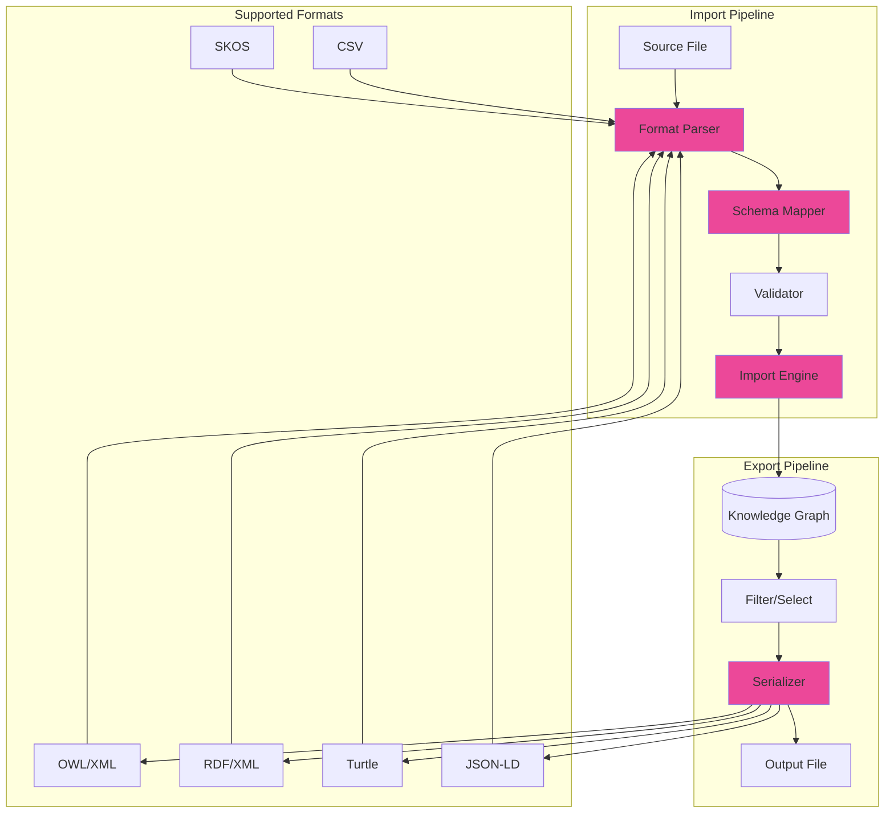
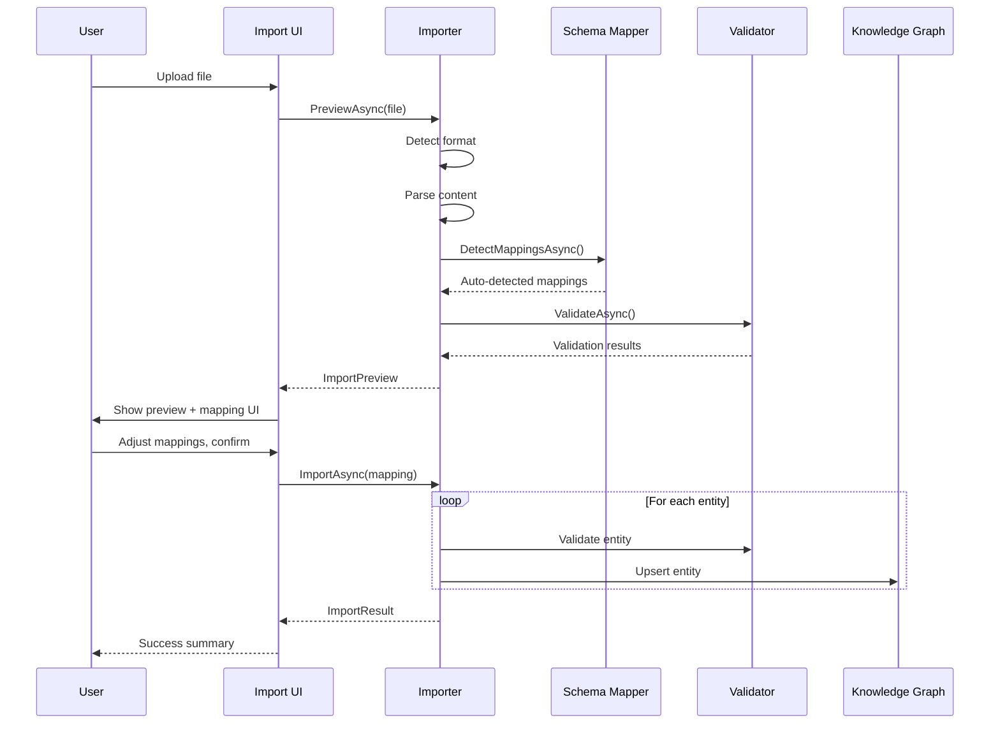

# LCS-SBD-105-KG: Scope Overview — Knowledge Import/Export

## Document Control

| Field            | Value                                                        |
| :--------------- | :----------------------------------------------------------- |
| **Document ID**  | LCS-SBD-105-KG                                               |
| **Version**      | v0.10.5                                                      |
| **Codename**     | Knowledge Import/Export (CKVS Phase 5e)                      |
| **Status**       | Draft                                                        |
| **Last Updated** | 2026-01-31                                                   |
| **Owner**        | Lead Architect                                               |
| **Depends On**   | v0.4.5-KG (Graph Foundation), v0.4.6-KG (Axiom Store)        |

---

## 1. Executive Summary

### 1.1 The Vision

**v0.10.5-KG** delivers **Knowledge Import/Export** — interoperability with standard ontology and knowledge representation formats. This enables:

- Import existing ontologies (OWL, RDF, SKOS) to bootstrap the knowledge graph
- Export CKVS knowledge to standard formats for sharing
- Integrate with external knowledge bases and tools
- Migrate between knowledge management systems

### 1.2 Business Value

- **Interoperability:** Work with industry-standard formats.
- **Migration:** Import from existing knowledge systems.
- **Sharing:** Export knowledge for external consumption.
- **Standards Compliance:** Meet enterprise requirements.
- **Ecosystem:** Integrate with semantic web tools.

### 1.3 Success Criteria

1. Import OWL, RDF/XML, Turtle, JSON-LD, and SKOS formats.
2. Export to same formats with round-trip fidelity.
3. Mapping UI for aligning external schemas to CKVS model.
4. Incremental import (merge vs. replace options).
5. Validation during import with detailed error reporting.
6. <1 minute import for typical ontologies (1K entities).

---

## 2. Key Deliverables

### 2.1 Sub-Parts

| Sub-Part | Title | Description | Est. Hours |
|:---------|:------|:------------|:-----------|
| v0.10.5a | Format Parsers | Parse OWL, RDF, Turtle, JSON-LD | 10 |
| v0.10.5b | Schema Mapper | Map external schemas to CKVS | 8 |
| v0.10.5c | Import Engine | Import with merge/replace logic | 8 |
| v0.10.5d | Export Engine | Export to standard formats | 8 |
| v0.10.5e | Validation Layer | Validate imports against CKVS rules | 6 |
| v0.10.5f | Import/Export UI | User interface for operations | 5 |
| **Total** | | | **45 hours** |

### 2.2 Key Interfaces

```csharp
/// <summary>
/// Imports knowledge from external formats.
/// </summary>
public interface IKnowledgeImporter
{
    /// <summary>
    /// Previews an import without applying changes.
    /// </summary>
    Task<ImportPreview> PreviewAsync(
        Stream content,
        ImportFormat format,
        ImportOptions options,
        CancellationToken ct = default);

    /// <summary>
    /// Executes an import operation.
    /// </summary>
    Task<ImportResult> ImportAsync(
        Stream content,
        ImportFormat format,
        ImportOptions options,
        SchemaMapping? mapping = null,
        CancellationToken ct = default);

    /// <summary>
    /// Gets supported import formats.
    /// </summary>
    IReadOnlyList<ImportFormat> SupportedFormats { get; }
}

public enum ImportFormat
{
    OwlXml,         // OWL/XML
    OwlFunctional,  // OWL Functional Syntax
    RdfXml,         // RDF/XML
    Turtle,         // Turtle (TTL)
    NTriples,       // N-Triples
    JsonLd,         // JSON-LD
    Skos,           // SKOS vocabularies
    CkvsJson,       // Native CKVS format
    Csv             // Tabular data
}

public record ImportOptions
{
    public ImportMode Mode { get; init; } = ImportMode.Merge;
    public bool ValidateOnImport { get; init; } = true;
    public bool CreateMissingTypes { get; init; } = false;
    public string? DefaultNamespace { get; init; }
    public IReadOnlyList<string>? IncludeNamespaces { get; init; }
    public IReadOnlyList<string>? ExcludeNamespaces { get; init; }
    public ConflictResolution ConflictResolution { get; init; } = ConflictResolution.Skip;
}

public enum ImportMode
{
    Merge,      // Add new, update existing
    Replace,    // Replace entire graph
    Append      // Add new only, skip existing
}

public enum ConflictResolution
{
    Skip,       // Keep existing
    Overwrite,  // Use imported
    Rename,     // Import with suffix
    Error       // Fail on conflict
}

public record ImportPreview
{
    public int EntitiesFound { get; init; }
    public int RelationshipsFound { get; init; }
    public int NewEntities { get; init; }
    public int UpdatedEntities { get; init; }
    public int ConflictingEntities { get; init; }
    public IReadOnlyList<ImportWarning> Warnings { get; init; } = [];
    public IReadOnlyList<ImportError> Errors { get; init; } = [];
    public IReadOnlyList<TypeMapping> DetectedMappings { get; init; } = [];
}

public record ImportResult
{
    public ImportStatus Status { get; init; }
    public int EntitiesImported { get; init; }
    public int RelationshipsImported { get; init; }
    public int EntitiesSkipped { get; init; }
    public int EntitiesUpdated { get; init; }
    public TimeSpan Duration { get; init; }
    public IReadOnlyList<ImportWarning> Warnings { get; init; } = [];
    public IReadOnlyList<ImportError> Errors { get; init; } = [];
}

public enum ImportStatus { Success, PartialSuccess, Failed }

/// <summary>
/// Exports knowledge to external formats.
/// </summary>
public interface IKnowledgeExporter
{
    /// <summary>
    /// Exports the knowledge graph to a stream.
    /// </summary>
    Task ExportAsync(
        Stream output,
        ExportFormat format,
        ExportOptions options,
        CancellationToken ct = default);

    /// <summary>
    /// Gets export metadata without generating full export.
    /// </summary>
    Task<ExportMetadata> GetMetadataAsync(
        ExportOptions options,
        CancellationToken ct = default);

    /// <summary>
    /// Gets supported export formats.
    /// </summary>
    IReadOnlyList<ExportFormat> SupportedFormats { get; }
}

public enum ExportFormat
{
    OwlXml,
    RdfXml,
    Turtle,
    NTriples,
    JsonLd,
    CkvsJson,
    Csv,
    GraphML,
    Cypher      // Neo4j import script
}

public record ExportOptions
{
    public IReadOnlyList<string>? EntityTypes { get; init; }
    public IReadOnlyList<string>? RelationshipTypes { get; init; }
    public IReadOnlyList<Guid>? EntityIds { get; init; }
    public bool IncludeMetadata { get; init; } = true;
    public bool IncludeClaims { get; init; } = true;
    public bool IncludeDerivedFacts { get; init; } = false;
    public string? BaseUri { get; init; }
    public IReadOnlyDictionary<string, string>? NamespacePrefixes { get; init; }
}

public record ExportMetadata
{
    public int EntityCount { get; init; }
    public int RelationshipCount { get; init; }
    public int ClaimCount { get; init; }
    public long EstimatedSizeBytes { get; init; }
    public IReadOnlyList<string> EntityTypes { get; init; } = [];
    public IReadOnlyList<string> RelationshipTypes { get; init; } = [];
}

/// <summary>
/// Maps external schemas to CKVS model.
/// </summary>
public interface ISchemaMappingService
{
    /// <summary>
    /// Auto-detects mappings from imported schema.
    /// </summary>
    Task<SchemaMapping> DetectMappingsAsync(
        Stream content,
        ImportFormat format,
        CancellationToken ct = default);

    /// <summary>
    /// Validates a schema mapping.
    /// </summary>
    Task<MappingValidationResult> ValidateMappingAsync(
        SchemaMapping mapping,
        CancellationToken ct = default);

    /// <summary>
    /// Saves a mapping for reuse.
    /// </summary>
    Task<Guid> SaveMappingAsync(
        SchemaMapping mapping,
        string name,
        CancellationToken ct = default);

    /// <summary>
    /// Gets saved mappings.
    /// </summary>
    Task<IReadOnlyList<SavedMapping>> GetSavedMappingsAsync(
        CancellationToken ct = default);
}

public record SchemaMapping
{
    public Guid? MappingId { get; init; }
    public string? Name { get; init; }
    public IReadOnlyList<TypeMapping> TypeMappings { get; init; } = [];
    public IReadOnlyList<PropertyMapping> PropertyMappings { get; init; } = [];
    public IReadOnlyList<RelationshipMapping> RelationshipMappings { get; init; } = [];
}

public record TypeMapping
{
    public string SourceType { get; init; } = "";
    public string SourceNamespace { get; init; } = "";
    public string TargetType { get; init; } = "";
    public float Confidence { get; init; }
    public bool IsAutoDetected { get; init; }
}

public record PropertyMapping
{
    public string SourceProperty { get; init; } = "";
    public string SourceType { get; init; } = "";
    public string TargetProperty { get; init; } = "";
    public PropertyTransform? Transform { get; init; }
}

public record PropertyTransform
{
    public TransformType Type { get; init; }
    public string? Pattern { get; init; }
    public string? Replacement { get; init; }
}

public enum TransformType { None, Rename, Extract, Combine, Convert }
```

### 2.3 Import/Export Architecture



---

## 3. Import Flow



---

## 4. Schema Mapping UI

```
┌────────────────────────────────────────────────────────────────┐
│ Import: api-ontology.owl                            [Close]    │
├────────────────────────────────────────────────────────────────┤
│                                                                │
│ Format: OWL/XML | Entities: 147 | Relationships: 312          │
│                                                                │
│ ═══════════════════════════════════════════════════════════   │
│ Schema Mapping                                                 │
│ ═══════════════════════════════════════════════════════════   │
│                                                                │
│ Type Mappings:                                                 │
│ ┌────────────────────────────────────────────────────────────┐ │
│ │ Source (OWL)              →  Target (CKVS)      Confidence │ │
│ ├────────────────────────────────────────────────────────────┤ │
│ │ api:Endpoint              →  [Endpoint      ▼]     98%    │ │
│ │ api:Service               →  [Service       ▼]     95%    │ │
│ │ api:Parameter             →  [Parameter     ▼]     92%    │ │
│ │ api:Response              →  [Entity        ▼]     67%  ⚠ │ │
│ │ api:ErrorCode             →  [+ Create New  ▼]     --     │ │
│ └────────────────────────────────────────────────────────────┘ │
│                                                                │
│ Property Mappings:                                             │
│ ┌────────────────────────────────────────────────────────────┐ │
│ │ api:httpMethod            →  method                        │ │
│ │ api:urlPath               →  path                          │ │
│ │ api:description           →  description                   │ │
│ │ api:isDeprecated          →  deprecated (convert bool)     │ │
│ │ api:createdDate           →  (skip - no mapping)           │ │
│ └────────────────────────────────────────────────────────────┘ │
│                                                                │
│ Relationship Mappings:                                         │
│ ┌────────────────────────────────────────────────────────────┐ │
│ │ api:belongsTo             →  DEFINED_IN                    │ │
│ │ api:invokes               →  CALLS                         │ │
│ │ api:hasParameter          →  HAS_PARAMETER                 │ │
│ └────────────────────────────────────────────────────────────┘ │
│                                                                │
│ ☐ Save this mapping as: [API Ontology Standard    ]           │
│                                                                │
│ Preview:                                                       │
│ ├── 147 entities to import (12 new, 135 updates)             │
│ ├── 312 relationships to import                               │
│ ├── 3 conflicts (will skip)                                   │
│ └── 2 warnings (unmapped properties)                          │
│                                                                │
│ [Cancel] [Import Preview] [Import]                            │
└────────────────────────────────────────────────────────────────┘
```

---

## 5. Export UI

```
┌────────────────────────────────────────────────────────────────┐
│ Export Knowledge Graph                              [Close]    │
├────────────────────────────────────────────────────────────────┤
│                                                                │
│ Format: [JSON-LD              ▼]                              │
│                                                                │
│ Scope:                                                         │
│ ├── ◉ Entire graph (847 entities, 1,234 relationships)        │
│ ├── ○ Selected types only                                     │
│ │   └── ☑ Endpoint  ☑ Service  ☐ Database  ☐ Schema          │
│ └── ○ Custom selection                                        │
│                                                                │
│ Options:                                                       │
│ ├── ☑ Include metadata (created/modified dates)               │
│ ├── ☑ Include claims                                          │
│ ├── ☐ Include derived facts                                   │
│ └── ☐ Include validation status                               │
│                                                                │
│ Namespaces:                                                    │
│ ├── Base URI: [https://example.com/api/              ]        │
│ ├── Prefix: [api]                                             │
│ └── ☑ Include standard prefixes (rdf, rdfs, owl, xsd)        │
│                                                                │
│ Estimated size: 2.4 MB                                        │
│                                                                │
│ [Cancel] [Preview] [Export]                                    │
└────────────────────────────────────────────────────────────────┘
```

---

## 6. Format Examples

### 6.1 JSON-LD Export

```json
{
  "@context": {
    "api": "https://example.com/api/",
    "rdfs": "http://www.w3.org/2000/01/rdf-schema#",
    "xsd": "http://www.w3.org/2001/XMLSchema#"
  },
  "@graph": [
    {
      "@id": "api:getUserEndpoint",
      "@type": "api:Endpoint",
      "api:method": "GET",
      "api:path": "/users/{id}",
      "rdfs:label": "Get User",
      "rdfs:comment": "Retrieves a user by ID",
      "api:definedIn": { "@id": "api:userService" },
      "api:returns": { "@id": "api:userSchema" }
    },
    {
      "@id": "api:userService",
      "@type": "api:Service",
      "rdfs:label": "User Service",
      "api:dependsOn": [
        { "@id": "api:authService" },
        { "@id": "api:database" }
      ]
    }
  ]
}
```

### 6.2 Turtle Export

```turtle
@prefix api: <https://example.com/api/> .
@prefix rdfs: <http://www.w3.org/2000/01/rdf-schema#> .
@prefix xsd: <http://www.w3.org/2001/XMLSchema#> .

api:getUserEndpoint a api:Endpoint ;
    rdfs:label "Get User" ;
    rdfs:comment "Retrieves a user by ID" ;
    api:method "GET" ;
    api:path "/users/{id}" ;
    api:definedIn api:userService ;
    api:returns api:userSchema .

api:userService a api:Service ;
    rdfs:label "User Service" ;
    api:dependsOn api:authService, api:database .
```

### 6.3 OWL Export

```xml
<?xml version="1.0"?>
<rdf:RDF xmlns="https://example.com/api/"
         xmlns:rdf="http://www.w3.org/1999/02/22-rdf-syntax-ns#"
         xmlns:rdfs="http://www.w3.org/2000/01/rdf-schema#"
         xmlns:owl="http://www.w3.org/2002/07/owl#">

    <owl:Ontology rdf:about="https://example.com/api/"/>

    <owl:Class rdf:about="https://example.com/api/Endpoint"/>
    <owl:Class rdf:about="https://example.com/api/Service"/>

    <owl:ObjectProperty rdf:about="https://example.com/api/definedIn">
        <rdfs:domain rdf:resource="https://example.com/api/Endpoint"/>
        <rdfs:range rdf:resource="https://example.com/api/Service"/>
    </owl:ObjectProperty>

    <Endpoint rdf:about="https://example.com/api/getUserEndpoint">
        <rdfs:label>Get User</rdfs:label>
        <method>GET</method>
        <path>/users/{id}</path>
        <definedIn rdf:resource="https://example.com/api/userService"/>
    </Endpoint>

</rdf:RDF>
```

---

## 7. Dependencies

| Component | Source | Usage |
|:----------|:-------|:------|
| `IGraphRepository` | v0.4.5e | Graph read/write |
| `IAxiomStore` | v0.4.6-KG | Schema validation |
| `IValidationEngine` | v0.6.5-KG | Import validation |
| dotNetRDF | External | RDF parsing/serialization |
| Newtonsoft.Json | External | JSON-LD processing |

---

## 8. License Gating

| Tier | Import/Export |
|:-----|:--------------|
| Core | CSV export only |
| WriterPro | JSON-LD import/export |
| Teams | All formats |
| Enterprise | Full + scheduled exports + API |

---

## 9. Performance Targets

| Metric | Target | Measurement |
|:-------|:-------|:------------|
| Import 1K entities | <30s | P95 timing |
| Import 10K entities | <5min | P95 timing |
| Export 1K entities | <10s | P95 timing |
| Schema detection | <5s | P95 timing |
| Mapping validation | <2s | P95 timing |

---

## 10. Supported Standards

| Standard | Version | Import | Export |
|:---------|:--------|:-------|:-------|
| OWL | 2.0 | ✓ | ✓ |
| RDF | 1.1 | ✓ | ✓ |
| RDFS | 1.1 | ✓ | ✓ |
| JSON-LD | 1.1 | ✓ | ✓ |
| Turtle | 1.1 | ✓ | ✓ |
| SKOS | 1.0 | ✓ | ✓ |
| N-Triples | 1.1 | ✓ | ✓ |
| GraphML | 1.0 | — | ✓ |

---

## 11. Risks & Mitigations

| Risk | Mitigation |
|:-----|:-----------|
| Schema mismatch | Mapping UI, auto-detection |
| Data loss on import | Preview, validation |
| Large file performance | Streaming, chunking |
| Format compatibility | Comprehensive test suite |

---
