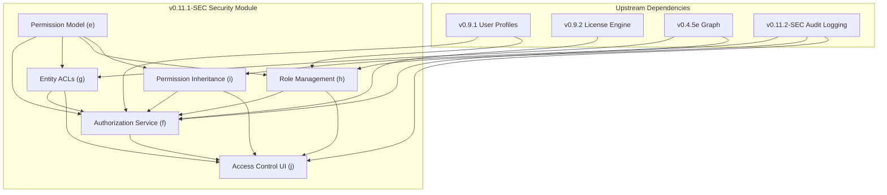

# LCS-DES-111-SEC-INDEX: Design Specification Index — Access Control & Authorization v0.11.1

## Document Control

| Field | Value |
| :--- | :--- |
| **Document ID** | LCS-DES-111-SEC-INDEX |
| **Project** | CKVS Knowledge Graph System |
| **Version** | v0.11.1 |
| **Codename** | Access Control & Authorization (Security Phase 1) |
| **Status** | Draft |
| **Last Updated** | 2026-01-31 |
| **Owner** | Security Architect |
| **Parent Scope** | [LCS-SBD-111-SEC](./LCS-SBD-111-SEC.md) |

---

## 1. Overview

This index organizes all design specifications for CKVS v0.11.1-SEC (Access Control & Authorization). The security system is decomposed into six focused sub-specifications, each addressing a distinct component of the authorization architecture.

**Total Effort:** 44 hours
**Target Delivery:** Q1 2026
**Dependencies:** v0.9.1 (User Profiles), v0.9.2 (License Engine), v0.4.5e (Graph)

---

## 2. Design Specification Index

### 2.1 Complete Specification List

| ID | Sub-Part | Title | Hours | Status | Link |
| :--- | :--- | :--- | :--- | :--- | :--- |
| `LCS-DES-111-SEC-e` | v0.11.1e | Permission Model | 6 | Draft | [Read](./LCS-DES-111-SEC-e.md) |
| `LCS-DES-111-SEC-f` | v0.11.1f | Authorization Service | 10 | Draft | [Read](./LCS-DES-111-SEC-f.md) |
| `LCS-DES-111-SEC-g` | v0.11.1g | Entity-Level ACLs | 8 | Draft | [Read](./LCS-DES-111-SEC-g.md) |
| `LCS-DES-111-SEC-h` | v0.11.1h | Role Management | 6 | Draft | [Read](./LCS-DES-111-SEC-h.md) |
| `LCS-DES-111-SEC-i` | v0.11.1i | Permission Inheritance | 8 | Draft | [Read](./LCS-DES-111-SEC-i.md) |
| `LCS-DES-111-SEC-j` | v0.11.1j | Access Control UI | 6 | Draft | [Read](./LCS-DES-111-SEC-j.md) |

---

## 3. Architecture Overview

### 3.1 System Architecture Diagram

```
┌─────────────────────────────────────────────────────────────────┐
│                       CKVS Application Layer                     │
│  (Entities, Relationships, Claims, Axioms, Validation, etc.)    │
└────────┬─────────────────────────────────────────────────────────┘
         │
         │ AuthorizeAsync(request)
         │
┌────────▼──────────────────────────────────────────────────────────┐
│              Authorization Service (v0.11.1f)                     │
│  Entry point for all permission checks                           │
│  Coordinates RBAC, ACL, and ABAC evaluation                      │
└──┬──────────┬──────────────────┬─────────────┬──────────────────┬─┘
   │          │                  │             │                  │
   │          │                  │             │                  │
┌──▼─┐   ┌───▼────┐      ┌──────▼────┐  ┌────▼────┐      ┌──────▼──────┐
│    │   │        │      │           │  │         │      │            │
│RBAC│   │  ACLs  │      │ Policies  │  │License  │      │Inheritance │
│    │   │        │      │(ABAC)     │  │ Checks  │      │ Evaluator  │
└──┬─┘   └───┬────┘      └──────┬────┘  └────┬────┘      └──────┬──────┘
   │         │                  │            │                  │
   │         │                  │            │                  │
   │      ┌──▼─┐            ┌───▼────┐      │            ┌──────▼────┐
   │      │    │            │        │      │            │           │
   │      │ACL │            │Policy  │      │            │ Graph     │
   │      │Eval│            │Engine  │      │            │ Relation- │
   │      │    │            │        │      │            │ ships     │
   │      └────┘            └────────┘      │            └───────────┘
   │                                        │
   └────────────────────────────────────────┘
         Permission Evaluation Layers
         (RBAC → ACL → ABAC → Aggregation)
```

### 3.2 Component Dependencies



### 3.3 Permission Evaluation Architecture

```
┌─────────────────────────────────────────────────────────┐
│                   Authorization Request                 │
│  (User, Permission, Resource, Context)                  │
└────────────────────┬────────────────────────────────────┘
                     │
                     ▼
        ┌────────────────────────┐
        │   Security Context     │
        │   (Current User)       │
        └────────────┬───────────┘
                     │
        ┌────────────▼───────────┐
        │  Admin Bypass Check    │ ──► Allow (User is Admin)
        └────────────┬───────────┘
                     │ Not Admin
                     ▼
        ┌────────────────────────┐
        │ License Tier Check     │ ──► Deny (Insufficient Tier)
        └────────────┬───────────┘
                     │ Licensed
                     ▼
   ╔═════════════════════════════════════════════════════════╗
   ║            MULTI-LAYER EVALUATION                        ║
   ║        (Parallel Evaluation with Caching)               ║
   ╠══════════╦══════════╦═════════════╦═════════════════════╣
   ║ RBAC     ║ ACL      ║ ABAC Policy ║ Inheritance         ║
   ║ Evaluator║ Evaluator║ Evaluator   ║ Evaluator           ║
   ╚══════════╩══════════╩═════════════╩═════════════════════╝
                     │
                     │ All results gathered
                     ▼
        ┌────────────────────────┐
        │  Permission Aggregation│
        │  Deny Wins Strategy    │
        └────────────┬───────────┘
                     │
                     ▼
        ┌────────────────────────┐
        │  Audit Logging         │
        │  (Success/Failure)     │
        └────────────┬───────────┘
                     │
                     ▼
        ┌────────────────────────┐
        │  Return Result         │
        │  (Authorized/Denied)   │
        └────────────────────────┘
```

---

## 4. Specification Details

### 4.1 LCS-DES-111-SEC-e: Permission Model (6 hours)

**Scope:** Define all permissions, roles, and permission structures
**Key Deliverables:**
- `Permission` enum with 24 flags covering all operations
- `Role` record for role definitions
- `BuiltInRoles` static class (Viewer, Contributor, Editor, Admin)
- `PolicyRule` for ABAC policies
- Permission composition helpers and extension methods

**Depends On:** Permission model is foundational; no internal dependencies
**Depended On By:** All other components (f, g, h, i, j)

**See:** [LCS-DES-111-SEC-e.md](./LCS-DES-111-SEC-e.md)

---

### 4.2 LCS-DES-111-SEC-f: Authorization Service (10 hours)

**Scope:** Core permission evaluation engine
**Key Deliverables:**
- `IAuthorizationService` interface
- Multi-layer evaluation (RBAC → ACL → ABAC → Aggregation)
- In-memory caching with smart invalidation
- Permission filtering for collections
- `AuthorizationResult` with denial reasons

**Depends On:**
- Permission model (e)
- Entity ACLs (g)
- Role Management (h)
- License context (v0.9.2)
- User profiles (v0.9.1)

**Depended On By:**
- Access Control UI (j)
- Application layer (all protected endpoints)

**See:** [LCS-DES-111-SEC-f.md](./LCS-DES-111-SEC-f.md)

---

### 4.3 LCS-DES-111-SEC-g: Entity-Level ACLs (8 hours)

**Scope:** Per-entity access control lists
**Key Deliverables:**
- `EntityAcl` record for entity access control
- `AclEntry` for individual grants/denials
- ACL evaluation algorithm with inheritance
- Expiration support (time-limited entries)
- `IAclEvaluator` interface

**Depends On:**
- Permission model (e)
- Graph relationships (v0.4.5e)
- Role Management (h) for role validation

**Depended On By:**
- Authorization Service (f)
- Permission Inheritance (i)
- Access Control UI (j)

**See:** [LCS-DES-111-SEC-g.md](./LCS-DES-111-SEC-g.md)

---

### 4.4 LCS-DES-111-SEC-h: Role Management (6 hours)

**Scope:** Create and manage roles and assignments
**Key Deliverables:**
- `IRoleService` interface
- Built-in role protection (immutable, cannot be deleted)
- Custom role CRUD operations
- Role assignment and revocation
- `RoleAssignment` with expiration support
- `RoleBuilder` fluent API

**Depends On:**
- Permission model (e)
- User profiles (v0.9.1)
- Audit logging (v0.11.2-SEC)

**Depended On By:**
- Authorization Service (f)
- Access Control UI (j)

**See:** [LCS-DES-111-SEC-h.md](./LCS-DES-111-SEC-h.md)

---

### 4.5 LCS-DES-111-SEC-i: Permission Inheritance (8 hours)

**Scope:** Permission inheritance through entity relationships
**Key Deliverables:**
- `InheritancePattern` enum (Strict, Override, Union)
- `InheritanceChain` for tracing permissions
- `IInheritanceEvaluator` interface
- Circular inheritance detection
- Ancestor/descendant traversal

**Depends On:**
- Permission model (e)
- Entity ACLs (g)
- Graph relationships (v0.4.5e)

**Depended On By:**
- Authorization Service (f)
- Access Control UI (j)

**See:** [LCS-DES-111-SEC-i.md](./LCS-DES-111-SEC-i.md)

---

### 4.6 LCS-DES-111-SEC-j: Access Control UI (6 hours)

**Scope:** Administrative interface for permission management
**Key Deliverables:**
- Entity Access Control panel (ACL editor)
- Role Management interface
- Effective Permissions viewer
- Permission Inheritance visualization
- Audit Log viewer
- RESTful API endpoints (Controllers)

**Depends On:**
- Authorization Service (f)
- Role Management (h)
- Entity ACLs (g)
- Permission Inheritance (i)
- Audit logging (v0.11.2-SEC)

**See:** [LCS-DES-111-SEC-j.md](./LCS-DES-111-SEC-j.md)

---

## 5. Key Concepts & Terminology

### 5.1 Core Concepts

| Term | Definition | Example |
| :--- | :--- | :--- |
| **Permission** | A specific operation on a resource | `EntityRead`, `ClaimWrite` |
| **Role** | Named set of permissions | `"Editor"` = `{EntityRead, EntityWrite, AxiomWrite}` |
| **Principal** | User, team, role, or service account | `bob@company.com`, `api-team`, `ci-bot` |
| **ACL Entry** | Grant or deny permissions to a principal for a resource | `bob → EntityRead, EntityWrite` on Entity A |
| **Policy Rule** | ABAC rule that conditionally grants/denies permissions | `"PII only for DPOs"` |
| **Inheritance** | Child entity inherits permissions from parent | Entity B inherits Entity A's ACL |

### 5.2 Permission Model

**Flags-based design:** All permissions are powers of 2 for flag composition
- Single permission: `Permission.EntityRead`
- Multiple permissions: `Permission.EntityRead | Permission.EntityWrite`
- Composite permissions: `Permission.Contributor` = `ReadOnly | Write`

**Built-in Roles:**
1. **Viewer:** Read-only (`Permission.ReadOnly`)
2. **Contributor:** Read + Write, no admin (`Permission.Contributor`)
3. **Editor:** Read + Write + Axiom operations (`Permission.Contributor | AxiomWrite | ...`)
4. **Admin:** All permissions (`Permission.Admin`)

### 5.3 Evaluation Layers

**RBAC (Role-Based Access Control):**
- User roles → role permissions
- Simple, fast, built on flags

**ACL (Access Control Lists):**
- Per-entity entries for specific principals
- Overrides or refines role permissions
- Supports expiration

**ABAC (Attribute-Based Access Control):**
- Policy rules with condition expressions
- Fine-grained based on resource/user attributes
- Slowest but most flexible

**Aggregation Strategy:** Deny wins
- If any layer denies, request is denied
- Permissions are intersected, not unioned
- Explicit denials block inherited permissions

---

## 6. Authorization Flow Example

### 6.1 Scenario: User Access Request

```
User: bob@company.com
Action: Read entity "UserService"
Time: 2026-01-31 14:30:00 UTC

STEP 1: Get Current User
  ├─ User ID: 550e8400-e29b-41d4-a716-446655440000
  └─ User Roles: [Contributor, API-Team-Member]

STEP 2: Admin Check
  └─ Is Admin? No → continue

STEP 3: License Check
  └─ Tier: Teams → Supports RBAC/ACL → continue

STEP 4: RBAC Evaluation
  ├─ Contributor: EntityRead | ... = ✓ EntityRead
  ├─ API-Team-Member: EntityRead | ... = ✓ EntityRead
  └─ Combined RBAC perms: ✓ EntityRead

STEP 5: Entity ACL Evaluation
  ├─ Entity "UserService" ACL:
  │  ├─ Owner: alice@company.com
  │  ├─ Entry 1: bob@company.com → Allow: Read, Write
  │  ├─ Entry 2: External-Auditors → Allow: Read, Deny: Write
  │  └─ Entry 3: ci-bot → Allow: Read
  ├─ Match bob's entries: Entry 1
  └─ ACL perms for bob: ✓ EntityRead, ✓ EntityWrite

STEP 6: RBAC + ACL Intersection
  └─ Final: (RBAC & ACL) = ✓ EntityRead

STEP 7: ABAC Policy Evaluation
  ├─ Policy 1: "Restrict PII"
  │  ├─ Condition: resource.tags CONTAINS "pii" AND NOT user.roles CONTAINS "DPO"
  │  ├─ Entity tags: ["internal", "domain-model"]
  │  └─ Matches? No → Skip
  ├─ Policy 2: "Editor bypass"
  │  ├─ Condition: user.roles CONTAINS "Editor"
  │  ├─ User roles: [Contributor, API-Team-Member]
  │  └─ Matches? No → Skip
  └─ No policies apply

STEP 8: Final Decision
  ├─ Effective perms: ✓ EntityRead
  ├─ Requested: EntityRead
  ├─ Can perform? YES ✓
  └─ Applied sources: RBAC (Contributor), ACL (bob's entry)

STEP 9: Audit Log
  └─ Logged: "Authorization: ALLOW, EntityRead on UserService, bob@company.com, via Contributor role and ACL entry"

RESULT: Access Granted
```

### 6.2 Scenario: Denied Access

```
User: external-auditor@contractor.com
Action: Write entity "UserService"
Time: 2026-01-31 14:45:00 UTC

STEP 1: Get User Info
  └─ User ID: 660e8400-e29b-41d4-a716-446655440001
  └─ User Roles: [External-Auditors, Contractor]

STEP 2-4: (Admin check, License check - both pass)

STEP 5: RBAC Evaluation
  ├─ External-Auditors: EntityRead only (no write)
  ├─ Contractor: EntityRead only (no write)
  └─ Combined RBAC perms: ✓ EntityRead only

STEP 6: Entity ACL Evaluation
  ├─ Entity "UserService" ACL:
  │  └─ Entry 2: External-Auditors → Allow: Read, Deny: Write
  ├─ Match external-auditor: Entry 2 (via role)
  └─ ACL: ✓ EntityRead, ✗ EntityWrite (explicit deny)

STEP 7: RBAC + ACL Intersection
  ├─ RBAC: ✓ EntityRead
  ├─ ACL: ✓ EntityRead, ✗ EntityWrite
  └─ Final: ✓ EntityRead only

STEP 8: ABAC Policy Evaluation (skipped - already have no write)

STEP 9: Final Decision
  ├─ Requested: EntityWrite
  ├─ Effective perms: ✓ EntityRead only
  ├─ Can perform? NO ✗
  └─ Denial reason: EntityRestricted (ACL explicitly denies write)

STEP 10: Audit Log
  └─ Logged: "Authorization: DENY, EntityWrite on UserService, external-auditor@contractor.com, reason: EntityRestricted (ACL denies)"

RESULT: Access Denied → 403 Forbidden
```

---

## 7. Implementation Timeline

### Phase 1: Foundation (Weeks 1-2, 12 hours)
- [x] Permission Model (e) - 6 hours
- [ ] Authorization Service stub (f) - 6 hours

### Phase 2: Core Evaluation (Weeks 3-4, 16 hours)
- [ ] Entity ACLs (g) - 8 hours
- [ ] Complete Authorization Service (f) - 8 hours

### Phase 3: Management Layer (Weeks 5-6, 12 hours)
- [ ] Role Management (h) - 6 hours
- [ ] Permission Inheritance (i) - 6 hours

### Phase 4: Integration (Week 7, 4 hours)
- [ ] Access Control UI (j) - 6 hours
- [ ] Integration testing - (not in 44-hour estimate)

---

## 8. Testing Strategy

### 8.1 Test Coverage by Component

| Component | Unit Tests | Integration | E2E |
| :--- | :--- | :--- | :--- |
| Permission Model (e) | High | Low | N/A |
| Authorization Service (f) | High | High | High |
| Entity ACLs (g) | High | High | High |
| Role Management (h) | High | Medium | Medium |
| Permission Inheritance (i) | High | High | Medium |
| Access Control UI (j) | Medium | High | High |

### 8.2 Key Test Scenarios

```
1. Basic RBAC
   ✓ User with Viewer role can read but not write
   ✓ User with Contributor role can read and write
   ✓ User with Editor role can access axioms

2. ACL Override
   ✓ ACL can restrict role permissions
   ✓ ACL can grant additional permissions (within role)
   ✓ Explicit deny in ACL blocks inherited permissions

3. Inheritance
   ✓ Child inherits from parent (strict pattern)
   ✓ Child can override parent (override pattern)
   ✓ Child accumulates permissions (union pattern)

4. Policy Rules
   ✓ Policies can grant conditional permissions
   ✓ Policies can deny based on attributes
   ✓ Deny policies take precedence

5. Circular Detection
   ✓ Circular parent references are prevented
   ✓ Circular inheritance chains are detected

6. Performance
   ✓ Permission check <10ms (P95)
   ✓ Filter 1000 items <100ms
   ✓ Cache hit rate >90%
```

---

## 9. Security Considerations

### 9.1 Threat Mitigation

| Threat | Severity | Mitigation |
| :--- | :--- | :--- |
| Permission escalation | Critical | Deny-by-default, explicit grants only |
| ACL tampering | Critical | Audit logging, immutable audit trail |
| Policy bypass | High | Multiple evaluation layers, ordered rules |
| Cache poisoning | High | Short TTL, invalidation on changes |
| Privilege abuse | High | Comprehensive audit logging |

### 9.2 Audit Requirements

All access control changes must be logged:
- Who changed permissions (CreatedBy, ModifiedBy)
- What changed (before/after values)
- When it changed (CreatedAt, ModifiedAt)
- Why (optional Reason field)

---

## 10. License Tier Support

### 10.1 Feature Matrix

| Feature | Core | WriterPro | Teams | Enterprise |
| :--- | :--- | :--- | :--- | :--- |
| Single user (implicit admin) | ✓ | - | - | - |
| Built-in roles | - | ✓ | ✓ | ✓ |
| Custom roles | - | - | ✓ | ✓ |
| Entity ACLs | - | - | ✓ | ✓ |
| Permission inheritance | - | - | ✓ | ✓ |
| ABAC policies | - | - | - | ✓ |
| Role assignment expiration | - | - | ✓ | ✓ |
| Service accounts | - | - | - | ✓ |
| Admin UI | - | View-only | Full | Full |

---

## 11. Dependencies & Integration Points

### 11.1 Upstream Dependencies

| Component | Version | Purpose | Used By |
| :--- | :--- | :--- | :--- |
| IProfileService | v0.9.1 | User identity, roles | f, h, j |
| ILicenseContext | v0.9.2 | License tier checks | f |
| IGraphRepository | v0.4.5e | Entity relationships | g, i |
| IAuditLogService | v0.11.2-SEC | Audit trail | f, h, j |

### 11.2 Downstream Consumers

| Component | Purpose | Dependency |
| :--- | :--- | :--- |
| Entity API | Protect entity operations | AuthorizeAsync |
| Claim API | Protect claim operations | AuthorizeAsync |
| Axiom API | Protect axiom operations | AuthorizeAsync |
| Search/Filter | Filter by accessible items | FilterAccessibleAsync |

---

## 12. Glossary

| Term | Definition |
| :--- | :--- |
| **RBAC** | Role-Based Access Control - permissions granted via roles |
| **ABAC** | Attribute-Based Access Control - conditional permissions |
| **ACL** | Access Control List - per-entity permission entries |
| **Principal** | Entity requesting access (user, team, service account) |
| **Securable** | Resource that has access control (Entity, Claim, etc.) |
| **Denial Reason** | Enum categorizing why access was denied |
| **Effective Permissions** | Final permissions after all layers are evaluated |
| **Permission Flag** | Single bit in the Permission enum (power of 2) |
| **Inheritance Chain** | Path from root entity to current entity |
| **Circular Inheritance** | Invalid state where parent references child |

---

## 13. Reference Documents

### 13.1 Scope Document
- [LCS-SBD-111-SEC: Scope Overview](./LCS-SBD-111-SEC.md)

### 13.2 Related Versions
- [v0.9.1: User Profiles & Authentication](../v0.9.x/v0.9.1/LCS-SBD-091-AUTH.md)
- [v0.9.2: License Engine](../v0.9.x/v0.9.2/LCS-SBD-092-LIC.md)
- [v0.11.2-SEC: Audit Logging](./LCS-SBD-111-SEC-AUDIT.md) [Planned]

### 13.3 Architecture Reference
- [CKVS Architecture Overview](../../ARCHITECTURE.md)
- [Module Structure](../../MODULES.md)

---

## 14. Revision History

| Version | Date | Author | Changes |
| :--- | :--- | :--- | :--- |
| 1.0 | 2026-01-31 | Security Architect | Initial index with all 6 sub-specifications |

---

## 15. Quick Navigation

### By Component
- **Permission Model** → [LCS-DES-111-SEC-e.md](./LCS-DES-111-SEC-e.md)
- **Authorization Service** → [LCS-DES-111-SEC-f.md](./LCS-DES-111-SEC-f.md)
- **Entity ACLs** → [LCS-DES-111-SEC-g.md](./LCS-DES-111-SEC-g.md)
- **Role Management** → [LCS-DES-111-SEC-h.md](./LCS-DES-111-SEC-h.md)
- **Permission Inheritance** → [LCS-DES-111-SEC-i.md](./LCS-DES-111-SEC-i.md)
- **Access Control UI** → [LCS-DES-111-SEC-j.md](./LCS-DES-111-SEC-j.md)

### By Topic
- **API Interfaces** → Components f, g, h, i, j (Section 4)
- **Data Types** → Components e, f, g, h, i, j (Section 4)
- **Implementation** → Components e, f, g, h, i, j (Section 6)
- **Testing** → Components e, f, g, h, i, j (Section 8)
- **Performance** → Components f, g, i, j (Section 9)

---

**End of Index**
