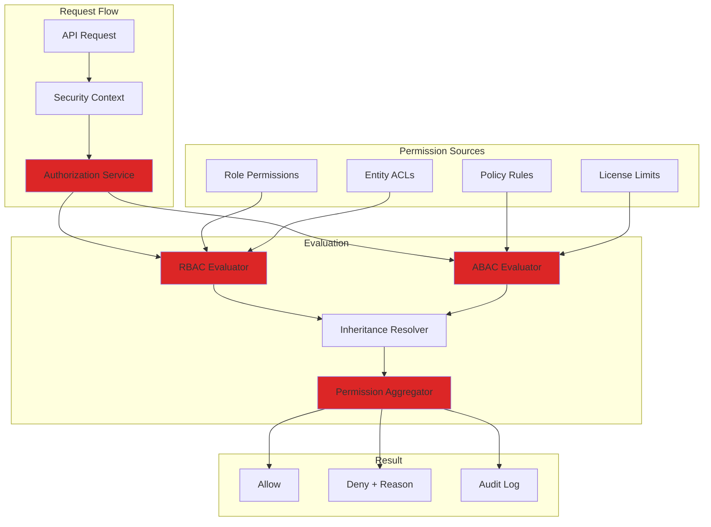
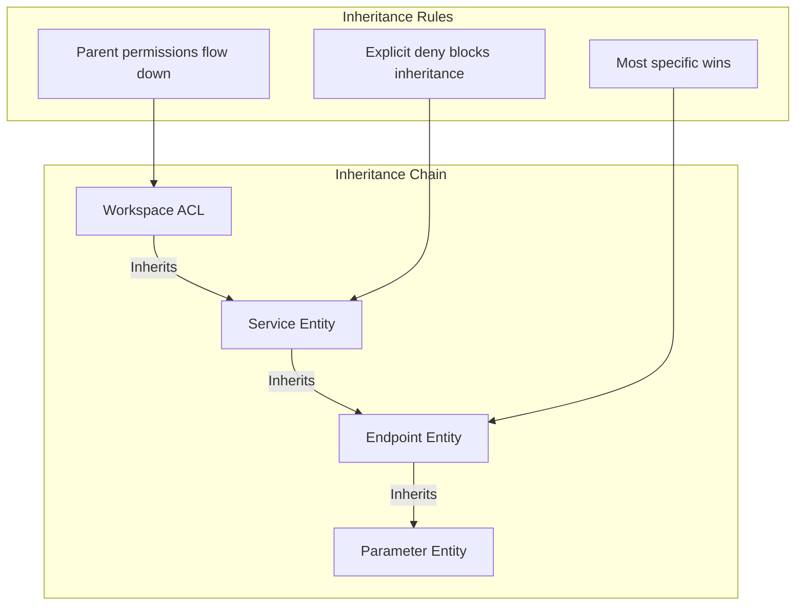

# LCS-SBD-111-SEC: Scope Overview — Access Control & Authorization

## Document Control

| Field            | Value                                                        |
| :--------------- | :----------------------------------------------------------- |
| **Document ID**  | LCS-SBD-111-SEC                                              |
| **Version**      | v0.11.1                                                      |
| **Codename**     | Access Control & Authorization (Security Phase 1)            |
| **Status**       | Draft                                                        |
| **Last Updated** | 2026-01-31                                                   |
| **Owner**        | Security Architect                                           |
| **Depends On**   | v0.9.1 (User Profiles), v0.9.2 (License Engine)              |

---

## 1. Executive Summary

### 1.1 The Vision

**v0.11.1-SEC** delivers **Access Control & Authorization** — a comprehensive role-based access control (RBAC) system for the knowledge graph and all CKVS operations. This ensures:

- Users can only access entities and operations appropriate to their role
- Sensitive knowledge can be protected from unauthorized viewing
- Teams can implement least-privilege access patterns
- Compliance requirements for access segregation are met

### 1.2 Business Value

- **Security:** Prevent unauthorized access to sensitive documentation.
- **Compliance:** Meet SOC 2, ISO 27001, GDPR access control requirements.
- **Governance:** Clear ownership and accountability for knowledge.
- **Collaboration:** Enable secure multi-team knowledge sharing.
- **Audit:** Track who can access what and why.

### 1.3 Success Criteria

1. Role-based permissions for all CKVS operations.
2. Entity-level access control (read, write, delete, admin).
3. Attribute-based access control (ABAC) for fine-grained rules.
4. Permission inheritance through graph relationships.
5. Administrative UI for managing roles and permissions.
6. Permission check latency <10ms (P95).

---

## 2. Key Deliverables

### 2.1 Sub-Parts

| Sub-Part | Title | Description | Est. Hours |
|:---------|:------|:------------|:-----------|
| v0.11.1e | Permission Model | Define RBAC/ABAC permission structures | 6 |
| v0.11.1f | Authorization Service | Core permission evaluation engine | 10 |
| v0.11.1g | Entity-Level ACLs | Access control lists per entity | 8 |
| v0.11.1h | Role Management | Create and manage roles | 6 |
| v0.11.1i | Permission Inheritance | Inherit permissions through relationships | 8 |
| v0.11.1j | Access Control UI | Admin interface for permissions | 6 |
| **Total** | | | **44 hours** |

### 2.2 Key Interfaces

```csharp
/// <summary>
/// Evaluates permissions for CKVS operations.
/// </summary>
public interface IAuthorizationService
{
    /// <summary>
    /// Checks if the current user can perform an operation.
    /// </summary>
    Task<AuthorizationResult> AuthorizeAsync(
        AuthorizationRequest request,
        CancellationToken ct = default);

    /// <summary>
    /// Gets all permissions for the current user.
    /// </summary>
    Task<UserPermissions> GetUserPermissionsAsync(
        Guid? userId = null,
        CancellationToken ct = default);

    /// <summary>
    /// Filters a collection to only accessible items.
    /// </summary>
    Task<IReadOnlyList<T>> FilterAccessibleAsync<T>(
        IReadOnlyList<T> items,
        Permission requiredPermission,
        CancellationToken ct = default) where T : ISecurable;
}

public record AuthorizationRequest
{
    public Guid? UserId { get; init; }
    public Permission Permission { get; init; }
    public Guid? ResourceId { get; init; }
    public ResourceType? ResourceType { get; init; }
    public IReadOnlyDictionary<string, object>? Context { get; init; }
}

public record AuthorizationResult
{
    public bool IsAuthorized { get; init; }
    public DenialReason? DenialReason { get; init; }
    public string? DenialMessage { get; init; }
    public IReadOnlyList<string> AppliedPolicies { get; init; } = [];
}

public enum DenialReason
{
    NoPermission,
    InsufficientRole,
    EntityRestricted,
    PolicyViolation,
    LicenseRestriction,
    RateLimited
}

/// <summary>
/// All CKVS permissions.
/// </summary>
[Flags]
public enum Permission
{
    None = 0,

    // Entity permissions
    EntityRead = 1 << 0,
    EntityWrite = 1 << 1,
    EntityDelete = 1 << 2,
    EntityAdmin = 1 << 3,

    // Relationship permissions
    RelationshipRead = 1 << 4,
    RelationshipWrite = 1 << 5,
    RelationshipDelete = 1 << 6,

    // Claim permissions
    ClaimRead = 1 << 7,
    ClaimWrite = 1 << 8,
    ClaimValidate = 1 << 9,

    // Axiom permissions
    AxiomRead = 1 << 10,
    AxiomWrite = 1 << 11,
    AxiomExecute = 1 << 12,

    // Graph-wide permissions
    GraphExport = 1 << 13,
    GraphImport = 1 << 14,
    GraphAdmin = 1 << 15,

    // Validation permissions
    ValidationRun = 1 << 16,
    ValidationConfigure = 1 << 17,

    // Inference permissions
    InferenceRun = 1 << 18,
    InferenceConfigure = 1 << 19,

    // Version permissions
    VersionRead = 1 << 20,
    VersionRollback = 1 << 21,
    BranchCreate = 1 << 22,
    BranchMerge = 1 << 23,

    // Composite permissions
    EntityFull = EntityRead | EntityWrite | EntityDelete | EntityAdmin,
    ReadOnly = EntityRead | RelationshipRead | ClaimRead | AxiomRead,
    Contributor = ReadOnly | EntityWrite | RelationshipWrite | ClaimWrite,
    Admin = ~None
}

public enum ResourceType
{
    Entity,
    Relationship,
    Claim,
    Axiom,
    Document,
    Branch,
    Workflow,
    Global
}

/// <summary>
/// A role with a set of permissions.
/// </summary>
public record Role
{
    public Guid RoleId { get; init; }
    public required string Name { get; init; }
    public string? Description { get; init; }
    public Permission Permissions { get; init; }
    public RoleType Type { get; init; }
    public bool IsBuiltIn { get; init; }
    public IReadOnlyList<PolicyRule>? Policies { get; init; }
}

public enum RoleType
{
    Global,     // Applies to all resources
    EntityType, // Applies to specific entity types
    Workspace,  // Applies to workspace scope
    Custom      // User-defined scope
}

/// <summary>
/// Built-in roles.
/// </summary>
public static class BuiltInRoles
{
    public static Role Viewer => new()
    {
        RoleId = Guid.Parse("00000000-0000-0000-0000-000000000001"),
        Name = "Viewer",
        Description = "Can view entities, relationships, and claims",
        Permissions = Permission.ReadOnly,
        Type = RoleType.Global,
        IsBuiltIn = true
    };

    public static Role Contributor => new()
    {
        RoleId = Guid.Parse("00000000-0000-0000-0000-000000000002"),
        Name = "Contributor",
        Description = "Can view and edit entities and claims",
        Permissions = Permission.Contributor | Permission.ValidationRun,
        Type = RoleType.Global,
        IsBuiltIn = true
    };

    public static Role Editor => new()
    {
        RoleId = Guid.Parse("00000000-0000-0000-0000-000000000003"),
        Name = "Editor",
        Description = "Full edit access including axioms and inference",
        Permissions = Permission.Contributor | Permission.AxiomWrite |
                      Permission.InferenceRun | Permission.VersionRead,
        Type = RoleType.Global,
        IsBuiltIn = true
    };

    public static Role Admin => new()
    {
        RoleId = Guid.Parse("00000000-0000-0000-0000-000000000004"),
        Name = "Admin",
        Description = "Full administrative access",
        Permissions = Permission.Admin,
        Type = RoleType.Global,
        IsBuiltIn = true
    };
}

/// <summary>
/// Access control list for an entity.
/// </summary>
public record EntityAcl
{
    public Guid EntityId { get; init; }
    public Guid? OwnerId { get; init; }
    public AccessLevel DefaultAccess { get; init; } = AccessLevel.Inherit;
    public IReadOnlyList<AclEntry> Entries { get; init; } = [];
    public bool InheritFromParent { get; init; } = true;
}

public record AclEntry
{
    public Guid PrincipalId { get; init; }
    public PrincipalType PrincipalType { get; init; }
    public Permission AllowedPermissions { get; init; }
    public Permission DeniedPermissions { get; init; }
    public DateTimeOffset? ExpiresAt { get; init; }
}

public enum PrincipalType { User, Role, Team, ServiceAccount }

public enum AccessLevel
{
    None,       // No access
    Read,       // Read only
    Write,      // Read and write
    Full,       // All permissions
    Inherit     // Inherit from parent
}

/// <summary>
/// Attribute-based policy rule.
/// </summary>
public record PolicyRule
{
    public Guid RuleId { get; init; }
    public required string Name { get; init; }
    public required string Condition { get; init; }  // Expression language
    public PolicyEffect Effect { get; init; }
    public Permission? GrantPermissions { get; init; }
    public Permission? DenyPermissions { get; init; }
    public int Priority { get; init; } = 100;
}

public enum PolicyEffect { Allow, Deny }
```

### 2.3 Authorization Architecture



---

## 3. Permission Evaluation Flow

```mermaid
sequenceDiagram
    participant Client
    participant API as API Layer
    participant AUTH as Authorization Service
    participant RBAC as RBAC Evaluator
    participant ACL as ACL Store
    participant POL as Policy Engine
    participant AUD as Audit Log

    Client->>API: Request (e.g., GET /entities/123)

    API->>AUTH: AuthorizeAsync(EntityRead, entity:123)

    AUTH->>AUTH: Get current user context

    par Evaluate RBAC
        AUTH->>RBAC: Check role permissions
        RBAC->>RBAC: User roles → permissions
    and Evaluate ACLs
        AUTH->>ACL: Get entity ACL
        ACL->>ACL: Check user in ACL entries
    and Evaluate Policies
        AUTH->>POL: Evaluate ABAC policies
        POL->>POL: Match conditions
    end

    RBAC-->>AUTH: Role permissions
    ACL-->>AUTH: ACL permissions
    POL-->>AUTH: Policy effect

    AUTH->>AUTH: Aggregate (deny wins)

    AUTH->>AUD: Log decision

    alt Authorized
        AUTH-->>API: Allow
        API-->>Client: 200 OK + data
    else Denied
        AUTH-->>API: Deny (reason)
        API-->>Client: 403 Forbidden
    end
```



---

## 4. Permission Inheritance



**Inheritance Rules:**
1. Child entities inherit permissions from parents via relationships
2. Explicit ACL entries override inherited permissions
3. Deny always wins over Allow at same level
4. Most specific permission takes precedence

---

## 5. Access Control UI

```
┌────────────────────────────────────────────────────────────────┐
│ Access Control: UserService                         [Close]    │
├────────────────────────────────────────────────────────────────┤
│                                                                │
│ Owner: alice@company.com                    [Change Owner]     │
│                                                                │
│ Default Access: [Inherit from Workspace ▼]                    │
│ ☑ Inherit permissions from parent entities                    │
│                                                                │
│ ═══════════════════════════════════════════════════════════   │
│ Access Control Entries                                         │
│ ═══════════════════════════════════════════════════════════   │
│                                                                │
│ ┌────────────────────────────────────────────────────────────┐ │
│ │ Principal          │ Type  │ Allow      │ Deny   │ Expires │ │
│ ├────────────────────────────────────────────────────────────┤ │
│ │ API Team           │ Team  │ Full       │ —      │ —       │ │
│ │ bob@company.com    │ User  │ Read/Write │ Delete │ —       │ │
│ │ External Auditors  │ Role  │ Read       │ —      │ 30 days │ │
│ │ ci-service-account │ Svc   │ Read       │ —      │ —       │ │
│ └────────────────────────────────────────────────────────────┘ │
│                                                                │
│ [+ Add Entry]                                                  │
│                                                                │
│ ═══════════════════════════════════════════════════════════   │
│ Effective Permissions (for current user)                       │
│ ═══════════════════════════════════════════════════════════   │
│                                                                │
│ ☑ Read   ☑ Write   ☐ Delete   ☐ Admin                        │
│                                                                │
│ Applied through:                                               │
│ ├── Role: Editor (EntityRead, EntityWrite)                    │
│ └── ACL: API Team (Full)                                      │
│                                                                │
│ [Cancel] [Save Changes]                                        │
└────────────────────────────────────────────────────────────────┘
```

---

## 6. Role Management UI

```
┌────────────────────────────────────────────────────────────────┐
│ Role Management                                     [+ New]    │
├────────────────────────────────────────────────────────────────┤
│                                                                │
│ Built-in Roles:                                                │
│ ┌────────────────────────────────────────────────────────────┐ │
│ │ 👤 Viewer                                         [View]   │ │
│ │    Can view entities, relationships, and claims           │ │
│ │    Permissions: EntityRead, RelationshipRead, ClaimRead   │ │
│ ├────────────────────────────────────────────────────────────┤ │
│ │ ✏️ Contributor                                    [View]   │ │
│ │    Can view and edit entities and claims                  │ │
│ │    Permissions: ReadOnly + Write permissions              │ │
│ ├────────────────────────────────────────────────────────────┤ │
│ │ 📝 Editor                                         [View]   │ │
│ │    Full edit access including axioms and inference        │ │
│ │    Permissions: Contributor + Axiom + Inference           │ │
│ ├────────────────────────────────────────────────────────────┤ │
│ │ 🔑 Admin                                          [View]   │ │
│ │    Full administrative access                             │ │
│ │    Permissions: All                                       │ │
│ └────────────────────────────────────────────────────────────┘ │
│                                                                │
│ Custom Roles:                                                  │
│ ┌────────────────────────────────────────────────────────────┐ │
│ │ 📋 API Reviewer                          [Edit] [Delete]   │ │
│ │    Can review and validate API documentation              │ │
│ │    Permissions: ReadOnly + ValidationRun                  │ │
│ │    Members: 5 users                                       │ │
│ ├────────────────────────────────────────────────────────────┤ │
│ │ 🔒 Security Auditor                      [Edit] [Delete]   │ │
│ │    Read-only access with audit log viewing                │ │
│ │    Permissions: ReadOnly + AuditRead                      │ │
│ │    Policy: EntityType = "Endpoint" AND hasAuth = true     │ │
│ │    Members: 2 users                                       │ │
│ └────────────────────────────────────────────────────────────┘ │
│                                                                │
└────────────────────────────────────────────────────────────────┘
```

---

## 7. Policy Language

```yaml
# Example ABAC Policies

policies:
  - id: restrict-pii-entities
    name: "Restrict PII Entities"
    description: "Only data protection officers can access PII-tagged entities"
    condition: |
      resource.tags CONTAINS "pii" AND
      NOT user.roles CONTAINS "DataProtectionOfficer"
    effect: deny
    priority: 10

  - id: time-restricted-access
    name: "Business Hours Only"
    description: "External contractors can only access during business hours"
    condition: |
      user.type = "contractor" AND
      (NOW().hour < 9 OR NOW().hour > 17)
    effect: deny
    priority: 20

  - id: entity-type-restriction
    name: "Database Entity Restriction"
    description: "Only DBAs can modify database entities"
    condition: |
      resource.type = "Database" AND
      permission IN ["EntityWrite", "EntityDelete"] AND
      NOT user.roles CONTAINS "DBA"
    effect: deny
    priority: 30

  - id: auto-approve-own-entities
    name: "Owner Full Access"
    description: "Entity owners have full access to their entities"
    condition: |
      resource.ownerId = user.id
    effect: allow
    permissions: [EntityFull]
    priority: 100
```

---

## 8. Dependencies

| Component | Source | Usage |
|:----------|:-------|:------|
| `IProfileService` | v0.9.1 | User identity |
| `ILicenseContext` | v0.9.2 | License-based restrictions |
| `IGraphRepository` | v0.4.5e | Entity metadata |
| `IAuditLogService` | v0.11.2-SEC | Log decisions |
| `IMediator` | v0.0.7a | Permission events |

---

## 9. License Gating

| Tier | Access Control |
|:-----|:---------------|
| Core | Single user (no RBAC) |
| WriterPro | Basic roles (Viewer, Editor) |
| Teams | Full RBAC + custom roles |
| Enterprise | RBAC + ABAC + policies |

---

## 10. Performance Targets

| Metric | Target | Measurement |
|:-------|:-------|:------------|
| Permission check | <10ms | P95 timing |
| ACL lookup | <5ms | P95 timing |
| Policy evaluation | <20ms | P95 timing |
| Filter 1000 items | <100ms | P95 timing |

---

## 11. Security Considerations

| Concern | Mitigation |
|:--------|:-----------|
| Permission escalation | Deny-by-default, explicit grants only |
| ACL tampering | Signed ACL entries, audit logging |
| Policy bypass | Multiple evaluation layers |
| Cache poisoning | Short TTL, invalidation on changes |

---

## 12. Risks & Mitigations

| Risk | Mitigation |
|:-----|:-----------|
| Performance overhead | Caching, lazy evaluation |
| Complex permission debugging | Effective permission UI, explain mode |
| Orphaned permissions | Cleanup on entity deletion |
| Migration from no-auth | Gradual rollout, permissive defaults |

---
