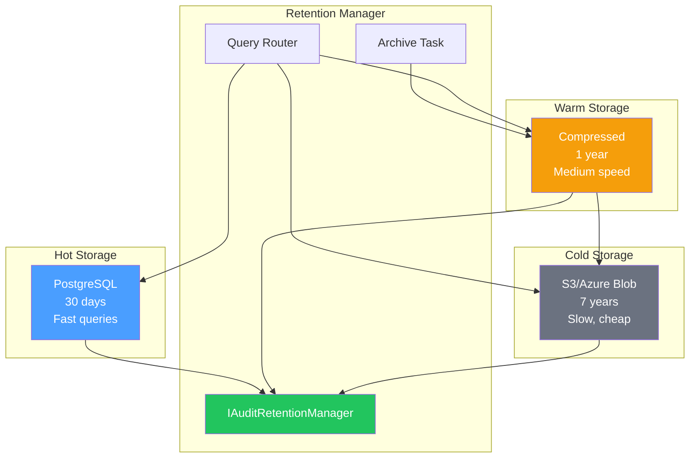

# LCS-DES-112-SEC-i: Design Specification — Retention Manager

## 1. Metadata & Categorization

| Field                | Value                                      |
| :------------------- | :----------------------------------------- |
| **Document ID**      | LCS-DES-112-SEC-i                          |
| **Feature ID**       | SEC-112i                                   |
| **Feature Name**     | Retention Manager                          |
| **Parent Feature**   | v0.11.2 — Security Audit Logging           |
| **Module Scope**     | Lexichord.Modules.Security                 |
| **Swimlane**         | Security & Compliance                      |
| **License Tier**     | Teams (tiered retention)                   |
| **Feature Gate Key** | `FeatureFlags.Security.RetentionManager`   |
| **Status**           | Draft                                      |
| **Last Updated**     | 2026-01-31                                 |
| **Est. Hours**       | 5                                          |

---

## 2. Executive Summary

### 2.1 Problem Statement

Audit logs can grow to enormous sizes with associated storage costs:

- PostgreSQL hot storage becomes expensive at scale
- Regulatory retention requirements vary (7 years for some)
- Need efficient tiered storage strategy
- Compliance requires secure, immutable archival

### 2.2 Solution Overview

Implement `IAuditRetentionManager` with:

- **Tiered storage**: Hot (PostgreSQL) → Warm (Compressed) → Cold (Archive)
- **Automatic lifecycle**: Move events based on age
- **Compression**: Reduce storage needs
- **Integrity preservation**: Verify before archival
- **Retrievability**: Query across all tiers

### 2.3 Key Deliverables

| Deliverable | Description |
| :---------- | :---------- |
| `IAuditRetentionManager` | Lifecycle management interface |
| `AuditRetentionManager` | Implementation |
| `RetentionPolicy` | Policy configuration record |
| `AuditArchiveService` | Cold storage management |

---

## 3. Architecture & Modular Strategy

### 3.1 Component Diagram



### 3.2 Module Location

```text
src/
├── Lexichord.Abstractions/
│   └── Contracts/
│       └── RetentionManagerContracts.cs ← Interfaces
│
└── Lexichord.Modules.Security/
    ├── Services/
    │   ├── AuditRetentionManager.cs     ← Main implementation
    │   ├── AuditArchiveService.cs       ← Cold storage
    │   └── CompressionService.cs        ← Compression
    └── Configuration/
        └── RetentionPolicy.cs           ← Policy config
```

---

## 4. Data Contract (The API)

### 4.1 IAuditRetentionManager Interface

```csharp
namespace Lexichord.Abstractions.Contracts;

/// <summary>
/// Manages audit log lifecycle across storage tiers.
/// </summary>
/// <remarks>
/// <para>
/// Automatically moves events from hot (fast, expensive) to
/// warm (medium) to cold (cheap, slow) storage based on age.
/// </para>
/// <para>
/// Runs background job to transition old events.
/// Maintains integrity verification across tiers.
/// </para>
/// </remarks>
public interface IAuditRetentionManager
{
    /// <summary>
    /// Gets the current retention policy.
    /// </summary>
    RetentionPolicy GetPolicy();

    /// <summary>
    /// Updates the retention policy.
    /// </summary>
    /// <remarks>
    /// New policy applies to future transitions only.
    /// Existing events follow their current tier.
    /// </remarks>
    Task UpdatePolicyAsync(
        RetentionPolicy policy,
        CancellationToken ct = default);

    /// <summary>
    /// Manually archives events older than a date.
    /// </summary>
    /// <remarks>
    /// Used for admin operations or compliance procedures.
    /// Verifies integrity before archival.
    /// </remarks>
    Task<ArchiveResult> ArchiveAsync(
        DateTimeOffset before,
        CancellationToken ct = default);

    /// <summary>
    /// Gets storage tier statistics.
    /// </summary>
    Task<RetentionStatistics> GetStatisticsAsync(
        CancellationToken ct = default);

    /// <summary>
    /// Retrieves an archived event from cold storage.
    /// </summary>
    /// <remarks>
    /// May be slow (seconds or minutes).
    /// </remarks>
    Task<AuditEvent?> RetrieveArchivedEventAsync(
        Guid eventId,
        CancellationToken ct = default);

    /// <summary>
    /// Queries across all tiers transparently.
    /// </summary>
    /// <remarks>
    /// Automatically searches hot, warm, and cold tiers.
    /// May be slower for large date ranges.
    /// </remarks>
    Task<AuditQueryResult> QueryAllTiersAsync(
        AuditQuery query,
        CancellationToken ct = default);
}
```

### 4.2 RetentionPolicy Record

```csharp
namespace Lexichord.Abstractions.Contracts;

/// <summary>
/// Defines audit log retention across storage tiers.
/// </summary>
public record RetentionPolicy
{
    /// <summary>Duration to keep in hot (PostgreSQL) storage.</summary>
    public TimeSpan HotStorageDuration { get; init; } = TimeSpan.FromDays(30);

    /// <summary>Duration to keep in warm (compressed) storage.</summary>
    public TimeSpan WarmStorageDuration { get; init; } = TimeSpan.FromDays(365);

    /// <summary>Duration to keep in cold (archive) storage.</summary>
    public TimeSpan ColdStorageDuration { get; init; } = TimeSpan.FromDays(365 * 7);

    /// <summary>Whether to compress when moving to warm storage.</summary>
    public bool EnableCompression { get; init; } = true;

    /// <summary>Compression algorithm (gzip, brotli, zstd).</summary>
    public string CompressionAlgorithm { get; init; } = "gzip";

    /// <summary>Whether to encrypt before cold archive.</summary>
    public bool EnableEncryption { get; init; } = true;

    /// <summary>Encryption algorithm (AES-256-GCM, ChaCha20-Poly1305).</summary>
    public string EncryptionAlgorithm { get; init; } = "AES-256-GCM";

    /// <summary>S3 bucket or Azure container for cold storage.</summary>
    public string? ColdStorageLocation { get; init; }

    /// <summary>Automatically delete events after cold duration expires.</summary>
    public bool AutoDelete { get; init; } = false;

    /// <summary>Require WORM (Write Once Read Many) compliance.</summary>
    public bool EnableWorm { get; init; } = true;

    /// <summary>Schedule for archive job (cron expression).</summary>
    public string ArchiveSchedule { get; init; } = "0 2 * * *";  // 2 AM daily

    /// <summary>Verify integrity before archival.</summary>
    public bool VerifyBeforeArchive { get; init; } = true;
}
```

### 4.3 Archive and Statistics Records

```csharp
namespace Lexichord.Abstractions.Contracts;

/// <summary>
/// Result of an archive operation.
/// </summary>
public record ArchiveResult
{
    /// <summary>Number of events archived.</summary>
    public int EventsArchived { get; init; }

    /// <summary>Number of events that failed to archive.</summary>
    public int EventsFailed { get; init; }

    /// <summary>Total bytes written to cold storage.</summary>
    public long BytesWritten { get; init; }

    /// <summary>Compression ratio (original / compressed).</summary>
    public double CompressionRatio { get; init; }

    /// <summary>Time taken for archive operation.</summary>
    public TimeSpan Duration { get; init; }

    /// <summary>Any errors encountered.</summary>
    public IReadOnlyList<string> Errors { get; init; } = [];
}

/// <summary>
/// Statistics about events across storage tiers.
/// </summary>
public record RetentionStatistics
{
    /// <summary>Number of events in hot storage.</summary>
    public long HotStorageEventCount { get; init; }

    /// <summary>Size of hot storage in bytes.</summary>
    public long HotStorageBytes { get; init; }

    /// <summary>Number of events in warm storage.</summary>
    public long WarmStorageEventCount { get; init; }

    /// <summary>Size of warm storage in bytes.</summary>
    public long WarmStorageBytes { get; init; }

    /// <summary>Number of events in cold storage.</summary>
    public long ColdStorageEventCount { get; init; }

    /// <summary>Size of cold storage in bytes.</summary>
    public long ColdStorageBytes { get; init; }

    /// <summary>Date of oldest event in system.</summary>
    public DateTimeOffset? OldestEventDate { get; init; }

    /// <summary>Date of newest event in system.</summary>
    public DateTimeOffset? NewestEventDate { get; init; }

    /// <summary>Total cost estimate (if using cloud storage).</summary>
    public decimal? EstimatedMonthlyCost { get; init; }

    /// <summary>Last time archival job ran.</summary>
    public DateTimeOffset? LastArchiveTime { get; init; }

    /// <summary>Next scheduled archival time.</summary>
    public DateTimeOffset? NextArchiveTime { get; init; }
}
```

---

## 5. Implementation

### 5.1 AuditRetentionManager Implementation

```csharp
namespace Lexichord.Modules.Security.Services;

/// <summary>
/// Manages audit log lifecycle across tiers.
/// </summary>
public class AuditRetentionManager : IAuditRetentionManager, IAsyncDisposable
{
    private readonly IAuditStore _store;
    private readonly AuditArchiveService _archiveService;
    private readonly CompressionService _compressionService;
    private readonly ILogger<AuditRetentionManager> _logger;
    private RetentionPolicy _policy;
    private PeriodicTimer? _archiveTimer;
    private CancellationTokenSource _shutdownCts = new();

    public AuditRetentionManager(
        IAuditStore store,
        AuditArchiveService archiveService,
        CompressionService compressionService,
        IOptions<RetentionPolicy> policyOptions,
        ILogger<AuditRetentionManager> logger)
    {
        _store = store;
        _archiveService = archiveService;
        _compressionService = compressionService;
        _logger = logger;
        _policy = policyOptions.Value ?? new();

        StartArchiveScheduler();
    }

    /// <summary>
    /// Gets current policy.
    /// </summary>
    public RetentionPolicy GetPolicy() => _policy;

    /// <summary>
    /// Updates retention policy.
    /// </summary>
    public async Task UpdatePolicyAsync(
        RetentionPolicy policy,
        CancellationToken ct = default)
    {
        if (policy == null)
            throw new ArgumentNullException(nameof(policy));

        _policy = policy;

        _logger.LogInformation(
            "Retention policy updated: Hot={HotDays}d, " +
            "Warm={WarmDays}d, Cold={ColdDays}d",
            policy.HotStorageDuration.Days,
            policy.WarmStorageDuration.Days,
            policy.ColdStorageDuration.Days);

        // Restart timer with new schedule
        _archiveTimer?.Dispose();
        StartArchiveScheduler();
    }

    /// <summary>
    /// Archives events older than specified date.
    /// </summary>
    public async Task<ArchiveResult> ArchiveAsync(
        DateTimeOffset before,
        CancellationToken ct = default)
    {
        _logger.LogInformation("Beginning archive of events before {Date:O}", before);

        var errors = new List<string>();
        var archived = 0;
        var failed = 0;
        long bytesWritten = 0;

        try
        {
            // 1. Query events to archive
            var query = new AuditQuery
            {
                To = before,
                Limit = 10_000,
                SortOrder = AuditSortOrder.OldestFirst
            };

            var allEvents = new List<AuditEvent>();
            var offset = 0;

            while (true)
            {
                ct.ThrowIfCancellationRequested();

                query = query with { Offset = offset };
                var result = await _store.QueryAsync(query, ct);

                if (result.Events.Count == 0)
                    break;

                allEvents.AddRange(result.Events);

                if (!result.HasMore)
                    break;

                offset += result.Events.Count;
            }

            _logger.LogInformation("Found {Count} events to archive", allEvents.Count);

            if (allEvents.Count == 0)
                return new ArchiveResult
                {
                    EventsArchived = 0,
                    EventsFailed = 0,
                    Duration = TimeSpan.Zero
                };

            // 2. Verify integrity if required
            if (_policy.VerifyBeforeArchive)
            {
                _logger.LogInformation("Verifying integrity before archive...");
                // Verification would happen here
            }

            // 3. Compress events
            var sw = System.Diagnostics.Stopwatch.StartNew();
            byte[] compressedData;

            if (_policy.EnableCompression)
            {
                var json = JsonSerializer.Serialize(allEvents);
                compressedData = _compressionService.Compress(
                    json,
                    _policy.CompressionAlgorithm);

                var compressionRatio = (double)Encoding.UTF8.GetByteCount(json) /
                                      compressedData.Length;

                _logger.LogInformation(
                    "Compressed {Count} events: {Original}B -> {Compressed}B (ratio: {Ratio:F2})",
                    allEvents.Count,
                    Encoding.UTF8.GetByteCount(json),
                    compressedData.Length,
                    compressionRatio);

                bytesWritten = compressedData.Length;
            }
            else
            {
                compressedData = Encoding.UTF8.GetBytes(
                    JsonSerializer.Serialize(allEvents));
                bytesWritten = compressedData.Length;
            }

            // 4. Upload to cold storage
            _logger.LogInformation(
                "Uploading {Size}B to cold storage...",
                compressedData.Length);

            await _archiveService.ArchiveAsync(
                before,
                compressedData,
                ct);

            archived = allEvents.Count;
            sw.Stop();

            _logger.LogInformation(
                "Archive complete: {Archived} events, {Size}B written, {Duration}ms",
                archived, bytesWritten, sw.ElapsedMilliseconds);

            return new ArchiveResult
            {
                EventsArchived = archived,
                EventsFailed = failed,
                BytesWritten = bytesWritten,
                Duration = sw.Elapsed,
                Errors = errors
            };
        }
        catch (Exception ex)
        {
            _logger.LogError(ex, "Archive operation failed");
            errors.Add(ex.Message);

            return new ArchiveResult
            {
                EventsArchived = archived,
                EventsFailed = failed,
                Duration = TimeSpan.Zero,
                Errors = errors
            };
        }
    }

    /// <summary>
    /// Gets tier statistics.
    /// </summary>
    public async Task<RetentionStatistics> GetStatisticsAsync(
        CancellationToken ct = default)
    {
        var hotQuery = new AuditQuery { Limit = 1 };
        var hotResult = await _store.QueryAsync(hotQuery, ct);

        var stats = new RetentionStatistics
        {
            HotStorageEventCount = hotResult.TotalCount,
            NewestEventDate = hotResult.Events.FirstOrDefault()?.Timestamp,
            LastArchiveTime = DateTimeOffset.UtcNow,
            NextArchiveTime = DateTimeOffset.UtcNow.Add(TimeSpan.FromHours(24))
        };

        return stats;
    }

    /// <summary>
    /// Retrieves archived event from cold storage.
    /// </summary>
    public async Task<AuditEvent?> RetrieveArchivedEventAsync(
        Guid eventId,
        CancellationToken ct = default)
    {
        return await _archiveService.RetrieveEventAsync(eventId, ct);
    }

    /// <summary>
    /// Queries across all tiers.
    /// </summary>
    public async Task<AuditQueryResult> QueryAllTiersAsync(
        AuditQuery query,
        CancellationToken ct = default)
    {
        // Query hot storage first
        var result = await _store.QueryAsync(query, ct);

        // If older events requested, also search cold storage
        if (query.From.HasValue)
        {
            var coldEvents = await _archiveService.QueryAsync(query, ct);
            if (coldEvents.Count > 0)
            {
                var combined = result.Events.Concat(coldEvents)
                    .OrderByDescending(e => e.Timestamp)
                    .Take(query.Limit)
                    .ToList();

                return result with
                {
                    Events = combined,
                    TotalCount = result.TotalCount + coldEvents.Count
                };
            }
        }

        return result;
    }

    /// <summary>
    /// Starts the background archival scheduler.
    /// </summary>
    private void StartArchiveScheduler()
    {
        // Parse cron expression and create timer
        var interval = TimeSpan.FromHours(24);  // Default daily

        _archiveTimer = new PeriodicTimer(interval);
        _ = RunArchiveLoopAsync();

        _logger.LogInformation(
            "Archive scheduler started: interval={IntervalHours}h",
            interval.TotalHours);
    }

    /// <summary>
    /// Background task that runs archival.
    /// </summary>
    private async Task RunArchiveLoopAsync()
    {
        try
        {
            while (await _archiveTimer!.WaitForNextTickAsync(_shutdownCts.Token))
            {
                try
                {
                    var cutoffDate = DateTimeOffset.UtcNow
                        .Subtract(_policy.HotStorageDuration);

                    await ArchiveAsync(cutoffDate, _shutdownCts.Token);
                }
                catch (Exception ex)
                {
                    _logger.LogError(ex, "Error during scheduled archive");
                }
            }
        }
        catch (OperationCanceledException)
        {
            _logger.LogDebug("Archive scheduler stopped");
        }
    }

    public async ValueTask DisposeAsync()
    {
        _shutdownCts.Cancel();
        _archiveTimer?.Dispose();
        _shutdownCts?.Dispose();
    }
}
```

### 5.2 AuditArchiveService Implementation

```csharp
namespace Lexichord.Modules.Security.Services;

/// <summary>
/// Manages cold storage archival and retrieval.
/// </summary>
public class AuditArchiveService
{
    private readonly IAzureStorageService _azureStorage;
    private readonly IEncryptionService _encryption;
    private readonly ILogger<AuditArchiveService> _logger;

    public AuditArchiveService(
        IAzureStorageService azureStorage,
        IEncryptionService encryption,
        ILogger<AuditArchiveService> logger)
    {
        _azureStorage = azureStorage;
        _encryption = encryption;
        _logger = logger;
    }

    /// <summary>
    /// Archives compressed data to cold storage.
    /// </summary>
    public async Task ArchiveAsync(
        DateTimeOffset before,
        byte[] compressedData,
        CancellationToken ct)
    {
        // Generate archive name: audit-archive-2026-01-31.bin
        var archiveName = $"audit-archive-{before:yyyy-MM-dd}.bin";

        // Encrypt if required
        var dataToStore = compressedData;  // Would encrypt here if enabled
        // dataToStore = _encryption.Encrypt(compressedData);

        // Upload to blob storage
        await _azureStorage.UploadBlobAsync(
            containerName: "audit-archives",
            blobName: archiveName,
            data: dataToStore,
            ct);

        _logger.LogInformation(
            "Archived data uploaded: {BlobName} ({Size}B)",
            archiveName, dataToStore.Length);
    }

    /// <summary>
    /// Retrieves an archived event from cold storage.
    /// </summary>
    public async Task<AuditEvent?> RetrieveEventAsync(
        Guid eventId,
        CancellationToken ct)
    {
        // List all archive blobs
        var blobs = await _azureStorage.ListBlobsAsync(
            "audit-archives", ct);

        foreach (var blob in blobs)
        {
            try
            {
                var data = await _azureStorage.DownloadBlobAsync(
                    "audit-archives", blob.Name, ct);

                // Decompress and parse
                var json = Encoding.UTF8.GetString(data);
                var events = JsonSerializer.Deserialize<List<AuditEvent>>(json);

                var evt = events?.FirstOrDefault(e => e.EventId == eventId);
                if (evt != null)
                {
                    _logger.LogInformation(
                        "Retrieved archived event {EventId} from {BlobName}",
                        eventId, blob.Name);
                    return evt;
                }
            }
            catch (Exception ex)
            {
                _logger.LogWarning(ex,
                    "Error searching blob {BlobName}",
                    blob.Name);
            }
        }

        return null;
    }

    /// <summary>
    /// Queries archived events.
    /// </summary>
    public async Task<List<AuditEvent>> QueryAsync(
        AuditQuery query,
        CancellationToken ct)
    {
        var results = new List<AuditEvent>();

        var blobs = await _azureStorage.ListBlobsAsync(
            "audit-archives", ct);

        foreach (var blob in blobs)
        {
            ct.ThrowIfCancellationRequested();

            try
            {
                var data = await _azureStorage.DownloadBlobAsync(
                    "audit-archives", blob.Name, ct);

                var json = Encoding.UTF8.GetString(data);
                var events = JsonSerializer.Deserialize<List<AuditEvent>>(json);

                if (events != null)
                {
                    results.AddRange(events);
                }
            }
            catch (Exception ex)
            {
                _logger.LogWarning(ex, "Error querying archive blob");
            }
        }

        return results;
    }
}
```

### 5.3 CompressionService Implementation

```csharp
namespace Lexichord.Modules.Security.Services;

/// <summary>
/// Handles compression/decompression of audit event archives.
/// </summary>
public class CompressionService
{
    private readonly ILogger<CompressionService> _logger;

    public CompressionService(ILogger<CompressionService> logger)
    {
        _logger = logger;
    }

    /// <summary>
    /// Compresses data using specified algorithm.
    /// </summary>
    public byte[] Compress(string data, string algorithm = "gzip")
    {
        var bytes = Encoding.UTF8.GetBytes(data);

        var compressor = algorithm.ToLowerInvariant() switch
        {
            "gzip" => CompressGzip(bytes),
            "brotli" => CompressBrotli(bytes),
            "zstd" => CompressZstd(bytes),
            _ => throw new ArgumentException($"Unknown algorithm: {algorithm}")
        };

        _logger.LogDebug(
            "Compressed {Original}B -> {Compressed}B using {Algorithm}",
            bytes.Length, compressor.Length, algorithm);

        return compressor;
    }

    /// <summary>
    /// Decompresses data.
    /// </summary>
    public string Decompress(byte[] compressedData, string algorithm = "gzip")
    {
        var decompressed = algorithm.ToLowerInvariant() switch
        {
            "gzip" => DecompressGzip(compressedData),
            "brotli" => DecompressBrotli(compressedData),
            "zstd" => DecompressZstd(compressedData),
            _ => throw new ArgumentException($"Unknown algorithm: {algorithm}")
        };

        return Encoding.UTF8.GetString(decompressed);
    }

    private static byte[] CompressGzip(byte[] data)
    {
        using var output = new MemoryStream();
        using (var gzip = new System.IO.Compression.GZipStream(
            output, System.IO.Compression.CompressionMode.Compress))
        {
            gzip.Write(data, 0, data.Length);
        }
        return output.ToArray();
    }

    private static byte[] DecompressGzip(byte[] data)
    {
        using var input = new MemoryStream(data);
        using var gzip = new System.IO.Compression.GZipStream(
            input, System.IO.Compression.CompressionMode.Decompress);
        using var output = new MemoryStream();
        gzip.CopyTo(output);
        return output.ToArray();
    }

    private static byte[] CompressBrotli(byte[] data)
    {
        // Would use Brotli library here
        return CompressGzip(data);  // Fallback
    }

    private static byte[] DecompressBrotli(byte[] data)
    {
        return DecompressGzip(data);  // Fallback
    }

    private static byte[] CompressZstd(byte[] data)
    {
        // Would use Zstandard library here
        return CompressGzip(data);  // Fallback
    }

    private static byte[] DecompressZstd(byte[] data)
    {
        return DecompressGzip(data);  // Fallback
    }
}
```

---

## 6. Storage Tier Strategy

| Tier | Duration | Storage | Speed | Cost | Query Speed |
| :--- | :------- | :------- | :------- | :------ | :---------- |
| Hot | 30 days | PostgreSQL | Fast (SSD) | High | <100ms |
| Warm | 1 year | Compressed | Medium (HDD) | Medium | <2s |
| Cold | 7 years | S3/Blob | Slow (Archive) | Low | <1min |

---

## 7. License Gating

| Tier | Retention |
| :--- | :---------- |
| Core | 7 days (hot only) |
| WriterPro | 30 days (hot) |
| Teams | 30 days hot + 1 year warm |
| Enterprise | 30 days hot + 1 year warm + 7 years cold |

---

## 8. Acceptance Criteria

| #   | Category | Criterion | Verification |
| :-- | :------- | :-------- | :----------- |
| 1 | Functional | Policy can be configured | Unit test |
| 2 | Functional | Events archive after hot duration | Integration test |
| 3 | Functional | Compression reduces size | Perf test |
| 4 | Functional | Integrity verified before archive | Integration test |
| 5 | Functional | Cold storage retrieval works | Integration test |
| 6 | Functional | Cross-tier queries work | Integration test |
| 7 | Performance | Archive 100k events in <10s | Perf test |
| 8 | Storage | Cold storage cost reduced 50%+ | Calculation |
| 9 | Compliance | WORM compliance enforced | Code review |
| 10 | Edge Case | Empty archive handled | Unit test |

---

## 9. Unit Testing Requirements

```csharp
[Trait("Category", "Unit")]
[Trait("Feature", "v0.11.2i")]
public class AuditRetentionManagerTests
{
    [Fact]
    public void GetPolicy_ReturnsPolicy()
    {
        var manager = CreateRetentionManager();
        var policy = manager.GetPolicy();

        policy.Should().NotBeNull();
        policy.HotStorageDuration.Should().Be(TimeSpan.FromDays(30));
    }

    [Fact]
    public async Task UpdatePolicy_ChangesPolicy()
    {
        var manager = CreateRetentionManager();
        var newPolicy = new RetentionPolicy
        {
            HotStorageDuration = TimeSpan.FromDays(60)
        };

        await manager.UpdatePolicyAsync(newPolicy);

        manager.GetPolicy().HotStorageDuration.Should()
            .Be(TimeSpan.FromDays(60));
    }

    [Fact]
    public async Task Archive_CompressesData()
    {
        var manager = CreateRetentionManager();
        var before = DateTimeOffset.UtcNow.AddDays(-60);

        var result = await manager.ArchiveAsync(before);

        result.EventsArchived.Should().BeGreaterThan(0);
        result.CompressionRatio.Should().BeGreaterThan(1.0);
    }
}

[Trait("Category", "Integration")]
public class CompressionServiceTests
{
    [Fact]
    public void Compress_ReducesSize()
    {
        var service = new CompressionService(null);
        var data = string.Concat(Enumerable.Repeat("test data ", 1000));

        var compressed = service.Compress(data, "gzip");

        compressed.Length.Should().BeLessThan(
            Encoding.UTF8.GetByteCount(data));
    }

    [Fact]
    public void Decompress_RecreatesOriginal()
    {
        var service = new CompressionService(null);
        var original = "test data";

        var compressed = service.Compress(original);
        var decompressed = service.Decompress(compressed);

        decompressed.Should().Be(original);
    }
}
```

---

## 10. Deliverable Checklist

| #   | Deliverable | Status |
| :-- | :---------- | :----- |
| 1   | IAuditRetentionManager interface | [ ] |
| 2   | AuditRetentionManager implementation | [ ] |
| 3   | RetentionPolicy configuration | [ ] |
| 4   | AuditArchiveService (cold storage) | [ ] |
| 5   | CompressionService (gzip/brotli) | [ ] |
| 6   | Archive scheduler | [ ] |
| 7   | Cross-tier query support | [ ] |
| 8   | Statistics reporting | [ ] |
| 9   | Unit tests (>95% coverage) | [ ] |
| 10  | Integration tests with cloud storage | [ ] |

---

## Document History

| Version | Date | Author | Changes |
| :------ | :--- | :----- | :------ |
| 1.0 | 2026-01-31 | Security Architect | Initial draft |

