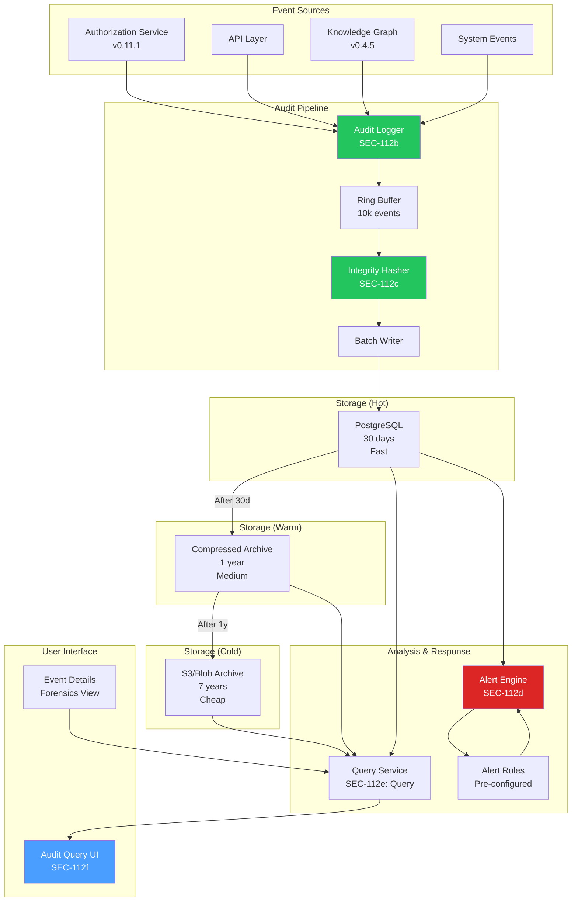
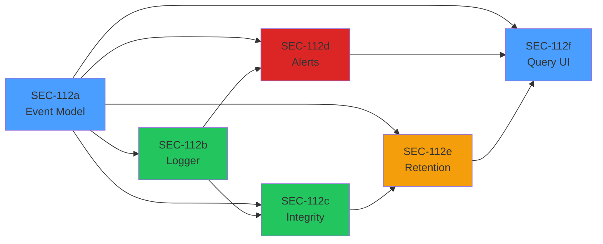

# LCS-DES-112-SEC-INDEX: Design Specification Index — Security Audit Logging (v0.11.2)

## Document Control

| Field            | Value                           |
| :--------------- | :------------------------------ |
| **Index ID**     | LCS-DES-112-SEC-INDEX           |
| **Scope ID**     | LCS-SBD-112-SEC                 |
| **Release**      | v0.11.2                         |
| **Phase**        | Security Phase 2                |
| **Status**       | Draft                           |
| **Last Updated** | 2026-01-31                      |
| **Total Hours**  | 38 hours (6 sub-parts)          |

---

## 1. Executive Summary

**v0.11.2-SEC** delivers comprehensive Security Audit Logging with:

- Complete, tamper-evident audit trail of all security events
- Real-time alerting on suspicious activity
- Multi-tier storage with compliance retention
- Professional audit query UI for investigation
- Hash chain integrity protection
- Support for compliance frameworks (SOC 2, ISO 27001, HIPAA)

---

## 2. Architecture Overview

### 2.1 System Architecture Diagram



### 2.2 Design Spec Documents

| ID | Part | Title | Hours | Status |
| :-- | :--- | :----- | :---- | :----- |
| [LCS-DES-112-SEC-a](#a-audit-event-model) | a | Audit Event Model | 5 | Draft |
| [LCS-DES-112-SEC-b](#b-audit-logger) | b | Audit Logger | 8 | Draft |
| [LCS-DES-112-SEC-c](#c-integrity-protection) | c | Integrity Protection | 8 | Draft |
| [LCS-DES-112-SEC-d](#d-alert-engine) | d | Alert Engine | 6 | Draft |
| [LCS-DES-112-SEC-e](#e-retention-manager) | e | Retention Manager | 5 | Draft |
| [LCS-DES-112-SEC-f](#f-audit-query-ui) | f | Audit Query UI | 6 | Draft |

**Total Estimated Hours: 38**

---

## 3. Detailed Specifications

### a. Audit Event Model

**LCS-DES-112-SEC-a**: Defines audit event structures with 30+ fields capturing:

- Event identification (ID, type, timestamp, category, severity)
- Actor information (user, session, IP, user agent)
- Resource information (ID, type, name)
- Action details (action, outcome, failure reason)
- Context (before/after values, additional metadata)
- Correlation (CorrelationId, RequestId, parent event)
- Integrity (hash chain for tamper detection)

**Key Types:**
- `AuditEvent` record (core)
- `AuditEventType` enum (40+ event types)
- `AuditEventCategory` enum (7 categories)
- `AuditSeverity` enum (5 levels)
- `AuditOutcome` enum (Success/Failure/Partial/Unknown)
- `AuditQuery` record (filter/search)
- `IntegrityVerificationResult` record (violation reporting)

**Dependencies:**
- None (defines core data model)

**Deliverables:**
- AuditEvent.cs with all records and enums
- AuditEventFactory helper class
- Unit tests (95%+ coverage)

---

### b. Audit Logger

**LCS-DES-112-SEC-b**: High-performance, non-blocking audit event logging with:

- `IAuditLogger` interface (3 methods: Log, LogAsync, LogBatchAsync)
- Ring buffer (10k event capacity)
- Automatic context extraction (user, IP, session)
- Background flush timer (every 5 seconds)
- Metrics collection (latency histograms, event counts)
- Resilience (dropped event handling, graceful degradation)

**Performance Targets:**
- `Log()` (async, non-blocking): <5ms P95
- `LogAsync()` (sync, confirmation): <20ms P95
- `LogBatchAsync()` (bulk): <2s for 1000 events
- Memory: <200KB overhead

**Architecture:**
- Ring buffer for efficient queuing
- Periodic flush loop using PeriodicTimer
- OpenTelemetry histogram for metrics
- Graceful shutdown with final flush

**Dependencies:**
- `IIntegrityHasher` (SEC-112c) - optional
- `IAuditStore` - storage interface
- ILogger<T>

**Deliverables:**
- IAuditLogger interface
- AuditLogger implementation
- LogBuffer ring buffer class
- AuditLoggerOptions config
- AuditLoggerMetrics record
- DI registration extension
- Performance tests

---

### c. Integrity Protection

**LCS-DES-112-SEC-c**: Tamper-evident audit logging with SHA256 hash chains:

- `IIntegrityHasher` interface (hash calculation & verification)
- `IIntegrityVerifier` interface (range verification & forensics)
- Canonical hash input format (EventId|Timestamp|Type|Action|UserId|ResourceId|PreviousHash)
- Hash chain linking (each event includes previous hash)
- Violation detection (4 types: HashMismatch, ChainBreak, Missing, Duplicate, OutOfOrder)
- Forensic analysis (timeline with context, remediation recommendations)

**Hash Algorithm:**
- Algorithm: SHA256
- Format: Base64-encoded (44 chars)
- Input: UTF-8 canonical form
- Verification: Constant-time comparison

**Verification Modes:**
- Point-in-time (single event)
- Chain link (consecutive events)
- Range (date/time span)
- Forensic (with analysis)

**Dependencies:**
- `IAuditStore` - event retrieval
- ILogger<T>
- System.Security.Cryptography

**Deliverables:**
- IIntegrityHasher interface
- IntegrityHasher (SHA256) implementation
- IIntegrityVerifier interface
- IntegrityVerifier implementation
- Forensics result types
- Unit tests
- Performance tests (<1ms per event)

---

### d. Alert Engine

**LCS-DES-112-SEC-d**: Real-time alert generation and dispatch with:

- `ISecurityAlertService` interface (rule management, alert lifecycle)
- Alert rules with flexible conditions (EventType, Category, Outcome, etc.)
- Time windows (e.g., "5 failures in 5 minutes GROUP BY IpAddress")
- Severity levels (Low, Medium, High, Critical)
- Multi-channel actions (Email, Webhook, Slack, PagerDuty, InApp, Log)
- Alert lifecycle (Active → Acknowledged → Resolved)

**Built-in Rules (5 pre-configured):**
1. Brute Force Login Detection (5+ failures in 5 min by IP)
2. Privilege Escalation Attempt (3+ PermissionDenied for Admin in 1 hour)
3. Suspicious Bulk Export (>1000 records exported)
4. After Hours Admin Activity (config changes outside 6am-10pm)
5. Unusual Access Pattern (50+ new entities in 1 hour)

**Condition Language:**
- Simple operators: =, CONTAINS, >, <
- Logical connectors: AND, OR
- Aggregation: COUNT(), WITHIN, GROUP BY
- Example: `EventTypa = "LoginFailure" AND COUNT() > 5 WITHIN 5 minutes GROUP BY IpAddress`

**Performance:**
- Rule evaluation: <50ms P95
- Alert dispatch: <1s per alert

**Dependencies:**
- `IAuditQueryService` (SEC-112e: Query Service)
- `IAuditLogger` (SEC-112b) - event processing
- IEmailService, IHttpClientFactory
- ILogger<T>

**Deliverables:**
- ISecurityAlertService interface
- SecurityAlertService implementation
- AlertRuleEngine (condition evaluator)
- AlertActionDispatcher (multi-channel)
- Email, Webhook, Slack, PagerDuty handlers
- Built-in rule registry
- Unit tests

---

### e. Retention Manager

**LCS-DES-112-SEC-e**: Tiered storage lifecycle management:

- `IAuditRetentionManager` interface (policy, archival, statistics)
- Three-tier storage model:
  - **Hot** (PostgreSQL): 30 days, fast queries, high cost
  - **Warm** (Compressed): 1 year, medium speed, medium cost
  - **Cold** (S3/Blob): 7 years, slow, low cost

**Features:**
- Automatic tiering by age (configurable schedule)
- Compression (gzip, brotli, zstd)
- Encryption before archival (AES-256-GCM)
- WORM (Write Once Read Many) compliance
- Integrity verification before archival
- Transparent querying across all tiers
- Statistics and cost estimation

**Retention Policies by License:**
- Core: 7 days (hot only)
- WriterPro: 30 days (hot)
- Teams: 30d hot + 1y warm
- Enterprise: 30d hot + 1y warm + 7y cold

**Dependencies:**
- `IAuditStore` - hot storage
- IAzureStorageService (or S3) - cold storage
- IEncryptionService
- ILogger<T>

**Deliverables:**
- IAuditRetentionManager interface
- AuditRetentionManager implementation
- RetentionPolicy configuration
- AuditArchiveService (cold storage)
- CompressionService (gzip/brotli/zstd)
- Archive scheduler (PeriodicTimer)
- Statistics reporting
- Unit and integration tests

---

### f. Audit Query UI

**LCS-DES-112-SEC-f**: Professional web UI for audit log investigation:

**Components:**
- `AuditLogPage` - Main audit log interface
- `AuditQueryBuilder` - Advanced filter UI
- `AuditEventDetails` - Detail modal with forensics
- `AuditChart` - Timeline visualization

**Features:**
- Advanced filtering (date range, event type, user, category, outcome, search)
- Real-time filtering with preview
- Severity indicators (colored badges)
- Outcome badges (green success, red failure, yellow warning)
- Event detail view with full context
- Before/after value diff display
- Correlation chain visualization
- Full-text search
- Pagination (100 events per page)
- Export to CSV/JSON
- Save filters as reports
- Saved filter library

**API Endpoints:**
- `POST /api/audit/query` - Query with filters
- `GET /api/audit/event/{eventId}` - Single event details
- `GET /api/audit/events/correlated/{correlationId}` - Related events
- `POST /api/audit/export` - Export as CSV

**Access Control:**
- RBAC: Security, Admin roles only
- User filtering (via autocomplete)

**Performance:**
- Page load: <2s
- Query: <500ms (cached)
- Smooth table scrolling (virtual scrolling)

**Dependencies:**
- `IAuditQueryService` (SEC-112e: Query Service)
- IAuthorizationService (v0.11.1)
- Blazor/React/Angular frontend

**Deliverables:**
- AuditLogPage Blazor component
- AuditQueryBuilder component
- AuditEventDetails component
- AuditChart component
- AuditController API
- CSS styling
- Unit tests (>90%)
- E2E tests

---

## 4. Cross-Component Integration

### 4.1 Event Flow

```
Audit Event Occurs
    ↓
[AuditLogger.Log()] (SEC-112b)
    ↓
[IntegrityHasher.CalculateEventHash()] (SEC-112c)
    ↓
[Ring Buffer] → [Periodic Flush] → [PostgreSQL] (Hot)
    ↓
[SecurityAlertService.ProcessAuditEvent()] (SEC-112d)
    ↓
[AlertRuleEngine.EvaluateRule()] + [AlertActionDispatcher]
    ↓
[Alert generated] → [Email/Webhook/Slack/PagerDuty]
    ↓
[After 30 days: AuditRetentionManager archives to warm storage] (SEC-112e)
    ↓
[After 1 year: Move to cold storage (S3/Blob)]
    ↓
[User queries via UI] (SEC-112f) → [IAuditQueryService] (Query Service)
    ↓
[Results displayed with forensics]
```

### 4.2 Dependency Graph



---

## 5. Implementation Schedule

### Phase 1: Core (Week 1-2)
- [ ] SEC-112a: Audit Event Model (5h)
- [ ] SEC-112b: Audit Logger (8h)
- **Subtotal: 13 hours**

### Phase 2: Protection & Archival (Week 2-3)
- [ ] SEC-112c: Integrity Protection (8h)
- [ ] SEC-112e: Retention Manager (5h)
- **Subtotal: 13 hours**

### Phase 3: Response & UI (Week 3-4)
- [ ] SEC-112d: Alert Engine (6h)
- [ ] SEC-112f: Audit Query UI (6h)
- **Subtotal: 12 hours**

**Total: 38 hours across 4 weeks**

---

## 6. Testing Strategy

### Unit Tests (95%+ coverage)
- Event model validation
- Logger buffering and flushing
- Hash calculation and verification
- Rule evaluation logic
- Retention policy transitions
- Query filtering

### Integration Tests
- End-to-end event logging
- Cross-component message passing
- Storage tier transitions
- Alert dispatch
- Query across tiers

### Performance Tests
- Logger <5ms P95 (Log)
- Hash <1ms per event
- Rule evaluation <50ms
- Alert dispatch <1s
- UI page load <2s

### E2E Tests
- Audit log flow (event → storage → query → UI)
- Alert trigger and dispatch
- Retention archival
- Cross-tier queries
- UI interactions

### Security Tests
- Hash verification
- RBAC enforcement
- Integrity violation detection
- Encryption validation
- Constant-time comparisons

---

## 7. Compliance & Standards

### Supported Frameworks
- **SOC 2 Type II**: Audit trail, access controls, change logs
- **ISO 27001**: Information security, incident response
- **HIPAA**: Audit controls, access logs, accountability
- **GDPR**: Right to audit, data retention, erasure

### Audit Controls
- Non-repudiation (hash chains)
- Immutability (WORM compliance)
- Integrity verification (forensic analysis)
- Retention policies (configurable)
- Access control (RBAC on queries)

### Retention Requirements
- Core: 7 days
- WriterPro: 30 days
- Teams: 1 year
- Enterprise: 7 years

---

## 8. License Gating

| Feature | Core | WriterPro | Teams | Enterprise |
| :------ | :--- | :--------- | :---- | :---------- |
| Basic logging (7 days) | ✓ | ✓ | ✓ | ✓ |
| Full logging (30 days) | | ✓ | ✓ | ✓ |
| Real-time alerts | | | ✓ | ✓ |
| Integrity verification | | | ✓ | ✓ |
| Warm storage (1 year) | | | ✓ | ✓ |
| Cold storage (7 years) | | | | ✓ |
| SIEM export | | | | ✓ |
| Unlimited retention | | | | ✓ |

---

## 9. Dependencies

### v0.11.2-SEC Dependencies

| Component | Source | Usage |
| :--------- | :----- | :----- |
| IAuthorizationService | v0.11.1-SEC | Permission events, RBAC |
| IProfileService | v0.9.1 | User context, denormalization |
| IGraphRepository | v0.4.5e | Resource context, entity lookups |
| PostgreSQL | Infrastructure | Hot audit storage |
| S3/Azure Blob | Infrastructure | Cold archive storage |
| IEmailService | Core | Alert email dispatch |
| IHttpClientFactory | Core | Webhook/Slack dispatch |

### Backward Compatibility

v0.11.2-SEC is additive; no breaking changes to:
- Core data model
- Authorization Service API
- Profile Service API
- Graph Repository API

---

## 10. Performance Targets

| Operation | Target P95 | SLA |
| :----------- | :--------- | :--- |
| Log (async) | <5ms | 99.9% |
| LogAsync (sync) | <20ms | 99.9% |
| LogBatchAsync (1000 events) | <2s | 99.0% |
| Hash calculation | <1ms | 99.9% |
| Rule evaluation | <50ms | 99.5% |
| Query (simple) | <100ms | 99.5% |
| Query (complex) | <2s | 99.0% |
| UI page load | <2s | 99.0% |

---

## 11. Risk Mitigation

| Risk | Probability | Impact | Mitigation |
| :--- | :---------- | :----- | :---------- |
| Log volume explosion | Medium | High | Sampling, aggregation, compression |
| Storage costs at scale | Medium | High | Tiered storage, auto-archival |
| Alert fatigue | Medium | Medium | Threshold tuning, rule disable |
| Query performance | Low | High | Indexing, partitioning, caching |
| Hash collision | Very Low | Critical | Use SHA256 (proven), verify integrity |
| Tampering detection delays | Low | High | Real-time verification, monitoring |

---

## 12. Success Criteria

| # | Criterion | Target | Measurement |
| :-- | :---------- | :------ | :----------- |
| 1 | All events logged | 100% | Compliance audit |
| 2 | Tamper detection | 100% | Forensic tests |
| 3 | Alert SLA | 99.5% | Metric tracking |
| 4 | Log write latency | <5ms P95 | Performance tests |
| 5 | Query latency | <2s | Performance tests |
| 6 | Storage cost reduction | 40%+ | Cloud billing analysis |
| 7 | Compliance certification | Achieved | 3rd party audit |
| 8 | User satisfaction | 4.5+/5 | Survey |

---

## 13. Document References

### Specification Documents
- [LCS-DES-112-SEC-a: Audit Event Model](/docs/specs/v0.11.x/v0.11.2/LCS-DES-112-SEC-a.md)
- [LCS-DES-112-SEC-b: Audit Logger](/docs/specs/v0.11.x/v0.11.2/LCS-DES-112-SEC-b.md)
- [LCS-DES-112-SEC-c: Integrity Protection](/docs/specs/v0.11.x/v0.11.2/LCS-DES-112-SEC-c.md)
- [LCS-DES-112-SEC-d: Alert Engine](/docs/specs/v0.11.x/v0.11.2/LCS-DES-112-SEC-d.md)
- [LCS-DES-112-SEC-e: Retention Manager](/docs/specs/v0.11.x/v0.11.2/LCS-DES-112-SEC-e.md)
- [LCS-DES-112-SEC-f: Audit Query UI](/docs/specs/v0.11.x/v0.11.2/LCS-DES-112-SEC-f.md)

### Scope Documents
- [LCS-SBD-112-SEC: Scope Overview](/docs/specs/v0.11.x/v0.11.2/LCS-SBD-112-SEC.md)

### Related Specifications
- [LCS-SBD-111-SEC: Access Control (v0.11.1)](/docs/specs/v0.11.x/v0.11.1/LCS-SBD-111-SEC.md)
- [LCS-SBD-091-PRO: User Profiles (v0.9.1)](/docs/specs/v0.9.x/v0.9.1/LCS-SBD-091-PRO.md)

---

## 14. Document History

| Version | Date | Author | Changes |
| :------ | :--- | :----- | :------ |
| 1.0 | 2026-01-31 | Security Architect | Initial draft (38-hour estimate) |

---

## 15. Sign-Off

This index consolidates the design specifications for v0.11.2-SEC Security Audit Logging across six sub-parts and 38 estimated hours of implementation work.

**Status**: Ready for implementation review and approval.

**Approval Required From:**
- [ ] Security Lead
- [ ] Architecture Review Board
- [ ] Product Management
- [ ] Engineering Leadership

---

**Document ID:** LCS-DES-112-SEC-INDEX
**Version:** 1.0
**Last Updated:** 2026-01-31
**Maintained By:** Security Architect

