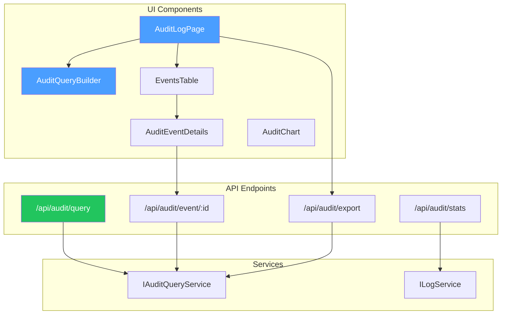

# LCS-DES-112-SEC-b: Design Specification — Audit Query UI

## 1. Metadata & Categorization

| Field                | Value                                      |
| :------------------- | :----------------------------------------- |
| **Document ID**      | LCS-DES-112-SEC-b                          |
| **Feature ID**       | SEC-112j                                   |
| **Feature Name**     | Audit Query UI                             |
| **Parent Feature**   | v0.11.2 — Security Audit Logging           |
| **Module Scope**     | Lexichord.Web.Components, Lexichord.Server |
| **Swimlane**         | Security & Compliance                      |
| **License Tier**     | Core (basic query)                         |
| **Feature Gate Key** | `FeatureFlags.Security.AuditQueryUI`       |
| **Status**           | Draft                                      |
| **Last Updated**     | 2026-01-31                                 |
| **Est. Hours**       | 6                                          |

---

## 2. Executive Summary

### 2.1 Problem Statement

Security personnel need to investigate incidents but lack a dedicated audit log interface:

- Requires CLI or API knowledge
- Cannot filter without writing queries
- No visualization of event patterns
- Cannot correlate related events visually

### 2.2 Solution Overview

Implement a professional audit log UI with:

- **Advanced filtering**: Multiple filter types with live preview
- **Event details**: Full context, before/after values, correlation chains
- **Forensics mode**: Timeline view of related events
- **Export**: CSV, JSON for external analysis
- **Search**: Full-text and structured search
- **Severity indicators**: Visual alerting

### 2.3 Key Deliverables

| Deliverable | Description |
| :---------- | :---------- |
| `AuditLogPage` component | Main audit log UI |
| `AuditEventDetails` component | Detail modal/sidebar |
| `AuditQueryBuilder` component | Filter builder |
| `AuditChart` component | Timeline/chart visualization |
| API endpoints | Query, export, detail endpoints |

---

## 3. Architecture & Modular Strategy

### 3.1 Component Diagram



### 3.2 Module Location

```text
src/
├── Lexichord.Web.Components/
│   └── Audit/
│       ├── AuditLogPage.razor           ← Main page
│       ├── AuditQueryBuilder.razor      ← Filter builder
│       ├── AuditEventDetails.razor      ← Detail view
│       ├── AuditChart.razor             ← Timeline
│       └── AuditLogStyles.css           ← Styling
│
└── Lexichord.Server/
    ├── Controllers/
    │   └── AuditController.cs           ← API endpoints
    └── Services/
        └── AuditUIService.cs            ← UI business logic
```

---

## 4. Component Specifications

### 4.1 AuditLogPage Component

```csharp
/// <summary>
/// Main audit log query and display interface.
/// </summary>
@page "/security/audit-logs"
@attribute [Authorize(Roles = "Security,Admin")]
@inject IAuditQueryService AuditQueryService
@inject ISecurityAlertService AlertService

<PageTitle>Security Audit Log</PageTitle>

<div class="audit-log-container">
    <!-- Header -->
    <div class="audit-header">
        <h1>Security Audit Log</h1>
        <div class="header-actions">
            <button class="btn btn-primary" @onclick="ExportResults">
                📥 Export Results
            </button>
            <button class="btn btn-secondary" @onclick="SaveAsReport">
                💾 Save as Report
            </button>
            <button class="btn btn-outline" @onclick="RefreshResults">
                🔄 Refresh
            </button>
        </div>
    </div>

    <!-- Query Builder -->
    <div class="filters-section">
        <h3>Filters</h3>
        <AuditQueryBuilder @ref="QueryBuilder" OnQueryChanged="OnFilterChanged" />

        <div class="filter-actions">
            <button class="btn btn-primary" @onclick="ApplyFilters">
                Apply Filters
            </button>
            <button class="btn btn-outline" @onclick="ClearFilters">
                Clear
            </button>
        </div>
    </div>

    <!-- Results Summary -->
    @if (QueryResult != null)
    {
        <div class="results-summary">
            <p>
                Results: <strong>@QueryResult.Events.Count</strong> of
                <strong>@QueryResult.TotalCount</strong> events
                @if (QueryResult.HasMore)
                {
                    <span>(more available)</span>
                }
            </p>
        </div>
    }

    <!-- Events Table -->
    <div class="events-table-section">
        @if (IsLoading)
        {
            <div class="spinner">Loading events...</div>
        }
        else if (QueryResult?.Events.Count == 0)
        {
            <div class="empty-state">
                No events found matching filters.
            </div>
        }
        else
        {
            <table class="events-table">
                <thead>
                    <tr>
                        <th></th>
                        <th>Timestamp</th>
                        <th>Event Type</th>
                        <th>User</th>
                        <th>Action</th>
                        <th>Outcome</th>
                        <th>Severity</th>
                    </tr>
                </thead>
                <tbody>
                    @foreach (var evt in QueryResult.Events)
                    {
                        <tr class="event-row @GetOutcomeClass(evt.Outcome)"
                            @onclick="() => ShowEventDetails(evt)">
                            <td>
                                <span class="severity-indicator @GetSeverityClass(evt.Severity)">
                                    ●
                                </span>
                            </td>
                            <td>@evt.Timestamp:G</td>
                            <td>@evt.EventType</td>
                            <td>@(evt.UserEmail ?? "System")</td>
                            <td>@evt.Action</td>
                            <td>
                                @if (evt.Outcome == AuditOutcome.Success)
                                {
                                    <span class="badge bg-success">✓ Success</span>
                                }
                                else if (evt.Outcome == AuditOutcome.Failure)
                                {
                                    <span class="badge bg-danger">✗ Failed</span>
                                }
                                else
                                {
                                    <span class="badge bg-warning">⚠ @evt.Outcome</span>
                                }
                            </td>
                            <td>
                                <span class="badge @GetSeverityBadgeClass(evt.Severity)">
                                    @evt.Severity
                                </span>
                            </td>
                        </tr>
                    }
                </tbody>
            </table>

            <!-- Pagination -->
            <div class="pagination">
                @if (CurrentOffset > 0)
                {
                    <button class="btn btn-sm" @onclick="PreviousPage">
                        ◀ Previous
                    </button>
                }

                <span class="page-indicator">
                    Page @((CurrentOffset / CurrentQuery.Limit) + 1) of
                    @((QueryResult.TotalCount + CurrentQuery.Limit - 1) / CurrentQuery.Limit)
                </span>

                @if (QueryResult.HasMore)
                {
                    <button class="btn btn-sm" @onclick="NextPage">
                        Next ▶
                    </button>
                }
            </div>
        }
    </div>

    <!-- Event Details Modal -->
    @if (SelectedEvent != null)
    {
        <div class="modal-overlay" @onclick="CloseEventDetails">
            <div class="modal" @onclick:stopPropagation>
                <AuditEventDetails
                    Event="SelectedEvent"
                    OnClose="CloseEventDetails"
                    OnViewRelated="ViewRelatedEvents" />
            </div>
        </div>
    }
</div>

@code {
    private AuditQueryBuilder? QueryBuilder;
    private AuditQuery CurrentQuery = new();
    private AuditQueryResult? QueryResult;
    private AuditEvent? SelectedEvent;
    private int CurrentOffset = 0;
    private bool IsLoadinc = false;

    protected override async Task OnInitializedAsync()
    {
        CurrentQuery = new AuditQuery { Limit = 100 };
        await ApplyFilters();
    }

    private async Task OnFilterChanged(AuditQuery query)
    {
        CurrentQuery = query with { Offset = 0 };
        CurrentOffset = 0;
    }

    private async Task ApplyFilters()
    {
        IsLoadinc = true;
        try
        {
            CurrentQuery = CurrentQuery with { Offset = CurrentOffset };
            QueryResult = await AuditQueryService.QueryAsync(CurrentQuery);
        }
        finally
        {
            IsLoadinc = false;
        }
    }

    private void ClearFilters()
    {
        QueryBuilder?.Reset();
        CurrentQuery = new AuditQuery { Limit = 100 };
        CurrentOffset = 0;
    }

    private void ShowEventDetails(AuditEvent evt)
    {
        SelectedEvent = evt;
    }

    private void CloseEventDetails()
    {
        SelectedEvent = null;
    }

    private async Task ViewRelatedEvents(string correlationId)
    {
        // Filter to related events
        CurrentQuery = CurrentQuery with
        {
            SearchText = correlationId,
            Offset = 0
        };
        CurrentOffset = 0;
        await ApplyFilters();
    }

    private async Task NextPage()
    {
        CurrentOffset += CurrentQuery.Limit;
        await ApplyFilters();
    }

    private async Task PreviousPage()
    {
        CurrentOffset = Math.Max(0, CurrentOffset - CurrentQuery.Limit);
        await ApplyFilters();
    }

    private async Task ExportResults()
    {
        // Export as CSV/JSON
    }

    private async Task SaveAsReport()
    {
        // Save query and results as report
    }

    private async Task RefreshResults()
    {
        await ApplyFilters();
    }

    private string GetOutcomeClass(AuditOutcome outcome) => outcome switch
    {
        AuditOutcome.Success => "outcome-success",
        AuditOutcome.Failure => "outcome-failure",
        _ => "outcome-other"
    };

    private string GetSeverityClass(AuditSeverity severity) => severity switch
    {
        AuditSeverity.Critical => "severity-critical",
        AuditSeverity.Error => "severity-error",
        AuditSeverity.Warning => "severity-warning",
        _ => "severity-info"
    };

    private string GetSeverityBadgeClass(AuditSeverity severity) =>
        $"badge-{GetSeverityClass(severity)}";
}
```

### 4.2 AuditQueryBuilder Component

```csharp
/// <summary>
/// Advanced filter builder for audit queries.
/// </summary>
@inject IJSRuntime JS

<div class="query-builder">
    <!-- Date Range -->
    <div class="filter-group">
        <label>Date Range</label>
        <div class="filter-inputs">
            <input type="datetime-local"
                @bind="FilterFromDate"
                placeholder="From" />
            <input type="datetime-local"
                @bind="FilterToDate"
                placeholder="To" />
        </div>
    </div>

    <!-- Event Type -->
    <div class="filter-group">
        <label>Event Type</label>
        <select @onchange="OnEventTypeChange" multiple>
            <option value="">-- All Types --</option>
            @foreach (var type in Enum.GetValues<AuditEventType>())
            {
                <option value="@type">@type</option>
            }
        </select>
    </div>

    <!-- Category -->
    <div class="filter-group">
        <label>Category</label>
        <select @onchange="OnCategoryChange" multiple>
            <option value="">-- All Categories --</option>
            @foreach (var cat in Enum.GetValues<AuditEventCategory>())
            {
                <option value="@cat">@cat</option>
            }
        </select>
    </div>

    <!-- User -->
    <div class="filter-group">
        <label>User</label>
        <input type="text"
            @bind="FilterUser"
            placeholder="Email or name"
            list="user-list" />
        <datalist id="user-list">
            @foreach (var user in AvailableUsers)
            {
                <option value="@user.Email">@user.Name</option>
            }
        </datalist>
    </div>

    <!-- Outcome -->
    <div class="filter-group">
        <label>Outcome</label>
        <div class="radio-group">
            <label><input type="radio" @onchange="e => FilterOutcoma = null"
                @checked="FilterOutcome == null" /> All</label>
            <label><input type="radio" @onchange="e => FilterOutcoma = AuditOutcome.Success"
                @checked="FilterOutcome == AuditOutcome.Success" /> Success</label>
            <label><input type="radio" @onchange="e => FilterOutcoma = AuditOutcome.Failure"
                @checked="FilterOutcome == AuditOutcome.Failure" /> Failure</label>
        </div>
    </div>

    <!-- Search -->
    <div class="filter-group">
        <label>Search</label>
        <input type="text"
            @bind="FilterSearch"
            placeholder="Search action, resource, IP..." />
    </div>

    <!-- Saved Filters -->
    <div class="saved-filters">
        <label>Saved Filters</label>
        <select @onchange="OnLoadSavedFilter">
            <option value="">-- Load Saved Filter --</option>
            @foreach (var saved in SavedFilters)
            {
                <option value="@saved.Id">@saved.Name</option>
            }
        </select>
    </div>
</div>

@code {
    [Parameter]
    public EventCallback<AuditQuery> OnQueryChanged { get; set; }

    private DateTime? FilterFromDate;
    private DateTime? FilterToDate;
    private List<AuditEventType> FilterEventTypes = new();
    private List<AuditEventCategory> FilterCategories = new();
    private string FilterUser = "";
    private AuditOutcome? FilterOutcome;
    private string FilterSearcd = "";
    private List<SavedFilter> SavedFilters = new();
    private List<UserInfo> AvailableUsers = new();

    protected override async Task OnInitializedAsync()
    {
        // Load available users and saved filters
        // AvailableUsers = await UserService.GetUsersAsync();
        // SavedFilters = await QueryService.GetSavedFiltersAsync();
    }

    private async Task OnEventTypeChange(ChangeEventArgs e)
    {
        await NotifyQueryChanged();
    }

    private async Task OnCategoryChange(ChangeEventArgs e)
    {
        await NotifyQueryChanged();
    }

    private async Task NotifyQueryChanged()
    {
        var query = new AuditQuery
        {
            From = FilterFromDate?.ToUniversalTime() ?? DateTimeOffset.UtcNow.AddDays(-30),
            To = FilterToDate?.ToUniversalTime() ?? DateTimeOffset.UtcNow,
            EventTypes = FilterEventTypes.Count > 0 ? FilterEventTypes : null,
            Categories = FilterCategories.Count > 0 ? FilterCategories : null,
            Outcoma = FilterOutcome,
            SearchText = string.IsNullOrEmpty(FilterSearch) ? null : FilterSearch
        };

        await OnQueryChanged.InvokeAsync(query);
    }

    public void Reset()
    {
        FilterFromData = null;
        FilterToData = null;
        FilterEventTypes.Clear();
        FilterCategories.Clear();
        FilterUser = "";
        FilterOutcoma = null;
        FilterSearcd = "";
    }
}
```

### 4.3 AuditEventDetails Component

```csharp
/// <summary>
/// Detailed view of a single audit event.
/// </summary>
@inject IAuditQueryService AuditQueryService

<div class="event-details">
    <!-- Header -->
    <div class="details-header">
        <h2>Event Details</h2>
        <button class="btn-close" @onclick="OnClose">✕</button>
    </div>

    <!-- Event ID and Timestamp -->
    <div class="details-section">
        <div class="detail-field">
            <label>Event ID</label>
            <code>@Event.EventId</code>
        </div>
        <div class="detail-field">
            <label>Timestamp</label>
            <time>@Event.Timestamp:O</time>
        </div>
        <div class="detail-field">
            <label>Type / Severity</label>
            <span>@Event.EventType</span>
            <span class="badge @GetSeverityBadgeClass(Event.Severity)">
                @Event.Severity
            </span>
        </div>
    </div>

    <!-- Actor Information -->
    @if (!string.IsNullOrEmpty(Event.UserEmail))
    {
        <div class="details-section">
            <h3>Actor</h3>
            <div class="detail-field">
                <label>User</label>
                <span>@Event.UserName (@Event.UserEmail)</span>
            </div>
            @if (!string.IsNullOrEmpty(Event.IpAddress))
            {
                <div class="detail-field">
                    <label>IP Address</label>
                    <code>@Event.IpAddress</code>
                    <button class="btn-small" @onclick="() => ViewIpHistory(Event.IpAddress)">
                        View History
                    </button>
                </div>
            }
            @if (!string.IsNullOrEmpty(Event.SessionId))
            {
                <div class="detail-field">
                    <label>Session</label>
                    <code>@Event.SessionId</code>
                </div>
            }
        </div>
    }

    <!-- Resource Information -->
    @if (!string.IsNullOrEmpty(Event.ResourceName))
    {
        <div class="details-section">
            <h3>Resource</h3>
            <div class="detail-field">
                <label>Type</label>
                <span>@Event.ResourceType</span>
            </div>
            <div class="detail-field">
                <label>Name</label>
                <span>@Event.ResourceName</span>
            </div>
            <div class="detail-field">
                <label>ID</label>
                <code>@Event.ResourceId</code>
            </div>
        </div>
    }

    <!-- Action Details -->
    <div class="details-section">
        <h3>Action</h3>
        <div class="detail-field">
            <label>Action</label>
            <span>@Event.Action</span>
        </div>
        <div class="detail-field">
            <label>Outcome</label>
            <span class="@GetOutcomeClass(Event.Outcome)">
                @Event.Outcome
            </span>
        </div>
        @if (!string.IsNullOrEmpty(Event.FailureReason))
        {
            <div class="detail-field">
                <label>Failure Reason</label>
                <span class="text-danger">@Event.FailureReason</span>
            </div>
        }
    </div>

    <!-- Before/After Values -->
    @if (Event.OldValue != null || Event.NewValue != null)
    {
        <div class="details-section">
            <h3>Changes</h3>
            @if (Event.OldValue != null)
            {
                <div class="detail-field">
                    <label>Previous Value</label>
                    <pre>@FormatJson(Event.OldValue)</pre>
                </div>
            }
            @if (Event.NewValue != null)
            {
                <div class="detail-field">
                    <label>New Value</label>
                    <pre>@FormatJson(Event.NewValue)</pre>
                </div>
            }
        </div>
    }

    <!-- Integrity -->
    @if (!string.IsNullOrEmpty(Event.Hash))
    {
        <div class="details-section">
            <h3>Integrity</h3>
            <div class="detail-field">
                <label>Hash</label>
                <code class="hash">@Event.Hash</code>
                <span class="badge bg-success">✓ Verified</span>
            </div>
            @if (!string.IsNullOrEmpty(Event.PreviousHash))
            {
                <div class="detail-field">
                    <label>Previous Hash</label>
                    <code class="hash">@Event.PreviousHash</code>
                </div>
            }
        </div>
    }

    <!-- Correlation -->
    @if (!string.IsNullOrEmpty(Event.CorrelationId))
    {
        <div class="details-section">
            <h3>Correlation</h3>
            <div class="detail-field">
                <label>Correlation ID</label>
                <code>@Event.CorrelationId</code>
                <button class="btn-small"
                    @onclick="() => OnViewRelated.InvokeAsync(Event.CorrelationId)">
                    View Related Events
                </button>
            </div>
        </div>
    }

    <!-- Actions -->
    <div class="details-actions">
        <button class="btn btn-primary" @onclick="ExportEvent">
            📥 Export
        </button>
        <button class="btn btn-secondary" @onclick="CreateAlertRule">
            🚨 Create Alert Rule
        </button>
        <button class="btn btn-outline" @onclick="OnClose">
            Close
        </button>
    </div>
</div>

@code {
    [Parameter]
    public AuditEvent Event { get; set; } = null!;

    [Parameter]
    public EventCallback OnClose { get; set; }

    [Parameter]
    public EventCallback<string> OnViewRelated { get; set; }

    private async Task ViewIpHistory(string ipAddress)
    {
        // Filter to events from this IP
    }

    private async Task ExportEvent()
    {
        var json = JsonSerializer.Serialize(Event,
            new JsonSerializerOptions { WriteIndented = true });
        // Download as file
    }

    private async Task CreateAlertRule()
    {
        // Create alert rule based on this event
    }

    private string FormatJson(JsonDocument? doc) =>
        doc?.RootElement.GetRawText() ?? "";

    private string GetOutcomeClass(AuditOutcome outcome) => outcome switch
    {
        AuditOutcome.Success => "text-success",
        AuditOutcome.Failure => "text-danger",
        _ => "text-warning"
    };

    private string GetSeverityBadgeClass(AuditSeverity severity) => severity switch
    {
        AuditSeverity.Critical => "badge-danger",
        AuditSeverity.Error => "badge-danger",
        AuditSeverity.Warning => "badge-warning",
        _ => "badge-info"
    };
}
```

---

## 5. API Endpoints

### 5.1 Query Endpoint

```csharp
[ApiController]
[Route("api/audit")]
[Authorize(Roles = "Security,Admin")]
public class AuditController : ControllerBase
{
    private readonly IAuditQueryService _queryService;

    /// <summary>
    /// Queries audit events with filters.
    /// </summary>
    /// <remarks>
    /// Supports pagination with Offset/Limit.
    /// Returns matching events and total count.
    /// </remarks>
    [HttpPost("query")]
    public async Task<AuditQueryResult> QueryEvents(
        [FromBody] AuditQuery query,
        CancellationToken ct)
    {
        ValidateQuery(query);
        return await _queryService.QueryAsync(query, ct);
    }

    /// <summary>
    /// Gets a specific event by ID.
    /// </summary>
    [HttpGet("event/{eventId}")]
    public async Task<ActionResult<AuditEvent>> GetEvent(
        Guid eventId,
        CancellationToken ct)
    {
        var evt = await _queryService.GetByIdAsync(eventId, ct);
        if (evt == null)
            return NotFound();
        return evt;
    }

    /// <summary>
    /// Exports audit results as CSV.
    /// </summary>
    [HttpPost("export")]
    public async Task<FileContentResult> ExportResults(
        [FromBody] AuditQuery query,
        CancellationToken ct)
    {
        var result = await _queryService.QueryAsync(query, ct);
        var csv = ConvertToCsv(result.Events);

        return File(
            Encoding.UTF8.GetBytes(csv),
            "text/csv",
            $"audit-export-{DateTime.UtcNow:yyyyMMdd-HHmmss}.csv");
    }

    /// <summary>
    /// Gets correlated events.
    /// </summary>
    [HttpGet("events/correlated/{correlationId}")]
    public async Task<ActionResult<IReadOnlyList<AuditEvent>>> GetCorrelatedEvents(
        string correlationId,
        CancellationToken ct)
    {
        var events = await _queryService.GetCorrelatedEventsAsync(
            correlationId, ct);
        return Ok(events);
    }

    private static void ValidateQuery(AuditQuery query)
    {
        if (query.Limit < 1 || query.Limit > 10_000)
            throw new ArgumentException("Limit must be 1-10000");
        if (query.Offset < 0)
            throw new ArgumentException("Offset must be >= 0");
    }

    private static string ConvertToCsv(IReadOnlyList<AuditEvent> events)
    {
        var sb = new StringBuilder();
        sb.AppendLine("EventId,Timestamp,Type,User,Action,Outcome,Severity");

        foreach (var evt in events)
        {
            sb.AppendLine(
                $"\"{evt.EventId}\",\"{evt.Timestamp:O}\"," +
                $"\"{evt.EventType}\",\"{evt.UserEmail ?? ""}\"," +
                $"\"{evt.Action}\",\"{evt.Outcome}\",\"{evt.Severity}\"");
        }

        return sb.ToString();
    }
}
```

---

## 6. UI Styling

Key CSS classes for styling:

```css
.audit-log-container {
    max-width: 1400px;
    margin: 0 auto;
    padding: 20px;
}

.event-row {
    cursor: pointer;
    transition: background-color 0.2s;
}

.event-row:hover {
    background-color: #f5f5f5;
}

.event-row.outcome-failure {
    border-left: 4px solid #dc2626;
}

.event-row.outcome-success {
    border-left: 4px solid #10b981;
}

.severity-indicator.severity-critical {
    color: #dc2626;
}

.severity-indicator.severity-error {
    color: #ef4444;
}

.severity-indicator.severity-warning {
    color: #f59e0b;
}

.severity-indicator.severity-info {
    color: #3b82f6;
}

.modal-overlay {
    position: fixed;
    top: 0;
    left: 0;
    right: 0;
    bottom: 0;
    background: rgba(0, 0, 0, 0.5);
    display: flex;
    align-items: center;
    justify-content: center;
    z-index: 1000;
}

.modal {
    background: white;
    border-radius: 8px;
    max-width: 800px;
    max-height: 90vh;
    overflow-y: auto;
    box-shadow: 0 20px 25px rgba(0, 0, 0, 0.15);
}

.details-section {
    border-bottom: 1px solid #e5e7eb;
    padding: 15px 0;
}

.detail-field {
    margin: 10px 0;
}

.detail-field label {
    font-weight: 600;
    display: block;
    margin-bottom: 5px;
    color: #374151;
}

.detail-field code {
    background: #f3f4f6;
    padding: 4px 8px;
    border-radius: 4px;
    font-family: 'Monaco', 'Courier New', monospace;
}

.hash {
    font-size: 0.85em;
    word-break: break-all;
}
```

---

## 7. Performance Considerations

- **Virtual scrolling**: For large result sets
- **Lazy loading**: Details load on demand
- **Caching**: Query results cached for 1 minute
- **Pagination**: Always use offset/limit

---

## 8. Accessibility

- ARIA labels on all buttons
- Keyboard navigation (Tab, Enter, Escape)
- Color not the only indicator (severity badges)
- Focus management in modals

---

## 9. Acceptance Criteria

| #   | Category | Criterion | Verification |
| :-- | :------- | :-------- | :----------- |
| 1 | Functional | Audit log page loads | E2E test |
| 2 | Functional | Filtering works | E2E test |
| 3 | Functional | Details modal opens | E2E test |
| 4 | Functional | Export to CSV works | E2E test |
| 5 | Functional | Pagination works | E2E test |
| 6 | Functional | Search filters results | E2E test |
| 7 | Performance | Page loads in <2s | Perf test |
| 8 | Performance | Table scrolls smoothly | Visual test |
| 9 | Accessibility | Keyboard navigation works | A11y test |
| 10 | Security | RBAC enforced on API | Security test |

---

## 10. Unit Testing Requirements

```csharp
[Collection("Audit UI Tests")]
public class AuditLogPageTests : IAsyncLifetime
{
    private readonly TestContext _ctx = new();

    [Fact]
    public async Task Renders_QueryBuilderAndTable()
    {
        var cut = _ctx.RenderComponent<AuditLogPage>();

        cut.FindComponent<AuditQueryBuilder>().Should().NotBeNull();
        cut.FindAll("table.events-table").Should().HaveCount(1);
    }

    [Fact]
    public async Task Filters_UpdatesResults()
    {
        var cut = _ctx.RenderComponent<AuditLogPage>();
        var queryBuilder = cut.FindComponent<AuditQueryBuilder>();

        // Change filters
        // Assert results updated
    }

    [Fact]
    public async Task ClickingEvent_ShowsDetails()
    {
        var cut = _ctx.RenderComponent<AuditLogPage>();
        var firstRow = cut.Find("tr.event-row");

        await firstRow.ClickAsync(new MouseEventArgs());

        cut.FindComponent<AuditEventDetails>().Should().NotBeNull();
    }
}
```

---

## 11. Deliverable Checklist

| #   | Deliverable | Status |
| :-- | :---------- | :----- |
| 1   | AuditLogPage component | [ ] |
| 2   | AuditQueryBuilder component | [ ] |
| 3   | AuditEventDetails component | [ ] |
| 4   | AuditChart component (timeline) | [ ] |
| 5   | API query endpoint | [ ] |
| 6   | API export endpoint | [ ] |
| 7   | CSS styling | [ ] |
| 8   | RBAC integration | [ ] |
| 9   | Unit tests (>90% coverage) | [ ] |
| 10  | E2E tests | [ ] |

---

## Document History

| Version | Date | Author | Changes |
| :------ | :--- | :----- | :------ |
| 1.0 | 2026-01-31 | Security Architect | Initial draft |

