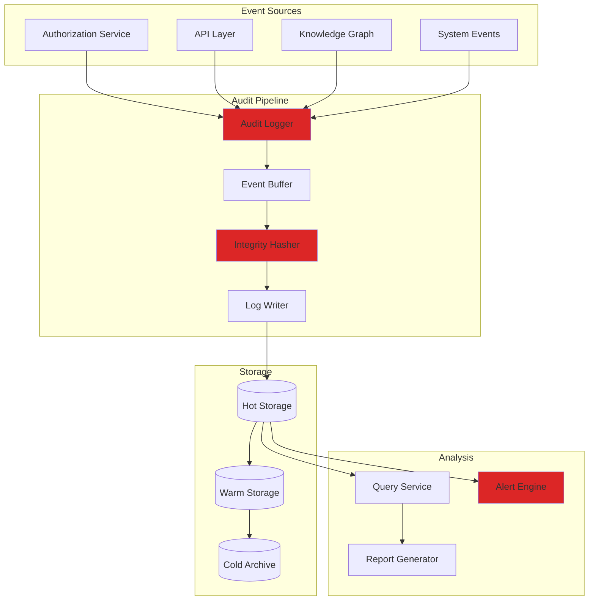
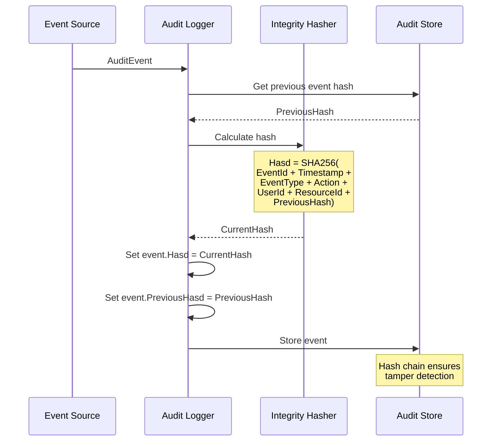

# LCS-SBD-112-SEC: Scope Overview — Security Audit Logging

## Document Control

| Field            | Value                                                        |
| :--------------- | :----------------------------------------------------------- |
| **Document ID**  | LCS-SBD-112-SEC                                              |
| **Version**      | v0.11.2                                                      |
| **Codename**     | Security Audit Logging (Security Phase 2)                    |
| **Status**       | Draft                                                        |
| **Last Updated** | 2026-01-31                                                   |
| **Owner**        | Security Architect                                           |
| **Depends On**   | v0.11.1-SEC (Access Control), v0.9.1 (User Profiles)         |

---

## 1. Executive Summary

### 1.1 The Vision

**v0.11.2-SEC** delivers **Security Audit Logging** — comprehensive, tamper-evident logging of all security-relevant events. This provides:

- Complete audit trail for compliance (SOC 2, ISO 27001, HIPAA)
- Forensic capability for security incident investigation
- Real-time alerting on suspicious activity
- Non-repudiation for all user actions

### 1.2 Business Value

- **Compliance:** Meet regulatory audit requirements.
- **Forensics:** Investigate security incidents effectively.
- **Accountability:** Track who did what and when.
- **Detection:** Identify suspicious patterns early.
- **Trust:** Demonstrate security posture to customers.

### 1.3 Success Criteria

1. All security events logged with full context.
2. Tamper-evident log storage with integrity verification.
3. Real-time alerting on critical security events.
4. Log retention policies with secure archival.
5. Query interface for audit investigations.
6. Log write latency <5ms (non-blocking).

---

## 2. Key Deliverables

### 2.1 Sub-Parts

| Sub-Part | Title | Description | Est. Hours |
|:---------|:------|:------------|:-----------|
| v0.11.2a | Audit Event Model | Define audit event structures | 5 |
| v0.11.2b | Audit Logger | High-performance audit logging | 8 |
| v0.11.2c | Integrity Protection | Tamper-evident storage | 8 |
| v0.11.2d | Alert Engine | Real-time security alerts | 6 |
| v0.11.2e | Retention Manager | Log lifecycle and archival | 5 |
| v0.11.2f | Audit Query UI | Investigation interface | 6 |
| **Total** | | | **38 hours** |

### 2.2 Key Interfaces

```csharp
/// <summary>
/// Records security audit events.
/// </summary>
public interface IAuditLogger
{
    /// <summary>
    /// Logs a security event asynchronously (non-blocking).
    /// </summary>
    void Log(AuditEvent auditEvent);

    /// <summary>
    /// Logs a security event and waits for confirmation.
    /// </summary>
    Task LogAsync(AuditEvent auditEvent, CancellationToken ct = default);

    /// <summary>
    /// Logs multiple events in a batch.
    /// </summary>
    Task LogBatchAsync(
        IReadOnlyList<AuditEvent> events,
        CancellationToken ct = default);
}

/// <summary>
/// A security audit event.
/// </summary>
public record AuditEvent
{
    // Event identification
    public Guid EventId { get; init; } = Guid.NewGuid();
    public DateTimeOffset Timestamp { get; init; } = DateTimeOffset.UtcNow;
    public required AuditEventType EventType { get; init; }
    public AuditEventCategory Category { get; init; }
    public AuditSeverity Severity { get; init; }

    // Actor information
    public Guid? UserId { get; init; }
    public string? UserEmail { get; init; }
    public string? UserName { get; init; }
    public string? SessionId { get; init; }
    public string? IpAddress { get; init; }
    public string? UserAgent { get; init; }

    // Resource information
    public Guid? ResourceId { get; init; }
    public string? ResourceType { get; init; }
    public string? ResourceName { get; init; }

    // Action details
    public required string Action { get; init; }
    public AuditOutcome Outcome { get; init; }
    public string? FailureReason { get; init; }

    // Context
    public JsonDocument? OldValue { get; init; }
    public JsonDocument? NewValue { get; init; }
    public JsonDocument? AdditionalContext { get; init; }

    // Correlation
    public string? CorrelationId { get; init; }
    public string? RequestId { get; init; }
    public Guid? ParentEventId { get; init; }

    // Integrity
    public string? Hash { get; init; }
    public string? PreviousHash { get; init; }
}

public enum AuditEventType
{
    // Authentication events
    LoginSuccess,
    LoginFailure,
    Logout,
    SessionCreated,
    SessionExpired,
    PasswordChanged,
    MfaEnabled,
    MfaDisabled,

    // Authorization events
    PermissionGranted,
    PermissionDenied,
    RoleAssigned,
    RoleRevoked,
    AclModified,
    PolicyEvaluated,

    // Entity events
    EntityCreated,
    EntityModified,
    EntityDeleted,
    EntityViewed,
    EntityExported,

    // Knowledge graph events
    RelationshipCreated,
    RelationshipDeleted,
    ClaimCreated,
    ClaimModified,
    AxiomCreated,
    AxiomModified,

    // Validation events
    ValidationRun,
    ValidationFailed,
    InferenceRun,

    // Version events
    SnapshotCreated,
    RollbackExecuted,
    BranchCreated,
    BranchMerged,

    // Import/Export events
    DataImported,
    DataExported,
    BulkOperation,

    // System events
    ConfigurationChanged,
    LicenseActivated,
    LicenseExpired,
    SystemStartup,
    SystemShutdown,

    // Security events
    SuspiciousActivity,
    RateLimitExceeded,
    IntrusionAttempt,
    DataBreach
}

public enum AuditEventCategory
{
    Authentication,
    Authorization,
    DataAccess,
    DataModification,
    Configuration,
    Security,
    System
}

public enum AuditSeverity
{
    Debug,
    Info,
    Warning,
    Error,
    Critical
}

public enum AuditOutcome
{
    Success,
    Failure,
    Partial,
    Unknown
}

/// <summary>
/// Queries audit logs.
/// </summary>
public interface IAuditQueryService
{
    /// <summary>
    /// Queries audit events with filters.
    /// </summary>
    Task<AuditQueryResult> QueryAsync(
        AuditQuery query,
        CancellationToken ct = default);

    /// <summary>
    /// Gets a single audit event by ID.
    /// </summary>
    Task<AuditEvent?> GetByIdAsync(
        Guid eventId,
        CancellationToken ct = default);

    /// <summary>
    /// Gets all events in a correlation chain.
    /// </summary>
    Task<IReadOnlyList<AuditEvent>> GetCorrelatedEventsAsync(
        string correlationId,
        CancellationToken ct = default);

    /// <summary>
    /// Verifies integrity of audit log chain.
    /// </summary>
    Task<IntegrityVerificationResult> VerifyIntegrityAsync(
        DateTimeOffset from,
        DateTimeOffset to,
        CancellationToken ct = default);
}

public record AuditQuery
{
    public DateTimeOffset? From { get; init; }
    public DateTimeOffset? To { get; init; }
    public IReadOnlyList<AuditEventType>? EventTypes { get; init; }
    public IReadOnlyList<AuditEventCategory>? Categories { get; init; }
    public Guid? UserId { get; init; }
    public Guid? ResourceId { get; init; }
    public string? ResourceType { get; init; }
    public AuditOutcome? Outcome { get; init; }
    public AuditSeverity? MinSeverity { get; init; }
    public string? SearchText { get; init; }
    public int Offset { get; init; } = 0;
    public int Limit { get; init; } = 100;
    public AuditSortOrder SortOrder { get; init; } = AuditSortOrder.NewestFirst;
}

public enum AuditSortOrder { NewestFirst, OldestFirst }

public record AuditQueryResult
{
    public IReadOnlyList<AuditEvent> Events { get; init; } = [];
    public int TotalCount { get; init; }
    public bool HasMore { get; init; }
}

/// <summary>
/// Manages security alerts based on audit events.
/// </summary>
public interface ISecurityAlertService
{
    /// <summary>
    /// Registers an alert rule.
    /// </summary>
    Task<Guid> RegisterRuleAsync(
        AlertRule rule,
        CancellationToken ct = default);

    /// <summary>
    /// Gets active alerts.
    /// </summary>
    Task<IReadOnlyList<SecurityAlert>> GetActiveAlertsAsync(
        CancellationToken ct = default);

    /// <summary>
    /// Acknowledges an alert.
    /// </summary>
    Task AcknowledgeAsync(
        Guid alertId,
        string? notes = null,
        CancellationToken ct = default);
}

public record AlertRule
{
    public Guid RuleId { get; init; }
    public required string Name { get; init; }
    public string? Description { get; init; }
    public required string Condition { get; init; }  // Query expression
    public TimeSpan? TimeWindow { get; init; }
    public int? Threshold { get; init; }
    public AlertSeverity Severity { get; init; }
    public IReadOnlyList<AlertAction> Actions { get; init; } = [];
    public bool IsEnabled { get; init; } = true;
}

public enum AlertSeverity { Low, Medium, High, Critical }

public record AlertAction
{
    public AlertActionType Type { get; init; }
    public string? Target { get; init; }  // Email, webhook URL, etc.
    public JsonDocument? Config { get; init; }
}

public enum AlertActionType
{
    Email,
    Webhook,
    Slack,
    PagerDuty,
    InApp,
    Log
}

public record SecurityAlert
{
    public Guid AlertId { get; init; }
    public Guid RuleId { get; init; }
    public string RuleName { get; init; } = "";
    public AlertSeverity Severity { get; init; }
    public DateTimeOffset TriggeredAt { get; init; }
    public string Message { get; init; } = "";
    public IReadOnlyList<Guid> TriggeringEventIds { get; init; } = [];
    public AlertStatus Status { get; init; }
    public string? AcknowledgedBy { get; init; }
    public DateTimeOffset? AcknowledgedAt { get; init; }
}

public enum AlertStatus { Active, Acknowledged, Resolved }
```

### 2.3 Audit Architecture



---

## 3. Tamper-Evident Storage



**Integrity Verification:**
```csharp
public record IntegrityVerificationResult
{
    public bool IsValid { get; init; }
    public int EventsVerified { get; init; }
    public int ChainBreaks { get; init; }
    public IReadOnlyList<IntegrityViolation> Violations { get; init; } = [];
}

public record IntegrityViolation
{
    public Guid EventId { get; init; }
    public DateTimeOffset Timestamp { get; init; }
    public ViolationType Type { get; init; }
    public string ExpectedHash { get; init; } = "";
    public string ActualHash { get; init; } = "";
}

public enum ViolationType
{
    HashMismatch,
    ChainBreak,
    MissingEvent,
    DuplicateEvent,
    OutOfOrder
}
```

---

## 4. Built-in Alert Rules

```yaml
alert_rules:
  - id: brute-force-detection
    name: "Brute Force Login Detection"
    description: "Multiple failed logins from same IP"
    condition: |
      EventTypa = "LoginFailure" AND
      COUNT() > 5 WITHIN 5 minutes
      GROUP BY IpAddress
    severity: high
    actions:
      - type: email
        target: security@company.com
      - type: inApp
        target: admins

  - id: privilege-escalation
    name: "Privilege Escalation Attempt"
    description: "User attempting unauthorized admin actions"
    condition: |
      EventTypa = "PermissionDenied" AND
      Action CONTAINS "Admin" AND
      COUNT() > 3 WITHIN 1 hour
      GROUP BY UserId
    severity: critical
    actions:
      - type: pagerduty
        target: security-oncall
      - type: webhook
        target: https://siem.company.com/alerts

  - id: bulk-data-export
    name: "Suspicious Bulk Export"
    description: "Large data export outside business hours"
    condition: |
      EventTypa = "DataExported" AND
      (HOUR(Timestamp) < 6 OR HOUR(Timestamp) > 22) AND
      AdditionalContext.recordCount > 1000
    severity: medium
    actions:
      - type: email
        target: security@company.com

  - id: admin-after-hours
    name: "After Hours Admin Activity"
    description: "Admin actions outside business hours"
    condition: |
      Category = "Configuration" AND
      (HOUR(Timestamp) < 6 OR HOUR(Timestamp) > 22)
    severity: low
    actions:
      - type: log

  - id: unusual-access-pattern
    name: "Unusual Access Pattern"
    description: "User accessing entities they've never accessed before"
    condition: |
      EventTypa = "EntityViewed" AND
      NOT EXISTS (
        SELECT 1 FROM audit_events prev
        WHERE prev.UserId = current.UserId
        AND prev.ResourceId = current.ResourceId
        AND prev.Timestamp < current.Timestamp - INTERVAL 30 days
      ) AND
      COUNT() > 50 WITHIN 1 hour
    severity: medium
    actions:
      - type: inApp
        target: admins
```

---

## 5. Audit Query UI

```
┌────────────────────────────────────────────────────────────────┐
│ Security Audit Log                                  [Export]   │
├────────────────────────────────────────────────────────────────┤
│                                                                │
│ Filters:                                                       │
│ ├── Date Range: [2026-01-01] to [2026-01-31]                  │
│ ├── Event Type: [All Types           ▼]                       │
│ ├── Category:   [All Categories      ▼]                       │
│ ├── User:       [All Users           ▼]                       │
│ ├── Outcome:    ◉ All ○ Success ○ Failure                     │
│ └── Search:     [                                    ] 🔍     │
│                                                                │
│ [Apply Filters] [Clear] [Save as Report]                      │
│                                                                │
│ ═══════════════════════════════════════════════════════════   │
│ Results: 1,247 events                                          │
│ ═══════════════════════════════════════════════════════════   │
│                                                                │
│ ┌────────────────────────────────────────────────────────────┐ │
│ │ 🔴 2026-01-31 14:32:15  PermissionDenied                   │ │
│ │    User: bob@company.com                                   │ │
│ │    Action: Delete entity "ProductionDB"                    │ │
│ │    Reason: Insufficient role (requires Admin)              │ │
│ │    IP: 192.168.1.45                                        │ │
│ │    [View Details] [View Related] [View User Activity]      │ │
│ ├────────────────────────────────────────────────────────────┤ │
│ │ 🟢 2026-01-31 14:30:22  EntityModified                     │ │
│ │    User: alice@company.com                                 │ │
│ │    Action: Updated entity "UserService"                    │ │
│ │    Changes: description, endpoints                         │ │
│ │    IP: 192.168.1.23                                        │ │
│ │    [View Details] [View Diff] [View Related]               │ │
│ ├────────────────────────────────────────────────────────────┤ │
│ │ 🟡 2026-01-31 14:28:10  LoginFailure                       │ │
│ │    User: unknown@external.com                              │ │
│ │    Reason: Invalid credentials (attempt 3/5)               │ │
│ │    IP: 203.45.67.89 (external)                            │ │
│ │    [View Details] [Block IP] [View IP History]             │ │
│ └────────────────────────────────────────────────────────────┘ │
│                                                                │
│ [◀ Previous] Page 1 of 125 [Next ▶]                           │
│                                                                │
└────────────────────────────────────────────────────────────────┘
```

---

## 6. Event Detail View

```
┌────────────────────────────────────────────────────────────────┐
│ Audit Event Details                                 [Close]    │
├────────────────────────────────────────────────────────────────┤
│                                                                │
│ Event ID: 7a3f2b1c-8d4e-5f6a-9b0c-1d2e3f4a5b6c               │
│ Timestamp: 2026-01-31 14:32:15.423 UTC                        │
│ Type: PermissionDenied                                         │
│ Category: Authorization                                        │
│ Severity: Warning                                              │
│ Outcome: Failure                                               │
│                                                                │
│ ═══════════════════════════════════════════════════════════   │
│ Actor                                                          │
│ ═══════════════════════════════════════════════════════════   │
│ User ID:    a1b2c3d4-e5f6-7890-abcd-ef1234567890             │
│ Email:      bob@company.com                                   │
│ Name:       Bob Smith                                         │
│ Session:    sess_abc123def456                                 │
│ IP Address: 192.168.1.45                                      │
│ User Agent: Mozilla/5.0 (Windows NT 10.0; Win64; x64)...     │
│                                                                │
│ ═══════════════════════════════════════════════════════════   │
│ Resource                                                       │
│ ═══════════════════════════════════════════════════════════   │
│ Resource ID:   f1e2d3c4-b5a6-9780-1234-567890abcdef          │
│ Resource Type: Entity                                          │
│ Resource Name: ProductionDB                                    │
│                                                                │
│ ═══════════════════════════════════════════════════════════   │
│ Action Details                                                 │
│ ═══════════════════════════════════════════════════════════   │
│ Action:         EntityDelete                                   │
│ Failure Reason: Insufficient role (requires Admin)            │
│ Required:       Permission.EntityDelete + Permission.Admin    │
│ User Has:       Permission.EntityRead, Permission.EntityWrite │
│                                                                │
│ ═══════════════════════════════════════════════════════════   │
│ Integrity                                                      │
│ ═══════════════════════════════════════════════════════════   │
│ Hash:          sha256:a1b2c3d4e5f6...                        │
│ Previous Hash: sha256:9f8e7d6c5b4a...                        │
│ Chain Status:  ✓ Verified                                     │
│                                                                │
│ ═══════════════════════════════════════════════════════════   │
│ Correlation                                                    │
│ ═══════════════════════════════════════════════════════════   │
│ Correlation ID: corr_xyz789                                   │
│ Request ID:     req_abc123                                    │
│ Related Events: 3 [View Chain]                                │
│                                                                │
│ [Export] [Create Alert Rule] [View User History]              │
└────────────────────────────────────────────────────────────────┘
```

---

## 7. Dependencies

| Component | Source | Usage |
|:----------|:-------|:------|
| `IAuthorizationService` | v0.11.1-SEC | Permission events |
| `IProfileService` | v0.9.1 | User context |
| `IGraphRepository` | v0.4.5e | Resource context |
| PostgreSQL | Infrastructure | Hot storage |
| S3/Azure Blob | Infrastructure | Cold archive |

---

## 8. License Gating

| Tier | Audit Logging |
|:-----|:--------------|
| Core | Basic logging (7 days) |
| WriterPro | Full logging (30 days) |
| Teams | Full + alerts (1 year) |
| Enterprise | Full + SIEM export + unlimited |

---

## 9. Performance Targets

| Metric | Target | Measurement |
|:-------|:-------|:------------|
| Log write (async) | <5ms | P95 timing |
| Log write (sync) | <20ms | P95 timing |
| Query (simple) | <100ms | P95 timing |
| Query (complex) | <2s | P95 timing |
| Alert evaluation | <50ms | P95 timing |

---

## 10. Retention Policies

| Storage Tier | Retention | Query Speed |
|:-------------|:----------|:------------|
| Hot (PostgreSQL) | 30 days | <100ms |
| Warm (Compressed) | 1 year | <2s |
| Cold (Archive) | 7 years | <1 minute |

---

## 11. Risks & Mitigations

| Risk | Mitigation |
|:-----|:-----------|
| Log volume explosion | Sampling, aggregation |
| Storage costs | Tiered storage, compression |
| Query performance | Indexing, partitioning |
| Log tampering | Hash chains, external backup |

---
