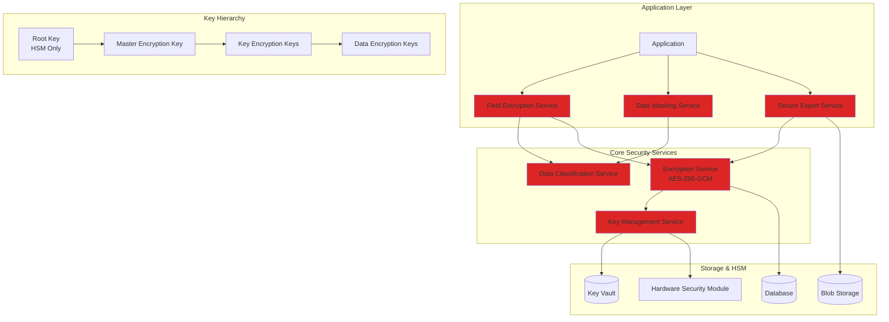
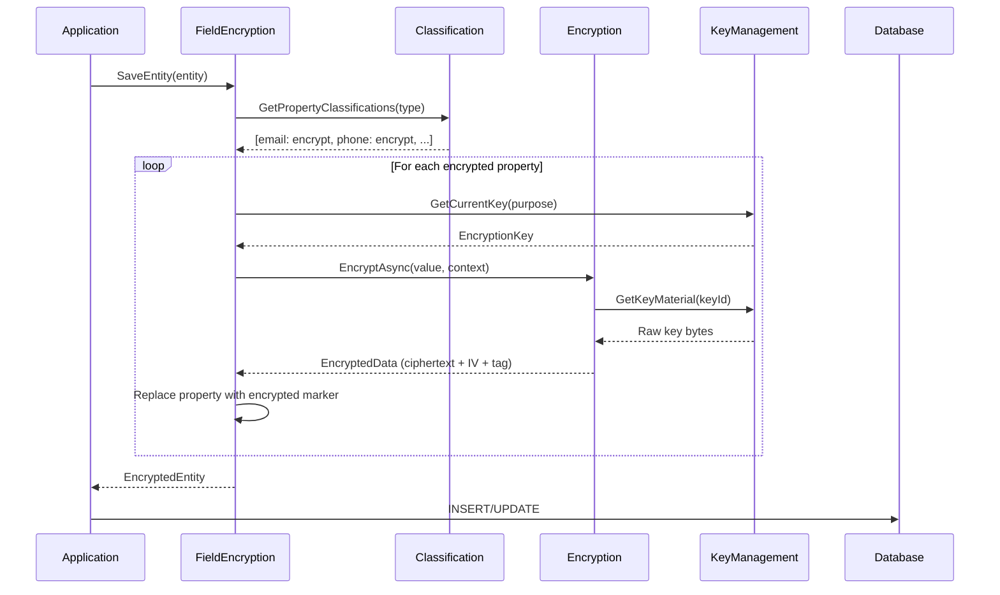
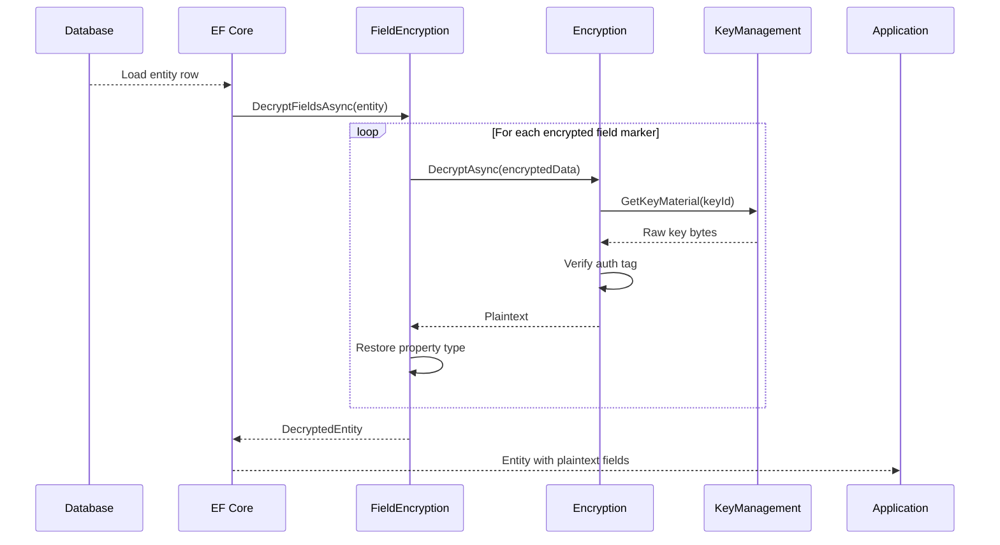
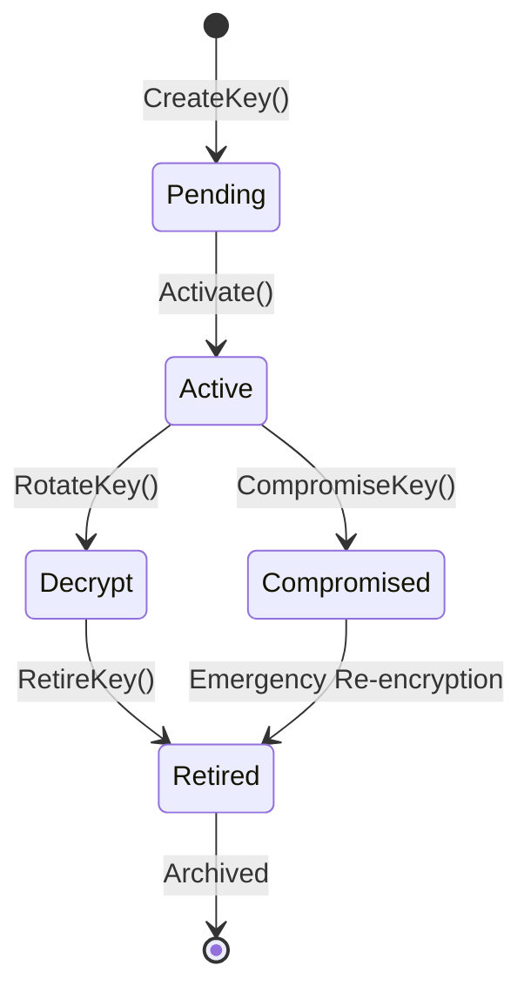

# LCS-DES-113-SEC-INDEX: Data Protection & Encryption (v0.11.3)

## Overview

This index provides a complete map of the **Data Protection & Encryption** specification suite for Lexichord v0.11.3-SEC. These six design specifications implement comprehensive encryption, key management, and data protection for the Lexichord knowledge graph.

---

## Document Index

| Document | Title | Purpose | Hours | Status |
|:---------|:------|:--------|:------|:-------|
| **LCS-DES-113-SEC-e** | Data Classification | Tag and classify sensitive data by sensitivity level | 6 | Draft |
| **LCS-DES-113-SEC-f** | Encryption Service | Core AES-256-GCM encryption/decryption engine | 10 | Draft |
| **LCS-DES-113-SEC-g** | Key Management | Secure key storage, rotation, and lifecycle management | 10 | Draft |
| **LCS-DES-113-SEC-h** | Field-Level Encryption | Transparent encryption of sensitive entity properties | 8 | Draft |
| **LCS-DES-113-SEC-i** | Data Masking | Dynamic masking of sensitive data for UI display | 6 | Draft |
| **LCS-DES-113-SEC-j** | Secure Export | Encrypted export/import with key escrow support | 5 | Draft |
| **Total** | | | **45 hours** | |

---

## Architecture Overview

### 5.1 System Architecture



### 5.2 Data Flow: Encryption at Write



### 5.3 Data Flow: Decryption at Read



---

## Key Management Hierarchy

### 6.1 Key Hierarchy Structure

```mermaid
graph TD
    subgraph "Master Keys (in HSM, never leave)"
        ROOT["🔐 Root Key"]
        MEK["🔐 Master Encryption Key"]
    end

    subgraph "Key Encryption Keys (wrapped, in Vault)"
        KEK1["KEK: Graph Data"]
        KEK2["KEK: Credentials"]
        KEK3["KEK: Export"]
    end

    subgraph "Data Encryption Keys (wrapped, in Database/Vault)"
        DEK1["DEK: Entities"]
        DEK2["DEK: Claims"]
        DEK3["DEK: Axioms"]
        DEK4["DEK: API Keys"]
        DEK5["DEK: Export Files"]
    end

    ROOT --> MEK
    MEK --> KEK1
    MEK --> KEK2
    MEK --> KEK3

    KEK1 --> DEK1
    KEK1 --> DEK2
    KEK1 --> DEK3
    KEK2 --> DEK4
    KEK3 --> DEK5

    style ROOT fill:#991b1b
    style MEK fill:#dc2626
    style KEK1 fill:#ef4444
    style KEK2 fill:#ef4444
    style KEK3 fill:#ef4444
    style DEK1 fill:#fca5a5
    style DEK2 fill:#fca5a5
    style DEK3 fill:#fca5a5
    style DEK4 fill:#fca5a5
    style DEK5 fill:#fca5a5
```



### 6.2 Key Rotation & Lifecycle



---

## Classification Levels

### 7.1 Sensitivity Hierarchy

```
Level 4: Secret
├── Maximum protection
├── Encryption mandatory
├── Masking: Full (****)
├── Audit: Every access
└── Examples: API keys, passwords, secrets

Level 3: Restricted
├── Encryption mandatory
├── Masking: Partial (****5678) or Email (j***@***.com)
├── Audit: On unmasking
└── Examples: SSN, credit cards, email, phone

Level 2: Confidential
├── Encryption recommended
├── Masking: Optional
├── Audit: On request
└── Examples: Department, salary, internal notes

Level 1: Internal
├── Encryption optional
├── No masking
├── No audit
└── Examples: Username, department, created_at

Level 0: Public
├── No encryption
├── No masking
├── No audit
└── Examples: ID, public timestamps, version
```

---

## Data Types & Records

### 8.1 Classification Records

| Record | Fields | Purpose |
|:-------|:-------|:--------|
| `DataClassification` | (Enum) Public, Internal, Confidential, Restricted, Secret | Entity sensitivity levels |
| `PropertyClassification` | PropertyName, Classification, RequiresEncryption, RequiresMasking, MaskingType | Per-property rules |
| `DetectedSensitiveProperty` | PropertyName, SuggestedClassification, ConfidenceScore, DetectionReason | Auto-detection results |

### 8.2 Encryption Records

| Record | Fields | Purpose |
|:-------|:-------|:--------|
| `EncryptedData` | Ciphertext, IV, AuthTag, KeyId, Algorithm, EncryptedAt | Complete encrypted value with metadata |
| `EncryptionContext` | KeyId, Purpose, AAD, RequestedByUserId, AuditReason | Context for encryption operation |
| `EncryptionKey` | KeyId, Purpose, Algorithm, Status, CreatedAt, ActivatedAt, ExpiresAt, RetiredAt | Key metadata (NOT key material) |

### 8.3 Masking Records

| Record | Fields | Purpose |
|:-------|:-------|:--------|
| `MaskingType` | (Enum) Full, Partial, Email, Phone, CreditCard, SSN, Custom, None | Masking strategies |
| `MaskingContext` | ViewerId, ViewerPermissions, AuditAccess, AccessReason, AllowUnmasking | Masking operation context |
| `MaskingStatistics` | TotalMaskedAccesses, SuccessfulUnmaskRequests, DeniedUnmaskRequests | Audit statistics |

### 8.4 Export Records

| Record | Fields | Purpose |
|:-------|:-------|:--------|
| `ExportPackage` | ExportId, FileContent, ExportKey, RecoveryCode, HasEscrow, Metadata | Complete export with all metadata |
| `ExportMetadata` | ExportId, CreatedByUserId, EntityCount, EntityTypes, FileChecksum | Export metadata for audit |
| `ExportOptions` | EnableKeyEscrow, ExportReason, ExpiresIn, Compression, SignExport | Configuration for export |

---

## Interface Summary

### 9.1 Core Interfaces

```csharp
// Classification
IDataClassificationService
├── GetClassificationAsync(entityType)
├── GetPropertyClassificationsAsync(entityType)
├── SetClassificationAsync(entityType, classification)
├── SetPropertyClassificationAsync(entityType, propertyName, ...)
├── DetectSensitivePropertiesAsync(entityId)
├── ExportPolicyAsync()
└── ImportPolicyAsync(policyJson)

// Encryption
IEncryptionService
├── EncryptAsync(plaintext, context)
├── DecryptAsync(encryptedData)
├── EncryptStringAsync(plaintext, context)
├── DecryptStringAsync(ciphertext)
├── ReEncryptAsync(ciphertext, newKeyId)
├── IsEncrypted(ciphertext)
└── GetMetadata(encryptedData)

// Key Management
IKeyManagementService
├── GetCurrentKeyAsync(purpose)
├── GetKeyAsync(keyId)
├── GetKeysForPurposeAsync(purpose)
├── CreateKeyAsync(request)
├── RotateKeyAsync(purpose, options)
├── RetireKeyAsync(keyId)
├── CompromiseKeyAsync(keyId, reason)
├── GetKeyMaterialAsync(keyId)
├── GetRotationScheduleAsync(purpose)
├── GetStatisticsAsync()
└── ExportAuditLogAsync()

// Field Encryption
IFieldEncryptionService
├── EncryptFieldsAsync(entity)
├── DecryptFieldsAsync(entity)
├── GetFieldStatusAsync(entityId)
├── ReEncryptFieldsAsync(entityId, oldKeyId, newKeyId)
├── IsFieldEncryptedAsync(entityId, fieldName)
└── GetStatisticsAsync(entityType)

// Masking
IDataMaskingService
├── Mask(value, maskingType)
├── MaskEntityAsync(entity, context)
├── CanViewUnmaskedAsync(propertyId)
├── RequestUnmaskedValueAsync(propertyId, reason)
├── GetStatisticsAsync()
└── ExportAuditLogAsync()

// Export
ISecureExportService
├── ExportAsync(entityIds, options)
├── ExportByTypeAsync(entityType, options)
├── ImportAsync(packageFile, exportKey)
├── CreateRecoveryCodeAsync(exportId, reason)
├── GetExportMetadataAsync(exportId)
├── GetExportHistoryAsync()
├── DeleteExportAsync(exportId)
└── GetStatisticsAsync()
```

---

## Implementation Checklist

### 10.1 Phase 1: Core Services (Weeks 1-2)

- [ ] Create `IEncryptionService` interface
- [ ] Implement `AesGcmEncryptionService` with AES-256-GCM
- [ ] Create `IKeyManagementService` interface
- [ ] Implement `KeyManagementService` with key lifecycle
- [ ] Setup HSM/Key Vault integration
- [ ] Create test suite for encryption and key management

### 10.2 Phase 2: Classification (Week 3)

- [ ] Create `IDataClassificationService` interface
- [ ] Implement `DataClassificationService`
- [ ] Create built-in classification policies
- [ ] Implement auto-detection with PII detector
- [ ] Create classification UI components
- [ ] Create test suite

### 10.3 Phase 3: Field Encryption (Week 4)

- [ ] Create `IFieldEncryptionService` interface
- [ ] Implement `FieldEncryptionService`
- [ ] Create EF Core interceptor for transparent encryption
- [ ] Implement field-level re-encryption
- [ ] Create test suite

### 10.4 Phase 4: Masking & Export (Week 5)

- [ ] Create `IDataMaskingService` interface
- [ ] Implement `DataMaskingService`
- [ ] Create masking rules and patterns
- [ ] Create `ISecureExportService` interface
- [ ] Implement `SecureExportService`
- [ ] Create test suite

### 10.5 Phase 5: Integration & Testing (Week 6)

- [ ] Integration tests across all services
- [ ] Performance testing and optimization
- [ ] Security audit and penetration testing
- [ ] Documentation and examples
- [ ] License gating implementation

---

## Performance Targets

### 11.1 Operation Targets

| Operation | Target | Baseline |
|:----------|:-------|:---------|
| Encrypt field (1KB) | <1ms | - |
| Decrypt field (1KB) | <1ms | - |
| Mask value | <100µs | - |
| Key rotation (1K items) | <60s | - |
| Export (100 entities) | <5s | - |
| Import (100 entities) | <5s | - |
| **Overhead on operations** | **<5%** | - |

### 11.2 Throughput Targets

- Encryption: >1GB/s (hardware accelerated)
- Decryption: >1GB/s (hardware accelerated)
- Key generation: <500ms per key

---

## Security Considerations

### 12.1 Threat Model

| Threat | Impact | Mitigation |
|:-------|:-------|:-----------|
| Data breach (theft) | High | Encryption at rest makes data useless |
| Key compromise | High | Key rotation, key escrow, audit trail |
| Unauthorized access | Medium | Authorization checks, masking |
| Tampering | Medium | HMAC-SHA256 auth tags verify integrity |
| Replay attacks | Low | Unique IV per encryption, timestamps |

### 12.2 Best Practices

1. **Key Management**
   - Root key never leaves HSM
   - KEKs wrapped with MEK
   - DEKs wrapped with KEKs
   - Regular key rotation (90 days)
   - Compromised key emergency procedures

2. **Encryption**
   - AES-256-GCM (FIPS approved)
   - Random IV per encryption (12 bytes)
   - 16-byte HMAC-SHA256 auth tag
   - Additional Authenticated Data (AAD) for context

3. **Field Encryption**
   - Transparent to application
   - Classification-driven
   - Automatic re-encryption on key rotation
   - Backward compatible with unencrypted data

4. **Masking**
   - Permission-based unmasking
   - Audit trail of all access
   - Dynamic, not stored
   - Multiple masking strategies

5. **Export**
   - One-time export keys
   - Optional key escrow
   - Checksum verification
   - Compression before encryption

---

## License Gating

### 13.1 Tier Breakdown

| Tier | e-Classification | f-Encryption | g-KeyMgmt | h-FieldEnc | i-Masking | j-Export |
|:-----|:-----------------|:-------------|:----------|:-----------|:----------|:---------|
| **Core** | Public/Internal only | Database-level | Single key | N/A | N/A | N/A |
| **WriterPro** | ✓ All levels | ✓ Full | ✓ Full | N/A | ✓ Basic | ✓ Basic |
| **Teams** | ✓ Full + Auto-detect | ✓ Full | ✓ Full | ✓ Full | ✓ Full | ✓ Full |
| **Enterprise** | ✓ + Custom rules | ✓ + HSM | ✓ + HSM | ✓ + Audit | ✓ + Audit | ✓ + Escrow |

---

## Related Documents

### 14.1 Dependencies

- **v0.9.6** (PII Scrubber) - Used for sensitive property detection
- **v0.11.1-SEC** (Access Control) - Authorization checks for unmasking
- **v0.11.2-SEC** (Audit Logging) - Logs encryption operations
- **External** - Azure Key Vault / AWS KMS / CloudHSM

### 14.2 Complementary Features

- **v0.11.0a** (Entity Versioning) - Encryption applies per version
- **v0.11.0b** (Graph Serialization) - Handles encrypted fields in JSON
- **v0.11.2-SEC** (Audit Logging) - Complete audit trail

---

## Configuration Examples

### 15.1 Startup Configuration

```csharp
// Program.cs
var services = new ServiceCollection();

// Add encryption services
services.AddSingleton<IEncryptionService, AesGcmEncryptionService>();
services.AddSingleton<IKeyManagementService, KeyManagementService>();
services.AddSingleton<IDataClassificationService, DataClassificationService>();
services.AddSingleton<IFieldEncryptionService, FieldEncryptionService>();
services.AddSingleton<IDataMaskingService, DataMaskingService>();
services.AddSingleton<ISecureExportService, SecureExportService>();

// Add HSM provider
services.AddSingleton<IHsmProvider>(sp => new AzureKeyVaultProvider(
    vaultUri: "https://my-keyvault.vault.azure.net/",
    tenantId: "...",
    clientId: "...",
    clientSecret: "..."));

// Add repositories
services.AddScoped<IKeyRepository, KeyRepository>();
services.AddScoped<IClassificationRepository, ClassificationRepository>();
services.AddScoped<IMaskingRepository, MaskingRepository>();
services.AddScoped<IExportRepository, ExportRepository>();

// Initialize services
var provider = services.BuildServiceProvider();
var keyMgmt = provider.GetRequiredService<IKeyManagementService>();
await keyMgmt.InitializeAsync();
```

---

## Testing Strategy

### 16.1 Test Coverage

- **Unit Tests**: 85%+ coverage for all services
- **Integration Tests**: End-to-end encryption/decryption
- **Security Tests**: Tampering detection, key rotation
- **Performance Tests**: Throughput and latency benchmarks
- **Compliance Tests**: FIPS 140-2, OWASP standards

### 16.2 Test Scenarios

```csharp
// Classification
- Auto-detect SSN, email, credit card patterns
- Property-level override of entity classification
- Policy import/export validation

// Encryption
- AES-256-GCM correctness
- IV uniqueness per encryption
- Auth tag verification on tampering
- Re-encryption with key rotation

// Key Management
- Key generation in HSM
- Key rotation without downtime
- Compromised key emergency procedures
- Key expiration enforcement

// Field Encryption
- Transparent encryption on save
- Automatic decryption on load
- Type preservation and restoration
- Lazy vs. eager re-encryption

// Masking
- Correct masking for each type
- Permission-based unmasking
- Audit trail recording
- Performance under load

// Export
- Export encryption and checksum
- Import with deduplication
- Key escrow and recovery
- Compression efficiency
```

---

## Troubleshooting Guide

### 17.1 Common Issues

| Issue | Cause | Solution |
|:------|:------|:---------|
| "Key not found" error | Rotated key retired too soon | Restore from backup or use recovery key |
| "Auth tag verification failed" | Ciphertext tampered or wrong key | Verify key ID in encrypted data |
| "Decryption takes too long" | Key material not cached | Implement key caching layer |
| "Export file too large" | No compression enabled | Enable compression in ExportOptions |
| "Unmask denied" | User lacks permission | Grant UnmaskSensitiveData permission |

---

## Glossary

- **AAD** - Additional Authenticated Data (authenticated but not encrypted)
- **DEK** - Data Encryption Key (encrypts actual data)
- **GCM** - Galois/Counter Mode (authenticated encryption)
- **HSM** - Hardware Security Module (secure key storage)
- **KEK** - Key Encryption Key (encrypts other keys)
- **IV** - Initialization Vector (random per encryption)
- **MEK** - Master Encryption Key (top of key hierarchy)
- **PII** - Personally Identifiable Information
- **Escrow** - Backup copy of key for recovery

---

## Revision History

### v0.11.3 (2026-01-31)

**Initial Release**
- Complete specification suite for data protection & encryption
- 6 design documents covering all aspects
- 45 hours estimated implementation
- Full API contracts with C# examples
- Comprehensive test strategies
- Performance and security guidelines

---

## Document Navigation

### Jump to Specification

- [LCS-DES-113-SEC-e: Data Classification](./LCS-DES-113-SEC-e.md)
- [LCS-DES-113-SEC-f: Encryption Service](./LCS-DES-113-SEC-f.md)
- [LCS-DES-113-SEC-g: Key Management](./LCS-DES-113-SEC-g.md)
- [LCS-DES-113-SEC-h: Field-Level Encryption](./LCS-DES-113-SEC-h.md)
- [LCS-DES-113-SEC-i: Data Masking](./LCS-DES-113-SEC-i.md)
- [LCS-DES-113-SEC-j: Secure Export](./LCS-DES-113-SEC-j.md)

### Related Documents

- [LCS-SBD-113-SEC: Scope Overview](./LCS-SBD-113-SEC.md)
- [v0.11.1-SEC: Access Control](../v0.11.1/LCS-SBD-111-SEC.md)
- [v0.11.2-SEC: Audit Logging](../v0.11.2/LCS-SBD-112-SEC.md)

---

**Document Owner:** Security Architect
**Last Updated:** 2026-01-31
**Version:** v0.11.3 (Draft)

