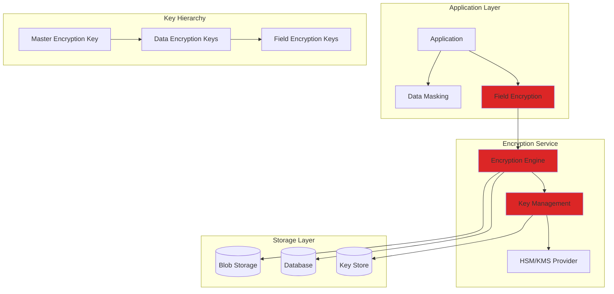
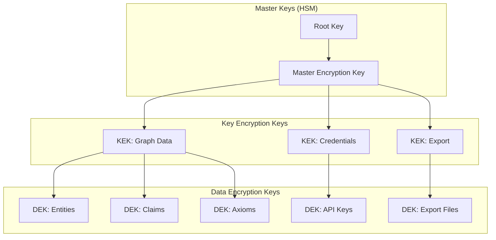
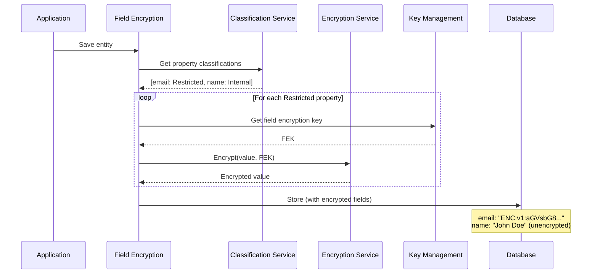

# LCS-SBD-113-SEC: Scope Overview — Data Protection & Encryption

## Document Control

| Field            | Value                                                        |
| :--------------- | :----------------------------------------------------------- |
| **Document ID**  | LCS-SBD-113-SEC                                              |
| **Version**      | v0.11.3                                                      |
| **Codename**     | Data Protection & Encryption (Security Phase 3)              |
| **Status**       | Draft                                                        |
| **Last Updated** | 2026-01-31                                                   |
| **Owner**        | Security Architect                                           |
| **Depends On**   | v0.9.6 (PII Scrubber), v0.11.1-SEC (Access Control)          |

---

## 1. Executive Summary

### 1.1 The Vision

**v0.11.3-SEC** delivers **Data Protection & Encryption** — comprehensive protection for sensitive knowledge at rest, in transit, and in use. This includes:

- Encryption at rest for all knowledge graph data
- Field-level encryption for sensitive properties
- Data masking and redaction for display
- Secure key management with rotation
- Data classification and handling policies

### 1.2 Business Value

- **Compliance:** Meet encryption requirements (GDPR, HIPAA, PCI-DSS).
- **Breach Protection:** Encrypted data is useless if stolen.
- **Privacy:** Protect sensitive information from unauthorized viewing.
- **Trust:** Demonstrate data protection to customers and auditors.
- **Flexibility:** Different protection levels for different data types.

### 1.3 Success Criteria

1. All data encrypted at rest with AES-256.
2. Field-level encryption for designated sensitive properties.
3. Transparent encryption (no application code changes).
4. Key rotation without downtime.
5. Data masking in UI for sensitive fields.
6. Encryption overhead <5% on read/write operations.

---

## 2. Key Deliverables

### 2.1 Sub-Parts

| Sub-Part | Title | Description | Est. Hours |
|:---------|:------|:------------|:-----------|
| v0.11.3a | Data Classification | Tag and classify sensitive data | 6 |
| v0.11.3b | Encryption Service | Core encryption/decryption engine | 10 |
| v0.11.3c | Key Management | Secure key storage and rotation | 10 |
| v0.11.3d | Field-Level Encryption | Encrypt specific entity properties | 8 |
| v0.11.3e | Data Masking | Dynamic masking for display | 6 |
| v0.11.3f | Secure Export | Encrypted export with key escrow | 5 |
| **Total** | | | **45 hours** |

### 2.2 Key Interfaces

```csharp
/// <summary>
/// Encrypts and decrypts data.
/// </summary>
public interface IEncryptionService
{
    /// <summary>
    /// Encrypts data with the current key.
    /// </summary>
    Task<EncryptedData> EncryptAsync(
        byte[] plaintext,
        EncryptionContext context,
        CancellationToken ct = default);

    /// <summary>
    /// Decrypts data.
    /// </summary>
    Task<byte[]> DecryptAsync(
        EncryptedData ciphertext,
        CancellationToken ct = default);

    /// <summary>
    /// Encrypts a string value.
    /// </summary>
    Task<string> EncryptStringAsync(
        string plaintext,
        EncryptionContext context,
        CancellationToken ct = default);

    /// <summary>
    /// Decrypts a string value.
    /// </summary>
    Task<string> DecryptStringAsync(
        string ciphertext,
        CancellationToken ct = default);

    /// <summary>
    /// Re-encrypts data with a new key.
    /// </summary>
    Task<EncryptedData> ReEncryptAsync(
        EncryptedData ciphertext,
        Guid newKeyId,
        CancellationToken ct = default);
}

public record EncryptedData
{
    public required byte[] Ciphertext { get; init; }
    public required byte[] Iv { get; init; }
    public required byte[] AuthTag { get; init; }
    public required Guid KeyId { get; init; }
    public required string Algorithm { get; init; }
    public DateTimeOffset EncryptedAt { get; init; }
}

public record EncryptionContext
{
    public Guid? KeyId { get; init; }
    public string? Purpose { get; init; }
    public IReadOnlyDictionary<string, string>? AdditionalAuthenticatedData { get; init; }
}

/// <summary>
/// Manages encryption keys.
/// </summary>
public interface IKeyManagementService
{
    /// <summary>
    /// Gets the current active key for a purpose.
    /// </summary>
    Task<EncryptionKey> GetCurrentKeyAsync(
        string purpose,
        CancellationToken ct = default);

    /// <summary>
    /// Gets a specific key by ID.
    /// </summary>
    Task<EncryptionKey?> GetKeyAsync(
        Guid keyId,
        CancellationToken ct = default);

    /// <summary>
    /// Creates a new encryption key.
    /// </summary>
    Task<EncryptionKey> CreateKeyAsync(
        CreateKeyRequest request,
        CancellationToken ct = default);

    /// <summary>
    /// Rotates to a new key, keeping old key for decryption.
    /// </summary>
    Task<KeyRotationResult> RotateKeyAsync(
        string purpose,
        KeyRotationOptions options,
        CancellationToken ct = default);

    /// <summary>
    /// Retires an old key after re-encryption.
    /// </summary>
    Task RetireKeyAsync(
        Guid keyId,
        CancellationToken ct = default);
}

public record EncryptionKey
{
    public Guid KeyId { get; init; }
    public required string Purpose { get; init; }
    public required string Algorithm { get; init; }
    public int KeySizeBits { get; init; }
    public KeyStatus Status { get; init; }
    public DateTimeOffset CreatedAt { get; init; }
    public DateTimeOffset? ActivatedAt { get; init; }
    public DateTimeOffset? ExpiresAt { get; init; }
    public DateTimeOffset? RetiredAt { get; init; }
    public Guid? PreviousKeyId { get; init; }
}

public enum KeyStatus
{
    Pending,    // Created but not active
    Active,     // Current key for encryption
    Decrypt,    // Only used for decryption (rotated)
    Retired,    // No longer usable
    Compromised // Marked as compromised
}

public record CreateKeyRequest
{
    public required string Purpose { get; init; }
    public string Algorithm { get; init; } = "AES-256-GCM";
    public TimeSpan? Lifetime { get; init; }
    public bool ActivateImmediately { get; init; } = true;
}

public record KeyRotationResult
{
    public Guid NewKeyId { get; init; }
    public Guid OldKeyId { get; init; }
    public int ItemsToReEncrypt { get; init; }
    public bool ReEncryptionStarted { get; init; }
}

/// <summary>
/// Classifies data sensitivity.
/// </summary>
public interface IDataClassificationService
{
    /// <summary>
    /// Gets the classification for an entity type.
    /// </summary>
    Task<DataClassification> GetClassificationAsync(
        string entityType,
        CancellationToken ct = default);

    /// <summary>
    /// Gets classified properties for an entity type.
    /// </summary>
    Task<IReadOnlyList<PropertyClassification>> GetPropertyClassificationsAsync(
        string entityType,
        CancellationToken ct = default);

    /// <summary>
    /// Sets classification for an entity type.
    /// </summary>
    Task SetClassificationAsync(
        string entityType,
        DataClassification classification,
        CancellationToken ct = default);

    /// <summary>
    /// Auto-detects sensitive properties.
    /// </summary>
    Task<IReadOnlyList<DetectedSensitiveProperty>> DetectSensitivePropertiesAsync(
        Guid entityId,
        CancellationToken ct = default);
}

public enum DataClassification
{
    Public,         // No restrictions
    Internal,       // Company internal
    Confidential,   // Business sensitive
    Restricted,     // Highly sensitive (PII, credentials)
    Secret          // Maximum protection
}

public record PropertyClassification
{
    public required string PropertyName { get; init; }
    public DataClassification Classification { get; init; }
    public bool RequiresEncryption { get; init; }
    public bool RequiresMasking { get; init; }
    public MaskingType MaskingType { get; init; }
    public bool RequiresAuditOnAccess { get; init; }
}

/// <summary>
/// Masks sensitive data for display.
/// </summary>
public interface IDataMaskingService
{
    /// <summary>
    /// Masks a value based on masking rules.
    /// </summary>
    string Mask(string value, MaskingType maskingType);

    /// <summary>
    /// Masks sensitive properties in an entity.
    /// </summary>
    Task<Entity> MaskEntityAsync(
        Entity entity,
        MaskingContext context,
        CancellationToken ct = default);

    /// <summary>
    /// Checks if current user can see unmasked value.
    /// </summary>
    Task<bool> CanViewUnmaskedAsync(
        Guid propertyId,
        CancellationToken ct = default);
}

public enum MaskingType
{
    Full,           // ********
    Partial,        // ****5678
    Email,          // j***@***.com
    Phone,          // ***-***-1234
    CreditCard,     // ****-****-****-5678
    SSN,            // ***-**-6789
    Custom          // User-defined pattern
}

public record MaskingContext
{
    public Guid? ViewerId { get; init; }
    public IReadOnlyList<string>? UnmaskPermissions { get; init; }
    public bool AuditAccess { get; init; } = true;
}

/// <summary>
/// Field-level encryption for entity properties.
/// </summary>
public interface IFieldEncryptionService
{
    /// <summary>
    /// Encrypts sensitive fields before storage.
    /// </summary>
    Task<Entity> EncryptFieldsAsync(
        Entity entity,
        CancellationToken ct = default);

    /// <summary>
    /// Decrypts sensitive fields after retrieval.
    /// </summary>
    Task<Entity> DecryptFieldsAsync(
        Entity entity,
        CancellationToken ct = default);

    /// <summary>
    /// Gets encryption status for entity fields.
    /// </summary>
    Task<IReadOnlyList<FieldEncryptionStatus>> GetFieldStatusAsync(
        Guid entityId,
        CancellationToken ct = default);
}

public record FieldEncryptionStatus
{
    public required string FieldName { get; init; }
    public bool IsEncrypted { get; init; }
    public Guid? KeyId { get; init; }
    public DateTimeOffset? EncryptedAt { get; init; }
    public bool NeedsReEncryption { get; init; }
}
```

### 2.3 Encryption Architecture



---

## 3. Key Hierarchy



**Key Hierarchy Benefits:**
- Root key never leaves HSM
- KEKs encrypted by MEK
- DEKs encrypted by KEKs
- Rotation at any level
- Compartmentalized access

---

## 4. Field-Level Encryption Flow



---

## 5. Data Classification UI

```
┌────────────────────────────────────────────────────────────────┐
│ Data Classification                                 [+ New]    │
├────────────────────────────────────────────────────────────────┤
│                                                                │
│ Entity Type Classifications:                                   │
│ ┌────────────────────────────────────────────────────────────┐ │
│ │ Entity Type      │ Classification │ Encrypted │ Properties │ │
│ ├────────────────────────────────────────────────────────────┤ │
│ │ User             │ 🔴 Restricted  │ 3 fields  │ [Configure]│ │
│ │ Credential       │ 🔴 Restricted  │ 5 fields  │ [Configure]│ │
│ │ APIKey           │ 🔴 Restricted  │ 2 fields  │ [Configure]│ │
│ │ Service          │ 🟡 Confidential│ 0 fields  │ [Configure]│ │
│ │ Endpoint         │ 🟢 Internal    │ 0 fields  │ [Configure]│ │
│ │ Database         │ 🟡 Confidential│ 1 field   │ [Configure]│ │
│ └────────────────────────────────────────────────────────────┘ │
│                                                                │
│ ═══════════════════════════════════════════════════════════   │
│ Configure: User                                                │
│ ═══════════════════════════════════════════════════════════   │
│                                                                │
│ ┌────────────────────────────────────────────────────────────┐ │
│ │ Property     │ Class.      │ Encrypt │ Mask    │ Audit    │ │
│ ├────────────────────────────────────────────────────────────┤ │
│ │ email        │ Restricted  │ ☑       │ Email   │ ☑        │ │
│ │ phone        │ Restricted  │ ☑       │ Phone   │ ☑        │ │
│ │ ssn          │ Secret      │ ☑       │ SSN     │ ☑        │ │
│ │ name         │ Internal    │ ☐       │ None    │ ☐        │ │
│ │ department   │ Internal    │ ☐       │ None    │ ☐        │ │
│ │ created_at   │ Public      │ ☐       │ None    │ ☐        │ │
│ └────────────────────────────────────────────────────────────┘ │
│                                                                │
│ [Auto-Detect Sensitive Fields] [Save] [Cancel]                │
│                                                                │
└────────────────────────────────────────────────────────────────┘
```

---

## 6. Key Management UI

```
┌────────────────────────────────────────────────────────────────┐
│ Encryption Key Management                           [+ New]    │
├────────────────────────────────────────────────────────────────┤
│                                                                │
│ Key Status Overview:                                           │
│ ├── Active Keys: 12                                           │
│ ├── Pending Rotation: 2                                       │
│ ├── Retired Keys: 45                                          │
│ └── Items needing re-encryption: 1,234                        │
│                                                                │
│ ┌────────────────────────────────────────────────────────────┐ │
│ │ Purpose          │ Key ID   │ Status │ Age    │ Actions   │ │
│ ├────────────────────────────────────────────────────────────┤ │
│ │ graph-data       │ k_7a3f.. │ Active │ 45d    │ [Rotate]  │ │
│ │ field-encryption │ k_8b4e.. │ Active │ 12d    │ [Rotate]  │ │
│ │ credentials      │ k_9c5f.. │ Active │ 89d ⚠  │ [Rotate]  │ │
│ │ export           │ k_1d6g.. │ Active │ 30d    │ [Rotate]  │ │
│ │ backup           │ k_2e7h.. │ Active │ 60d    │ [Rotate]  │ │
│ └────────────────────────────────────────────────────────────┘ │
│                                                                │
│ ⚠ Key "credentials" approaching 90-day rotation policy        │
│                                                                │
│ Rotation History:                                              │
│ ├── 2026-01-15: graph-data rotated (12,456 items re-encrypted)│
│ ├── 2026-01-01: field-encryption rotated (3,421 items)        │
│ └── 2025-12-15: export rotated (automatic)                    │
│                                                                │
│ [Schedule Rotation] [Re-encrypt All] [Export Key Backup]      │
│                                                                │
└────────────────────────────────────────────────────────────────┘
```

---

## 7. Dependencies

| Component | Source | Usage |
|:----------|:-------|:------|
| `ISecureVault` | v0.0.6a | Master key storage |
| `IPiiDetector` | v0.9.6 | Sensitive data detection |
| `IAuthorizationService` | v0.11.1-SEC | Access control |
| `IAuditLogger` | v0.11.2-SEC | Encryption events |
| Azure Key Vault / AWS KMS | External | HSM provider |

---

## 8. License Gating

| Tier | Data Protection |
|:-----|:----------------|
| Core | Database-level encryption only |
| WriterPro | + Data masking |
| Teams | + Field-level encryption |
| Enterprise | + HSM integration + key escrow |

---

## 9. Performance Targets

| Metric | Target | Measurement |
|:-------|:-------|:------------|
| Encrypt field | <2ms | P95 timing |
| Decrypt field | <2ms | P95 timing |
| Mask value | <1ms | P95 timing |
| Key rotation (1K items) | <60s | Total time |
| Overhead on operations | <5% | Throughput |

---

## 10. Supported Algorithms

| Purpose | Algorithm | Key Size |
|:--------|:----------|:---------|
| Data encryption | AES-256-GCM | 256 bits |
| Key encryption | AES-256-KW | 256 bits |
| Key derivation | HKDF-SHA256 | — |
| Hashing | SHA-256 | 256 bits |
| Signing | Ed25519 | 256 bits |

---

## 11. Risks & Mitigations

| Risk | Mitigation |
|:-----|:-----------|
| Key loss | Key escrow, backup procedures |
| Performance impact | Caching, async encryption |
| Migration complexity | Gradual rollout, dual-mode |
| HSM availability | Local fallback, multi-region |

---
