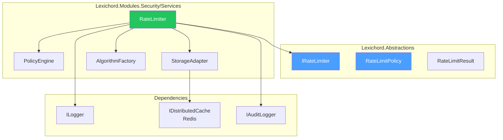
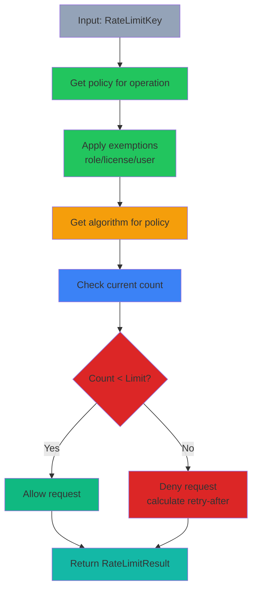

# LCS-DES-114-SEC-h: Design Specification — Rate Limiter

## 1. Metadata & Categorization

| Field                | Value                                      |
| :------------------- | :----------------------------------------- |
| **Document ID**      | LCS-DES-114-SEC-h                          |
| **Feature ID**       | SEC-114h                                   |
| **Feature Name**     | Rate Limiter                               |
| **Parent Feature**   | v0.11.4 — Input Security & Validation      |
| **Module Scope**     | Lexichord.Modules.Security                 |
| **Swimlane**         | Security                                   |
| **License Tier**     | Teams (custom limits)                      |
| **Feature Gate Key** | `FeatureFlags.Security.RateLimiter`        |
| **Status**           | Draft                                      |
| **Last Updated**     | 2026-01-31                                 |
| **Est. Hours**       | 6                                          |

---

## 2. Executive Summary

### 2.1 Problem Statement

Unbounded API usage leads to:

- Denial of service attacks via request flooding
- Resource exhaustion from intensive operations
- Unfair resource allocation among users

### 2.2 Solution Overview

Implement `IRateLimiter` that enforces request rate limits:

- **Multiple algorithms** (fixed window, sliding window, token bucket)
- **Flexible scoping** (user, IP, API key, operation)
- **Role-based exemptions** (admin, premium tiers)
- **Detailed status reporting** for rate limit headers

### 2.3 Key Deliverables

| Deliverable | Description |
| :---------- | :---------- |
| `IRateLimiter` | Interface in Lexichord.Abstractions |
| `RateLimiter` | Implementation with Redis backend |
| `RateLimitPolicy` | Policy definition record |
| `RateLimitResult` | Check result with status |
| Policy engine | Configuration-based policy management |
| Unit tests | 95%+ coverage of limiting logic |

---

## 3. Architecture & Modular Strategy

### 3.1 Component Diagram



### 3.2 Module Location

```text
src/
├── Lexichord.Abstractions/
│   └── Contracts/
│       └── RateLimitingModels.cs             ← Interfaces and records
│
└── Lexichord.Modules.Security/
    └── Services/
        ├── RateLimiter.cs                    ← Main implementation
        └── RateLimit/
            ├── PolicyEngine.cs               ← Policy evaluation
            ├── StorageAdapter.cs             ← Redis/cache backend
            ├── FixedWindowCounter.cs         ← Algorithm implementation
            ├── SlidingWindowCounter.cs       ← Algorithm implementation
            ├── TokenBucketCounter.cs         ← Algorithm implementation
            └── LeakyBucketCounter.cs         ← Algorithm implementation
```

---

## 4. Data Contract (The API)

### 4.1 IRateLimiter Interface

```csharp
namespace Lexichord.Abstractions.Contracts;

/// <summary>
/// Enforces rate limiting on API requests.
/// </summary>
/// <remarks>
/// <para>Supports multiple scoping dimensions and limiting algorithms.</para>
/// <para>Integrates with distributed cache (Redis) for multi-instance deployments.</para>
/// </remarks>
/// <example>
/// <code>
/// var key = new RateLimitKey
/// {
///     Scope = "user",
///     Identifier = userId,
///     Operation = "query"
/// };
///
/// var result = await _limiter.CheckAsync(key);
/// if (!result.IsAllowed)
/// {
///     return 429 Too Many Requests
/// }
///
/// await _limiter.RecordAsync(key);
/// </code>
/// </example>
public interface IRateLimiter
{
    /// <summary>
    /// Checks if a request is allowed under rate limits.
    /// </summary>
    /// <param name="key">Rate limit key (scope, identifier, operation).</param>
    /// <param name="ct">Cancellation token.</param>
    /// <returns>
    /// Result with IsAllowed and retry-after information.
    /// </returns>
    Task<RateLimitResult> CheckAsync(
        RateLimitKey key,
        CancellationToken ct = default);

    /// <summary>
    /// Records a request against the rate limit.
    /// </summary>
    /// <param name="key">Rate limit key.</param>
    /// <param name="ct">Cancellation token.</param>
    Task RecordAsync(
        RateLimitKey key,
        CancellationToken ct = default);

    /// <summary>
    /// Gets current rate limit status.
    /// </summary>
    /// <param name="key">Rate limit key.</param>
    /// <param name="ct">Cancellation token.</param>
    /// <returns>Current count, limit, window, and reset time.</returns>
    Task<RateLimitStatus> GetStatusAsync(
        RateLimitKey key,
        CancellationToken ct = default);

    /// <summary>
    /// Resets rate limit counter for a key.
    /// </summary>
    /// <param name="key">Rate limit key.</param>
    /// <param name="ct">Cancellation token.</param>
    Task ResetAsync(
        RateLimitKey key,
        CancellationToken ct = default);
}
```

### 4.2 RateLimitKey Record

```csharp
namespace Lexichord.Abstractions.Contracts;

/// <summary>
/// Identifies what is being rate limited.
/// </summary>
public record RateLimitKey
{
    /// <summary>
    /// Scope of rate limiting: "user", "ip", "api_key", "global".
    /// </summary>
    public required string Scope { get; init; }

    /// <summary>
    /// The specific identifier within scope.
    /// e.g., "user:123", "ip:192.168.1.1", "api_key:sk_..."
    /// </summary>
    public required string Identifier { get; init; }

    /// <summary>
    /// Operation being limited: "read", "write", "query", "import", etc.
    /// </summary>
    public required string Operation { get; init; }

    /// <summary>
    /// Gets the full cache key for storage.
    /// </summary>
    public string GetCacheKey() => $"ratelimit:{Scope}:{Identifier}:{Operation}";
}
```

### 4.3 RateLimitResult Record

```csharp
namespace Lexichord.Abstractions.Contracts;

/// <summary>
/// Result of a rate limit check.
/// </summary>
public record RateLimitResult
{
    /// <summary>
    /// Whether the request is allowed.
    /// </summary>
    public bool IsAllowed { get; init; }

    /// <summary>
    /// Remaining requests in current window.
    /// </summary>
    public int Remaining { get; init; }

    /// <summary>
    /// Total limit for the window.
    /// </summary>
    public int Limit { get; init; }

    /// <summary>
    /// How long to wait before retrying (if blocked).
    /// </summary>
    public TimeSpan? RetryAfter { get; init; }

    /// <summary>
    /// Reason for blocking (if not allowed).
    /// </summary>
    public string? Reason { get; init; }

    /// <summary>
    /// Rate limit headers to return to client.
    /// </summary>
    public IReadOnlyDictionary<string, string> Headers { get; init; } = new Dictionary<string, string>();
}
```

### 4.4 RateLimitStatus Record

```csharp
namespace Lexichord.Abstractions.Contracts;

/// <summary>
/// Current status of a rate limit counter.
/// </summary>
public record RateLimitStatus
{
    /// <summary>
    /// Current request count in window.
    /// </summary>
    public int CurrentCount { get; init; }

    /// <summary>
    /// Maximum allowed requests.
    /// </summary>
    public int Limit { get; init; }

    /// <summary>
    /// Duration of the rate limit window.
    /// </summary>
    public TimeSpan WindowDuration { get; init; }

    /// <summary>
    /// When the window resets.
    /// </summary>
    public DateTimeOffset WindowResetAt { get; init; }

    /// <summary>
    /// Whether requests are currently being throttled.
    /// </summary>
    public bool IsThrottled => CurrentCount >= Limit;

    /// <summary>
    /// Percentage of limit used (0-100).
    /// </summary>
    public int PercentageUsed => (int)((CurrentCount / (float)Limit) * 100);
}
```

### 4.5 RateLimitPolicy Record

```csharp
namespace Lexichord.Abstractions.Contracts;

/// <summary>
/// Defines rate limit policy for an operation.
/// </summary>
public record RateLimitPolicy
{
    /// <summary>
    /// Human-readable policy name.
    /// </summary>
    public required string Name { get; init; }

    /// <summary>
    /// Operation this policy applies to.
    /// </summary>
    public required string Operation { get; init; }

    /// <summary>
    /// Maximum requests allowed per window.
    /// </summary>
    public int RequestsPerWindow { get; init; } = 100;

    /// <summary>
    /// Duration of the rate limit window.
    /// </summary>
    public TimeSpan WindowDuration { get; init; } = TimeSpan.FromMinutes(1);

    /// <summary>
    /// Algorithm for rate limiting.
    /// </summary>
    public RateLimitAlgorithm Algorithm { get; init; } = RateLimitAlgorithm.SlidingWindow;

    /// <summary>
    /// Exceptions to this policy (role-based, license-based).
    /// </summary>
    public IReadOnlyList<RateLimitException>? Exceptions { get; init; }

    /// <summary>
    /// Determines effective limit for a context.
    /// </summary>
    public int GetEffectiveLimit(string? role = null, string? license = null)
    {
        var effective = RequestsPerWindow;

        if (Exceptions != null)
        {
            var exception = role != null
                ? Exceptions.FirstOrDefault(e => e.Type == "role" && e.Value == role)
                : license != null
                    ? Exceptions.FirstOrDefault(e => e.Type == "license" && e.Value == license)
                    : null;

            if (exception != null)
            {
                effective = (int)(effective * exception.Multiplier);
            }
        }

        return effective;
    }
}

/// <summary>
/// An exception to a rate limit policy.
/// </summary>
public record RateLimitException
{
    /// <summary>
    /// Exception type: "role", "license", "user".
    /// </summary>
    public required string Type { get; init; }

    /// <summary>
    /// Value to match (role name, license tier, user ID).
    /// </summary>
    public required string Value { get; init; }

    /// <summary>
    /// Multiplier for limit (e.g., 10 = 10x higher limit).
    /// </summary>
    public float Multiplier { get; init; } = 1.0f;
}

/// <summary>
/// Rate limiting algorithm.
/// </summary>
public enum RateLimitAlgorithm
{
    /// <summary>
    /// Fixed window: Reset counter at fixed intervals.
    /// Simple but allows burst at window boundaries.
    /// </summary>
    FixedWindow,

    /// <summary>
    /// Sliding window: Log requests, count within last window duration.
    /// More accurate but higher memory usage.
    /// </summary>
    SlidingWindow,

    /// <summary>
    /// Token bucket: Distribute tokens at fixed rate, allow bursting.
    /// Fair and allows burst capacity.
    /// </summary>
    TokenBucket,

    /// <summary>
    /// Leaky bucket: Requests processed at fixed rate.
    /// Smooths traffic but delays all requests.
    /// </summary>
    LeakyBucket
}
```

---

## 5. Implementation Logic

### 5.1 Rate Limiting Pipeline



### 5.2 Policy Engine

```csharp
/// <summary>
/// Manages rate limit policies and their evaluation.
/// </summary>
internal class PolicyEngine
{
    private readonly IMemoryCache _cache;
    private readonly ILogger<PolicyEngine> _logger;

    private static readonly Dictionary<string, RateLimitPolicy> DefaultPolicies = new()
    {
        ["read"] = new RateLimitPolicy
        {
            Name = "Global Read",
            Operation = "read",
            RequestsPerWindow = 1000,
            WindowDuration = TimeSpan.FromMinutes(1),
            Algorithm = RateLimitAlgorithm.SlidingWindow
        },
        ["write"] = new RateLimitPolicy
        {
            Name = "Global Write",
            Operation = "write",
            RequestsPerWindow = 100,
            WindowDuration = TimeSpan.FromMinutes(1),
            Algorithm = RateLimitAlgorithm.SlidingWindow
        },
        ["query:simple"] = new RateLimitPolicy
        {
            Name = "Simple Query",
            Operation = "query:simple",
            RequestsPerWindow = 100,
            WindowDuration = TimeSpan.FromMinutes(1),
            Algorithm = RateLimitAlgorithm.TokenBucket
        },
        ["query:complex"] = new RateLimitPolicy
        {
            Name = "Complex Query",
            Operation = "query:complex",
            RequestsPerWindow = 10,
            WindowDuration = TimeSpan.FromMinutes(1),
            Algorithm = RateLimitAlgorithm.TokenBucket
        },
        ["import"] = new RateLimitPolicy
        {
            Name = "Bulk Import",
            Operation = "import",
            RequestsPerWindow = 5,
            WindowDuration = TimeSpan.FromHours(1),
            Algorithm = RateLimitAlgorithm.FixedWindow,
            Exceptions = new[]
            {
                new RateLimitException { Type = "role", Value = "Admin", Multiplier = 100 },
                new RateLimitException { Type = "license", Value = "Enterprise", Multiplier = 10 }
            }
        },
        ["login"] = new RateLimitPolicy
        {
            Name = "Login Attempts",
            Operation = "login",
            RequestsPerWindow = 5,
            WindowDuration = TimeSpan.FromMinutes(5),
            Algorithm = RateLimitAlgorithm.FixedWindow
        }
    };

    public RateLimitPolicy GetPolicy(string operation)
    {
        var cacheKey = $"policy:{operation}";

        if (_cache.TryGetValue(cacheKey, out RateLimitPolicy? cached))
            return cached!;

        var policy = DefaultPolicies.TryGetValue(operation, out var found)
            ? found
            : new RateLimitPolicy
            {
                Name = $"Default: {operation}",
                Operation = operation,
                RequestsPerWindow = 100,
                WindowDuration = TimeSpan.FromMinutes(1),
                Algorithm = RateLimitAlgorithm.SlidingWindow
            };

        _cache.Set(cacheKey, policy, TimeSpan.FromHours(1));
        return policy;
    }

    public void RegisterPolicy(RateLimitPolicy policy)
    {
        var cacheKey = $"policy:{policy.Operation}";
        _cache.Set(cacheKey, policy, TimeSpan.FromHours(1));
        _logger.LogInformation("Policy registered: {Operation}", policy.Operation);
    }
}
```

### 5.3 Sliding Window Implementation

```csharp
/// <summary>
/// Sliding window rate limiting algorithm.
/// Tracks individual requests and counts those within window.
/// </summary>
internal class SlidingWindowCounter
{
    private readonly IDistributedCache _cache;

    public async Task<RateLimitResult> CheckAsync(
        RateLimitKey key,
        RateLimitPolicy policy,
        CancellationToken ct)
    {
        var cacheKey = key.GetCacheKey();
        var now = DateTimeOffset.UtcNow;
        var windowStart = now.Subtract(policy.WindowDuration);

        // Get request timestamps from cache
        var data = await _cache.GetAsync(cacheKey, ct);
        var timestamps = data != null
            ? JsonSerializer.Deserialize<List<long>>(data) ?? new List<long>()
            : new List<long>();

        // Remove old timestamps outside window
        var validTimestamps = timestamps
            .Where(ts => ts > windowStart.ToUnixTimeMilliseconds())
            .ToList();

        var count = validTimestamps.Count;
        var isAllowed = count < policy.RequestsPerWindow;

        var result = new RateLimitResult
        {
            IsAllowed = isAllowed,
            Remaining = Math.Max(0, policy.RequestsPerWindow - count - 1),
            Limit = policy.RequestsPerWindow,
            RetryAfter = isAllowed ? null : TimeSpan.FromMilliseconds(
                windowStart.ToUnixTimeMilliseconds() + policy.WindowDuration.TotalMilliseconds - now.ToUnixTimeMilliseconds()),
            Reason = isAllowed ? null : $"Rate limit exceeded: {count}/{policy.RequestsPerWindow}",
            Headers = new Dictionary<string, string>
            {
                ["X-RateLimit-Limit"] = policy.RequestsPerWindow.ToString(),
                ["X-RateLimit-Remaining"] = Math.Max(0, policy.RequestsPerWindow - count - 1).ToString(),
                ["X-RateLimit-Reset"] = now.Add(policy.WindowDuration).ToUnixTimeSeconds().ToString()
            }
        };

        return result;
    }

    public async Task RecordAsync(
        RateLimitKey key,
        RateLimitPolicy policy,
        CancellationToken ct)
    {
        var cacheKey = key.GetCacheKey();
        var now = DateTimeOffset.UtcNow;

        // Get existing timestamps
        var data = await _cache.GetAsync(cacheKey, ct);
        var timestamps = data != null
            ? JsonSerializer.Deserialize<List<long>>(data) ?? new List<long>()
            : new List<long>();

        // Add current timestamp
        timestamps.Add(now.ToUnixTimeMilliseconds());

        // Clean old timestamps
        var windowStart = now.Subtract(policy.WindowDuration);
        timestamps = timestamps
            .Where(ts => ts > windowStart.ToUnixTimeMilliseconds())
            .ToList();

        // Store back in cache
        var serialized = JsonSerializer.SerializeToUtf8Bytes(timestamps);
        await _cache.SetAsync(
            cacheKey,
            serialized,
            new DistributedCacheEntryOptions
            {
                AbsoluteExpiration = now.Add(policy.WindowDuration)
            },
            ct);
    }
}
```

### 5.4 Token Bucket Implementation

```csharp
/// <summary>
/// Token bucket rate limiting algorithm.
/// Allows bursting while maintaining average rate.
/// </summary>
internal class TokenBucketCounter
{
    private readonly IDistributedCache _cache;

    public async Task<RateLimitResult> CheckAsync(
        RateLimitKey key,
        RateLimitPolicy policy,
        CancellationToken ct)
    {
        var cacheKey = key.GetCacheKey();
        var now = DateTimeOffset.UtcNow;

        // Get bucket state
        var data = await _cache.GetAsync(cacheKey, ct);
        var bucket = data != null
            ? JsonSerializer.Deserialize<TokenBucket>(Encoding.UTF8.GetString(data))
            : new TokenBucket { Tokens = policy.RequestsPerWindow, LastRefillTime = now };

        if (bucket == null) bucket = new TokenBucket { Tokens = policy.RequestsPerWindow, LastRefillTime = now };

        // Refill tokens based on elapsed time
        var elapsed = now - bucket.LastRefillTime;
        var tokensPerSecond = policy.RequestsPerWindow / (float)policy.WindowDuration.TotalSeconds;
        var tokensToAdd = (int)(elapsed.TotalSeconds * tokensPerSecond);

        bucket.Tokens = Math.Min(
            policy.RequestsPerWindow,
            bucket.Tokens + tokensToAdd);
        bucket.LastRefillTime = now;

        var isAllowed = bucket.Tokens > 0;

        if (isAllowed)
            bucket.Tokens--;

        var result = new RateLimitResult
        {
            IsAllowed = isAllowed,
            Remaining = bucket.Tokens,
            Limit = policy.RequestsPerWindow,
            RetryAfter = isAllowed ? null : TimeSpan.FromSeconds(1.0 / tokensPerSecond),
            Reason = isAllowed ? null : "Rate limit exceeded",
            Headers = new Dictionary<string, string>
            {
                ["X-RateLimit-Limit"] = policy.RequestsPerWindow.ToString(),
                ["X-RateLimit-Remaining"] = bucket.Tokens.ToString(),
                ["X-RateLimit-Reset"] = now.Add(policy.WindowDuration).ToUnixTimeSeconds().ToString()
            }
        };

        // Store bucket back
        if (!isAllowed)
        {
            var serialized = Encoding.UTF8.GetBytes(JsonSerializer.Serialize(bucket));
            await _cache.SetAsync(cacheKey, serialized, new DistributedCacheEntryOptions
            {
                AbsoluteExpiration = now.Add(policy.WindowDuration)
            }, ct);
        }

        return result;
    }

    public async Task RecordAsync(
        RateLimitKey key,
        RateLimitPolicy policy,
        CancellationToken ct)
    {
        // Token bucket updates during check, no separate record needed
        await Task.CompletedTask;
    }

    private class TokenBucket
    {
        public int Tokens { get; set; }
        public DateTimeOffset LastRefillTime { get; set; }
    }
}
```

---

## 6. Error Handling

### 6.1 Error Categories

| Category | Example | Handling |
|:---------|:--------|:---------|
| **Unknown policy** | Unknown operation | Use default policy |
| **Cache failure** | Redis down | Fail open (allow), log error |
| **Invalid scope** | Unknown scope type | Log warning, treat as user scope |

### 6.2 Exception Handling

```csharp
try
{
    var result = await _limiter.CheckAsync(key);
    if (!result.IsAllowed)
    {
        response.StatusCode = 429;
        foreach (var header in result.Headers)
        {
            response.Headers.Add(header.Key, header.Value);
        }
        if (result.RetryAfter.HasValue)
        {
            response.Headers.Add("Retry-After", ((int)result.RetryAfter.Value.TotalSeconds).ToString());
        }
    }
}
catch (Exception ex)
{
    _logger.LogError(ex, "Rate limit check failed for key: {Key}", key);
    // Fail open: allow request
}
```

---

## 7. Testing

### 7.1 Unit Test Scenarios

```csharp
[Trait("Category", "Unit")]
[Trait("Feature", "v0.11.4h")]
public class RateLimiterTests
{
    private readonly IRateLimiter _sut;

    [Fact]
    public async Task CheckAsync_FirstRequest_IsAllowed()
    {
        var key = new RateLimitKey { Scope = "user", Identifier = "user1", Operation = "read" };
        var result = await _sut.CheckAsync(key);

        result.IsAllowed.Should().BeTrue();
        result.Remaining.Should().BeGreaterThan(0);
    }

    [Fact]
    public async Task CheckAsync_ExceedsLimit_IsBlocked()
    {
        var key = new RateLimitKey { Scope = "user", Identifier = "user2", Operation = "login" };

        // Make requests up to limit (5 per 5 minutes)
        for (int i = 0; i < 5; i++)
        {
            var result = await _sut.CheckAsync(key);
            result.IsAllowed.Should().BeTrue();
            await _sut.RecordAsync(key);
        }

        // Next request should be blocked
        var blocked = await _sut.CheckAsync(key);
        blocked.IsAllowed.Should().BeFalse();
        blocked.Reason.Should().Contain("Rate limit exceeded");
    }

    [Fact]
    public async Task CheckAsync_WithException_UsesMultiplier()
    {
        var key = new RateLimitKey { Scope = "role", Identifier = "Admin", Operation = "import" };

        // Admin should have 500 (5 * 100) requests
        var status = await _sut.GetStatusAsync(key);
        status.Limit.Should().Be(500);
    }

    [Fact]
    public async Task RecordAsync_TracksRequest()
    {
        var key = new RateLimitKey { Scope = "user", Identifier = "user3", Operation = "read" };

        await _sut.RecordAsync(key);

        var status = await _sut.GetStatusAsync(key);
        status.CurrentCount.Should().Be(1);
    }

    [Fact]
    public async Task GetStatusAsync_ReturnsCurrentState()
    {
        var key = new RateLimitKey { Scope = "user", Identifier = "user4", Operation = "write" };

        await _sut.RecordAsync(key);
        await _sut.RecordAsync(key);

        var status = await _sut.GetStatusAsync(key);
        status.CurrentCount.Should().Be(2);
        status.Limit.Should().Be(100);
        status.IsThrottled.Should().BeFalse();
        status.PercentageUsed.Should().Be(2);
    }

    [Fact]
    public async Task ResetAsync_ClearsCounter()
    {
        var key = new RateLimitKey { Scope = "user", Identifier = "user5", Operation = "read" };

        await _sut.RecordAsync(key);
        var beforeReset = await _sut.GetStatusAsync(key);
        beforeReset.CurrentCount.Should().Be(1);

        await _sut.ResetAsync(key);

        var afterReset = await _sut.GetStatusAsync(key);
        afterReset.CurrentCount.Should().Be(0);
    }

    [Fact]
    public async Task CheckAsync_ReturnsHeaders()
    {
        var key = new RateLimitKey { Scope = "user", Identifier = "user6", Operation = "read" };

        var result = await _sut.CheckAsync(key);

        result.Headers.Should().ContainKey("X-RateLimit-Limit");
        result.Headers.Should().ContainKey("X-RateLimit-Remaining");
        result.Headers.Should().ContainKey("X-RateLimit-Reset");
    }

    [Fact]
    public async Task CheckAsync_WithRetryAfter_IncludesWaitTime()
    {
        var key = new RateLimitKey { Scope = "user", Identifier = "user7", Operation = "login" };

        // Fill limit
        for (int i = 0; i < 5; i++)
        {
            await _sut.CheckAsync(key);
            await _sut.RecordAsync(key);
        }

        var blocked = await _sut.CheckAsync(key);
        blocked.RetryAfter.Should().NotBeNull();
        blocked.RetryAfter.Should().BeGreaterThan(TimeSpan.Zero);
    }

    [Fact]
    public async Task CheckAsync_DifferentOperations_SeparateLimits()
    {
        var readKey = new RateLimitKey { Scope = "user", Identifier = "user8", Operation = "read" };
        var writeKey = new RateLimitKey { Scope = "user", Identifier = "user8", Operation = "write" };

        // Record writes
        for (int i = 0; i < 100; i++)
        {
            await _sut.RecordAsync(writeKey);
        }

        // Read limit should not be affected
        var readResult = await _sut.CheckAsync(readKey);
        readResult.IsAllowed.Should().BeTrue();
    }
}
```

---

## 8. Performance Targets

| Metric | Target | Measurement |
|:-------|:-------|:------------|
| Rate limit check | <1ms | P95 timing |
| Rate limit record | <1ms | P95 timing |
| Status retrieval | <2ms | P95 timing |
| Policy lookup | <1ms | P95 timing |

---

## 9. License Gating

| Tier | Rate Limiter | Details |
|:-----|:-------------|:--------|
| **Core** | Basic limits | Global read/write limits |
| **WriterPro** | + Operation-specific | Query, import/export limits |
| **Teams** | + Custom policies | Ability to define custom policies |
| **Enterprise** | + Role/license exceptions | Per-role and per-license tiers |

---

## 10. Dependencies

| Component | Source | Usage |
|:----------|:-------|:------|
| `IDistributedCache` | Microsoft.Extensions.Caching.StackExchangeRedis | Rate limit state storage |
| `ILogger<T>` | Microsoft.Extensions.Logging | Diagnostic logging |
| `IAuditLogger` | v0.11.2-SEC | Security event logging |

---

## 11. Risks & Mitigations

| Risk | Mitigation |
|:-----|:-----------|
| Redis single point of failure | Fail open (allow), maintain local backup cache |
| Clock skew between servers | Use server timestamp, NTP sync |
| Legitimate user blocked | Clear error message, easy reset |
| DDoS with many identifiers | Use Bloom filter to early reject |

---

## 12. Deliverable Checklist

| # | Deliverable | Status |
|:--|:-----------|:-------|
| 1 | `IRateLimiter` interface | [ ] |
| 2 | Rate limit models and records | [ ] |
| 3 | `RateLimiter` implementation | [ ] |
| 4 | Policy engine | [ ] |
| 5 | Fixed window algorithm | [ ] |
| 6 | Sliding window algorithm | [ ] |
| 7 | Token bucket algorithm | [ ] |
| 8 | Leaky bucket algorithm | [ ] |
| 9 | Unit tests with 95%+ coverage | [ ] |
| 10 | DI registration in SecurityModule.cs | [ ] |

---

## Document History

| Version | Date       | Author         | Changes |
|:--------|:-----------|:---------------|:--------|
| 1.0     | 2026-01-31 | Security Arch  | Initial draft |
