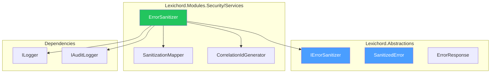
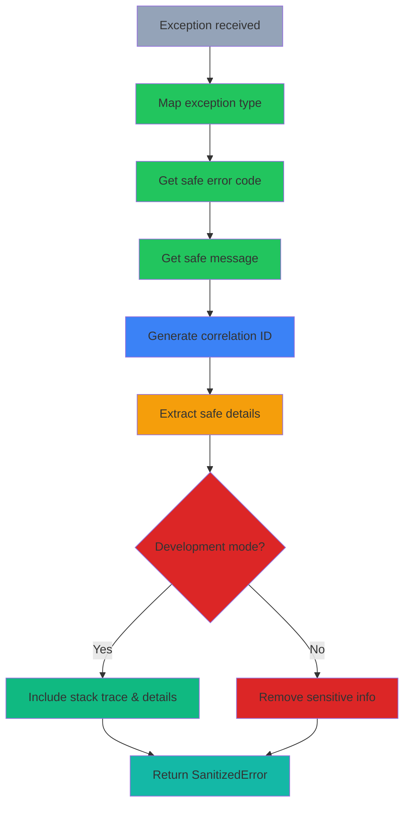

# LCS-DES-114-SEC-j: Design Specification — Error Sanitizer

## 1. Metadata & Categorization

| Field                | Value                                      |
| :------------------- | :----------------------------------------- |
| **Document ID**      | LCS-DES-114-SEC-j                          |
| **Feature ID**       | SEC-114j                                   |
| **Feature Name**     | Error Sanitizer                            |
| **Parent Feature**   | v0.11.4 — Input Security & Validation      |
| **Module Scope**     | Lexichord.Modules.Security                 |
| **Swimlane**         | Security                                   |
| **License Tier**     | Core                                       |
| **Feature Gate Key** | `FeatureFlags.Security.ErrorSanitizer`     |
| **Status**           | Draft                                      |
| **Last Updated**     | 2026-01-31                                 |
| **Est. Hours**       | 4                                          |

---

## 2. Executive Summary

### 2.1 Problem Statement

Raw exception information leaked to clients exposes:

- Internal system architecture
- Database credentials and connection details
- File paths and server configuration
- Sensitive business logic

### 2.2 Solution Overview

Implement `IErrorSanitizer` that removes sensitive details:

- **User-safe error messages** without technical details
- **Development mode full details** for debugging
- **Correlation IDs** for support tracking
- **Structured error responses** for clients

### 2.3 Key Deliverables

| Deliverable | Description |
| :---------- | :---------- |
| `IErrorSanitizer` | Interface in Lexichord.Abstractions |
| `ErrorSanitizer` | Implementation with mapping rules |
| `SanitizedError` | Safe error record |
| `ErrorResponse` | Client-facing response |
| Sanitization mappings | Exception type → safe message |
| Unit tests | 95%+ coverage |

---

## 3. Architecture & Modular Strategy

### 3.1 Component Diagram



### 3.2 Module Location

```text
src/
├── Lexichord.Abstractions/
│   └── Contracts/
│       └── ErrorSanitizationModels.cs        ← Interfaces and records
│
└── Lexichord.Modules.Security/
    └── Services/
        ├── ErrorSanitizer.cs                 ← Main implementation
        └── ErrorHandling/
            ├── SanitizationMapper.cs         ← Exception → safe mapping
            └── CorrelationIdGenerator.cs     ← Tracking ID generation
```

---

## 4. Data Contract (The API)

### 4.1 IErrorSanitizer Interface

```csharp
namespace Lexichord.Abstractions.Contracts;

/// <summary>
/// Sanitizes exceptions for safe external communication.
/// </summary>
/// <remarks>
/// <para>Removes sensitive details (credentials, paths, internal state) from errors.</para>
/// <para>Provides development-mode details for internal debugging.</para>
/// </remarks>
/// <example>
/// <code>
/// try
/// {
///     // Some operation
/// }
/// catch (Exception ex)
/// {
///     var sanitized = _sanitizer.Sanitize(ex);
///     // Log with correlation ID for support
///     _logger.LogError("Operation failed: {CorrelationId}", sanitized.CorrelationId);
///
///     // Return safe response to client
///     var response = _sanitizer.CreateResponse(ex, isDevelopment: false);
///     return BadRequest(response);
/// }
/// </code>
/// </example>
public interface IErrorSanitizer
{
    /// <summary>
    /// Sanitizes an exception for external response.
    /// </summary>
    /// <param name="exception">Exception to sanitize.</param>
    /// <returns>Sanitized error with correlation ID.</returns>
    SanitizedError Sanitize(Exception exception);

    /// <summary>
    /// Creates a safe error response for HTTP clients.
    /// </summary>
    /// <param name="exception">Exception to convert.</param>
    /// <param name="isDevelopment">Whether to include dev details.</param>
    /// <returns>Client-safe error response.</returns>
    ErrorResponse CreateResponse(Exception exception, bool isDevelopment = false);
}
```

### 4.2 SanitizedError Record

```csharp
namespace Lexichord.Abstractions.Contracts;

/// <summary>
/// An exception sanitized for logging and debugging.
/// </summary>
public record SanitizedError
{
    /// <summary>
    /// Error code for programmatic handling.
    /// </summary>
    public required string Code { get; init; }

    /// <summary>
    /// Safe message for external display.
    /// </summary>
    public required string Message { get; init; }

    /// <summary>
    /// Correlation ID for tracking this error.
    /// </summary>
    public string? CorrelationId { get; init; }

    /// <summary>
    /// Safe details (non-sensitive context).
    /// </summary>
    public IReadOnlyDictionary<string, object>? SafeDetails { get; init; }

    /// <summary>
    /// Original exception type (for internal use).
    /// </summary>
    public string? OriginalType { get; init; }

    /// <summary>
    /// Stack trace (for development only).
    /// </summary>
    public string? StackTrace { get; init; }

    /// <summary>
    /// Inner exception details (if any).
    /// </summary>
    public SanitizedError? InnerError { get; init; }
}
```

### 4.3 ErrorResponse Record

```csharp
namespace Lexichord.Abstractions.Contracts;

/// <summary>
/// Error response to send to HTTP clients.
/// </summary>
public record ErrorResponse
{
    /// <summary>
    /// Error key/code for programmatic handling.
    /// </summary>
    public required string Error { get; init; }

    /// <summary>
    /// Human-readable error message (safe for external display).
    /// </summary>
    public required string Message { get; init; }

    /// <summary>
    /// Optional error code (e.g., "VALIDATION_FAILED").
    /// </summary>
    public string? Code { get; init; }

    /// <summary>
    /// Correlation ID for support tracking.
    /// </summary>
    public string? CorrelationId { get; init; }

    /// <summary>
    /// HTTP status code that should be used.
    /// </summary>
    public int StatusCode { get; init; } = 500;

    /// <summary>
    /// Additional safe details (development mode only).
    /// </summary>
    public IReadOnlyDictionary<string, object>? Details { get; init; }

    /// <summary>
    /// Timestamp when error occurred.
    /// </summary>
    public DateTimeOffset Timestamp { get; init; } = DateTimeOffset.UtcNow;
}
```

---

## 5. Implementation Logic

### 5.1 Error Mapping Rules



### 5.2 Sanitization Mapper

```csharp
/// <summary>
/// Maps exceptions to safe error codes and messages.
/// </summary>
internal class SanitizationMapper
{
    private static readonly Dictionary<string, ExceptionMapping> Mappings = new()
    {
        // Validation errors
        [typeof(ArgumentException).FullName!] = new ExceptionMapping
        {
            ErrorCode = "INVALID_ARGUMENT",
            SafeMessage = "Invalid input provided.",
            StatusCode = 400,
            IncludeSafeDetails = true
        },

        [typeof(ArgumentNullException).FullName!] = new ExceptionMapping
        {
            ErrorCode = "MISSING_REQUIRED_FIELD",
            SafeMessage = "A required field is missing.",
            StatusCode = 400
        },

        [typeof(InvalidOperationException).FullName!] = new ExceptionMapping
        {
            ErrorCode = "INVALID_OPERATION",
            SafeMessage = "Operation could not be completed.",
            StatusCode = 400
        },

        // Authentication/Authorization
        [typeof(UnauthorizedAccessException).FullName!] = new ExceptionMapping
        {
            ErrorCode = "UNAUTHORIZED",
            SafeMessage = "Authentication required.",
            StatusCode = 401
        },

        ["System.Security.SecurityException"] = new ExceptionMapping
        {
            ErrorCode = "PERMISSION_DENIED",
            SafeMessage = "You do not have permission to access this resource.",
            StatusCode = 403
        },

        // Not found
        [typeof(KeyNotFoundException).FullName!] = new ExceptionMapping
        {
            ErrorCode = "NOT_FOUND",
            SafeMessage = "The requested resource was not found.",
            StatusCode = 404
        },

        // Rate limiting (from our own exception)
        ["Lexichord.Modules.Security.RateLimitExceededException"] = new ExceptionMapping
        {
            ErrorCode = "RATE_LIMIT_EXCEEDED",
            SafeMessage = "Too many requests. Please try again later.",
            StatusCode = 429
        },

        // Database errors
        ["System.Data.SqlClient.SqlException"] = new ExceptionMapping
        {
            ErrorCode = "DATABASE_ERROR",
            SafeMessage = "A database error occurred. Please try again later.",
            StatusCode = 500,
            LogLevel = LogLevel.Error
        },

        // Default for any unhandled exception
        ["DEFAULT"] = new ExceptionMapping
        {
            ErrorCode = "INTERNAL_SERVER_ERROR",
            SafeMessage = "An unexpected error occurred. Please contact support.",
            StatusCode = 500,
            LogLevel = LogLevel.Error
        }
    };

    public ExceptionMapping GetMapping(Exception ex)
    {
        var exType = ex.GetType().FullName ?? "unknown";

        if (Mappings.TryGetValue(exType, out var mapping))
            return mapping;

        // Check base types
        foreach (var type in ex.GetType().BaseClasses())
        {
            if (Mappings.TryGetValue(type.FullName ?? string.Empty, out mapping))
                return mapping;
        }

        // Fall back to default
        return Mappings["DEFAULT"];
    }

    public record ExceptionMapping
    {
        public required string ErrorCode { get; init; }
        public required string SafeMessage { get; init; }
        public int StatusCode { get; init; } = 500;
        public LogLevel LogLevel { get; init; } = LogLevel.Warning;
        public bool IncludeSafeDetails { get; init; } = false;
    }
}
```

### 5.3 Error Sanitizer Implementation

```csharp
/// <summary>
/// Core error sanitization implementation.
/// </summary>
internal class ErrorSanitizerImpl
{
    private readonly SanitizationMapper _mapper;
    private readonly ILogger<ErrorSanitizerImpl> _logger;

    public SanitizedError Sanitize(Exception exception)
    {
        var mapping = _mapper.GetMapping(exception);
        var correlationId = GenerateCorrelationId();

        _logger.Log(
            mapping.LogLevel,
            exception,
            "Exception sanitized: Code={ErrorCode}, CorrelationId={CorrelationId}",
            mapping.ErrorCode, correlationId);

        var safeDetails = ExtractSafeDetails(exception);

        return new SanitizedError
        {
            Code = mapping.ErrorCode,
            Message = mapping.SafeMessage,
            CorrelationId = correlationId,
            SafeDetails = mapping.IncludeSafeDetails ? safeDetails : null,
            OriginalType = exception.GetType().Name,
            StackTrace = null, // Never include stack trace in sanitized error
            InnerError = exception.InnerException != null
                ? Sanitize(exception.InnerException)
                : null
        };
    }

    public ErrorResponse CreateResponse(Exception exception, bool isDevelopment = false)
    {
        var sanitized = Sanitize(exception);
        var mapping = _mapper.GetMapping(exception);

        var details = isDevelopment
            ? new Dictionary<string, object>
            {
                ["exceptionType"] = exception.GetType().Name,
                ["stackTrace"] = exception.StackTrace ?? "[No stack trace]",
                ["message"] = exception.Message
            }
            : null;

        return new ErrorResponse
        {
            Error = mapping.ErrorCode.ToLowerInvariant(),
            Message = mapping.SafeMessage,
            Code = mapping.ErrorCode,
            CorrelationId = sanitized.CorrelationId,
            StatusCode = mapping.StatusCode,
            Details = details,
            Timestamp = DateTimeOffset.UtcNow
        };
    }

    private Dictionary<string, object> ExtractSafeDetails(Exception exception)
    {
        var details = new Dictionary<string, object>();

        if (exception is ArgumentException argEx)
        {
            details["parameterName"] = argEx.ParamName ?? "unknown";
        }

        if (exception is InvalidOperationException invEx)
        {
            // Extract safe context info
            if (invEx.Message.Contains("state:"))
            {
                var parts = invEx.Message.Split("state:");
                if (parts.Length > 1)
                {
                    details["state"] = parts[1].Trim();
                }
            }
        }

        return details;
    }

    private string GenerateCorrelationId()
    {
        // Format: corr_YYYYMMDD_XXXXXXXX (date + random hex)
        var date = DateTime.UtcNow.ToString("yyyyMMdd");
        var random = Guid.NewGuid().ToString("N").Substring(0, 8);
        return $"corr_{date}_{random}";
    }
}
```

### 5.4 Sensitive Data Redaction

```csharp
/// <summary>
/// Utility for redacting sensitive data from strings.
/// </summary>
internal static class SensitiveDataRedactor
{
    private static readonly Regex[] SensitivePatterns = new[]
    {
        // Connection strings
        new Regex(@"(password|pwd|secret)\s*=\s*[^\s;]+", RegexOptions.IgnoreCase | RegexOptions.Compiled),

        // Credentials in URLs
        new Regex(@"://\w+:\w+@", RegexOptions.Compiled),

        // API keys
        new Regex(@"(api[_-]?key|token|secret)\s*:\s*['\"][^'\"]+['\"]", RegexOptions.IgnoreCase | RegexOptions.Compiled),

        // Database URLs
        new Regex(@"(Server|Host)\s*=\s*[^;,\s]+", RegexOptions.IgnoreCase | RegexOptions.Compiled),

        // Credit cards
        new Regex(@"\b\d{4}[\s-]?\d{4}[\s-]?\d{4}[\s-]?\d{4}\b", RegexOptions.Compiled),

        // SSN
        new Regex(@"\b\d{3}-\d{2}-\d{4}\b", RegexOptions.Compiled)
    };

    public static string Redact(string? value)
    {
        if (string.IsNullOrEmpty(value))
            return value ?? string.Empty;

        var result = value;

        foreach (var pattern in SensitivePatterns)
        {
            result = pattern.Replace(result, "[REDACTED]");
        }

        return result;
    }
}
```

---

## 6. Error Handling

### 6.1 Exception Categories

| Category | Example | Handling |
|:---------|:--------|:---------|
| **Validation error** | ArgumentException | 400 + safe message |
| **Auth error** | UnauthorizedAccessException | 401 + safe message |
| **Not found** | KeyNotFoundException | 404 + safe message |
| **Rate limited** | RateLimitExceededException | 429 + retry-after |
| **Server error** | Any other | 500 + correlation ID |

### 6.2 Sanitization Examples

```csharp
// BEFORE (Raw exception)
{
  "ExceptionType": "DbUpdateException",
  "Message": "An error occurred while updating the entries. See the inner exception for details.",
  "InnerException": {
    "Message": "Connection to PostgreSQL failed: Host=prod-db.internal:5432 User=lexichord_app Password=s3cr3t! Database=lexichord_prod Timeout=30"
  },
  "StackTrace": "at Lexichord.Data.EntityRepository.SaveAsync() in C:\\App\\Lexichord.Data\\EntityRepository.cs:line 245"
}

// AFTER (Sanitized)
{
  "error": "database_error",
  "message": "A database error occurred. Please try again later.",
  "code": "DATABASE_ERROR",
  "correlationId": "corr_20260131_abc12345",
  "statusCode": 500
}
```

---

## 7. Testing

### 7.1 Unit Test Scenarios

```csharp
[Trait("Category", "Unit")]
[Trait("Feature", "v0.11.4j")]
public class ErrorSanitizerTests
{
    private readonly IErrorSanitizer _sut;

    [Fact]
    public void Sanitize_ArgumentException_ReturnsSafeMessage()
    {
        var ex = new ArgumentException("Invalid value for property", "propertyName");
        var result = _sut.Sanitize(ex);

        result.Code.Should().Be("INVALID_ARGUMENT");
        result.Message.Should().NotContain("Invalid value for property");
        result.CorrelationId.Should().NotBeNullOrEmpty();
    }

    [Fact]
    public void Sanitize_GeneratesCorrelationId()
    {
        var ex = new Exception("Test");
        var result1 = _sut.Sanitize(ex);
        var result2 = _sut.Sanitize(ex);

        result1.CorrelationId.Should().NotBeNullOrEmpty();
        result2.CorrelationId.Should().NotBeNullOrEmpty();
        result1.CorrelationId.Should().NotBe(result2.CorrelationId);
    }

    [Fact]
    public void Sanitize_NeverIncludesStackTrace()
    {
        var ex = new InvalidOperationException("Operation failed");
        var result = _sut.Sanitize(ex);

        result.StackTrace.Should().BeNullOrEmpty();
    }

    [Fact]
    public void Sanitize_HandlesInnerException()
    {
        var innerEx = new ArgumentException("Inner error");
        var ex = new InvalidOperationException("Outer error", innerEx);

        var result = _sut.Sanitize(ex);

        result.InnerError.Should().NotBeNull();
        result.InnerError!.Code.Should().Be("INVALID_ARGUMENT");
    }

    [Fact]
    public void CreateResponse_Development_IncludesDetails()
    {
        var ex = new ArgumentException("Test error");
        var response = _sut.CreateResponse(ex, isDevelopment: true);

        response.Details.Should().NotBeNull();
        response.Details!.Should().ContainKey("exceptionType");
        response.Details!.Should().ContainKey("stackTrace");
    }

    [Fact]
    public void CreateResponse_Production_NoDetails()
    {
        var ex = new ArgumentException("Test error");
        var response = _sut.CreateResponse(ex, isDevelopment: false);

        response.Details.Should().BeNull();
    }

    [Theory]
    [InlineData(typeof(ArgumentException), "INVALID_ARGUMENT", 400)]
    [InlineData(typeof(UnauthorizedAccessException), "UNAUTHORIZED", 401)]
    [InlineData(typeof(KeyNotFoundException), "NOT_FOUND", 404)]
    public void CreateResponse_MapsExceptions_Correctly(Type exType, string expectedCode, int expectedStatus)
    {
        var ex = (Exception)Activator.CreateInstance(exType)!;
        var response = _sut.CreateResponse(ex);

        response.Code.Should().Be(expectedCode);
        response.StatusCode.Should().Be(expectedStatus);
    }

    [Fact]
    public void CreateResponse_IncludesCorrelationId()
    {
        var ex = new Exception("Test");
        var response = _sut.CreateResponse(ex);

        response.CorrelationId.Should().NotBeNullOrEmpty();
        response.CorrelationId.Should().StartWith("corr_");
    }

    [Fact]
    public void CreateResponse_NeverLeaksConnectionString()
    {
        var ex = new Exception("Connection to PostgreSQL failed: Host=prod-db.internal:5432 Password=secret!");
        var response = _sut.CreateResponse(ex, isDevelopment: false);

        response.Message.Should().NotContain("prod-db");
        response.Message.Should().NotContain("secret");
    }

    [Fact]
    public void CreateResponse_IncludesTimestamp()
    {
        var ex = new Exception("Test");
        var before = DateTimeOffset.UtcNow;
        var response = _sut.CreateResponse(ex);
        var after = DateTimeOffset.UtcNow;

        response.Timestamp.Should().BeOnOrAfter(before);
        response.Timestamp.Should().BeOnOrBefore(after.AddSeconds(1));
    }
}
```

---

## 8. Performance Targets

| Metric | Target | Measurement |
|:-------|:-------|:------------|
| Error sanitization | <1ms | P95 timing |
| Response creation | <1ms | P95 timing |
| Correlation ID generation | <0.1ms | P95 timing |

---

## 9. License Gating

| Tier | Error Sanitizer | Details |
|:-----|:-----------------|:--------|
| **Core** | Basic sanitization | Safe messages only |
| **WriterPro** | + Dev details | Development mode support |
| **Teams** | + Custom mappings | Custom error mappings |
| **Enterprise** | + Audit trail | Full error audit logging |

---

## 10. Dependencies

| Component | Source | Usage |
|:----------|:-------|:------|
| `ILogger<T>` | Microsoft.Extensions.Logging | Error logging |
| `IAuditLogger` | v0.11.2-SEC | Security audit trail |

---

## 11. Risks & Mitigations

| Risk | Mitigation |
|:-----|:-----------|
| Missing error mapping | Comprehensive default mappings |
| Information leakage in dev mode | Strict environment checks |
| Correlation ID collision | Use date + random + guid |
| Performance overhead | Minimal processing, caching |

---

## 12. Deliverable Checklist

| # | Deliverable | Status |
|:--|:-----------|:-------|
| 1 | `IErrorSanitizer` interface | [ ] |
| 2 | Error response records | [ ] |
| 3 | `ErrorSanitizer` implementation | [ ] |
| 4 | Sanitization mapper | [ ] |
| 5 | Correlation ID generator | [ ] |
| 6 | Sensitive data redaction | [ ] |
| 7 | Unit tests with 95%+ coverage | [ ] |
| 8 | DI registration in SecurityModule.cs | [ ] |

---

## Document History

| Version | Date       | Author         | Changes |
|:--------|:-----------|:---------------|:--------|
| 1.0     | 2026-01-31 | Security Arch  | Initial draft |
