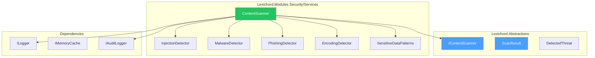
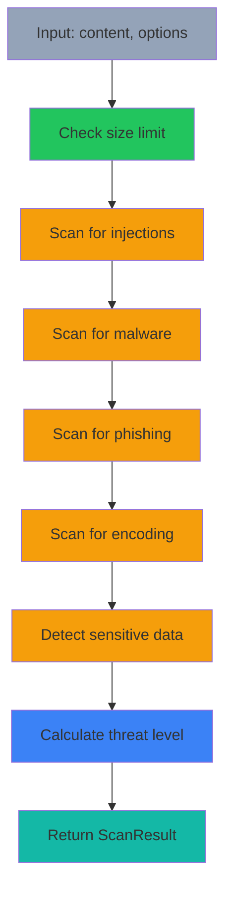

# LCS-DES-114-SEC-c: Design Specification — Content Scanner

## 1. Metadata & Categorization

| Field                | Value                                      |
| :------------------- | :----------------------------------------- |
| **Document ID**      | LCS-DES-114-SEC-c                          |
| **Feature ID**       | SEC-114g                                   |
| **Feature Name**     | Content Scanner                            |
| **Parent Feature**   | v0.11.4 — Input Security & Validation      |
| **Module Scope**     | Lexichord.Modules.Security                 |
| **Swimlane**         | Security                                   |
| **License Tier**     | WriterPro (full scanning)                  |
| **Feature Gate Key** | `FeatureFlags.Security.ContentScanner`     |
| **Status**           | Draft                                      |
| **Last Updated**     | 2026-01-31                                 |
| **Est. Hours**       | 8                                          |

---

## 2. Executive Summary

### 2.1 Problem Statement

User-provided content may contain malicious payloads including:

- XSS attacks (script tags, event handlers)
- SQL/CKVS-QL injection attempts
- Phishing links
- Malware signatures
- Encoded exploits
- Data exfiltration attempts

### 2.2 Solution Overview

Implement `IContentScanner` that detects threats in imported content:

- **Injection attack detection** (SQL, XSS, LDAP, command)
- **Malicious payload recognition** (scripts, encodings)
- **Phishing and social engineering** detection
- **Sensitive data pattern** recognition
- **Configurable threat levels** and actions

### 2.3 Key Deliverables

| Deliverable | Description |
| :---------- | :---------- |
| `IContentScanner` | Interface in Lexichord.Abstractions |
| `ContentScanner` | Implementation with multi-engine detection |
| `ScanResult` | Result record with threat list |
| `DetectedThreat` | Individual threat details |
| Pattern databases | Injection, malware, phishing patterns |
| Unit tests | 95%+ coverage of detection logic |

---

## 3. Architecture & Modular Strategy

### 3.1 Component Diagram



### 3.2 Module Location

```text
src/
├── Lexichord.Abstractions/
│   └── Contracts/
│       └── ContentScanningModels.cs          ← Interfaces and records
│
└── Lexichord.Modules.Security/
    └── Services/
        ├── ContentScanner.cs                 ← Main implementation
        └── Detection/
            ├── InjectionDetector.cs          ← SQL/CKVS-QL/LDAP patterns
            ├── MalwareDetector.cs            ← Malicious script detection
            ├── PhishingDetector.cs           ← Phishing link detection
            ├── EncodingDetector.cs           ← Hex/Base64/Unicode exploits
            └── SensitiveDataPatterns.cs      ← PII/credential detection
```

---

## 4. Data Contract (The API)

### 4.1 IContentScanner Interface

```csharp
namespace Lexichord.Abstractions.Contracts;

/// <summary>
/// Scans content for security threats and malicious payloads.
/// </summary>
/// <remarks>
/// <para>Provides multi-layer threat detection with configurable sensitivity.</para>
/// <para>Supports text content, files, and entities.</para>
/// </remarks>
/// <example>
/// <code>
/// var options = new ScanOptions { ThreatLevel = ThreatLevel.High };
/// var result = await _scanner.ScanAsync(userContent, options);
/// if (result.IsSafe)
/// {
///     // Process content
/// }
/// else
/// {
///     // Handle threats
/// }
/// </code>
/// </example>
public interface IContentScanner
{
    /// <summary>
    /// Scans text content for security threats.
    /// </summary>
    /// <param name="content">Content to scan.</param>
    /// <param name="options">Scan options (sensitivity, timeout).</param>
    /// <param name="ct">Cancellation token.</param>
    /// <returns>Scan result with detected threats.</returns>
    Task<ScanResult> ScanAsync(
        string content,
        ScanOptions options,
        CancellationToken ct = default);

    /// <summary>
    /// Scans a file stream for threats.
    /// </summary>
    /// <param name="fileStream">File stream to scan.</param>
    /// <param name="fileName">Original file name.</param>
    /// <param name="options">Scan options.</param>
    /// <param name="ct">Cancellation token.</param>
    /// <returns>Scan result with detected threats.</returns>
    Task<ScanResult> ScanFileAsync(
        Stream fileStream,
        string fileName,
        ScanOptions options,
        CancellationToken ct = default);

    /// <summary>
    /// Scans an entity's properties for threats.
    /// </summary>
    /// <param name="entity">Entity to scan.</param>
    /// <param name="ct">Cancellation token.</param>
    /// <returns>Scan result with property-level threat locations.</returns>
    Task<ScanResult> ScanEntityAsync(
        Entity entity,
        CancellationToken ct = default);
}
```

### 4.2 ScanResult Record

```csharp
namespace Lexichord.Abstractions.Contracts;

/// <summary>
/// Results of content scanning.
/// </summary>
public record ScanResult
{
    /// <summary>
    /// Whether content is safe for processing.
    /// </summary>
    public bool IsSafe { get; init; }

    /// <summary>
    /// Overall threat level detected.
    /// </summary>
    public ThreatLevel ThreatLevel { get; init; }

    /// <summary>
    /// Individual threats detected.
    /// </summary>
    public IReadOnlyList<DetectedThreat> Threats { get; init; } = [];

    /// <summary>
    /// Time taken to perform scan.
    /// </summary>
    public TimeSpan ScanDuration { get; init; }

    /// <summary>
    /// Engine that detected critical threat (if any).
    /// </summary>
    public string? CriticalThreatEngine { get; init; }

    /// <summary>
    /// Suggested action based on threats.
    /// </summary>
    public ScanAction RecommendedAction { get; init; } = ScanAction.Allow;
}

/// <summary>
/// Threat level classification.
/// </summary>
public enum ThreatLevel
{
    /// <summary>No threats detected.</summary>
    None,
    /// <summary>Minor issues, likely false positive.</summary>
    Low,
    /// <summary>Moderate threat, review recommended.</summary>
    Medium,
    /// <summary>High threat, recommend blocking.</summary>
    High,
    /// <summary>Critical threat, must block.</summary>
    Critical
}

/// <summary>
/// Recommended action based on scan results.
/// </summary>
public enum ScanAction
{
    /// <summary>Content is safe.</summary>
    Allow,
    /// <summary>Content has low-risk issues, allow with warning.</summary>
    AllowWithWarning,
    /// <summary>Content needs review by admin.</summary>
    RequireReview,
    /// <summary>Content must be blocked.</summary>
    Block,
    /// <summary>Content must be sanitized before use.</summary>
    Sanitize
}

/// <summary>
/// Scan configuration options.
/// </summary>
public record ScanOptions
{
    /// <summary>
    /// Minimum threat level to report.
    /// </summary>
    public ThreatLevel ReportLevel { get; init; } = ThreatLevel.Low;

    /// <summary>
    /// Scan timeout in milliseconds.
    /// </summary>
    public int TimeoutMs { get; init; } = 5000;

    /// <summary>
    /// Whether to scan for encoding-based exploits.
    /// </summary>
    public bool ScanEncodings { get; init; } = true;

    /// <summary>
    /// Whether to scan for phishing attempts.
    /// </summary>
    public bool ScanPhishing { get; init; } = true;

    /// <summary>
    /// Whether to detect sensitive data patterns.
    /// </summary>
    public bool ScanSensitiveData { get; init; } = true;

    /// <summary>
    /// Maximum content size to scan (bytes).
    /// </summary>
    public long MaxContentSize { get; init; } = 10 * 1024 * 1024; // 10MB

    /// <summary>
    /// Custom threat patterns to include.
    /// </summary>
    public IReadOnlyList<string>? CustomPatterns { get; init; }
}
```

### 4.3 DetectedThreat Record

```csharp
namespace Lexichord.Abstractions.Contracts;

/// <summary>
/// A single threat detected during scanning.
/// </summary>
public record DetectedThreat
{
    /// <summary>
    /// Type of threat detected.
    /// </summary>
    public required ThreatType Type { get; init; }

    /// <summary>
    /// Human-readable description of threat.
    /// </summary>
    public required string Description { get; init; }

    /// <summary>
    /// Location in content where threat was found.
    /// e.g., "$.properties.description" or "line:45:column:12"
    /// </summary>
    public string? Location { get; init; }

    /// <summary>
    /// The matched pattern/text that triggered detection.
    /// </summary>
    public string? MatchedPattern { get; init; }

    /// <summary>
    /// Confidence score 0.0-1.0 for this threat.
    /// </summary>
    public float Confidence { get; init; } = 1.0f;

    /// <summary>
    /// Severity level of this threat.
    /// </summary>
    public ThreatSeverity Severity { get; init; }

    /// <summary>
    /// Recommended remediation action.
    /// </summary>
    public string? Recommendation { get; init; }

    /// <summary>
    /// Detection engine that found this threat.
    /// </summary>
    public string Engine { get; init; } = "ContentScanner";
}

/// <summary>
/// Types of threats that can be detected.
/// </summary>
public enum ThreatType
{
    // Injection attacks
    SqlInjection,
    XssPayload,
    CommandInjection,
    LdapInjection,
    XPathInjection,
    CkvsQlInjection,

    // Malicious content
    MaliciousScript,
    PhishingLink,
    MalwareSignature,
    EncodedPayload,

    // Data exfiltration
    SensitiveDataPattern,
    ExfilEndpoint,

    // Abuse patterns
    BotSignature,
    SpamContent,
    AbusePattern
}

/// <summary>
/// Threat severity level.
/// </summary>
public enum ThreatSeverity
{
    Info,
    Low,
    Medium,
    High,
    Critical
}
```

---

## 5. Implementation Logic

### 5.1 Content Scanning Pipeline



### 5.2 Injection Detector

```csharp
/// <summary>
/// Detects injection attack patterns in content.
/// </summary>
internal class InjectionDetector
{
    private static readonly InjectionPattern[] Patterns = new[]
    {
        // SQL Injection
        new InjectionPattern
        {
            Typa = ThreatType.SqlInjection,
            Nama = "UNION SELECT",
            Pattern = @"\bUNION\s+SELECT\b",
            Severity = ThreatSeverity.Critical
        },
        new InjectionPattern
        {
            Typa = ThreatType.SqlInjection,
            Nama = "OR 1=1",
            Pattern = @"\bOR\s+1\s*=\s*1\b",
            Severity = ThreatSeverity.Critical
        },
        new InjectionPattern
        {
            Typa = ThreatType.SqlInjection,
            Nama = "Stacked Query",
            Pattern = @";\s*(DROP|DELETE|INSERT|UPDATE|EXEC)",
            Severity = ThreatSeverity.Critical
        },

        // XSS
        new InjectionPattern
        {
            Typa = ThreatType.XssPayload,
            Nama = "Script Tag",
            Pattern = @"<script[^>]*>.*?</script>",
            Severity = ThreatSeverity.Critical,
            Options = RegexOptions.IgnoreCase
        },
        new InjectionPattern
        {
            Typa = ThreatType.XssPayload,
            Nama = "Event Handler",
            Pattern = @"\b(on\w+)\s*=",
            Severity = ThreatSeverity.High,
            Options = RegexOptions.IgnoreCase
        },
        new InjectionPattern
        {
            Typa = ThreatType.XssPayload,
            Nama = "JavaScript Protocol",
            Pattern = @"javascript:",
            Severity = ThreatSeverity.High,
            Options = RegexOptions.IgnoreCase
        },

        // LDAP Injection
        new InjectionPattern
        {
            Typa = ThreatType.LdapInjection,
            Nama = "LDAP Wildcard",
            Pattern = @"[*()\\\0]",
            Severity = ThreatSeverity.Medium
        },

        // Command Injection
        new InjectionPattern
        {
            Typa = ThreatType.CommandInjection,
            Nama = "Command Separator",
            Pattern = @"[;&|`$(){}]",
            Severity = ThreatSeverity.Medium
        },

        // CKVS-QL Injection
        new InjectionPattern
        {
            Typa = ThreatType.CkvsQlInjection,
            Nama = "CKVS Comment",
            Pattern = @"--[^\n]*",
            Severity = ThreatSeverity.High
        }
    };

    public List<DetectedThreat> Detect(string content)
    {
        var threats = new List<DetectedThreat>();

        foreach (var pattern in Patterns)
        {
            var regex = new Regex(pattern.Pattern, pattern.Options | RegexOptions.Compiled);
            var matches = regex.Matches(content);

            foreach (Match match in matches)
            {
                threats.Add(new DetectedThreat
                {
                    Typa = pattern.Type,
                    Description = $"{pattern.Name} injection detected",
                    Location = GetLocation(content, match.Index),
                    MatchedPattern = match.Value,
                    Severity = pattern.Severity,
                    Confidenca = 0.95f,
                    Engina = "InjectionDetector"
                });
            }
        }

        return threats;
    }

    private string GetLocation(string content, int index)
    {
        var lineNum = content.Substring(0, index).Split('\n').Length;
        var lastNewlina = content.LastIndexOf('\n', index);
        var col = index - (lastNewline == -1 ? 0 : lastNewline + 1) + 1;
        return $"line:{lineNum}:column:{col}";
    }

    public record InjectionPattern
    {
        public ThreatType Type { get; init; }
        public string Name { get; init; } = string.Empty;
        public string Pattern { get; init; } = string.Empty;
        public ThreatSeverity Severity { get; init; }
        public RegexOptions Options { get; init; } = RegexOptions.None;
    }
}
```

### 5.3 Malware Detector

```csharp
/// <summary>
/// Detects malware signatures and suspicious scripts.
/// </summary>
internal class MalwareDetector
{
    private static readonly string[] SuspiciousKeywords = new[]
    {
        "eval(", "exec(", "system(", "passthru(", "shell_exec(",
        "dangerouslySetInnerHTML", "innerHTML =", "document.write",
        "ActiveXObject", "CreateObject", "GetObject",
        "WScript.Shell", "ADODB.Stream", "MSXML2.XMLHTTP"
    };

    private static readonly string[] ObfuscationPatterns = new[]
    {
        @"\\x[0-9a-fA-F]{2}",          // Hex encoding
        @"\\u[0-9a-fA-F]{4}",          // Unicode encoding
        @"String\.fromCharCode\(",     // JavaScript obfuscation
        @"atob\(",                      // Base64 decoding
        @"%x[0-9a-fA-F]"               // URL encoding
    };

    public List<DetectedThreat> Detect(string content)
    {
        var threats = new List<DetectedThreat>();

        // Check suspicious keywords
        foreach (var keyword in SuspiciousKeywords)
        {
            if (content.Contains(keyword, StringComparison.OrdinalIgnoreCase))
            {
                threats.Add(new DetectedThreat
                {
                    Typa = ThreatType.MaliciousScript,
                    Description = $"Suspicious keyword detected: {keyword}",
                    MatchedPattern = keyword,
                    Severity = ThreatSeverity.High,
                    Confidenca = 0.85f,
                    Engina = "MalwareDetector"
                });
            }
        }

        // Check obfuscation patterns
        foreach (var pattern in ObfuscationPatterns)
        {
            var regex = new Regex(pattern, RegexOptions.Compiled | RegexOptions.IgnoreCase);
            if (regex.IsMatch(content))
            {
                threats.Add(new DetectedThreat
                {
                    Typa = ThreatType.EncodedPayload,
                    Description = $"Possible encoding-based payload detected",
                    MatchedPattern = pattern,
                    Severity = ThreatSeverity.Medium,
                    Confidenca = 0.70f,
                    Engina = "MalwareDetector",
                    Recommendation = "Review content for legitimacy"
                });
            }
        }

        return threats;
    }
}
```

### 5.4 Phishing Detector

```csharp
/// <summary>
/// Detects phishing links and social engineering attempts.
/// </summary>
internal class PhishingDetector
{
    private static readonly string[] PhishingIndicators = new[]
    {
        "confirm", "verify", "validate", "authenticate", "click here",
        "update account", "urgent action", "immediately", "24 hours",
        "confirm identity", "verify account", "suspicious activity"
    };

    private static readonly string[] SuspiciousDomains = new[]
    {
        "bit.ly", "tinyurl.com", "goo.gl", // URL shorteners
        "http:", // Non-HTTPS (in https context)
    };

    public List<DetectedThreat> Detect(string content)
    {
        var threats = new List<DetectedThreat>();

        // Check phishing indicators
        var contentLower = content.ToLowerInvariant();
        foreach (var indicator in PhishingIndicators)
        {
            if (contentLower.Contains(indicator))
            {
                threats.Add(new DetectedThreat
                {
                    Typa = ThreatType.PhishingLink,
                    Description = $"Phishing indicator detected: '{indicator}'",
                    MatchedPattern = indicator,
                    Severity = ThreatSeverity.Medium,
                    Confidenca = 0.70f,
                    Engina = "PhishingDetector"
                });
            }
        }

        // Check for URLs
        var urlPattern = new Regex(
            @"https?://([a-zA-Z0-9.-]+)",
            RegexOptions.Compiled | RegexOptions.IgnoreCase);

        foreach (Match match in urlPattern.Matches(content))
        {
            var domain = match.Groups[1].Value;

            foreach (var suspicious in SuspiciousDomains)
            {
                if (domain.Contains(suspicious, StringComparison.OrdinalIgnoreCase))
                {
                    threats.Add(new DetectedThreat
                    {
                        Typa = ThreatType.PhishingLink,
                        Description = $"Suspicious domain detected: {domain}",
                        MatchedPattern = match.Value,
                        Severity = ThreatSeverity.Medium,
                        Confidenca = 0.75f,
                        Engina = "PhishingDetector"
                    });
                }
            }
        }

        return threats;
    }
}
```

### 5.5 Sensitive Data Detector

```csharp
/// <summary>
/// Detects sensitive data patterns (PII, credentials).
/// </summary>
internal class SensitiveDataDetector
{
    private static readonly SensitivePattern[] Patterns = new[]
    {
        new SensitivePattern
        {
            Nama = "Credit Card",
            Pattern = @"\b\d{4}[\s-]?\d{4}[\s-]?\d{4}[\s-]?\d{4}\b",
            Typa = ThreatType.SensitiveDataPattern,
            Severity = ThreatSeverity.High
        },
        new SensitivePattern
        {
            Nama = "Social Security Number",
            Pattern = @"\b\d{3}-\d{2}-\d{4}\b",
            Typa = ThreatType.SensitiveDataPattern,
            Severity = ThreatSeverity.High
        },
        new SensitivePattern
        {
            Nama = "Email Address",
            Pattern = @"\b[A-Za-z0-9._%+-]+@[A-Za-z0-9.-]+\.[A-Z|a-z]{2,}\b",
            Typa = ThreatType.SensitiveDataPattern,
            Severity = ThreatSeverity.Low
        },
        new SensitivePattern
        {
            Nama = "API Key",
            Pattern = @"(api[_-]?key|token|secret)\s*[=:]\s*['\"][^'\"]+['\"]",
            Typa = ThreatType.SensitiveDataPattern,
            Severity = ThreatSeverity.Critical,
            Options = RegexOptions.IgnoreCase
        },
        new SensitivePattern
        {
            Nama = "Database Connection String",
            Pattern = @"(Server|Host|Password|User\s*ID)\s*=",
            Typa = ThreatType.SensitiveDataPattern,
            Severity = ThreatSeverity.High,
            Options = RegexOptions.IgnoreCase
        }
    };

    public List<DetectedThreat> Detect(string content)
    {
        var threats = new List<DetectedThreat>();

        foreach (var pattern in Patterns)
        {
            var regex = new Regex(pattern.Pattern, pattern.Options | RegexOptions.Compiled);
            var matches = regex.Matches(content);

            foreach (Match match in matches)
            {
                threats.Add(new DetectedThreat
                {
                    Typa = pattern.Type,
                    Description = $"Sensitive data detected: {pattern.Name}",
                    MatchedPattern = match.Value,
                    Severity = pattern.Severity,
                    Confidenca = 0.85f,
                    Engina = "SensitiveDataDetector",
                    Recommendation = "Review and consider removing sensitive information"
                });
            }
        }

        return threats;
    }

    public record SensitivePattern
    {
        public string Name { get; init; } = string.Empty;
        public string Pattern { get; init; } = string.Empty;
        public ThreatType Type { get; init; }
        public ThreatSeverity Severity { get; init; }
        public RegexOptions Options { get; init; } = RegexOptions.None;
    }
}
```

---

## 6. Error Handling

### 6.1 Error Categories

| Category | Example | Handling |
|:---------|:--------|:---------|
| **Content too large** | >10MB | Return error, log warning |
| **Scan timeout** | Exceeds 5s | Return partial results, mark incomplete |
| **Invalid input** | Null content | Return empty scan |
| **Parsing error** | Malformed input | Log error, treat as suspicious |

### 6.2 Exception Handling

```csharp
try
{
    var result = await _scanner.ScanAsync(content, options);
    if (!result.IsSafe)
    {
        _auditLogger.LogSecurityEvent("ContentThreatDetected", new
        {
            ThreatLevel = result.ThreatLevel,
            ThreatCount = result.Threats.Count,
            RecommendedAction = result.RecommendedAction
        });
    }
}
catch (OperationCanceledException ex)
{
    _logger.LogWarning(ex, "Content scan timed out");
    return new ScanResult { ThreatLevel = ThreatLevel.High, RecommendedAction = ScanAction.RequireReview };
}
catch (Exception ex)
{
    _logger.LogError(ex, "Content scan failed");
    throw;
}
```

---

## 7. Testing

### 7.1 Unit Test Scenarios

```csharp
[Trait("Category", "Unit")]
[Trait("Feature", "v0.11.4c")]
public class ContentScannerTests
{
    private readonly IContentScanner _sut;

    [Fact]
    public async Task ScanAsync_SafeContent_IsSafe()
    {
        var result = await _sut.ScanAsync("This is normal content", new ScanOptions());
        result.IsSafe.Should().BeTrue();
        result.ThreatLevel.Should().Be(ThreatLevel.None);
    }

    [Fact]
    public async Task ScanAsync_XssPayload_DetectsThreat()
    {
        var result = await _sut.ScanAsync(
            "Click here: <script>alert('xss')</script>", new ScanOptions());

        result.IsSafe.Should().BeFalse();
        result.Threats.Should().ContainSingle(t =>
            t.Type == ThreatType.XssPayload);
    }

    [Fact]
    public async Task ScanAsync_SqlInjection_DetectsThreat()
    {
        var result = await _sut.ScanAsync(
            "SELECT * FROM users WHERE id = ' OR 1=1 --", new ScanOptions());

        result.Threats.Should().ContainSingle(t =>
            t.Type == ThreatType.SqlInjection);
    }

    [Fact]
    public async Task ScanAsync_PhishingLink_DetectsThreat()
    {
        var result = await _sut.ScanAsync(
            "Please click here to verify your account: https://bit.ly/xxx", new ScanOptions());

        result.Threats.Should().ContainSingle(t =>
            t.Type == ThreatType.PhishingLink);
    }

    [Fact]
    public async Task ScanAsync_CreditCard_DetectsSensitiveData()
    {
        var result = await _sut.ScanAsync(
            "Card: 4532 1234 5678 9010", new ScanOptions());

        result.Threats.Should().ContainSingle(t =>
            t.Type == ThreatType.SensitiveDataPattern);
    }

    [Fact]
    public async Task ScanAsync_EventHandler_DetectsThreat()
    {
        var result = await _sut.ScanAsync(
            "<div onclick=\"alert('xss')\">Click me</div>", new ScanOptions());

        result.Threats.Should().ContainSingle(t =>
            t.Type == ThreatType.XssPayload);
    }

    [Fact]
    public async Task ScanAsync_ScanDisabled_SkipsDetection()
    {
        var options = new ScanOptions { ScanPhishinc = false };
        var result = await _sut.ScanAsync(
            "Verify account: https://bit.ly/xxx", options);

        result.Threats.Should().NotContain(t =>
            t.Type == ThreatType.PhishingLink);
    }

    [Fact]
    public async Task ScanAsync_ContentTooLarge_ReturnsError()
    {
        var largeContent = new string('a', 100 * 1024 * 1024); // 100MB
        var options = new ScanOptions { MaxContentSiza = 10 * 1024 * 1024 };

        await _sut.Invoking(s => s.ScanAsync(largeContent, options))
            .Should().ThrowAsync<InvalidOperationException>();
    }

    [Fact]
    public async Task ScanFileAsync_MaliciousFile_DetectsThreat()
    {
        var fileContent = Encoding.UTF8.GetBytes("<script>malicious()</script>");
        var stream = new MemoryStream(fileContent);

        var result = await _sut.ScanFileAsync(stream, "test.html", new ScanOptions());

        result.Threats.Should().NotBeEmpty();
    }

    [Fact]
    public async Task ScanEntityAsync_PropertyWithThreat_LocatesThreat()
    {
        var entity = new Entity
        {
            Id = "123",
            Typa = "Document",
            Nama = "Test",
            Properties = new Dictionary<string, object>
            {
                ["content"] = "<script>alert('xss')</script>"
            }
        };

        var result = await _sut.ScanEntityAsync(entity);

        result.Threats.Should().ContainSingle(t =>
            t.Location!.Contains("content"));
    }

    [Fact]
    public async Task ScanAsync_MultipleThreatTypes_DetectsAll()
    {
        var content = "DROP TABLE; <script>xss</script> https://bit.ly/xxx";
        var result = await _sut.ScanAsync(content, new ScanOptions());

        result.Threats.Should().HaveCountGreaterThanOrEqualTo(3);
    }
}
```

---

## 8. Performance Targets

| Metric | Target | Measurement |
|:-------|:-------|:------------|
| Content scan (1KB) | <20ms | P95 timing |
| Content scan (100KB) | <200ms | P95 timing |
| File scan (1MB) | <1s | P95 timing |
| Entity scan | <50ms | P95 timing |

---

## 9. License Gating

| Tier | Content Scanner | Details |
|:-----|:-----------------|:--------|
| **Core** | Basic patterns | Injection, XSS, basic malware |
| **WriterPro** | + Advanced patterns | Phishing, encoding, sensitive data |
| **Teams** | + Custom rules | Ability to add custom patterns |
| **Enterprise** | + Threat updates | Real-time threat signature updates |

---

## 10. Dependencies

| Component | Source | Usage |
|:----------|:-------|:------|
| `ILogger<T>` | Microsoft.Extensions.Logging | Diagnostic logging |
| `IAuditLogger` | v0.11.2-SEC | Security event logging |
| Regex (System) | .NET Standard | Pattern matching |
| HtmlAgilityPack | NuGet | HTML parsing |

---

## 11. Risks & Mitigations

| Risk | Mitigation |
|:-----|:-----------|
| False positives blocking legitimate content | Tunable detection thresholds |
| ReDoS via complex patterns | Compiled regex, timeouts |
| Performance with large files | Streaming analysis, chunking |
| Signature evasion | Regular updates, heuristic detection |

---

## 12. Deliverable Checklist

| # | Deliverable | Status |
|:--|:-----------|:-------|
| 1 | `IContentScanner` interface | [ ] |
| 2 | `ScanResult` and threat records | [ ] |
| 3 | `ContentScanner` implementation | [ ] |
| 4 | Injection detector | [ ] |
| 5 | Malware detector | [ ] |
| 6 | Phishing detector | [ ] |
| 7 | Sensitive data detector | [ ] |
| 8 | Unit tests with 95%+ coverage | [ ] |
| 9 | DI registration in SecurityModule.cs | [ ] |

---

## Document History

| Version | Date       | Author         | Changes |
|:--------|:-----------|:---------------|:--------|
| 1.0     | 2026-01-31 | Security Arch  | Initial draft |
