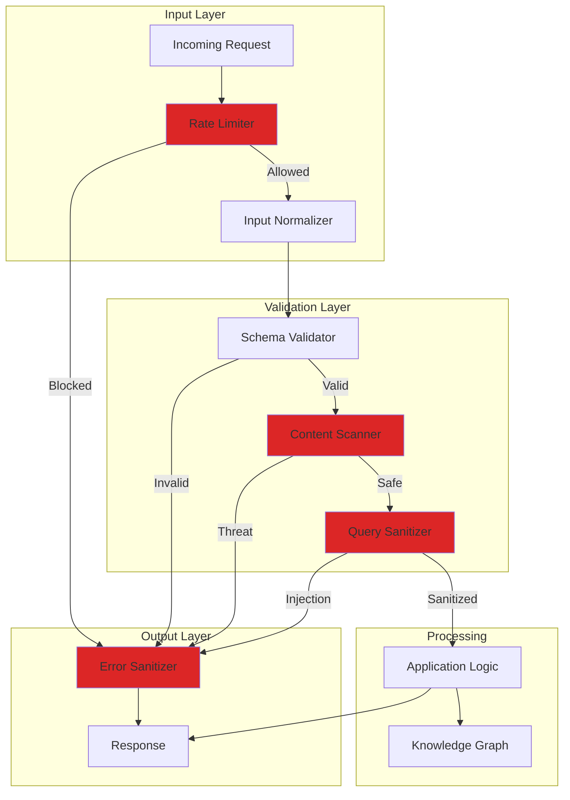

# LCS-SBD-114-SEC: Scope Overview — Input Security & Validation

## Document Control

| Field            | Value                                                        |
| :--------------- | :----------------------------------------------------------- |
| **Document ID**  | LCS-SBD-114-SEC                                              |
| **Version**      | v0.11.4                                                      |
| **Codename**     | Input Security & Validation (Security Phase 4)               |
| **Status**       | Draft                                                        |
| **Last Updated** | 2026-01-31                                                   |
| **Owner**        | Security Architect                                           |
| **Depends On**   | v0.10.4-KG (CKVS-QL), v0.11.2-SEC (Audit Logging)            |

---

## 1. Executive Summary

### 1.1 The Vision

**v0.11.4-SEC** delivers **Input Security & Validation** — comprehensive protection against injection attacks, malicious input, and data integrity violations. This includes:

- CKVS-QL injection prevention (parameterized queries)
- Content security for imported knowledge
- Schema validation for all inputs
- Rate limiting and abuse prevention
- Malicious payload detection

### 1.2 Business Value

- **Security:** Prevent injection attacks and data corruption.
- **Integrity:** Ensure all data meets validation rules.
- **Availability:** Protect against DoS through input abuse.
- **Trust:** Safe handling of user-provided content.
- **Compliance:** Input validation required by security standards.

### 1.3 Success Criteria

1. Zero successful injection attacks in CKVS-QL.
2. All inputs validated against defined schemas.
3. Malicious content blocked before processing.
4. Rate limiting prevents abuse without impacting legitimate use.
5. Clear error messages without information leakage.
6. Validation latency <10ms for typical inputs.

---

## 2. Key Deliverables

### 2.1 Sub-Parts

| Sub-Part | Title | Description | Est. Hours |
|:---------|:------|:------------|:-----------|
| v0.11.4e | Query Sanitizer | Prevent CKVS-QL injection | 8 |
| v0.11.4f | Schema Validator | Validate all input schemas | 6 |
| v0.11.4g | Content Scanner | Detect malicious payloads | 8 |
| v0.11.4h | Rate Limiter | Request rate limiting | 6 |
| v0.11.4i | Input Normalizer | Sanitize and normalize inputs | 5 |
| v0.11.4j | Error Sanitizer | Secure error responses | 4 |
| **Total** | | | **37 hours** |

### 2.2 Key Interfaces

```csharp
/// <summary>
/// Sanitizes CKVS-QL queries to prevent injection.
/// </summary>
public interface IQuerySanitizer
{
    /// <summary>
    /// Sanitizes a query, preventing injection attacks.
    /// </summary>
    SanitizedQuery Sanitize(string rawQuery);

    /// <summary>
    /// Creates a parameterized query.
    /// </summary>
    ParameterizedQuery CreateParameterized(
        string queryTemplate,
        IReadOnlyDictionary<string, object> parameters);

    /// <summary>
    /// Validates query structure without executing.
    /// </summary>
    QueryValidationResult ValidateStructure(string query);
}

public record SanitizedQuery
{
    public required string Query { get; init; }
    public bool WasModified { get; init; }
    public IReadOnlyList<SanitizationAction> Actions { get; init; } = [];
    public IReadOnlyList<SecurityWarning> Warnings { get; init; } = [];
}

public record SanitizationAction
{
    public int Position { get; init; }
    public required string Original { get; init; }
    public required string Sanitized { get; init; }
    public required string Reason { get; init; }
}

public record ParameterizedQuery
{
    public required string Template { get; init; }
    public IReadOnlyDictionary<string, object> Parameters { get; init; } = new Dictionary<string, object>();
    public required string CompiledQuery { get; init; }
}

public record QueryValidationResult
{
    public bool IsValid { get; init; }
    public IReadOnlyList<QuerySyntaxError> Errors { get; init; } = [];
    public IReadOnlyList<SecurityWarning> SecurityWarnings { get; init; } = [];
    public QueryComplexity Complexity { get; init; } = new();
}

public record QueryComplexity
{
    public int Depth { get; init; }
    public int JoinCount { get; init; }
    public int ProjectionCount { get; init; }
    public int EstimatedCost { get; init; }
    public bool ExceedsLimits { get; init; }
}

/// <summary>
/// Validates input against schemas.
/// </summary>
public interface IInputSchemaValidator
{
    /// <summary>
    /// Validates an entity against its schema.
    /// </summary>
    Task<ValidationResult> ValidateEntityAsync(
        Entity entity,
        CancellationToken ct = default);

    /// <summary>
    /// Validates arbitrary input against a schema.
    /// </summary>
    Task<ValidationResult> ValidateAsync(
        JsonDocument input,
        string schemaId,
        CancellationToken ct = default);

    /// <summary>
    /// Gets the schema for an entity type.
    /// </summary>
    Task<JsonSchema?> GetSchemaAsync(
        string entityType,
        CancellationToken ct = default);

    /// <summary>
    /// Registers a custom schema.
    /// </summary>
    Task RegisterSchemaAsync(
        string schemaId,
        JsonSchema schema,
        CancellationToken ct = default);
}

public record ValidationResult
{
    public bool IsValid { get; init; }
    public IReadOnlyList<ValidationError> Errors { get; init; } = [];
    public IReadOnlyList<ValidationWarning> Warnings { get; init; } = [];
}

public record ValidationError
{
    public required string Path { get; init; }
    public required string Message { get; init; }
    public required string ErrorCode { get; init; }
    public object? ExpectedValue { get; init; }
    public object? ActualValue { get; init; }
}

/// <summary>
/// Scans content for malicious payloads.
/// </summary>
public interface IContentScanner
{
    /// <summary>
    /// Scans content for security threats.
    /// </summary>
    Task<ScanResult> ScanAsync(
        string content,
        ScanOptions options,
        CancellationToken ct = default);

    /// <summary>
    /// Scans a file for security threats.
    /// </summary>
    Task<ScanResult> ScanFileAsync(
        Stream fileStream,
        string fileName,
        ScanOptions options,
        CancellationToken ct = default);

    /// <summary>
    /// Scans an entity's properties for threats.
    /// </summary>
    Task<ScanResult> ScanEntityAsync(
        Entity entity,
        CancellationToken ct = default);
}

public record ScanResult
{
    public bool IsSafe { get; init; }
    public ThreatLevel ThreatLevel { get; init; }
    public IReadOnlyList<DetectedThreat> Threats { get; init; } = [];
    public TimeSpan ScanDuration { get; init; }
}

public enum ThreatLevel { None, Low, Medium, High, Critical }

public record DetectedThreat
{
    public required ThreatType Type { get; init; }
    public required string Description { get; init; }
    public string? Location { get; init; }
    public string? MatchedPattern { get; init; }
    public float Confidence { get; init; }
    public ThreatSeverity Severity { get; init; }
    public string? Recommendation { get; init; }
}

public enum ThreatType
{
    // Injection attacks
    SqlInjection,
    XssPayload,
    CommandInjection,
    LdapInjection,
    XPathInjection,
    CkvsQlInjection,

    // Malicious content
    MaliciousScript,
    PhishingLink,
    MalwareSignature,
    EncodedPayload,

    // Data exfiltration
    SensitiveDataPattern,
    ExfilEndpoint,

    // Abuse patterns
    BotSignature,
    SpamContent,
    AbusePattern
}

public enum ThreatSeverity { Info, Low, Medium, High, Critical }

/// <summary>
/// Rate limiting for API requests.
/// </summary>
public interface IRateLimiter
{
    /// <summary>
    /// Checks if a request should be allowed.
    /// </summary>
    Task<RateLimitResult> CheckAsync(
        RateLimitKey key,
        CancellationToken ct = default);

    /// <summary>
    /// Records a request against the limit.
    /// </summary>
    Task RecordAsync(
        RateLimitKey key,
        CancellationToken ct = default);

    /// <summary>
    /// Gets current rate limit status.
    /// </summary>
    Task<RateLimitStatus> GetStatusAsync(
        RateLimitKey key,
        CancellationToken ct = default);

    /// <summary>
    /// Resets rate limit for a key.
    /// </summary>
    Task ResetAsync(
        RateLimitKey key,
        CancellationToken ct = default);
}

public record RateLimitKey
{
    public required string Scope { get; init; }  // "user", "ip", "api_key"
    public required string Identifier { get; init; }
    public required string Operation { get; init; }
}

public record RateLimitResult
{
    public bool IsAllowed { get; init; }
    public int Remaining { get; init; }
    public int Limit { get; init; }
    public TimeSpan? RetryAfter { get; init; }
    public string? Reason { get; init; }
}

public record RateLimitStatus
{
    public int CurrentCount { get; init; }
    public int Limit { get; init; }
    public TimeSpan WindowDuration { get; init; }
    public DateTimeOffset WindowResetAt { get; init; }
    public bool IsThrottled { get; init; }
}

/// <summary>
/// Rate limit policies.
/// </summary>
public record RateLimitPolicy
{
    public required string Name { get; init; }
    public required string Operation { get; init; }
    public int RequestsPerWindow { get; init; }
    public TimeSpan WindowDuration { get; init; }
    public RateLimitAlgorithm Algorithm { get; init; } = RateLimitAlgorithm.SlidingWindow;
    public IReadOnlyList<RateLimitException>? Exceptions { get; init; }
}

public enum RateLimitAlgorithm
{
    FixedWindow,
    SlidingWindow,
    TokenBucket,
    LeakyBucket
}

/// <summary>
/// Normalizes and sanitizes input data.
/// </summary>
public interface IInputNormalizer
{
    /// <summary>
    /// Normalizes a string value.
    /// </summary>
    string NormalizeString(string input, NormalizationOptions options);

    /// <summary>
    /// Sanitizes HTML content.
    /// </summary>
    string SanitizeHtml(string html, HtmlSanitizationOptions options);

    /// <summary>
    /// Normalizes an entity's properties.
    /// </summary>
    Entity NormalizeEntity(Entity entity);

    /// <summary>
    /// Validates and normalizes a URL.
    /// </summary>
    UrlValidationResult ValidateUrl(string url);
}

public record NormalizationOptions
{
    public bool TrimWhitespace { get; init; } = true;
    public bool NormalizeUnicode { get; init; } = true;
    public bool RemoveControlCharacters { get; init; } = true;
    public int? MaxLength { get; init; }
    public bool StripHtml { get; init; } = false;
}

public record HtmlSanitizationOptions
{
    public IReadOnlyList<string> AllowedTags { get; init; } = ["p", "b", "i", "u", "a", "ul", "ol", "li"];
    public IReadOnlyList<string> AllowedAttributes { get; init; } = ["href", "title"];
    public bool AllowDataAttributes { get; init; } = false;
    public bool StripScripts { get; init; } = true;
    public bool StripStyles { get; init; } = true;
}

/// <summary>
/// Sanitizes error responses to prevent information leakage.
/// </summary>
public interface IErrorSanitizer
{
    /// <summary>
    /// Sanitizes an exception for external response.
    /// </summary>
    SanitizedError Sanitize(Exception exception);

    /// <summary>
    /// Creates a safe error response.
    /// </summary>
    ErrorResponse CreateResponse(
        Exception exception,
        bool isDevelopment = false);
}

public record SanitizedError
{
    public required string Code { get; init; }
    public required string Message { get; init; }
    public string? CorrelationId { get; init; }
    public IReadOnlyDictionary<string, object>? SafeDetails { get; init; }
}

public record ErrorResponse
{
    public required string Error { get; init; }
    public required string Message { get; init; }
    public string? Code { get; init; }
    public string? CorrelationId { get; init; }
    public int StatusCode { get; init; }
}
```

### 2.3 Input Security Architecture



---

## 3. CKVS-QL Injection Prevention

### 3.1 Vulnerable vs Secure Patterns

```csharp
// ❌ VULNERABLE: String concatenation
var query = $"FIND Entity WHERE name = '{userInput}'";
// Attacker input: "' OR 1=1 --" → returns all entities

// ✅ SECURE: Parameterized query
var query = _querySanitizer.CreateParameterized(
    "FIND Entity WHERE name = @name",
    new Dictionary<string, object> { ["name"] = userInput });
```

### 3.2 Query Sanitization Rules

```yaml
sanitization_rules:
  # Comment removal
  - pattern: "--.*$"
    action: remove
    reason: "SQL-style comment"

  # Quote escaping
  - pattern: "'"
    action: escape
    replacement: "''"
    reason: "Single quote"

  # Dangerous keywords
  - pattern: "\\b(DROP|DELETE|TRUNCATE|ALTER)\\b"
    action: block
    reason: "Destructive keyword"

  # Union injection
  - pattern: "\\bUNION\\s+SELECT\\b"
    action: block
    reason: "Union injection"

  # Batch separator
  - pattern: ";"
    action: remove
    context: "outside_string"
    reason: "Statement terminator"

  # Hex encoding
  - pattern: "0x[0-9a-fA-F]+"
    action: validate
    reason: "Hex-encoded value"
```

---

## 4. Content Threat Detection

```
┌────────────────────────────────────────────────────────────────┐
│ Content Scan Results                                           │
├────────────────────────────────────────────────────────────────┤
│                                                                │
│ Scanned: Entity import "api-definitions.json"                 │
│ Status: ⚠️ THREATS DETECTED                                    │
│                                                                │
│ ┌────────────────────────────────────────────────────────────┐ │
│ │ 🔴 HIGH: XSS Payload Detected                              │ │
│ │    Location: entities[12].description                      │ │
│ │    Pattern: <script>alert('xss')</script>                 │ │
│ │    Action: Content will be sanitized                       │ │
│ ├────────────────────────────────────────────────────────────┤ │
│ │ 🟡 MEDIUM: Suspicious URL                                  │ │
│ │    Location: entities[45].endpoint                         │ │
│ │    Value: javascript:void(0)                               │ │
│ │    Action: URL will be removed                             │ │
│ ├────────────────────────────────────────────────────────────┤ │
│ │ 🟢 LOW: Potential PII                                      │ │
│ │    Location: entities[78].notes                            │ │
│ │    Pattern: Email address detected                         │ │
│ │    Action: Review recommended                              │ │
│ └────────────────────────────────────────────────────────────┘ │
│                                                                │
│ Summary:                                                       │
│ ├── Entities scanned: 156                                     │
│ ├── Threats found: 3                                          │
│ ├── Auto-sanitized: 2                                         │
│ └── Requires review: 1                                        │
│                                                                │
│ [Proceed with Sanitization] [Review All] [Cancel Import]      │
│                                                                │
└────────────────────────────────────────────────────────────────┘
```

---

## 5. Rate Limiting Configuration

```yaml
rate_limits:
  # Global limits
  - name: global-read
    operation: "read"
    requests: 1000
    window: 1m
    algorithm: sliding_window

  - name: global-write
    operation: "write"
    requests: 100
    window: 1m
    algorithm: sliding_window

  # Query limits
  - name: query-simple
    operation: "query:simple"
    requests: 100
    window: 1m
    algorithm: token_bucket

  - name: query-complex
    operation: "query:complex"
    requests: 10
    window: 1m
    algorithm: token_bucket

  # Import/Export limits
  - name: bulk-import
    operation: "import"
    requests: 5
    window: 1h
    algorithm: fixed_window

  - name: bulk-export
    operation: "export"
    requests: 10
    window: 1h
    algorithm: fixed_window

  # Authentication limits
  - name: auth-login
    operation: "login"
    requests: 5
    window: 5m
    algorithm: sliding_window
    scope: ip

  # Exceptions
  exceptions:
    - type: role
      value: "Admin"
      multiplier: 10

    - type: license
      value: "Enterprise"
      multiplier: 5
```

---

## 6. Rate Limit Response Headers

```http
HTTP/1.1 429 Too Many Requests
Content-Type: application/json
X-RateLimit-Limit: 100
X-RateLimit-Remaining: 0
X-RateLimit-Reset: 1706745600
Retry-After: 45

{
  "error": "rate_limit_exceeded",
  "message": "Too many requests. Please retry after 45 seconds.",
  "code": "RATE_LIMIT_EXCEEDED",
  "details": {
    "limit": 100,
    "window": "1m",
    "reset_at": "2026-01-31T15:00:00Z"
  }
}
```

---

## 7. Error Response Sanitization

```csharp
// Internal exception (with sensitive details)
var exception = new DatabaseException(
    "Connection to PostgreSQL failed: Host=prod-db.internal:5432 " +
    "User=lexichord_app Password=s3cr3t! Database=lexichord_prod");

// Sanitized response (safe for external)
{
  "error": "database_error",
  "message": "A database error occurred. Please try again later.",
  "code": "DB_CONNECTION_FAILED",
  "correlation_id": "corr_abc123xyz"
}

// Development response (with details)
{
  "error": "database_error",
  "message": "Connection to PostgreSQL failed",
  "code": "DB_CONNECTION_FAILED",
  "correlation_id": "corr_abc123xyz",
  "details": {
    "host": "[REDACTED]",
    "exception_type": "NpgsqlException",
    "stack_trace": "..."
  }
}
```

---

## 8. Dependencies

| Component | Source | Usage |
|:----------|:-------|:------|
| `IGraphQueryService` | v0.10.4-KG | Query execution |
| `IAuditLogger` | v0.11.2-SEC | Security events |
| `IKnowledgeImporter` | v0.10.5-KG | Import validation |
| Redis | Infrastructure | Rate limit storage |
| HtmlSanitizer | NuGet | HTML sanitization |

---

## 9. License Gating

| Tier | Input Security |
|:-----|:---------------|
| Core | Basic validation |
| WriterPro | + Content scanning |
| Teams | + Custom rate limits |
| Enterprise | + Advanced threat detection |

---

## 10. Performance Targets

| Metric | Target | Measurement |
|:-------|:-------|:------------|
| Query sanitization | <5ms | P95 timing |
| Schema validation | <10ms | P95 timing |
| Content scan (1KB) | <20ms | P95 timing |
| Rate limit check | <1ms | P95 timing |
| Error sanitization | <1ms | P95 timing |

---

## 11. Threat Detection Patterns

| Category | Patterns Detected |
|:---------|:------------------|
| SQL Injection | UNION, OR 1=1, --, etc. |
| XSS | script tags, event handlers, javascript: |
| Command Injection | ; && \| backticks |
| Path Traversal | ../, %2e%2e |
| LDAP Injection | * ( ) \\ |
| XML Injection | DOCTYPE, ENTITY |

---

## 12. Risks & Mitigations

| Risk | Mitigation |
|:-----|:-----------|
| False positives | Tunable sensitivity, whitelisting |
| Bypass techniques | Regular pattern updates, defense in depth |
| Performance impact | Caching, async scanning |
| Legitimate blocked | Clear error messages, appeal process |

---
