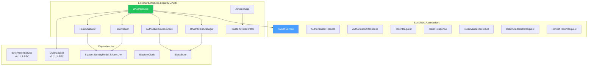
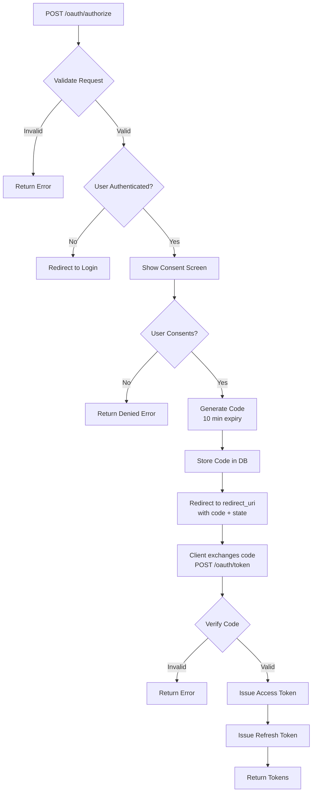

# LCS-DES-115-SEC-f: Design Specification — OAuth Provider

## 1. Metadata & Categorization

| Field                | Value                             |
| :------------------- | :-------------------------------- |
| **Document ID**      | LCS-DES-115-SEC-f                 |
| **Feature ID**       | SEC-115f                          |
| **Feature Name**     | OAuth Provider                    |
| **Parent Feature**   | v0.11.5 — API Security Gateway    |
| **Module Scope**     | Lexichord.Modules.Security.OAuth  |
| **Swimlane**         | Authentication & Authorization    |
| **License Tier**     | Teams (OAuth), Enterprise (OIDC)  |
| **Feature Gate Key** | `FeatureFlags.API.OAuthProvider`  |
| **Status**           | Draft                             |
| **Last Updated**     | 2026-01-31                        |
| **Est. Hours**       | 12                                |

---

## 2. Executive Summary

### 2.1 Problem Statement

Third-party integrations require secure delegated access without sharing user credentials:

- No standard OAuth 2.0 authorization code flow
- No machine-to-machine authentication (Client Credentials)
- No token refresh mechanism
- No OpenID Connect (OIDC) support for identity
- No public JWKS endpoint for token validation

### 2.2 Solution Overview

Implement `IOAuthService` that provides:

- **Authorization Code Flow** for user-delegated access
- **Client Credentials Flow** for service-to-service access
- **Token Refresh** mechanism with rotating refresh tokens
- **Token Validation** with JWT and signature verification
- **OIDC Support** for identity claims in ID tokens
- **JWKS Endpoint** for public key distribution

### 2.3 Key Deliverables

| Deliverable               | Description                              |
| :------------------------ | :--------------------------------------- |
| `IOAuthService`           | Interface in Lexichord.Abstractions      |
| `OAuthService`            | OAuth 2.0/OIDC implementation            |
| `OAuthClientManager`      | OAuth application registration and admin |
| `AuthorizationCodeStore`  | Short-lived authorization codes          |
| `TokenIssuer`             | JWT token generation                     |
| `TokenValidator`          | Token verification and claims extraction |
| `JwksService`             | Public key distribution                  |
| Unit tests               | 95%+ coverage                            |

---

## 3. Architecture & Modular Strategy

### 3.1 Component Diagram



### 3.2 Module Location

```text
src/
├── Lexichord.Abstractions/
│   └── Contracts/
│       └── OAuthModels.cs                ← Interfaces and records
│
└── Lexichord.Modules.Security.OAuth/
    ├── Services/
    │   ├── OAuthService.cs                ← Main implementation
    │   ├── OAuthClientManager.cs          ← Client registration
    │   ├── Tokens/
    │   │   ├── TokenIssuer.cs             ← JWT generation
    │   │   └── TokenValidator.cs          ← Token validation
    │   ├── AuthorizationCodeStore.cs      ← Temporary code storage
    │   └── Keys/
    │       ├── JwksService.cs             ← JWKS endpoint
    │       └── PrivateKeyGenerator.cs     ← Key generation
    └── Data/
        └── OAuthDataStore.cs              ← Data access
```

---

## 4. Data Contract (The API)

### 4.1 IOAuthService Interface

```csharp
namespace Lexichord.Abstractions.Contracts;

/// <summary>
/// OAuth 2.0 / OpenID Connect authorization service.
/// </summary>
/// <remarks>
/// <para>Supports Authorization Code, Client Credentials, and Refresh Token flows.</para>
/// <para>Issues JWT access tokens and optional ID tokens (OIDC).</para>
/// </remarks>
/// <example>
/// <code>
/// // Authorization Code Flow
/// var authResp = await _oauth.AuthorizeAsync(new AuthorizationRequest
/// {
///     ClientId = appId,
///     RedirectUri = "https://app.example.com/callback",
///     ResponseType = "code",
///     Scope = "openid profile email"
/// });
///
/// // Exchange code for token
/// var tokenResp = await _oauth.ExchangeCodeAsync(new TokenRequest
/// {
///     Code = authResp.Code,
///     ClientId = appId,
///     ClientSecret = appSecret,
///     GrantType = "authorization_code"
/// });
/// </code>
/// </example>
public interface IOAuthService
{
    /// <summary>
    /// Initiates authorization code flow.
    /// </summary>
    /// <param name="request">Authorization parameters.</param>
    /// <param name="ct">Cancellation token.</param>
    /// <returns>Authorization code and metadata.</returns>
    Task<AuthorizationResponse> AuthorizeAsync(
        AuthorizationRequest request,
        CancellationToken ct = default);

    /// <summary>
    /// Exchanges authorization code for tokens.
    /// </summary>
    /// <param name="request">Token exchange parameters.</param>
    /// <param name="ct">Cancellation token.</param>
    /// <returns>Access token, refresh token, and optional ID token.</returns>
    Task<TokenResponse> ExchangeCodeAsync(
        TokenRequest request,
        CancellationToken ct = default);

    /// <summary>
    /// Handles client credentials grant (service-to-service).
    /// </summary>
    /// <param name="request">Client credentials parameters.</param>
    /// <param name="ct">Cancellation token.</param>
    /// <returns>Access token.</returns>
    Task<TokenResponse> ClientCredentialsAsync(
        ClientCredentialsRequest request,
        CancellationToken ct = default);

    /// <summary>
    /// Refreshes an access token.
    /// </summary>
    /// <param name="request">Refresh token parameters.</param>
    /// <param name="ct">Cancellation token.</param>
    /// <returns>New access token and optional new refresh token.</returns>
    Task<TokenResponse> RefreshTokenAsync(
        RefreshTokenRequest request,
        CancellationToken ct = default);

    /// <summary>
    /// Validates an access token.
    /// </summary>
    /// <param name="accessToken">JWT to validate.</param>
    /// <param name="ct">Cancellation token.</param>
    /// <returns>Validation result with claims.</returns>
    Task<TokenValidationResult> ValidateTokenAsync(
        string accessToken,
        CancellationToken ct = default);

    /// <summary>
    /// Revokes a token or refresh token.
    /// </summary>
    /// <param name="token">Token to revoke.</param>
    /// <param name="ct">Cancellation token.</param>
    Task RevokeTokenAsync(
        string token,
        CancellationToken ct = default);

    /// <summary>
    /// Gets JWKS for public key distribution.
    /// </summary>
    /// <param name="ct">Cancellation token.</param>
    /// <returns>JSON Web Key Set.</returns>
    Task<JsonWebKeySet> GetJwksAsync(CancellationToken ct = default);
}
```

### 4.2 AuthorizationRequest Record

```csharp
namespace Lexichord.Abstractions.Contracts;

/// <summary>
/// OAuth authorization request.
/// </summary>
public record AuthorizationRequest
{
    /// <summary>
    /// OAuth client ID.
    /// </summary>
    public required string ClientId { get; init; }

    /// <summary>
    /// Where to redirect after user consent.
    /// </summary>
    public required string RedirectUri { get; init; }

    /// <summary>
    /// Response type ("code" or "token").
    /// </summary>
    public required string ResponseType { get; init; }

    /// <summary>
    /// Space-separated scopes (e.g., "openid profile email").
    /// </summary>
    public required string Scope { get; init; }

    /// <summary>
    /// State parameter to prevent CSRF.
    /// </summary>
    public string? State { get; init; }

    /// <summary>
    /// PKCE code challenge.
    /// </summary>
    public string? CodeChallenge { get; init; }

    /// <summary>
    /// PKCE challenge method ("S256" or "plain").
    /// </summary>
    public string? CodeChallengeMethod { get; init; }

    /// <summary>
    /// User ID (if already authenticated).
    /// </summary>
    public Guid? UserId { get; init; }
}
```

### 4.3 AuthorizationResponse Record

```csharp
namespace Lexichord.Abstractions.Contracts;

/// <summary>
/// Authorization code response.
/// </summary>
public record AuthorizationResponse
{
    /// <summary>
    /// Authorization code (valid for 10 minutes).
    /// </summary>
    public required string Code { get; init; }

    /// <summary>
    /// State parameter echoed from request.
    /// </summary>
    public string? State { get; init; }

    /// <summary>
    /// When code expires.
    /// </summary>
    public DateTimeOffset ExpiresAt { get; init; }
}
```

### 4.4 TokenResponse Record

```csharp
namespace Lexichord.Abstractions.Contracts;

/// <summary>
/// Token endpoint response.
/// </summary>
public record TokenResponse
{
    /// <summary>
    /// JWT access token.
    /// </summary>
    public required string AccessToken { get; init; }

    /// <summary>
    /// Token type (always "Bearer").
    /// </summary>
    public required string TokenType { get; init; }

    /// <summary>
    /// Token lifetime in seconds.
    /// </summary>
    public int ExpiresIn { get; init; }

    /// <summary>
    /// Refresh token (if included in grant).
    /// </summary>
    public string? RefreshToken { get; init; }

    /// <summary>
    /// Granted scopes (may differ from requested).
    /// </summary>
    public string? Scope { get; init; }

    /// <summary>
    /// OpenID Connect ID token (if OIDC requested).
    /// </summary>
    public string? IdToken { get; init; }
}
```

### 4.5 TokenValidationResult Record

```csharp
namespace Lexichord.Abstractions.Contracts;

/// <summary>
/// Result of token validation.
/// </summary>
public record TokenValidationResult
{
    /// <summary>
    /// Whether token is valid and can be used.
    /// </summary>
    public bool IsValid { get; init; }

    /// <summary>
    /// User ID from token claims (null if invalid).
    /// </summary>
    public Guid? UserId { get; init; }

    /// <summary>
    /// OAuth client ID (null if invalid).
    /// </summary>
    public Guid? ClientId { get; init; }

    /// <summary>
    /// Granted scopes.
    /// </summary>
    public IReadOnlyList<string>? Scopes { get; init; }

    /// <summary>
    /// Token expiration time.
    /// </summary>
    public DateTimeOffset? ExpiresAt { get; init; }

    /// <summary>
    /// If invalid, the reason why.
    /// </summary>
    public string? InvalidReason { get; init; }

    /// <summary>
    /// All claims from the token.
    /// </summary>
    public IReadOnlyDictionary<string, object>? Claims { get; init; }
}
```

### 4.6 ClientCredentialsRequest Record

```csharp
namespace Lexichord.Abstractions.Contracts;

/// <summary>
/// Client credentials grant request.
/// </summary>
public record ClientCredentialsRequest
{
    /// <summary>
    /// OAuth client ID.
    /// </summary>
    public required string ClientId { get; init; }

    /// <summary>
    /// Client secret.
    /// </summary>
    public required string ClientSecret { get; init; }

    /// <summary>
    /// Requested scopes.
    /// </summary>
    public string Scope { get; init; } = "";
}
```

### 4.7 RefreshTokenRequest Record

```csharp
namespace Lexichord.Abstractions.Contracts;

/// <summary>
/// Refresh token request.
/// </summary>
public record RefreshTokenRequest
{
    /// <summary>
    /// Current refresh token.
    /// </summary>
    public required string RefreshToken { get; init; }

    /// <summary>
    /// OAuth client ID.
    /// </summary>
    public required string ClientId { get; init; }

    /// <summary>
    /// Client secret (for confidential clients).
    /// </summary>
    public string? ClientSecret { get; init; }
}
```

---

## 5. Implementation Logic

### 5.1 Authorization Code Flow



### 5.2 Token Generation

```csharp
/// <summary>
/// Issues JWT tokens.
/// </summary>
internal class TokenIssuer
{
    private readonly JwtSecurityTokenHandler _tokenHandler;
    private readonly SigningCredentials _signingCredentials;
    private readonly ISystemClock _clock;

    /// <summary>
    /// Issues an access token.
    /// </summary>
    public string IssueAccessToken(
        Guid userId,
        Guid clientId,
        IReadOnlyList<string> scopes,
        TimeSpan lifetime)
    {
        var now = _clock.UtcNow;

        var claims = new List<Claim>
        {
            new(JwtClaimTypes.Subject, userId.ToString()),
            new(JwtClaimTypes.ClientId, clientId.ToString()),
            new(JwtClaimTypes.IssuedAt, EpochTime.GetIntDate(now.DateTime).ToString()),
            new(JwtClaimTypes.Issuer, "https://lexichord.com")
        };

        // Add scope claims
        foreach (var scope in scopes)
        {
            claims.Add(new(JwtClaimTypes.Scope, scope));
        }

        var token = new JwtSecurityToken(
            issuer: "https://lexichord.com",
            audience: "https://api.lexichord.com",
            claims: claims,
            notBefore: now.DateTime,
            expires: now.Add(lifetime).DateTime,
            signingCredentials: _signingCredentials);

        return _tokenHandler.WriteToken(token);
    }

    /// <summary>
    /// Issues an ID token for OpenID Connect.
    /// </summary>
    public string IssueIdToken(
        Guid userId,
        Guid clientId,
        string? email,
        string? name,
        TimeSpan lifetime)
    {
        var now = _clock.UtcNow;

        var claims = new List<Claim>
        {
            new(JwtClaimTypes.Subject, userId.ToString()),
            new(JwtClaimTypes.ClientId, clientId.ToString()),
            new(JwtClaimTypes.IssuedAt, EpochTime.GetIntDate(now.DateTime).ToString()),
            new(JwtClaimTypes.Issuer, "https://lexichord.com"),
            new(JwtClaimTypes.AuthenticationTime, EpochTime.GetIntDate(now.DateTime).ToString())
        };

        if (!string.IsNullOrEmpty(email))
            claims.Add(new(JwtClaimTypes.Email, email));

        if (!string.IsNullOrEmpty(name))
            claims.Add(new(JwtClaimTypes.Name, name));

        var token = new JwtSecurityToken(
            issuer: "https://lexichord.com",
            audience: clientId.ToString(),
            claims: claims,
            notBefore: now.DateTime,
            expires: now.Add(lifetime).DateTime,
            signingCredentials: _signingCredentials);

        return _tokenHandler.WriteToken(token);
    }
}
```

### 5.3 Token Validation Algorithm

```csharp
/// <summary>
/// Validates JWT tokens.
/// </summary>
internal class TokenValidator
{
    private readonly JwtSecurityTokenHandler _tokenHandler;
    private readonly TokenValidationParameters _validationParams;

    /// <summary>
    /// Validates an access token.
    /// </summary>
    public async Task<TokenValidationResult> ValidateAsync(
        string token,
        CancellationToken ct = default)
    {
        if (string.IsNullOrWhiteSpace(token))
        {
            return new TokenValidationResult
            {
                IsValid = false,
                InvalidReason = "Token is empty"
            };
        }

        try
        {
            // Attempt to validate signature and claims
            var principal = _tokenHandler.ValidateToken(token, _validationParams, out var validatedToken);

            if (validatedToken is not JwtSecurityToken jwtToken)
            {
                return new TokenValidationResult
                {
                    IsValid = false,
                    InvalidReason = "Token is not a valid JWT"
                };
            }

            // Extract claims
            var subClaim = principal.FindFirst(JwtClaimTypes.Subject)?.Value;
            var clientClaim = principal.FindFirst(JwtClaimTypes.ClientId)?.Value;
            var scopeClaims = principal.FindAll(JwtClaimTypes.Scope).Select(c => c.Value).ToList();

            if (!Guid.TryParse(subClaim, out var userId))
            {
                return new TokenValidationResult
                {
                    IsValid = false,
                    InvalidReason = "Invalid subject claim"
                };
            }

            var claims = principal.Claims.ToDictionary(c => c.Type, c => (object)c.Value);

            return new TokenValidationResult
            {
                IsValid = true,
                UserId = userId,
                ClientId = Guid.TryParse(clientClaim, out var cid) ? cid : null,
                Scopes = scopeClaims,
                ExpiresAt = jwtToken.ValidTo == DateTime.MaxValue
                    ? null
                    : new DateTimeOffset(jwtToken.ValidTo, TimeSpan.Zero),
                Claims = claims
            };
        }
        catch (SecurityTokenExpiredException)
        {
            return new TokenValidationResult
            {
                IsValid = false,
                InvalidReason = "Token has expired"
            };
        }
        catch (SecurityTokenInvalidSignatureException)
        {
            return new TokenValidationResult
            {
                IsValid = false,
                InvalidReason = "Token signature is invalid"
            };
        }
        catch (Exception ex)
        {
            return new TokenValidationResult
            {
                IsValid = false,
                InvalidReason = $"Token validation failed: {ex.Message}"
            };
        }
    }
}
```

### 5.4 JWKS Endpoint

```csharp
/// <summary>
/// Provides public keys for token validation.
/// </summary>
internal class JwksService
{
    private readonly IDataStore _store;
    private JsonWebKeySet? _cachedJwks;
    private DateTimeOffset _cacheExpiry;

    /// <summary>
    /// Gets current JWKS.
    /// </summary>
    public async Task<JsonWebKeySet> GetJwksAsync(CancellationToken ct = default)
    {
        // Cache for 1 hour
        if (_cachedJwks != null && DateTimeOffset.UtcNow < _cacheExpiry)
            return _cachedJwks;

        var keySet = new JsonWebKeySet();
        var publicKeys = await _store.GetActivePublicKeysAsync(ct);

        foreach (var key in publicKeys)
        {
            var jwk = new JsonWebKey
            {
                Kty = "RSA",
                Kid = key.KeyId,
                Use = "sig",
                Alg = key.Algorithm,
                N = Base64UrlEncoder.Encode(key.PublicExponent),
                E = Base64UrlEncoder.Encode(key.Modulus)
            };

            keySet.Keys.Add(jwk);
        }

        _cachedJwks = keySet;
        _cacheExpiry = DateTimeOffset.UtcNow.AddHours(1);

        return keySet;
    }
}
```

---

## 6. Error Handling

### 6.1 OAuth Error Responses

```csharp
/// <summary>
/// Standard OAuth error response (RFC 6749).
/// </summary>
public record OAuthErrorResponse
{
    /// <summary>
    /// Error code.
    /// </summary>
    public required string Error { get; init; }

    /// <summary>
    /// Human-readable error description.
    /// </summary>
    public string? ErrorDescription { get; init; }

    /// <summary>
    /// URI to error documentation.
    /// </summary>
    public string? ErrorUri { get; init; }

    /// <summary>
    /// State parameter for CSRF protection.
    /// </summary>
    public string? State { get; init; }
}
```

### 6.2 Standard Error Codes

| Error Code          | Description                              |
| :------------------ | :--------------------------------------- |
| `invalid_request`   | Request is missing required parameter    |
| `invalid_client`    | Client authentication failed             |
| `invalid_grant`     | Authorization code is invalid/expired    |
| `invalid_scope`     | Requested scope is invalid               |
| `unauthorized_client` | Client not authorized for flow          |
| `access_denied`     | User denied authorization                |
| `unsupported_response_type` | Response type not supported            |
| `server_error`      | Server encountered error                 |

---

## 7. Testing

### 7.1 Test Scenarios

```csharp
[Trait("Category", "Unit")]
[Trait("Feature", "v0.11.5f")]
public class OAuthServiceTests
{
    private readonly IOAuthService _sut;
    private readonly Mock<IDataStore> _storeMock;

    [Fact]
    public async Task AuthorizeAsync_GeneratesValidCode()
    {
        var request = new AuthorizationRequest
        {
            ClientId = "app_test_123",
            RedirectUri = "https://app.example.com/callback",
            ResponseType = "code",
            Scope = "openid profile",
            State = "state123",
            UserId = Guid.NewGuid()
        };

        var result = await _sut.AuthorizeAsync(request);

        result.Code.Should().NotBeNullOrEmpty();
        result.State.Should().Be("state123");
        result.ExpiresAt.Should().BeCloseTo(
            DateTimeOffset.UtcNow.AddMinutes(10), TimeSpan.FromSeconds(1));
    }

    [Fact]
    public async Task ExchangeCodeAsync_IssuesTokens()
    {
        // Create code first
        var authResp = await _sut.AuthorizeAsync(new AuthorizationRequest
        {
            ClientId = "app_test_123",
            RedirectUri = "https://app.example.com/callback",
            ResponseType = "code",
            Scope = "openid profile",
            UserId = Guid.NewGuid()
        });

        var tokenReq = new TokenRequest
        {
            Code = authResp.Code,
            ClientId = "app_test_123",
            ClientSecret = "secret123",
            GrantType = "authorization_code"
        };

        var tokenResp = await _sut.ExchangeCodeAsync(tokenReq);

        tokenResp.AccessToken.Should().NotBeNullOrEmpty();
        tokenResp.TokenType.Should().Be("Bearer");
        tokenResp.ExpiresIn.Should().BeGreaterThan(0);
    }

    [Fact]
    public async Task ClientCredentialsAsync_IssuesAccessToken()
    {
        var request = new ClientCredentialsRequest
        {
            ClientId = "service_app",
            ClientSecret = "service_secret",
            Scope = "api.read api.write"
        };

        var response = await _sut.ClientCredentialsAsync(request);

        response.AccessToken.Should().NotBeNullOrEmpty();
        response.TokenType.Should().Be("Bearer");
        response.RefreshToken.Should().BeNull(); // No refresh in service grant
    }

    [Fact]
    public async Task ValidateTokenAsync_ReturnsValidForGoodToken()
    {
        var token = await IssueTestToken();

        var result = await _sut.ValidateTokenAsync(token);

        result.IsValid.Should().BeTrue();
        result.UserId.Should().NotBeNull();
        result.Scopes.Should().NotBeEmpty();
    }

    [Fact]
    public async Task ValidateTokenAsync_ReturnsInvalidForExpiredToken()
    {
        var expiredToken = "eyJhbGciOiJIUzI1NiIsInR5cCI6IkpXVCJ9..."; // Expired token

        var result = await _sut.ValidateTokenAsync(expiredToken);

        result.IsValid.Should().BeFalse();
        result.InvalidReason.Should().Contain("expired");
    }

    [Fact]
    public async Task GetJwksAsync_ReturnsPublicKeys()
    {
        var jwks = await _sut.GetJwksAsync();

        jwks.Keys.Should().NotBeEmpty();
        jwks.Keys.Should().AllSatisfy(key =>
        {
            key.Kty.Should().Be("RSA");
            key.Use.Should().Be("sig");
        });
    }
}
```

---

## 8. Performance Targets

| Metric                    | Target  | Measurement |
| :------------------------ | :------ | :---------- |
| Authorization endpoint    | <100ms  | P95         |
| Token exchange            | <50ms   | P95         |
| Client credentials grant  | <50ms   | P95         |
| Token validation          | <10ms   | P95         |
| Refresh token            | <50ms   | P95         |
| JWKS endpoint            | <5ms    | P95         |

---

## 9. License Gating

| Tier       | Feature                  |
| :---------- | :---------------------- |
| Core       | Not available           |
| WriterPro  | Not available           |
| Teams      | OAuth 2.0 (auth code)   |
| Enterprise | OAuth 2.0 + OIDC + SLA |

---

## 10. Security Considerations

### 10.1 Authorization Code

- Short-lived (10 minutes max)
- Single-use only (invalidated after exchange)
- Binding to client and redirect URI
- PKCE support for public clients

### 10.2 Token Security

- Signed with RS256 (RSA)
- Short TTL (15 minutes for access tokens)
- Refresh tokens have longer TTL (7 days)
- Refresh token rotation on use

### 10.3 Client Confidentiality

- Client secrets encrypted at-rest
- Supports both confidential and public clients
- PKCE mandatory for public clients

---

## 11. Observability & Logging

### 11.1 Log Events

| Level | Event                  | Template                                                    |
| :---- | :--------------------- | :----------------------------------------------------------- |
| Info  | Authorization initiated | `"OAuth authorization: ClientId={ClientId}, Scopes={Scopes}"` |
| Info  | Code exchanged         | `"Authorization code exchanged: ClientId={ClientId}"`        |
| Warn  | Code expired           | `"Authorization code expired: Code={Code}"`                 |
| Warn  | Invalid client         | `"OAuth invalid client: ClientId={ClientId}"`               |
| Error | Token signing failed   | `"Failed to sign token: {Error}"`                           |

---

## 12. Acceptance Criteria

| #   | Category        | Criterion                                           | Verification     |
| :-- | :-------------- | :-------------------------------------------------- | :--------------- |
| 1   | **Functional**  | Authorization code flow works                      | Unit test        |
| 2   | **Functional**  | Client credentials flow works                      | Unit test        |
| 3   | **Functional**  | Refresh token flow works                           | Unit test        |
| 4   | **Functional**  | Access tokens are valid JWTs                       | Unit test        |
| 5   | **Functional**  | PKCE challenge verification works                  | Unit test        |
| 6   | **Functional**  | JWKS endpoint returns public keys                  | Unit test        |
| 7   | **Security**    | Authorization codes are single-use                 | Unit test        |
| 8   | **Security**    | Client secrets never logged                        | Code review      |
| 9   | **Performance** | Token validation <10ms P95                         | Load test        |
| 10  | **Compliance**  | Error responses follow RFC 6749                    | Code review      |

---

## 13. Document History

| Version | Date       | Author      | Changes       |
| :------ | :--------- | :---------- | :------------ |
| 1.0     | 2026-01-31 | Lead Arch.  | Initial draft |
