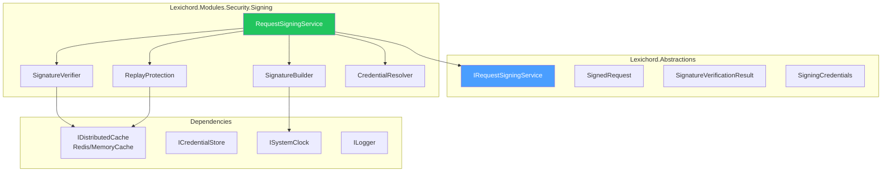
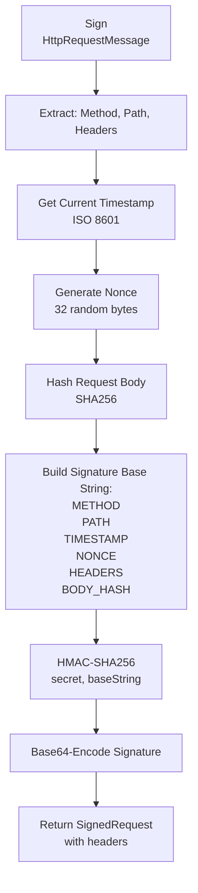

# LCS-DES-115-SEC-g: Design Specification — Request Signing

## 1. Metadata & Categorization

| Field                | Value                             |
| :------------------- | :-------------------------------- |
| **Document ID**      | LCS-DES-115-SEC-g                 |
| **Feature ID**       | SEC-115g                          |
| **Feature Name**     | Request Signing                   |
| **Parent Feature**   | v0.11.5 — API Security Gateway    |
| **Module Scope**     | Lexichord.Modules.Security.Signing |
| **Swimlane**         | Authentication & Authorization    |
| **License Tier**     | Teams + (signing feature)         |
| **Feature Gate Key** | `FeatureFlags.API.RequestSigning` |
| **Status**           | Draft                             |
| **Last Updated**     | 2026-01-31                        |
| **Est. Hours**       | 6                                 |

---

## 2. Executive Summary

### 2.1 Problem Statement

High-security API operations need end-to-end integrity verification:

- No way to verify request hasn't been modified in transit
- No protection against man-in-the-middle attacks on sensitive operations
- No replay attack prevention
- No timestamped proof of request origin

### 2.2 Solution Overview

Implement `IRequestSigningService` that provides:

- **HMAC-SHA256 Request Signatures** for integrity verification
- **Timestamp Validation** to prevent replay attacks (5-minute window)
- **Nonce-Based Replay Protection** via distributed nonce cache
- **Signature Base String** construction from method, path, headers, and body
- **Client-Side Signing** utilities for SDK integration

### 2.3 Key Deliverables

| Deliverable              | Description                              |
| :----------------------- | :--------------------------------------- |
| `IRequestSigningService` | Interface in Lexichord.Abstractions      |
| `RequestSigningService`  | Implementation in Modules.Security.Signing |
| `SignatureBuilder`       | Request signature base string construction |
| `SignatureVerifier`      | HMAC verification logic                  |
| `ReplayProtection`       | Nonce cache and validation               |
| Unit tests              | 95%+ coverage                            |

---

## 3. Architecture & Modular Strategy

### 3.1 Component Diagram



### 3.2 Module Location

```text
src/
├── Lexichord.Abstractions/
│   └── Contracts/
│       └── RequestSigningModels.cs    ← Interfaces and records
│
└── Lexichord.Modules.Security.Signing/
    └── Services/
        ├── RequestSigningService.cs    ← Main implementation
        ├── SignatureBuilder.cs         ← Base string construction
        ├── SignatureVerifier.cs        ← HMAC verification
        ├── ReplayProtection.cs         ← Nonce validation
        └── CredentialResolver.cs       ← Credential lookup
```

---

## 4. Data Contract (The API)

### 4.1 IRequestSigningService Interface

```csharp
namespace Lexichord.Abstractions.Contracts;

/// <summary>
/// Verifies signed API requests using HMAC-SHA256.
/// </summary>
/// <remarks>
/// <para>Provides end-to-end integrity verification and replay protection.</para>
/// <para>Uses HTTP signature algorithm with HMAC-SHA256.</para>
/// </remarks>
/// <example>
/// <code>
/// // Verify an incoming signed request
/// var result = await _signingService.VerifyAsync(httpRequest);
///
/// if (result.IsValid)
/// {
///     var keyId = result.KeyId; // Know who signed it
///     // Process request
/// }
/// else
/// {
///     // Return 401 Unauthorized
///     return result.InvalidReason;
/// }
/// </code>
/// </example>
public interface IRequestSigningService
{
    /// <summary>
    /// Signs a request with HMAC-SHA256.
    /// </summary>
    /// <param name="request">HTTP request message to sign.</param>
    /// <param name="credentials">Signing credentials (key ID and secret).</param>
    /// <returns>Signature and metadata to add to headers.</returns>
    SignedRequest Sign(
        HttpRequestMessage request,
        SigningCredentials credentials);

    /// <summary>
    /// Verifies a signed request.
    /// </summary>
    /// <param name="request">HTTP request with signature headers.</param>
    /// <param name="ct">Cancellation token.</param>
    /// <returns>Verification result with key ID or error.</returns>
    Task<SignatureVerificationResult> VerifyAsync(
        HttpRequestMessage request,
        CancellationToken ct = default);

    /// <summary>
    /// Gets signing credentials for a client.
    /// </summary>
    /// <param name="keyId">Credential/key identifier.</param>
    /// <param name="ct">Cancellation token.</param>
    /// <returns>Credentials if found, null otherwise.</returns>
    Task<SigningCredentials?> GetCredentialsAsync(
        string keyId,
        CancellationToken ct = default);
}
```

### 4.2 SignedRequest Record

```csharp
namespace Lexichord.Abstractions.Contracts;

/// <summary>
/// A signed HTTP request.
/// </summary>
public record SignedRequest
{
    /// <summary>
    /// HMAC-SHA256 signature (base64-encoded).
    /// </summary>
    public required string Signature { get; init; }

    /// <summary>
    /// The string that was signed (for debugging).
    /// </summary>
    public required string SignatureInput { get; init; }

    /// <summary>
    /// When the request was signed (ISO 8601).
    /// </summary>
    public DateTimeOffset Timestamp { get; init; }

    /// <summary>
    /// Optional nonce for replay protection.
    /// </summary>
    public string? Nonce { get; init; }
}
```

### 4.3 SignatureVerificationResult Record

```csharp
namespace Lexichord.Abstractions.Contracts;

/// <summary>
/// Result of request signature verification.
/// </summary>
public record SignatureVerificationResult
{
    /// <summary>
    /// Whether the signature is valid.
    /// </summary>
    public bool IsValid { get; init; }

    /// <summary>
    /// Key ID associated with signature (null if invalid).
    /// </summary>
    public Guid? KeyId { get; init; }

    /// <summary>
    /// If invalid, the reason why.
    /// </summary>
    public string? InvalidReason { get; init; }

    /// <summary>
    /// Time difference between request timestamp and server time.
    /// </summary>
    public TimeSpan? TimestampSkew { get; init; }
}
```

### 4.4 SigningCredentials Record

```csharp
namespace Lexichord.Abstractions.Contracts;

/// <summary>
/// Credentials for signing requests.
/// </summary>
public record SigningCredentials
{
    /// <summary>
    /// Unique key identifier.
    /// </summary>
    public Guid KeyId { get; init; }

    /// <summary>
    /// Signing algorithm (e.g., "HMAC-SHA256").
    /// </summary>
    public required string Algorithm { get; init; }

    /// <summary>
    /// Secret key material (encrypted in storage).
    /// </summary>
    public required byte[] SecretKey { get; init; }
}
```

---

## 5. Implementation Logic

### 5.1 Request Signing Algorithm



### 5.2 Signature Base String Construction

```csharp
/// <summary>
/// Constructs the string to be signed.
/// </summary>
internal class SignatureBuilder
{
    /// <summary>
    /// Builds signature input from HTTP request.
    /// </summary>
    /// <remarks>
    /// Format (each line terminated by \n):
    /// HTTP-METHOD
    /// /path?query
    /// Timestamp (ISO 8601)
    /// Nonce
    /// Content-Type: value
    /// Content-Length: value
    /// ... (all request headers)
    /// SHA256(request-body-bytes)
    /// </remarks>
    public string BuildSignatureInput(
        HttpRequestMessage request,
        string timestamp,
        string nonce)
    {
        var lines = new List<string>
        {
            request.Method.Method.ToUpperInvariant(),
            request.RequestUri?.PathAndQuery ?? "/"
        };

        // Timestamp
        lines.Add(timestamp);

        // Nonce
        lines.Add(nonce);

        // Important headers in canonical order
        var headersToSign = new[] { "Content-Type", "Content-Length", "X-Request-Id" };
        foreach (var headerName in headersToSign)
        {
            if (request.Headers.TryGetValues(headerName, out var values))
            {
                foreach (var value in values)
                {
                    lines.Add($"{headerName}:{value}");
                }
            }
        }

        // Body hash
        var bodyHash = ComputeBodyHash(request.Content);
        lines.Add(bodyHash);

        return string.Join("\n", lines);
    }

    private string ComputeBodyHash(HttpContent? content)
    {
        if (content == null)
            return "EMPTY";

        var bodyBytes = content.ReadAsByteArrayAsync().Result;
        using var sha256 = System.Security.Cryptography.SHA256.Create();
        var hash = sha256.ComputeHash(bodyBytes);
        return Convert.ToBase64String(hash);
    }
}
```

### 5.3 Signature Verification Algorithm

```csharp
/// <summary>
/// Verifies request signatures.
/// </summary>
internal class SignatureVerifier
{
    private readonly IDistributedCache _nonceCache;
    private readonly ISystemClock _clock;
    private const int MaxTimestampSkewSeconds = 300; // 5 minutes

    /// <summary>
    /// Verifies a signed request.
    /// </summary>
    public async Task<SignatureVerificationResult> VerifyAsync(
        HttpRequestMessage request,
        SigningCredentials credentials,
        CancellationToken ct = default)
    {
        // 1. Extract signature headers
        if (!request.Headers.TryGetValues("X-LCS-Signature", out var sigHeaders) ||
            !request.Headers.TryGetValues("X-LCS-Key-Id", out var keyHeaders) ||
            !request.Headers.TryGetValues("X-LCS-Timestamp", out var tsHeaders) ||
            !request.Headers.TryGetValues("X-LCS-Nonce", out var nonceHeaders))
        {
            return new SignatureVerificationResult
            {
                IsValid = false,
                InvalidReason = "Missing signature headers"
            };
        }

        var signature = sigHeaders.First();
        var keyId = keyHeaders.First();
        var timestamp = tsHeaders.First();
        var nonce = nonceHeaders.First();

        // 2. Verify timestamp (within 5 minutes)
        if (!DateTimeOffset.TryParse(timestamp, out var signTime))
        {
            return new SignatureVerificationResult
            {
                IsValid = false,
                InvalidReason = "Invalid timestamp format"
            };
        }

        var skew = Math.Abs((_clock.UtcNow - signTime).TotalSeconds);
        if (skew > MaxTimestampSkewSeconds)
        {
            return new SignatureVerificationResult
            {
                IsValid = false,
                InvalidReason = $"Timestamp skew too large: {skew} seconds",
                TimestampSkew = TimeSpan.FromSeconds(skew)
            };
        }

        // 3. Check nonce (prevent replay)
        var nonceKey = $"signing:nonce:{nonce}";
        var existingNonce = await _nonceCache.GetAsync(nonceKey, ct);
        if (existingNonce != null)
        {
            return new SignatureVerificationResult
            {
                IsValid = false,
                InvalidReason = "Nonce already used (replay attack)"
            };
        }

        // Store nonce for 10 minutes
        await _nonceCache.SetAsync(
            nonceKey,
            new byte[] { 1 },
            new DistributedCacheEntryOptions
            {
                AbsoluteExpirationRelativeToNow = TimeSpan.FromMinutes(10)
            },
            ct);

        // 4. Reconstruct and verify signature
        var baseString = _signatureBuilder.BuildSignatureInput(request, timestamp, nonce);
        var expectedSignature = ComputeSignature(baseString, credentials.SecretKey);

        if (!ConstantTimeEquals(signature, expectedSignature))
        {
            return new SignatureVerificationResult
            {
                IsValid = false,
                InvalidReason = "Signature mismatch"
            };
        }

        // 5. All checks passed
        return new SignatureVerificationResult
        {
            IsValid = true,
            KeyId = credentials.KeyId,
            TimestampSkew = TimeSpan.FromSeconds(skew)
        };
    }

    private string ComputeSignature(string input, byte[] secret)
    {
        using var hmac = new HMACSHA256(secret);
        var hash = hmac.ComputeHash(Encoding.UTF8.GetBytes(input));
        return Convert.ToBase64String(hash);
    }

    /// <summary>
    /// Constant-time string comparison to prevent timing attacks.
    /// </summary>
    private bool ConstantTimeEquals(string a, string b)
    {
        if (a.Length != b.Length)
            return false;

        int result = 0;
        for (int i = 0; i < a.Length; i++)
        {
            result |= a[i] ^ b[i];
        }

        return result == 0;
    }
}
```

### 5.4 Client-Side Signing (SDK Example)

```csharp
/// <summary>
/// Helper for client-side request signing.
/// </summary>
public class RequestSigner
{
    private readonly Guid _keyId;
    private readonly byte[] _secretKey;
    private readonly SignatureBuilder _builder = new();

    public RequestSigner(Guid keyId, string secretKey)
    {
        _keyId = keyId;
        _secretKey = Encoding.UTF8.GetBytes(secretKey);
    }

    /// <summary>
    /// Signs an HTTP request before sending.
    /// </summary>
    public void SignRequest(HttpRequestMessage request)
    {
        var timestamp = DateTimeOffset.UtcNow.ToString("O");
        var nonce = GenerateNonce();

        var baseString = _builder.BuildSignatureInput(request, timestamp, nonce);
        var signature = ComputeHmacSha256(baseString, _secretKey);

        request.Headers.Add("X-LCS-Key-Id", _keyId.ToString());
        request.Headers.Add("X-LCS-Timestamp", timestamp);
        request.Headers.Add("X-LCS-Nonce", nonce);
        request.Headers.Add("X-LCS-Signature", $"hmac-sha256={signature}");
    }

    private string GenerateNonce()
    {
        using var rng = new RNGCryptoServiceProvider();
        var nonceBytes = new byte[32];
        rng.GetBytes(nonceBytes);
        return Convert.ToBase64String(nonceBytes);
    }

    private string ComputeHmacSha256(string input, byte[] secret)
    {
        using var hmac = new HMACSHA256(secret);
        var hash = hmac.ComputeHash(Encoding.UTF8.GetBytes(input));
        return Convert.ToBase64String(hash);
    }
}
```

---

## 6. Request Signature Example

```http
POST /api/v1/entities HTTP/1.1
Host: api.lexichord.com
Content-Type: application/json
Content-Length: 35
X-LCS-Key-Id: a7f3k9m2-z1b5-q8w3-e6r4-t7y9u0p2i5o
X-LCS-Timestamp: 2026-01-31T15:30:00Z
X-LCS-Nonce: Ct8VzVXb7x3pQ9j5kL6mN7oP8qR9sT0u
X-LCS-Signature: hmac-sha256=K9L5M6N7O8P9Q0R1S2T3U4V5W6X7Y8Z=

{"name": "NewEntity", "type": "Service"}
```

### Base String (before signing)
```
POST
/api/v1/entities
2026-01-31T15:30:00Z
Ct8VzVXb7x3pQ9j5kL6mN7oP8qR9sT0u
Content-Type:application/json
Content-Length:35
K9L5M6N7O8P9Q0R1S2T3U4V5W6X7Y8Z=
```

---

## 7. Error Handling

### 7.1 Verification Failures

```csharp
public async Task<SignatureVerificationResult> VerifyAsync(
    HttpRequestMessage request,
    CancellationToken ct)
{
    try
    {
        // Extract credentials
        var keyId = ExtractKeyId(request);
        var credentials = await GetCredentialsAsync(keyId, ct);

        if (credentials == null)
        {
            return new SignatureVerificationResult
            {
                IsValid = false,
                InvalidReason = "Key not found"
            };
        }

        // Verify
        return await _verifier.VerifyAsync(request, credentials, ct);
    }
    catch (ArgumentException ex)
    {
        _logger.LogWarning(ex, "Invalid signature argument");
        return new SignatureVerificationResult
        {
            IsValid = false,
            InvalidReason = "Invalid signature argument"
        };
    }
    catch (Exception ex)
    {
        _logger.LogError(ex, "Unexpected error during signature verification");
        return new SignatureVerificationResult
        {
            IsValid = false,
            InvalidReason = "Internal verification error"
        };
    }
}
```

---

## 8. Testing

### 8.1 Test Scenarios

```csharp
[Trait("Category", "Unit")]
[Trait("Feature", "v0.11.5g")]
public class RequestSigningServiceTests
{
    private readonly IRequestSigningService _sut;
    private readonly RequestSigner _clientSigner;
    private readonly SigningCredentials _credentials;

    public RequestSigningServiceTests()
    {
        _credentials = new SigningCredentials
        {
            KeyId = Guid.NewGuid(),
            Algorithm = "HMAC-SHA256",
            SecretKey = Encoding.UTF8.GetBytes("super-secret-key")
        };

        _clientSigner = new RequestSigner(_credentials.KeyId, "super-secret-key");
    }

    [Fact]
    public void Sign_CreatesValidSignature()
    {
        var request = new HttpRequestMessage(HttpMethod.Post, "https://api.example.com/endpoint")
        {
            Content = new StringContent("{\"test\": true}", Encoding.UTF8, "application/json")
        };

        var signed = _sut.Sign(request, _credentials);

        signed.Signature.Should().NotBeNullOrEmpty();
        signed.SignatureInput.Should().NotBeNullOrEmpty();
        signed.Timestamp.Should().BeCloseTo(DateTimeOffset.UtcNow, TimeSpan.FromSeconds(1));
        signed.Nonce.Should().NotBeNullOrEmpty();
    }

    [Fact]
    public async Task VerifyAsync_AcceptsValidSignature()
    {
        var request = new HttpRequestMessage(HttpMethod.Post, "https://api.example.com/endpoint")
        {
            Content = new StringContent("{\"test\": true}", Encoding.UTF8, "application/json")
        };

        _clientSigner.SignRequest(request);
        var result = await _sut.VerifyAsync(request);

        result.IsValid.Should().BeTrue();
    }

    [Fact]
    public async Task VerifyAsync_RejectsModifiedBody()
    {
        var request = new HttpRequestMessage(HttpMethod.Post, "https://api.example.com/endpoint")
        {
            Content = new StringContent("{\"test\": true}", Encoding.UTF8, "application/json")
        };

        _clientSigner.SignRequest(request);

        // Modify body after signing
        request.Content = new StringContent("{\"test\": false}", Encoding.UTF8, "application/json");

        var result = await _sut.VerifyAsync(request);

        result.IsValid.Should().BeFalse();
        result.InvalidReason.Should().Contain("Signature mismatch");
    }

    [Fact]
    public async Task VerifyAsync_RejectsOldTimestamp()
    {
        var request = new HttpRequestMessage(HttpMethod.Post, "https://api.example.com/endpoint");
        request.Headers.Add("X-LCS-Key-Id", _credentials.KeyId.ToString());
        request.Headers.Add("X-LCS-Timestamp", DateTimeOffset.UtcNow.AddMinutes(-6).ToString("O"));
        request.Headers.Add("X-LCS-Nonce", "test_nonce");
        request.Headers.Add("X-LCS-Signature", "test_signature");

        var result = await _sut.VerifyAsync(request);

        result.IsValid.Should().BeFalse();
        result.InvalidReason.Should().Contain("skew");
    }

    [Fact]
    public async Task VerifyAsync_RejectReplayAttack()
    {
        var request = new HttpRequestMessage(HttpMethod.Post, "https://api.example.com/endpoint")
        {
            Content = new StringContent("{\"test\": true}", Encoding.UTF8, "application/json")
        };

        _clientSigner.SignRequest(request);

        // First verification succeeds
        var result1 = await _sut.VerifyAsync(request);
        result1.IsValid.Should().BeTrue();

        // Second verification with same nonce fails
        var result2 = await _sut.VerifyAsync(request);
        result2.IsValid.Should().BeFalse();
        result2.InvalidReason.Should().Contain("replay");
    }
}
```

---

## 9. Performance Targets

| Metric                    | Target  | Measurement |
| :------------------------ | :------ | :---------- |
| Request signing           | <2ms    | P95         |
| Signature verification    | <5ms    | P95         |
| Base string construction  | <1ms    | P95         |
| HMAC computation          | <2ms    | P95         |
| Nonce validation (cache)  | <1ms    | P95         |

---

## 10. Security Considerations

### 10.1 Timing Attack Prevention

- Constant-time string comparison for signatures
- No early exit on mismatch

### 10.2 Replay Attack Prevention

- Nonce checked against cache (Redis or in-memory)
- Timestamp window (5 minutes) limits replay window
- Nonce must be unique across all requests

### 10.3 Secret Key Management

- Never logged or serialized in plain text
- Encrypted at-rest in database
- Transmitted only over TLS

---

## 11. Observability & Logging

### 11.1 Log Events

| Level | Event                  | Template                                             |
| :---- | :--------------------- | :-------------------------------------------------- |
| Debug | Signature verification | `"Verifying signature for Key={KeyId}, Nonce={Nonce}"` |
| Warn  | Signature mismatch     | `"Signature verification failed for Key={KeyId}"`  |
| Warn  | Timestamp skew         | `"Timestamp skew: {Skew} seconds"`                 |
| Warn  | Replay detected        | `"Replay attack detected: Nonce={Nonce}"`          |

---

## 12. Acceptance Criteria

| #   | Category        | Criterion                                      | Verification     |
| :-- | :-------------- | :---------------------------------------------- | :--------------- |
| 1   | **Functional**  | Requests can be signed and verified            | Unit test        |
| 2   | **Functional**  | Timestamp validation works                     | Unit test        |
| 3   | **Functional**  | Nonce prevents replay attacks                  | Unit test        |
| 4   | **Security**    | Modified body fails verification               | Unit test        |
| 5   | **Security**    | Constant-time comparison prevents timing       | Code review      |
| 6   | **Security**    | Secrets never logged                           | Code review      |
| 7   | **Performance** | Verification <5ms P95                          | Load test        |
| 8   | **Compliance**  | Follows HTTP signature algorithm               | Code review      |

---

## 13. Document History

| Version | Date       | Author      | Changes       |
| :------ | :--------- | :---------- | :------------ |
| 1.0     | 2026-01-31 | Lead Arch.  | Initial draft |
