# LCS-DES-115-SEC-j: Design Specification — Gateway Middleware

## 1. Metadata & Categorization

| Field                | Value                             |
| :------------------- | :-------------------------------- |
| **Document ID**      | LCS-DES-115-SEC-j                 |
| **Feature ID**       | SEC-115j                          |
| **Feature Name**     | Gateway Middleware                |
| **Parent Feature**   | v0.11.5 — API Security Gateway    |
| **Module Scope**     | Lexichord.API.Gateway.Middleware  |
| **Swimlane**         | API Gateway                       |
| **License Tier**     | WriterPro+                        |
| **Feature Gate Key** | `FeatureFlags.API.GatewayEnabled` |
| **Status**           | Draft                             |
| **Last Updated**     | 2026-01-31                        |
| **Est. Hours**       | 6                                 |

---

## 2. Executive Summary

### 2.1 Problem Statement

API security requires coordinated middleware integration:

- No unified request pipeline for authentication/authorization
- No rate limiting at gateway level
- No request validation before reaching handlers
- No response envelope standardization
- No centralized error handling

### 2.2 Solution Overview

Implement middleware pipeline components that:

- **Authenticate Requests** using API keys, OAuth, or request signatures
- **Extract Request Context** (user, scopes, version)
- **Rate Limit Requests** based on API key quotas
- **Validate API Versions** and route accordingly
- **Record Metrics** for all requests
- **Add Security Headers** to responses
- **Handle Errors** with consistent response format

### 2.3 Key Deliverables

| Deliverable                | Description                         |
| :------------------------- | :---------------------------------- |
| `ApiAuthenticationMiddleware` | API key/OAuth/signature auth       |
| `ApiRateLimitingMiddleware`   | Quota enforcement                   |
| `ApiVersioningMiddleware`     | Version detection and routing       |
| `ApiMetricsMiddleware`        | Request/response recording          |
| `ApiSecurityHeadersMiddleware` | Security headers injection         |
| `ApiErrorHandlingMiddleware`  | Exception to response conversion    |
| `ApiRequestContextBuilder`    | Request context extraction         |
| Integration tests              | End-to-end pipeline tests           |

---

## 3. Architecture & Modular Strategy

### 3.1 Middleware Pipeline

```mermaid
graph TB
    subgraph "Request Pipeline"
        A["Incoming Request"] --> B["Authentication<br/>Middleware"]
        B --> C["Version Detection<br/>Middleware"]
        C --> D["Rate Limiting<br/>Middleware"]
        D --> E["Request Validation<br/>Middleware"]
        E --> F["Metrics Start<br/>Middleware"]
        F --> G["Route Handler"]
        G --> H["Metrics End<br/>Middleware"]
        H --> I["Security Headers<br/>Middleware"]
        I --> J["Error Handling<br/>Middleware"]
        J --> K["Response<br/>Outgoing"]
    end

    style B fill:#dc2626
    style C fill:#dc2626
    style D fill:#dc2626
    style I fill:#dc2626
    style J fill:#dc2626
```



### 3.2 Module Location

```text
src/
└── Lexichord.API/
    └── Gateway/
        ├── Middleware/
        │   ├── ApiAuthenticationMiddleware.cs       ← Auth
        │   ├── ApiVersioningMiddleware.cs           ← Versioning
        │   ├── ApiRateLimitingMiddleware.cs         ← Rate limiting
        │   ├── ApiMetricsMiddleware.cs              ← Metrics
        │   ├── ApiSecurityHeadersMiddleware.cs      ← Headers
        │   └── ApiErrorHandlingMiddleware.cs        ← Errors
        ├── Builders/
        │   └── ApiRequestContextBuilder.cs          ← Context extraction
        └── Extensions/
            └── ApiGatewayServiceCollectionExtensions.cs ← DI setup
```

---

## 4. Middleware Implementations

### 4.1 Authentication Middleware

```csharp
/// <summary>
/// Authenticates API requests using API keys, OAuth, or signatures.
/// </summary>
public class ApiAuthenticationMiddleware
{
    private readonly RequestDelegate _next;
    private readonly IApiKeyService _keyService;
    private readonly IOAuthService _oauthService;
    private readonly IRequestSigningService _signingService;
    private readonly ILogger<ApiAuthenticationMiddleware> _logger;

    public ApiAuthenticationMiddleware(
        RequestDelegate next,
        IApiKeyService keyService,
        IOAuthService oauthService,
        IRequestSigningService signingService,
        ILogger<ApiAuthenticationMiddleware> logger)
    {
        _next = next;
        _keyService = keyService;
        _oauthService = oauthService;
        _signingService = signingService;
        _logger = logger;
    }

    public async Task InvokeAsync(HttpContext context)
    {
        try
        {
            var authResult = await AuthenticateRequestAsync(context);

            if (!authResult.IsAuthenticated)
            {
                _logger.LogWarning("Authentication failed: {Reason}", authResult.Reason);
                context.Response.StatusCode = StatusCodes.Status401Unauthorized;
                await context.Response.WriteAsJsonAsync(new
                {
                    error = "Unauthorized",
                    message = authResult.Reason
                });
                return;
            }

            // Attach authentication context to request
            context.Items["ApiAuth"] = authResult;
            context.User = authResult.Principal;

            await _next(context);
        }
        catch (Exception ex)
        {
            _logger.LogError(ex, "Authentication middleware error");
            context.Response.StatusCode = StatusCodes.Status500InternalServerError;
            await context.Response.WriteAsJsonAsync(new
            {
                error = "Internal Server Error",
                message = "Authentication processing failed"
            });
        }
    }

    private async Task<ApiAuthenticationResult> AuthenticateRequestAsync(HttpContext context)
    {
        var request = context.Request;
        string? clientIp = context.Connection.RemoteIpAddress?.ToString();

        // 1. Try API Key authentication (header)
        if (request.Headers.TryGetValues("Authorization", out var authHeaders))
        {
            var authHeader = authHeaders.First();
            if (authHeader.StartsWith("Bearer ", StringComparison.OrdinalIgnoreCase))
            {
                // Try API Key
                var apiKey = authHeader["Bearer ".Length..];
                var keyValidation = await _keyService.ValidateKeyAsync(apiKey);

                if (keyValidation.IsValid)
                {
                    return new ApiAuthenticationResult
                    {
                        IsAuthenticated = true,
                        UserId = keyValidation.UserId,
                        AuthMethod = "ApiKey",
                        Scopes = keyValidation.Scopes
                    };
                }

                // Try OAuth token
                var tokenValidation = await _oauthService.ValidateTokenAsync(apiKey);
                if (tokenValidation.IsValid)
                {
                    return new ApiAuthenticationResult
                    {
                        IsAuthenticated = true,
                        UserId = tokenValidation.UserId,
                        AuthMethod = "OAuth",
                        Scopes = tokenValidation.Scopes?.Select(s => (ApiScope)Enum.Parse(typeof(ApiScope), s)).ToList()
                    };
                }
            }
        }

        // 2. Try Request Signature authentication
        var signatureResult = await _signingService.VerifyAsync(context.Request.HttpContext.Request);
        if (signatureResult.IsValid)
        {
            return new ApiAuthenticationResult
            {
                IsAuthenticated = true,
                KeyId = signatureResult.KeyId,
                AuthMethod = "Signature"
            };
        }

        // No valid authentication found
        return new ApiAuthenticationResult
        {
            IsAuthenticated = false,
            Reason = "No valid authentication provided"
        };
    }
}

internal record ApiAuthenticationResult
{
    public bool IsAuthenticated { get; init; }
    public Guid? UserId { get; init; }
    public Guid? KeyId { get; init; }
    public string AuthMethod { get; init; } = "";
    public IReadOnlyList<ApiScope>? Scopes { get; init; }
    public string? Reason { get; init; }
    public ClaimsPrincipal? Principal { get; init; }
}
```

### 4.2 Rate Limiting Middleware

```csharp
/// <summary>
/// Enforces API key quotas and rate limits.
/// </summary>
public class ApiRateLimitingMiddleware
{
    private readonly RequestDelegate _next;
    private readonly IApiKeyService _keyService;
    private readonly ILogger<ApiRateLimitingMiddleware> _logger;

    public ApiRateLimitingMiddleware(
        RequestDelegate next,
        IApiKeyService keyService,
        ILogger<ApiRateLimitingMiddleware> logger)
    {
        _next = next;
        _keyService = keyService;
        _logger = logger;
    }

    public async Task InvokeAsync(HttpContext context)
    {
        if (context.Items.TryGetValue("ApiAuth", out var authObj) &&
            authObj is ApiAuthenticationResult auth)
        {
            // Check rate limit if API key authenticated
            if (!string.IsNullOrEmpty(auth.AuthMethod) && auth.KeyId.HasValue)
            {
                // TODO: Implement quota check
                // For now, just log it
                _logger.LogDebug("Rate limit check for key {KeyId}", auth.KeyId);
            }
        }

        await _next(context);
    }
}
```

### 4.3 Versioning Middleware

```csharp
/// <summary>
/// Detects API version and routes accordingly.
/// </summary>
public class ApiVersioningMiddleware
{
    private readonly RequestDelegate _next;
    private readonly IApiVersioningService _versioningService;
    private readonly ILogger<ApiVersioningMiddleware> _logger;

    public ApiVersioningMiddleware(
        RequestDelegate next,
        IApiVersioningService versioningService,
        ILogger<ApiVersioningMiddleware> logger)
    {
        _next = next;
        _versioningService = versioningService;
        _logger = logger;
    }

    public async Task InvokeAsync(HttpContext context)
    {
        var request = context.Request;

        // Extract version from request
        var version = _versioningService.GetRequestedVersion(
            new HttpRequestMessage(
                new HttpMethod(request.Method),
                $"{request.Scheme}://{request.Host}{request.Path}{request.QueryString}"));

        // Check if version is supported
        if (!_versioningService.IsSupported(version))
        {
            _logger.LogWarning("Unsupported API version requested: {Version}", version);
            context.Response.StatusCode = StatusCodes.Status400BadRequest;
            await context.Response.WriteAsJsonAsync(new
            {
                error = "Unsupported API Version",
                message = $"API version {version} is no longer supported",
                latest_version = "v2.0"
            });
            return;
        }

        // Attach version to request context
        context.Items["ApiVersion"] = version;

        // Check deprecation
        var deprecation = _versioningService.GetDeprecationInfo(version);
        if (deprecation != null)
        {
            context.Response.Headers.Add("Deprecation", deprecation.DeprecatedAt.ToString("R"));
            context.Response.Headers.Add("Sunset", deprecation.SunsetAt.ToString("R"));
            if (!string.IsNullOrEmpty(deprecation.SuccessorVersion))
            {
                context.Response.Headers.Add("Link", $"</api/{deprecation.SuccessorVersion}/>; rel=\"successor-version\"");
            }
        }

        await _next(context);
    }
}
```

### 4.4 Metrics Middleware

```csharp
/// <summary>
/// Records API request metrics.
/// </summary>
public class ApiMetricsMiddleware
{
    private readonly RequestDelegate _next;
    private readonly IApiAnalyticsService _analytics;

    public ApiMetricsMiddleware(
        RequestDelegate next,
        IApiAnalyticsService analytics)
    {
        _next = next;
        _analytics = analytics;
    }

    public async Task InvokeAsync(HttpContext context)
    {
        var request = context.Request;
        var stopwatch = Stopwatch.StartNew();

        // Capture response for later
        var originalBodyStream = context.Response.Body;
        using var responseBody = new MemoryStream();
        context.Response.Body = responseBody;

        try
        {
            await _next(context);

            stopwatch.Stop();

            // Record metrics (fire-and-forget)
            var auth = context.Items.TryGetValue("ApiAuth", out var authObj)
                ? (ApiAuthenticationResult?)authObj
                : null;

            var version = context.Items.TryGetValue("ApiVersion", out var versionObj)
                ? (ApiVersion?)versionObj
                : null;

            _analytics.RecordRequest(new ApiRequestMetrics
            {
                Endpoint = $"{request.Method} {request.Path}",
                Method = request.Method,
                UserId = auth?.UserId,
                StatusCode = context.Response.StatusCode,
                Duration = stopwatch.Elapsed,
                RequestSize = request.ContentLength ?? 0,
                ResponseSize = responseBody.Length,
                IpAddress = context.Connection.RemoteIpAddress?.ToString(),
                UserAgent = request.Headers.UserAgent.ToString(),
                Version = version,
                Timestamp = DateTimeOffset.UtcNow
            });

            // Copy response back
            await responseBody.CopyToAsync(originalBodyStream);
        }
        finally
        {
            context.Response.Body = originalBodyStream;
        }
    }
}
```

### 4.5 Security Headers Middleware

```csharp
/// <summary>
/// Adds security headers to API responses.
/// </summary>
public class ApiSecurityHeadersMiddleware
{
    private readonly RequestDelegate _next;

    public ApiSecurityHeadersMiddleware(RequestDelegate next)
    {
        _next = next;
    }

    public async Task InvokeAsync(HttpContext context)
    {
        var response = context.Response;

        // Security headers per OWASP
        response.Headers.Add("Strict-Transport-Security", "max-age=31536000; includeSubDomains");
        response.Headers.Add("X-Content-Type-Options", "nosniff");
        response.Headers.Add("X-Frame-Options", "DENY");
        response.Headers.Add("X-XSS-Protection", "1; mode=block");
        response.Headers.Add("Content-Security-Policy", "default-src 'none'");
        response.Headers.Add("Cache-Control", "no-store");
        response.Headers.Add("X-Request-Id", context.TraceIdentifier);

        // Add correlation ID if present
        if (context.Request.Headers.TryGetValue("X-Correlation-Id", out var correlationId))
        {
            response.Headers.Add("X-Correlation-Id", correlationId.ToString());
        }

        await _next(context);
    }
}
```

### 4.6 Error Handling Middleware

```csharp
/// <summary>
/// Catches exceptions and formats as API errors.
/// </summary>
public class ApiErrorHandlingMiddleware
{
    private readonly RequestDelegate _next;
    private readonly ILogger<ApiErrorHandlingMiddleware> _logger;

    public ApiErrorHandlingMiddleware(
        RequestDelegate next,
        ILogger<ApiErrorHandlingMiddleware> logger)
    {
        _next = next;
        _logger = logger;
    }

    public async Task InvokeAsync(HttpContext context)
    {
        try
        {
            await _next(context);
        }
        catch (Exception ex)
        {
            _logger.LogError(ex, "Unhandled exception in API request");

            context.Response.ContentType = "application/json";
            context.Response.StatusCode = StatusCodes.Status500InternalServerError;

            var errorResponse = new
            {
                error = "Internal Server Error",
                message = "An unexpected error occurred",
                trace_id = context.TraceIdentifier,
                timestamp = DateTimeOffset.UtcNow
            };

            await context.Response.WriteAsJsonAsync(errorResponse);
        }
    }
}
```

---

## 5. Middleware Registration

### 5.1 Service Collection Extension

```csharp
/// <summary>
/// Extension to register API gateway middleware and services.
/// </summary>
public static class ApiGatewayServiceCollectionExtensions
{
    /// <summary>
    /// Adds API gateway services to dependency injection.
    /// </summary>
    public static IServiceCollection AddApiGateway(
        this IServiceCollection services,
        IConfiguration configuration)
    {
        // Register gateway services
        services.AddScoped<IApiKeyService, ApiKeyService>();
        services.AddScoped<IOAuthService, OAuthService>();
        services.AddScoped<IRequestSigningService, RequestSigningService>();
        services.AddScoped<IApiVersioningService, ApiVersioningService>();
        services.AddScoped<IApiAnalyticsService, ApiAnalyticsService>();

        // Register middleware components
        services.AddScoped<ApiAuthenticationMiddleware>();
        services.AddScoped<ApiRateLimitingMiddleware>();
        services.AddScoped<ApiVersioningMiddleware>();
        services.AddScoped<ApiMetricsMiddleware>();
        services.AddScoped<ApiSecurityHeadersMiddleware>();
        services.AddScoped<ApiErrorHandlingMiddleware>();

        return services;
    }

    /// <summary>
    /// Adds API gateway middleware to request pipeline.
    /// </summary>
    public static IApplicationBuilder UseApiGateway(
        this IApplicationBuilder app)
    {
        // Error handling must be first
        app.UseMiddleware<ApiErrorHandlingMiddleware>();

        // Authentication and versioning
        app.UseMiddleware<ApiAuthenticationMiddleware>();
        app.UseMiddleware<ApiVersioningMiddleware>();

        // Rate limiting and metrics
        app.UseMiddleware<ApiRateLimitingMiddleware>();
        app.UseMiddleware<ApiMetricsMiddleware>();

        // Security headers must be last (applies to response)
        app.UseMiddleware<ApiSecurityHeadersMiddleware>();

        return app;
    }
}
```

### 5.2 Startup Configuration

```csharp
public class Startup
{
    public void ConfigureServices(IServiceCollection services)
    {
        services.AddControllers();
        services.AddApiGateway(_configuration);
    }

    public void Configure(IApplicationBuilder app, IWebHostEnvironment env)
    {
        if (env.IsDevelopment())
        {
            app.UseDeveloperExceptionPage();
        }

        app.UseHttpsRedirection();
        app.UseRouting();

        // Register API gateway middleware
        app.UseApiGateway();

        app.UseEndpoints(endpoints =>
        {
            endpoints.MapControllers();
        });
    }
}
```

---

## 6. Testing

### 6.1 Integration Test Example

```csharp
[Trait("Category", "Integration")]
[Trait("Feature", "v0.11.5j")]
public class ApiGatewayMiddlewareTests : IAsyncLifetime
{
    private readonly WebApplicationFactory<Startup> _factory;
    private HttpClient _client;

    public async Task InitializeAsync()
    {
        _factory = new WebApplicationFactory<Startup>();
        _client = _factory.CreateClient();
    }

    public async Task DisposeAsync()
    {
        _client.Dispose();
        _factory.Dispose();
    }

    [Fact]
    public async Task UnauthorizedRequest_Returns401()
    {
        var response = await _client.GetAsync("/api/v1/entities");

        response.StatusCode.Should().Be(HttpStatusCode.Unauthorized);
    }

    [Fact]
    public async Task ValidApiKeyRequest_Succeeds()
    {
        var request = new HttpRequestMessage(HttpMethod.Get, "/api/v1/entities");
        request.Headers.Authorization = new AuthenticationHeaderValue("Bearer", "valid_key_123");

        var response = await _client.SendAsync(request);

        response.StatusCode.Should().Be(HttpStatusCode.OK);
    }

    [Fact]
    public async Task DeprecatedVersion_IncludesDeprecationHeaders()
    {
        var request = new HttpRequestMessage(HttpMethod.Get, "/api/v1/entities");
        request.Headers.Add("X-API-Version", "v1.0");

        var response = await _client.SendAsync(request);

        response.Headers.Should().Contain(h => h.Key == "Deprecation");
        response.Headers.Should().Contain(h => h.Key == "Sunset");
    }

    [Fact]
    public async Task Response_IncludesSecurityHeaders()
    {
        var request = new HttpRequestMessage(HttpMethod.Get, "/api/v1/entities");
        request.Headers.Authorization = new AuthenticationHeaderValue("Bearer", "valid_key_123");

        var response = await _client.SendAsync(request);

        response.Headers.Should().Contain(h => h.Key == "Strict-Transport-Security");
        response.Headers.Should().Contain(h => h.Key == "X-Content-Type-Options");
        response.Headers.Should().Contain(h => h.Key == "X-Frame-Options");
    }

    [Fact]
    public async Task Exception_Returns500WithErrorResponse()
    {
        var request = new HttpRequestMessage(HttpMethod.Get, "/api/v1/broken-endpoint");
        request.Headers.Authorization = new AuthenticationHeaderValue("Bearer", "valid_key_123");

        var response = await _client.SendAsync(request);

        response.StatusCode.Should().Be(HttpStatusCode.InternalServerError);
        var content = await response.Content.ReadAsAsync<dynamic>();
        content.error.Should().Be("Internal Server Error");
        content.trace_id.Should().NotBeNullOrEmpty();
    }
}
```

---

## 7. Performance Targets

| Metric                    | Target  | Measurement |
| :------------------------ | :------ | :---------- |
| Authentication            | <5ms    | P95         |
| Version detection         | <1ms    | P95         |
| Rate limiting             | <3ms    | P95         |
| Security headers          | <1ms    | P95         |
| Total middleware overhead | <20ms   | P95         |

---

## 8. Observability & Logging

### 8.1 Log Events

| Level | Event                  | Template                                           |
| :---- | :--------------------- | :------------------------------------------------- |
| Info  | Request started        | `"API Request: {Method} {Path}, Auth: {AuthMethod}"` |
| Warn  | Authentication failed  | `"Auth failed: {Reason}"`                          |
| Warn  | Rate limit exceeded    | `"Rate limit exceeded for key {KeyId}"`           |
| Warn  | Unsupported version    | `"Unsupported version: {Version}"`                |
| Error | Request failed         | `"Request failed: {StatusCode}, Exception: {Ex}"` |
| Info  | Request completed      | `"API Request completed: {Endpoint}, {Duration}ms"` |

---

## 9. Acceptance Criteria

| #   | Category        | Criterion                                      | Verification     |
| :-- | :-------------- | :---------------------------------------------- | :--------------- |
| 1   | **Functional**  | Unauthenticated requests rejected               | Integration test |
| 2   | **Functional**  | Authenticated requests processed                | Integration test |
| 3   | **Functional**  | Deprecated versions include headers             | Integration test |
| 4   | **Functional**  | Rate limits enforced                            | Integration test |
| 5   | **Functional**  | Security headers added to all responses         | Integration test |
| 6   | **Functional**  | Exceptions caught and formatted                 | Integration test |
| 7   | **Performance** | Total middleware overhead <20ms                 | Load test        |
| 8   | **Observability** | All requests logged with trace IDs           | Log analysis     |

---

## 10. Document History

| Version | Date       | Author      | Changes       |
| :------ | :--------- | :---------- | :------------ |
| 1.0     | 2026-01-31 | Lead Arch.  | Initial draft |
