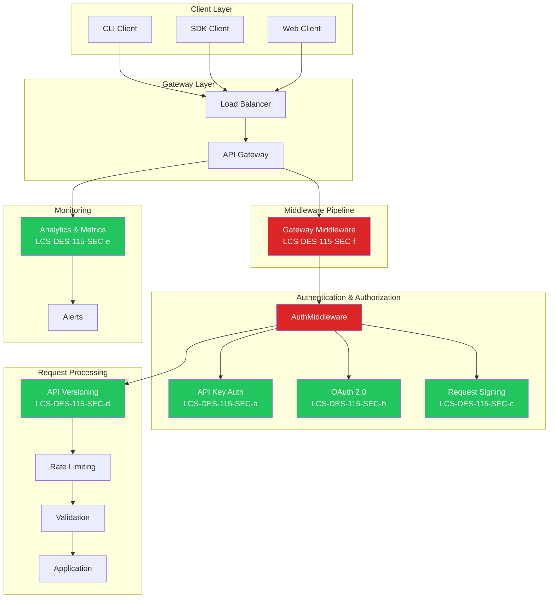
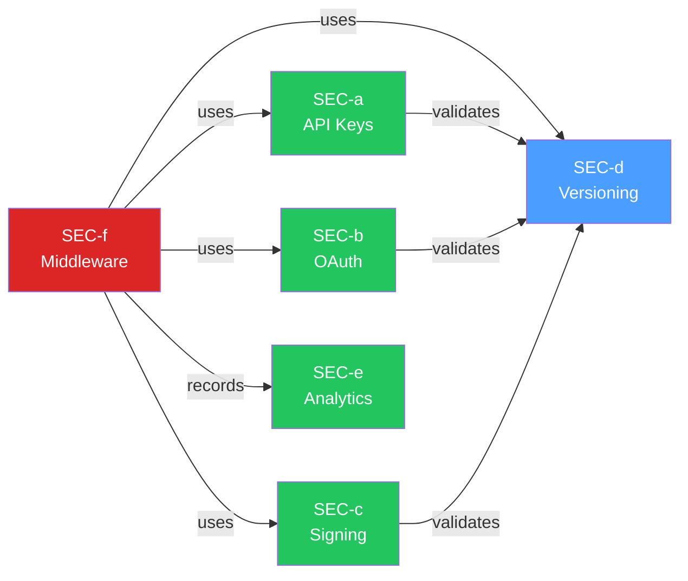
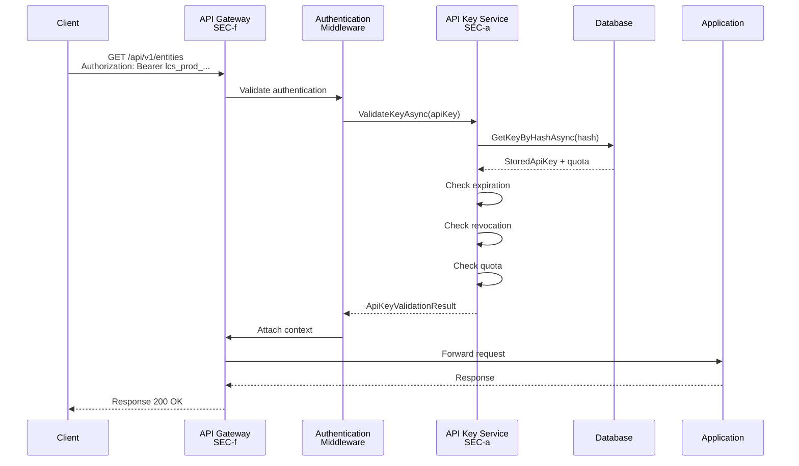
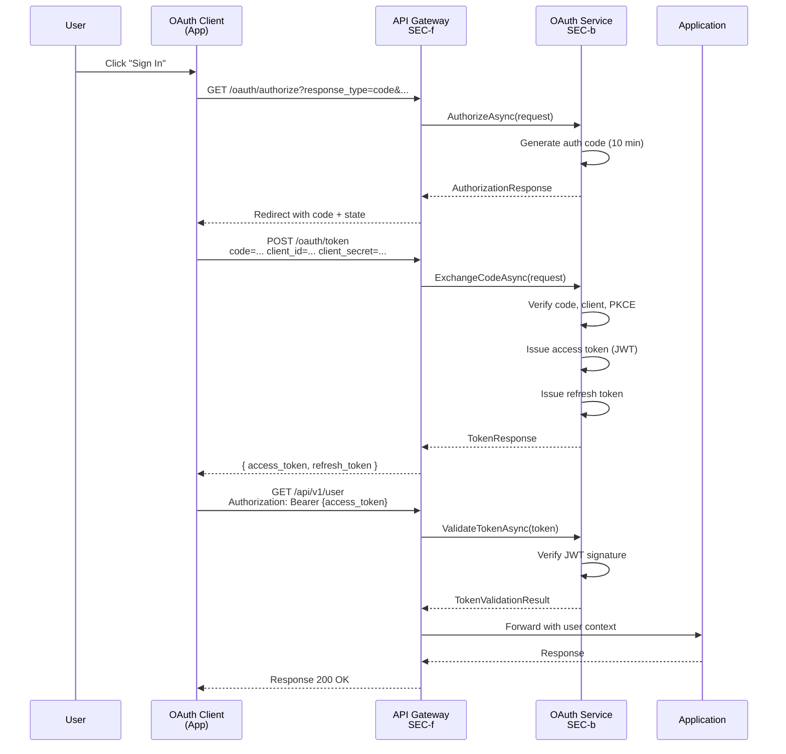
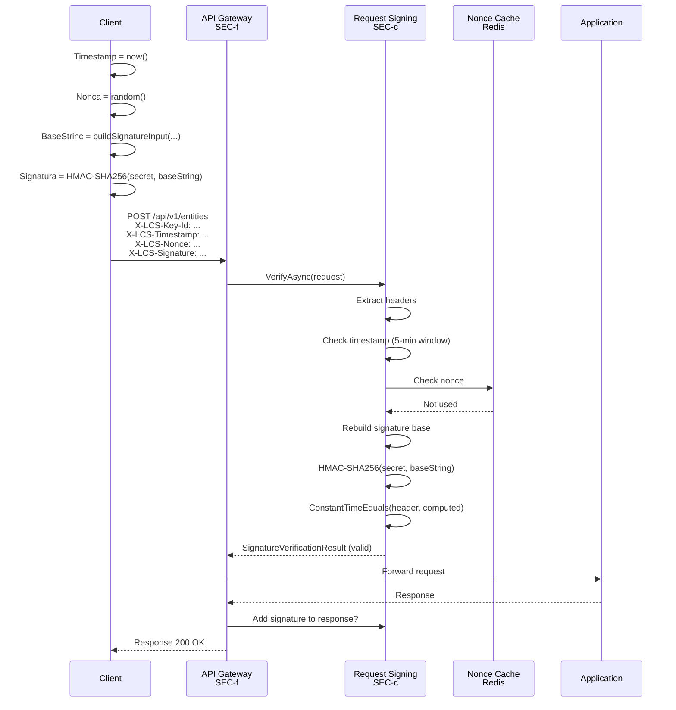
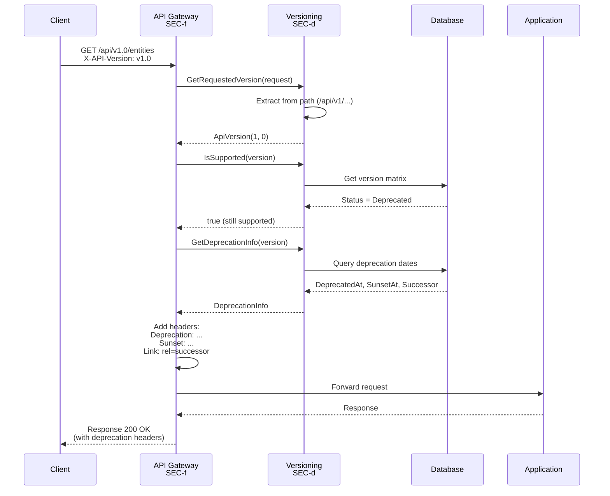
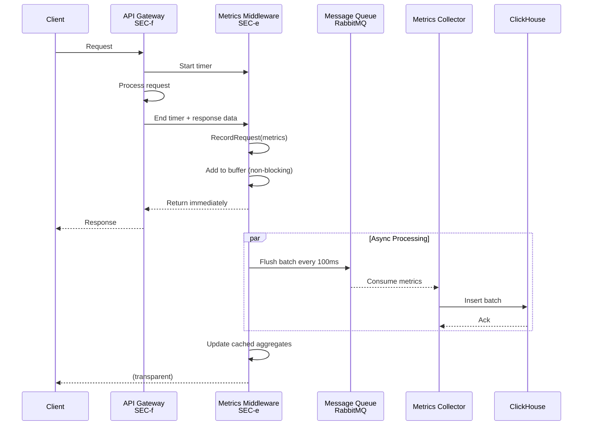

# LCS-DES-115-SEC-INDEX: Design Specification Index — API Security Gateway

## Document Control

| Field            | Value                                                        |
| :--------------- | :----------------------------------------------------------- |
| **Document ID**  | LCS-DES-115-SEC-INDEX                                        |
| **Version**      | v0.11.5                                                      |
| **Codename**     | API Security Gateway (Security Phase 5)                      |
| **Status**       | Draft                                                        |
| **Last Updated** | 2026-01-31                                                   |
| **Owner**        | Lead Architect                                               |

---

## Executive Summary

The **API Security Gateway** (v0.11.5-SEC) delivers comprehensive API security through six integrated design specifications. This index provides navigation and architecture overview for the complete security implementation.

### Quick Links

| Spec ID             | Title                  | Hours | Focus Area              |
| :------------------ | :-------------------- | :---- | :---------------------- |
| LCS-DES-115-SEC-a   | API Key Management     | 8     | Key authentication      |
| LCS-DES-115-SEC-b   | OAuth Provider         | 12    | OAuth 2.0 / OIDC        |
| LCS-DES-115-SEC-c   | Request Signing        | 6     | Request integrity       |
| LCS-DES-115-SEC-d   | API Versioning         | 5     | Version management      |
| LCS-DES-115-SEC-e   | API Analytics          | 8     | Usage monitoring        |
| LCS-DES-115-SEC-f   | Gateway Middleware     | 6     | Request pipeline        |
| **Total**           |                        | **45** | **Complete Security**   |

---

## 1. API Security Gateway Architecture

### 1.1 Complete Request Flow Diagram



### 1.2 Component Dependency Map



---

## 2. Specification Details

### 2.1 LCS-DES-115-SEC-a: API Key Management

**Purpose**: Create and manage long-lived API keys with scoped permissions and quotas.

**Key Interfaces**:
- `IApiKeyService`: Create, validate, revoke, rotate keys
- `ApiKeyValidator`: Validates keys and checks status
- `ApiKeyQuotaManager`: Tracks and enforces quotas

**Key Operations**:
1. Create API key with scopes and quota
2. Validate key format, expiration, revocation
3. Check IP restrictions
4. Enforce rate limits (requests/min, requests/day, data transfer)
5. Rotate key for security refresh
6. Revoke key immediately

**Data Types**:
- `ApiKeyCreationResult`: Secret (shown once), prefix, ID
- `ApiKeyValidationResult`: Status (Active, Expired, Revoked, QuotaExceeded, IpRestricted)
- `ApiKeyQuota`: Requests/day, requests/min, data transfer/day
- `ApiScope`: Permission flags (Read, Write, Admin combinations)

**Dependencies**:
- `IEncryptionService` (v0.11.3-SEC): Encrypt stored secrets
- `IAuditLogger` (v0.11.2-SEC): Log all key operations
- `IDataStore`: Persist keys and metrics

**Performance**: Key validation <5ms P95

**License**: WriterPro (2 keys), Teams (5+), Enterprise (unlimited)

---

### 2.2 LCS-DES-115-SEC-b: OAuth Provider

**Purpose**: Implement OAuth 2.0 and OpenID Connect for delegated access and identity.

**Key Interfaces**:
- `IOAuthService`: Authorization, token exchange, validation, revocation
- `OAuthClientManager`: Register and manage OAuth applications
- `TokenIssuer`: Issue JWT access and ID tokens
- `TokenValidator`: Validate JWT signatures and claims
- `JwksService`: Distribute public keys for validation

**Key Operations**:
1. Authorization Code Flow: User consent → Code → Token exchange
2. Client Credentials Flow: Direct token issue for service accounts
3. Refresh Token Flow: Renew access tokens
4. Token Validation: Verify JWT signatures and claims
5. Token Revocation: Blacklist tokens
6. JWKS Endpoint: Publish public keys for SDK validation

**Data Types**:
- `AuthorizationRequest`: ClientId, RedirectUri, Scope, State, PKCE
- `TokenResponse`: AccessToken, RefreshToken, IdToken, ExpiresIn
- `TokenValidationResult`: IsValid, UserId, ClientId, Scopes, Claims

**Grant Types**:
- `authorization_code`: User-delegated access (web apps)
- `client_credentials`: Service-to-service (no user context)
- `refresh_token`: Token renewal

**Dependencies**:
- JWT Library: System.IdentityModel.Tokens.Jwt
- `IEncryptionService` (v0.11.3-SEC): Encrypt client secrets
- `IDataStore`: Persist clients, codes, tokens

**Performance**: Token validation <10ms P95, Exchange <50ms P95

**License**: Teams (OAuth 2.0), Enterprise (OAuth + OIDC)

---

### 2.3 LCS-DES-115-SEC-c: Request Signing

**Purpose**: Enable request-level integrity verification with HMAC-SHA256.

**Key Interfaces**:
- `IRequestSigningService`: Sign and verify requests
- `SignatureBuilder`: Construct signature base strings
- `SignatureVerifier`: Verify HMAC signatures
- `ReplayProtection`: Nonce-based replay detection

**Key Operations**:
1. Build signature input from method, path, headers, body
2. Compute HMAC-SHA256 signature
3. Verify timestamp within 5-minute window
4. Check nonce against cache (prevent replay)
5. Constant-time signature comparison

**Signature Components**:
```
METHOD
PATH
TIMESTAMP (ISO 8601)
NONCE (32 random bytes)
Headers (Content-Type, Content-Length, etc.)
SHA256(request body)
```

**Data Types**:
- `SignedRequest`: Signature, SignatureInput, Timestamp, Nonce
- `SignatureVerificationResult`: IsValid, KeyId, TimestampSkew
- `SigningCredentials`: KeyId, Algorithm, SecretKey

**Headers**:
- `X-LCS-Key-Id`: Key identifier
- `X-LCS-Timestamp`: Request timestamp (5-min window)
- `X-LCS-Nonce`: Unique request identifier (replay protection)
- `X-LCS-Signature`: Base64-encoded HMAC-SHA256 signature

**Dependencies**:
- `IDistributedCache` (Redis/MemoryCache): Nonce storage
- `ISystemClock`: Timestamp validation

**Performance**: Verification <5ms P95, Signing <2ms P95

**License**: Teams (basic), Enterprise (advanced options)

---

### 2.4 LCS-DES-115-SEC-d: API Versioning

**Purpose**: Manage multiple API versions with clear deprecation paths.

**Key Interfaces**:
- `IApiVersioningService`: Detect versions, check support, get deprecation info
- `VersionDetector`: Extract version from headers/path/query
- `VersionMatrix`: Manage version lifecycle

**Key Operations**:
1. Detect version from X-API-Version header, URL path, or query param
2. Validate version is supported (Current or Supported status)
3. Return deprecation info if version is deprecated
4. Inject RFC 7231 deprecation headers in responses

**Version Lifecycle**:
- **Current**: Latest version, recommended for new apps
- **Supported**: Supported but not latest, discouraged
- **Deprecated**: Will be removed, clients must migrate
- **Sunset**: No longer available, access fails

**Deprecation Headers** (RFC 7231):
- `Deprecation`: When deprecation was announced
- `Sunset`: When version will be removed
- `Link`: Successor version reference
- `Warning`: Human-readable deprecation message
- `X-API-Migrate-To`: Recommended migration target

**Data Types**:
- `ApiVersion`: Major.Minor format
- `ApiVersionInfo`: Status, released/deprecated/sunset dates, changelog
- `DeprecationInfo`: Dates, successor, migration guide, days until sunset

**Dependencies**:
- `IConfiguration`: Load version matrix from config
- `IDataStore`: Persist version definitions

**Performance**: Detection <1ms P95, Lookup <1ms P95

**License**: WriterPro (basic), Teams (full), Enterprise (custom timelines)

---

### 2.5 LCS-DES-115-SEC-e: API Analytics

**Purpose**: Monitor API usage and performance in real-time.

**Key Interfaces**:
- `IApiAnalyticsService`: Record requests, query usage, get top consumers, endpoint performance
- `MetricsCollector`: High-performance async recording
- `AnalyticsQueryEngine`: Time-series querying and aggregation

**Key Operations**:
1. Record request metrics asynchronously (fire-and-forget)
2. Query usage stats (requests, errors, latency percentiles)
3. Get top consumers by request count
4. Get endpoint performance breakdown
5. Time-series aggregation (hourly, daily rollups)

**Metrics Recorded**:
- Endpoint (GET /api/v1/entities)
- HTTP method and status code
- User ID, API Key ID, Client ID
- Duration (milliseconds)
- Request/response sizes
- IP address, User-Agent
- API version
- Timestamp

**Queries**:
- Period: Last 24 hours (default), or custom time range
- Filters: UserId, ApiKeyId, Endpoint, Version, Status code range
- Aggregations: Total, success rate, latency percentiles, unique consumers

**Data Types**:
- `ApiRequestMetrics`: Single request snapshot
- `ApiUsageStats`: Aggregated stats (totals, rates, percentiles)
- `ApiConsumer`: Consumer summary (ID, name, type, request count, latency)
- `EndpointUsage`: Endpoint performance (requests, latency, error rate)

**Storage**:
- Real-time: ClickHouse or TimescaleDB (time-series optimized)
- Message queue: RabbitMQ or Kafka (async buffering)
- Cache: Redis (aggregate caching)

**Performance**: Record <0.5ms P99, Query <500ms P95

**License**: Teams (basic 24h), Enterprise (full 90d + SLA)

---

### 2.6 LCS-DES-115-SEC-f: Gateway Middleware

**Purpose**: Orchestrate all security components in request pipeline.

**Middleware Components** (in order):
1. **Error Handling**: Catch exceptions, format as JSON errors
2. **Authentication**: API key, OAuth, or signature validation
3. **Versioning**: Detect version, check support, add deprecation headers
4. **Rate Limiting**: Check quotas, enforce limits
5. **Metrics Start**: Begin timing
6. **Handler**: Route to endpoint
7. **Metrics End**: Record latency
8. **Security Headers**: Add OWASP headers

**Middleware Details**:

| Name | Purpose | Headers | Performance |
| :--- | :------- | :------- | :----------- |
| Authentication | Validate credentials | Authorization | <5ms |
| Versioning | Route by version | X-API-Version | <1ms |
| Rate Limiting | Enforce quotas | (implicit) | <3ms |
| Metrics | Record usage | (implicit) | <1ms |
| Security Headers | OWASP compliance | Strict-Transport-Security, etc. | <1ms |
| Error Handling | Catch exceptions | (implicit) | <1ms |

**Security Headers** (added to all responses):
- `Strict-Transport-Security`: max-age=31536000; includeSubDomains
- `X-Content-Type-Options`: nosniff
- `X-Frame-Options`: DENY
- `X-XSS-Protection`: 1; mode=block
- `Content-Security-Policy`: default-src 'none'
- `Cache-Control`: no-store
- `X-Request-Id`: Correlation tracking

**Dependencies**:
- All 5 preceding specs (a, b, c, d, e)
- ASP.NET Core middleware pipeline
- `ILogger<T>`: Request/response logging

**Performance**: Total overhead <20ms P95

**License**: WriterPro+ (full implementation)

---

## 3. Data Flow Diagrams

### 3.1 API Key Authentication Flow



### 3.2 OAuth 2.0 Authorization Code Flow



### 3.3 Request Signing Flow



### 3.4 Versioning & Deprecation Flow



### 3.5 Metrics Recording Flow



---

## 4. Implementation Phases

### Phase 1: Core Authentication (Week 1)
- **Spec**: LCS-DES-115-SEC-a (API Key Management)
- **Deliverables**: `IApiKeyService`, key creation/validation/rotation
- **Testing**: Unit tests for all scenarios
- **Hours**: 8

### Phase 2: OAuth & OpenID (Week 2)
- **Spec**: LCS-DES-115-SEC-b (OAuth Provider)
- **Deliverables**: Authorization code, client credentials, token refresh flows
- **Testing**: Integration tests with real browser flow
- **Hours**: 12

### Phase 3: Request Integrity (Week 3)
- **Spec**: LCS-DES-115-SEC-c (Request Signing)
- **Deliverables**: Signature generation, HMAC verification, nonce protection
- **Testing**: Unit tests for constant-time comparison
- **Hours**: 6

### Phase 4: Version Management (Week 3)
- **Spec**: LCS-DES-115-SEC-d (API Versioning)
- **Deliverables**: Version detection, deprecation headers, version matrix
- **Testing**: E2E tests with multiple versions
- **Hours**: 5

### Phase 5: Monitoring (Week 4)
- **Spec**: LCS-DES-115-SEC-e (API Analytics)
- **Deliverables**: Metrics collection, time-series queries, dashboards
- **Testing**: Load tests for high-volume recording
- **Hours**: 8

### Phase 6: Integration (Week 4)
- **Spec**: LCS-DES-115-SEC-f (Gateway Middleware)
- **Deliverables**: Middleware pipeline, error handling, security headers
- **Testing**: Full E2E integration tests
- **Hours**: 6

**Total Duration**: 4 weeks, 45 hours

---

## 5. Key Interfaces Summary

### Authentication Interfaces

```csharp
// API Key Service (SEC-a)
public interface IApiKeyService
{
    Task<ApiKeyCreationResult> CreateKeyAsync(CreateApiKeyRequest request);
    Task<ApiKeyValidationResult> ValidateKeyAsync(string apiKey);
    Task<IReadOnlyList<ApiKeyInfo>> GetUserKeysAsync(Guid userId);
    Task RevokeKeyAsync(Guid keyId, string? reason = null);
    Task<ApiKeyCreationResult> RotateKeyAsync(Guid keyId);
}

// OAuth Service (SEC-b)
public interface IOAuthService
{
    Task<AuthorizationResponse> AuthorizeAsync(AuthorizationRequest request);
    Task<TokenResponse> ExchangeCodeAsync(TokenRequest request);
    Task<TokenResponse> ClientCredentialsAsync(ClientCredentialsRequest request);
    Task<TokenResponse> RefreshTokenAsync(RefreshTokenRequest request);
    Task<TokenValidationResult> ValidateTokenAsync(string accessToken);
    Task RevokeTokenAsync(string token);
    Task<JsonWebKeySet> GetJwksAsync();
}

// Request Signing Service (SEC-c)
public interface IRequestSigningService
{
    SignedRequest Sign(HttpRequestMessage request, SigningCredentials credentials);
    Task<SignatureVerificationResult> VerifyAsync(HttpRequestMessage request);
    Task<SigningCredentials?> GetCredentialsAsync(string keyId);
}

// Versioning Service (SEC-d)
public interface IApiVersioningService
{
    ApiVersion GetRequestedVersion(HttpRequestMessage request);
    Task<IReadOnlyList<ApiVersionInfo>> GetVersionsAsync();
    bool IsSupported(ApiVersion version);
    DeprecationInfo? GetDeprecationInfo(ApiVersion version);
}

// Analytics Service (SEC-e)
public interface IApiAnalyticsService
{
    void RecordRequest(ApiRequestMetrics metrics);
    Task<ApiUsageStats> GetUsageAsync(UsageQuery query);
    Task<IReadOnlyList<ApiConsumer>> GetTopConsumersAsync(int limit = 10, TimeSpan? period = null);
    Task<IReadOnlyList<EndpointUsage>> GetEndpointUsageAsync(TimeSpan? period = null);
}
```

---

## 6. Configuration Example

```json
{
  "ApiGateway": {
    "Enabled": true,
    "DefaultVersion": "v2.0",
    "ApiKey": {
      "Enabled": true,
      "MaxKeysPerUser": {
        "WriterPro": 2,
        "Teams": 10,
        "Enterprise": 100
      }
    },
    "OAuth": {
      "Enabled": true,
      "Authority": "https://auth.lexichord.com",
      "Issuer": "https://lexichord.com",
      "AccessTokenLifetime": 900,
      "RefreshTokenLifetime": 604800
    },
    "RequestSigning": {
      "Enabled": true,
      "TimestampWindow": 300,
      "Algorithm": "HMAC-SHA256"
    },
    "Versioning": {
      "Versions": [
        {
          "Version": "v1.0",
          "Status": "Sunset",
          "ReleasedAt": "2024-01-01T00:00:00Z",
          "DeprecatedAt": "2025-01-01T00:00:00Z",
          "SunsetAt": "2026-01-01T00:00:00Z"
        },
        {
          "Version": "v2.0",
          "Status": "Current",
          "ReleasedAt": "2025-06-01T00:00:00Z"
        }
      ]
    },
    "Analytics": {
      "Enabled": true,
      "Storage": "ClickHouse",
      "RetentionDays": 90,
      "BatchSize": 1000,
      "FlushIntervalMs": 100
    }
  }
}
```

---

## 7. Testing Strategy

### Unit Tests (Per Spec)
- Minimum 95% code coverage
- All interfaces thoroughly tested
- Edge cases and error paths

### Integration Tests (SEC-f)
- E2E request flows through entire pipeline
- Multiple authentication methods
- Deprecation header injection
- Metrics recording validation

### Load Tests
- 1000+ RPS throughput
- <20ms P95 gateway overhead
- Metrics recording at scale
- No dropped requests

### Security Tests
- Timing attack resistance (constant-time comparison)
- Replay attack prevention (nonce validation)
- Secret exposure prevention (no logging)
- Rate limit enforcement

---

## 8. Monitoring & Observability

### Key Metrics to Track
- Request volume by endpoint
- Error rate by status code
- Latency percentiles (p50, p95, p99)
- Authentication failures by method
- API key and OAuth token usage
- Deprecated version usage (enforce sunset dates)

### Dashboards
- Real-time request monitoring
- Consumer usage breakdown
- Endpoint performance heatmap
- Deprecation warning dashboard
- Error rate and latency alerts

### Alerts
- High error rate (>5%)
- High latency (p95 >500ms)
- Rate limit abuse
- Signature verification failures
- Deprecated version usage spike

---

## 9. Security Checklist

- [ ] API keys hashed with PBKDF2-SHA256, 10k iterations
- [ ] Keys encrypted at rest with `IEncryptionService`
- [ ] OAuth tokens signed with RS256
- [ ] Request signatures use HMAC-SHA256 with constant-time comparison
- [ ] No secrets logged or cached in plain text
- [ ] All requests validated before reaching handlers
- [ ] OWASP security headers on all responses
- [ ] Rate limiting prevents quota abuse
- [ ] Nonce cache prevents replay attacks
- [ ] Timestamp windows prevent clock skew attacks
- [ ] IP restrictions can be enforced per key
- [ ] Audit logging for all key operations
- [ ] TLS required for all API calls

---

## 10. Document History

| Version | Date       | Author      | Changes       |
| :------ | :--------- | :---------- | :------------ |
| 1.0     | 2026-01-31 | Lead Arch.  | Initial index |

---

## 11. Cross-References

### Related Specifications
- **v0.11.1-SEC**: Access Control Framework (Authorization)
- **v0.11.2-SEC**: Audit & Logging
- **v0.11.3-SEC**: Encryption & Key Management
- **v0.11.4-SEC**: Input Validation & Sanitization

### External Standards
- [RFC 6749](https://tools.ietf.org/html/rfc6749): OAuth 2.0 Authorization Framework
- [RFC 7231](https://tools.ietf.org/html/rfc7231): HTTP Semantics (Deprecation Headers)
- [OpenID Connect Core](https://openid.net/specs/openid-connect-core-1_0.html): OIDC Specification
- [OWASP API Security Top 10](https://owasp.org/www-project-api-security/): API Security Guidelines
- [HTTP Message Signatures](https://datatracker.ietf.org/doc/html/draft-ietf-httpbis-message-signatures/): Request Signing

---

## Navigation

| Previous | Up | Next |
| :------- | :- | :--- |
| [LCS-SBD-115-SEC](./LCS-SBD-v0.11.5-SEC.md) | [v0.11.5](.) | [LCS-DES-115-SEC-a](./LCS-DES-v0.11.5-SEC-a.md) |
