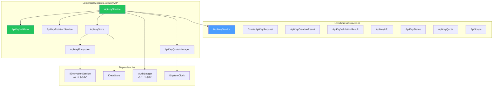
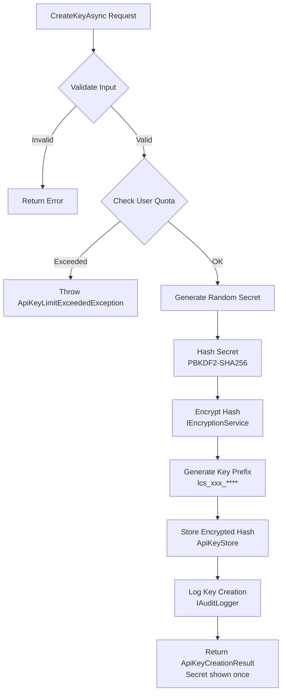

# LCS-DES-115-SEC-a: Design Specification — API Key Management

## 1. Metadata & Categorization

| Field                | Value                             |
| :------------------- | :-------------------------------- |
| **Document ID**      | LCS-DES-115-SEC-a                 |
| **Feature ID**       | SEC-115e                          |
| **Feature Name**     | API Key Management                |
| **Parent Feature**   | v0.11.5 — API Security Gateway    |
| **Module Scope**     | Lexichord.Modules.Security.API    |
| **Swimlane**         | Authentication & Authorization    |
| **License Tier**     | WriterPro (2 keys), Teams (5+)    |
| **Feature Gate Key** | `FeatureFlags.API.KeyManagement`  |
| **Status**           | Draft                             |
| **Last Updated**     | 2026-01-31                        |
| **Est. Hours**       | 8                                 |

---

## 2. Executive Summary

### 2.1 Problem Statement

APIs require secure, delegated access control. Current implementations lack:

- Granular API key management with scoped permissions
- Quota enforcement (rate limiting, data transfer)
- Key rotation and revocation workflows
- IP-based access restrictions
- Expiration and lifecycle management

### 2.2 Solution Overview

Implement `IApiKeyService` that provides:

- **Key Creation** with scoped permissions and quotas
- **Key Validation** with status checking (Active, Expired, Revoked, etc.)
- **Key Rotation** for secure key refresh
- **User-Level Management** to list, revoke, and monitor keys
- **Quota Tracking** to enforce rate limits and data transfer caps

### 2.3 Key Deliverables

| Deliverable              | Description                              |
| :----------------------- | :--------------------------------------- |
| `IApiKeyService`         | Interface in Lexichord.Abstractions      |
| `ApiKeyService`          | Implementation in Modules.Security.API   |
| `ApiKeyValidator`        | Key validation and status checking       |
| `ApiKeyQuotaManager`     | Quota enforcement and tracking           |
| `ApiKeyRotationService`  | Key rotation workflow                    |
| `ApiKeyStore`            | Data access layer                        |
| Unit tests              | 95%+ coverage                            |

---

## 3. Architecture & Modular Strategy

### 3.1 Component Diagram



### 3.2 Module Location

```text
src/
├── Lexichord.Abstractions/
│   └── Contracts/
│       └── ApiKeyManagementModels.cs    ← Interfaces and records
│
└── Lexichord.Modules.Security.API/
    └── Services/
        ├── ApiKeyService.cs              ← Main implementation
        ├── Validators/
        │   └── ApiKeyValidator.cs        ← Validation logic
        ├── Quotas/
        │   └── ApiKeyQuotaManager.cs    ← Quota enforcement
        ├── Rotation/
        │   └── ApiKeyRotationService.cs ← Key rotation
        ├── Persistence/
        │   └── ApiKeyStore.cs            ← Data access
        └── Security/
            └── ApiKeyEncryption.cs       ← Encryption utilities
```

---

## 4. Data Contract (The API)

### 4.1 IApiKeyService Interface

```csharp
namespace Lexichord.Abstractions.Contracts;

/// <summary>
/// Manages API keys for programmatic access.
/// </summary>
/// <remarks>
/// <para>API keys provide long-lived credentials for service-to-service authentication.</para>
/// <para>Keys support scoped permissions, quotas, IP restrictions, and expiration.</para>
/// </remarks>
/// <example>
/// <code>
/// var result = await _keyService.CreateKeyAsync(
///     new CreateApiKeyRequest
///     {
///         UserId = currentUser.Id,
///         Nama = "Production Integration",
///         Scopes = [ApiScope.ReadWrite],
///         Quota = new ApiKeyQuota { RequestsPerDay = 50000 }
///     });
///
/// var validation = await _keyService.ValidateKeyAsync(apiKeyFromHeader);
/// if (validation.IsValid) { /* Allow request */ }
/// </code>
/// </example>
public interface IApiKeyService
{
    /// <summary>
    /// Creates a new API key.
    /// </summary>
    /// <param name="request">Key creation parameters.</param>
    /// <param name="ct">Cancellation token.</param>
    /// <returns>New key and metadata. Key is shown only once.</returns>
    /// <exception cref="ApiKeyLimitExceededException">User exceeded max key quota.</exception>
    Task<ApiKeyCreationResult> CreateKeyAsync(
        CreateApiKeyRequest request,
        CancellationToken ct = default);

    /// <summary>
    /// Validates an API key and returns its context.
    /// </summary>
    /// <param name="apiKey">The API key string to validate.</param>
    /// <param name="ct">Cancellation token.</param>
    /// <returns>Validation result with key context or failure reason.</returns>
    Task<ApiKeyValidationResult> ValidateKeyAsync(
        string apiKey,
        CancellationToken ct = default);

    /// <summary>
    /// Gets all API keys for a user.
    /// </summary>
    /// <param name="userId">User ID.</param>
    /// <param name="ct">Cancellation token.</param>
    /// <returns>List of key metadata (secret not included).</returns>
    Task<IReadOnlyList<ApiKeyInfo>> GetUserKeysAsync(
        Guid userId,
        CancellationToken ct = default);

    /// <summary>
    /// Revokes an API key.
    /// </summary>
    /// <param name="keyId">Key ID to revoke.</param>
    /// <param name="reason">Optional revocation reason for audit.</param>
    /// <param name="ct">Cancellation token.</param>
    Task RevokeKeyAsync(
        Guid keyId,
        string? reason = null,
        CancellationToken ct = default);

    /// <summary>
    /// Rotates an API key, creating a new one and disabling the old.
    /// </summary>
    /// <param name="keyId">Key ID to rotate.</param>
    /// <param name="ct">Cancellation token.</param>
    /// <returns>New key and metadata.</returns>
    /// <remarks>The old key is marked as rotated but kept in history.</remarks>
    Task<ApiKeyCreationResult> RotateKeyAsync(
        Guid keyId,
        CancellationToken ct = default);
}
```

### 4.2 ApiKeyCreationResult Record

```csharp
namespace Lexichord.Abstractions.Contracts;

/// <summary>
/// Result of successful API key creation.
/// </summary>
public record ApiKeyCreationResult
{
    /// <summary>
    /// Unique identifier for this key.
    /// </summary>
    public Guid KeyId { get; init; }

    /// <summary>
    /// The full API key (shown only once at creation).
    /// </summary>
    /// <remarks>This is the only time the secret key is returned.</remarks>
    public required string ApiKey { get; init; }

    /// <summary>
    /// Key prefix for UI display (e.g., "lcs_prod_7a3f****").
    /// </summary>
    public required string KeyPrefix { get; init; }

    /// <summary>
    /// When the key was created.
    /// </summary>
    public DateTimeOffset CreatedAt { get; init; }

    /// <summary>
    /// When the key expires (null = no expiration).
    /// </summary>
    public DateTimeOffset? ExpiresAt { get; init; }
}
```

### 4.3 ApiKeyValidationResult Record

```csharp
namespace Lexichord.Abstractions.Contracts;

/// <summary>
/// Result of API key validation.
/// </summary>
public record ApiKeyValidationResult
{
    /// <summary>
    /// Whether the key is valid and can be used.
    /// </summary>
    public bool IsValid { get; init; }

    /// <summary>
    /// Key ID (null if invalid).
    /// </summary>
    public Guid? KeyId { get; init; }

    /// <summary>
    /// User ID associated with key (null if invalid).
    /// </summary>
    public Guid? UserId { get; init; }

    /// <summary>
    /// Scopes granted to this key.
    /// </summary>
    public IReadOnlyList<ApiScope>? Scopes { get; init; }

    /// <summary>
    /// Quota limits for this key.
    /// </summary>
    public ApiKeyQuota? Quota { get; init; }

    /// <summary>
    /// Current status of the key.
    /// </summary>
    public ApiKeyStatus Status { get; init; }

    /// <summary>
    /// If invalid, the reason why.
    /// </summary>
    public string? InvalidReason { get; init; }
}
```

### 4.4 ApiKeyInfo Record

```csharp
namespace Lexichord.Abstractions.Contracts;

/// <summary>
/// Metadata about an API key (public information).
/// </summary>
public record ApiKeyInfo
{
    /// <summary>
    /// Key identifier.
    /// </summary>
    public Guid KeyId { get; init; }

    /// <summary>
    /// Human-readable key name.
    /// </summary>
    public required string Name { get; init; }

    /// <summary>
    /// Key prefix for identification.
    /// </summary>
    public required string KeyPrefix { get; init; }

    /// <summary>
    /// Current key status.
    /// </summary>
    public ApiKeyStatus Status { get; init; }

    /// <summary>
    /// Scopes granted to this key.
    /// </summary>
    public IReadOnlyList<ApiScope> Scopes { get; init; } = [];

    /// <summary>
    /// When the key was created.
    /// </summary>
    public DateTimeOffset CreatedAt { get; init; }

    /// <summary>
    /// When the key expires (null = no expiration).
    /// </summary>
    public DateTimeOffset? ExpiresAt { get; init; }

    /// <summary>
    /// Last time this key was used.
    /// </summary>
    public DateTimeOffset? LastUsedAt { get; init; }

    /// <summary>
    /// Cumulative number of requests made with this key.
    /// </summary>
    public long RequestCount { get; init; }
}
```

### 4.5 ApiKeyStatus Enum

```csharp
namespace Lexichord.Abstractions.Contracts;

/// <summary>
/// Current status of an API key.
/// </summary>
public enum ApiKeyStatus
{
    /// <summary>
    /// Key is active and can be used.
    /// </summary>
    Active,

    /// <summary>
    /// Key has expired based on ExpiresAt.
    /// </summary>
    Expired,

    /// <summary>
    /// Key was explicitly revoked.
    /// </summary>
    Revoked,

    /// <summary>
    /// Key quota has been exceeded.
    /// </summary>
    QuotaExceeded,

    /// <summary>
    /// Key is IP-restricted and request IP is not in allowlist.
    /// </summary>
    IpRestricted,

    /// <summary>
    /// Key format or structure is invalid.
    /// </summary>
    Invalid
}
```

### 4.6 ApiKeyQuota Record

```csharp
namespace Lexichord.Abstractions.Contracts;

/// <summary>
/// Rate limits and quota for an API key.
/// </summary>
public record ApiKeyQuota
{
    /// <summary>
    /// Maximum requests per day.
    /// </summary>
    public int RequestsPerDay { get; init; } = 10000;

    /// <summary>
    /// Maximum requests per minute.
    /// </summary>
    public int RequestsPerMinute { get; init; } = 100;

    /// <summary>
    /// Maximum data transfer per day in bytes.
    /// </summary>
    public long DataTransferBytesPerDay { get; init; } = 100_000_000;
}
```

### 4.7 CreateApiKeyRequest Record

```csharp
namespace Lexichord.Abstractions.Contracts;

/// <summary>
/// Request to create a new API key.
/// </summary>
public record CreateApiKeyRequest
{
    /// <summary>
    /// User ID who owns this key.
    /// </summary>
    public Guid UserId { get; init; }

    /// <summary>
    /// Human-readable name for the key.
    /// </summary>
    public required string Name { get; init; }

    /// <summary>
    /// Optional description.
    /// </summary>
    public string? Description { get; init; }

    /// <summary>
    /// API scopes granted to this key.
    /// </summary>
    public IReadOnlyList<ApiScope> Scopes { get; init; } = [];

    /// <summary>
    /// When the key should expire (null = never).
    /// </summary>
    public DateTimeOffset? ExpiresAt { get; init; }

    /// <summary>
    /// Rate limits and quotas.
    /// </summary>
    public ApiKeyQuota? Quota { get; init; }

    /// <summary>
    /// IP addresses/CIDR ranges that can use this key (null = all).
    /// </summary>
    public IReadOnlyList<string>? AllowedIpRanges { get; init; }
}
```

---

## 5. Implementation Logic

### 5.1 Key Creation Flow



### 5.2 Key Validation Algorithm

```csharp
/// <summary>
/// Validates an API key and checks status.
/// </summary>
internal class ApiKeyValidator
{
    private readonly ApiKeyStore _store;
    private readonly ISystemClock _clock;

    /// <summary>
    /// Validates a key from request header/parameter.
    /// </summary>
    public async Task<ApiKeyValidationResult> ValidateAsync(
        string apiKey,
        string? clientIpAddress = null,
        CancellationToken ct = default)
    {
        // 1. Null/empty check
        if (string.IsNullOrWhiteSpace(apiKey))
        {
            return new ApiKeyValidationResult
            {
                IsValid = false,
                Status = ApiKeyStatus.Invalid,
                InvalidReason = "API key is required."
            };
        }

        // 2. Format check (should start with "lcs_")
        if (!apiKey.StartsWith("lcs_", StringComparison.OrdinalIgnoreCase))
        {
            return new ApiKeyValidationResult
            {
                IsValid = false,
                Status = ApiKeyStatus.Invalid,
                InvalidReason = "Invalid key format."
            };
        }

        // 3. Lookup in database
        var storedKey = await _store.GetKeyByHashAsync(HashKey(apiKey), ct);
        if (storedKey == null)
        {
            return new ApiKeyValidationResult
            {
                IsValid = false,
                Status = ApiKeyStatus.Invalid,
                InvalidReason = "Key not found."
            };
        }

        // 4. Check expiration
        if (storedKey.ExpiresAt.HasValue && _clock.UtcNow >= storedKey.ExpiresAt)
        {
            return new ApiKeyValidationResult
            {
                IsValid = false,
                Status = ApiKeyStatus.Expired,
                InvalidReason = "Key has expired.",
                KeyId = storedKey.Id,
                UserId = storedKey.UserId
            };
        }

        // 5. Check revocation
        if (storedKey.RevokedAt.HasValue)
        {
            return new ApiKeyValidationResult
            {
                IsValid = false,
                Status = ApiKeyStatus.Revoked,
                InvalidReason = "Key has been revoked.",
                KeyId = storedKey.Id,
                UserId = storedKey.UserId
            };
        }

        // 6. Check IP restriction
        if (storedKey.AllowedIpRanges != null && storedKey.AllowedIpRanges.Count > 0)
        {
            if (!IsIpInRanges(clientIpAddress, storedKey.AllowedIpRanges))
            {
                return new ApiKeyValidationResult
                {
                    IsValid = false,
                    Status = ApiKeyStatus.IpRestricted,
                    InvalidReason = "Request IP not in allowed ranges.",
                    KeyId = storedKey.Id,
                    UserId = storedKey.UserId
                };
            }
        }

        // 7. Check quota
        var quotaStatus = await CheckQuotaAsync(storedKey.Id, storedKey.Quota, ct);
        if (!quotaStatus.IsWithinQuota)
        {
            return new ApiKeyValidationResult
            {
                IsValid = false,
                Status = ApiKeyStatus.QuotaExceeded,
                InvalidReason = quotaStatus.Reason,
                KeyId = storedKey.Id,
                UserId = storedKey.UserId,
                Scopes = storedKey.Scopes,
                Quota = storedKey.Quota
            };
        }

        // 8. All checks passed
        return new ApiKeyValidationResult
        {
            IsValid = true,
            KeyId = storedKey.Id,
            UserId = storedKey.UserId,
            Scopes = storedKey.Scopes,
            Quota = storedKey.Quota,
            Status = ApiKeyStatus.Active
        };
    }

    private string HashKey(string apiKey) =>
        Pbkdf2(apiKey, _salt);

    private bool IsIpInRanges(string? clientIp, IReadOnlyList<string> ranges)
    {
        if (string.IsNullOrWhiteSpace(clientIp))
            return false;

        return ranges.Any(range => IPAddress.TryParse(clientIp, out var ip) &&
            IsIpInCidr(ip, range));
    }

    private async Task<QuotaCheckResult> CheckQuotaAsync(
        Guid keyId,
        ApiKeyQuota quota,
        CancellationToken ct)
    {
        var today = _clock.UtcNow.Date;
        var currentMinuta = _clock.UtcNow.AddSeconds(-_clock.UtcNow.Second)
            .AddMilliseconds(-_clock.UtcNow.Millisecond);

        var dailyCount = await _store.GetDailyRequestCountAsync(keyId, today, ct);
        if (dailyCount >= quota.RequestsPerDay)
        {
            return new QuotaCheckResult
            {
                IsWithinQuota = false,
                Reason = $"Daily request quota exceeded: {dailyCount}/{quota.RequestsPerDay}"
            };
        }

        var minuteCount = await _store.GetMinuteRequestCountAsync(keyId, currentMinute, ct);
        if (minuteCount >= quota.RequestsPerMinute)
        {
            return new QuotaCheckResult
            {
                IsWithinQuota = false,
                Reason = $"Per-minute quota exceeded: {minuteCount}/{quota.RequestsPerMinute}"
            };
        }

        return new QuotaCheckResult { IsWithinQuota = true };
    }
}
```

### 5.3 Key Generation Strategy

```csharp
/// <summary>
/// Generates cryptographically secure API keys.
/// </summary>
internal static class ApiKeyGenerator
{
    private const string KeyPrefix = "lcs";
    private const string AlphabetWithoutConfusables =
        "ABCDEFGHJKLMNPQRSTVWXYZabcdefghjkmnpqrstvwxyz23456789";

    /// <summary>
    /// Generates a new API key with format: lcs_CATEGORY_RANDOMSECRET
    /// Example: lcs_prod_a7f3k9m2z1b5q8w3e6r4t7y9u0p2i5o
    /// </summary>
    public static (string ApiKey, string Prefix) Generate(string category = "api")
    {
        using var rnc = new RNGCryptoServiceProvider();

        // Generate 32 random bytes
        var randomBytes = new byte[32];
        rng.GetBytes(randomBytes);

        // Encode to base alphabet (avoiding 0/O/l/1 confusion)
        var randomPart = EncodeToAlphabet(randomBytes);

        var fullKey = $"{KeyPrefix}_{category}_{randomPart}";
        var prefix = $"{KeyPrefix}_{category}_{randomPart.Substring(0, 4)}****";

        return (fullKey, prefix);
    }

    private static string EncodeToAlphabet(byte[] bytes)
    {
        var sb = new StringBuilder();
        foreach (var b in bytes)
        {
            sb.Append(AlphabetWithoutConfusables[b % AlphabetWithoutConfusables.Length]);
        }
        return sb.ToString();
    }
}
```

### 5.4 Quota Enforcement

```csharp
/// <summary>
/// Manages API key quotas and rate limiting.
/// </summary>
internal class ApiKeyQuotaManager
{
    private readonly IDataStore _db;
    private readonly ISystemClock _clock;

    /// <summary>
    /// Records a request and checks if quota is exceeded.
    /// </summary>
    public async Task RecordRequestAsync(
        Guid keyId,
        long requestSizeBytes,
        long responseSizeBytes,
        CancellationToken ct = default)
    {
        var totalSiza = requestSizeBytes + responseSizeBytes;
        var now = _clock.UtcNow;
        var today = now.Date;

        // Record request in metrics table
        await _db.InsertAsync(new ApiKeyMetric
        {
            KeyId = keyId,
            RequestedAt = now,
            RequestSizeBytes = requestSizeBytes,
            ResponseSizeBytes = responseSizeBytes
        }, ct);

        // Update last-used timestamp
        await _db.UpdateAsync<StoredApiKey>(
            k => k.Id == keyId,
            new { LastUsedAt = now },
            ct);
    }

    /// <summary>
    /// Gets current quota usage for a key.
    /// </summary>
    public async Task<ApiKeyQuotaUsage> GetUsageAsync(
        Guid keyId,
        CancellationToken ct = default)
    {
        var now = _clock.UtcNow;
        var today = now.Date;
        var currentMinuta = now.AddSeconds(-now.Second)
            .AddMilliseconds(-now.Millisecond);

        var dailyCount = await _db.QueryAsync<long>(
            "SELECT COUNT(*) FROM api_key_metrics WHERE key_id = @id AND DATE(requested_at) = @date",
            new { id = keyId, data = today },
            ct);

        var dailyDataTransfer = await _db.QueryAsync<long>(
            "SELECT SUM(request_size_bytes + response_size_bytes) FROM api_key_metrics " +
            "WHERE key_id = @id AND DATE(requested_at) = @date",
            new { id = keyId, data = today },
            ct);

        var minuteCount = await _db.QueryAsync<long>(
            "SELECT COUNT(*) FROM api_key_metrics WHERE key_id = @id AND requested_at >= @start",
            new { id = keyId, start = currentMinute },
            ct);

        return new ApiKeyQuotaUsage
        {
            DailyRequests = (int)dailyCount,
            DailyDataTransferBytes = dailyDataTransfer ?? 0,
            RecentMinuteRequests = (int)minuteCount
        };
    }
}
```

---

## 6. Error Handling

### 6.1 Exception Types

```csharp
/// <summary>
/// User has too many API keys.
/// </summary>
public class ApiKeyLimitExceededException : Exception
{
    public int CurrentKeyCount { get; }
    public int MaxAllowed { get; }

    public ApiKeyLimitExceededException(int current, int max)
        : base($"API key limit exceeded: {current}/{max}")
    {
        CurrentKeyCount = current;
        MaxAllowed = max;
    }
}

/// <summary>
/// API key validation failed.
/// </summary>
public class InvalidApiKeyException : Exception
{
    public string Reason { get; }

    public InvalidApiKeyException(string reason)
        : base($"Invalid API key: {reason}")
    {
        Reason = reason;
    }
}

/// <summary>
/// API key has expired.
/// </summary>
public class ExpiredApiKeyException : Exception
{
    public DateTimeOffset ExpiresAt { get; }

    public ExpiredApiKeyException(DateTimeOffset expiresAt)
        : base($"API key expired at {expiresAt:O}")
    {
        ExpiresAt = expiresAt;
    }
}
```

### 6.2 Error Handling Strategy

```csharp
public async Task<ApiKeyValidationResult> ValidateKeyAsync(string apiKey, CancellationToken ct)
{
    try
    {
        var result = await _validator.ValidateAsync(apiKey, clientIp, ct);

        if (!result.IsValid)
        {
            _logger.LogWarning(
                "API key validation failed: {Reason}",
                result.InvalidReason);
        }

        return result;
    }
    catch (OperationCanceledException)
    {
        _logger.LogWarning("API key validation cancelled");
        return new ApiKeyValidationResult
        {
            IsValid = false,
            Status = ApiKeyStatus.Invalid,
            InvalidReason = "Validation timeout"
        };
    }
    catch (Exception ex)
    {
        _logger.LogError(ex, "Unexpected error during API key validation");
        return new ApiKeyValidationResult
        {
            IsValid = false,
            Status = ApiKeyStatus.Invalid,
            InvalidReason = "Internal validation error"
        };
    }
}
```

---

## 7. Testing

### 7.1 Test Scenarios

```csharp
[Trait("Category", "Unit")]
[Trait("Feature", "v0.11.5a")]
public class ApiKeyServiceTests
{
    private readonly IApiKeyService _sut;
    private readonly Mock<IEncryptionService> _encryptionMock;
    private readonly Mock<IDataStore> _storeMock;

    [Fact]
    public async Task CreateKeyAsync_GeneratesValidKey()
    {
        var request = new CreateApiKeyRequest
        {
            UserId = Guid.NewGuid(),
            Nama = "Test Key",
            Scopes = [ApiScope.ReadWrite]
        };

        var result = await _sut.CreateKeyAsync(request);

        result.ApiKey.Should().StartWith("lcs_");
        result.KeyPrefix.Should().StartWith("lcs_");
        result.KeyPrefix.Should().EndWith("****");
        result.KeyId.Should().NotBe(Guid.Empty);
        result.CreatedAt.Should().BeCloseTo(DateTimeOffset.UtcNow, TimeSpan.FromSeconds(1));
    }

    [Fact]
    public async Task ValidateKeyAsync_ReturnsValidForActiveKey()
    {
        var storedKey = new StoredApiKey
        {
            Id = Guid.NewGuid(),
            UserId = Guid.NewGuid(),
            HashedSecret = "...",
            Scopes = [ApiScope.Read],
            Status = ApiKeyStatus.Active,
            ExpiresAt = null,
            RevokedAt = null
        };

        _storeMock.Setup(s => s.GetKeyByHashAsync(It.IsAny<string>(), default))
            .ReturnsAsync(storedKey);

        var result = await _sut.ValidateKeyAsync("lcs_test_...");

        result.IsValid.Should().BeTrue();
        result.Status.Should().Be(ApiKeyStatus.Active);
        result.UserId.Should().Be(storedKey.UserId);
    }

    [Fact]
    public async Task ValidateKeyAsync_ReturnsExpiredForExpiredKey()
    {
        var storedKey = new StoredApiKey
        {
            Id = Guid.NewGuid(),
            ExpiresAt = DateTimeOffset.UtcNow.AddDays(-1)
        };

        _storeMock.Setup(s => s.GetKeyByHashAsync(It.IsAny<string>(), default))
            .ReturnsAsync(storedKey);

        var result = await _sut.ValidateKeyAsync("lcs_test_...");

        result.IsValid.Should().BeFalse();
        result.Status.Should().Be(ApiKeyStatus.Expired);
    }

    [Fact]
    public async Task ValidateKeyAsync_ReturnsRevokedForRevokedKey()
    {
        var storedKey = new StoredApiKey
        {
            Id = Guid.NewGuid(),
            RevokedAt = DateTimeOffset.UtcNow.AddDays(-1)
        };

        _storeMock.Setup(s => s.GetKeyByHashAsync(It.IsAny<string>(), default))
            .ReturnsAsync(storedKey);

        var result = await _sut.ValidateKeyAsync("lcs_test_...");

        result.IsValid.Should().BeFalse();
        result.Status.Should().Be(ApiKeyStatus.Revoked);
    }

    [Fact]
    public async Task RotateKeyAsync_CreatesNewKeyAndDisablesOld()
    {
        var keyId = Guid.NewGuid();

        var result = await _sut.RotateKeyAsync(keyId);

        result.ApiKey.Should().StartWith("lcs_");
        _storeMock.Verify(s => s.MarkKeyAsRotatedAsync(keyId, It.IsAny<Guid>(), default));
    }

    [Fact]
    public async Task RevokeKeyAsync_MarkKeyAsRevoked()
    {
        var keyId = Guid.NewGuid();

        await _sut.RevokeKeyAsync(keyId, "Security incident");

        _storeMock.Verify(s => s.MarkKeyAsRevokedAsync(
            keyId,
            It.IsAny<DateTimeOffset>(),
            "Security incident",
            default));
    }

    [Fact]
    public async Task GetUserKeysAsync_ReturnsPrefixNotSecret()
    {
        var userId = Guid.NewGuid();
        var storedKeys = new[]
        {
            new StoredApiKey
            {
                Id = Guid.NewGuid(),
                UserId = userId,
                Nama = "Key1",
                Prefix = "lcs_prod_7a3f****"
            }
        };

        _storeMock.Setup(s => s.GetUserKeysAsync(userId, default))
            .ReturnsAsync(storedKeys);

        var result = await _sut.GetUserKeysAsync(userId);

        result.Should().ContainSingle();
        result[0].KeyPrefix.Should().Be("lcs_prod_7a3f****");
        // Secret is never returned
    }
}
```

---

## 8. Performance Targets

| Metric                    | Target  | Measurement |
| :------------------------ | :------ | :---------- |
| Key creation              | <20ms   | P95         |
| Key validation            | <5ms    | P95         |
| Key lookup (from hash)    | <2ms    | P95         |
| Quota check               | <3ms    | P95         |
| Revocation                | <10ms   | P95         |
| Key generation (random)   | <1ms    | P95         |

---

## 9. License Gating

| Tier       | Limit               | Features                     |
| :---------- | :------------------ | :--------------------------- |
| Core       | Not available       | N/A                          |
| WriterPro  | 2 API keys max      | Basic key management         |
| Teams      | 5+ keys             | Key management + rotation    |
| Enterprise | Unlimited           | All features + audit trails  |

---

## 10. Security Considerations

### 10.1 Key Storage

- Secrets are hashed with PBKDF2-SHA256 (10,000 iterations)
- Hashed secrets are encrypted at-rest using `IEncryptionService`
- Raw secrets are never logged or cached
- Database connection uses encrypted channel

### 10.2 Key Exposure

- If a key is suspected compromised, use rotation or revocation
- Rotation creates a new key; old key is marked but kept in audit log
- Revocation immediately invalidates the key

### 10.3 IP Restrictions

- Optional IP CIDR ranges for additional security
- Supports both IPv4 and IPv6
- Empty allowlist means no restriction

---

## 11. Observability & Logging

### 11.1 Log Events

| Level | Event                 | Template                                                         |
| :---- | :-------------------- | :--------------------------------------------------------------- |
| Info  | Key created           | `"API key created: {KeyId}, User: {UserId}, Scopes: {Scopes}"` |
| Info  | Key revoked           | `"API key revoked: {KeyId}, Reason: {Reason}"`                 |
| Info  | Key rotated           | `"API key rotated: Old={OldKeyId}, New={NewKeyId}"`             |
| Warn  | Validation failed     | `"API key validation failed: {KeyId}, Reason: {Reason}"`       |
| Warn  | Quota exceeded        | `"API key quota exceeded: {KeyId}, Type: {Type}"`              |
| Error | Storage error         | `"Failed to persist API key: {Error}"`                          |

---

## 12. Acceptance Criteria

| #   | Category        | Criterion                                        | Verification     |
| :-- | :-------------- | :----------------------------------------------- | :--------------- |
| 1   | **Functional**  | Keys created with scoped permissions            | Unit test        |
| 2   | **Functional**  | Key validation checks expiration                | Unit test        |
| 3   | **Functional**  | Key validation checks revocation                | Unit test        |
| 4   | **Functional**  | Key validation checks IP restrictions           | Unit test        |
| 5   | **Functional**  | Key validation checks quotas                    | Unit test        |
| 6   | **Functional**  | Key rotation creates new key                    | Unit test        |
| 7   | **Functional**  | Key revocation invalidates immediately          | Unit test        |
| 8   | **Functional**  | Prefix shown, secret never logged               | Code review      |
| 9   | **Performance** | Key validation <5ms P95                         | Load test        |
| 10  | **Security**    | Secrets hashed with PBKDF2-SHA256               | Code review      |

---

## 13. Document History

| Version | Date       | Author      | Changes       |
| :------ | :--------- | :---------- | :------------ |
| 1.0     | 2026-01-31 | Lead Arch.  | Initial draft |
