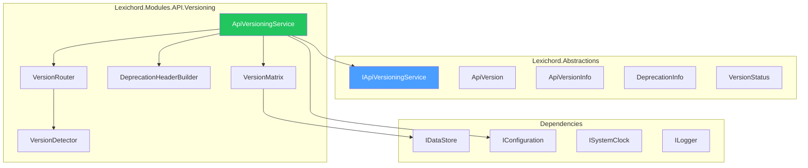
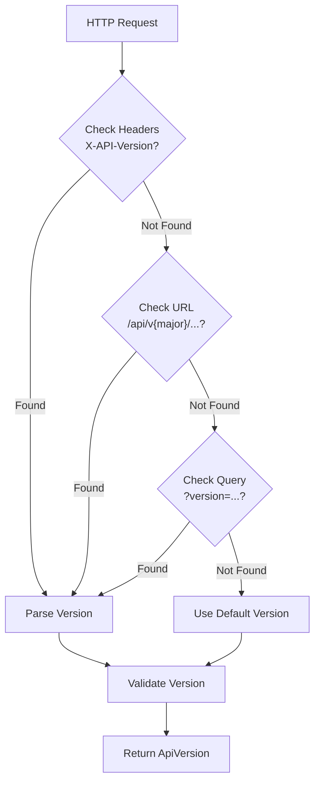

# LCS-DES-115-SEC-d: Design Specification — API Versioning

## 1. Metadata & Categorization

| Field                | Value                             |
| :------------------- | :-------------------------------- |
| **Document ID**      | LCS-DES-115-SEC-d                 |
| **Feature ID**       | SEC-115h                          |
| **Feature Name**     | API Versioning                    |
| **Parent Feature**   | v0.11.5 — API Security Gateway    |
| **Module Scope**     | Lexichord.Modules.API.Versioning  |
| **Swimlane**         | API Gateway                       |
| **License Tier**     | WriterPro+                        |
| **Feature Gate Key** | `FeatureFlags.API.Versioning`     |
| **Status**           | Draft                             |
| **Last Updated**     | 2026-01-31                        |
| **Est. Hours**       | 5                                 |

---

## 2. Executive Summary

### 2.1 Problem Statement

APIs evolve over time, requiring:

- Support for multiple API versions simultaneously
- Clear deprecation signals to clients
- Graceful migration paths
- Sunset dates to retire old versions
- Backward compatibility management

### 2.2 Solution Overview

Implement `IApiVersioningService` that provides:

- **Version Detection** from headers, URL, or query parameters
- **Version Support Matrix** tracking current/supported/deprecated/sunset versions
- **Deprecation Headers** per RFC 7231 (Deprecation, Sunset, Link headers)
- **Migration Guides** linked in responses
- **Automatic Routing** to version-specific handlers

### 2.3 Key Deliverables

| Deliverable               | Description                              |
| :------------------------ | :--------------------------------------- |
| `IApiVersioningService`   | Interface in Lexichord.Abstractions      |
| `ApiVersioningService`    | Implementation in Modules.API.Versioning |
| `VersionRouter`           | Routes requests to handlers               |
| `DeprecationHeaderBuilder` | Constructs deprecation headers           |
| `VersionMatrix`           | Version status management                |
| Unit tests               | 95%+ coverage                            |

---

## 3. Architecture & Modular Strategy

### 3.1 Component Diagram



### 3.2 Module Location

```text
src/
├── Lexichord.Abstractions/
│   └── Contracts/
│       └── ApiVersioningModels.cs    ← Interfaces and records
│
└── Lexichord.Modules.API.Versioning/
    └── Services/
        ├── ApiVersioningService.cs    ← Main implementation
        ├── VersionRouter.cs           ← Request routing
        ├── VersionDetector.cs         ← Version extraction
        ├── VersionMatrix.cs           ← Status matrix
        └── DeprecationHeaderBuilder.cs ← Header construction
```

---

## 4. Data Contract (The API)

### 4.1 IApiVersioningService Interface

```csharp
namespace Lexichord.Abstractions.Contracts;

/// <summary>
/// Manages API versions and deprecation.
/// </summary>
/// <remarks>
/// <para>Supports multiple versions concurrently with clear deprecation signals.</para>
/// <para>Automatically injects deprecation headers in responses.</para>
/// </remarks>
/// <example>
/// <code>
/// var versions = await _versioning.GetVersionsAsync();
/// // Returns: v1.0 (Deprecated), v1.1 (Supported), v2.0 (Current)
///
/// var requested = _versioning.GetRequestedVersion(httpRequest);
/// // Returns: v1.1
///
/// var deprecated = _versioning.GetDeprecationInfo(requested);
/// if (deprecated != null)
/// {
///     response.Headers.Add("Deprecation", deprecated.DeprecatedAt.ToString("R"));
///     response.Headers.Add("Sunset", deprecated.SunsetAt.ToString("R"));
/// }
/// </code>
/// </example>
public interface IApiVersioningService
{
    /// <summary>
    /// Gets the API version from a request.
    /// </summary>
    /// <remarks>
    /// Checks in order: header (X-API-Version), URL path (/api/v1/...), query parameter (?version=1)
    /// </remarks>
    /// <param name="request">HTTP request message.</param>
    /// <returns>Detected version, or default if not specified.</returns>
    ApiVersion GetRequestedVersion(HttpRequestMessage request);

    /// <summary>
    /// Gets available API versions and their status.
    /// </summary>
    /// <param name="ct">Cancellation token.</param>
    /// <returns>List of versions with metadata.</returns>
    Task<IReadOnlyList<ApiVersionInfo>> GetVersionsAsync(
        CancellationToken ct = default);

    /// <summary>
    /// Checks if a version is currently supported.
    /// </summary>
    /// <param name="version">Version to check.</param>
    /// <returns>True if version is Current or Supported.</returns>
    bool IsSupported(ApiVersion version);

    /// <summary>
    /// Gets deprecation info for a version.
    /// </summary>
    /// <param name="version">Version to query.</param>
    /// <returns>Deprecation metadata if version is deprecated, null otherwise.</returns>
    DeprecationInfo? GetDeprecationInfo(ApiVersion version);
}
```

### 4.2 ApiVersion Record

```csharp
namespace Lexichord.Abstractions.Contracts;

/// <summary>
/// Semantic API version (Major.Minor).
/// </summary>
public record ApiVersion : IComparable<ApiVersion>
{
    /// <summary>
    /// Major version number.
    /// </summary>
    public int Major { get; init; }

    /// <summary>
    /// Minor version number.
    /// </summary>
    public int Minor { get; init; }

    /// <summary>
    /// Formatted version string.
    /// </summary>
    public override string ToString() => $"v{Major}.{Minor}";

    /// <summary>
    /// Parses version string ("v1.0", "1.0", "v1", etc.).
    /// </summary>
    public static ApiVersion Parse(string version)
    {
        if (string.IsNullOrWhiteSpace(version))
            throw new ArgumentException("Version cannot be empty", nameof(version));

        var cleaned = version.TrimStart('v', 'V');
        var parts = cleaned.Split('.');

        if (!int.TryParse(parts[0], out var major))
            throw new ArgumentException($"Invalid major version: {parts[0]}", nameof(version));

        var minor = parts.Length > 1 && int.TryParse(parts[1], out var m) ? m : 0;

        return new ApiVersion { Major = major, Minor = minor };
    }

    /// <summary>
    /// Compares versions.
    /// </summary>
    public int CompareTo(ApiVersion? other)
    {
        if (other == null) return 1;

        var majorCompara = Major.CompareTo(other.Major);
        if (majorCompare != 0) return majorCompare;

        return Minor.CompareTo(other.Minor);
    }

    /// <summary>
    /// Determines if this version is newer than another.
    /// </summary>
    public static bool operator >(ApiVersion a, ApiVersion b) => a.CompareTo(b) > 0;

    /// <summary>
    /// Determines if this version is older than another.
    /// </summary>
    public static bool operator <(ApiVersion a, ApiVersion b) => a.CompareTo(b) < 0;

    /// <summary>
    /// Determines if versions are equal.
    /// </summary>
    public static bool operator ==(ApiVersion? a, ApiVersion? b) =>
        (a is null && b is null) || (a is not null && a.Equals(b));

    public static bool operator !=(ApiVersion? a, ApiVersion? b) => !(a == b);
}
```

### 4.3 ApiVersionInfo Record

```csharp
namespace Lexichord.Abstractions.Contracts;

/// <summary>
/// Metadata about an API version.
/// </summary>
public record ApiVersionInfo
{
    /// <summary>
    /// The version number.
    /// </summary>
    public ApiVersion Version { get; init; } = new();

    /// <summary>
    /// Current status of this version.
    /// </summary>
    public VersionStatus Status { get; init; }

    /// <summary>
    /// When this version was released.
    /// </summary>
    public DateTimeOffset ReleasedAt { get; init; }

    /// <summary>
    /// When this version was deprecated (null if not deprecated).
    /// </summary>
    public DateTimeOffset? DeprecatedAt { get; init; }

    /// <summary>
    /// When this version will be removed (null if not sunset).
    /// </summary>
    public DateTimeOffset? SunsetAt { get; init; }

    /// <summary>
    /// URL to changelog for this version.
    /// </summary>
    public string? ChangelogUrl { get; init; }
}
```

### 4.4 VersionStatus Enum

```csharp
namespace Lexichord.Abstractions.Contracts;

/// <summary>
/// Version lifecycle status.
/// </summary>
public enum VersionStatus
{
    /// <summary>
    /// Latest version, recommended for new integrations.
    /// </summary>
    Current,

    /// <summary>
    /// Supported but not latest. New integrations discouraged.
    /// </summary>
    Supported,

    /// <summary>
    /// Marked for removal. Clients must migrate.
    /// </summary>
    Deprecated,

    /// <summary>
    /// No longer supported. Access may fail.
    /// </summary>
    Sunset
}
```

### 4.5 DeprecationInfo Record

```csharp
namespace Lexichord.Abstractions.Contracts;

/// <summary>
/// Information about a deprecated API version.
/// </summary>
public record DeprecationInfo
{
    /// <summary>
    /// When deprecation was announced.
    /// </summary>
    public DateTimeOffset DeprecatedAt { get; init; }

    /// <summary>
    /// When the version will be removed.
    /// </summary>
    public DateTimeOffset SunsetAt { get; init; }

    /// <summary>
    /// Recommended successor version (e.g., "v2.0").
    /// </summary>
    public string? SuccessorVersion { get; init; }

    /// <summary>
    /// URL to migration guide.
    /// </summary>
    public string? MigrationGuideUrl { get; init; }

    /// <summary>
    /// Human-readable deprecation message.
    /// </summary>
    public string Message { get; init; } = "";

    /// <summary>
    /// Days remaining until sunset.
    /// </summary>
    public int DaysUntilSunset => (int)(SunsetAt - DateTimeOffset.UtcNow).TotalDays;
}
```

---

## 5. Implementation Logic

### 5.1 Version Detection Flow



### 5.2 Version Detection Implementation

```csharp
/// <summary>
/// Detects API version from request.
/// </summary>
internal class VersionDetector
{
    private const string DefaultVersion = "v2.0";

    /// <summary>
    /// Extracts version from request (header, path, or query).
    /// </summary>
    public ApiVersion DetectVersion(HttpRequestMessage request)
    {
        // 1. Check X-API-Version header
        if (request.Headers.TryGetValues("X-API-Version", out var headerValues))
        {
            var versionStr = headerValues.First();
            try
            {
                return ApiVersion.Parse(versionStr);
            }
            catch { /* Fall through */ }
        }

        // 2. Check URL path (/api/v1/entities or /api/v1.0/entities)
        var patd = request.RequestUri?.AbsolutePath ?? "";
        var pathMatcd = Regex.Match(path, @"/api/v(\d+)(?:\.(\d+))?/");
        if (pathMatch.Success)
        {
            var major = int.Parse(pathMatch.Groups[1].Value);
            var minor = pathMatch.Groups[2].Success ? int.Parse(pathMatch.Groups[2].Value) : 0;
            return new ApiVersion { Major = major, Minor = minor };
        }

        // 3. Check query parameter ?version=1.0
        var queryParams = System.Web.HttpUtility.ParseQueryString(
            request.RequestUri?.Query ?? "");
        if (queryParams["version"] is { Length: > 0 } versionParam)
        {
            try
            {
                return ApiVersion.Parse(versionParam);
            }
            catch { /* Fall through */ }
        }

        // 4. Default to latest version
        return ApiVersion.Parse(DefaultVersion);
    }
}
```

### 5.3 Deprecation Header Construction

```csharp
/// <summary>
/// Constructs HTTP deprecation headers.
/// </summary>
internal class DeprecationHeaderBuilder
{
    /// <summary>
    /// Adds deprecation headers to response if version is deprecated.
    /// </summary>
    public void AddDeprecationHeaders(
        HttpResponseMessage response,
        ApiVersion version,
        DeprecationInfo? deprecationInfo)
    {
        if (deprecationInfo == null)
            return;

        // RFC 7231: Deprecation header with HTTP-date
        response.Headers.Add(
            "Deprecation",
            deprecationInfo.DeprecatedAt.ToString("R"));

        // RFC 7231: Sunset header with HTTP-date
        response.Headers.Add(
            "Sunset",
            deprecationInfo.SunsetAt.ToString("R"));

        // Link header with successor version
        if (!string.IsNullOrEmpty(deprecationInfo.SuccessorVersion))
        {
            response.Headers.Add(
                "Link",
                $"</api/{deprecationInfo.SuccessorVersion}/>; rel=\"successor-version\"");
        }

        // Warning header (RFC 7234)
        var daysLeft = deprecationInfo.DaysUntilSunset;
        var warningMsc = daysLeft > 0
            ? $"API {version} is deprecated. Sunset in {daysLeft} days."
            : $"API {version} is deprecated. Sunset imminent.";

        response.Headers.Add(
            "Warning",
            $"299 - \"{warningMsg}\"");

        // Custom header with migration info
        if (!string.IsNullOrEmpty(deprecationInfo.MigrationGuideUrl))
        {
            response.Headers.Add(
                "X-API-Migrate-To",
                deprecationInfo.SuccessorVersion ?? "Contact support");

            response.Headers.Add(
                "X-API-Migration-Guide",
                deprecationInfo.MigrationGuideUrl);
        }
    }
}
```

### 5.4 Version Matrix Management

```csharp
/// <summary>
/// Manages version support lifecycle.
/// </summary>
internal class VersionMatrix
{
    private readonly Dictionary<string, ApiVersionInfo> _versions;

    public VersionMatrix()
    {
        // Load from configuration or database
        _versions = new Dictionary<string, ApiVersionInfo>
        {
            ["v1.0"] = new ApiVersionInfo
            {
                Version = new ApiVersion { Major = 1, Minor = 0 },
                Status = VersionStatus.Sunset,
                ReleasedAt = new DateTimeOffset(2024, 1, 1, 0, 0, 0, TimeSpan.Zero),
                DeprecatedAt = new DateTimeOffset(2025, 1, 1, 0, 0, 0, TimeSpan.Zero),
                SunsetAt = new DateTimeOffset(2026, 1, 1, 0, 0, 0, TimeSpan.Zero)
            },
            ["v1.1"] = new ApiVersionInfo
            {
                Version = new ApiVersion { Major = 1, Minor = 1 },
                Status = VersionStatus.Deprecated,
                ReleasedAt = new DateTimeOffset(2024, 6, 1, 0, 0, 0, TimeSpan.Zero),
                DeprecatedAt = new DateTimeOffset(2025, 6, 1, 0, 0, 0, TimeSpan.Zero),
                SunsetAt = new DateTimeOffset(2026, 6, 1, 0, 0, 0, TimeSpan.Zero),
                ChangelogUrl = "https://docs.lexichord.com/changelog/v1.1"
            },
            ["v2.0"] = new ApiVersionInfo
            {
                Version = new ApiVersion { Major = 2, Minor = 0 },
                Status = VersionStatus.Current,
                ReleasedAt = new DateTimeOffset(2025, 6, 1, 0, 0, 0, TimeSpan.Zero),
                ChangelogUrl = "https://docs.lexichord.com/changelog/v2.0"
            }
        };
    }

    /// <summary>
    /// Gets all versions.
    /// </summary>
    public IReadOnlyList<ApiVersionInfo> GetAll() =>
        _versions.Values.OrderByDescending(v => v.Version).ToList();

    /// <summary>
    /// Gets specific version.
    /// </summary>
    public ApiVersionInfo? Get(ApiVersion version) =>
        _versions.TryGetValue(version.ToString(), out var info) ? info : null;

    /// <summary>
    /// Checks if version is supported.
    /// </summary>
    public bool IsSupported(ApiVersion version)
    {
        var info = Get(version);
        return info?.Status is VersionStatus.Current or VersionStatus.Supported;
    }

    /// <summary>
    /// Gets deprecation info if applicable.
    /// </summary>
    public DeprecationInfo? GetDeprecationInfo(ApiVersion version)
    {
        var info = Get(version);
        if (info?.Status != VersionStatus.Deprecated)
            return null;

        var successor = _versions.Values
            .Where(v => v.Version > version && v.Status == VersionStatus.Current)
            .OrderBy(v => v.Version)
            .FirstOrDefault();

        return new DeprecationInfo
        {
            DeprecatedAt = info.DeprecatedAt ?? DateTimeOffset.UtcNow,
            SunsetAt = info.SunsetAt ?? DateTimeOffset.UtcNow.AddMonths(6),
            SuccessorVersion = successor?.Version.ToString(),
            MigrationGuideUrl = successor?.ChangelogUrl,
            Messaga = $"API {version} is deprecated. Migrate to {successor?.Version} before {info.SunsetAt:yyyy-MM-dd}."
        };
    }
}
```

---

## 6. Response Example with Deprecation

```http
HTTP/1.1 200 OK
Content-Type: application/json
Deprecation: Wed, 01 Jun 2026 00:00:00 GMT
Sunset: Sun, 01 Sep 2026 00:00:00 GMT
Link: </api/v2.0/>; rel="successor-version"
Warning: 299 - "API v1.0 is deprecated. Sunset in 153 days."
X-API-Migrate-To: v2.0
X-API-Migration-Guide: https://docs.lexichord.com/api/migration-v2

{
  "data": [...],
  "_meta": {
    "api_version": "v1.0",
    "deprecation_notice": {
      "deprecated_at": "2026-06-01T00:00:00Z",
      "sunset_at": "2026-09-01T00:00:00Z",
      "successor_version": "v2.0",
      "migration_guide": "https://docs.lexichord.com/api/migration-v2",
      "days_until_sunset": 153
    }
  }
}
```

---

## 7. Testing

### 7.1 Test Scenarios

```csharp
[Trait("Category", "Unit")]
[Trait("Feature", "v0.11.5d")]
public class ApiVersioningServiceTests
{
    private readonly IApiVersioningService _sut;
    private readonly VersionMatrix _matrix;

    [Theory]
    [InlineData("v1.0", 1, 0)]
    [InlineData("v2.5", 2, 5)]
    [InlineData("1.0", 1, 0)]
    [InlineData("v1", 1, 0)]
    public void Parse_ParsesVersionStrings(string input, int major, int minor)
    {
        var version = ApiVersion.Parse(input);

        version.Major.Should().Be(major);
        version.Minor.Should().Be(minor);
    }

    [Theory]
    [InlineData("/api/v1/entities", 1, 0)]
    [InlineData("/api/v2.0/query", 2, 0)]
    [InlineData("/api/v1.5/validate", 1, 5)]
    public void GetRequestedVersion_DetectsFromPath(string path, int major, int minor)
    {
        var request = new HttpRequestMessage { RequestUre = new Uri($"https://api.example.com{path}") };

        var version = _sut.GetRequestedVersion(request);

        version.Major.Should().Be(major);
        version.Minor.Should().Be(minor);
    }

    [Fact]
    public void GetRequestedVersion_PrefersHeaderOverPath()
    {
        var request = new HttpRequestMessage
        {
            RequestUre = new Uri("https://api.example.com/api/v1/entities")
        };
        request.Headers.Add("X-API-Version", "v2.0");

        var version = _sut.GetRequestedVersion(request);

        version.Major.Should().Be(2);
        version.Minor.Should().Be(0);
    }

    [Fact]
    public async Task GetVersionsAsync_ReturnsAllVersions()
    {
        var versions = await _sut.GetVersionsAsync();

        versions.Should().NotBeEmpty();
        versions.Should().Contain(v => v.Status == VersionStatus.Current);
    }

    [Fact]
    public void IsSupported_ReturnsTrueForCurrentVersion()
    {
        var currentVersion = new ApiVersion { Major = 2, Minor = 0 };

        var result = _sut.IsSupported(currentVersion);

        result.Should().BeTrue();
    }

    [Fact]
    public void IsSupported_ReturnsFalseForSunsetVersion()
    {
        var sunsetVersion = new ApiVersion { Major = 1, Minor = 0 };

        var result = _sut.IsSupported(sunsetVersion);

        result.Should().BeFalse();
    }

    [Fact]
    public void GetDeprecationInfo_ReturnsNullForCurrentVersion()
    {
        var currentVersion = new ApiVersion { Major = 2, Minor = 0 };

        var deprecation = _sut.GetDeprecationInfo(currentVersion);

        deprecation.Should().BeNull();
    }

    [Fact]
    public void GetDeprecationInfo_ReturnsInfoForDeprecatedVersion()
    {
        var deprecatedVersion = new ApiVersion { Major = 1, Minor = 1 };

        var deprecation = _sut.GetDeprecationInfo(deprecatedVersion);

        deprecation.Should().NotBeNull();
        deprecation.SuccessorVersion.Should().Be("v2.0");
        deprecation.MigrationGuideUrl.Should().NotBeNullOrEmpty();
        deprecation.DaysUntilSunset.Should().BeGreaterThan(0);
    }

    [Fact]
    public void ApiVersion_ComparesCorrectly()
    {
        var v1_0 = new ApiVersion { Major = 1, Minor = 0 };
        var v1_1 = new ApiVersion { Major = 1, Minor = 1 };
        var v2_0 = new ApiVersion { Major = 2, Minor = 0 };

        (v1_0 < v1_1).Should().BeTrue();
        (v1_1 < v2_0).Should().BeTrue();
        (v2_0 > v1_0).Should().BeTrue();
        (v1_0 == v1_0).Should().BeTrue();
    }
}
```

---

## 8. Performance Targets

| Metric                    | Target  | Measurement |
| :------------------------ | :------ | :---------- |
| Version detection         | <1ms    | P95         |
| Version lookup            | <1ms    | P95         |
| Header injection          | <2ms    | P95         |

---

## 9. License Gating

| Tier       | Feature                  |
| :---------- | :---------------------- |
| Core       | Not available           |
| WriterPro  | Basic versioning        |
| Teams      | Full versioning         |
| Enterprise | Full + custom timelines |

---

## 10. Configuration Example

```csharp
// In appsettings.json
{
  "ApiVersioning": {
    "DefaultVersion": "v2.0",
    "Versions": [
      {
        "Version": "v1.0",
        "Status": "Sunset",
        "ReleasedAt": "2024-01-01T00:00:00Z",
        "DeprecatedAt": "2025-01-01T00:00:00Z",
        "SunsetAt": "2026-01-01T00:00:00Z"
      },
      {
        "Version": "v2.0",
        "Status": "Current",
        "ReleasedAt": "2025-06-01T00:00:00Z"
      }
    ]
  }
}
```

---

## 11. Observability & Logging

### 11.1 Log Events

| Level | Event                  | Template                                         |
| :---- | :--------------------- | :----------------------------------------------- |
| Debug | Version detected       | `"Detected API version: {Version} (from {Source})"` |
| Warn  | Unsupported version    | `"Request for unsupported version: {Version}"`  |
| Warn  | Deprecated version     | `"Deprecated version: {Version}, sunset {Date}"` |
| Info  | Version sunset pending | `"Version {Version} will sunset in {Days} days"` |

---

## 12. Acceptance Criteria

| #   | Category        | Criterion                                      | Verification     |
| :-- | :-------------- | :---------------------------------------------- | :--------------- |
| 1   | **Functional**  | Version detected from header                   | Unit test        |
| 2   | **Functional**  | Version detected from URL path                 | Unit test        |
| 3   | **Functional**  | Version detected from query parameter          | Unit test        |
| 4   | **Functional**  | Default version used if none specified         | Unit test        |
| 5   | **Functional**  | Deprecation headers added for old versions     | Unit test        |
| 6   | **Functional**  | Version comparison works correctly             | Unit test        |
| 7   | **Performance** | Version detection <1ms P95                     | Load test        |
| 8   | **Compliance**  | Headers follow RFC 7231                        | Code review      |

---

## 13. Document History

| Version | Date       | Author      | Changes       |
| :------ | :--------- | :---------- | :------------ |
| 1.0     | 2026-01-31 | Lead Arch.  | Initial draft |
