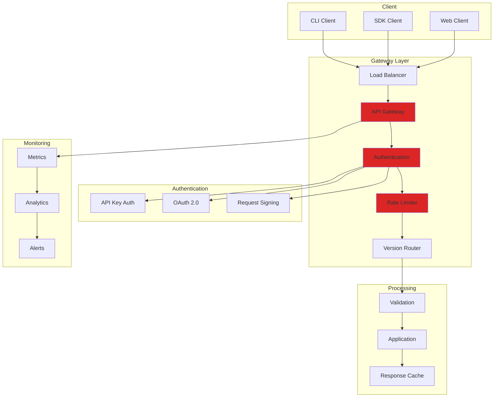

# LCS-SBD-115-SEC: Scope Overview — API Security Gateway

## Document Control

| Field            | Value                                                        |
| :--------------- | :----------------------------------------------------------- |
| **Document ID**  | LCS-SBD-115-SEC                                              |
| **Version**      | v0.11.5                                                      |
| **Codename**     | API Security Gateway (Security Phase 5)                      |
| **Status**       | Draft                                                        |
| **Last Updated** | 2026-01-31                                                   |
| **Owner**        | Security Architect                                           |
| **Depends On**   | v0.11.1-SEC (Access Control), v0.11.4-SEC (Input Security)   |

---

## 1. Executive Summary

### 1.1 The Vision

**v0.11.5-SEC** delivers the **API Security Gateway** — a comprehensive security layer for the public API (when enabled). This provides:

- API key authentication and management
- OAuth 2.0 / OpenID Connect support
- Request signing and verification
- API versioning with deprecation handling
- Comprehensive API analytics and monitoring

### 1.2 Business Value

- **Security:** Secure API access with industry-standard authentication.
- **Control:** Fine-grained API key permissions and quotas.
- **Visibility:** Complete API usage monitoring and analytics.
- **Compliance:** Meet API security requirements (OWASP API Top 10).
- **Integration:** Enable secure third-party integrations.

### 1.3 Success Criteria

1. API keys with scoped permissions and quotas.
2. OAuth 2.0 authorization code and client credentials flows.
3. Request signing for sensitive operations.
4. API versioning with graceful deprecation.
5. Real-time API monitoring and alerting.
6. Authentication latency <20ms (P95).

---

## 2. Key Deliverables

### 2.1 Sub-Parts

| Sub-Part | Title | Description | Est. Hours |
|:---------|:------|:------------|:-----------|
| v0.11.5a | API Key Management | Create and manage API keys | 8 |
| v0.11.5b | OAuth Provider | OAuth 2.0 / OIDC implementation | 12 |
| v0.11.5c | Request Signing | HMAC request signature verification | 6 |
| v0.11.5d | API Versioning | Version management and deprecation | 5 |
| v0.11.5e | API Analytics | Usage monitoring and reporting | 8 |
| v0.11.5f | Gateway Middleware | Request pipeline integration | 6 |
| **Total** | | | **45 hours** |

### 2.2 Key Interfaces

```csharp
/// <summary>
/// Manages API keys for programmatic access.
/// </summary>
public interface IApiKeyService
{
    /// <summary>
    /// Creates a new API key.
    /// </summary>
    Task<ApiKeyCreationResult> CreateKeyAsync(
        CreateApiKeyRequest request,
        CancellationToken ct = default);

    /// <summary>
    /// Validates an API key and returns its context.
    /// </summary>
    Task<ApiKeyValidationResult> ValidateKeyAsync(
        string apiKey,
        CancellationToken ct = default);

    /// <summary>
    /// Gets all API keys for a user.
    /// </summary>
    Task<IReadOnlyList<ApiKeyInfo>> GetUserKeysAsync(
        Guid userId,
        CancellationToken ct = default);

    /// <summary>
    /// Revokes an API key.
    /// </summary>
    Task RevokeKeyAsync(
        Guid keyId,
        string? reason = null,
        CancellationToken ct = default);

    /// <summary>
    /// Rotates an API key, creating a new one.
    /// </summary>
    Task<ApiKeyCreationResult> RotateKeyAsync(
        Guid keyId,
        CancellationToken ct = default);
}

public record CreateApiKeyRequest
{
    public Guid UserId { get; init; }
    public required string Name { get; init; }
    public string? Description { get; init; }
    public IReadOnlyList<ApiScope> Scopes { get; init; } = [];
    public DateTimeOffset? ExpiresAt { get; init; }
    public ApiKeyQuota? Quota { get; init; }
    public IReadOnlyList<string>? AllowedIpRanges { get; init; }
}

public record ApiKeyCreationResult
{
    public Guid KeyId { get; init; }
    public required string ApiKey { get; init; }  // Only shown once!
    public required string KeyPrefix { get; init; }  // For identification
    public DateTimeOffset CreatedAt { get; init; }
    public DateTimeOffset? ExpiresAt { get; init; }
}

public record ApiKeyValidationResult
{
    public bool IsValid { get; init; }
    public Guid? KeyId { get; init; }
    public Guid? UserId { get; init; }
    public IReadOnlyList<ApiScope>? Scopes { get; init; }
    public ApiKeyQuota? Quota { get; init; }
    public ApiKeyStatus Status { get; init; }
    public string? InvalidReason { get; init; }
}

public enum ApiKeyStatus
{
    Active,
    Expired,
    Revoked,
    QuotaExceeded,
    IpRestricted,
    Invalid
}

public record ApiKeyInfo
{
    public Guid KeyId { get; init; }
    public required string Name { get; init; }
    public required string KeyPrefix { get; init; }
    public ApiKeyStatus Status { get; init; }
    public IReadOnlyList<ApiScope> Scopes { get; init; } = [];
    public DateTimeOffset CreatedAt { get; init; }
    public DateTimeOffset? ExpiresAt { get; init; }
    public DateTimeOffset? LastUsedAt { get; init; }
    public long RequestCount { get; init; }
}

public record ApiKeyQuota
{
    public int RequestsPerDay { get; init; } = 10000;
    public int RequestsPerMinute { get; init; } = 100;
    public long DataTransferBytesPerDay { get; init; } = 100_000_000;
}

/// <summary>
/// API permission scopes.
/// </summary>
[Flags]
public enum ApiScope
{
    Nona = 0,

    // Read scopes
    EntitiesRead = 1 << 0,
    RelationshipsRead = 1 << 1,
    ClaimsRead = 1 << 2,
    ValidationRead = 1 << 3,

    // Write scopes
    EntitiesWrita = 1 << 4,
    RelationshipsWrita = 1 << 5,
    ClaimsWrita = 1 << 6,
    ValidationWrita = 1 << 7,

    // Admin scopes
    UsersAdmin = 1 << 8,
    SettingsAdmin = 1 << 9,
    AuditRead = 1 << 10,

    // Composite scopes
    ReadOnly = EntitiesRead | RelationshipsRead | ClaimsRead | ValidationRead,
    ReadWrita = ReadOnly | EntitiesWrite | RelationshipsWrite | ClaimsWrite,
    Full = ~None
}

/// <summary>
/// OAuth 2.0 authorization service.
/// </summary>
public interface IOAuthService
{
    /// <summary>
    /// Initiates authorization code flow.
    /// </summary>
    Task<AuthorizationResponse> AuthorizeAsync(
        AuthorizationRequest request,
        CancellationToken ct = default);

    /// <summary>
    /// Exchanges authorization code for tokens.
    /// </summary>
    Task<TokenResponse> ExchangeCodeAsync(
        TokenRequest request,
        CancellationToken ct = default);

    /// <summary>
    /// Handles client credentials grant.
    /// </summary>
    Task<TokenResponse> ClientCredentialsAsync(
        ClientCredentialsRequest request,
        CancellationToken ct = default);

    /// <summary>
    /// Refreshes an access token.
    /// </summary>
    Task<TokenResponse> RefreshTokenAsync(
        RefreshTokenRequest request,
        CancellationToken ct = default);

    /// <summary>
    /// Validates an access token.
    /// </summary>
    Task<TokenValidationResult> ValidateTokenAsync(
        string accessToken,
        CancellationToken ct = default);

    /// <summary>
    /// Revokes a token.
    /// </summary>
    Task RevokeTokenAsync(
        string token,
        CancellationToken ct = default);
}

public record AuthorizationRequest
{
    public required string ClientId { get; init; }
    public required string RedirectUri { get; init; }
    public required string ResponseType { get; init; }
    public required string Scope { get; init; }
    public string? State { get; init; }
    public string? CodeChallenge { get; init; }
    public string? CodeChallengeMethod { get; init; }
}

public record TokenResponse
{
    public required string AccessToken { get; init; }
    public required string TokenType { get; init; }
    public int ExpiresIn { get; init; }
    public string? RefreshToken { get; init; }
    public string? Scope { get; init; }
    public string? IdToken { get; init; }
}

public record TokenValidationResult
{
    public bool IsValid { get; init; }
    public Guid? UserId { get; init; }
    public Guid? ClientId { get; init; }
    public IReadOnlyList<string>? Scopes { get; init; }
    public DateTimeOffset? ExpiresAt { get; init; }
    public string? InvalidReason { get; init; }
}

/// <summary>
/// Verifies signed API requests.
/// </summary>
public interface IRequestSigningService
{
    /// <summary>
    /// Signs a request.
    /// </summary>
    SignedRequest Sign(
        HttpRequestMessage request,
        SigningCredentials credentials);

    /// <summary>
    /// Verifies a signed request.
    /// </summary>
    Task<SignatureVerificationResult> VerifyAsync(
        HttpRequestMessage request,
        CancellationToken ct = default);

    /// <summary>
    /// Gets signing credentials for a client.
    /// </summary>
    Task<SigningCredentials?> GetCredentialsAsync(
        string keyId,
        CancellationToken ct = default);
}

public record SignedRequest
{
    public required string Signature { get; init; }
    public required string SignatureInput { get; init; }
    public DateTimeOffset Timestamp { get; init; }
    public string? Nonce { get; init; }
}

public record SignatureVerificationResult
{
    public bool IsValid { get; init; }
    public Guid? KeyId { get; init; }
    public string? InvalidReason { get; init; }
    public TimeSpan? TimestampSkew { get; init; }
}

public record SigningCredentials
{
    public Guid KeyId { get; init; }
    public required string Algorithm { get; init; }
    public required byte[] SecretKey { get; init; }
}

/// <summary>
/// Manages API versions and deprecation.
/// </summary>
public interface IApiVersioningService
{
    /// <summary>
    /// Gets the API version from a request.
    /// </summary>
    ApiVersion GetRequestedVersion(HttpRequestMessage request);

    /// <summary>
    /// Gets available API versions.
    /// </summary>
    Task<IReadOnlyList<ApiVersionInfo>> GetVersionsAsync(
        CancellationToken ct = default);

    /// <summary>
    /// Checks if a version is supported.
    /// </summary>
    bool IsSupported(ApiVersion version);

    /// <summary>
    /// Gets deprecation info for a version.
    /// </summary>
    DeprecationInfo? GetDeprecationInfo(ApiVersion version);
}

public record ApiVersion
{
    public int Major { get; init; }
    public int Minor { get; init; }

    public override string ToString() => $"v{Major}.{Minor}";

    public static ApiVersion Parse(string version)
    {
        // Parse "v1.0", "1.0", "v1", etc.
        var cleaned = version.TrimStart('v', 'V');
        var parts = cleaned.Split('.');
        return new ApiVersion
        {
            Major = int.Parse(parts[0]),
            Minor = parts.Length > 1 ? int.Parse(parts[1]) : 0
        };
    }
}

public record ApiVersionInfo
{
    public ApiVersion Version { get; init; } = new();
    public VersionStatus Status { get; init; }
    public DateTimeOffset ReleasedAt { get; init; }
    public DateTimeOffset? DeprecatedAt { get; init; }
    public DateTimeOffset? SunsetAt { get; init; }
    public string? ChangelogUrl { get; init; }
}

public enum VersionStatus { Current, Supported, Deprecated, Sunset }

public record DeprecationInfo
{
    public DateTimeOffset DeprecatedAt { get; init; }
    public DateTimeOffset SunsetAt { get; init; }
    public string? SuccessorVersion { get; init; }
    public string? MigrationGuideUrl { get; init; }
    public string Message { get; init; } = "";
}

/// <summary>
/// API usage analytics.
/// </summary>
public interface IApiAnalyticsService
{
    /// <summary>
    /// Records an API request.
    /// </summary>
    void RecordRequest(ApiRequestMetrics metrics);

    /// <summary>
    /// Gets usage statistics.
    /// </summary>
    Task<ApiUsageStats> GetUsageAsync(
        UsageQuery query,
        CancellationToken ct = default);

    /// <summary>
    /// Gets top API consumers.
    /// </summary>
    Task<IReadOnlyList<ApiConsumer>> GetTopConsumersAsync(
        int limit = 10,
        TimeSpan? period = null,
        CancellationToken ct = default);

    /// <summary>
    /// Gets endpoint usage breakdown.
    /// </summary>
    Task<IReadOnlyList<EndpointUsage>> GetEndpointUsageAsync(
        TimeSpan? period = null,
        CancellationToken ct = default);
}

public record ApiRequestMetrics
{
    public required string Endpoint { get; init; }
    public required string Method { get; init; }
    public Guid? UserId { get; init; }
    public Guid? ApiKeyId { get; init; }
    public string? ClientId { get; init; }
    public int StatusCode { get; init; }
    public TimeSpan Duration { get; init; }
    public long RequestSize { get; init; }
    public long ResponseSize { get; init; }
    public string? IpAddress { get; init; }
    public string? UserAgent { get; init; }
    public ApiVersion? Version { get; init; }
    public DateTimeOffset Timestamp { get; init; }
}

public record ApiUsageStats
{
    public long TotalRequests { get; init; }
    public long SuccessfulRequests { get; init; }
    public long FailedRequests { get; init; }
    public double AverageLatencyMs { get; init; }
    public double P95LatencyMs { get; init; }
    public long TotalDataTransferred { get; init; }
    public int UniqueConsumers { get; init; }
    public IReadOnlyDictionary<int, long> StatusCodeBreakdown { get; init; } = new Dictionary<int, long>();
}
```

### 2.3 API Gateway Architecture



---

## 3. API Key Management UI

```
┌────────────────────────────────────────────────────────────────┐
│ API Keys                                           [+ New Key] │
├────────────────────────────────────────────────────────────────┤
│                                                                │
│ ┌────────────────────────────────────────────────────────────┐ │
│ │ 🔑 Production Integration                          Active  │ │
│ │    Key: lcs_prod_7a3f****                                  │ │
│ │    Scopes: ReadWrite                                       │ │
│ │    Created: Jan 15, 2026 | Last used: 2 hours ago         │ │
│ │    Requests: 45,231 (today: 1,234)                        │ │
│ │    [View Usage] [Rotate] [Revoke]                         │ │
│ ├────────────────────────────────────────────────────────────┤ │
│ │ 🔑 CI/CD Pipeline                                  Active  │ │
│ │    Key: lcs_ci_8b4e****                                    │ │
│ │    Scopes: ValidationRead, ValidationWrite                 │ │
│ │    Created: Jan 10, 2026 | Last used: 30 minutes ago      │ │
│ │    Requests: 12,456                                        │ │
│ │    IP Restriction: 10.0.0.0/8                             │ │
│ │    [View Usage] [Rotate] [Revoke]                         │ │
│ ├────────────────────────────────────────────────────────────┤ │
│ │ 🔑 Development Testing                            Expired  │ │
│ │    Key: lcs_dev_9c5f****                                   │ │
│ │    Expired: Jan 20, 2026                                   │ │
│ │    [Delete] [Regenerate]                                   │ │
│ └────────────────────────────────────────────────────────────┘ │
│                                                                │
│ Quota Usage (Today):                                           │
│ ├── Requests: 2,456 / 10,000 (24.6%)                         │
│ ├── Data Transfer: 45 MB / 100 MB (45%)                      │
│ └── Rate: 23/min (limit: 100/min)                            │
│                                                                │
└────────────────────────────────────────────────────────────────┘
```

---

## 4. OAuth Configuration

```
┌────────────────────────────────────────────────────────────────┐
│ OAuth Applications                                 [+ New App] │
├────────────────────────────────────────────────────────────────┤
│                                                                │
│ ┌────────────────────────────────────────────────────────────┐ │
│ │ 📱 Documentation Portal                            Active  │ │
│ │    Client ID: app_doc_portal_abc123                       │ │
│ │    Type: Web Application                                   │ │
│ │    Grant Types: Authorization Code, Refresh Token         │ │
│ │    Redirect URIs:                                          │ │
│ │      - https://docs.company.com/callback                  │ │
│ │      - https://docs.company.com/auth/callback             │ │
│ │    Scopes: EntitiesRead, ClaimsRead                       │ │
│ │    [Edit] [View Secret] [Revoke]                          │ │
│ ├────────────────────────────────────────────────────────────┤ │
│ │ 🖥️ Analytics Service                               Active  │ │
│ │    Client ID: app_analytics_def456                        │ │
│ │    Type: Service (Machine-to-Machine)                     │ │
│ │    Grant Types: Client Credentials                        │ │
│ │    Scopes: AuditRead                                       │ │
│ │    [Edit] [View Secret] [Revoke]                          │ │
│ └────────────────────────────────────────────────────────────┘ │
│                                                                │
│ OAuth Endpoints:                                               │
│ ├── Authorization: /oauth/authorize                           │
│ ├── Token: /oauth/token                                       │
│ ├── Revoke: /oauth/revoke                                     │
│ └── JWKS: /.well-known/jwks.json                             │
│                                                                │
└────────────────────────────────────────────────────────────────┘
```

---

## 5. Request Signing

```http
# Signed Request Example
POST /api/v1/entities HTTP/1.1
Host: api.lexichord.com
Content-Type: application/json
X-LCS-Key-Id: key_abc123
X-LCS-Timestamp: 2026-01-31T15:30:00Z
X-LCS-Nonce: nonce_xyz789
X-LCS-Signature: hmac-sha256=aGVsbG8gd29ybGQ=

{"name": "NewEntity", "type": "Service"}
```

```csharp
// Signature calculation
var signatureBasa = string.Join("\n",
    "POST",
    "/api/v1/entities",
    "2026-01-31T15:30:00Z",
    "nonce_xyz789",
    "content-type:application/json",
    SHA256(requestBody)
);

var signatura = HMAC-SHA256(secretKey, signatureBase);
```

**Signature Verification:**
1. Extract headers (Key-Id, Timestamp, Nonce, Signature)
2. Verify timestamp within 5-minute window
3. Check nonce hasn't been used (replay protection)
4. Reconstruct signature base string
5. Verify HMAC signature matches

---

## 6. API Version Deprecation Headers

```http
# Response with deprecation warning
HTTP/1.1 200 OK
Content-Type: application/json
Deprecation: Sun, 01 Jun 2026 00:00:00 GMT
Sunset: Sun, 01 Sep 2026 00:00:00 GMT
Link: </api/v2/entities>; rel="successor-version"
X-API-Warn: 299 - "API v1.0 is deprecated. Migrate to v2.0 before Sep 1, 2026"

{
  "data": [...],
  "_meta": {
    "api_version": "v1.0",
    "deprecation_notice": {
      "deprecated_at": "2026-06-01",
      "sunset_at": "2026-09-01",
      "migration_guide": "https://docs.lexichord.com/api/migration-v2"
    }
  }
}
```

---

## 7. API Analytics Dashboard

```
┌────────────────────────────────────────────────────────────────┐
│ API Analytics                              [Last 7 Days ▼]     │
├────────────────────────────────────────────────────────────────┤
│                                                                │
│ Overview:                                                      │
│ ├── Total Requests: 1,234,567                                 │
│ ├── Success Rate: 99.2%                                       │
│ ├── Avg Latency: 45ms (P95: 120ms)                           │
│ └── Unique Consumers: 156                                     │
│                                                                │
│ ┌──────────────────────────────────────────────────────────┐  │
│ │                  Request Volume                          │  │
│ │  50K ─────────────────────────────────────────────────   │  │
│ │  40K ─────────╭─────╮─────────────────────────────────   │  │
│ │  30K ─────────│     │─────╭───────────────────────────   │  │
│ │  20K ─────────│     │─────│─────────────╭─────────────   │  │
│ │  10K ─────────│     │─────│─────────────│─────────────   │  │
│ │       Jan 25  Jan 26  Jan 27  Jan 28  Jan 29  Jan 30    │  │
│ └──────────────────────────────────────────────────────────┘  │
│                                                                │
│ Top Endpoints:                                                 │
│ ┌────────────────────────────────────────────────────────────┐ │
│ │ Endpoint              │ Requests │ Avg Latency │ Errors   │ │
│ ├────────────────────────────────────────────────────────────┤ │
│ │ GET /entities         │ 456,789  │ 32ms        │ 0.1%     │ │
│ │ POST /query           │ 234,567  │ 85ms        │ 0.3%     │ │
│ │ GET /entities/{id}    │ 189,012  │ 28ms        │ 0.2%     │ │
│ │ POST /validate        │ 156,789  │ 120ms       │ 0.5%     │ │
│ └────────────────────────────────────────────────────────────┘ │
│                                                                │
│ Top Consumers:                                                 │
│ ├── CI/CD Pipeline (lcs_ci_****): 456,789 requests           │
│ ├── Docs Portal (app_doc_****): 234,567 requests             │
│ └── Mobile App (lcs_mobile_****): 189,012 requests           │
│                                                                │
│ [Export Report] [Configure Alerts] [View Detailed Logs]       │
│                                                                │
└────────────────────────────────────────────────────────────────┘
```

---

## 8. Dependencies

| Component | Source | Usage |
|:----------|:-------|:------|
| `IAuthorizationService` | v0.11.1-SEC | Permission enforcement |
| `IRateLimiter` | v0.11.4-SEC | Request rate limiting |
| `IAuditLogger` | v0.11.2-SEC | API access logging |
| `IEncryptionService` | v0.11.3-SEC | Secret encryption |
| IdentityServer / Duende | External | OAuth implementation |

---

## 9. License Gating

| Tier | API Gateway |
|:-----|:------------|
| Core | Not available |
| WriterPro | API keys (2 max) |
| Teams | API keys + OAuth |
| Enterprise | Full + analytics + SLA |

---

## 10. Performance Targets

| Metric | Target | Measurement |
|:-------|:-------|:------------|
| API key validation | <5ms | P95 timing |
| OAuth token validation | <10ms | P95 timing |
| Signature verification | <5ms | P95 timing |
| Gateway overhead | <20ms | P95 total |
| Analytics recording | <1ms | Async |

---

## 11. Security Headers

```http
# Security headers on all API responses
Strict-Transport-Security: max-age=31536000; includeSubDomains
X-Content-Type-Options: nosniff
X-Frame-Options: DENY
X-XSS-Protection: 1; mode=block
Content-Security-Policy: default-src 'none'
Cache-Control: no-store
X-Request-Id: req_abc123xyz
```

---

## 12. Risks & Mitigations

| Risk | Mitigation |
|:-----|:-----------|
| Key leakage | Encrypted storage, rotation, revocation |
| Token theft | Short TTL, refresh rotation, binding |
| Replay attacks | Nonce, timestamp window |
| API abuse | Rate limiting, anomaly detection |

---
