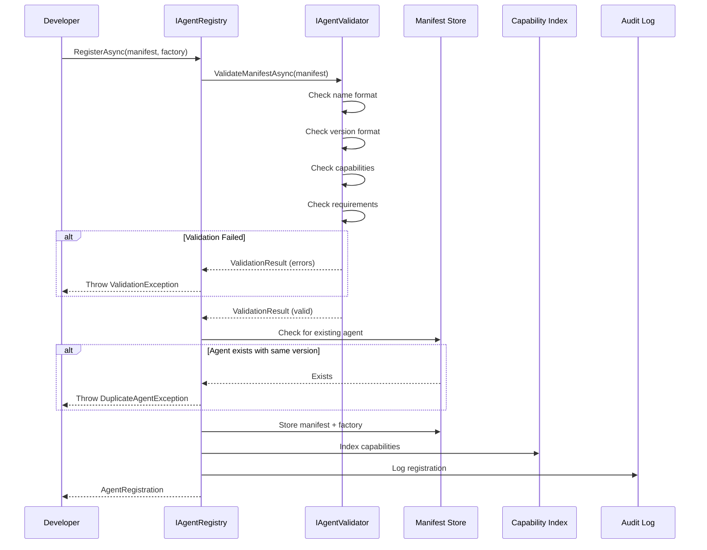
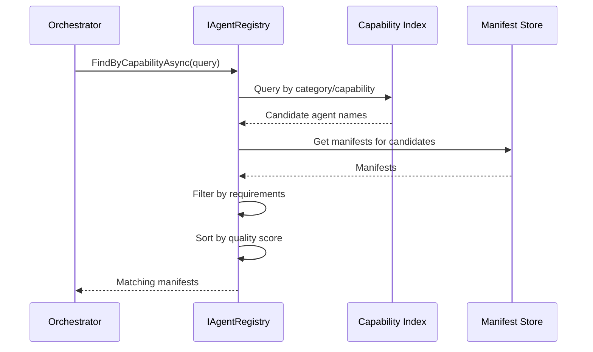

# LCS-SBD-121-AGT: Scope Overview — Agent Definition Model

## Document Control

| Field            | Value                                                        |
| :--------------- | :----------------------------------------------------------- |
| **Document ID**  | LCS-SBD-121-AGT                                              |
| **Version**      | v0.12.1                                                      |
| **Codename**     | Agent Definition Model (Agent Infrastructure Phase 1)        |
| **Status**       | Draft                                                        |
| **Last Updated** | 2026-01-31                                                   |
| **Owner**        | Agent Architecture Lead                                      |
| **Depends On**   | v0.11.1 (Authorization), v0.6.1a (LLM Integration)           |

---

## 1. Executive Summary

### 1.1 The Vision

**v0.12.1-AGT** delivers **Agent Definition Model** — the foundational schema and contracts that define what an agent is in Lexichord. This establishes:

- A universal contract (`IAgent`) that all agents must implement
- Declarative manifests describing agent capabilities and requirements
- A registry for discovering and managing agent definitions
- Validation ensuring agents meet platform requirements

This is the cornerstone of the entire agent infrastructure—without clear definitions, orchestration is impossible.

### 1.2 Business Value

- **Standardization:** Common interface enables interoperability between agents.
- **Discovery:** Capability-based agent discovery for intelligent task routing.
- **Safety:** Declared requirements prevent runtime failures.
- **Extensibility:** Third-party agents can integrate seamlessly.
- **Governance:** Clear contracts enable policy enforcement.

### 1.3 Success Criteria

1. All agents implement `IAgent` with consistent behavior.
2. Agent manifests fully describe capabilities and requirements.
3. Registry supports CRUD operations with <50ms latency.
4. Capability-based search returns results in <100ms.
5. Validation catches 100% of manifest errors before registration.
6. Built-in agents demonstrate all agent types.

---

## 2. Key Deliverables

### 2.1 Sub-Parts

| Sub-Part | Title | Description | Est. Hours |
|:---------|:------|:------------|:-----------|
| v0.12.1a | Agent Schema & Contracts | Core `IAgent` interface and related types | 8 |
| v0.12.1b | Capability Declaration | System for declaring and querying capabilities | 8 |
| v0.12.1c | Agent Configuration | Configuration schema and binding | 6 |
| v0.12.1d | Agent Registry | Storage and retrieval of agent definitions | 10 |
| v0.12.1e | Agent Validation | Manifest and runtime validation | 8 |
| v0.12.1f | Agent Definition UI | UI for browsing and managing agents | 8 |
| **Total** | | | **48 hours** |

### 2.2 Core Interfaces

```csharp
/// <summary>
/// The fundamental contract for all Lexichord agents.
/// Every agent—built-in, custom, or third-party—must implement this interface.
/// </summary>
public interface IAgent
{
    /// <summary>
    /// Unique identifier for this agent instance.
    /// </summary>
    AgentId Id { get; }

    /// <summary>
    /// Declarative manifest describing this agent's capabilities.
    /// </summary>
    AgentManifest Manifest { get; }

    /// <summary>
    /// Current operational state.
    /// </summary>
    AgentState State { get; }

    /// <summary>
    /// Process a request and return a response.
    /// This is the primary execution entry point.
    /// </summary>
    Task<AgentResponse> ProcessAsync(
        AgentRequest request,
        CancellationToken ct = default);

    /// <summary>
    /// Initialize the agent with its context.
    /// Called once after construction, before any ProcessAsync calls.
    /// </summary>
    Task InitializeAsync(
        AgentContext context,
        CancellationToken ct = default);

    /// <summary>
    /// Gracefully shutdown the agent.
    /// Called when the agent is being terminated.
    /// </summary>
    Task ShutdownAsync(
        ShutdownReason reason,
        CancellationToken ct = default);
}

/// <summary>
/// Immutable identifier for an agent instance.
/// </summary>
public readonly record struct AgentId
{
    public Guid Value { get; }

    public AgentId(Guid value)
    {
        if (value == Guid.Empty)
            throw new ArgumentException("AgentId cannot be empty", nameof(value));
        Value = value;
    }

    public static AgentId New() => new(Guid.NewGuid());

    public static AgentId Parse(string s) => new(Guid.Parse(s));

    public static bool TryParse(string s, out AgentId result)
    {
        if (Guid.TryParse(s, out var guid))
        {
            result = new AgentId(guid);
            return true;
        }
        result = default;
        return false;
    }

    public override string ToString() => $"agent:{Value:N}";

    public static implicit operator Guid(AgentId id) => id.Value;
}

/// <summary>
/// The operational state of an agent.
/// </summary>
public enum AgentState
{
    /// <summary>Agent is being created and initialized.</summary>
    Initializing,

    /// <summary>Agent is ready to accept requests.</summary>
    Ready,

    /// <summary>Agent is currently processing a request.</summary>
    Processing,

    /// <summary>Agent is waiting for external input or resources.</summary>
    Waiting,

    /// <summary>Agent has been paused by the system or user.</summary>
    Suspended,

    /// <summary>Agent is shutting down gracefully.</summary>
    Terminating,

    /// <summary>Agent has been terminated.</summary>
    Terminated,

    /// <summary>Agent has encountered an unrecoverable error.</summary>
    Failed
}

/// <summary>
/// Reasons for agent shutdown.
/// </summary>
public enum ShutdownReason
{
    /// <summary>Normal completion of work.</summary>
    Completed,

    /// <summary>User or system requested shutdown.</summary>
    Requested,

    /// <summary>Timeout exceeded.</summary>
    Timeout,

    /// <summary>Resource limits exceeded.</summary>
    ResourceLimit,

    /// <summary>Unrecoverable error.</summary>
    Error,

    /// <summary>System is shutting down.</summary>
    SystemShutdown,

    /// <summary>Parent agent terminated.</summary>
    ParentTerminated
}
```

### 2.3 Agent Manifest

```csharp
/// <summary>
/// Declarative manifest describing an agent's identity, capabilities, and requirements.
/// This is the "contract" that an agent publishes to the system.
/// </summary>
public record AgentManifest
{
    /// <summary>
    /// Unique name for this agent type (e.g., "chronicler", "scribe", "validator").
    /// Must be lowercase, alphanumeric with hyphens.
    /// </summary>
    public required string Name { get; init; }

    /// <summary>
    /// Semantic version of this agent (e.g., "1.2.3").
    /// </summary>
    public required string Version { get; init; }

    /// <summary>
    /// Human-readable display name.
    /// </summary>
    public string? DisplayName { get; init; }

    /// <summary>
    /// Detailed description of what this agent does.
    /// </summary>
    public string? Description { get; init; }

    /// <summary>
    /// The behavioral type of this agent.
    /// </summary>
    public AgentType Type { get; init; } = AgentType.Task;

    /// <summary>
    /// Capabilities this agent provides to the system.
    /// Used for capability-based routing.
    /// </summary>
    public IReadOnlyList<AgentCapability> Capabilities { get; init; } = [];

    /// <summary>
    /// What this agent needs to function.
    /// </summary>
    public AgentRequirements Requirements { get; init; } = new();

    /// <summary>
    /// Schema for inputs this agent accepts.
    /// </summary>
    public AgentIOSchema? InputSchema { get; init; }

    /// <summary>
    /// Schema for outputs this agent produces.
    /// </summary>
    public AgentIOSchema? OutputSchema { get; init; }

    /// <summary>
    /// Behavioral constraints and limits.
    /// </summary>
    public AgentConstraints Constraints { get; init; } = new();

    /// <summary>
    /// Metadata tags for categorization and search.
    /// </summary>
    public IReadOnlyDictionary<string, string> Tags { get; init; } =
        new Dictionary<string, string>();

    /// <summary>
    /// Author or publisher of this agent.
    /// </summary>
    public string? Author { get; init; }

    /// <summary>
    /// License under which this agent is distributed.
    /// </summary>
    public string? License { get; init; }

    /// <summary>
    /// URL for documentation or homepage.
    /// </summary>
    public Uri? HomepageUrl { get; init; }

    /// <summary>
    /// URL for source repository.
    /// </summary>
    public Uri? RepositoryUrl { get; init; }
}

/// <summary>
/// The behavioral type of an agent.
/// Determines how the orchestrator interacts with it.
/// </summary>
public enum AgentType
{
    /// <summary>
    /// Executes a single, well-defined task and returns.
    /// Examples: "summarize this document", "extract entities"
    /// </summary>
    Task,

    /// <summary>
    /// Maintains state across multiple turns of conversation.
    /// Examples: chat assistant, interactive editor
    /// </summary>
    Conversational,

    /// <summary>
    /// Responds to events rather than explicit requests.
    /// Examples: file watcher, CI/CD trigger handler
    /// </summary>
    Reactive,

    /// <summary>
    /// Self-directed agent that pursues goals autonomously.
    /// Examples: research agent, documentation crawler
    /// </summary>
    Autonomous,

    /// <summary>
    /// Manages and coordinates other agents.
    /// Examples: orchestrator, task decomposer
    /// </summary>
    Supervisor
}
```

### 2.4 Capability System

```csharp
/// <summary>
/// Declares a specific capability that an agent provides.
/// Capabilities are the unit of agent discovery and routing.
/// </summary>
public record AgentCapability
{
    /// <summary>
    /// Unique identifier for this capability (e.g., "text-summarization").
    /// </summary>
    public required string Id { get; init; }

    /// <summary>
    /// Human-readable name.
    /// </summary>
    public required string Name { get; init; }

    /// <summary>
    /// Description of what this capability does.
    /// </summary>
    public string? Description { get; init; }

    /// <summary>
    /// Category for grouping related capabilities.
    /// </summary>
    public CapabilityCategory Category { get; init; }

    /// <summary>
    /// Input content types this capability accepts.
    /// </summary>
    public IReadOnlyList<string> InputTypes { get; init; } = [];

    /// <summary>
    /// Output content types this capability produces.
    /// </summary>
    public IReadOnlyList<string> OutputTypes { get; init; } = [];

    /// <summary>
    /// Self-reported quality score (0.0-1.0).
    /// Used to prefer higher-quality agents when multiple match.
    /// </summary>
    public float QualityScore { get; init; } = 0.8f;

    /// <summary>
    /// Additional metadata about this capability.
    /// </summary>
    public IReadOnlyDictionary<string, object>? Metadata { get; init; }
}

/// <summary>
/// Categories for grouping capabilities.
/// </summary>
public enum CapabilityCategory
{
    /// <summary>Generate new text content.</summary>
    TextGeneration,

    /// <summary>Analyze and extract from text.</summary>
    TextAnalysis,

    /// <summary>Generate code in various languages.</summary>
    CodeGeneration,

    /// <summary>Analyze and understand code.</summary>
    CodeAnalysis,

    /// <summary>Extract structured data from unstructured sources.</summary>
    DataExtraction,

    /// <summary>Transform data between formats.</summary>
    DataTransformation,

    /// <summary>Gather information from various sources.</summary>
    Research,

    /// <summary>Validate content against rules.</summary>
    Validation,

    /// <summary>Translate between languages.</summary>
    Translation,

    /// <summary>Create summaries of content.</summary>
    Summarization,

    /// <summary>Plan and decompose tasks.</summary>
    Planning,

    /// <summary>Execute actions in external systems.</summary>
    Execution,

    /// <summary>Review and provide feedback.</summary>
    Review,

    /// <summary>Format and style content.</summary>
    Formatting
}

/// <summary>
/// Query for finding agents by capability.
/// </summary>
public record CapabilityQuery
{
    /// <summary>
    /// Required capability categories.
    /// </summary>
    public IReadOnlyList<CapabilityCategory>? Categories { get; init; }

    /// <summary>
    /// Required capability IDs.
    /// </summary>
    public IReadOnlyList<string>? CapabilityIds { get; init; }

    /// <summary>
    /// Required input types.
    /// </summary>
    public IReadOnlyList<string>? InputTypes { get; init; }

    /// <summary>
    /// Required output types.
    /// </summary>
    public IReadOnlyList<string>? OutputTypes { get; init; }

    /// <summary>
    /// Minimum quality score.
    /// </summary>
    public float? MinQualityScore { get; init; }

    /// <summary>
    /// Free-text search across name and description.
    /// </summary>
    public string? SearchText { get; init; }
}
```

### 2.5 Requirements and Constraints

```csharp
/// <summary>
/// What an agent needs to function.
/// The system validates these requirements can be met before spawning.
/// </summary>
public record AgentRequirements
{
    /// <summary>
    /// LLM requirements (model, context window, etc.).
    /// </summary>
    public LLMRequirements? LLM { get; init; }

    /// <summary>
    /// Memory requirements.
    /// </summary>
    public MemoryRequirements? Memory { get; init; }

    /// <summary>
    /// Tools this agent needs access to.
    /// </summary>
    public IReadOnlyList<string> RequiredTools { get; init; } = [];

    /// <summary>
    /// Permissions this agent needs.
    /// </summary>
    public IReadOnlyList<Permission> RequiredPermissions { get; init; } = [];

    /// <summary>
    /// Maximum time this agent should be allowed to run.
    /// </summary>
    public TimeSpan? MaxExecutionTime { get; init; }

    /// <summary>
    /// Maximum tokens this agent should consume.
    /// </summary>
    public int? MaxTokenBudget { get; init; }

    /// <summary>
    /// Other agents this agent depends on.
    /// </summary>
    public IReadOnlyList<string>? RequiredAgents { get; init; }

    /// <summary>
    /// External services this agent needs.
    /// </summary>
    public IReadOnlyList<string>? RequiredServices { get; init; }
}

/// <summary>
/// LLM-specific requirements.
/// </summary>
public record LLMRequirements
{
    /// <summary>
    /// Supported LLM providers (e.g., "anthropic", "openai").
    /// Empty means any provider is acceptable.
    /// </summary>
    public IReadOnlyList<string> SupportedProviders { get; init; } = [];

    /// <summary>
    /// Minimum context window size in tokens.
    /// </summary>
    public int? MinContextWindow { get; init; }

    /// <summary>
    /// Whether the agent needs vision/image capabilities.
    /// </summary>
    public bool RequiresVision { get; init; }

    /// <summary>
    /// Whether the agent needs tool use capabilities.
    /// </summary>
    public bool RequiresToolUse { get; init; }

    /// <summary>
    /// Whether the agent needs streaming responses.
    /// </summary>
    public bool RequiresStreaming { get; init; }

    /// <summary>
    /// Specific model requirements (e.g., "claude-3-opus" minimum).
    /// </summary>
    public string? MinimumModel { get; init; }
}

/// <summary>
/// Memory requirements.
/// </summary>
public record MemoryRequirements
{
    /// <summary>
    /// Whether the agent needs working memory.
    /// </summary>
    public bool RequiresWorkingMemory { get; init; }

    /// <summary>
    /// Whether the agent needs long-term memory.
    /// </summary>
    public bool RequiresLongTermMemory { get; init; }

    /// <summary>
    /// Minimum working memory size.
    /// </summary>
    public long? MinWorkingMemoryBytes { get; init; }

    /// <summary>
    /// Minimum long-term memory size.
    /// </summary>
    public long? MinLongTermMemoryBytes { get; init; }

    /// <summary>
    /// Whether semantic search is needed.
    /// </summary>
    public bool RequiresSemanticSearch { get; init; }
}

/// <summary>
/// Behavioral constraints and limits.
/// </summary>
public record AgentConstraints
{
    /// <summary>
    /// Maximum concurrent requests this agent can handle.
    /// </summary>
    public int? MaxConcurrentRequests { get; init; }

    /// <summary>
    /// Maximum time for a single request.
    /// </summary>
    public TimeSpan? MaxRequestDuration { get; init; }

    /// <summary>
    /// Maximum tokens per request.
    /// </summary>
    public int? MaxTokensPerRequest { get; init; }

    /// <summary>
    /// Maximum output size in bytes.
    /// </summary>
    public long? MaxOutputSizeBytes { get; init; }

    /// <summary>
    /// Whether this agent can spawn child agents.
    /// </summary>
    public bool CanSpawnAgents { get; init; }

    /// <summary>
    /// Whether this agent can access external networks.
    /// </summary>
    public bool CanAccessNetwork { get; init; }

    /// <summary>
    /// Whether this agent can access the file system.
    /// </summary>
    public bool CanAccessFileSystem { get; init; }

    /// <summary>
    /// Isolation level required.
    /// </summary>
    public IsolationLevel RequiredIsolation { get; init; } = IsolationLevel.Shared;
}

/// <summary>
/// Isolation levels for agent execution.
/// </summary>
public enum IsolationLevel
{
    /// <summary>Shares resources with other agents.</summary>
    Shared,

    /// <summary>Dedicated resources, no sharing.</summary>
    Isolated,

    /// <summary>Maximum isolation for untrusted agents.</summary>
    Sandboxed
}
```

### 2.6 Agent Registry

```csharp
/// <summary>
/// Registry for discovering and managing agent definitions.
/// </summary>
public interface IAgentRegistry
{
    /// <summary>
    /// Register a new agent type.
    /// </summary>
    Task<AgentRegistration> RegisterAsync(
        AgentManifest manifest,
        AgentFactory factory,
        CancellationToken ct = default);

    /// <summary>
    /// Unregister an agent type.
    /// </summary>
    Task UnregisterAsync(
        string agentName,
        CancellationToken ct = default);

    /// <summary>
    /// Get manifest for a specific agent.
    /// </summary>
    Task<AgentManifest?> GetManifestAsync(
        string agentName,
        CancellationToken ct = default);

    /// <summary>
    /// Get manifest for a specific version.
    /// </summary>
    Task<AgentManifest?> GetManifestAsync(
        string agentName,
        string version,
        CancellationToken ct = default);

    /// <summary>
    /// Find agents by capability.
    /// </summary>
    Task<IReadOnlyList<AgentManifest>> FindByCapabilityAsync(
        CapabilityQuery query,
        CancellationToken ct = default);

    /// <summary>
    /// Search agents by various criteria.
    /// </summary>
    Task<IReadOnlyList<AgentManifest>> SearchAsync(
        AgentSearchQuery query,
        CancellationToken ct = default);

    /// <summary>
    /// Get all registered agents.
    /// </summary>
    IAsyncEnumerable<AgentManifest> GetAllAsync(CancellationToken ct = default);

    /// <summary>
    /// Check if an agent is registered.
    /// </summary>
    Task<bool> ExistsAsync(
        string agentName,
        CancellationToken ct = default);

    /// <summary>
    /// Create an instance of an agent.
    /// </summary>
    Task<IAgent> CreateInstanceAsync(
        string agentName,
        AgentContext context,
        CancellationToken ct = default);
}

/// <summary>
/// Factory delegate for creating agent instances.
/// </summary>
public delegate IAgent AgentFactory(AgentContext context);

/// <summary>
/// Result of registering an agent.
/// </summary>
public record AgentRegistration
{
    public required string AgentName { get; init; }
    public required string Version { get; init; }
    public DateTimeOffset RegisteredAt { get; init; }
    public IReadOnlyList<string> Warnings { get; init; } = [];
}

/// <summary>
/// Search query for agents.
/// </summary>
public record AgentSearchQuery
{
    /// <summary>
    /// Pattern to match against agent name.
    /// </summary>
    public string? NamePattern { get; init; }

    /// <summary>
    /// Filter by agent types.
    /// </summary>
    public IReadOnlyList<AgentType>? Types { get; init; }

    /// <summary>
    /// Filter by capability categories.
    /// </summary>
    public IReadOnlyList<CapabilityCategory>? Categories { get; init; }

    /// <summary>
    /// Filter by tags.
    /// </summary>
    public IReadOnlyList<string>? Tags { get; init; }

    /// <summary>
    /// Filter by author.
    /// </summary>
    public string? Author { get; init; }

    /// <summary>
    /// Free-text search.
    /// </summary>
    public string? SearchText { get; init; }

    /// <summary>
    /// Include only licensed agents.
    /// </summary>
    public bool? LicensedOnly { get; init; }

    /// <summary>
    /// Maximum results to return.
    /// </summary>
    public int Limit { get; init; } = 50;

    /// <summary>
    /// Results to skip for pagination.
    /// </summary>
    public int Offset { get; init; }
}
```

### 2.7 Agent Validation

```csharp
/// <summary>
/// Validates agent manifests and runtime behavior.
/// </summary>
public interface IAgentValidator
{
    /// <summary>
    /// Validate a manifest before registration.
    /// </summary>
    Task<ValidationResult> ValidateManifestAsync(
        AgentManifest manifest,
        CancellationToken ct = default);

    /// <summary>
    /// Validate that requirements can be satisfied.
    /// </summary>
    Task<ValidationResult> ValidateRequirementsAsync(
        AgentRequirements requirements,
        CancellationToken ct = default);

    /// <summary>
    /// Validate agent behavior at runtime.
    /// </summary>
    Task<ValidationResult> ValidateBehaviorAsync(
        IAgent agent,
        BehaviorValidationOptions options,
        CancellationToken ct = default);
}

/// <summary>
/// Result of validation.
/// </summary>
public record ValidationResult
{
    public bool IsValid { get; init; }
    public IReadOnlyList<ValidationError> Errors { get; init; } = [];
    public IReadOnlyList<ValidationWarning> Warnings { get; init; } = [];
}

/// <summary>
/// A validation error that prevents registration.
/// </summary>
public record ValidationError
{
    public required string Code { get; init; }
    public required string Message { get; init; }
    public string? Path { get; init; }  // JSON path to the error
    public string? Suggestion { get; init; }
}

/// <summary>
/// A validation warning that doesn't prevent registration.
/// </summary>
public record ValidationWarning
{
    public required string Code { get; init; }
    public required string Message { get; init; }
    public string? Path { get; init; }
}

/// <summary>
/// Validation error codes.
/// </summary>
public static class ValidationCodes
{
    // Manifest errors
    public const string MissingName = "MANIFEST_MISSING_NAME";
    public const string InvalidName = "MANIFEST_INVALID_NAME";
    public const string MissingVersion = "MANIFEST_MISSING_VERSION";
    public const string InvalidVersion = "MANIFEST_INVALID_VERSION";
    public const string DuplicateName = "MANIFEST_DUPLICATE_NAME";
    public const string InvalidCapability = "MANIFEST_INVALID_CAPABILITY";
    public const string InvalidSchema = "MANIFEST_INVALID_SCHEMA";

    // Requirement errors
    public const string UnsatisfiableRequirement = "REQ_UNSATISFIABLE";
    public const string UnknownTool = "REQ_UNKNOWN_TOOL";
    public const string UnknownAgent = "REQ_UNKNOWN_AGENT";
    public const string InsufficientLicense = "REQ_INSUFFICIENT_LICENSE";
    public const string CircularDependency = "REQ_CIRCULAR_DEPENDENCY";

    // Behavior errors
    public const string InitializationFailed = "BEHAVIOR_INIT_FAILED";
    public const string InvalidResponse = "BEHAVIOR_INVALID_RESPONSE";
    public const string TimeoutExceeded = "BEHAVIOR_TIMEOUT";
    public const string ResourceExceeded = "BEHAVIOR_RESOURCE_EXCEEDED";
}
```

---

## 3. Architecture

### 3.1 Component Overview

```
┌─────────────────────────────────────────────────────────────────────────────┐
│                        Agent Definition Layer                                │
├─────────────────────────────────────────────────────────────────────────────┤
│                                                                              │
│  ┌─────────────────────────────────────────────────────────────────────┐   │
│  │                        IAgentRegistry                                │   │
│  │  ┌──────────────┐  ┌──────────────┐  ┌──────────────┐              │   │
│  │  │   Register   │  │    Search    │  │   Create     │              │   │
│  │  │    Agent     │  │   Agents     │  │  Instance    │              │   │
│  │  └──────┬───────┘  └──────┬───────┘  └──────┬───────┘              │   │
│  │         │                 │                 │                       │   │
│  │         ▼                 ▼                 ▼                       │   │
│  │  ┌─────────────────────────────────────────────────────────────┐   │   │
│  │  │                    Agent Manifest Store                      │   │   │
│  │  │  ┌───────────┐  ┌───────────┐  ┌───────────┐                │   │   │
│  │  │  │ chronicler│  │  scribe   │  │ validator │  ...           │   │   │
│  │  │  │  v1.2.0   │  │  v2.0.1   │  │  v1.0.0   │                │   │   │
│  │  │  └───────────┘  └───────────┘  └───────────┘                │   │   │
│  │  └─────────────────────────────────────────────────────────────┘   │   │
│  └─────────────────────────────────────────────────────────────────────┘   │
│                                     │                                       │
│                                     ▼                                       │
│  ┌─────────────────────────────────────────────────────────────────────┐   │
│  │                        IAgentValidator                               │   │
│  │  ┌──────────────┐  ┌──────────────┐  ┌──────────────┐              │   │
│  │  │   Manifest   │  │ Requirement  │  │   Behavior   │              │   │
│  │  │  Validation  │  │  Validation  │  │  Validation  │              │   │
│  │  └──────────────┘  └──────────────┘  └──────────────┘              │   │
│  └─────────────────────────────────────────────────────────────────────┘   │
│                                                                              │
│  ┌─────────────────────────────────────────────────────────────────────┐   │
│  │                     Capability Index                                 │   │
│  │  ┌──────────────────────────────────────────────────────────────┐  │   │
│  │  │ TextGeneration: chronicler, scribe                           │  │   │
│  │  │ TextAnalysis: analyzer, reviewer                             │  │   │
│  │  │ Validation: validator, style-checker                         │  │   │
│  │  │ ...                                                          │  │   │
│  │  └──────────────────────────────────────────────────────────────┘  │   │
│  └─────────────────────────────────────────────────────────────────────┘   │
│                                                                              │
└─────────────────────────────────────────────────────────────────────────────┘
```

### 3.2 Registration Flow



### 3.3 Capability Lookup Flow



---

## 4. Data Model

### 4.1 Database Schema

```sql
-- Agent manifests table
CREATE TABLE agent_manifests (
    id UUID PRIMARY KEY DEFAULT gen_random_uuid(),
    name VARCHAR(100) NOT NULL,
    version VARCHAR(50) NOT NULL,
    display_name VARCHAR(200),
    description TEXT,
    agent_type VARCHAR(50) NOT NULL,
    author VARCHAR(200),
    license VARCHAR(100),
    homepage_url TEXT,
    repository_url TEXT,
    manifest_json JSONB NOT NULL,
    created_at TIMESTAMPTZ NOT NULL DEFAULT NOW(),
    updated_at TIMESTAMPTZ NOT NULL DEFAULT NOW(),

    UNIQUE(name, version)
);

CREATE INDEX idx_agent_manifests_name ON agent_manifests(name);
CREATE INDEX idx_agent_manifests_type ON agent_manifests(agent_type);
CREATE INDEX idx_agent_manifests_author ON agent_manifests(author);

-- Agent capabilities table (for efficient querying)
CREATE TABLE agent_capabilities (
    id UUID PRIMARY KEY DEFAULT gen_random_uuid(),
    agent_manifest_id UUID NOT NULL REFERENCES agent_manifests(id) ON DELETE CASCADE,
    capability_id VARCHAR(100) NOT NULL,
    capability_name VARCHAR(200) NOT NULL,
    category VARCHAR(50) NOT NULL,
    quality_score REAL NOT NULL DEFAULT 0.8,
    input_types JSONB,
    output_types JSONB,
    metadata JSONB,

    UNIQUE(agent_manifest_id, capability_id)
);

CREATE INDEX idx_agent_capabilities_category ON agent_capabilities(category);
CREATE INDEX idx_agent_capabilities_id ON agent_capabilities(capability_id);
CREATE INDEX idx_agent_capabilities_quality ON agent_capabilities(quality_score DESC);

-- Agent tags table
CREATE TABLE agent_tags (
    agent_manifest_id UUID NOT NULL REFERENCES agent_manifests(id) ON DELETE CASCADE,
    tag_key VARCHAR(100) NOT NULL,
    tag_value VARCHAR(500) NOT NULL,

    PRIMARY KEY(agent_manifest_id, tag_key)
);

CREATE INDEX idx_agent_tags_key ON agent_tags(tag_key);
CREATE INDEX idx_agent_tags_value ON agent_tags(tag_value);
```

### 4.2 Manifest JSON Structure

```json
{
  "name": "chronicler",
  "version": "1.2.0",
  "displayName": "The Chronicler",
  "description": "Extracts and synthesizes information from Git history and code changes",
  "type": "Task",
  "author": "Lexichord Team",
  "license": "MIT",

  "capabilities": [
    {
      "id": "git-history-analysis",
      "name": "Git History Analysis",
      "category": "DataExtraction",
      "inputTypes": ["git-repository", "commit-range"],
      "outputTypes": ["changelog", "release-notes"],
      "qualityScore": 0.9
    },
    {
      "id": "code-change-summarization",
      "name": "Code Change Summarization",
      "category": "Summarization",
      "inputTypes": ["diff", "commit"],
      "outputTypes": ["summary", "impact-analysis"],
      "qualityScore": 0.85
    }
  ],

  "requirements": {
    "llm": {
      "supportedProviders": ["anthropic", "openai"],
      "minContextWindow": 100000,
      "requiresToolUse": true
    },
    "requiredTools": ["git-log", "git-diff", "file-read"],
    "requiredPermissions": ["ReadFiles", "ReadKnowledge"],
    "maxExecutionTime": "PT5M",
    "maxTokenBudget": 50000
  },

  "inputSchema": {
    "type": "object",
    "properties": {
      "repository": { "type": "string", "description": "Path to Git repository" },
      "fromRef": { "type": "string", "description": "Starting commit/tag" },
      "toRef": { "type": "string", "description": "Ending commit/tag" },
      "options": {
        "type": "object",
        "properties": {
          "includeStats": { "type": "boolean", "default": true },
          "groupByAuthor": { "type": "boolean", "default": false }
        }
      }
    },
    "required": ["repository"]
  },

  "outputSchema": {
    "type": "object",
    "properties": {
      "summary": { "type": "string" },
      "changes": {
        "type": "array",
        "items": {
          "type": "object",
          "properties": {
            "commit": { "type": "string" },
            "message": { "type": "string" },
            "category": { "type": "string" },
            "impact": { "type": "string", "enum": ["major", "minor", "patch"] }
          }
        }
      },
      "statistics": { "type": "object" }
    }
  },

  "constraints": {
    "maxConcurrentRequests": 3,
    "maxRequestDuration": "PT10M",
    "canAccessNetwork": false,
    "canAccessFileSystem": true
  },

  "tags": {
    "domain": "documentation",
    "complexity": "medium",
    "stability": "stable"
  }
}
```

---

## 5. Built-in Agents

### 5.1 Core Agents

| Agent | Type | Capabilities | Description |
|:------|:-----|:-------------|:------------|
| `chronicler` | Task | DataExtraction, Summarization | Extracts info from Git history |
| `scribe` | Task | TextGeneration, Formatting | Generates and formats documentation |
| `validator` | Task | Validation | Validates content against rules |
| `reviewer` | Task | TextAnalysis, Review | Reviews and provides feedback |
| `translator` | Task | Translation | Translates between languages |
| `researcher` | Autonomous | Research, DataExtraction | Gathers information from sources |
| `supervisor` | Supervisor | Planning | Coordinates other agents |

### 5.2 Agent Implementations

```csharp
/// <summary>
/// Base class for implementing agents with common functionality.
/// </summary>
public abstract class AgentBase : IAgent
{
    public AgentId Id { get; }
    public abstract AgentManifest Manifest { get; }
    public AgentState State { get; protected set; } = AgentState.Initializing;

    protected IAgentContext? Context { get; private set; }
    protected ILogger Logger => Context?.Logger ?? NullLogger.Instance;

    protected AgentBase()
    {
        Id = AgentId.New();
    }

    public virtual async Task InitializeAsync(AgentContext context, CancellationToken ct)
    {
        Context = context;
        State = AgentState.Ready;
        await OnInitializeAsync(ct);
    }

    public async Task<AgentResponse> ProcessAsync(AgentRequest request, CancellationToken ct)
    {
        if (State != AgentState.Ready && State != AgentState.Waiting)
        {
            return AgentResponse.Error($"Agent not ready. Current state: {State}");
        }

        State = AgentState.Processing;
        try
        {
            var response = await OnProcessAsync(request, ct);
            State = AgentState.Ready;
            return response;
        }
        catch (Exception ex)
        {
            State = AgentState.Failed;
            Logger.LogError(ex, "Agent processing failed");
            return AgentResponse.Error(ex.Message);
        }
    }

    public virtual async Task ShutdownAsync(ShutdownReason reason, CancellationToken ct)
    {
        State = AgentState.Terminating;
        await OnShutdownAsync(reason, ct);
        State = AgentState.Terminated;
    }

    protected virtual Task OnInitializeAsync(CancellationToken ct) => Task.CompletedTask;
    protected abstract Task<AgentResponse> OnProcessAsync(AgentRequest request, CancellationToken ct);
    protected virtual Task OnShutdownAsync(ShutdownReason reason, CancellationToken ct) => Task.CompletedTask;
}
```

---

## 6. Agent Definition UI

### 6.1 Agent Browser

```
┌────────────────────────────────────────────────────────────────────────────┐
│ Agent Registry                                          [+ Register Agent]  │
├────────────────────────────────────────────────────────────────────────────┤
│                                                                             │
│ Search: [________________________________] [🔍]                             │
│                                                                             │
│ Filter: [All Types ▼] [All Categories ▼] [All Authors ▼]                   │
│                                                                             │
│ ═══════════════════════════════════════════════════════════════════════    │
│                                                                             │
│ ┌─────────────────────────────────────────────────────────────────────────┐│
│ │ 📚 chronicler                                              v1.2.0       ││
│ │ ───────────────────────────────────────────────────────────────────────│││
│ │ The Chronicler - Extracts and synthesizes information from Git history ││
│ │                                                                         ││
│ │ Type: Task     Author: Lexichord Team     License: MIT                 ││
│ │                                                                         ││
│ │ Capabilities:                                                           ││
│ │ ├── 📊 DataExtraction: Git History Analysis (0.90)                     ││
│ │ └── 📝 Summarization: Code Change Summarization (0.85)                 ││
│ │                                                                         ││
│ │ [View Details] [Test Agent] [Duplicate]                                ││
│ └─────────────────────────────────────────────────────────────────────────┘│
│                                                                             │
│ ┌─────────────────────────────────────────────────────────────────────────┐│
│ │ ✍️ scribe                                                   v2.0.1      ││
│ │ ───────────────────────────────────────────────────────────────────────│││
│ │ The Scribe - Generates and formats documentation                       ││
│ │                                                                         ││
│ │ Type: Task     Author: Lexichord Team     License: MIT                 ││
│ │                                                                         ││
│ │ Capabilities:                                                           ││
│ │ ├── ✏️ TextGeneration: Documentation Writing (0.92)                    ││
│ │ └── 🎨 Formatting: Markdown/HTML Formatting (0.95)                     ││
│ │                                                                         ││
│ │ [View Details] [Test Agent] [Duplicate]                                ││
│ └─────────────────────────────────────────────────────────────────────────┘│
│                                                                             │
│ Showing 2 of 7 agents                              [Load More]              │
└────────────────────────────────────────────────────────────────────────────┘
```

### 6.2 Agent Detail View

```
┌────────────────────────────────────────────────────────────────────────────┐
│ Agent: chronicler v1.2.0                                          [Close]   │
├────────────────────────────────────────────────────────────────────────────┤
│                                                                             │
│ ┌─ Overview ─────────────────────────────────────────────────────────────┐ │
│ │                                                                         │ │
│ │ Name: The Chronicler                                                    │ │
│ │ Type: Task                                                              │ │
│ │ Author: Lexichord Team                                                  │ │
│ │ License: MIT                                                            │ │
│ │                                                                         │ │
│ │ Description:                                                            │ │
│ │ Extracts and synthesizes information from Git history and code          │ │
│ │ changes. Produces changelogs, release notes, and impact analyses.       │ │
│ │                                                                         │ │
│ └─────────────────────────────────────────────────────────────────────────┘ │
│                                                                             │
│ ┌─ Capabilities ─────────────────────────────────────────────────────────┐ │
│ │                                                                         │ │
│ │ ┌─────────────────────────────────────────────────────────────────────┐ │ │
│ │ │ git-history-analysis                                   Quality: 0.90│ │ │
│ │ │ Category: DataExtraction                                            │ │ │
│ │ │ Input: git-repository, commit-range                                 │ │ │
│ │ │ Output: changelog, release-notes                                    │ │ │
│ │ └─────────────────────────────────────────────────────────────────────┘ │ │
│ │                                                                         │ │
│ │ ┌─────────────────────────────────────────────────────────────────────┐ │ │
│ │ │ code-change-summarization                              Quality: 0.85│ │ │
│ │ │ Category: Summarization                                             │ │ │
│ │ │ Input: diff, commit                                                 │ │ │
│ │ │ Output: summary, impact-analysis                                    │ │ │
│ │ └─────────────────────────────────────────────────────────────────────┘ │ │
│ │                                                                         │ │
│ └─────────────────────────────────────────────────────────────────────────┘ │
│                                                                             │
│ ┌─ Requirements ─────────────────────────────────────────────────────────┐ │
│ │                                                                         │ │
│ │ LLM:                                                                    │ │
│ │ ├── Providers: anthropic, openai                                       │ │
│ │ ├── Min Context: 100,000 tokens                                        │ │
│ │ └── Tool Use: Required                                                 │ │
│ │                                                                         │ │
│ │ Tools: git-log, git-diff, file-read                                    │ │
│ │ Permissions: ReadFiles, ReadKnowledge                                  │ │
│ │ Max Execution: 5 minutes                                               │ │
│ │ Max Tokens: 50,000                                                     │ │
│ │                                                                         │ │
│ └─────────────────────────────────────────────────────────────────────────┘ │
│                                                                             │
│ ┌─ Input/Output Schema ──────────────────────────────────────────────────┐ │
│ │                                                                         │ │
│ │ [Input Schema]  [Output Schema]                                        │ │
│ │                                                                         │ │
│ │ {                                                                       │ │
│ │   "repository": "string (required)",                                   │ │
│ │   "fromRef": "string",                                                 │ │
│ │   "toRef": "string",                                                   │ │
│ │   "options": {                                                         │ │
│ │     "includeStats": "boolean (default: true)",                         │ │
│ │     "groupByAuthor": "boolean (default: false)"                        │ │
│ │   }                                                                    │ │
│ │ }                                                                       │ │
│ │                                                                         │ │
│ └─────────────────────────────────────────────────────────────────────────┘ │
│                                                                             │
│ [Test Agent] [View Source] [Export Manifest]                               │
└────────────────────────────────────────────────────────────────────────────┘
```

---

## 7. Dependencies

| Component | Source | Usage |
|:----------|:-------|:------|
| `IAuthorizationService` | v0.11.1-SEC | Permission checks for registration |
| `IAuditLogger` | v0.11.2-SEC | Log registration events |
| `IChatCompletionService` | v0.6.1a | LLM requirement validation |
| `IToolRegistry` | v0.12.5-AGT | Tool requirement validation |
| `ISettingsService` | v0.1.6a | Agent configuration |
| `IMediator` | v0.0.7a | Agent lifecycle events |

---

## 8. License Gating

| Tier | Agent Definition |
|:-----|:-----------------|
| Core | 3 built-in agents |
| WriterPro | + 2 custom agents |
| Teams | + 10 custom agents + sharing |
| Enterprise | Unlimited + custom types |

---

## 9. Performance Targets

| Metric | Target | Measurement |
|:-------|:-------|:------------|
| Registration | <100ms | P95 timing |
| Manifest lookup | <10ms | P95 timing |
| Capability search | <50ms | P95 timing |
| Full search | <100ms | P95 timing |
| Validation | <50ms | P95 timing |

---

## 10. Testing Strategy

### 10.1 Unit Tests

- Manifest validation (all error cases)
- Capability indexing
- Search query building
- Version comparison

### 10.2 Integration Tests

- Full registration flow
- Search with various filters
- Concurrent registrations
- Database persistence

### 10.3 Performance Tests

- 1000 agents registered
- Search with 100 results
- Concurrent lookups (100 RPS)

---

## 11. Risks & Mitigations

| Risk | Mitigation |
|:-----|:-----------|
| Manifest schema evolution | Versioned schema with migration |
| Capability explosion | Category limits, governance |
| Name collisions | Namespace prefixes (org/agent) |
| Performance with many agents | Index optimization, pagination |

---

## 12. MediatR Events

| Event | Description |
|:------|:------------|
| `AgentRegisteredEvent` | New agent type registered |
| `AgentUnregisteredEvent` | Agent type removed |
| `AgentUpdatedEvent` | Agent manifest updated |
| `AgentValidationFailedEvent` | Validation failed |

---
