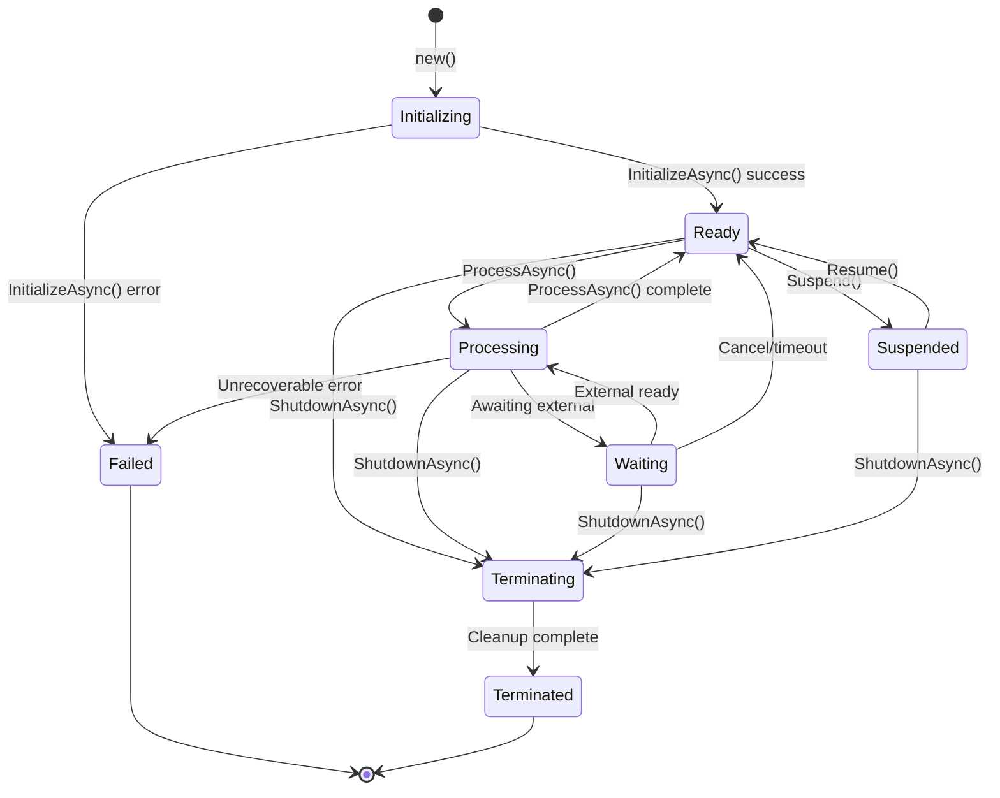
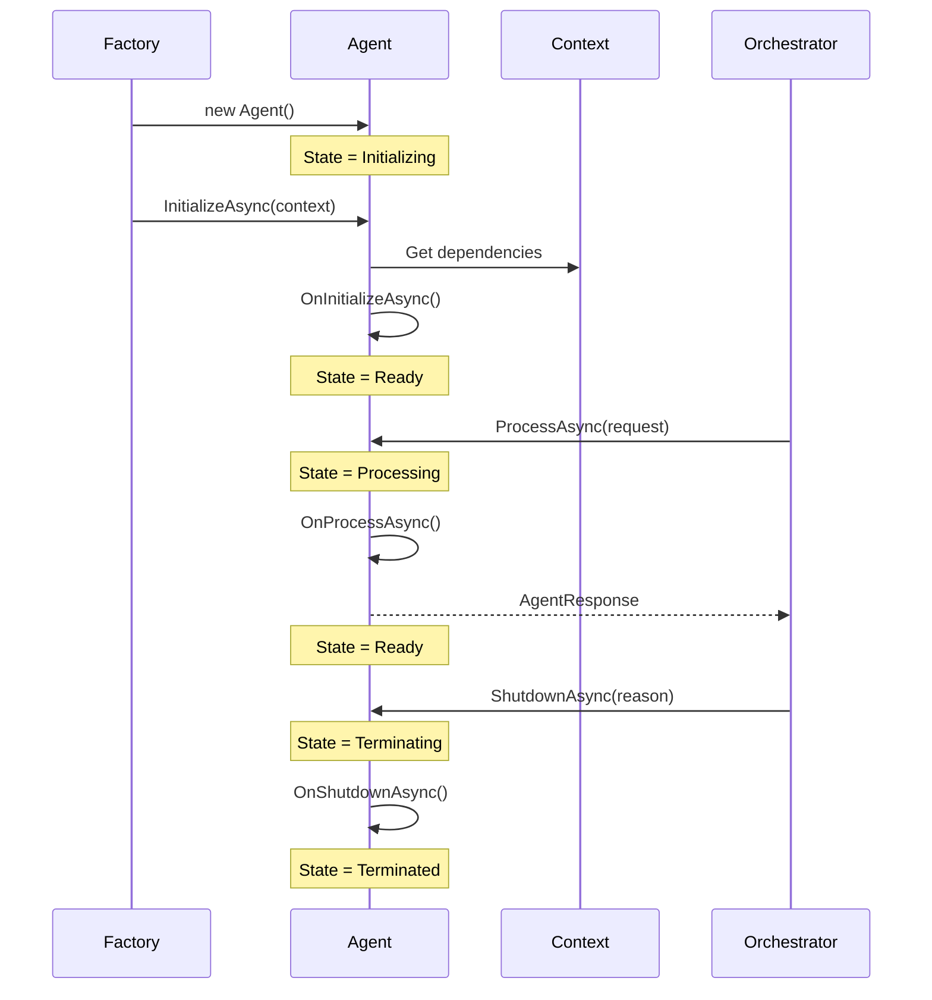

# LDS-01: Agent Schema & Contracts

## 1. Metadata & Categorization

| Field | Value |
| :--- | :--- |
| **Feature ID** | `AGT-SCH-01` |
| **Feature Name** | Agent Schema & Contracts |
| **Target Version** | `v0.12.1a` |
| **Module Scope** | `Lexichord.Modules.Agents.Abstractions` |
| **Swimlane** | Ensemble |
| **License Tier** | Core |
| **Feature Gate Key** | `FeatureFlags.Agents.Core` |
| **Author** | Agent Architecture Lead |
| **Reviewer** | Lead Architect |
| **Status** | Draft |
| **Last Updated** | 2026-02-03 |
| **Parent Spec** | [LCS-SBD-121-AGT](./LCS-SBD-v0.12.1-AGT.md) |
| **Estimated Hours** | 8 |

---

## 2. Executive Summary

### 2.1 The Requirement

Lexichord requires a universal contract that defines what an agent is. Without a standardized interface, agent implementations will diverge, orchestration becomes impossible, and third-party integrations fail. The system needs strongly-typed identifiers, well-defined lifecycle states, and clear message contracts.

### 2.2 The Proposed Solution

Implement the foundational `IAgent` interface with:
- A strongly-typed `AgentId` value object preventing primitive obsession
- An `AgentState` enumeration with explicit state machine semantics
- `AgentManifest` for declarative agent self-description
- `AgentRequest` / `AgentResponse` message contracts for all agent communication
- `AgentContext` providing runtime dependencies and configuration
- `AgentBase` abstract class reducing boilerplate in implementations

---

## 3. Architecture & Modular Strategy

### 3.1 Dependencies

**Upstream Modules:**
- `Lexichord.Host` — Core infrastructure (DI, Logging, Configuration)
- `Microsoft.Extensions.Logging.Abstractions` — Logging interfaces

**NuGet Packages:**
- `System.Text.Json` (for manifest serialization)

### 3.2 Licensing Behavior

- **Load Behavior:** [x] **Hard Gate** — The Agents module DLL is not loaded if license lacks `Agents.Core`.
- **Fallback Experience:** Agent-related menu items are hidden. Attempting to access via deep link shows "Upgrade to access Agents" modal.

---

## 4. Data Contract (The API)

### 4.1 Core Agent Interface

```csharp
namespace Lexichord.Modules.Agents.Abstractions;

/// <summary>
/// The fundamental contract for all Lexichord agents.
/// Every agent—built-in, custom, or third-party—MUST implement this interface.
/// This is the "Sheet Music" that defines how an agent performs in the ensemble.
/// </summary>
public interface IAgent
{
    /// <summary>
    /// Unique identifier for this agent instance.
    /// Immutable after construction. Used for tracking, logging, and correlation.
    /// </summary>
    AgentId Id { get; }

    /// <summary>
    /// Declarative manifest describing this agent's identity and capabilities.
    /// MUST be immutable and available immediately after construction.
    /// </summary>
    AgentManifest Manifest { get; }

    /// <summary>
    /// Current operational state of the agent.
    /// State transitions MUST follow the defined state machine.
    /// </summary>
    AgentState State { get; }

    /// <summary>
    /// Process a request and return a response.
    /// This is the primary execution entry point for all agent work.
    /// </summary>
    /// <param name="request">The incoming request with task and context.</param>
    /// <param name="ct">Cancellation token for cooperative cancellation.</param>
    /// <returns>The agent's response containing results or errors.</returns>
    /// <exception cref="InvalidOperationException">Agent not in Ready or Waiting state.</exception>
    Task<AgentResponse> ProcessAsync(
        AgentRequest request,
        CancellationToken ct = default);

    /// <summary>
    /// Initialize the agent with its runtime context.
    /// Called exactly once after construction, before any ProcessAsync calls.
    /// </summary>
    /// <param name="context">Runtime context with dependencies and configuration.</param>
    /// <param name="ct">Cancellation token.</param>
    /// <exception cref="AgentInitializationException">Initialization failed.</exception>
    Task InitializeAsync(
        AgentContext context,
        CancellationToken ct = default);

    /// <summary>
    /// Gracefully shutdown the agent, releasing all resources.
    /// Called when the agent is being terminated.
    /// </summary>
    /// <param name="reason">Why the agent is being shut down.</param>
    /// <param name="ct">Cancellation token (short timeout expected).</param>
    Task ShutdownAsync(
        ShutdownReason reason,
        CancellationToken ct = default);
}
```

### 4.2 Agent Identifier

```csharp
namespace Lexichord.Modules.Agents.Abstractions;

/// <summary>
/// Immutable, strongly-typed identifier for an agent instance.
/// Prevents primitive obsession and provides type safety across the system.
/// </summary>
public readonly record struct AgentId : IEquatable<AgentId>, IComparable<AgentId>
{
    /// <summary>
    /// The underlying GUID value.
    /// </summary>
    public Guid Value { get; }

    /// <summary>
    /// Creates a new AgentId from a GUID.
    /// </summary>
    /// <param name="value">The GUID value. MUST NOT be Guid.Empty.</param>
    /// <exception cref="ArgumentException">Thrown if value is Guid.Empty.</exception>
    public AgentId(Guid value)
    {
        if (value == Guid.Empty)
            throw new ArgumentException("AgentId cannot be empty", nameof(value));
        Value = value;
    }

    /// <summary>
    /// Creates a new unique AgentId.
    /// </summary>
    public static AgentId New() => new(Guid.NewGuid());

    /// <summary>
    /// Parses a string into an AgentId.
    /// Accepts formats: "agent:xxx", "xxx" (raw GUID).
    /// </summary>
    /// <param name="s">The string to parse.</param>
    /// <returns>The parsed AgentId.</returns>
    /// <exception cref="FormatException">Invalid format.</exception>
    public static AgentId Parse(string s)
    {
        ArgumentNullException.ThrowIfNull(s);

        var guidPart = s.StartsWith("agent:", StringComparison.OrdinalIgnoreCase)
            ? s[6..]
            : s;

        return new AgentId(Guid.Parse(guidPart));
    }

    /// <summary>
    /// Attempts to parse a string into an AgentId.
    /// </summary>
    public static bool TryParse(string? s, out AgentId result)
    {
        result = default;
        if (string.IsNullOrWhiteSpace(s)) return false;

        var guidPart = s.StartsWith("agent:", StringComparison.OrdinalIgnoreCase)
            ? s[6..]
            : s;

        if (Guid.TryParse(guidPart, out var guid) && guid != Guid.Empty)
        {
            result = new AgentId(guid);
            return true;
        }
        return false;
    }

    /// <summary>
    /// Returns the canonical string representation: "agent:{guid:N}"
    /// </summary>
    public override string ToString() => $"agent:{Value:N}";

    /// <summary>
    /// Implicit conversion to Guid for interop scenarios.
    /// </summary>
    public static implicit operator Guid(AgentId id) => id.Value;

    public int CompareTo(AgentId other) => Value.CompareTo(other.Value);
}
```

### 4.3 Agent State

```csharp
namespace Lexichord.Modules.Agents.Abstractions;

/// <summary>
/// The operational state of an agent.
/// State transitions MUST follow the defined state machine (see diagram below).
/// </summary>
public enum AgentState
{
    /// <summary>
    /// Agent is being created and initialized.
    /// Entry state. Transitions to: Ready, Failed.
    /// </summary>
    Initializing = 0,

    /// <summary>
    /// Agent is ready to accept and process requests.
    /// Transitions to: Processing, Suspended, Terminating.
    /// </summary>
    Ready = 1,

    /// <summary>
    /// Agent is actively processing a request.
    /// Transitions to: Ready, Waiting, Failed, Terminating.
    /// </summary>
    Processing = 2,

    /// <summary>
    /// Agent is waiting for external input, resources, or child agents.
    /// Transitions to: Processing, Ready, Terminating.
    /// </summary>
    Waiting = 3,

    /// <summary>
    /// Agent has been paused by the system or user.
    /// Transitions to: Ready, Terminating.
    /// </summary>
    Suspended = 4,

    /// <summary>
    /// Agent is shutting down gracefully, releasing resources.
    /// Transitions to: Terminated.
    /// </summary>
    Terminating = 5,

    /// <summary>
    /// Agent has been terminated and cannot be reused.
    /// Terminal state. No transitions.
    /// </summary>
    Terminated = 6,

    /// <summary>
    /// Agent has encountered an unrecoverable error.
    /// Terminal state. No transitions.
    /// </summary>
    Failed = 7
}
```

### 4.4 Shutdown Reason

```csharp
namespace Lexichord.Modules.Agents.Abstractions;

/// <summary>
/// Reasons for agent shutdown.
/// Passed to ShutdownAsync to allow agents to perform reason-specific cleanup.
/// </summary>
public enum ShutdownReason
{
    /// <summary>
    /// Normal completion of assigned work.
    /// </summary>
    Completed = 0,

    /// <summary>
    /// User or system explicitly requested shutdown.
    /// </summary>
    Requested = 1,

    /// <summary>
    /// Execution timeout exceeded.
    /// </summary>
    Timeout = 2,

    /// <summary>
    /// Resource limits exceeded (tokens, memory, etc.).
    /// </summary>
    ResourceLimit = 3,

    /// <summary>
    /// Unrecoverable error occurred.
    /// </summary>
    Error = 4,

    /// <summary>
    /// Host system is shutting down.
    /// </summary>
    SystemShutdown = 5,

    /// <summary>
    /// Parent agent terminated, cascading to children.
    /// </summary>
    ParentTerminated = 6
}
```

### 4.5 Agent Request

```csharp
namespace Lexichord.Modules.Agents.Abstractions;

/// <summary>
/// Encapsulates a request to an agent.
/// Immutable message contract for agent communication.
/// </summary>
public sealed record AgentRequest
{
    /// <summary>
    /// Unique identifier for this request (for correlation and tracing).
    /// </summary>
    public required Guid RequestId { get; init; }

    /// <summary>
    /// The task or instruction for the agent to perform.
    /// </summary>
    public required string Task { get; init; }

    /// <summary>
    /// Optional structured input data.
    /// Schema defined by agent's InputSchema in manifest.
    /// </summary>
    public JsonDocument? Input { get; init; }

    /// <summary>
    /// Conversation history for conversational agents.
    /// </summary>
    public IReadOnlyList<AgentMessage>? ConversationHistory { get; init; }

    /// <summary>
    /// Additional context passed from orchestrator.
    /// </summary>
    public IReadOnlyDictionary<string, object>? Metadata { get; init; }

    /// <summary>
    /// Parent request ID for hierarchical tracking.
    /// </summary>
    public Guid? ParentRequestId { get; init; }

    /// <summary>
    /// When this request was created.
    /// </summary>
    public DateTimeOffset CreatedAt { get; init; } = DateTimeOffset.UtcNow;

    /// <summary>
    /// Creates a new request with a generated ID.
    /// </summary>
    public static AgentRequest Create(string task) => new()
    {
        RequestId = Guid.NewGuid(),
        Task = task
    };
}

/// <summary>
/// A message in the agent conversation history.
/// </summary>
public sealed record AgentMessage
{
    /// <summary>
    /// Role of the message sender.
    /// </summary>
    public required MessageRole Role { get; init; }

    /// <summary>
    /// Text content of the message.
    /// </summary>
    public required string Content { get; init; }

    /// <summary>
    /// When this message was created.
    /// </summary>
    public DateTimeOffset Timestamp { get; init; } = DateTimeOffset.UtcNow;
}

/// <summary>
/// Role of a message participant.
/// </summary>
public enum MessageRole
{
    User,
    Agent,
    System,
    Tool
}
```

### 4.6 Agent Response

```csharp
namespace Lexichord.Modules.Agents.Abstractions;

/// <summary>
/// Encapsulates the result of an agent processing a request.
/// Immutable message contract for agent results.
/// </summary>
public sealed record AgentResponse
{
    /// <summary>
    /// The request ID this response is for.
    /// </summary>
    public required Guid RequestId { get; init; }

    /// <summary>
    /// Whether the request was processed successfully.
    /// </summary>
    public required bool Success { get; init; }

    /// <summary>
    /// The primary text output from the agent.
    /// </summary>
    public string? Content { get; init; }

    /// <summary>
    /// Structured output data matching agent's OutputSchema.
    /// </summary>
    public JsonDocument? Output { get; init; }

    /// <summary>
    /// Error message if Success is false.
    /// </summary>
    public string? ErrorMessage { get; init; }

    /// <summary>
    /// Error code for programmatic handling.
    /// </summary>
    public string? ErrorCode { get; init; }

    /// <summary>
    /// Token usage statistics.
    /// </summary>
    public TokenUsage? TokenUsage { get; init; }

    /// <summary>
    /// Processing duration.
    /// </summary>
    public TimeSpan Duration { get; init; }

    /// <summary>
    /// Additional metadata from processing.
    /// </summary>
    public IReadOnlyDictionary<string, object>? Metadata { get; init; }

    /// <summary>
    /// Creates a successful response.
    /// </summary>
    public static AgentResponse Ok(Guid requestId, string content) => new()
    {
        RequestId = requestId,
        Success = true,
        Content = content
    };

    /// <summary>
    /// Creates an error response.
    /// </summary>
    public static AgentResponse Error(Guid requestId, string message, string? code = null) => new()
    {
        RequestId = requestId,
        Success = false,
        ErrorMessage = message,
        ErrorCode = code
    };

    /// <summary>
    /// Creates a locked response for license-gated features.
    /// </summary>
    public static AgentResponse Locked(Guid requestId, string feature) => new()
    {
        RequestId = requestId,
        Success = false,
        ErrorMessage = $"Feature '{feature}' requires license upgrade.",
        ErrorCode = "LICENSE_REQUIRED"
    };
}

/// <summary>
/// Token usage statistics for an agent operation.
/// </summary>
public sealed record TokenUsage
{
    public int InputTokens { get; init; }
    public int OutputTokens { get; init; }
    public int TotalTokens => InputTokens + OutputTokens;
    public int? CachedTokens { get; init; }
}
```

### 4.7 Agent Context

```csharp
namespace Lexichord.Modules.Agents.Abstractions;

/// <summary>
/// Runtime context provided to agents during initialization.
/// Contains all dependencies and configuration needed for execution.
/// </summary>
public sealed record AgentContext
{
    /// <summary>
    /// Logger scoped to this agent instance.
    /// </summary>
    public required ILogger Logger { get; init; }

    /// <summary>
    /// Service provider for resolving dependencies.
    /// </summary>
    public required IServiceProvider Services { get; init; }

    /// <summary>
    /// License service for checking feature access.
    /// </summary>
    public required ILicenseService License { get; init; }

    /// <summary>
    /// Configuration specific to this agent instance.
    /// </summary>
    public IReadOnlyDictionary<string, object>? Configuration { get; init; }

    /// <summary>
    /// Working directory for file operations.
    /// </summary>
    public string? WorkingDirectory { get; init; }

    /// <summary>
    /// Parent agent ID if this is a child agent.
    /// </summary>
    public AgentId? ParentAgentId { get; init; }

    /// <summary>
    /// Correlation ID for distributed tracing.
    /// </summary>
    public string? CorrelationId { get; init; }
}
```

### 4.8 Agent Base Class

```csharp
namespace Lexichord.Modules.Agents.Abstractions;

/// <summary>
/// Abstract base class for implementing agents with common functionality.
/// Handles state management, lifecycle, and error handling boilerplate.
/// </summary>
public abstract class AgentBase : IAgent
{
    private AgentState _state = AgentState.Initializing;
    private readonly object _stateLock = new();

    /// <inheritdoc />
    public AgentId Id { get; }

    /// <inheritdoc />
    public abstract AgentManifest Manifest { get; }

    /// <inheritdoc />
    public AgentState State
    {
        get { lock (_stateLock) return _state; }
        protected set { lock (_stateLock) _state = value; }
    }

    /// <summary>
    /// The agent's runtime context, available after initialization.
    /// </summary>
    protected AgentContext? Context { get; private set; }

    /// <summary>
    /// Logger for this agent instance.
    /// </summary>
    protected ILogger Logger => Context?.Logger ?? NullLogger.Instance;

    protected AgentBase()
    {
        Id = AgentId.New();
    }

    protected AgentBase(AgentId id)
    {
        Id = id;
    }

    /// <inheritdoc />
    public virtual async Task InitializeAsync(AgentContext context, CancellationToken ct)
    {
        ValidateStateTransition(AgentState.Initializing, AgentState.Ready);

        Context = context ?? throw new ArgumentNullException(nameof(context));

        Logger.LogInformation(
            "[{AgentName}] Initializing agent {AgentId}",
            Manifest.Name,
            Id);

        try
        {
            await OnInitializeAsync(ct);
            State = AgentState.Ready;

            Logger.LogInformation(
                "[{AgentName}] Agent {AgentId} initialized successfully",
                Manifest.Name,
                Id);
        }
        catch (Exception ex)
        {
            State = AgentState.Failed;
            Logger.LogError(
                ex,
                "[{AgentName}] Agent {AgentId} initialization failed",
                Manifest.Name,
                Id);
            throw new AgentInitializationException(Id, ex.Message, ex);
        }
    }

    /// <inheritdoc />
    public async Task<AgentResponse> ProcessAsync(AgentRequest request, CancellationToken ct)
    {
        ArgumentNullException.ThrowIfNull(request);

        if (State != AgentState.Ready && State != AgentState.Waiting)
        {
            return AgentResponse.Error(
                request.RequestId,
                $"Agent not ready. Current state: {State}",
                "AGENT_NOT_READY");
        }

        var previousState = State;
        State = AgentState.Processing;
        var stopwatch = Stopwatch.StartNew();

        Logger.LogInformation(
            "[{AgentName}] Processing request {RequestId} for agent {AgentId}",
            Manifest.Name,
            request.RequestId,
            Id);

        try
        {
            var response = await OnProcessAsync(request, ct);
            stopwatch.Stop();

            State = AgentState.Ready;

            Logger.LogInformation(
                "[{AgentName}] Request {RequestId} completed in {Duration}ms. Success: {Success}",
                Manifest.Name,
                request.RequestId,
                stopwatch.ElapsedMilliseconds,
                response.Success);

            return response with { Duration = stopwatch.Elapsed };
        }
        catch (OperationCanceledException)
        {
            State = previousState;
            return AgentResponse.Error(
                request.RequestId,
                "Operation was cancelled",
                "CANCELLED");
        }
        catch (Exception ex)
        {
            State = AgentState.Failed;
            Logger.LogError(
                ex,
                "[{AgentName}] Request {RequestId} failed for agent {AgentId}",
                Manifest.Name,
                request.RequestId,
                Id);

            return AgentResponse.Error(
                request.RequestId,
                ex.Message,
                "PROCESSING_ERROR");
        }
    }

    /// <inheritdoc />
    public virtual async Task ShutdownAsync(ShutdownReason reason, CancellationToken ct)
    {
        if (State == AgentState.Terminated || State == AgentState.Failed)
            return;

        State = AgentState.Terminating;

        Logger.LogInformation(
            "[{AgentName}] Shutting down agent {AgentId}. Reason: {Reason}",
            Manifest.Name,
            Id,
            reason);

        try
        {
            await OnShutdownAsync(reason, ct);
        }
        finally
        {
            State = AgentState.Terminated;
        }
    }

    /// <summary>
    /// Override to perform agent-specific initialization.
    /// </summary>
    protected virtual Task OnInitializeAsync(CancellationToken ct) => Task.CompletedTask;

    /// <summary>
    /// Override to implement the agent's core processing logic.
    /// </summary>
    protected abstract Task<AgentResponse> OnProcessAsync(
        AgentRequest request,
        CancellationToken ct);

    /// <summary>
    /// Override to perform agent-specific cleanup during shutdown.
    /// </summary>
    protected virtual Task OnShutdownAsync(ShutdownReason reason, CancellationToken ct)
        => Task.CompletedTask;

    private void ValidateStateTransition(AgentState from, AgentState to)
    {
        if (State != from)
        {
            throw new InvalidOperationException(
                $"Invalid state transition. Expected {from}, current is {State}");
        }
    }
}
```

---

## 5. Implementation Logic

### 5.1 State Machine Diagram



### 5.2 Lifecycle Sequence



---

## 6. Data Persistence (Database)

This sub-part introduces no database changes. All types are in-memory contracts. Database schema for agent storage is defined in [v0.12.1d (Agent Registry)](./LCS-SBD-v0.12.1d-REG.md).

---

## 7. UI/UX Specifications

This sub-part introduces no UI components. UI for agent management is defined in [v0.12.1f (Agent Definition UI)](./LCS-SBD-v0.12.1f-UI.md).

---

## 8. Observability & Logging

### 8.1 Log Templates

| Level | Template |
|:------|:---------|
| **Info** | `[{AgentName}] Initializing agent {AgentId}` |
| **Info** | `[{AgentName}] Agent {AgentId} initialized successfully` |
| **Info** | `[{AgentName}] Processing request {RequestId} for agent {AgentId}` |
| **Info** | `[{AgentName}] Request {RequestId} completed in {Duration}ms. Success: {Success}` |
| **Info** | `[{AgentName}] Shutting down agent {AgentId}. Reason: {Reason}` |
| **Error** | `[{AgentName}] Agent {AgentId} initialization failed` |
| **Error** | `[{AgentName}] Request {RequestId} failed for agent {AgentId}` |

### 8.2 Metrics

| Metric | Type | Description |
|:-------|:-----|:------------|
| `agents.created.total` | Counter | Total agents created |
| `agents.state.current` | Gauge | Current agents by state |
| `agents.request.duration` | Histogram | Request processing time |
| `agents.request.success` | Counter | Successful requests |
| `agents.request.failure` | Counter | Failed requests |

---

## 9. Security & Safety

- **PII Risk:** Low — Agent contracts do not store user data.
- **Injection Risk:** None — Types are strongly-typed, no string interpolation.
- **State Integrity:** Thread-safe state transitions via lock.
- **Resource Leaks:** `AgentBase.ShutdownAsync()` ensures cleanup.

---

## 10. Acceptance Criteria (QA)

1. **[Functional]** `AgentId.New()` generates unique, non-empty GUIDs.
2. **[Functional]** `AgentId.Parse()` handles "agent:xxx" and raw GUID formats.
3. **[Functional]** `AgentBase` state transitions follow the state machine exactly.
4. **[Functional]** `ProcessAsync` returns error if agent not in `Ready` or `Waiting` state.
5. **[Functional]** `ShutdownAsync` is idempotent for already-terminated agents.
6. **[Edge Case]** `AgentId` throws on `Guid.Empty`.
7. **[Thread Safety]** Concurrent `ProcessAsync` calls do not corrupt state.
8. **[Performance]** `AgentId` operations complete in <1ms.

---

## 11. Test Scenarios

### 11.1 Unit Tests

**Scenario: `AgentId_New_GeneratesUniqueIds`**
- **Setup:** None.
- **Action:** Call `AgentId.New()` 1000 times.
- **Assertion:** All IDs are unique.

**Scenario: `AgentId_Parse_AcceptsBothFormats`**
- **Setup:** None.
- **Action:** Parse "agent:abc123..." and "abc123...".
- **Assertion:** Both produce equal `AgentId` values.

**Scenario: `AgentId_Rejects_EmptyGuid`**
- **Setup:** None.
- **Action:** `new AgentId(Guid.Empty)`.
- **Assertion:** Throws `ArgumentException`.

**Scenario: `AgentBase_ProcessAsync_RejectsWhenNotReady`**
- **Setup:** Agent in `Initializing` state.
- **Action:** Call `ProcessAsync()`.
- **Assertion:** Returns error response with code `AGENT_NOT_READY`.

**Scenario: `AgentBase_StateTransitions_AreThreadSafe`**
- **Setup:** Initialized agent.
- **Action:** 100 concurrent `ProcessAsync` calls.
- **Assertion:** No exceptions, state never invalid.

### 11.2 Integration Tests

**Scenario: `Agent_FullLifecycle_Completes`**
- **Setup:** Create `TestAgent : AgentBase`.
- **Action:** Initialize → Process 3 requests → Shutdown.
- **Assertion:** Final state is `Terminated`.
