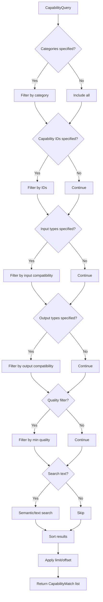

# LDS-01: Capability Declaration

## 1. Metadata & Categorization

| Field | Value |
| :--- | :--- |
| **Feature ID** | `AGT-CAP-01` |
| **Feature Name** | Capability Declaration |
| **Target Version** | `v0.12.1b` |
| **Module Scope** | `Lexichord.Modules.Agents.Abstractions` |
| **Swimlane** | Ensemble |
| **License Tier** | Core |
| **Feature Gate Key** | `FeatureFlags.Agents.Capabilities` |
| **Author** | Agent Architecture Lead |
| **Reviewer** | Lead Architect |
| **Status** | Draft |
| **Last Updated** | 2026-02-03 |
| **Parent Spec** | [LCS-SBD-121-AGT](./LCS-SBD-v0.12.1-AGT.md) |
| **Depends On** | [v0.12.1a (Agent Schema)](./LCS-SBD-v0.12.1a-SCH.md) |
| **Estimated Hours** | 8 |

---

## 2. Executive Summary

### 2.1 The Requirement

Agents must declare what they can do so the system can route tasks to appropriate agents. Without a capability system, the orchestrator cannot make intelligent decisions about agent selection, and users cannot discover agents that match their needs. The system requires a structured vocabulary for describing agent abilities.

### 2.2 The Proposed Solution

Implement a comprehensive capability declaration system:
- `AgentCapability` record describing individual capabilities with metadata
- `CapabilityCategory` enumeration providing a structured taxonomy (14 categories)
- `CapabilityQuery` for flexible capability-based agent discovery
- `ICapabilityIndex` interface for efficient capability lookups
- Input/output type system for capability matching

---

## 3. Architecture & Modular Strategy

### 3.1 Dependencies

**Upstream Modules:**
- `Lexichord.Modules.Agents.Abstractions` — `AgentManifest` (v0.12.1a)

**NuGet Packages:**
- None (pure C# types)

### 3.2 Licensing Behavior

- **Load Behavior:** [x] **Soft Gate** — Capability types load with Core; advanced queries require WriterPro.
- **Fallback Experience:** Core users can view capabilities; multi-capability queries require upgrade.

---

## 4. Data Contract (The API)

### 4.1 Agent Capability

```csharp
namespace Lexichord.Modules.Agents.Abstractions;

/// <summary>
/// Declares a specific capability that an agent provides.
/// Capabilities are the fundamental unit of agent discovery and task routing.
/// The orchestrator uses capabilities to match user requests to appropriate agents.
/// </summary>
public sealed record AgentCapability
{
    /// <summary>
    /// Unique identifier for this capability within the system.
    /// MUST be lowercase, alphanumeric with hyphens (e.g., "text-summarization").
    /// </summary>
    /// <example>git-history-analysis</example>
    /// <example>code-review</example>
    public required string Id { get; init; }

    /// <summary>
    /// Human-readable display name for this capability.
    /// </summary>
    /// <example>Git History Analysis</example>
    public required string Name { get; init; }

    /// <summary>
    /// Detailed description of what this capability does.
    /// Used for documentation and semantic search.
    /// </summary>
    public string? Description { get; init; }

    /// <summary>
    /// Category for grouping related capabilities.
    /// Enables category-based filtering and discovery.
    /// </summary>
    public CapabilityCategory Category { get; init; } = CapabilityCategory.TextGeneration;

    /// <summary>
    /// Content types this capability accepts as input.
    /// MUST use MIME-like types (e.g., "text/plain", "application/json")
    /// or domain-specific types (e.g., "git-repository", "code/csharp").
    /// </summary>
    public IReadOnlyList<string> InputTypes { get; init; } = [];

    /// <summary>
    /// Content types this capability produces as output.
    /// Same format as InputTypes.
    /// </summary>
    public IReadOnlyList<string> OutputTypes { get; init; } = [];

    /// <summary>
    /// Self-reported quality score from 0.0 (lowest) to 1.0 (highest).
    /// Used to prefer higher-quality agents when multiple match a query.
    /// </summary>
    /// <remarks>
    /// Quality scores are self-reported by agent authors.
    /// The system MAY adjust scores based on actual performance metrics.
    /// </remarks>
    public float QualityScore { get; init; } = 0.8f;

    /// <summary>
    /// Whether this capability requires LLM access.
    /// Used for license validation and resource planning.
    /// </summary>
    public bool RequiresLLM { get; init; } = true;

    /// <summary>
    /// Estimated cost tier for this capability.
    /// </summary>
    public CapabilityCostTier CostTier { get; init; } = CapabilityCostTier.Standard;

    /// <summary>
    /// Additional metadata about this capability.
    /// Extensible for domain-specific attributes.
    /// </summary>
    public IReadOnlyDictionary<string, object>? Metadata { get; init; }

    /// <summary>
    /// Validates the capability ID format.
    /// </summary>
    public bool IsValidId() => CapabilityIdValidator.IsValid(Id);
}

/// <summary>
/// Validates capability ID format.
/// </summary>
public static class CapabilityIdValidator
{
    private static readonly Regex IdPattern = new(
        @"^[a-z][a-z0-9]*(-[a-z0-9]+)*$",
        RegexOptions.Compiled);

    /// <summary>
    /// Validates that a capability ID follows the required format:
    /// lowercase, alphanumeric, hyphens allowed (not at start/end).
    /// </summary>
    public static bool IsValid(string? id)
    {
        if (string.IsNullOrWhiteSpace(id)) return false;
        if (id.Length > 100) return false;
        return IdPattern.IsMatch(id);
    }
}

/// <summary>
/// Cost tier for capability execution.
/// </summary>
public enum CapabilityCostTier
{
    /// <summary>No LLM or minimal resources.</summary>
    Free = 0,

    /// <summary>Standard LLM usage.</summary>
    Standard = 1,

    /// <summary>Extended LLM usage or multiple calls.</summary>
    Premium = 2,

    /// <summary>Very large context or heavy computation.</summary>
    Expensive = 3
}
```

### 4.2 Capability Category

```csharp
namespace Lexichord.Modules.Agents.Abstractions;

/// <summary>
/// Categories for grouping and organizing agent capabilities.
/// Provides a structured taxonomy for capability discovery.
/// </summary>
public enum CapabilityCategory
{
    /// <summary>
    /// Generate new text content from prompts or data.
    /// Examples: documentation writing, creative writing, report generation.
    /// </summary>
    TextGeneration = 0,

    /// <summary>
    /// Analyze and extract insights from text content.
    /// Examples: sentiment analysis, entity extraction, classification.
    /// </summary>
    TextAnalysis = 1,

    /// <summary>
    /// Generate source code in various programming languages.
    /// Examples: function generation, boilerplate creation, code completion.
    /// </summary>
    CodeGeneration = 2,

    /// <summary>
    /// Analyze, understand, and reason about code.
    /// Examples: code review, bug detection, complexity analysis.
    /// </summary>
    CodeAnalysis = 3,

    /// <summary>
    /// Extract structured data from unstructured sources.
    /// Examples: parsing logs, scraping data, OCR extraction.
    /// </summary>
    DataExtraction = 4,

    /// <summary>
    /// Transform data between formats or structures.
    /// Examples: JSON to XML, CSV normalization, schema migration.
    /// </summary>
    DataTransformation = 5,

    /// <summary>
    /// Gather and synthesize information from various sources.
    /// Examples: web research, documentation search, knowledge retrieval.
    /// </summary>
    Research = 6,

    /// <summary>
    /// Validate content against rules, schemas, or policies.
    /// Examples: style checking, schema validation, compliance checking.
    /// </summary>
    Validation = 7,

    /// <summary>
    /// Translate content between human languages.
    /// Examples: English to Spanish, localization, multi-language support.
    /// </summary>
    Translation = 8,

    /// <summary>
    /// Create concise summaries of longer content.
    /// Examples: document summaries, meeting notes, changelog generation.
    /// </summary>
    Summarization = 9,

    /// <summary>
    /// Plan and decompose complex tasks into steps.
    /// Examples: project planning, task breakdown, workflow design.
    /// </summary>
    Planning = 10,

    /// <summary>
    /// Execute actions in external systems or tools.
    /// Examples: API calls, file operations, command execution.
    /// </summary>
    Execution = 11,

    /// <summary>
    /// Review content and provide structured feedback.
    /// Examples: document review, code review, peer feedback.
    /// </summary>
    Review = 12,

    /// <summary>
    /// Format and style content according to rules.
    /// Examples: markdown formatting, code formatting, style application.
    /// </summary>
    Formatting = 13
}

/// <summary>
/// Extension methods for CapabilityCategory.
/// </summary>
public static class CapabilityCategoryExtensions
{
    /// <summary>
    /// Gets the display name for a category.
    /// </summary>
    public static string GetDisplayName(this CapabilityCategory category) => category switch
    {
        CapabilityCategory.TextGeneration => "Text Generation",
        CapabilityCategory.TextAnalysis => "Text Analysis",
        CapabilityCategory.CodeGeneration => "Code Generation",
        CapabilityCategory.CodeAnalysis => "Code Analysis",
        CapabilityCategory.DataExtraction => "Data Extraction",
        CapabilityCategory.DataTransformation => "Data Transformation",
        CapabilityCategory.Research => "Research",
        CapabilityCategory.Validation => "Validation",
        CapabilityCategory.Translation => "Translation",
        CapabilityCategory.Summarization => "Summarization",
        CapabilityCategory.Planning => "Planning",
        CapabilityCategory.Execution => "Execution",
        CapabilityCategory.Review => "Review",
        CapabilityCategory.Formatting => "Formatting",
        _ => category.ToString()
    };

    /// <summary>
    /// Gets the icon identifier for a category.
    /// </summary>
    public static string GetIcon(this CapabilityCategory category) => category switch
    {
        CapabilityCategory.TextGeneration => "edit-3",
        CapabilityCategory.TextAnalysis => "search",
        CapabilityCategory.CodeGeneration => "code",
        CapabilityCategory.CodeAnalysis => "git-branch",
        CapabilityCategory.DataExtraction => "database",
        CapabilityCategory.DataTransformation => "shuffle",
        CapabilityCategory.Research => "book-open",
        CapabilityCategory.Validation => "check-circle",
        CapabilityCategory.Translation => "globe",
        CapabilityCategory.Summarization => "file-text",
        CapabilityCategory.Planning => "calendar",
        CapabilityCategory.Execution => "play",
        CapabilityCategory.Review => "eye",
        CapabilityCategory.Formatting => "type",
        _ => "help-circle"
    };

    /// <summary>
    /// Gets related categories that often work together.
    /// </summary>
    public static IReadOnlyList<CapabilityCategory> GetRelatedCategories(
        this CapabilityCategory category) => category switch
    {
        CapabilityCategory.TextGeneration => [CapabilityCategory.Formatting, CapabilityCategory.Review],
        CapabilityCategory.CodeGeneration => [CapabilityCategory.CodeAnalysis, CapabilityCategory.Review],
        CapabilityCategory.Research => [CapabilityCategory.Summarization, CapabilityCategory.DataExtraction],
        CapabilityCategory.Planning => [CapabilityCategory.Execution, CapabilityCategory.Research],
        _ => []
    };
}
```

### 4.3 Capability Query

```csharp
namespace Lexichord.Modules.Agents.Abstractions;

/// <summary>
/// Query for finding agents by capability.
/// Supports flexible matching across multiple dimensions.
/// </summary>
public sealed record CapabilityQuery
{
    /// <summary>
    /// Filter by capability categories.
    /// Agents must have at least one capability in any of these categories.
    /// </summary>
    public IReadOnlyList<CapabilityCategory>? Categories { get; init; }

    /// <summary>
    /// Filter by specific capability IDs.
    /// Agents must have all specified capabilities.
    /// </summary>
    public IReadOnlyList<string>? RequiredCapabilityIds { get; init; }

    /// <summary>
    /// Filter by input content types the agent must accept.
    /// </summary>
    public IReadOnlyList<string>? RequiredInputTypes { get; init; }

    /// <summary>
    /// Filter by output content types the agent must produce.
    /// </summary>
    public IReadOnlyList<string>? RequiredOutputTypes { get; init; }

    /// <summary>
    /// Minimum quality score across all matching capabilities.
    /// </summary>
    public float? MinQualityScore { get; init; }

    /// <summary>
    /// Maximum cost tier to include.
    /// </summary>
    public CapabilityCostTier? MaxCostTier { get; init; }

    /// <summary>
    /// Whether to require LLM-free capabilities only.
    /// </summary>
    public bool? RequiresNoLLM { get; init; }

    /// <summary>
    /// Free-text search across capability names and descriptions.
    /// Uses semantic matching when available.
    /// </summary>
    public string? SearchText { get; init; }

    /// <summary>
    /// Maximum number of results to return.
    /// </summary>
    public int Limit { get; init; } = 20;

    /// <summary>
    /// Number of results to skip (for pagination).
    /// </summary>
    public int Offset { get; init; } = 0;

    /// <summary>
    /// How to sort results.
    /// </summary>
    public CapabilitySortOrder SortBy { get; init; } = CapabilitySortOrder.QualityDescending;

    /// <summary>
    /// Creates an empty query that matches all capabilities.
    /// </summary>
    public static CapabilityQuery All => new();

    /// <summary>
    /// Creates a query for a specific category.
    /// </summary>
    public static CapabilityQuery ForCategory(CapabilityCategory category) => new()
    {
        Categories = [category]
    };

    /// <summary>
    /// Creates a query for specific capability IDs.
    /// </summary>
    public static CapabilityQuery ForCapabilities(params string[] ids) => new()
    {
        RequiredCapabilityIds = ids
    };

    /// <summary>
    /// Creates a query matching input/output types.
    /// </summary>
    public static CapabilityQuery ForTransformation(
        string inputType,
        string outputType) => new()
    {
        RequiredInputTypes = [inputType],
        RequiredOutputTypes = [outputType]
    };
}

/// <summary>
/// Sort order for capability query results.
/// </summary>
public enum CapabilitySortOrder
{
    /// <summary>Highest quality first.</summary>
    QualityDescending,

    /// <summary>Lowest quality first.</summary>
    QualityAscending,

    /// <summary>Alphabetical by name.</summary>
    NameAscending,

    /// <summary>Reverse alphabetical by name.</summary>
    NameDescending,

    /// <summary>Most relevant to search text first.</summary>
    Relevance,

    /// <summary>Lowest cost tier first.</summary>
    CostAscending
}
```

### 4.4 Capability Index Interface

```csharp
namespace Lexichord.Modules.Agents.Abstractions;

/// <summary>
/// Index for efficient capability-based agent lookup.
/// Implementations MUST support <50ms query latency for typical queries.
/// </summary>
public interface ICapabilityIndex
{
    /// <summary>
    /// Indexes capabilities from an agent manifest.
    /// Called when an agent is registered.
    /// </summary>
    /// <param name="agentName">The agent's unique name.</param>
    /// <param name="capabilities">The agent's declared capabilities.</param>
    /// <param name="ct">Cancellation token.</param>
    Task IndexAsync(
        string agentName,
        IReadOnlyList<AgentCapability> capabilities,
        CancellationToken ct = default);

    /// <summary>
    /// Removes capabilities from the index.
    /// Called when an agent is unregistered.
    /// </summary>
    /// <param name="agentName">The agent's unique name.</param>
    /// <param name="ct">Cancellation token.</param>
    Task RemoveAsync(
        string agentName,
        CancellationToken ct = default);

    /// <summary>
    /// Finds agent names matching the capability query.
    /// </summary>
    /// <param name="query">The capability query.</param>
    /// <param name="ct">Cancellation token.</param>
    /// <returns>Matching agent names with relevance scores.</returns>
    Task<IReadOnlyList<CapabilityMatch>> FindAsync(
        CapabilityQuery query,
        CancellationToken ct = default);

    /// <summary>
    /// Gets all capabilities for a specific agent.
    /// </summary>
    /// <param name="agentName">The agent's unique name.</param>
    /// <param name="ct">Cancellation token.</param>
    /// <returns>The agent's capabilities, or empty if not found.</returns>
    Task<IReadOnlyList<AgentCapability>> GetCapabilitiesAsync(
        string agentName,
        CancellationToken ct = default);

    /// <summary>
    /// Gets all agents with a specific capability.
    /// </summary>
    /// <param name="capabilityId">The capability ID.</param>
    /// <param name="ct">Cancellation token.</param>
    /// <returns>Agent names that have this capability.</returns>
    Task<IReadOnlyList<string>> GetAgentsByCapabilityAsync(
        string capabilityId,
        CancellationToken ct = default);

    /// <summary>
    /// Gets all unique capability IDs in the index.
    /// </summary>
    Task<IReadOnlyList<string>> GetAllCapabilityIdsAsync(
        CancellationToken ct = default);

    /// <summary>
    /// Gets capability counts by category.
    /// </summary>
    Task<IReadOnlyDictionary<CapabilityCategory, int>> GetCategoryCountsAsync(
        CancellationToken ct = default);
}

/// <summary>
/// A match result from capability search.
/// </summary>
public sealed record CapabilityMatch
{
    /// <summary>
    /// The agent name.
    /// </summary>
    public required string AgentName { get; init; }

    /// <summary>
    /// Relevance score from 0.0 to 1.0.
    /// </summary>
    public required float Score { get; init; }

    /// <summary>
    /// Capabilities that matched the query.
    /// </summary>
    public required IReadOnlyList<AgentCapability> MatchedCapabilities { get; init; }
}
```

### 4.5 Content Type Matching

```csharp
namespace Lexichord.Modules.Agents.Abstractions;

/// <summary>
/// Utilities for matching content types between capabilities.
/// </summary>
public static class ContentTypeMatcher
{
    /// <summary>
    /// Checks if a capability's output can satisfy another's input requirement.
    /// Supports wildcard matching (e.g., "text/*" matches "text/plain").
    /// </summary>
    /// <param name="producerOutput">Output type from producing capability.</param>
    /// <param name="consumerInput">Input type required by consuming capability.</param>
    /// <returns>True if compatible.</returns>
    public static bool IsCompatible(string producerOutput, string consumerInput)
    {
        if (string.IsNullOrWhiteSpace(producerOutput) ||
            string.IsNullOrWhiteSpace(consumerInput))
            return false;

        // Exact match
        if (string.Equals(producerOutput, consumerInput, StringComparison.OrdinalIgnoreCase))
            return true;

        // Wildcard matching
        if (consumerInput.EndsWith("/*", StringComparison.Ordinal))
        {
            var prefix = consumerInput[..^2];
            return producerOutput.StartsWith(prefix + "/", StringComparison.OrdinalIgnoreCase);
        }

        // Universal consumer
        if (consumerInput == "*" || consumerInput == "*/*")
            return true;

        return false;
    }

    /// <summary>
    /// Checks if a capability can accept all required input types.
    /// </summary>
    public static bool CanAcceptInputs(
        AgentCapability capability,
        IReadOnlyList<string> requiredInputs)
    {
        if (requiredInputs == null || requiredInputs.Count == 0)
            return true;

        foreach (var required in requiredInputs)
        {
            var hasMatch = capability.InputTypes.Any(
                input => IsCompatible(input, required) || IsCompatible(required, input));

            if (!hasMatch) return false;
        }
        return true;
    }

    /// <summary>
    /// Checks if a capability can produce all required output types.
    /// </summary>
    public static bool CanProduceOutputs(
        AgentCapability capability,
        IReadOnlyList<string> requiredOutputs)
    {
        if (requiredOutputs == null || requiredOutputs.Count == 0)
            return true;

        foreach (var required in requiredOutputs)
        {
            var hasMatch = capability.OutputTypes.Any(
                output => IsCompatible(output, required));

            if (!hasMatch) return false;
        }
        return true;
    }
}

/// <summary>
/// Well-known content types used in the Lexichord capability system.
/// </summary>
public static class WellKnownContentTypes
{
    // Text types
    public const string TextPlain = "text/plain";
    public const string TextMarkdown = "text/markdown";
    public const string TextHtml = "text/html";

    // Code types
    public const string CodeCsharp = "code/csharp";
    public const string CodeTypescript = "code/typescript";
    public const string CodePython = "code/python";
    public const string CodeGeneric = "code/*";

    // Data types
    public const string ApplicationJson = "application/json";
    public const string ApplicationXml = "application/xml";
    public const string ApplicationYaml = "application/yaml";

    // Domain types
    public const string GitRepository = "git/repository";
    public const string GitCommit = "git/commit";
    public const string GitDiff = "git/diff";
    public const string GitCommitRange = "git/commit-range";

    // Document types
    public const string DocumentChangelog = "document/changelog";
    public const string DocumentReleaseNotes = "document/release-notes";
    public const string DocumentSummary = "document/summary";

    // Analysis types
    public const string AnalysisImpact = "analysis/impact";
    public const string AnalysisSentiment = "analysis/sentiment";
    public const string AnalysisComplexity = "analysis/complexity";
}
```

---

## 5. Implementation Logic

### 5.1 Capability Matching Algorithm



### 5.2 Index Data Structure

```
CapabilityIndex (In-Memory)
├── categoryIndex: Dictionary<CapabilityCategory, HashSet<string>>
│   └── Maps categories to agent names
├── capabilityIdIndex: Dictionary<string, HashSet<string>>
│   └── Maps capability IDs to agent names
├── inputTypeIndex: Dictionary<string, HashSet<string>>
│   └── Maps input types to agent names
├── outputTypeIndex: Dictionary<string, HashSet<string>>
│   └── Maps output types to agent names
└── agentCapabilities: Dictionary<string, List<AgentCapability>>
    └── Maps agent names to their capabilities
```

---

## 6. Data Persistence (Database)

See [v0.12.1d (Agent Registry)](./LCS-SBD-v0.12.1d-REG.md) for the `agent_capabilities` table schema.

---

## 7. UI/UX Specifications

See [v0.12.1f (Agent Definition UI)](./LCS-SBD-v0.12.1f-UI.md) for capability display components.

---

## 8. Observability & Logging

### 8.1 Log Templates

| Level | Template |
|:------|:---------|
| **Debug** | `[CAP] Indexed {Count} capabilities for agent {AgentName}` |
| **Debug** | `[CAP] Query matched {Count} agents. Categories: {Categories}` |
| **Info** | `[CAP] Capability index rebuilt. Total capabilities: {Total}` |
| **Warn** | `[CAP] Invalid capability ID format: {CapabilityId}` |

### 8.2 Metrics

| Metric | Type | Description |
|:-------|:-----|:------------|
| `capabilities.indexed.total` | Counter | Total capabilities indexed |
| `capabilities.query.duration` | Histogram | Query execution time |
| `capabilities.query.results` | Histogram | Results per query |
| `capabilities.category.distribution` | Gauge | Capabilities by category |

---

## 9. Security & Safety

- **PII Risk:** None — Capabilities are metadata only.
- **Injection Risk:** Low — Capability IDs are validated against strict regex.
- **Quality Score Manipulation:** Self-reported scores; system MAY override based on metrics.

---

## 10. Acceptance Criteria (QA)

1. **[Functional]** `CapabilityIdValidator.IsValid()` rejects IDs with uppercase, spaces, or special chars.
2. **[Functional]** `CapabilityQuery.ForCategory()` returns only agents with capabilities in that category.
3. **[Functional]** Input/output type matching supports wildcards (e.g., `text/*`).
4. **[Functional]** Quality score filtering excludes agents below threshold.
5. **[Performance]** `ICapabilityIndex.FindAsync()` completes in <50ms for typical queries.
6. **[Performance]** Index supports 1000+ capabilities without degradation.
7. **[Edge Case]** Empty query returns all indexed agents.
8. **[Edge Case]** Query with no matches returns empty list (not null).

---

## 11. Test Scenarios

### 11.1 Unit Tests

**Scenario: `CapabilityId_Validation_RejectsInvalid`**
- **Setup:** Various invalid IDs: "Text-Gen", "text gen", "text_gen", "123-abc".
- **Action:** Call `CapabilityIdValidator.IsValid()`.
- **Assertion:** All return false.

**Scenario: `ContentTypeMatcher_WildcardMatching`**
- **Setup:** Producer: "text/markdown", Consumer: "text/*".
- **Action:** Call `ContentTypeMatcher.IsCompatible()`.
- **Assertion:** Returns true.

**Scenario: `CapabilityQuery_CategoryFilter_Works`**
- **Setup:** Index with agents in multiple categories.
- **Action:** Query with `Categories = [CodeGeneration]`.
- **Assertion:** Only CodeGeneration agents returned.

### 11.2 Integration Tests

**Scenario: `CapabilityIndex_FullCycle`**
- **Setup:** Empty index.
- **Action:** Index 5 agents → Query by category → Remove 2 → Query again.
- **Assertion:** Correct results at each step.

**Scenario: `CapabilityIndex_ConcurrentAccess`**
- **Setup:** Index with 100 agents.
- **Action:** 50 concurrent queries + 10 concurrent index updates.
- **Assertion:** No exceptions, consistent results.
