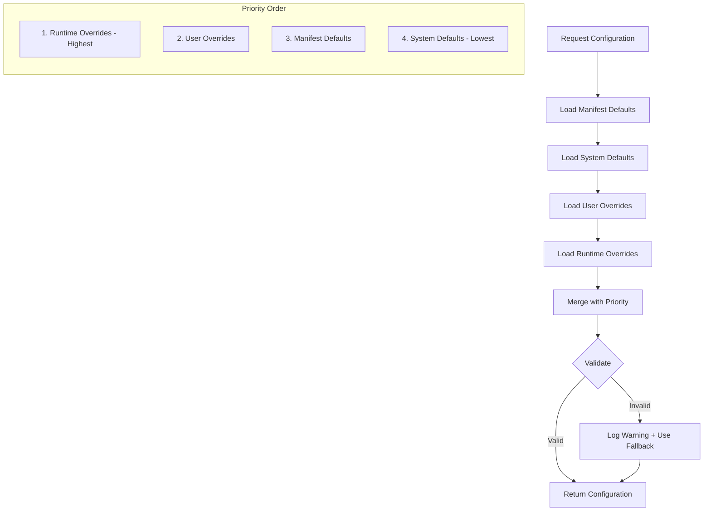
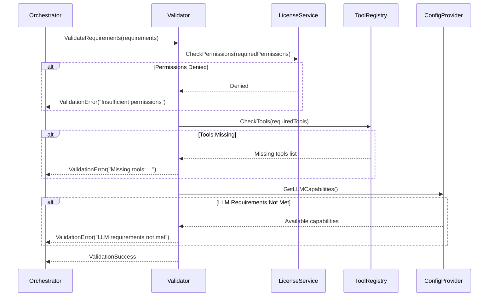

# LDS-01: Agent Configuration

## 1. Metadata & Categorization

| Field | Value |
| :--- | :--- |
| **Feature ID** | `AGT-CFG-01` |
| **Feature Name** | Agent Configuration |
| **Target Version** | `v0.12.1c` |
| **Module Scope** | `Lexichord.Modules.Agents.Abstractions` |
| **Swimlane** | Ensemble |
| **License Tier** | Core |
| **Feature Gate Key** | `FeatureFlags.Agents.Configuration` |
| **Author** | Agent Architecture Lead |
| **Reviewer** | Lead Architect |
| **Status** | Draft |
| **Last Updated** | 2026-02-03 |
| **Parent Spec** | [LCS-SBD-121-AGT](./LCS-SBD-v0.12.1-AGT.md) |
| **Depends On** | [v0.12.1a (Agent Schema)](./LCS-SBD-v0.12.1a-SCH.md) |
| **Estimated Hours** | 6 |

---

## 2. Executive Summary

### 2.1 The Requirement

Agents need to declare their resource requirements and behavioral constraints so the system can validate that requirements can be met before spawning, allocate appropriate resources, and enforce limits during execution. Without explicit configuration, agents may fail at runtime due to missing resources, exceed budgets, or behave unpredictably.

### 2.2 The Proposed Solution

Implement a comprehensive configuration system:
- `AgentRequirements` record declaring what an agent needs (LLM, memory, tools, permissions)
- `AgentConstraints` record defining behavioral limits (concurrency, duration, isolation)
- Nested requirement types for LLM and memory specifications
- `IAgentConfigurationProvider` for runtime configuration binding
- Permission enumeration for security model integration

---

## 3. Architecture & Modular Strategy

### 3.1 Dependencies

**Upstream Modules:**
- `Lexichord.Modules.Agents.Abstractions` — `AgentManifest` (v0.12.1a)
- `Lexichord.Host` — `ISettingsService`, `ILicenseService`

**NuGet Packages:**
- `Microsoft.Extensions.Options` (for configuration binding)

### 3.2 Licensing Behavior

- **Load Behavior:** [x] **Soft Gate** — Configuration types are Core; custom requirement presets require Teams.
- **Fallback Experience:** Core users use default configurations; custom presets show "Upgrade to Teams" prompt.

---

## 4. Data Contract (The API)

### 4.1 Agent Requirements

```csharp
namespace Lexichord.Modules.Agents.Abstractions;

/// <summary>
/// Declares what an agent needs to function.
/// The system validates these requirements can be met before spawning.
/// If requirements cannot be satisfied, the agent MUST NOT be created.
/// </summary>
public sealed record AgentRequirements
{
    /// <summary>
    /// LLM requirements (provider, model, context window, capabilities).
    /// Null indicates no LLM is required.
    /// </summary>
    public LLMRequirements? LLM { get; init; }

    /// <summary>
    /// Memory requirements (working memory, long-term memory, semantic search).
    /// Null uses system defaults.
    /// </summary>
    public MemoryRequirements? Memory { get; init; }

    /// <summary>
    /// Tool IDs this agent requires access to.
    /// All specified tools MUST be available or agent creation fails.
    /// </summary>
    public IReadOnlyList<string> RequiredTools { get; init; } = [];

    /// <summary>
    /// Permissions this agent needs.
    /// MUST be granted by the user or license before agent can operate.
    /// </summary>
    public IReadOnlyList<Permission> RequiredPermissions { get; init; } = [];

    /// <summary>
    /// Maximum time this agent should be allowed to run.
    /// Enforced by the orchestrator.
    /// </summary>
    public TimeSpan? MaxExecutionTime { get; init; }

    /// <summary>
    /// Maximum tokens this agent may consume in total.
    /// Enforced across all LLM calls.
    /// </summary>
    public int? MaxTokenBudget { get; init; }

    /// <summary>
    /// Other agent types this agent depends on.
    /// Specified agents MUST be registered in the system.
    /// </summary>
    public IReadOnlyList<string>? DependentAgents { get; init; }

    /// <summary>
    /// External services this agent needs (e.g., "github", "jira").
    /// Used for connectivity validation.
    /// </summary>
    public IReadOnlyList<string>? RequiredServices { get; init; }

    /// <summary>
    /// Default requirements for a simple agent.
    /// </summary>
    public static AgentRequirements Default => new()
    {
        LLM = LLMRequirements.Default,
        MaxExecutionTime = TimeSpan.FromMinutes(5),
        MaxTokenBudget = 50000
    };

    /// <summary>
    /// Requirements for an LLM-free agent.
    /// </summary>
    public static AgentRequirements NoLLM => new()
    {
        LLM = null,
        MaxExecutionTime = TimeSpan.FromMinutes(1)
    };
}
```

### 4.2 LLM Requirements

```csharp
namespace Lexichord.Modules.Agents.Abstractions;

/// <summary>
/// LLM-specific requirements for an agent.
/// </summary>
public sealed record LLMRequirements
{
    /// <summary>
    /// Supported LLM provider identifiers (e.g., "anthropic", "openai", "local").
    /// Empty list means any configured provider is acceptable.
    /// </summary>
    public IReadOnlyList<string> SupportedProviders { get; init; } = [];

    /// <summary>
    /// Minimum context window size in tokens.
    /// Agent creation fails if no available model meets this requirement.
    /// </summary>
    public int? MinContextWindow { get; init; }

    /// <summary>
    /// Whether the agent requires vision/image understanding capabilities.
    /// </summary>
    public bool RequiresVision { get; init; }

    /// <summary>
    /// Whether the agent requires tool use / function calling capabilities.
    /// </summary>
    public bool RequiresToolUse { get; init; }

    /// <summary>
    /// Whether the agent requires streaming response support.
    /// </summary>
    public bool RequiresStreaming { get; init; }

    /// <summary>
    /// Whether the agent requires extended thinking / chain-of-thought.
    /// </summary>
    public bool RequiresExtendedThinking { get; init; }

    /// <summary>
    /// Minimum model tier required.
    /// Used when specific model capabilities matter.
    /// </summary>
    public ModelTier? MinimumModelTier { get; init; }

    /// <summary>
    /// Specific model identifiers that are acceptable.
    /// If specified, ONLY these models may be used.
    /// </summary>
    public IReadOnlyList<string>? AllowedModels { get; init; }

    /// <summary>
    /// Preferred temperature setting (0.0 - 2.0).
    /// </summary>
    public float? PreferredTemperature { get; init; }

    /// <summary>
    /// Default LLM requirements suitable for most agents.
    /// </summary>
    public static LLMRequirements Default => new()
    {
        MinContextWindow = 100000,
        RequiresToolUse = true
    };

    /// <summary>
    /// Requirements for a code-focused agent.
    /// </summary>
    public static LLMRequirements ForCoding => new()
    {
        MinContextWindow = 200000,
        RequiresToolUse = true,
        MinimumModelTier = ModelTier.Advanced,
        PreferredTemperature = 0.2f
    };

    /// <summary>
    /// Requirements for a creative writing agent.
    /// </summary>
    public static LLMRequirements ForCreative => new()
    {
        MinContextWindow = 100000,
        PreferredTemperature = 0.8f
    };
}

/// <summary>
/// Model capability tiers.
/// </summary>
public enum ModelTier
{
    /// <summary>Fast, cost-effective models for simple tasks.</summary>
    Basic = 0,

    /// <summary>Balanced models for general use.</summary>
    Standard = 1,

    /// <summary>High-capability models for complex reasoning.</summary>
    Advanced = 2,

    /// <summary>Frontier models with maximum capability.</summary>
    Frontier = 3
}
```

### 4.3 Memory Requirements

```csharp
namespace Lexichord.Modules.Agents.Abstractions;

/// <summary>
/// Memory requirements for an agent.
/// </summary>
public sealed record MemoryRequirements
{
    /// <summary>
    /// Whether the agent needs working memory (scratchpad).
    /// </summary>
    public bool RequiresWorkingMemory { get; init; }

    /// <summary>
    /// Whether the agent needs persistent long-term memory.
    /// </summary>
    public bool RequiresLongTermMemory { get; init; }

    /// <summary>
    /// Minimum working memory size in bytes.
    /// Default: 1MB.
    /// </summary>
    public long MinWorkingMemoryBytes { get; init; } = 1024 * 1024;

    /// <summary>
    /// Minimum long-term memory allocation in bytes.
    /// Default: 10MB.
    /// </summary>
    public long MinLongTermMemoryBytes { get; init; } = 10 * 1024 * 1024;

    /// <summary>
    /// Whether semantic search over memory is needed.
    /// Requires vector storage infrastructure.
    /// </summary>
    public bool RequiresSemanticSearch { get; init; }

    /// <summary>
    /// Whether memory should persist across sessions.
    /// </summary>
    public bool RequiresPersistence { get; init; }

    /// <summary>
    /// Whether memory should be shared with child agents.
    /// </summary>
    public bool ShareWithChildren { get; init; }

    /// <summary>
    /// Default memory requirements.
    /// </summary>
    public static MemoryRequirements Default => new()
    {
        RequiresWorkingMemory = true,
        RequiresLongTermMemory = false
    };

    /// <summary>
    /// Requirements for a research agent with persistent memory.
    /// </summary>
    public static MemoryRequirements ForResearch => new()
    {
        RequiresWorkingMemory = true,
        RequiresLongTermMemory = true,
        RequiresSemanticSearch = true,
        RequiresPersistence = true,
        MinLongTermMemoryBytes = 100 * 1024 * 1024
    };
}
```

### 4.4 Agent Constraints

```csharp
namespace Lexichord.Modules.Agents.Abstractions;

/// <summary>
/// Behavioral constraints and limits for an agent.
/// Enforced by the orchestrator during execution.
/// </summary>
public sealed record AgentConstraints
{
    /// <summary>
    /// Maximum concurrent requests this agent can handle.
    /// Used for load balancing and resource allocation.
    /// </summary>
    public int MaxConcurrentRequests { get; init; } = 1;

    /// <summary>
    /// Maximum time for a single request.
    /// Individual requests exceeding this are cancelled.
    /// </summary>
    public TimeSpan MaxRequestDuration { get; init; } = TimeSpan.FromMinutes(5);

    /// <summary>
    /// Maximum tokens per individual request.
    /// </summary>
    public int? MaxTokensPerRequest { get; init; }

    /// <summary>
    /// Maximum output size in bytes for any single response.
    /// </summary>
    public long? MaxOutputSizeBytes { get; init; }

    /// <summary>
    /// Whether this agent can spawn child agents.
    /// </summary>
    public bool CanSpawnAgents { get; init; }

    /// <summary>
    /// Maximum child agents this agent can spawn.
    /// Only relevant if CanSpawnAgents is true.
    /// </summary>
    public int? MaxChildAgents { get; init; }

    /// <summary>
    /// Maximum depth of agent hierarchy.
    /// Prevents runaway recursive spawning.
    /// </summary>
    public int? MaxAgentDepth { get; init; }

    /// <summary>
    /// Whether this agent can access external networks.
    /// </summary>
    public bool CanAccessNetwork { get; init; }

    /// <summary>
    /// Allowed network destinations (domains/IPs).
    /// Only relevant if CanAccessNetwork is true.
    /// </summary>
    public IReadOnlyList<string>? AllowedNetworkDestinations { get; init; }

    /// <summary>
    /// Whether this agent can access the file system.
    /// </summary>
    public bool CanAccessFileSystem { get; init; }

    /// <summary>
    /// Allowed file system paths (globs supported).
    /// Only relevant if CanAccessFileSystem is true.
    /// </summary>
    public IReadOnlyList<string>? AllowedFilePaths { get; init; }

    /// <summary>
    /// Required isolation level for this agent.
    /// </summary>
    public IsolationLevel RequiredIsolation { get; init; } = IsolationLevel.Shared;

    /// <summary>
    /// Whether failures should be retried automatically.
    /// </summary>
    public bool EnableAutoRetry { get; init; } = true;

    /// <summary>
    /// Maximum retry attempts for transient failures.
    /// </summary>
    public int MaxRetryAttempts { get; init; } = 3;

    /// <summary>
    /// Default constraints for a simple agent.
    /// </summary>
    public static AgentConstraints Default => new();

    /// <summary>
    /// Restrictive constraints for untrusted agents.
    /// </summary>
    public static AgentConstraints Sandboxed => new()
    {
        MaxConcurrentRequests = 1,
        MaxRequestDuration = TimeSpan.FromMinutes(1),
        MaxTokensPerRequest = 10000,
        CanSpawnAgents = false,
        CanAccessNetwork = false,
        CanAccessFileSystem = false,
        RequiredIsolation = IsolationLevel.Sandboxed
    };
}

/// <summary>
/// Isolation levels for agent execution.
/// </summary>
public enum IsolationLevel
{
    /// <summary>
    /// Shares resources with other agents in the same session.
    /// Lowest overhead, suitable for trusted agents.
    /// </summary>
    Shared = 0,

    /// <summary>
    /// Dedicated resource allocation, no sharing.
    /// Medium overhead, recommended for most agents.
    /// </summary>
    Isolated = 1,

    /// <summary>
    /// Maximum isolation for untrusted or high-risk agents.
    /// Runs in separate process/container with restricted capabilities.
    /// </summary>
    Sandboxed = 2
}
```

### 4.5 Permissions

```csharp
namespace Lexichord.Modules.Agents.Abstractions;

/// <summary>
/// Permissions that agents may require.
/// Maps to the authorization system in v0.11.1-SEC.
/// </summary>
[Flags]
public enum Permission
{
    /// <summary>No special permissions.</summary>
    None = 0,

    /// <summary>Read files from the file system.</summary>
    ReadFiles = 1 << 0,

    /// <summary>Write files to the file system.</summary>
    WriteFiles = 1 << 1,

    /// <summary>Delete files from the file system.</summary>
    DeleteFiles = 1 << 2,

    /// <summary>Execute shell commands.</summary>
    ExecuteCommands = 1 << 3,

    /// <summary>Access the knowledge base / RAG system.</summary>
    ReadKnowledge = 1 << 4,

    /// <summary>Modify the knowledge base.</summary>
    WriteKnowledge = 1 << 5,

    /// <summary>Make outbound HTTP requests.</summary>
    NetworkAccess = 1 << 6,

    /// <summary>Access Git repositories.</summary>
    GitAccess = 1 << 7,

    /// <summary>Read user preferences and settings.</summary>
    ReadSettings = 1 << 8,

    /// <summary>Modify user preferences and settings.</summary>
    WriteSettings = 1 << 9,

    /// <summary>Spawn child agents.</summary>
    SpawnAgents = 1 << 10,

    /// <summary>Access sensitive data (API keys, credentials).</summary>
    AccessSecrets = 1 << 11,

    /// <summary>Access clipboard.</summary>
    ClipboardAccess = 1 << 12,

    /// <summary>Send notifications to user.</summary>
    SendNotifications = 1 << 13,

    /// <summary>Access browser automation.</summary>
    BrowserAutomation = 1 << 14,

    /// <summary>Full file system access (read + write + delete).</summary>
    FullFileAccess = ReadFiles | WriteFiles | DeleteFiles,

    /// <summary>Full knowledge base access.</summary>
    FullKnowledgeAccess = ReadKnowledge | WriteKnowledge
}

/// <summary>
/// Extension methods for Permission.
/// </summary>
public static class PermissionExtensions
{
    /// <summary>
    /// Gets a human-readable description of a permission.
    /// </summary>
    public static string GetDescription(this Permission permission) => permission switch
    {
        Permission.ReadFiles => "Read files from your computer",
        Permission.WriteFiles => "Create and modify files",
        Permission.DeleteFiles => "Delete files",
        Permission.ExecuteCommands => "Run shell commands",
        Permission.ReadKnowledge => "Search your knowledge base",
        Permission.WriteKnowledge => "Add to your knowledge base",
        Permission.NetworkAccess => "Connect to the internet",
        Permission.GitAccess => "Access Git repositories",
        Permission.ReadSettings => "Read your preferences",
        Permission.WriteSettings => "Change your preferences",
        Permission.SpawnAgents => "Create sub-agents",
        Permission.AccessSecrets => "Access stored credentials",
        Permission.ClipboardAccess => "Use the clipboard",
        Permission.SendNotifications => "Send you notifications",
        Permission.BrowserAutomation => "Control web browsers",
        _ => permission.ToString()
    };

    /// <summary>
    /// Gets the risk level of a permission.
    /// </summary>
    public static PermissionRisk GetRiskLevel(this Permission permission) => permission switch
    {
        Permission.ReadFiles => PermissionRisk.Low,
        Permission.ReadKnowledge => PermissionRisk.Low,
        Permission.ReadSettings => PermissionRisk.Low,
        Permission.SendNotifications => PermissionRisk.Low,

        Permission.WriteFiles => PermissionRisk.Medium,
        Permission.WriteKnowledge => PermissionRisk.Medium,
        Permission.NetworkAccess => PermissionRisk.Medium,
        Permission.GitAccess => PermissionRisk.Medium,
        Permission.SpawnAgents => PermissionRisk.Medium,
        Permission.ClipboardAccess => PermissionRisk.Medium,

        Permission.DeleteFiles => PermissionRisk.High,
        Permission.ExecuteCommands => PermissionRisk.High,
        Permission.WriteSettings => PermissionRisk.High,
        Permission.AccessSecrets => PermissionRisk.High,
        Permission.BrowserAutomation => PermissionRisk.High,

        _ => PermissionRisk.Medium
    };
}

/// <summary>
/// Risk levels for permissions.
/// </summary>
public enum PermissionRisk
{
    /// <summary>Read-only or informational permissions.</summary>
    Low,

    /// <summary>Can modify data but with limited scope.</summary>
    Medium,

    /// <summary>Can cause significant changes or access sensitive data.</summary>
    High
}
```

### 4.6 Configuration Provider

```csharp
namespace Lexichord.Modules.Agents.Abstractions;

/// <summary>
/// Provides configuration values for agent instances.
/// Merges manifest defaults, user overrides, and runtime settings.
/// </summary>
public interface IAgentConfigurationProvider
{
    /// <summary>
    /// Gets the effective configuration for an agent type.
    /// </summary>
    /// <param name="agentName">The agent type name.</param>
    /// <param name="ct">Cancellation token.</param>
    /// <returns>Merged configuration dictionary.</returns>
    Task<IReadOnlyDictionary<string, object>> GetConfigurationAsync(
        string agentName,
        CancellationToken ct = default);

    /// <summary>
    /// Gets a specific configuration value.
    /// </summary>
    /// <typeparam name="T">The expected value type.</typeparam>
    /// <param name="agentName">The agent type name.</param>
    /// <param name="key">The configuration key.</param>
    /// <param name="defaultValue">Default if not found.</param>
    /// <param name="ct">Cancellation token.</param>
    Task<T> GetValueAsync<T>(
        string agentName,
        string key,
        T defaultValue,
        CancellationToken ct = default);

    /// <summary>
    /// Sets a user override for an agent configuration value.
    /// </summary>
    /// <param name="agentName">The agent type name.</param>
    /// <param name="key">The configuration key.</param>
    /// <param name="value">The override value.</param>
    /// <param name="ct">Cancellation token.</param>
    Task SetOverrideAsync(
        string agentName,
        string key,
        object value,
        CancellationToken ct = default);

    /// <summary>
    /// Clears a user override, reverting to default.
    /// </summary>
    Task ClearOverrideAsync(
        string agentName,
        string key,
        CancellationToken ct = default);

    /// <summary>
    /// Gets the effective requirements for an agent type.
    /// </summary>
    Task<AgentRequirements> GetEffectiveRequirementsAsync(
        string agentName,
        CancellationToken ct = default);

    /// <summary>
    /// Gets the effective constraints for an agent type.
    /// </summary>
    Task<AgentConstraints> GetEffectiveConstraintsAsync(
        string agentName,
        CancellationToken ct = default);
}
```

---

## 5. Implementation Logic

### 5.1 Configuration Resolution Flow



### 5.2 Requirement Validation Sequence



---

## 6. Data Persistence (Database)

Configuration overrides are stored in the settings database:

```sql
-- Agent configuration overrides table
CREATE TABLE agent_config_overrides (
    id UUID PRIMARY KEY DEFAULT gen_random_uuid(),
    user_id UUID NOT NULL REFERENCES users(id),
    agent_name VARCHAR(100) NOT NULL,
    config_key VARCHAR(200) NOT NULL,
    config_value JSONB NOT NULL,
    created_at TIMESTAMPTZ NOT NULL DEFAULT NOW(),
    updated_at TIMESTAMPTZ NOT NULL DEFAULT NOW(),

    UNIQUE(user_id, agent_name, config_key)
);

CREATE INDEX idx_agent_config_user ON agent_config_overrides(user_id);
CREATE INDEX idx_agent_config_agent ON agent_config_overrides(agent_name);
```

---

## 7. UI/UX Specifications

See [v0.12.1f (Agent Definition UI)](./LCS-SBD-v0.12.1f-UI.md) for configuration editing UI.

---

## 8. Observability & Logging

### 8.1 Log Templates

| Level | Template |
|:------|:---------|
| **Debug** | `[CFG] Loaded configuration for agent {AgentName}. Keys: {KeyCount}` |
| **Debug** | `[CFG] Applied user override: {AgentName}.{Key} = {Value}` |
| **Info** | `[CFG] Requirements validated for {AgentName}. Duration: {Ms}ms` |
| **Warn** | `[CFG] Invalid configuration value for {AgentName}.{Key}. Using default.` |
| **Warn** | `[CFG] Permission {Permission} not granted for agent {AgentName}` |

### 8.2 Metrics

| Metric | Type | Description |
|:-------|:-----|:------------|
| `config.load.duration` | Histogram | Configuration load time |
| `config.validation.duration` | Histogram | Requirement validation time |
| `config.overrides.count` | Gauge | Active user overrides |
| `config.permission.denied` | Counter | Permission denials |

---

## 9. Security & Safety

- **PII Risk:** Low — Configuration does not contain user content.
- **Credential Risk:** Medium — `AccessSecrets` permission must be carefully guarded.
- **Elevation Risk:** Permissions are validated against user's granted permissions; agents cannot elevate.
- **Override Validation:** All configuration overrides are validated against schema.

---

## 10. Acceptance Criteria (QA)

1. **[Functional]** `AgentRequirements.Default` provides sensible defaults for typical agents.
2. **[Functional]** `Permission` flags compose correctly with bitwise operations.
3. **[Functional]** `IAgentConfigurationProvider` merges sources in correct priority order.
4. **[Functional]** Configuration overrides persist across sessions.
5. **[Licensing]** `AccessSecrets` permission requires Teams license or higher.
6. **[Security]** Agents cannot request permissions not granted to the user.
7. **[Performance]** Configuration loading completes in <10ms.
8. **[Edge Case]** Missing configuration keys return defaults without error.

---

## 11. Test Scenarios

### 11.1 Unit Tests

**Scenario: `Permission_BitwiseCombination_Works`**
- **Setup:** None.
- **Action:** Combine `ReadFiles | WriteFiles`.
- **Assertion:** Result equals `FullFileAccess & ~DeleteFiles` equivalent.

**Scenario: `LLMRequirements_Default_HasReasonableValues`**
- **Setup:** None.
- **Action:** Check `LLMRequirements.Default`.
- **Assertion:** `MinContextWindow >= 100000`, `RequiresToolUse == true`.

**Scenario: `AgentConstraints_Sandboxed_IsRestrictive`**
- **Setup:** None.
- **Action:** Check `AgentConstraints.Sandboxed`.
- **Assertion:** `CanAccessNetwork == false`, `CanAccessFileSystem == false`, `CanSpawnAgents == false`.

### 11.2 Integration Tests

**Scenario: `ConfigurationProvider_MergesPrioritiesCorrectly`**
- **Setup:** Manifest default "timeout=300", User override "timeout=600".
- **Action:** Call `GetConfigurationAsync()`.
- **Assertion:** Returns "timeout=600" (user override wins).

**Scenario: `ConfigurationProvider_PersistsOverrides`**
- **Setup:** Set override, restart application.
- **Action:** Load configuration.
- **Assertion:** Override is still applied.
