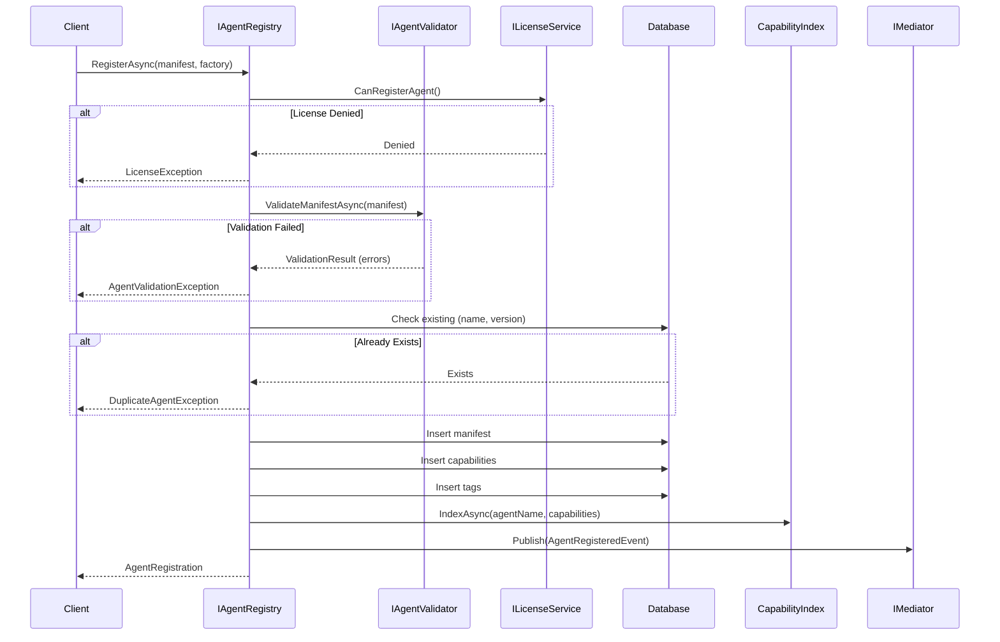
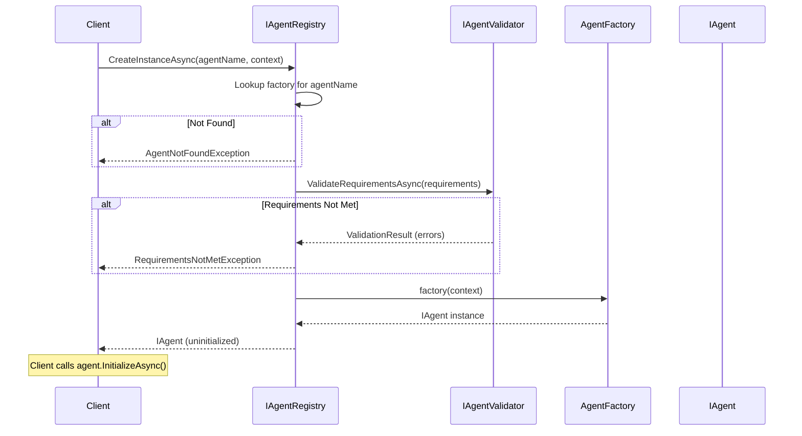

# LDS-01: Agent Registry

## 1. Metadata & Categorization

| Field | Value |
| :--- | :--- |
| **Feature ID** | `AGT-REG-01` |
| **Feature Name** | Agent Registry |
| **Target Version** | `v0.12.1d` |
| **Module Scope** | `Lexichord.Modules.Agents` |
| **Swimlane** | Ensemble |
| **License Tier** | Core (read), Teams (custom registration) |
| **Feature Gate Key** | `FeatureFlags.Agents.Registry` |
| **Author** | Agent Architecture Lead |
| **Reviewer** | Lead Architect |
| **Status** | Draft |
| **Last Updated** | 2026-02-03 |
| **Parent Spec** | [LCS-SBD-121-AGT](./LCS-SBD-v0.12.1-AGT.md) |
| **Depends On** | [v0.12.1a](./LCS-SBD-v0.12.1a-SCH.md), [v0.12.1b](./LCS-SBD-v0.12.1b-CAP.md) |
| **Estimated Hours** | 10 |

---

## 2. Executive Summary

### 2.1 The Requirement

The system needs a central registry to store, discover, and manage agent definitions. Without a registry, agents cannot be discovered, versioning is impossible, and there's no way to create agent instances on demand. The registry must support CRUD operations, capability-based search, and efficient lookups.

### 2.2 The Proposed Solution

Implement a comprehensive agent registry:
- `IAgentRegistry` interface with full CRUD operations
- PostgreSQL persistence for agent manifests and capabilities
- In-memory capability index for <50ms lookups
- `AgentFactory` delegate pattern for instance creation
- Multi-criteria search with pagination
- MediatR events for registry changes

---

## 3. Architecture & Modular Strategy

### 3.1 Dependencies

**Upstream Modules:**
- `Lexichord.Modules.Agents.Abstractions` — All agent types (v0.12.1a, v0.12.1b)
- `Lexichord.Host` — `IMediator`, Database infrastructure

**NuGet Packages:**
- `Npgsql.EntityFrameworkCore.PostgreSQL`
- `MediatR`
- `FluentMigrator`

### 3.2 Licensing Behavior

- **Load Behavior:** [x] **Soft Gate** — Registry reads are Core; custom agent registration requires Teams.
- **Fallback Experience:**
  - Core: Can browse built-in agents, cannot register custom agents
  - Teams: Can register up to 10 custom agents
  - Enterprise: Unlimited custom agents

---

## 4. Data Contract (The API)

### 4.1 Agent Registry Interface

```csharp
namespace Lexichord.Modules.Agents.Abstractions;

/// <summary>
/// Central registry for discovering and managing agent definitions.
/// All agent types MUST be registered here before instances can be created.
/// </summary>
public interface IAgentRegistry
{
    /// <summary>
    /// Register a new agent type with the system.
    /// </summary>
    /// <param name="manifest">The agent's declarative manifest.</param>
    /// <param name="factory">Factory for creating agent instances.</param>
    /// <param name="ct">Cancellation token.</param>
    /// <returns>Registration result with agent metadata.</returns>
    /// <exception cref="AgentValidationException">Manifest validation failed.</exception>
    /// <exception cref="DuplicateAgentException">Agent with same name+version exists.</exception>
    /// <exception cref="LicenseException">License does not permit registration.</exception>
    Task<AgentRegistration> RegisterAsync(
        AgentManifest manifest,
        AgentFactory factory,
        CancellationToken ct = default);

    /// <summary>
    /// Unregister an agent type from the system.
    /// Running instances are not affected.
    /// </summary>
    /// <param name="agentName">The agent's unique name.</param>
    /// <param name="ct">Cancellation token.</param>
    /// <exception cref="AgentNotFoundException">Agent not found.</exception>
    Task UnregisterAsync(
        string agentName,
        CancellationToken ct = default);

    /// <summary>
    /// Get the manifest for the latest version of an agent.
    /// </summary>
    /// <param name="agentName">The agent's unique name.</param>
    /// <param name="ct">Cancellation token.</param>
    /// <returns>The manifest, or null if not found.</returns>
    Task<AgentManifest?> GetManifestAsync(
        string agentName,
        CancellationToken ct = default);

    /// <summary>
    /// Get the manifest for a specific version of an agent.
    /// </summary>
    /// <param name="agentName">The agent's unique name.</param>
    /// <param name="version">Semantic version string.</param>
    /// <param name="ct">Cancellation token.</param>
    /// <returns>The manifest, or null if not found.</returns>
    Task<AgentManifest?> GetManifestAsync(
        string agentName,
        string version,
        CancellationToken ct = default);

    /// <summary>
    /// Find agents matching capability requirements.
    /// </summary>
    /// <param name="query">The capability query.</param>
    /// <param name="ct">Cancellation token.</param>
    /// <returns>Matching manifests sorted by relevance.</returns>
    Task<IReadOnlyList<AgentManifest>> FindByCapabilityAsync(
        CapabilityQuery query,
        CancellationToken ct = default);

    /// <summary>
    /// Search agents by various criteria.
    /// </summary>
    /// <param name="query">The search query.</param>
    /// <param name="ct">Cancellation token.</param>
    /// <returns>Matching manifests with pagination info.</returns>
    Task<SearchResult<AgentManifest>> SearchAsync(
        AgentSearchQuery query,
        CancellationToken ct = default);

    /// <summary>
    /// Get all registered agents.
    /// </summary>
    /// <param name="ct">Cancellation token.</param>
    /// <returns>Async enumerable of all manifests.</returns>
    IAsyncEnumerable<AgentManifest> GetAllAsync(
        CancellationToken ct = default);

    /// <summary>
    /// Check if an agent is registered.
    /// </summary>
    /// <param name="agentName">The agent's unique name.</param>
    /// <param name="ct">Cancellation token.</param>
    Task<bool> ExistsAsync(
        string agentName,
        CancellationToken ct = default);

    /// <summary>
    /// Create an instance of a registered agent.
    /// </summary>
    /// <param name="agentName">The agent's unique name.</param>
    /// <param name="context">Runtime context for the agent.</param>
    /// <param name="ct">Cancellation token.</param>
    /// <returns>A new, uninitialized agent instance.</returns>
    /// <exception cref="AgentNotFoundException">Agent not registered.</exception>
    Task<IAgent> CreateInstanceAsync(
        string agentName,
        AgentContext context,
        CancellationToken ct = default);

    /// <summary>
    /// Get registry statistics.
    /// </summary>
    Task<RegistryStatistics> GetStatisticsAsync(
        CancellationToken ct = default);
}

/// <summary>
/// Factory delegate for creating agent instances.
/// </summary>
/// <param name="context">The agent's runtime context.</param>
/// <returns>A new agent instance (not yet initialized).</returns>
public delegate IAgent AgentFactory(AgentContext context);
```

### 4.2 Registration Result

```csharp
namespace Lexichord.Modules.Agents.Abstractions;

/// <summary>
/// Result of registering an agent with the registry.
/// </summary>
public sealed record AgentRegistration
{
    /// <summary>
    /// The registered agent's name.
    /// </summary>
    public required string AgentName { get; init; }

    /// <summary>
    /// The registered version.
    /// </summary>
    public required string Version { get; init; }

    /// <summary>
    /// When the agent was registered.
    /// </summary>
    public required DateTimeOffset RegisteredAt { get; init; }

    /// <summary>
    /// Internal database ID.
    /// </summary>
    public required Guid RegistrationId { get; init; }

    /// <summary>
    /// Non-fatal warnings from registration (e.g., deprecated features used).
    /// </summary>
    public IReadOnlyList<string> Warnings { get; init; } = [];

    /// <summary>
    /// Whether this replaced a previous version.
    /// </summary>
    public bool ReplacedPreviousVersion { get; init; }

    /// <summary>
    /// Previous version if replaced.
    /// </summary>
    public string? PreviousVersion { get; init; }
}
```

### 4.3 Search Query

```csharp
namespace Lexichord.Modules.Agents.Abstractions;

/// <summary>
/// Multi-criteria search query for agents.
/// </summary>
public sealed record AgentSearchQuery
{
    /// <summary>
    /// Pattern to match against agent name (supports * wildcard).
    /// </summary>
    public string? NamePattern { get; init; }

    /// <summary>
    /// Filter by agent behavioral types.
    /// </summary>
    public IReadOnlyList<AgentType>? Types { get; init; }

    /// <summary>
    /// Filter by capability categories.
    /// </summary>
    public IReadOnlyList<CapabilityCategory>? Categories { get; init; }

    /// <summary>
    /// Filter by tags (all specified tags must be present).
    /// </summary>
    public IReadOnlyDictionary<string, string>? RequiredTags { get; init; }

    /// <summary>
    /// Filter by author.
    /// </summary>
    public string? Author { get; init; }

    /// <summary>
    /// Free-text search across name, description, and capabilities.
    /// </summary>
    public string? SearchText { get; init; }

    /// <summary>
    /// Include only built-in agents.
    /// </summary>
    public bool? BuiltInOnly { get; init; }

    /// <summary>
    /// Include only licensed agents (excludes unlicensed for current user).
    /// </summary>
    public bool? LicensedOnly { get; init; }

    /// <summary>
    /// Minimum required version.
    /// </summary>
    public string? MinVersion { get; init; }

    /// <summary>
    /// Maximum results to return.
    /// </summary>
    public int Limit { get; init; } = 50;

    /// <summary>
    /// Results to skip for pagination.
    /// </summary>
    public int Offset { get; init; }

    /// <summary>
    /// Sort order for results.
    /// </summary>
    public AgentSortOrder SortBy { get; init; } = AgentSortOrder.NameAscending;

    /// <summary>
    /// Empty query matching all agents.
    /// </summary>
    public static AgentSearchQuery All => new();
}

/// <summary>
/// Sort orders for agent search.
/// </summary>
public enum AgentSortOrder
{
    NameAscending,
    NameDescending,
    RegisteredAtDescending,
    RegisteredAtAscending,
    TypeThenName,
    Relevance
}

/// <summary>
/// Paginated search result.
/// </summary>
public sealed record SearchResult<T>
{
    /// <summary>
    /// The items in this page.
    /// </summary>
    public required IReadOnlyList<T> Items { get; init; }

    /// <summary>
    /// Total count across all pages.
    /// </summary>
    public required int TotalCount { get; init; }

    /// <summary>
    /// Current page offset.
    /// </summary>
    public required int Offset { get; init; }

    /// <summary>
    /// Page size limit.
    /// </summary>
    public required int Limit { get; init; }

    /// <summary>
    /// Whether there are more results.
    /// </summary>
    public bool HasMore => Offset + Items.Count < TotalCount;
}
```

### 4.4 Registry Statistics

```csharp
namespace Lexichord.Modules.Agents.Abstractions;

/// <summary>
/// Statistics about the agent registry.
/// </summary>
public sealed record RegistryStatistics
{
    /// <summary>
    /// Total registered agent types.
    /// </summary>
    public required int TotalAgents { get; init; }

    /// <summary>
    /// Built-in (system) agents.
    /// </summary>
    public required int BuiltInAgents { get; init; }

    /// <summary>
    /// Custom (user-registered) agents.
    /// </summary>
    public required int CustomAgents { get; init; }

    /// <summary>
    /// Total unique capabilities.
    /// </summary>
    public required int TotalCapabilities { get; init; }

    /// <summary>
    /// Agents by type.
    /// </summary>
    public required IReadOnlyDictionary<AgentType, int> AgentsByType { get; init; }

    /// <summary>
    /// Capabilities by category.
    /// </summary>
    public required IReadOnlyDictionary<CapabilityCategory, int> CapabilitiesByCategory { get; init; }

    /// <summary>
    /// When the registry was last modified.
    /// </summary>
    public required DateTimeOffset LastModified { get; init; }
}
```

---

## 5. Implementation Logic

### 5.1 Registration Flow



### 5.2 Instance Creation Flow



---

## 6. Data Persistence (Database)

### 6.1 FluentMigrator Migration

```csharp
[Migration(20260203_1200, "Create agent registry tables")]
public class CreateAgentRegistryTables : Migration
{
    public override void Up()
    {
        Create.Table("agent_manifests")
            .WithColumn("id").AsGuid().PrimaryKey().WithDefault(SystemMethods.NewGuid)
            .WithColumn("name").AsString(100).NotNullable()
            .WithColumn("version").AsString(50).NotNullable()
            .WithColumn("display_name").AsString(200).Nullable()
            .WithColumn("description").AsString(int.MaxValue).Nullable()
            .WithColumn("agent_type").AsString(50).NotNullable()
            .WithColumn("author").AsString(200).Nullable()
            .WithColumn("license").AsString(100).Nullable()
            .WithColumn("homepage_url").AsString(500).Nullable()
            .WithColumn("repository_url").AsString(500).Nullable()
            .WithColumn("manifest_json").AsString(int.MaxValue).NotNullable()
            .WithColumn("is_builtin").AsBoolean().NotNullable().WithDefaultValue(false)
            .WithColumn("created_at").AsDateTimeOffset().NotNullable().WithDefault(SystemMethods.CurrentUTCDateTime)
            .WithColumn("updated_at").AsDateTimeOffset().NotNullable().WithDefault(SystemMethods.CurrentUTCDateTime);

        Create.UniqueConstraint("uq_agent_manifests_name_version")
            .OnTable("agent_manifests")
            .Columns("name", "version");

        Create.Index("idx_agent_manifests_name")
            .OnTable("agent_manifests")
            .OnColumn("name");

        Create.Index("idx_agent_manifests_type")
            .OnTable("agent_manifests")
            .OnColumn("agent_type");

        Create.Table("agent_capabilities")
            .WithColumn("id").AsGuid().PrimaryKey().WithDefault(SystemMethods.NewGuid)
            .WithColumn("agent_manifest_id").AsGuid().NotNullable()
                .ForeignKey("fk_capabilities_manifest", "agent_manifests", "id")
                .OnDelete(Rule.Cascade)
            .WithColumn("capability_id").AsString(100).NotNullable()
            .WithColumn("capability_name").AsString(200).NotNullable()
            .WithColumn("category").AsString(50).NotNullable()
            .WithColumn("quality_score").AsFloat().NotNullable().WithDefaultValue(0.8)
            .WithColumn("input_types").AsString(int.MaxValue).Nullable()
            .WithColumn("output_types").AsString(int.MaxValue).Nullable()
            .WithColumn("metadata").AsString(int.MaxValue).Nullable();

        Create.UniqueConstraint("uq_agent_capabilities")
            .OnTable("agent_capabilities")
            .Columns("agent_manifest_id", "capability_id");

        Create.Index("idx_capabilities_category")
            .OnTable("agent_capabilities")
            .OnColumn("category");

        Create.Index("idx_capabilities_id")
            .OnTable("agent_capabilities")
            .OnColumn("capability_id");

        Create.Table("agent_tags")
            .WithColumn("agent_manifest_id").AsGuid().NotNullable()
                .ForeignKey("fk_tags_manifest", "agent_manifests", "id")
                .OnDelete(Rule.Cascade)
            .WithColumn("tag_key").AsString(100).NotNullable()
            .WithColumn("tag_value").AsString(500).NotNullable();

        Create.PrimaryKey("pk_agent_tags")
            .OnTable("agent_tags")
            .Columns("agent_manifest_id", "tag_key");

        Create.Index("idx_tags_key")
            .OnTable("agent_tags")
            .OnColumn("tag_key");
    }

    public override void Down()
    {
        Delete.Table("agent_tags");
        Delete.Table("agent_capabilities");
        Delete.Table("agent_manifests");
    }
}
```

### 6.2 Entity Framework Entities

```csharp
namespace Lexichord.Modules.Agents.Persistence;

[Table("agent_manifests")]
public class AgentManifestEntity
{
    [Key]
    public Guid Id { get; set; }

    [Required, MaxLength(100)]
    public string Name { get; set; } = string.Empty;

    [Required, MaxLength(50)]
    public string Version { get; set; } = string.Empty;

    [MaxLength(200)]
    public string? DisplayName { get; set; }

    public string? Description { get; set; }

    [Required, MaxLength(50)]
    public string AgentType { get; set; } = string.Empty;

    [MaxLength(200)]
    public string? Author { get; set; }

    [MaxLength(100)]
    public string? License { get; set; }

    [MaxLength(500)]
    public string? HomepageUrl { get; set; }

    [MaxLength(500)]
    public string? RepositoryUrl { get; set; }

    [Required]
    public string ManifestJson { get; set; } = string.Empty;

    public bool IsBuiltin { get; set; }

    public DateTimeOffset CreatedAt { get; set; }

    public DateTimeOffset UpdatedAt { get; set; }

    public ICollection<AgentCapabilityEntity> Capabilities { get; set; } = [];

    public ICollection<AgentTagEntity> Tags { get; set; } = [];
}
```

---

## 7. UI/UX Specifications

See [v0.12.1f (Agent Definition UI)](./LCS-SBD-v0.12.1f-UI.md) for registry browsing UI.

---

## 8. Observability & Logging

### 8.1 Log Templates

| Level | Template |
|:------|:---------|
| **Info** | `[REG] Registered agent {AgentName} v{Version}. Id: {RegistrationId}` |
| **Info** | `[REG] Unregistered agent {AgentName}` |
| **Info** | `[REG] Created instance of {AgentName}. AgentId: {AgentId}` |
| **Debug** | `[REG] Search query: {Query}. Results: {Count}. Duration: {Ms}ms` |
| **Warn** | `[REG] Registration failed for {AgentName}: {Reason}` |
| **Warn** | `[REG] Instance creation failed for {AgentName}: {Reason}` |

### 8.2 Metrics

| Metric | Type | Description |
|:-------|:-----|:------------|
| `registry.agents.total` | Gauge | Total registered agents |
| `registry.agents.builtin` | Gauge | Built-in agents |
| `registry.agents.custom` | Gauge | Custom agents |
| `registry.register.duration` | Histogram | Registration time |
| `registry.search.duration` | Histogram | Search query time |
| `registry.create.duration` | Histogram | Instance creation time |
| `registry.create.count` | Counter | Instances created |

---

## 9. Security & Safety

- **Authorization:** Registration requires `Agents.Register` permission.
- **License Enforcement:** Custom agent limits enforced per license tier.
- **Manifest Sanitization:** All manifest content is validated and sanitized.
- **Factory Isolation:** Factories are invoked in isolated context.

---

## 10. Acceptance Criteria (QA)

1. **[Functional]** Agents can be registered with valid manifests.
2. **[Functional]** Duplicate name+version combinations are rejected.
3. **[Functional]** `FindByCapabilityAsync` returns matching agents.
4. **[Functional]** `SearchAsync` supports all filter criteria.
5. **[Functional]** `CreateInstanceAsync` returns working agent instances.
6. **[Performance]** `GetManifestAsync` completes in <10ms.
7. **[Performance]** `FindByCapabilityAsync` completes in <50ms.
8. **[Performance]** `SearchAsync` completes in <100ms.
9. **[Licensing]** Core users cannot register custom agents.
10. **[Licensing]** Teams users can register up to 10 custom agents.

---

## 11. Test Scenarios

### 11.1 Unit Tests

**Scenario: `Registry_Register_SucceedsWithValidManifest`**
- **Setup:** Valid `AgentManifest` and `AgentFactory`.
- **Action:** Call `RegisterAsync()`.
- **Assertion:** Returns `AgentRegistration` with correct values.

**Scenario: `Registry_Register_RejectsDuplicate`**
- **Setup:** Agent already registered.
- **Action:** Register same name+version again.
- **Assertion:** Throws `DuplicateAgentException`.

**Scenario: `Registry_CreateInstance_ReturnsAgent`**
- **Setup:** Agent registered with factory.
- **Action:** Call `CreateInstanceAsync()`.
- **Assertion:** Returns `IAgent` instance.

### 11.2 Integration Tests

**Scenario: `Registry_FullLifecycle`**
- **Setup:** Empty registry.
- **Action:** Register → Search → Create instance → Unregister.
- **Assertion:** All operations succeed, agent not found after unregister.

**Scenario: `Registry_ConcurrentAccess`**
- **Setup:** Registry with 10 agents.
- **Action:** 50 concurrent searches + 5 concurrent registrations.
- **Assertion:** No exceptions, data integrity maintained.

### 11.3 Performance Tests

**Scenario: `Registry_Search_ScalesTo1000Agents`**
- **Setup:** Registry with 1000 agents, 10 capabilities each.
- **Action:** Complex search query.
- **Assertion:** Completes in <100ms.

---

## 12. MediatR Events

```csharp
namespace Lexichord.Modules.Agents.Events;

/// <summary>
/// Published when a new agent type is registered.
/// </summary>
public sealed record AgentRegisteredEvent : INotification
{
    public required string AgentName { get; init; }
    public required string Version { get; init; }
    public required Guid RegistrationId { get; init; }
    public required DateTimeOffset RegisteredAt { get; init; }
    public required bool IsBuiltin { get; init; }
}

/// <summary>
/// Published when an agent type is unregistered.
/// </summary>
public sealed record AgentUnregisteredEvent : INotification
{
    public required string AgentName { get; init; }
    public required DateTimeOffset UnregisteredAt { get; init; }
}

/// <summary>
/// Published when an agent manifest is updated.
/// </summary>
public sealed record AgentUpdatedEvent : INotification
{
    public required string AgentName { get; init; }
    public required string OldVersion { get; init; }
    public required string NewVersion { get; init; }
    public required DateTimeOffset UpdatedAt { get; init; }
}
```
