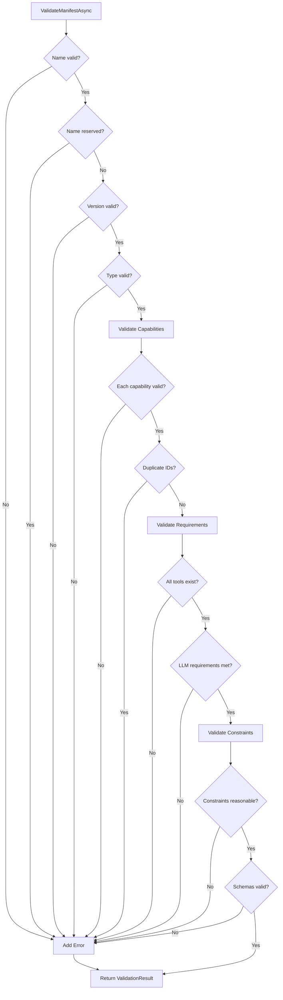

# LDS-01: Agent Validation

## 1. Metadata & Categorization

| Field | Value |
| :--- | :--- |
| **Feature ID** | `AGT-VAL-01` |
| **Feature Name** | Agent Validation |
| **Target Version** | `v0.12.1e` |
| **Module Scope** | `Lexichord.Modules.Agents` |
| **Swimlane** | Ensemble |
| **License Tier** | Core |
| **Feature Gate Key** | `FeatureFlags.Agents.Validation` |
| **Author** | Agent Architecture Lead |
| **Reviewer** | Lead Architect |
| **Status** | Draft |
| **Last Updated** | 2026-02-03 |
| **Parent Spec** | [LCS-SBD-121-AGT](./LCS-SBD-v0.12.1-AGT.md) |
| **Depends On** | [v0.12.1a](./LCS-SBD-v0.12.1a-SCH.md), [v0.12.1b](./LCS-SBD-v0.12.1b-CAP.md), [v0.12.1d](./LCS-SBD-v0.12.1d-REG.md) |
| **Estimated Hours** | 8 |

---

## 2. Executive Summary

### 2.1 The Requirement

Before agents can be registered or instantiated, the system MUST validate that manifests are well-formed, requirements can be satisfied, and runtime behavior conforms to contracts. Without validation, malformed agents could crash the system, requirements failures would occur at runtime, and debugging would be extremely difficult.

### 2.2 The Proposed Solution

Implement comprehensive validation:
- `IAgentValidator` interface with manifest, requirement, and behavior validation
- `ValidationResult` with structured errors and warnings
- `ValidationCodes` for programmatic error handling
- Validation rules for all manifest fields, capability schemas, and requirements
- Optional runtime behavior validation hooks

---

## 3. Architecture & Modular Strategy

### 3.1 Dependencies

**Upstream Modules:**
- `Lexichord.Modules.Agents.Abstractions` — All agent types
- `Lexichord.Host` — `IToolRegistry`, `ILicenseService`

**NuGet Packages:**
- `System.Text.Json` (for schema validation)
- `FluentValidation` (for rule composition)

### 3.2 Licensing Behavior

- **Load Behavior:** [x] **Hard Gate** — Validation is always active (Core feature).
- **Fallback Experience:** N/A — Validation cannot be disabled.

---

## 4. Data Contract (The API)

### 4.1 Agent Validator Interface

```csharp
namespace Lexichord.Modules.Agents.Abstractions;

/// <summary>
/// Validates agent manifests, requirements, and runtime behavior.
/// All validation MUST complete before agents can be registered or instantiated.
/// </summary>
public interface IAgentValidator
{
    /// <summary>
    /// Validate a manifest before registration.
    /// Checks all required fields, formats, and internal consistency.
    /// </summary>
    /// <param name="manifest">The manifest to validate.</param>
    /// <param name="ct">Cancellation token.</param>
    /// <returns>Validation result with any errors or warnings.</returns>
    Task<ValidationResult> ValidateManifestAsync(
        AgentManifest manifest,
        CancellationToken ct = default);

    /// <summary>
    /// Validate that requirements can be satisfied by the current environment.
    /// Checks tools, permissions, LLM capabilities, etc.
    /// </summary>
    /// <param name="requirements">The requirements to validate.</param>
    /// <param name="ct">Cancellation token.</param>
    /// <returns>Validation result with any unmet requirements.</returns>
    Task<ValidationResult> ValidateRequirementsAsync(
        AgentRequirements requirements,
        CancellationToken ct = default);

    /// <summary>
    /// Validate that constraints are reasonable and enforceable.
    /// </summary>
    /// <param name="constraints">The constraints to validate.</param>
    /// <param name="ct">Cancellation token.</param>
    /// <returns>Validation result with any issues.</returns>
    Task<ValidationResult> ValidateConstraintsAsync(
        AgentConstraints constraints,
        CancellationToken ct = default);

    /// <summary>
    /// Validate agent behavior at runtime (optional, for testing).
    /// Runs a series of test cases against the agent.
    /// </summary>
    /// <param name="agent">The agent instance to test.</param>
    /// <param name="options">Validation options and test cases.</param>
    /// <param name="ct">Cancellation token.</param>
    /// <returns>Validation result with any behavioral issues.</returns>
    Task<ValidationResult> ValidateBehaviorAsync(
        IAgent agent,
        BehaviorValidationOptions options,
        CancellationToken ct = default);

    /// <summary>
    /// Perform full validation of a manifest and its requirements.
    /// Combines manifest, requirements, and constraints validation.
    /// </summary>
    /// <param name="manifest">The manifest to validate.</param>
    /// <param name="ct">Cancellation token.</param>
    /// <returns>Combined validation result.</returns>
    Task<ValidationResult> ValidateFullAsync(
        AgentManifest manifest,
        CancellationToken ct = default);
}
```

### 4.2 Validation Result

```csharp
namespace Lexichord.Modules.Agents.Abstractions;

/// <summary>
/// Result of a validation operation.
/// Contains errors (blocking) and warnings (non-blocking).
/// </summary>
public sealed record ValidationResult
{
    /// <summary>
    /// Whether validation passed (no errors).
    /// </summary>
    public bool IsValid => Errors.Count == 0;

    /// <summary>
    /// Blocking errors that prevent registration/instantiation.
    /// </summary>
    public IReadOnlyList<ValidationError> Errors { get; init; } = [];

    /// <summary>
    /// Non-blocking warnings that should be addressed.
    /// </summary>
    public IReadOnlyList<ValidationWarning> Warnings { get; init; } = [];

    /// <summary>
    /// Time taken for validation.
    /// </summary>
    public TimeSpan Duration { get; init; }

    /// <summary>
    /// Creates a successful validation result.
    /// </summary>
    public static ValidationResult Success() => new();

    /// <summary>
    /// Creates a successful result with warnings.
    /// </summary>
    public static ValidationResult SuccessWithWarnings(params ValidationWarning[] warnings) =>
        new() { Warnings = warnings };

    /// <summary>
    /// Creates a failed result with errors.
    /// </summary>
    public static ValidationResult Failed(params ValidationError[] errors) =>
        new() { Errors = errors };

    /// <summary>
    /// Combines multiple validation results.
    /// </summary>
    public static ValidationResult Combine(params ValidationResult[] results)
    {
        var errors = results.SelectMany(r => r.Errors).ToList();
        var warnings = results.SelectMany(r => r.Warnings).ToList();
        var duration = TimeSpan.FromTicks(results.Sum(r => r.Duration.Ticks));

        return new ValidationResult
        {
            Errors = errors,
            Warnings = warnings,
            Duration = duration
        };
    }

    /// <summary>
    /// Throws if validation failed.
    /// </summary>
    /// <exception cref="AgentValidationException">Validation failed.</exception>
    public void ThrowIfInvalid()
    {
        if (!IsValid)
        {
            throw new AgentValidationException(Errors);
        }
    }
}
```

### 4.3 Validation Errors and Warnings

```csharp
namespace Lexichord.Modules.Agents.Abstractions;

/// <summary>
/// A validation error that prevents registration.
/// </summary>
public sealed record ValidationError
{
    /// <summary>
    /// Machine-readable error code from ValidationCodes.
    /// </summary>
    public required string Code { get; init; }

    /// <summary>
    /// Human-readable error message.
    /// </summary>
    public required string Message { get; init; }

    /// <summary>
    /// JSON path to the problematic field (e.g., "$.capabilities[0].id").
    /// </summary>
    public string? Path { get; init; }

    /// <summary>
    /// The invalid value, if applicable.
    /// </summary>
    public object? Value { get; init; }

    /// <summary>
    /// Suggested fix for the error.
    /// </summary>
    public string? Suggestion { get; init; }

    /// <summary>
    /// Severity level.
    /// </summary>
    public ValidationSeverity Severity { get; init; } = ValidationSeverity.Error;
}

/// <summary>
/// A validation warning that doesn't prevent registration.
/// </summary>
public sealed record ValidationWarning
{
    /// <summary>
    /// Machine-readable warning code.
    /// </summary>
    public required string Code { get; init; }

    /// <summary>
    /// Human-readable warning message.
    /// </summary>
    public required string Message { get; init; }

    /// <summary>
    /// JSON path to the problematic field.
    /// </summary>
    public string? Path { get; init; }

    /// <summary>
    /// Suggested fix for the warning.
    /// </summary>
    public string? Suggestion { get; init; }
}

/// <summary>
/// Validation severity levels.
/// </summary>
public enum ValidationSeverity
{
    /// <summary>Informational, always passes.</summary>
    Info,

    /// <summary>Should be fixed but doesn't block.</summary>
    Warning,

    /// <summary>Must be fixed, blocks registration.</summary>
    Error,

    /// <summary>Critical issue, may indicate security problem.</summary>
    Critical
}
```

### 4.4 Validation Codes

```csharp
namespace Lexichord.Modules.Agents.Abstractions;

/// <summary>
/// Standard validation error codes for programmatic handling.
/// </summary>
public static class ValidationCodes
{
    // ═══════════════════════════════════════════════════════════════════
    // Manifest Errors (MANIFEST_*)
    // ═══════════════════════════════════════════════════════════════════

    /// <summary>Agent name is missing.</summary>
    public const string MissingName = "MANIFEST_MISSING_NAME";

    /// <summary>Agent name format is invalid.</summary>
    public const string InvalidName = "MANIFEST_INVALID_NAME";

    /// <summary>Agent name is reserved for system use.</summary>
    public const string ReservedName = "MANIFEST_RESERVED_NAME";

    /// <summary>Version string is missing.</summary>
    public const string MissingVersion = "MANIFEST_MISSING_VERSION";

    /// <summary>Version string is not valid semver.</summary>
    public const string InvalidVersion = "MANIFEST_INVALID_VERSION";

    /// <summary>Agent with same name and version already exists.</summary>
    public const string DuplicateName = "MANIFEST_DUPLICATE_NAME";

    /// <summary>Agent type is invalid or unknown.</summary>
    public const string InvalidAgentType = "MANIFEST_INVALID_AGENT_TYPE";

    /// <summary>Capability definition is invalid.</summary>
    public const string InvalidCapability = "MANIFEST_INVALID_CAPABILITY";

    /// <summary>Capability ID format is invalid.</summary>
    public const string InvalidCapabilityId = "MANIFEST_INVALID_CAPABILITY_ID";

    /// <summary>Duplicate capability ID in manifest.</summary>
    public const string DuplicateCapabilityId = "MANIFEST_DUPLICATE_CAPABILITY_ID";

    /// <summary>Input/output schema is invalid JSON Schema.</summary>
    public const string InvalidSchema = "MANIFEST_INVALID_SCHEMA";

    /// <summary>Author field exceeds maximum length.</summary>
    public const string AuthorTooLong = "MANIFEST_AUTHOR_TOO_LONG";

    /// <summary>Description field exceeds maximum length.</summary>
    public const string DescriptionTooLong = "MANIFEST_DESCRIPTION_TOO_LONG";

    /// <summary>URL field is not a valid URL.</summary>
    public const string InvalidUrl = "MANIFEST_INVALID_URL";

    // ═══════════════════════════════════════════════════════════════════
    // Requirement Errors (REQ_*)
    // ═══════════════════════════════════════════════════════════════════

    /// <summary>A requirement cannot be satisfied.</summary>
    public const string UnsatisfiableRequirement = "REQ_UNSATISFIABLE";

    /// <summary>Required tool is not registered.</summary>
    public const string UnknownTool = "REQ_UNKNOWN_TOOL";

    /// <summary>Required agent is not registered.</summary>
    public const string UnknownAgent = "REQ_UNKNOWN_AGENT";

    /// <summary>User's license doesn't support this requirement.</summary>
    public const string InsufficientLicense = "REQ_INSUFFICIENT_LICENSE";

    /// <summary>Circular dependency detected in agent requirements.</summary>
    public const string CircularDependency = "REQ_CIRCULAR_DEPENDENCY";

    /// <summary>Required permission not granted.</summary>
    public const string PermissionDenied = "REQ_PERMISSION_DENIED";

    /// <summary>Required LLM capabilities not available.</summary>
    public const string LLMRequirementNotMet = "REQ_LLM_NOT_MET";

    /// <summary>Required memory configuration not available.</summary>
    public const string MemoryRequirementNotMet = "REQ_MEMORY_NOT_MET";

    /// <summary>Required external service not configured.</summary>
    public const string ServiceNotConfigured = "REQ_SERVICE_NOT_CONFIGURED";

    /// <summary>Token budget exceeds license limit.</summary>
    public const string TokenBudgetExceeded = "REQ_TOKEN_BUDGET_EXCEEDED";

    // ═══════════════════════════════════════════════════════════════════
    // Constraint Errors (CONSTRAINT_*)
    // ═══════════════════════════════════════════════════════════════════

    /// <summary>Constraint value is out of allowed range.</summary>
    public const string ConstraintOutOfRange = "CONSTRAINT_OUT_OF_RANGE";

    /// <summary>Conflicting constraints specified.</summary>
    public const string ConflictingConstraints = "CONSTRAINT_CONFLICT";

    /// <summary>Isolation level not supported.</summary>
    public const string UnsupportedIsolation = "CONSTRAINT_UNSUPPORTED_ISOLATION";

    // ═══════════════════════════════════════════════════════════════════
    // Behavior Errors (BEHAVIOR_*)
    // ═══════════════════════════════════════════════════════════════════

    /// <summary>Agent failed to initialize.</summary>
    public const string InitializationFailed = "BEHAVIOR_INIT_FAILED";

    /// <summary>Agent returned invalid response format.</summary>
    public const string InvalidResponse = "BEHAVIOR_INVALID_RESPONSE";

    /// <summary>Agent exceeded timeout.</summary>
    public const string TimeoutExceeded = "BEHAVIOR_TIMEOUT";

    /// <summary>Agent exceeded resource limits.</summary>
    public const string ResourceExceeded = "BEHAVIOR_RESOURCE_EXCEEDED";

    /// <summary>Agent state machine violation.</summary>
    public const string InvalidStateTransition = "BEHAVIOR_INVALID_STATE";

    /// <summary>Agent threw unexpected exception.</summary>
    public const string UnexpectedException = "BEHAVIOR_UNEXPECTED_EXCEPTION";

    // ═══════════════════════════════════════════════════════════════════
    // Warning Codes (WARN_*)
    // ═══════════════════════════════════════════════════════════════════

    /// <summary>Agent uses deprecated feature.</summary>
    public const string DeprecatedFeature = "WARN_DEPRECATED_FEATURE";

    /// <summary>Quality score is unusually low.</summary>
    public const string LowQualityScore = "WARN_LOW_QUALITY_SCORE";

    /// <summary>No capabilities declared.</summary>
    public const string NoCapabilities = "WARN_NO_CAPABILITIES";

    /// <summary>Large token budget may incur high costs.</summary>
    public const string HighTokenBudget = "WARN_HIGH_TOKEN_BUDGET";

    /// <summary>Permissive constraints may pose security risks.</summary>
    public const string PermissiveConstraints = "WARN_PERMISSIVE_CONSTRAINTS";
}
```

### 4.5 Behavior Validation Options

```csharp
namespace Lexichord.Modules.Agents.Abstractions;

/// <summary>
/// Options for runtime behavior validation.
/// </summary>
public sealed record BehaviorValidationOptions
{
    /// <summary>
    /// Test cases to run against the agent.
    /// </summary>
    public IReadOnlyList<BehaviorTestCase> TestCases { get; init; } = [];

    /// <summary>
    /// Maximum time to spend on behavior validation.
    /// </summary>
    public TimeSpan Timeout { get; init; } = TimeSpan.FromMinutes(5);

    /// <summary>
    /// Whether to validate state transitions.
    /// </summary>
    public bool ValidateStateTransitions { get; init; } = true;

    /// <summary>
    /// Whether to validate response schemas.
    /// </summary>
    public bool ValidateResponseSchemas { get; init; } = true;

    /// <summary>
    /// Whether to track resource usage.
    /// </summary>
    public bool TrackResourceUsage { get; init; } = true;

    /// <summary>
    /// Continue validation after first failure.
    /// </summary>
    public bool ContinueOnFailure { get; init; } = false;
}

/// <summary>
/// A test case for behavior validation.
/// </summary>
public sealed record BehaviorTestCase
{
    /// <summary>
    /// Test case name.
    /// </summary>
    public required string Name { get; init; }

    /// <summary>
    /// Input request to send to the agent.
    /// </summary>
    public required AgentRequest Request { get; init; }

    /// <summary>
    /// Expected result matcher.
    /// </summary>
    public ResponseMatcher? ExpectedResponse { get; init; }

    /// <summary>
    /// Maximum time for this test case.
    /// </summary>
    public TimeSpan? Timeout { get; init; }
}

/// <summary>
/// Matches expected response characteristics.
/// </summary>
public sealed record ResponseMatcher
{
    /// <summary>
    /// Expected success value.
    /// </summary>
    public bool? ExpectSuccess { get; init; }

    /// <summary>
    /// Expected error code if failure.
    /// </summary>
    public string? ExpectErrorCode { get; init; }

    /// <summary>
    /// Content must contain this substring.
    /// </summary>
    public string? ContentContains { get; init; }

    /// <summary>
    /// Content must match this regex.
    /// </summary>
    public string? ContentMatchesRegex { get; init; }

    /// <summary>
    /// Output must validate against schema.
    /// </summary>
    public JsonDocument? OutputSchema { get; init; }
}
```

---

## 5. Implementation Logic

### 5.1 Manifest Validation Rules

```csharp
namespace Lexichord.Modules.Agents.Validation;

/// <summary>
/// Validation rules for agent manifests.
/// </summary>
public class ManifestValidationRules
{
    // Name rules
    public const int NameMinLength = 2;
    public const int NameMaxLength = 100;
    public static readonly Regex NamePattern = new(
        @"^[a-z][a-z0-9]*(-[a-z0-9]+)*$",
        RegexOptions.Compiled);

    // Reserved names that cannot be used
    public static readonly HashSet<string> ReservedNames =
    [
        "system", "admin", "root", "test", "internal",
        "orchestrator", "supervisor", "host", "core"
    ];

    // Version rules
    public static readonly Regex VersionPattern = new(
        @"^\d+\.\d+\.\d+(-[a-zA-Z0-9]+(\.[a-zA-Z0-9]+)*)?(\+[a-zA-Z0-9]+(\.[a-zA-Z0-9]+)*)?$",
        RegexOptions.Compiled);

    // Field length limits
    public const int DisplayNameMaxLength = 200;
    public const int DescriptionMaxLength = 5000;
    public const int AuthorMaxLength = 200;

    // Capability limits
    public const int MaxCapabilities = 50;
    public const float MinQualityScore = 0.0f;
    public const float MaxQualityScore = 1.0f;
}
```

### 5.2 Validation Flow



---

## 6. Data Persistence (Database)

No database changes for validation. Validation rules are code-only.

---

## 7. UI/UX Specifications

### 7.1 Validation Error Display

```
┌────────────────────────────────────────────────────────────────────────────┐
│ ⚠️ Agent Validation Failed                                                  │
├────────────────────────────────────────────────────────────────────────────┤
│                                                                             │
│ The following issues were found:                                           │
│                                                                             │
│ ❌ MANIFEST_INVALID_NAME                                                   │
│    Agent name "My Agent" contains invalid characters.                      │
│    Path: $.name                                                            │
│    💡 Use lowercase letters, numbers, and hyphens only (e.g., "my-agent") │
│                                                                             │
│ ❌ REQ_UNKNOWN_TOOL                                                        │
│    Required tool "custom-tool" is not registered.                          │
│    Path: $.requirements.requiredTools[0]                                   │
│    💡 Register the tool first, or remove it from requirements             │
│                                                                             │
│ ⚠️ WARN_NO_CAPABILITIES (Warning)                                          │
│    No capabilities declared. Agent won't appear in capability searches.    │
│    💡 Add at least one capability to improve discoverability              │
│                                                                             │
│ [Fix Issues] [View Documentation]                                          │
└────────────────────────────────────────────────────────────────────────────┘
```

---

## 8. Observability & Logging

### 8.1 Log Templates

| Level | Template |
|:------|:---------|
| **Debug** | `[VAL] Validating manifest for {AgentName}` |
| **Debug** | `[VAL] Checking requirement: {RequirementType}` |
| **Info** | `[VAL] Manifest validation completed. Valid: {IsValid}. Errors: {ErrorCount}. Warnings: {WarningCount}` |
| **Warn** | `[VAL] Validation warning: {Code} - {Message}` |
| **Error** | `[VAL] Validation error: {Code} - {Message}. Path: {Path}` |

### 8.2 Metrics

| Metric | Type | Description |
|:-------|:-----|:------------|
| `validation.manifest.duration` | Histogram | Manifest validation time |
| `validation.manifest.passed` | Counter | Successful validations |
| `validation.manifest.failed` | Counter | Failed validations |
| `validation.error.count` | Counter | Errors by code |
| `validation.warning.count` | Counter | Warnings by code |

---

## 9. Security & Safety

- **Input Sanitization:** All string inputs are sanitized before validation.
- **Schema Injection:** JSON schemas are validated for safe patterns.
- **Resource Exhaustion:** Validation has timeout limits.
- **Audit Trail:** All validation failures are logged for security review.

---

## 10. Acceptance Criteria (QA)

1. **[Functional]** Invalid agent names are rejected with `MANIFEST_INVALID_NAME`.
2. **[Functional]** Reserved names are rejected with `MANIFEST_RESERVED_NAME`.
3. **[Functional]** Invalid semver versions are rejected with `MANIFEST_INVALID_VERSION`.
4. **[Functional]** Missing required tools are rejected with `REQ_UNKNOWN_TOOL`.
5. **[Functional]** Circular dependencies are detected with `REQ_CIRCULAR_DEPENDENCY`.
6. **[Functional]** `ValidationResult.Combine()` merges results correctly.
7. **[Performance]** Manifest validation completes in <50ms.
8. **[Security]** Malformed JSON schemas are rejected.
9. **[UX]** All errors include helpful suggestions.

---

## 11. Test Scenarios

### 11.1 Unit Tests

**Scenario: `Validation_RejectsInvalidName`**
- **Setup:** Manifest with name "My Agent" (spaces).
- **Action:** Call `ValidateManifestAsync()`.
- **Assertion:** Result contains `MANIFEST_INVALID_NAME` error.

**Scenario: `Validation_RejectsReservedName`**
- **Setup:** Manifest with name "system".
- **Action:** Call `ValidateManifestAsync()`.
- **Assertion:** Result contains `MANIFEST_RESERVED_NAME` error.

**Scenario: `Validation_DetectsCircularDependency`**
- **Setup:** Agent A requires Agent B, Agent B requires Agent A.
- **Action:** Call `ValidateRequirementsAsync()`.
- **Assertion:** Result contains `REQ_CIRCULAR_DEPENDENCY` error.

**Scenario: `Validation_WarnsOnNoCapabilities`**
- **Setup:** Valid manifest with empty capabilities.
- **Action:** Call `ValidateManifestAsync()`.
- **Assertion:** Result is valid but contains `WARN_NO_CAPABILITIES` warning.

### 11.2 Integration Tests

**Scenario: `Validation_FullManifest_Passes`**
- **Setup:** Complete, valid manifest with capabilities and requirements.
- **Action:** Call `ValidateFullAsync()`.
- **Assertion:** `IsValid == true`, no errors.

**Scenario: `Validation_BlocksInvalidRegistration`**
- **Setup:** Invalid manifest.
- **Action:** Attempt `IAgentRegistry.RegisterAsync()`.
- **Assertion:** Throws `AgentValidationException` with errors.
