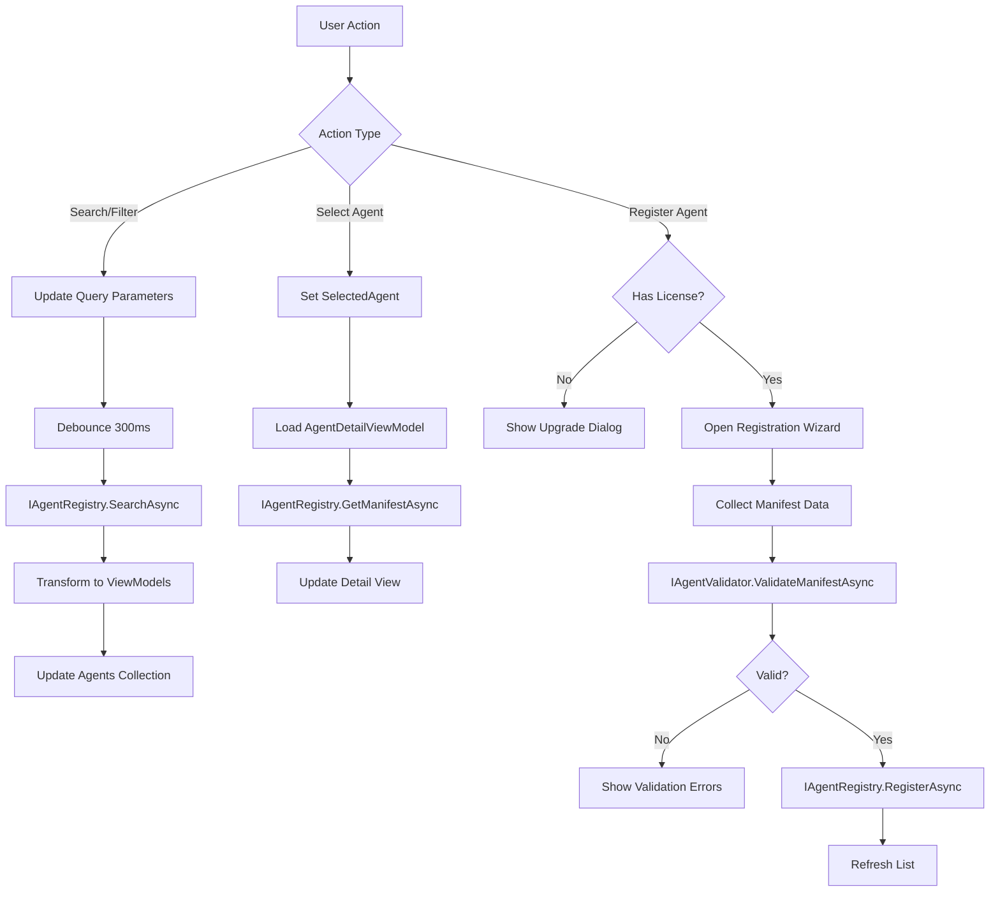

# LDS-01: Agent Definition UI

## 1. Metadata & Categorization

| Field | Value |
| :--- | :--- |
| **Feature ID** | `AGT-UI-01` |
| **Feature Name** | Agent Definition UI |
| **Target Version** | `v0.12.1f` |
| **Module Scope** | `Lexichord.Modules.Agents.UI` |
| **Swimlane** | Ensemble |
| **License Tier** | Core (browse), Teams (register) |
| **Feature Gate Key** | `FeatureFlags.Agents.UI` |
| **Author** | Agent Architecture Lead |
| **Reviewer** | UX Lead, Lead Architect |
| **Status** | Draft |
| **Last Updated** | 2026-02-03 |
| **Parent Spec** | [LCS-SBD-121-AGT](./LCS-SBD-v0.12.1-AGT.md) |
| **Depends On** | [v0.12.1d](./LCS-SBD-v0.12.1d-REG.md), [v0.12.1e](./LCS-SBD-v0.12.1e-VAL.md) |
| **Estimated Hours** | 8 |

---

## 2. Executive Summary

### 2.1 The Requirement

Users need a visual interface to discover available agents, understand their capabilities, configure settings, and (for Teams+ users) register custom agents. Without a UI, users must interact with agents through code or configuration files, limiting accessibility.

### 2.2 The Proposed Solution

Implement AvaloniaUI components for agent management:
- Agent Browser with search, filtering, and sorting
- Agent Detail View showing capabilities, requirements, and configuration
- Agent Registration Wizard for Teams+ users
- Agent Test Harness for sandbox execution
- ViewModels following MVVM pattern with ReactiveUI

---

## 3. Architecture & Modular Strategy

### 3.1 Dependencies

**Upstream Modules:**
- `Lexichord.Modules.Agents` — All agent services (v0.12.1a-e)
- `Lexichord.Host.UI` — Base UI components, themes

**NuGet Packages:**
- `Avalonia` (11.x)
- `Avalonia.ReactiveUI`
- `ReactiveUI`
- `DynamicData`

### 3.2 Licensing Behavior

- **Load Behavior:** [x] **UI Gate** — Browse is Core; register button shows upgrade prompt for Core users.
- **Fallback Experience:**
  - Core: Full browse/search, "Upgrade to Register" button
  - Teams: Full access, register up to 10 custom agents
  - Enterprise: Unlimited registration, admin features

---

## 4. Data Contract (The API)

### 4.1 Agent Browser ViewModel

```csharp
namespace Lexichord.Modules.Agents.UI.ViewModels;

/// <summary>
/// ViewModel for the Agent Browser view.
/// Provides search, filtering, and listing of registered agents.
/// </summary>
public class AgentBrowserViewModel : ViewModelBase, IActivatableViewModel
{
    private readonly IAgentRegistry _registry;
    private readonly ILicenseService _license;

    // ═══════════════════════════════════════════════════════════════════
    // Observable Properties
    // ═══════════════════════════════════════════════════════════════════

    /// <summary>
    /// Current search text.
    /// </summary>
    [Reactive]
    public string SearchText { get; set; } = string.Empty;

    /// <summary>
    /// Selected agent type filter.
    /// </summary>
    [Reactive]
    public AgentType? SelectedTypeFilter { get; set; }

    /// <summary>
    /// Selected capability category filter.
    /// </summary>
    [Reactive]
    public CapabilityCategory? SelectedCategoryFilter { get; set; }

    /// <summary>
    /// Selected author filter.
    /// </summary>
    [Reactive]
    public string? SelectedAuthorFilter { get; set; }

    /// <summary>
    /// Current sort order.
    /// </summary>
    [Reactive]
    public AgentSortOrder SortOrder { get; set; } = AgentSortOrder.NameAscending;

    /// <summary>
    /// Whether to show only built-in agents.
    /// </summary>
    [Reactive]
    public bool ShowBuiltInOnly { get; set; }

    /// <summary>
    /// Currently selected agent for detail view.
    /// </summary>
    [Reactive]
    public AgentListItemViewModel? SelectedAgent { get; set; }

    /// <summary>
    /// Whether a search/filter operation is in progress.
    /// </summary>
    [Reactive]
    public bool IsLoading { get; set; }

    // ═══════════════════════════════════════════════════════════════════
    // Collections
    // ═══════════════════════════════════════════════════════════════════

    /// <summary>
    /// The filtered and sorted list of agents.
    /// </summary>
    public ReadOnlyObservableCollection<AgentListItemViewModel> Agents { get; }

    /// <summary>
    /// Available agent types for filtering.
    /// </summary>
    public IReadOnlyList<AgentType> AvailableTypes { get; } =
        Enum.GetValues<AgentType>();

    /// <summary>
    /// Available capability categories for filtering.
    /// </summary>
    public IReadOnlyList<CapabilityCategory> AvailableCategories { get; } =
        Enum.GetValues<CapabilityCategory>();

    /// <summary>
    /// Available authors for filtering.
    /// </summary>
    public ReadOnlyObservableCollection<string> AvailableAuthors { get; }

    // ═══════════════════════════════════════════════════════════════════
    // Commands
    // ═══════════════════════════════════════════════════════════════════

    /// <summary>
    /// Refresh the agent list.
    /// </summary>
    public ReactiveCommand<Unit, Unit> RefreshCommand { get; }

    /// <summary>
    /// Clear all filters.
    /// </summary>
    public ReactiveCommand<Unit, Unit> ClearFiltersCommand { get; }

    /// <summary>
    /// Open the registration wizard.
    /// </summary>
    public ReactiveCommand<Unit, Unit> RegisterAgentCommand { get; }

    /// <summary>
    /// View details for selected agent.
    /// </summary>
    public ReactiveCommand<AgentListItemViewModel, Unit> ViewDetailsCommand { get; }

    /// <summary>
    /// Test the selected agent.
    /// </summary>
    public ReactiveCommand<AgentListItemViewModel, Unit> TestAgentCommand { get; }

    // ═══════════════════════════════════════════════════════════════════
    // Computed Properties
    // ═══════════════════════════════════════════════════════════════════

    /// <summary>
    /// Whether the current user can register agents.
    /// </summary>
    public bool CanRegisterAgents => _license.HasFeature("Agents.Register");

    /// <summary>
    /// Registry statistics.
    /// </summary>
    [Reactive]
    public RegistryStatistics? Statistics { get; private set; }

    public ViewModelActivator Activator { get; } = new();
}
```

### 4.2 Agent List Item ViewModel

```csharp
namespace Lexichord.Modules.Agents.UI.ViewModels;

/// <summary>
/// ViewModel for a single agent in the browser list.
/// </summary>
public class AgentListItemViewModel : ViewModelBase
{
    /// <summary>
    /// The underlying manifest.
    /// </summary>
    public AgentManifest Manifest { get; }

    /// <summary>
    /// Agent display name (or name if no display name).
    /// </summary>
    public string DisplayName => Manifest.DisplayName ?? Manifest.Name;

    /// <summary>
    /// Agent name.
    /// </summary>
    public string Name => Manifest.Name;

    /// <summary>
    /// Version string.
    /// </summary>
    public string Version => Manifest.Version;

    /// <summary>
    /// Short description (first 100 chars).
    /// </summary>
    public string ShortDescription =>
        Manifest.Description?.Length > 100
            ? Manifest.Description[..100] + "..."
            : Manifest.Description ?? string.Empty;

    /// <summary>
    /// Agent type.
    /// </summary>
    public AgentType Type => Manifest.Type;

    /// <summary>
    /// Type display name.
    /// </summary>
    public string TypeDisplayName => Type.ToString();

    /// <summary>
    /// Author name.
    /// </summary>
    public string? Author => Manifest.Author;

    /// <summary>
    /// Whether this is a built-in agent.
    /// </summary>
    public bool IsBuiltIn { get; }

    /// <summary>
    /// Capability count.
    /// </summary>
    public int CapabilityCount => Manifest.Capabilities.Count;

    /// <summary>
    /// Primary capabilities (top 3 by quality score).
    /// </summary>
    public IReadOnlyList<AgentCapability> PrimaryCapabilities =>
        Manifest.Capabilities
            .OrderByDescending(c => c.QualityScore)
            .Take(3)
            .ToList();

    /// <summary>
    /// Icon name based on agent type.
    /// </summary>
    public string IconName => Type switch
    {
        AgentType.Task => "clipboard-list",
        AgentType.Conversational => "message-circle",
        AgentType.Reactive => "zap",
        AgentType.Autonomous => "compass",
        AgentType.Supervisor => "users",
        _ => "cpu"
    };

    public AgentListItemViewModel(AgentManifest manifest, bool isBuiltIn)
    {
        Manifest = manifest;
        IsBuiltIn = isBuiltIn;
    }
}
```

### 4.3 Agent Detail ViewModel

```csharp
namespace Lexichord.Modules.Agents.UI.ViewModels;

/// <summary>
/// ViewModel for the Agent Detail view.
/// Shows full information about a single agent.
/// </summary>
public class AgentDetailViewModel : ViewModelBase
{
    private readonly IAgentRegistry _registry;
    private readonly IAgentConfigurationProvider _config;

    /// <summary>
    /// The agent manifest.
    /// </summary>
    [Reactive]
    public AgentManifest? Manifest { get; private set; }

    /// <summary>
    /// Whether we're loading agent data.
    /// </summary>
    [Reactive]
    public bool IsLoading { get; set; }

    // ═══════════════════════════════════════════════════════════════════
    // Computed Display Properties
    // ═══════════════════════════════════════════════════════════════════

    public string DisplayName => Manifest?.DisplayName ?? Manifest?.Name ?? "Unknown";
    public string Name => Manifest?.Name ?? string.Empty;
    public string Version => Manifest?.Version ?? string.Empty;
    public string? Description => Manifest?.Description;
    public string TypeName => Manifest?.Type.ToString() ?? string.Empty;
    public string? Author => Manifest?.Author;
    public string? License => Manifest?.License;
    public Uri? HomepageUrl => Manifest?.HomepageUrl;
    public Uri? RepositoryUrl => Manifest?.RepositoryUrl;

    // ═══════════════════════════════════════════════════════════════════
    // Capabilities
    // ═══════════════════════════════════════════════════════════════════

    public IReadOnlyList<CapabilityDisplayViewModel> Capabilities =>
        Manifest?.Capabilities
            .Select(c => new CapabilityDisplayViewModel(c))
            .ToList() ?? [];

    // ═══════════════════════════════════════════════════════════════════
    // Requirements
    // ═══════════════════════════════════════════════════════════════════

    public RequirementsDisplayViewModel? Requirements =>
        Manifest?.Requirements != null
            ? new RequirementsDisplayViewModel(Manifest.Requirements)
            : null;

    // ═══════════════════════════════════════════════════════════════════
    // Constraints
    // ═══════════════════════════════════════════════════════════════════

    public ConstraintsDisplayViewModel? Constraints =>
        Manifest?.Constraints != null
            ? new ConstraintsDisplayViewModel(Manifest.Constraints)
            : null;

    // ═══════════════════════════════════════════════════════════════════
    // Commands
    // ═══════════════════════════════════════════════════════════════════

    /// <summary>
    /// Test this agent in sandbox mode.
    /// </summary>
    public ReactiveCommand<Unit, Unit> TestAgentCommand { get; }

    /// <summary>
    /// Duplicate this agent as a template for a new one.
    /// </summary>
    public ReactiveCommand<Unit, Unit> DuplicateCommand { get; }

    /// <summary>
    /// Export the manifest as JSON.
    /// </summary>
    public ReactiveCommand<Unit, Unit> ExportManifestCommand { get; }

    /// <summary>
    /// Open homepage URL.
    /// </summary>
    public ReactiveCommand<Unit, Unit> OpenHomepageCommand { get; }

    /// <summary>
    /// Open repository URL.
    /// </summary>
    public ReactiveCommand<Unit, Unit> OpenRepositoryCommand { get; }

    /// <summary>
    /// Load agent by name.
    /// </summary>
    public async Task LoadAsync(string agentName, CancellationToken ct = default)
    {
        IsLoading = true;
        try
        {
            Manifest = await _registry.GetManifestAsync(agentName, ct);
        }
        finally
        {
            IsLoading = false;
        }
    }
}
```

---

## 5. Implementation Logic

### 5.1 View Hierarchy

```
AgentManagementView (Tab Container)
├── AgentBrowserView
│   ├── SearchBar
│   ├── FilterPanel
│   │   ├── TypeFilter (ComboBox)
│   │   ├── CategoryFilter (ComboBox)
│   │   └── AuthorFilter (ComboBox)
│   ├── AgentListView (ItemsControl)
│   │   └── AgentListItemView (DataTemplate)
│   └── StatisticsPanel
│
├── AgentDetailView (Shown when agent selected)
│   ├── HeaderSection
│   ├── CapabilitiesSection
│   ├── RequirementsSection
│   ├── ConstraintsSection
│   └── ActionsSection
│
└── AgentRegistrationWizard (Dialog)
    ├── Step 1: Basic Info
    ├── Step 2: Capabilities
    ├── Step 3: Requirements
    ├── Step 4: Review & Submit
    └── ValidationErrorsPanel
```

### 5.2 Data Flow



---

## 6. Data Persistence (Database)

No additional database changes. UI state (last filters, sort order) stored in user preferences via `ISettingsService`.

---

## 7. UI/UX Specifications

### 7.1 Agent Browser Layout

```
┌────────────────────────────────────────────────────────────────────────────┐
│ Agent Registry                                                    [+ New]   │
├────────────────────────────────────────────────────────────────────────────┤
│ ┌──────────────────────────────────────────────────────────────────────┐   │
│ │ 🔍 Search agents...                                                  │   │
│ └──────────────────────────────────────────────────────────────────────┘   │
│                                                                             │
│ Filters: [All Types ▼] [All Categories ▼] [All Authors ▼] [Clear]          │
│ Sort: [Name A-Z ▼]                              [x] Built-in only           │
│                                                                             │
│ ═══════════════════════════════════════════════════════════════════════    │
│                                                                             │
│ ┌─────────────────────────────────────────────────────────────────────────┐│
│ │ 📋 chronicler                                              v1.2.0       ││
│ │ ─────────────────────────────────────────────────────────────────────── ││
│ │ The Chronicler                                                          ││
│ │ Extracts and synthesizes information from Git history and code changes  ││
│ │                                                                         ││
│ │ Type: Task     Author: Lexichord Team                                   ││
│ │                                                                         ││
│ │ Capabilities:                                                           ││
│ │   📊 DataExtraction • git-history-analysis (0.90)                      ││
│ │   📝 Summarization • code-change-summarization (0.85)                  ││
│ │                                                                         ││
│ └─────────────────────────────────────────────────────────────────────────┘│
│                                                                             │
│ ┌─────────────────────────────────────────────────────────────────────────┐│
│ │ 💬 assistant                                               v2.1.0       ││
│ │ ─────────────────────────────────────────────────────────────────────── ││
│ │ General Assistant                                                       ││
│ │ Conversational agent for general-purpose queries and assistance         ││
│ │                                                                         ││
│ │ Type: Conversational     Author: Lexichord Team                         ││
│ │                                                                         ││
│ │ Capabilities:                                                           ││
│ │   ✏️ TextGeneration • general-response (0.92)                          ││
│ │   🔍 Research • information-lookup (0.88)                              ││
│ │                                                                         ││
│ └─────────────────────────────────────────────────────────────────────────┘│
│                                                                             │
│ Showing 2 of 7 agents                                    [Load More]        │
│                                                                             │
│ ───────────────────────────────────────────────────────────────────────────│
│ 📊 Registry: 7 agents (5 built-in, 2 custom) • 23 capabilities             │
└────────────────────────────────────────────────────────────────────────────┘
```

### 7.2 Agent Detail Panel

```
┌────────────────────────────────────────────────────────────────────────────┐
│ chronicler v1.2.0                                                 [×]      │
├────────────────────────────────────────────────────────────────────────────┤
│                                                                             │
│ ┌─ Overview ─────────────────────────────────────────────────────────────┐ │
│ │ The Chronicler                                                         │ │
│ │                                                                         │ │
│ │ Extracts and synthesizes information from Git history and code         │ │
│ │ changes. Produces changelogs, release notes, and impact analyses.      │ │
│ │                                                                         │ │
│ │ Type: Task                    Author: Lexichord Team                   │ │
│ │ License: MIT                  Homepage: lexichord.dev/agents/chronicler│ │
│ └─────────────────────────────────────────────────────────────────────────┘ │
│                                                                             │
│ ┌─ Capabilities (2) ─────────────────────────────────────────────────────┐ │
│ │                                                                         │ │
│ │ ┌───────────────────────────────────────────────────────────────────┐  │ │
│ │ │ 📊 git-history-analysis                            Quality: 0.90  │  │ │
│ │ │ Category: DataExtraction                                          │  │ │
│ │ │ Extracts structured information from Git commit history           │  │ │
│ │ │                                                                   │  │ │
│ │ │ Input:  git/repository, git/commit-range                          │  │ │
│ │ │ Output: document/changelog, document/release-notes                │  │ │
│ │ └───────────────────────────────────────────────────────────────────┘  │ │
│ │                                                                         │ │
│ │ ┌───────────────────────────────────────────────────────────────────┐  │ │
│ │ │ 📝 code-change-summarization                       Quality: 0.85  │  │ │
│ │ │ Category: Summarization                                           │  │ │
│ │ │ Summarizes code changes and their impact                          │  │ │
│ │ │                                                                   │  │ │
│ │ │ Input:  git/diff, git/commit                                      │  │ │
│ │ │ Output: document/summary, analysis/impact                         │  │ │
│ │ └───────────────────────────────────────────────────────────────────┘  │ │
│ └─────────────────────────────────────────────────────────────────────────┘ │
│                                                                             │
│ ┌─ Requirements ─────────────────────────────────────────────────────────┐ │
│ │                                                                         │ │
│ │ LLM:                                                                    │ │
│ │   Providers: anthropic, openai                                          │ │
│ │   Min Context: 100,000 tokens                                           │ │
│ │   Tool Use: Required ✓                                                  │ │
│ │                                                                         │ │
│ │ Tools: git-log, git-diff, file-read                                     │ │
│ │ Permissions: ReadFiles, ReadKnowledge                                   │ │
│ │ Max Execution: 5 minutes                                                │ │
│ │ Max Tokens: 50,000                                                      │ │
│ └─────────────────────────────────────────────────────────────────────────┘ │
│                                                                             │
│ ┌─ Constraints ──────────────────────────────────────────────────────────┐ │
│ │ Max Concurrent: 3        Network: No         File System: Yes          │ │
│ │ Max Duration: 10 min     Spawn Agents: No    Isolation: Shared         │ │
│ └─────────────────────────────────────────────────────────────────────────┘ │
│                                                                             │
│ [🧪 Test Agent] [📋 Duplicate] [📤 Export]                                 │
└────────────────────────────────────────────────────────────────────────────┘
```

### 7.3 Registration Wizard

```
┌────────────────────────────────────────────────────────────────────────────┐
│ Register New Agent                                            Step 1 of 4  │
├────────────────────────────────────────────────────────────────────────────┤
│                                                                             │
│ ○ Basic Info  ○ Capabilities  ○ Requirements  ○ Review                     │
│ ━━━━━━━━━━━━━━━━━━━━━━━━━━━━━━━━━━━━━━━━━━━━━━━━━━━━━━━━━━━━━━━━━━━━━━━━━ │
│                                                                             │
│ Agent Name *                                                                │
│ ┌──────────────────────────────────────────────────────────────────────┐   │
│ │ my-custom-agent                                                      │   │
│ └──────────────────────────────────────────────────────────────────────┘   │
│ Lowercase letters, numbers, and hyphens only                               │
│                                                                             │
│ Display Name                                                                │
│ ┌──────────────────────────────────────────────────────────────────────┐   │
│ │ My Custom Agent                                                      │   │
│ └──────────────────────────────────────────────────────────────────────┘   │
│                                                                             │
│ Version *                                                                   │
│ ┌──────────────────────────────────────────────────────────────────────┐   │
│ │ 1.0.0                                                                │   │
│ └──────────────────────────────────────────────────────────────────────┘   │
│                                                                             │
│ Type *                                                                      │
│ ┌──────────────────────────────────────────────────────────────────────┐   │
│ │ Task                                                             ▼   │   │
│ └──────────────────────────────────────────────────────────────────────┘   │
│                                                                             │
│ Description                                                                 │
│ ┌──────────────────────────────────────────────────────────────────────┐   │
│ │                                                                      │   │
│ │ Describe what your agent does...                                     │   │
│ │                                                                      │   │
│ └──────────────────────────────────────────────────────────────────────┘   │
│                                                                             │
│                                               [Cancel]  [← Back]  [Next →] │
└────────────────────────────────────────────────────────────────────────────┘
```

### 7.4 Accessibility Requirements

- **Keyboard Navigation:** All controls MUST be keyboard accessible.
- **Screen Readers:** All elements MUST have `AutomationProperties.Name`.
- **Focus Indicators:** Visible focus rings on all interactive elements.
- **Color Contrast:** Minimum 4.5:1 contrast ratio for text.
- **Error Announcements:** Validation errors announced via live regions.

---

## 8. Observability & Logging

### 8.1 Log Templates

| Level | Template |
|:------|:---------|
| **Debug** | `[UI] Agent browser search: "{Query}". Filters: Type={Type}, Category={Category}` |
| **Debug** | `[UI] Agent detail loaded: {AgentName}` |
| **Info** | `[UI] Registration wizard started` |
| **Info** | `[UI] Agent registered via UI: {AgentName}` |
| **Warn** | `[UI] Registration validation failed. Errors: {ErrorCount}` |

### 8.2 Telemetry Events

| Event | Properties |
|:------|:-----------|
| `AgentBrowser.Search` | query, filters, resultCount, duration |
| `AgentBrowser.Select` | agentName |
| `AgentDetail.View` | agentName, duration |
| `AgentRegistration.Start` | — |
| `AgentRegistration.Complete` | agentName, duration |
| `AgentRegistration.Abandon` | step, reason |

---

## 9. Security & Safety

- **Input Sanitization:** All user input is sanitized before display.
- **XSS Prevention:** URLs are validated before rendering as links.
- **License Enforcement:** Registration UI disabled without valid license.

---

## 10. Acceptance Criteria (QA)

1. **[Functional]** Agent browser displays all registered agents.
2. **[Functional]** Search filters results in real-time (debounced).
3. **[Functional]** Type and category filters work correctly.
4. **[Functional]** Agent detail panel shows all manifest information.
5. **[Functional]** Registration wizard validates input at each step.
6. **[Functional]** Successful registration adds agent to browser.
7. **[Licensing]** Core users see "Upgrade" prompt instead of register button.
8. **[A11y]** All controls are keyboard accessible.
9. **[A11y]** Screen reader announces all content.
10. **[Performance]** Browser loads <100 agents in <500ms.

---

## 11. Test Scenarios

### 11.1 UI Tests

**Scenario: `AgentBrowser_Search_FiltersResults`**
- **Setup:** Browser with 10 agents, 3 containing "git".
- **Action:** Type "git" in search box.
- **Assertion:** Only 3 agents displayed after debounce.

**Scenario: `AgentBrowser_CategoryFilter_Works`**
- **Setup:** Browser with agents in multiple categories.
- **Action:** Select "CodeGeneration" category filter.
- **Assertion:** Only CodeGeneration agents displayed.

**Scenario: `AgentDetail_LoadsCorrectData`**
- **Setup:** Browser with "chronicler" agent.
- **Action:** Select "chronicler".
- **Assertion:** Detail panel shows chronicler manifest data.

**Scenario: `Registration_ValidatesInput`**
- **Setup:** Open registration wizard.
- **Action:** Enter invalid name "My Agent" (with space).
- **Assertion:** Validation error displayed, Next button disabled.

### 11.2 Accessibility Tests

**Scenario: `AgentBrowser_KeyboardNavigation`**
- **Setup:** Browser with agents.
- **Action:** Tab through all controls, use arrows in list.
- **Assertion:** All controls reachable, focus visible.

**Scenario: `AgentDetail_ScreenReader`**
- **Setup:** Screen reader enabled, agent selected.
- **Action:** Navigate detail panel.
- **Assertion:** All content announced correctly.
