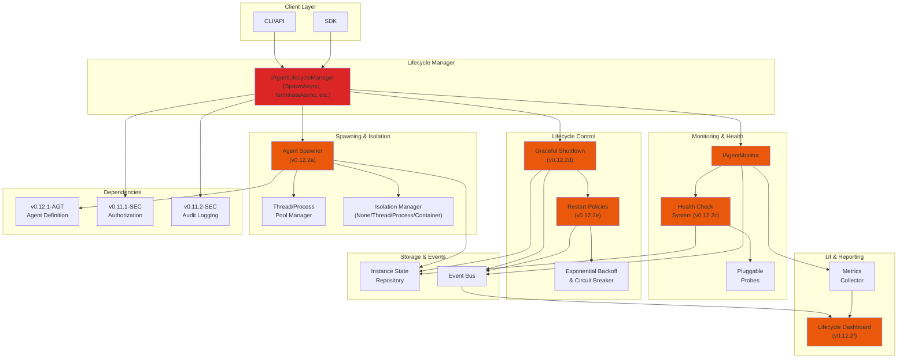

# LCS-SBD-v0.12.2-AGT: Scope Overview — Agent Lifecycle Manager

## Document Control

| Field            | Value                                                        |
| :--------------- | :----------------------------------------------------------- |
| **Document ID**  | LCS-SBD-v0.12.2-AGT                                          |
| **Version**      | v0.12.2                                                      |
| **Codename**     | Agent Lifecycle Manager (Agent Execution Phase 2)            |
| **Status**       | Draft                                                        |
| **Last Updated** | 2026-01-31                                                   |
| **Owner**        | Agent Architecture Lead                                      |
| **Depends On**   | v0.12.1-AGT (Agent Definition), v0.11.1-SEC (Authorization), v0.11.2-SEC (Audit Logging) |

---

## 1. Executive Summary

### 1.1 The Vision

**v0.12.2-AGT** delivers **Agent Lifecycle Manager** — a comprehensive runtime management system for spawning, monitoring, and gracefully shutting down agents with health-aware policies. This ensures:

- Agents can be dynamically spawned with configurable isolation and resource limits
- Health status is continuously monitored with pluggable health checks
- Automatic restart policies keep agents resilient under failure conditions
- Graceful shutdown prevents data loss and resource leaks
- Lifecycle state is visible through a unified dashboard UI
- Teams can manage concurrent agents within license-gated limits

### 1.2 Business Value

- **Reliability:** Automatic restart policies ensure agents recover from transient failures.
- **Observability:** Health dashboards provide real-time visibility into agent status.
- **Resource Control:** Resource limits and isolation prevent agents from affecting each other.
- **Governance:** Lifecycle auditing tracks agent creation, state changes, and termination.
- **Scale:** License-aware concurrency limits ensure fair resource allocation across users.
- **Performance:** Efficient state tracking with sub-100ms query latency.

### 1.3 Success Criteria

1. Dynamic agent spawning with isolation options (thread, process, container).
2. Configurable resource limits (memory, CPU, timeout, worker threads).
3. Pluggable health check system with configurable probes.
4. Automatic restart policies with backoff and max retry logic.
5. Graceful shutdown with timeout and cleanup hooks.
6. Real-time state transition tracking and event publishing.
7. License-gated concurrency limits enforced per user/workspace.
8. Comprehensive lifecycle dashboard with state visualization.
9. Agent query latency <100ms (P95) for 1000 active instances.
10. Audit trail of all lifecycle events.

---

## 2. Key Deliverables

### 2.1 Sub-Parts

| Sub-Part | Title | Description | Est. Hours |
|:---------|:------|:------------|:-----------|
| v0.12.2a | Agent Spawner | Dynamic agent creation with isolation & resource limits | 10 |
| v0.12.2b | Agent Monitor | Continuous health monitoring with pluggable probes | 10 |
| v0.12.2c | Health Check System | Configurable health checks (HTTP, process, custom) | 8 |
| v0.12.2d | Graceful Shutdown | Timeout, cleanup hooks, state persistence | 8 |
| v0.12.2e | Agent Restart Policies | Exponential backoff, max retries, circuit breaker | 8 |
| v0.12.2f | Lifecycle Dashboard UI | Real-time state visualization and controls | 8 |
| **Total** | | | **52 hours** |

### 2.2 Key Interfaces

#### IAgentLifecycleManager

```csharp
/// <summary>
/// Manages the complete lifecycle of agent instances.
/// </summary>
public interface IAgentLifecycleManager
{
    /// <summary>
    /// Spawns a new agent instance with the given configuration.
    /// </summary>
    Task<AgentInstance> SpawnAsync(
        SpawnRequest request,
        CancellationToken ct = default);

    /// <summary>
    /// Gets an agent instance by ID.
    /// </summary>
    Task<AgentInstance?> GetInstanceAsync(
        Guid agentInstanceId,
        CancellationToken ct = default);

    /// <summary>
    /// Gets all active agent instances for the current user/workspace.
    /// </summary>
    Task<IReadOnlyList<AgentInstance>> GetActiveInstancesAsync(
        GetInstancesFilter? filter = null,
        CancellationToken ct = default);

    /// <summary>
    /// Terminates an agent instance gracefully.
    /// </summary>
    Task<TerminationResult> TerminateAsync(
        Guid agentInstanceId,
        TerminationOptions? options = null,
        CancellationToken ct = default);

    /// <summary>
    /// Observes state changes and health events for an agent.
    /// </summary>
    IAsyncEnumerable<AgentEvent> ObserveAsync(
        Guid agentInstanceId,
        ObservationOptions? options = null);
}

/// <summary>
/// Request to spawn a new agent instance.
/// </summary>
public record SpawnRequest
{
    /// <summary>
    /// ID of the agent definition to instantiate.
    /// </summary>
    public required Guid AgentDefinitionId { get; init; }

    /// <summary>
    /// Optional spawn options.
    /// </summary>
    public AgentSpawnOptions? Options { get; init; }

    /// <summary>
    /// Optional contextual data passed to agent initialization.
    /// </summary>
    public IReadOnlyDictionary<string, object>? Context { get; init; }
}

/// <summary>
/// Configuration options for agent spawning.
/// </summary>
public record AgentSpawnOptions
{
    /// <summary>
    /// Timeout for agent initialization.
    /// </summary>
    public TimeSpan InitializationTimeout { get; init; } = TimeSpan.FromSeconds(30);

    /// <summary>
    /// Resource limits for the agent.
    /// </summary>
    public ResourceLimits? ResourceLimits { get; init; }

    /// <summary>
    /// Isolation level for the agent.
    /// </summary>
    public IsolationLevel IsolationLevel { get; init; } = IsolationLevel.Thread;

    /// <summary>
    /// Restart policy for the agent.
    /// </summary>
    public RestartPolicy? RestartPolicy { get; init; }

    /// <summary>
    /// Health check configuration.
    /// </summary>
    public HealthCheckConfig? HealthCheck { get; init; }

    /// <summary>
    /// Human-readable name for the instance.
    /// </summary>
    public string? Name { get; init; }

    /// <summary>
    /// Tags for grouping and filtering.
    /// </summary>
    public IReadOnlyList<string>? Tags { get; init; }
}

/// <summary>
/// Resource constraints for an agent.
/// </summary>
public record ResourceLimits
{
    /// <summary>
    /// Maximum memory in MB.
    /// </summary>
    public int MaxMemoryMb { get; init; } = 512;

    /// <summary>
    /// Maximum CPU percentage (0-100, or 0 for unlimited).
    /// </summary>
    public int MaxCpuPercent { get; init; } = 0;

    /// <summary>
    /// Maximum execution time per operation.
    /// </summary>
    public TimeSpan ExecutionTimeout { get; init; } = TimeSpan.FromMinutes(5);

    /// <summary>
    /// Maximum number of concurrent worker threads.
    /// </summary>
    public int MaxWorkerThreads { get; init; } = 4;

    /// <summary>
    /// Maximum number of concurrent tasks.
    /// </summary>
    public int MaxConcurrentTasks { get; init; } = 10;
}

/// <summary>
/// How an agent is isolated from other agents.
/// </summary>
public enum IsolationLevel
{
    /// <summary>
    /// Same thread as caller (no isolation).
    /// </summary>
    None = 0,

    /// <summary>
    /// Separate thread (low isolation).
    /// </summary>
    Thread = 1,

    /// <summary>
    /// Separate process (high isolation).
    /// </summary>
    Process = 2,

    /// <summary>
    /// Container/sandbox (strongest isolation).
    /// </summary>
    Container = 3
}

/// <summary>
/// Policy for restarting a failed agent.
/// </summary>
public record RestartPolicy
{
    /// <summary>
    /// Type of restart policy.
    /// </summary>
    public RestartPolicyType Type { get; init; } = RestartPolicyType.Exponential;

    /// <summary>
    /// Maximum number of restart attempts.
    /// </summary>
    public int MaxRetries { get; init; } = 3;

    /// <summary>
    /// Initial delay before first retry.
    /// </summary>
    public TimeSpan InitialDelay { get; init; } = TimeSpan.FromSeconds(1);

    /// <summary>
    /// Maximum delay between retries.
    /// </summary>
    public TimeSpan MaxDelay { get; init; } = TimeSpan.FromMinutes(1);

    /// <summary>
    /// Multiplier for exponential backoff.
    /// </summary>
    public double BackoffMultiplier { get; init; } = 2.0;

    /// <summary>
    /// Whether to add jitter to retry delays.
    /// </summary>
    public bool UseJitter { get; init; } = true;

    /// <summary>
    /// Timeout for determining circuit-breaker open state.
    /// </summary>
    public TimeSpan CircuitBreakerTimeout { get; init; } = TimeSpan.FromMinutes(5);
}

/// <summary>
/// Types of restart policies.
/// </summary>
public enum RestartPolicyType
{
    /// <summary>
    /// No restart.
    /// </summary>
    None = 0,

    /// <summary>
    /// Immediate restart on failure.
    /// </summary>
    Immediate = 1,

    /// <summary>
    /// Linear backoff: delay = InitialDelay * retryCount.
    /// </summary>
    Linear = 2,

    /// <summary>
    /// Exponential backoff: delay = InitialDelay * (BackoffMultiplier ^ retryCount).
    /// </summary>
    Exponential = 3
}

/// <summary>
/// Health check configuration.
/// </summary>
public record HealthCheckConfig
{
    /// <summary>
    /// Check interval.
    /// </summary>
    public TimeSpan Interval { get; init; } = TimeSpan.FromSeconds(5);

    /// <summary>
    /// Timeout for health check.
    /// </summary>
    public TimeSpan Timeout { get; init; } = TimeSpan.FromSeconds(3);

    /// <summary>
    /// Number of consecutive failures before marking unhealthy.
    /// </summary>
    public int FailureThreshold { get; init; } = 3;

    /// <summary>
    /// Type of health check probe.
    /// </summary>
    public HealthCheckType Type { get; init; } = HealthCheckType.Heartbeat;

    /// <summary>
    /// Optional HTTP endpoint for health checks.
    /// </summary>
    public Uri? HttpEndpoint { get; init; }

    /// <summary>
    /// Custom health check expression or script.
    /// </summary>
    public string? CustomCheck { get; init; }
}

/// <summary>
/// Types of health checks.
/// </summary>
public enum HealthCheckType
{
    /// <summary>
    /// Simple heartbeat (is process alive?).
    /// </summary>
    Heartbeat = 0,

    /// <summary>
    /// HTTP GET request to endpoint.
    /// </summary>
    Http = 1,

    /// <summary>
    /// TCP connection check.
    /// </summary>
    TcpConnection = 2,

    /// <summary>
    /// Custom expression evaluation.
    /// </summary>
    Custom = 3
}

/// <summary>
/// Runtime state of an agent instance.
/// </summary>
public record AgentInstance
{
    /// <summary>
    /// Unique identifier for this instance.
    /// </summary>
    public required Guid InstanceId { get; init; }

    /// <summary>
    /// ID of the agent definition.
    /// </summary>
    public required Guid DefinitionId { get; init; }

    /// <summary>
    /// Current state of the agent.
    /// </summary>
    public required AgentState State { get; init; }

    /// <summary>
    /// Current health status.
    /// </summary>
    public required AgentHealthStatus Health { get; init; }

    /// <summary>
    /// Real-time performance and resource metrics.
    /// </summary>
    public AgentMetrics? Metrics { get; init; }

    /// <summary>
    /// When the instance was created.
    /// </summary>
    public required DateTimeOffset CreatedAt { get; init; }

    /// <summary>
    /// When the instance was last updated.
    /// </summary>
    public required DateTimeOffset UpdatedAt { get; init; }

    /// <summary>
    /// When the instance transitioned to terminal state.
    /// </summary>
    public DateTimeOffset? TerminatedAt { get; init; }

    /// <summary>
    /// Number of times this instance has been restarted.
    /// </summary>
    public int RestartCount { get; init; }

    /// <summary>
    /// Error message if in Failed state.
    /// </summary>
    public string? ErrorMessage { get; init; }

    /// <summary>
    /// Applied spawn options.
    /// </summary>
    public AgentSpawnOptions? SpawnOptions { get; init; }

    /// <summary>
    /// Tags associated with this instance.
    /// </summary>
    public IReadOnlyList<string> Tags { get; init; } = [];

    /// <summary>
    /// Human-readable name.
    /// </summary>
    public string? Name { get; init; }
}

/// <summary>
/// Lifecycle states of an agent.
/// </summary>
public enum AgentState
{
    /// <summary>
    /// Initializing: spawning and setting up.
    /// </summary>
    Initializing = 0,

    /// <summary>
    /// Ready: initialized and waiting for work.
    /// </summary>
    Ready = 1,

    /// <summary>
    /// Processing: actively executing work.
    /// </summary>
    Processing = 2,

    /// <summary>
    /// Waiting: idle but available.
    /// </summary>
    Waiting = 3,

    /// <summary>
    /// Suspended: temporarily paused.
    /// </summary>
    Suspended = 4,

    /// <summary>
    /// Terminating: graceful shutdown in progress.
    /// </summary>
    Terminating = 5,

    /// <summary>
    /// Terminated: successfully shut down.
    /// </summary>
    Terminated = 6,

    /// <summary>
    /// Failed: encountered unrecoverable error.
    /// </summary>
    Failed = 7
}

/// <summary>
/// Health status of an agent.
/// </summary>
public record AgentHealthStatus
{
    /// <summary>
    /// Current health state.
    /// </summary>
    public required HealthState State { get; init; }

    /// <summary>
    /// When health was last checked.
    /// </summary>
    public required DateTimeOffset LastCheckedAt { get; init; }

    /// <summary>
    /// Number of consecutive health check failures.
    /// </summary>
    public int FailureCount { get; init; }

    /// <summary>
    /// Details of last check.
    /// </summary>
    public string? Details { get; init; }
}

/// <summary>
/// Health states.
/// </summary>
public enum HealthState
{
    /// <summary>
    /// Healthy: all checks passing.
    /// </summary>
    Healthy = 0,

    /// <summary>
    /// Degraded: some checks failing but still usable.
    /// </summary>
    Degraded = 1,

    /// <summary>
    /// Unhealthy: most checks failing.
    /// </summary>
    Unhealthy = 2,

    /// <summary>
    /// Unknown: not yet checked or check timed out.
    /// </summary>
    Unknown = 3
}

/// <summary>
/// Performance metrics for an agent.
/// </summary>
public record AgentMetrics
{
    /// <summary>
    /// Memory usage in MB.
    /// </summary>
    public int MemoryMb { get; init; }

    /// <summary>
    /// CPU usage percentage.
    /// </summary>
    public double CpuPercent { get; init; }

    /// <summary>
    /// Number of completed operations.
    /// </summary>
    public long OperationsCompleted { get; init; }

    /// <summary>
    /// Number of failed operations.
    /// </summary>
    public long OperationsFailed { get; init; }

    /// <summary>
    /// Average operation duration in milliseconds.
    /// </summary>
    public double AvgOperationDurationMs { get; init; }

    /// <summary>
    /// P95 operation duration in milliseconds.
    /// </summary>
    public double P95OperationDurationMs { get; init; }

    /// <summary>
    /// Number of active operations.
    /// </summary>
    public int ActiveOperations { get; init; }

    /// <summary>
    /// Uptime duration.
    /// </summary>
    public TimeSpan Uptime { get; init; }

    /// <summary>
    /// When metrics were last updated.
    /// </summary>
    public DateTimeOffset UpdatedAt { get; init; }
}

/// <summary>
/// Options for terminating an agent.
/// </summary>
public record TerminationOptions
{
    /// <summary>
    /// Timeout for graceful shutdown.
    /// </summary>
    public TimeSpan GracefulTimeout { get; init; } = TimeSpan.FromSeconds(10);

    /// <summary>
    /// Whether to force terminate if graceful fails.
    /// </summary>
    public bool ForceIfTimeout { get; init; } = true;

    /// <summary>
    /// Reason for termination.
    /// </summary>
    public string? Reason { get; init; }
}

/// <summary>
/// Result of termination operation.
/// </summary>
public record TerminationResult
{
    /// <summary>
    /// Whether termination succeeded.
    /// </summary>
    public required bool Success { get; init; }

    /// <summary>
    /// Whether termination was graceful.
    /// </summary>
    public required bool WasGraceful { get; init; }

    /// <summary>
    /// Error message if termination failed.
    /// </summary>
    public string? ErrorMessage { get; init; }

    /// <summary>
    /// Final state of the agent.
    /// </summary>
    public AgentInstance? FinalInstance { get; init; }
}

/// <summary>
/// Filter for querying agent instances.
/// </summary>
public record GetInstancesFilter
{
    /// <summary>
    /// Filter by state.
    /// </summary>
    public AgentState? State { get; init; }

    /// <summary>
    /// Filter by health state.
    /// </summary>
    public HealthState? HealthState { get; init; }

    /// <summary>
    /// Filter by tag.
    /// </summary>
    public string? Tag { get; init; }

    /// <summary>
    /// Filter by definition ID.
    /// </summary>
    public Guid? DefinitionId { get; init; }

    /// <summary>
    /// Maximum number of results.
    /// </summary>
    public int Limit { get; init; } = 100;
}

/// <summary>
/// Options for observing agent events.
/// </summary>
public record ObservationOptions
{
    /// <summary>
    /// Include state change events.
    /// </summary>
    public bool IncludeStateChanges { get; init; } = true;

    /// <summary>
    /// Include health check events.
    /// </summary>
    public bool IncludeHealthChecks { get; init; } = true;

    /// <summary>
    /// Include metric updates.
    /// </summary>
    public bool IncludeMetrics { get; init; } = false;

    /// <summary>
    /// Include error events.
    /// </summary>
    public bool IncludeErrors { get; init; } = true;
}

/// <summary>
/// Base class for agent lifecycle events.
/// </summary>
public abstract record AgentEvent
{
    public required Guid InstanceId { get; init; }
    public required DateTimeOffset OccurredAt { get; init; }
}

public record AgentStateChangedEvent : AgentEvent
{
    public required AgentState PreviousState { get; init; }
    public required AgentState NewState { get; init; }
}

public record AgentHealthChangedEvent : AgentEvent
{
    public required HealthState PreviousHealth { get; init; }
    public required HealthState NewHealth { get; init; }
    public string? Details { get; init; }
}

public record AgentErrorEvent : AgentEvent
{
    public required string ErrorMessage { get; init; }
    public string? StackTrace { get; init; }
}

public record AgentRestartingEvent : AgentEvent
{
    public required int AttemptNumber { get; init; }
    public TimeSpan? DelayBeforeRetry { get; init; }
}

public record AgentMetricsUpdatedEvent : AgentEvent
{
    public required AgentMetrics Metrics { get; init; }
}
```

#### IAgentMonitor

```csharp
/// <summary>
/// Monitors health and metrics of running agents.
/// </summary>
public interface IAgentMonitor
{
    /// <summary>
    /// Checks health of an agent instance.
    /// </summary>
    Task<AgentHealthStatus> CheckHealthAsync(
        Guid agentInstanceId,
        CancellationToken ct = default);

    /// <summary>
    /// Gets current metrics for an agent.
    /// </summary>
    Task<AgentMetrics?> GetMetricsAsync(
        Guid agentInstanceId,
        CancellationToken ct = default);

    /// <summary>
    /// Gets health alerts for an agent.
    /// </summary>
    Task<IReadOnlyList<HealthAlert>> GetAlertsAsync(
        Guid agentInstanceId,
        CancellationToken ct = default);
}

/// <summary>
/// Health alert raised during monitoring.
/// </summary>
public record HealthAlert
{
    public required Guid AlertId { get; init; }
    public required Guid AgentInstanceId { get; init; }
    public required HealthAlertLevel Level { get; init; }
    public required string Message { get; init; }
    public required DateTimeOffset RaisedAt { get; init; }
    public DateTimeOffset? ResolvedAt { get; init; }
}

/// <summary>
/// Alert severity levels.
/// </summary>
public enum HealthAlertLevel
{
    Info = 0,
    Warning = 1,
    Error = 2,
    Critical = 3
}
```

---

## 3. Agent Lifecycle State Machine

```mermaid
stateDiagram-v2
    [*] --> Initializing: SpawnAsync()

    Initializing --> Ready: Initialization succeeds
    Initializing --> Failed: Initialization timeout/error

    Ready --> Processing: Work item received
    Ready --> Suspended: Suspend requested
    Ready --> Terminating: TerminateAsync() called

    Processing --> Waiting: Work item completed
    Processing --> Processing: New work item queued
    Processing --> Failed: Unhandled exception
    Processing --> Terminating: Force termination

    Waiting --> Processing: Next work item arrives
    Waiting --> Suspended: Suspend requested
    Waiting --> Terminating: TerminateAsync() called

    Suspended --> Ready: Resume requested
    Suspended --> Terminating: TerminateAsync() called

    Failed --> Initializing: RestartPolicy triggers (if retries remaining)
    Failed --> Terminated: Max retries exceeded or no restart policy

    Terminating --> Terminated: Graceful shutdown succeeds
    Terminating --> Terminated: Timeout expires

    Terminated --> [*]

    note right of Initializing
        Initialization timeout applies
        Context passed to agent init
    end

    note right of Failed
        Restart policy with backoff
        Circuit breaker after timeout
        Audit log on each failure
    end

    note right of Terminating
        Cleanup hooks called
        Outstanding work cancelled
        Resources released
    end
```

---

## 4. Architecture Overview



---

## 5. Component Details

### 5.1 Agent Spawner (v0.12.2a)

**Purpose:** Dynamically create and initialize agent instances with configurable isolation and resource limits.

**Key Responsibilities:**
- Validate spawn requests against license limits
- Instantiate agent definition into runtime instance
- Allocate resources based on ResourceLimits
- Apply isolation level (thread, process, container)
- Initialize health checks
- Apply restart policies
- Track instance in state repository
- Publish AgentSpawnedEvent

**Resource Allocation:**
- Thread pool for thread-isolated agents
- Process spawning for process-isolated agents
- Container orchestration for container-isolated agents (future)
- Memory reservation from global pool
- CPU throttling based on limits

**License Gating:**
- Check concurrent agent limits against current license tier
- Enforce Core (2), WriterPro (5), Teams (20), Enterprise (unlimited)
- Reject spawn if limit exceeded

---

### 5.2 Agent Monitor (v0.12.2b)

**Purpose:** Continuously observe agent health and collect performance metrics.

**Key Responsibilities:**
- Poll health checks at configured intervals
- Aggregate check results into HealthState
- Detect unhealthy transitions
- Collect memory, CPU, operation metrics
- Raise HealthAlerts for degradation
- Feed metrics to dashboard
- Trigger restart policies on persistent unhealthy state

**Health State Logic:**
- Healthy: all checks passing
- Degraded: 1-2 checks failing
- Unhealthy: >2 checks failing for FailureThreshold attempts
- Unknown: check timeout or not yet checked

---

### 5.3 Health Check System (v0.12.2c)

**Purpose:** Pluggable health probes that determine if an agent is functioning.

**Supported Probe Types:**
- **Heartbeat:** Is process alive? (always available)
- **HTTP:** GET to health endpoint, expect 2xx response
- **TCP:** Connect to port, verify response
- **Custom:** Execute expression/script, evaluate result

**Configuration per Agent:**
- Probe type (required)
- Check interval (default 5s)
- Timeout (default 3s)
- Failure threshold (default 3 consecutive)
- Optional HTTP endpoint URL
- Optional custom expression

**Behavior:**
- Runs independently of agent work
- Failures don't immediately mark unhealthy
- Must exceed FailureThreshold to change state
- Results feed into monitor for decision logic

---

### 5.4 Graceful Shutdown (v0.12.2d)

**Purpose:** Safely terminate agents without data loss or resource leaks.

**Shutdown Flow:**
1. Transition to Terminating state
2. Signal agent to stop accepting new work
3. Wait for outstanding operations (up to GracefulTimeout)
4. Call cleanup hooks registered by agent
5. Release resources (memory, threads, file handles)
6. Transition to Terminated state
7. Persist final state
8. Publish AgentTerminatedEvent
9. Emit audit log entry

**Cleanup Hooks:**
- Agent can register async cleanup callbacks
- Hooks execute sequentially with timeout per hook
- If all hooks exceed timeout, force termination
- Hooks for: cleanup resources, flush caches, close connections

---

### 5.5 Agent Restart Policies (v0.12.2e)

**Purpose:** Automatically recover from transient failures using configurable retry logic.

**Policy Types:**
- **None:** No restart, agent stays Failed
- **Immediate:** Retry immediately (useful for transient issues)
- **Linear:** Delay = InitialDelay × retryCount
- **Exponential:** Delay = InitialDelay × (BackoffMultiplier ^ retryCount)

**Features:**
- Max retries limit (default 3)
- Jitter option to prevent thundering herd
- Circuit breaker: after CircuitBreakerTimeout, fail fast
- Backoff capped at MaxDelay
- Emit AgentRestartingEvent before each attempt

**Example Exponential Sequence:**
- Attempt 1 fails → delay 1s, retry
- Attempt 2 fails → delay 2s, retry
- Attempt 3 fails → delay 4s, retry
- Attempt 4 fails → max retries reached, mark Failed

---

### 5.6 Lifecycle Dashboard UI (v0.12.2f)

**Purpose:** Real-time visualization of agent lifecycle state and controls.

**Features:**
- List of active agents with state, health, metrics
- Real-time state updates via events/websocket
- Filter by state, health, tag, definition
- Drill-down to individual agent details
- Manual controls: suspend, resume, terminate
- Health alert timeline
- Metrics charts: memory, CPU, operations/sec
- Event log: all state transitions and restarts
- Resource usage gauge vs limits

**Mock UI Sketch:**

```
┌─────────────────────────────────────────────────────────────────┐
│ Agent Lifecycle Dashboard                          [↻ Refresh] │
├─────────────────────────────────────────────────────────────────┤
│                                                                 │
│ Filter: [All States ▼] [All Health ▼] [Tag: ________] [Search] │
│                                                                 │
│ ┌────────────────────────────────────────────────────────────┐ │
│ │ Active Agents: 7/20 (Teams tier)                           │ │
│ │                                                            │ │
│ │ Instance ID    │ Definition   │ State      │ Health │ Mem  │ │
│ ├────────────────────────────────────────────────────────────┤ │
│ │ agt-001-xyz    │ CodeAnalyzer │ ●Processing│ ✓Healthy│512MB│ │
│ │ agt-002-abc    │ DataETL      │ ●Ready     │ ✓Healthy│256MB│ │
│ │ agt-003-def    │ CodeAnalyzer │ ●Waiting   │ ⚠Degraded│384MB│ │
│ │ agt-004-ghi    │ Validator    │ ●Suspended │ ?Unknown│ 128MB│ │
│ │ agt-005-jkl    │ CodeAnalyzer │ ●Failed    │ ✗Unhealthy│0MB  │ │
│ │ agt-006-mno    │ DataETL      │ ●Terminating│ ?Unknown│ 64MB│ │
│ │ agt-007-pqr    │ CodeAnalyzer │ ●Ready     │ ✓Healthy│256MB│ │
│ └────────────────────────────────────────────────────────────┘ │
│                                                                 │
│ [Suspend] [Resume] [Terminate] [View Details]                  │
│                                                                 │
└─────────────────────────────────────────────────────────────────┘

┌─────────────────────────────────────────────────────────────────┐
│ Agent Details: agt-003-def (CodeAnalyzer)                       │
├─────────────────────────────────────────────────────────────────┤
│                                                                 │
│ Status: Ready → Processing → Waiting → ⚠ Degraded              │
│ Created: 2026-01-31 10:15:22 UTC  |  Uptime: 4h 23m 17s        │
│ Restarts: 2 (last: 2026-01-31 12:20:15 UTC)                    │
│                                                                 │
│ Resource Limits:        │ Current Metrics:                      │
│ ├─ Memory: 512 MB       │ ├─ Memory: 384 MB (75%)              │
│ ├─ CPU: unlimited       │ ├─ CPU: 45%                          │
│ ├─ Max workers: 4       │ ├─ Active ops: 2/10                  │
│ └─ Timeout: 5m          │ ├─ Completed: 1,247                  │
│                         │ └─ Avg duration: 123ms (P95: 845ms)  │
│                                                                 │
│ Health Checks:                                                  │
│ ├─ ✓ Heartbeat (PASS)                                           │
│ ├─ ⚠ HTTP /health (FAIL - timeout 3 consecutive)               │
│ └─ ✓ TCP port 8080 (PASS)                                       │
│                                                                 │
│ Events:                                                         │
│ 2026-01-31 14:38:41  State Changed: Waiting → Processing       │
│ 2026-01-31 14:38:15  Health Changed: Healthy → Degraded        │
│ 2026-01-31 14:37:52  Operation completed (duration: 95ms)      │
│ 2026-01-31 14:37:44  Operation started (CodeAnalysis)          │
│                                                                 │
│ [Resume] [Suspend] [Terminate] [Close]                          │
└─────────────────────────────────────────────────────────────────┘
```

---

## 6. Dependencies

| Component | Source | Usage | Phase |
|:----------|:-------|:------|:------|
| `IAgentDefinitionService` | v0.12.1-AGT | Retrieve agent definition and metadata | Spawn |
| `IAuthorizationService` | v0.11.1-SEC | Check spawn/terminate permissions | Spawn, Terminate |
| `IAuditLogService` | v0.11.2-SEC | Log lifecycle events and decisions | All phases |
| `IInstanceStateRepository` | Internal | Persist agent instance state | State management |
| `IEventBus` | Internal | Publish lifecycle events | Monitoring |
| `IResourceAllocator` | Internal | Allocate/release memory and thread pools | Spawn, Cleanup |
| `IHealthCheckFactory` | Internal | Create health check probes | Spawn |

---

## 7. License Gating

| Tier | Concurrent Agents | Features |
|:-----|:-----------------|:---------|
| **Core** | 2 | Basic spawn, default health, restart policy: none |
| **WriterPro** | 5 | Spawn + monitor, built-in health checks, simple restart |
| **Teams** | 20 | Full lifecycle, custom health checks, advanced restart, hierarchies |
| **Enterprise** | Unlimited | All features + custom isolation, priority scheduling, SLA support |

---

## 8. Performance Targets

| Metric | Target | Measurement |
|:-------|:-------|:------------|
| Agent spawn | <2s | P95 latency for initialization |
| Health check | <100ms | P95 latency per check |
| State query (1 agent) | <10ms | P95 latency |
| List active agents (1000) | <100ms | P95 latency with filters |
| State transition | <50ms | P95 latency to reflect in DB |
| Event publishing | <20ms | P95 latency to subscribers |

---

## 9. Risks & Mitigations

| Risk | Mitigation |
|:-----|:-----------|
| **Resource exhaustion** | ResourceLimits enforced, memory reservation on spawn, timeout on cleanup |
| **Restart loops** | Circuit breaker after CircuitBreakerTimeout, max retries limit, exponential backoff |
| **Stale health checks** | Timeout per check, mark Unknown if check not executed, alert on persistent failures |
| **Incomplete shutdown** | Force termination after GracefulTimeout, cleanup hook timeout, audit logging |
| **License bypass** | Validate limits at spawn time, audit log on rejection, check at recurrence intervals |
| **State inconsistency** | Transactional state updates, event sourcing for recovery, audit trail |
| **Dashboard lag** | Event-driven updates, caching with TTL, periodic sync |

---

## 10. Security Considerations

| Concern | Mitigation |
|:--------|:-----------|
| **Unauthorized spawn** | Authorization check via IAuthorizationService |
| **Resource abuse** | License limits, ResourceLimits per instance, timeout enforcement |
| **Health check injection** | Validate HTTP endpoints, sandbox custom expressions, rate limiting |
| **Audit log tampering** | Signed entries, immutable log storage |
| **Process escape** | Process isolation for untrusted agents, container for highest security |

---

## 11. Audit & Compliance

**Events logged:**
- Agent spawned (definition, options, user, timestamp)
- Agent state changed (from, to, trigger, timestamp)
- Agent health status changed (from, to, details)
- Agent restart attempted (attempt #, delay, reason)
- Agent terminated (graceful, reason, final state)
- License limit enforcement (rejected spawns)
- Error conditions (unhandled exceptions, timeouts)

**Audit retention:** Permanent (per license agreement)

---

## 12. Future Considerations

- **Hierarchical agents:** Parent-child relationships for distributed workflows
- **Agent migration:** Move agents between processes/containers
- **Custom resource types:** GPU, specialized hardware allocation
- **SLA monitoring:** Uptime SLAs, performance SLAs
- **Cost tracking:** Per-agent resource costs for teams/enterprise
- **Workflow orchestration:** Sequential/parallel agent coordination

---
