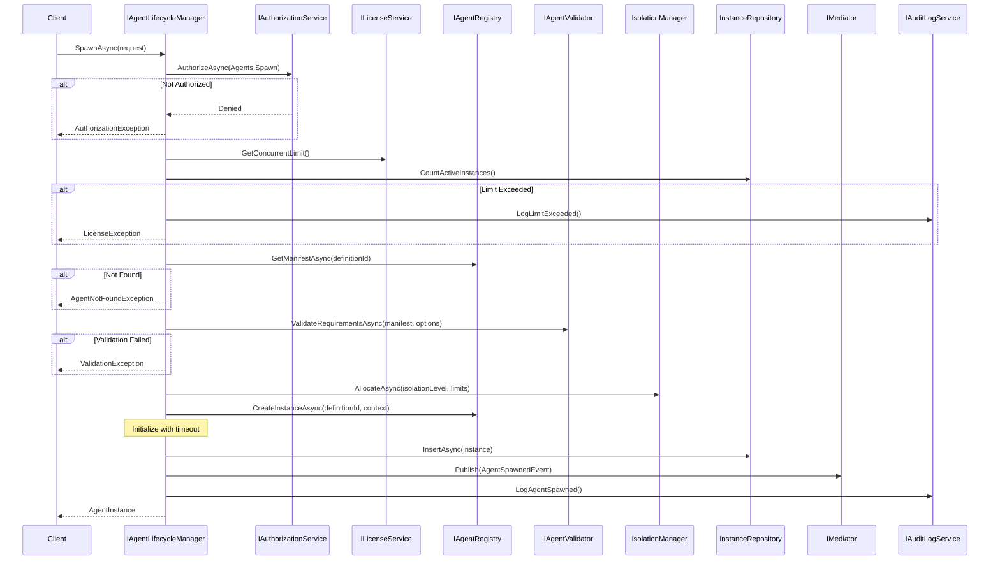
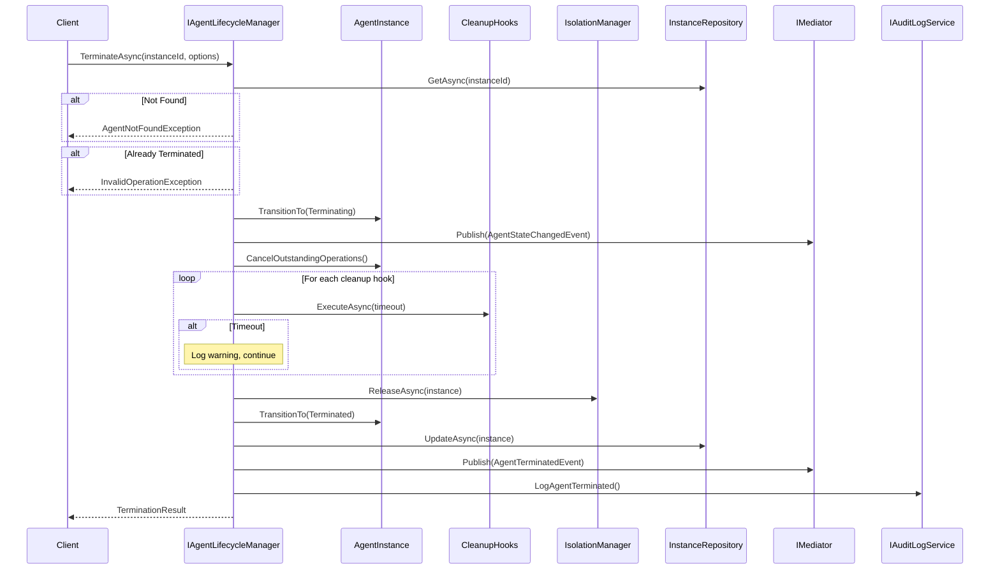

# LDS-01: Agent Spawner

## 1. Metadata & Categorization

| Field | Value |
| :--- | :--- |
| **Feature ID** | `LCM-SPW-01` |
| **Feature Name** | Agent Spawner |
| **Target Version** | `v0.12.2a` |
| **Module Scope** | `Lexichord.Modules.Agents` |
| **Swimlane** | Ensemble |
| **License Tier** | Core |
| **Feature Gate Key** | `FeatureFlags.Agents.Lifecycle.Spawn` |
| **Author** | Agent Architecture Lead |
| **Reviewer** | Lead Architect |
| **Status** | Draft |
| **Last Updated** | 2026-02-03 |
| **Parent Spec** | [LCS-SBD-v0.12.2-AGT](./LCS-SBD-v0.12.2-AGT.md) |
| **Depends On** | [v0.12.1a (Agent Schema)](../v0.12.1/LCS-SBD-v0.12.1a-SCH.md), [v0.12.1d (Registry)](../v0.12.1/LCS-SBD-v0.12.1d-REG.md), [v0.11.1 (Authorization)](../../v0.11.x/v0.11.1/LCS-SBD-v0.11.1-SEC.md) |
| **Estimated Hours** | 10 |

---

## 2. Executive Summary

### 2.1 The Requirement

The system requires a mechanism to dynamically create, configure, and manage agent instances at runtime. Without a lifecycle manager, agents cannot be spawned on demand, resource limits cannot be enforced, and there is no centralized control over running agents. Users need the ability to start agents with specific configurations, monitor their execution, and terminate them gracefully.

### 2.2 The Proposed Solution

Implement the `IAgentLifecycleManager` interface providing:
- `SpawnAsync()` for dynamic agent creation with isolation and resource limits
- `GetInstanceAsync()` and `GetActiveInstancesAsync()` for instance discovery
- `TerminateAsync()` for graceful shutdown
- `ObserveAsync()` for real-time event streaming
- License-gated concurrency limits per tier
- Full audit logging of all lifecycle operations

---

## 3. Architecture & Modular Strategy

### 3.1 Dependencies

**Upstream Modules:**
- `Lexichord.Modules.Agents.Abstractions` — `IAgent`, `AgentId`, `AgentState`, `AgentManifest` (v0.12.1a)
- `Lexichord.Modules.Agents` — `IAgentRegistry`, `AgentFactory` (v0.12.1d)
- `Lexichord.Modules.Agents` — `IAgentValidator` (v0.12.1e)
- `Lexichord.Modules.Security` — `IAuthorizationService` (v0.11.1)
- `Lexichord.Modules.Security` — `IAuditLogService` (v0.11.2)
- `Lexichord.Host` — `IMediator`, `ILicenseService`

**NuGet Packages:**
- `MediatR` (event publishing)
- `Microsoft.Extensions.Logging.Abstractions` (logging)
- `System.Threading.Channels` (event streaming)

### 3.2 Licensing Behavior

- **Load Behavior:** [x] **Soft Gate** — Module loads but enforces concurrency limits per tier.
- **Fallback Experience:**
  - Core: 2 concurrent agents, None/Thread isolation only
  - WriterPro: 5 concurrent agents, adds Linear restart policy
  - Teams: 20 concurrent agents, adds Process isolation, all restart policies
  - Enterprise: Unlimited agents, adds Container isolation

---

## 4. Data Contract (The API)

### 4.1 Agent Lifecycle Manager Interface

```csharp
namespace Lexichord.Modules.Agents;

/// <summary>
/// Manages the complete lifecycle of agent instances including spawning,
/// monitoring, and graceful termination. This is the central orchestration
/// point for all agent runtime operations.
/// </summary>
/// <remarks>
/// <para>
/// The lifecycle manager enforces license-based concurrency limits and
/// ensures all operations are properly authorized and audited.
/// </para>
/// <para>
/// All state transitions follow the defined state machine:
/// Initializing → Ready → Processing ⇄ Waiting → Terminating → Terminated
/// </para>
/// </remarks>
public interface IAgentLifecycleManager
{
    /// <summary>
    /// Spawns a new agent instance with the given configuration.
    /// </summary>
    /// <param name="request">The spawn request containing agent definition and options.</param>
    /// <param name="ct">Cancellation token for the spawn operation.</param>
    /// <returns>The newly created agent instance.</returns>
    /// <exception cref="ArgumentNullException">Request is null.</exception>
    /// <exception cref="AgentNotFoundException">Agent definition not found in registry.</exception>
    /// <exception cref="LicenseException">Concurrent agent limit exceeded for license tier.</exception>
    /// <exception cref="AuthorizationException">User not authorized to spawn agents.</exception>
    /// <exception cref="AgentInitializationException">Agent initialization failed.</exception>
    /// <exception cref="TimeoutException">Initialization exceeded timeout.</exception>
    /// <example>
    /// <code>
    /// var request = new SpawnRequest
    /// {
    ///     AgentDefinitionId = codeAnalyzerId,
    ///     Options = new AgentSpawnOptions
    ///     {
    ///         Name = "Code Review Agent",
    ///         IsolationLevel = IsolationLevel.Thread,
    ///         ResourceLimits = new ResourceLimits { MaxMemoryMb = 256 }
    ///     }
    /// };
    /// var instance = await lifecycleManager.SpawnAsync(request);
    /// </code>
    /// </example>
    Task<AgentInstance> SpawnAsync(
        SpawnRequest request,
        CancellationToken ct = default);

    /// <summary>
    /// Gets an agent instance by its unique identifier.
    /// </summary>
    /// <param name="agentInstanceId">The instance ID to look up.</param>
    /// <param name="ct">Cancellation token.</param>
    /// <returns>The agent instance, or null if not found.</returns>
    /// <remarks>
    /// Returns instances in any state, including terminated instances
    /// (which are retained for a configurable period for audit purposes).
    /// </remarks>
    Task<AgentInstance?> GetInstanceAsync(
        Guid agentInstanceId,
        CancellationToken ct = default);

    /// <summary>
    /// Gets all active agent instances matching the optional filter.
    /// </summary>
    /// <param name="filter">Optional filter criteria.</param>
    /// <param name="ct">Cancellation token.</param>
    /// <returns>List of matching agent instances.</returns>
    /// <remarks>
    /// By default, returns only instances owned by the current user/workspace.
    /// Enterprise tier can query across workspaces with appropriate permissions.
    /// </remarks>
    Task<IReadOnlyList<AgentInstance>> GetActiveInstancesAsync(
        GetInstancesFilter? filter = null,
        CancellationToken ct = default);

    /// <summary>
    /// Terminates an agent instance gracefully.
    /// </summary>
    /// <param name="agentInstanceId">The instance to terminate.</param>
    /// <param name="options">Optional termination configuration.</param>
    /// <param name="ct">Cancellation token.</param>
    /// <returns>Result indicating success and whether shutdown was graceful.</returns>
    /// <exception cref="AgentNotFoundException">Instance not found.</exception>
    /// <exception cref="InvalidOperationException">Instance already terminated.</exception>
    /// <remarks>
    /// <para>
    /// Graceful shutdown follows this sequence:
    /// 1. Transition to Terminating state
    /// 2. Cancel outstanding operations
    /// 3. Execute cleanup hooks
    /// 4. Release resources
    /// 5. Transition to Terminated state
    /// </para>
    /// <para>
    /// If graceful shutdown exceeds GracefulTimeout and ForceIfTimeout is true,
    /// the agent is forcibly terminated.
    /// </para>
    /// </remarks>
    Task<TerminationResult> TerminateAsync(
        Guid agentInstanceId,
        TerminationOptions? options = null,
        CancellationToken ct = default);

    /// <summary>
    /// Observes real-time events for an agent instance.
    /// </summary>
    /// <param name="agentInstanceId">The instance to observe.</param>
    /// <param name="options">Optional filtering of event types.</param>
    /// <returns>Async enumerable of agent events.</returns>
    /// <remarks>
    /// <para>
    /// The stream continues until the agent is terminated or the
    /// enumeration is disposed. Events are buffered with a configurable
    /// capacity to prevent memory issues.
    /// </para>
    /// <para>
    /// Event types include: state changes, health updates, metrics,
    /// errors, and restart attempts.
    /// </para>
    /// </remarks>
    IAsyncEnumerable<AgentEvent> ObserveAsync(
        Guid agentInstanceId,
        ObservationOptions? options = null);

    /// <summary>
    /// Suspends an active agent instance.
    /// </summary>
    /// <param name="agentInstanceId">The instance to suspend.</param>
    /// <param name="ct">Cancellation token.</param>
    /// <exception cref="AgentNotFoundException">Instance not found.</exception>
    /// <exception cref="InvalidOperationException">Instance not in suspendable state.</exception>
    /// <remarks>
    /// Suspended agents retain their resources but stop processing new work.
    /// They can be resumed via <see cref="ResumeAsync"/>.
    /// </remarks>
    Task SuspendAsync(
        Guid agentInstanceId,
        CancellationToken ct = default);

    /// <summary>
    /// Resumes a suspended agent instance.
    /// </summary>
    /// <param name="agentInstanceId">The instance to resume.</param>
    /// <param name="ct">Cancellation token.</param>
    /// <exception cref="AgentNotFoundException">Instance not found.</exception>
    /// <exception cref="InvalidOperationException">Instance not suspended.</exception>
    Task ResumeAsync(
        Guid agentInstanceId,
        CancellationToken ct = default);

    /// <summary>
    /// Gets lifecycle statistics for the current user/workspace.
    /// </summary>
    /// <param name="ct">Cancellation token.</param>
    /// <returns>Aggregate statistics about agent instances.</returns>
    Task<LifecycleStatistics> GetStatisticsAsync(
        CancellationToken ct = default);
}
```

### 4.2 Spawn Request

```csharp
namespace Lexichord.Modules.Agents.Abstractions;

/// <summary>
/// Request to spawn a new agent instance.
/// </summary>
/// <remarks>
/// The AgentDefinitionId must reference a valid agent registered in
/// <see cref="IAgentRegistry"/>. The registry provides the AgentManifest
/// and AgentFactory used to create the instance.
/// </remarks>
public sealed record SpawnRequest
{
    /// <summary>
    /// ID of the agent definition to instantiate.
    /// MUST exist in the agent registry.
    /// </summary>
    /// <remarks>
    /// Use <see cref="IAgentRegistry.GetManifestAsync"/> to verify
    /// the agent exists before spawning.
    /// </remarks>
    public required Guid AgentDefinitionId { get; init; }

    /// <summary>
    /// Optional spawn configuration.
    /// If null, default options are applied based on the agent's requirements.
    /// </summary>
    public AgentSpawnOptions? Options { get; init; }

    /// <summary>
    /// Optional contextual data passed to agent initialization.
    /// </summary>
    /// <remarks>
    /// <para>
    /// Context data is passed to <see cref="IAgent.InitializeAsync"/> via
    /// <see cref="AgentContext"/>. Use this to provide runtime configuration
    /// that varies per spawn.
    /// </para>
    /// <para>
    /// Keys are case-insensitive. Values must be JSON-serializable.
    /// </para>
    /// </remarks>
    /// <example>
    /// <code>
    /// Context = new Dictionary&lt;string, object&gt;
    /// {
    ///     ["targetRepository"] = "/path/to/repo",
    ///     ["analysisDepth"] = "deep"
    /// }
    /// </code>
    /// </example>
    public IReadOnlyDictionary<string, object>? Context { get; init; }

    /// <summary>
    /// Validates the spawn request.
    /// </summary>
    /// <returns>True if valid.</returns>
    public bool IsValid() => AgentDefinitionId != Guid.Empty;
}
```

### 4.3 Agent Spawn Options

```csharp
namespace Lexichord.Modules.Agents.Abstractions;

/// <summary>
/// Configuration options for agent spawning.
/// All properties have sensible defaults; override only as needed.
/// </summary>
public sealed record AgentSpawnOptions
{
    /// <summary>
    /// Timeout for agent initialization.
    /// If exceeded, spawn fails with <see cref="TimeoutException"/>.
    /// </summary>
    /// <remarks>
    /// Complex agents (e.g., those loading ML models) may need longer timeouts.
    /// Default: 30 seconds.
    /// </remarks>
    public TimeSpan InitializationTimeout { get; init; } = TimeSpan.FromSeconds(30);

    /// <summary>
    /// Resource constraints for the agent.
    /// </summary>
    /// <remarks>
    /// If null, defaults from the agent's <see cref="AgentRequirements"/> are used.
    /// Explicit limits here override the manifest defaults.
    /// </remarks>
    public ResourceLimits? ResourceLimits { get; init; }

    /// <summary>
    /// Isolation level determining how the agent is separated from others.
    /// </summary>
    /// <remarks>
    /// <para>Higher isolation = more resource overhead but better security.</para>
    /// <list type="bullet">
    /// <item><description>None: Same thread as caller (no isolation, fastest)</description></item>
    /// <item><description>Thread: Separate thread (low isolation, low overhead)</description></item>
    /// <item><description>Process: Separate process (high isolation, moderate overhead)</description></item>
    /// <item><description>Container: Docker container (strongest isolation, highest overhead)</description></item>
    /// </list>
    /// </remarks>
    public IsolationLevel IsolationLevel { get; init; } = IsolationLevel.Thread;

    /// <summary>
    /// Restart policy applied when the agent fails.
    /// </summary>
    /// <remarks>
    /// If null, no automatic restarts occur (equivalent to RestartPolicyType.None).
    /// Advanced policies (Exponential) require Teams tier or higher.
    /// </remarks>
    public RestartPolicy? RestartPolicy { get; init; }

    /// <summary>
    /// Health check configuration for the agent.
    /// </summary>
    /// <remarks>
    /// If null, default heartbeat checks are used.
    /// Custom health checks require WriterPro tier or higher.
    /// </remarks>
    public HealthCheckConfig? HealthCheck { get; init; }

    /// <summary>
    /// Human-readable name for the instance.
    /// </summary>
    /// <remarks>
    /// Displayed in the lifecycle dashboard. If null, a default name
    /// is generated from the agent definition name and a short ID.
    /// </remarks>
    /// <example>"Code Review Agent - PR #123"</example>
    public string? Name { get; init; }

    /// <summary>
    /// Tags for grouping and filtering instances.
    /// </summary>
    /// <remarks>
    /// Tags are case-insensitive. Maximum 10 tags per instance.
    /// Each tag must be 1-50 characters, alphanumeric with hyphens.
    /// </remarks>
    /// <example>["code-review", "pr-123", "high-priority"]</example>
    public IReadOnlyList<string>? Tags { get; init; }

    /// <summary>
    /// Priority level for resource allocation.
    /// </summary>
    /// <remarks>
    /// Higher priority agents get resources first during contention.
    /// Enterprise tier only. Default: Normal.
    /// </remarks>
    public AgentPriority Priority { get; init; } = AgentPriority.Normal;
}

/// <summary>
/// Agent execution priority levels.
/// </summary>
public enum AgentPriority
{
    /// <summary>Background processing, yields to other agents.</summary>
    Low = 0,

    /// <summary>Standard priority (default).</summary>
    Normal = 1,

    /// <summary>Elevated priority for time-sensitive work.</summary>
    High = 2,

    /// <summary>Highest priority, Enterprise tier only.</summary>
    Critical = 3
}
```

### 4.4 Resource Limits

```csharp
namespace Lexichord.Modules.Agents.Abstractions;

/// <summary>
/// Resource constraints for an agent instance.
/// Enforced at runtime; exceeding limits may trigger throttling or termination.
/// </summary>
public sealed record ResourceLimits
{
    /// <summary>
    /// Maximum memory allocation in megabytes.
    /// </summary>
    /// <remarks>
    /// For process-isolated agents, this is enforced via OS limits.
    /// For thread-isolated agents, this is advisory and checked periodically.
    /// Default: 512 MB. Range: 64-8192 MB.
    /// </remarks>
    public int MaxMemoryMb { get; init; } = 512;

    /// <summary>
    /// Maximum CPU percentage (0-100).
    /// </summary>
    /// <remarks>
    /// 0 means unlimited. For process isolation, enforced via CPU affinity.
    /// For thread isolation, advisory only.
    /// Default: 0 (unlimited).
    /// </remarks>
    public int MaxCpuPercent { get; init; } = 0;

    /// <summary>
    /// Maximum execution time per operation.
    /// </summary>
    /// <remarks>
    /// If a single ProcessAsync call exceeds this, it is cancelled.
    /// Default: 5 minutes. Range: 1 second - 1 hour.
    /// </remarks>
    public TimeSpan ExecutionTimeout { get; init; } = TimeSpan.FromMinutes(5);

    /// <summary>
    /// Maximum number of concurrent worker threads.
    /// </summary>
    /// <remarks>
    /// Applies to agents using internal parallelism.
    /// Default: 4. Range: 1-32.
    /// </remarks>
    public int MaxWorkerThreads { get; init; } = 4;

    /// <summary>
    /// Maximum number of concurrent tasks.
    /// </summary>
    /// <remarks>
    /// Limits how many ProcessAsync calls can be in flight simultaneously.
    /// Default: 10. Range: 1-100.
    /// </remarks>
    public int MaxConcurrentTasks { get; init; } = 10;

    /// <summary>
    /// Maximum LLM tokens per minute.
    /// </summary>
    /// <remarks>
    /// Prevents runaway token consumption. 0 means use account default.
    /// Default: 0 (account default).
    /// </remarks>
    public int MaxTokensPerMinute { get; init; } = 0;

    /// <summary>
    /// Validates the resource limits are within acceptable ranges.
    /// </summary>
    /// <returns>Validation result with any errors.</returns>
    public ValidationResult Validate()
    {
        var errors = new List<string>();

        if (MaxMemoryMb < 64 || MaxMemoryMb > 8192)
            errors.Add($"MaxMemoryMb must be 64-8192, was {MaxMemoryMb}");

        if (MaxCpuPercent < 0 || MaxCpuPercent > 100)
            errors.Add($"MaxCpuPercent must be 0-100, was {MaxCpuPercent}");

        if (ExecutionTimeout < TimeSpan.FromSeconds(1) || ExecutionTimeout > TimeSpan.FromHours(1))
            errors.Add($"ExecutionTimeout must be 1s-1h, was {ExecutionTimeout}");

        if (MaxWorkerThreads < 1 || MaxWorkerThreads > 32)
            errors.Add($"MaxWorkerThreads must be 1-32, was {MaxWorkerThreads}");

        if (MaxConcurrentTasks < 1 || MaxConcurrentTasks > 100)
            errors.Add($"MaxConcurrentTasks must be 1-100, was {MaxConcurrentTasks}");

        return errors.Count == 0
            ? ValidationResult.Success()
            : ValidationResult.Failure(errors);
    }
}
```

### 4.5 Isolation Level

```csharp
namespace Lexichord.Modules.Agents.Abstractions;

/// <summary>
/// How an agent instance is isolated from other agents and the host process.
/// Higher isolation = better security but more resource overhead.
/// </summary>
public enum IsolationLevel
{
    /// <summary>
    /// No isolation. Agent runs on caller's thread.
    /// Fastest but provides no protection from misbehaving agents.
    /// Suitable for trusted, built-in agents only.
    /// </summary>
    None = 0,

    /// <summary>
    /// Thread isolation. Agent runs on a dedicated thread pool.
    /// Low overhead, protects host from blocking but not from crashes.
    /// Available on all tiers. Default for most agents.
    /// </summary>
    Thread = 1,

    /// <summary>
    /// Process isolation. Agent runs in a separate OS process.
    /// Provides crash isolation and resource enforcement.
    /// Requires Teams tier or higher. Moderate overhead.
    /// </summary>
    Process = 2,

    /// <summary>
    /// Container isolation. Agent runs in a Docker container.
    /// Strongest isolation with full resource control and sandboxing.
    /// Requires Enterprise tier. Highest overhead.
    /// </summary>
    Container = 3
}
```

### 4.6 Restart Policy

```csharp
namespace Lexichord.Modules.Agents.Abstractions;

/// <summary>
/// Policy for automatically restarting failed agents.
/// Enables resilience against transient failures.
/// </summary>
public sealed record RestartPolicy
{
    /// <summary>
    /// Type of restart policy determining delay calculation.
    /// </summary>
    public RestartPolicyType Type { get; init; } = RestartPolicyType.Exponential;

    /// <summary>
    /// Maximum number of restart attempts before giving up.
    /// </summary>
    /// <remarks>
    /// After MaxRetries, the agent transitions to Failed state permanently.
    /// Default: 3. Range: 0-10.
    /// </remarks>
    public int MaxRetries { get; init; } = 3;

    /// <summary>
    /// Initial delay before first retry.
    /// </summary>
    /// <remarks>
    /// For Immediate policy, this is ignored.
    /// Default: 1 second. Range: 0-5 minutes.
    /// </remarks>
    public TimeSpan InitialDelay { get; init; } = TimeSpan.FromSeconds(1);

    /// <summary>
    /// Maximum delay between retries.
    /// </summary>
    /// <remarks>
    /// Caps the delay for Exponential/Linear policies.
    /// Default: 1 minute. Range: InitialDelay - 10 minutes.
    /// </remarks>
    public TimeSpan MaxDelay { get; init; } = TimeSpan.FromMinutes(1);

    /// <summary>
    /// Multiplier for exponential backoff.
    /// </summary>
    /// <remarks>
    /// Each retry multiplies the previous delay by this factor.
    /// Default: 2.0. Range: 1.1-5.0.
    /// </remarks>
    public double BackoffMultiplier { get; init; } = 2.0;

    /// <summary>
    /// Whether to add random jitter to retry delays.
    /// </summary>
    /// <remarks>
    /// Jitter prevents thundering herd when multiple agents fail simultaneously.
    /// Adds ±25% randomization to the calculated delay.
    /// Default: true.
    /// </remarks>
    public bool UseJitter { get; init; } = true;

    /// <summary>
    /// Duration after which circuit breaker opens permanently.
    /// </summary>
    /// <remarks>
    /// If an agent has been failing continuously for this duration,
    /// no more restarts are attempted. Default: 5 minutes.
    /// </remarks>
    public TimeSpan CircuitBreakerTimeout { get; init; } = TimeSpan.FromMinutes(5);

    /// <summary>
    /// Default policy: 3 retries with exponential backoff.
    /// </summary>
    public static RestartPolicy Default => new();

    /// <summary>
    /// No automatic restarts.
    /// </summary>
    public static RestartPolicy None => new() { Type = RestartPolicyType.None, MaxRetries = 0 };

    /// <summary>
    /// Immediate restart without delay (up to 3 times).
    /// </summary>
    public static RestartPolicy Immediate => new()
    {
        Type = RestartPolicyType.Immediate,
        MaxRetries = 3,
        InitialDelay = TimeSpan.Zero
    };
}

/// <summary>
/// Types of restart policies determining delay calculation.
/// </summary>
public enum RestartPolicyType
{
    /// <summary>
    /// No automatic restart. Agent stays Failed after first failure.
    /// </summary>
    None = 0,

    /// <summary>
    /// Immediate restart without delay.
    /// Use for agents where failures are very transient (e.g., network blip).
    /// </summary>
    Immediate = 1,

    /// <summary>
    /// Linear backoff: delay = InitialDelay × attemptNumber.
    /// Predictable delay growth. Available on WriterPro+.
    /// </summary>
    Linear = 2,

    /// <summary>
    /// Exponential backoff: delay = InitialDelay × (BackoffMultiplier ^ attemptNumber).
    /// Recommended for most failure scenarios. Available on Teams+.
    /// </summary>
    Exponential = 3
}
```

### 4.7 Agent Instance

```csharp
namespace Lexichord.Modules.Agents.Abstractions;

/// <summary>
/// Runtime state of an agent instance.
/// Represents the current snapshot of a running or terminated agent.
/// </summary>
/// <remarks>
/// AgentInstance is immutable; state changes create new instances.
/// Subscribe to events via <see cref="IAgentLifecycleManager.ObserveAsync"/>
/// for real-time updates.
/// </remarks>
public sealed record AgentInstance
{
    /// <summary>
    /// Unique identifier for this instance.
    /// </summary>
    /// <remarks>
    /// Different from AgentId which identifies the agent definition.
    /// Each spawn creates a new InstanceId.
    /// </remarks>
    public required Guid InstanceId { get; init; }

    /// <summary>
    /// ID of the agent definition this instance was created from.
    /// </summary>
    /// <remarks>
    /// Use with <see cref="IAgentRegistry.GetManifestAsync"/> to get
    /// the agent's manifest and capabilities.
    /// </remarks>
    public required Guid DefinitionId { get; init; }

    /// <summary>
    /// Current lifecycle state of the agent.
    /// </summary>
    /// <remarks>
    /// State transitions follow the defined state machine.
    /// Use <see cref="CanTransitionTo"/> to check valid transitions.
    /// </remarks>
    public required AgentState State { get; init; }

    /// <summary>
    /// Current health status based on health checks.
    /// </summary>
    public required AgentHealthStatus Health { get; init; }

    /// <summary>
    /// Real-time performance and resource metrics.
    /// </summary>
    /// <remarks>
    /// May be null if metrics collection is disabled or not yet available.
    /// Updated periodically (default: every 5 seconds).
    /// </remarks>
    public AgentMetrics? Metrics { get; init; }

    /// <summary>
    /// When the instance was created (spawn initiated).
    /// </summary>
    public required DateTimeOffset CreatedAt { get; init; }

    /// <summary>
    /// When the instance state was last updated.
    /// </summary>
    public required DateTimeOffset UpdatedAt { get; init; }

    /// <summary>
    /// When the instance transitioned to a terminal state.
    /// </summary>
    /// <remarks>
    /// Null if still active. Set when state becomes Terminated or Failed.
    /// </remarks>
    public DateTimeOffset? TerminatedAt { get; init; }

    /// <summary>
    /// Number of times this instance has been restarted.
    /// </summary>
    /// <remarks>
    /// Increments each time the restart policy triggers a restart.
    /// Resets when the agent becomes healthy again.
    /// </remarks>
    public int RestartCount { get; init; }

    /// <summary>
    /// Error message if in Failed state.
    /// </summary>
    public string? ErrorMessage { get; init; }

    /// <summary>
    /// The spawn options that were applied.
    /// </summary>
    public AgentSpawnOptions? SpawnOptions { get; init; }

    /// <summary>
    /// Tags associated with this instance.
    /// </summary>
    public IReadOnlyList<string> Tags { get; init; } = [];

    /// <summary>
    /// Human-readable name.
    /// </summary>
    public string? Name { get; init; }

    /// <summary>
    /// User ID of the owner who spawned this instance.
    /// </summary>
    public Guid? OwnerId { get; init; }

    /// <summary>
    /// Workspace ID where this instance runs.
    /// </summary>
    public Guid? WorkspaceId { get; init; }

    /// <summary>
    /// Checks if the instance is in an active (non-terminal) state.
    /// </summary>
    public bool IsActive => State is not (AgentState.Terminated or AgentState.Failed);

    /// <summary>
    /// Checks if a state transition is valid from the current state.
    /// </summary>
    /// <param name="targetState">The desired target state.</param>
    /// <returns>True if the transition is allowed.</returns>
    public bool CanTransitionTo(AgentState targetState) =>
        AgentStateTransitions.IsValid(State, targetState);

    /// <summary>
    /// Calculated uptime since creation.
    /// </summary>
    public TimeSpan Uptime => (TerminatedAt ?? DateTimeOffset.UtcNow) - CreatedAt;
}

/// <summary>
/// Valid state transitions for the agent state machine.
/// </summary>
public static class AgentStateTransitions
{
    private static readonly Dictionary<AgentState, AgentState[]> ValidTransitions = new()
    {
        [AgentState.Initializing] = [AgentState.Ready, AgentState.Failed],
        [AgentState.Ready] = [AgentState.Processing, AgentState.Suspended, AgentState.Terminating],
        [AgentState.Processing] = [AgentState.Waiting, AgentState.Failed, AgentState.Terminating],
        [AgentState.Waiting] = [AgentState.Processing, AgentState.Suspended, AgentState.Terminating],
        [AgentState.Suspended] = [AgentState.Ready, AgentState.Terminating],
        [AgentState.Terminating] = [AgentState.Terminated],
        [AgentState.Terminated] = [],
        [AgentState.Failed] = [AgentState.Initializing, AgentState.Terminated]
    };

    /// <summary>
    /// Checks if a transition from one state to another is valid.
    /// </summary>
    public static bool IsValid(AgentState from, AgentState to) =>
        ValidTransitions.TryGetValue(from, out var valid) && valid.Contains(to);
}
```

### 4.8 Termination Types

```csharp
namespace Lexichord.Modules.Agents.Abstractions;

/// <summary>
/// Options for terminating an agent instance.
/// </summary>
public sealed record TerminationOptions
{
    /// <summary>
    /// Timeout for graceful shutdown.
    /// </summary>
    /// <remarks>
    /// After this period, if ForceIfTimeout is true, the agent is forcibly terminated.
    /// Default: 10 seconds. Range: 1 second - 5 minutes.
    /// </remarks>
    public TimeSpan GracefulTimeout { get; init; } = TimeSpan.FromSeconds(10);

    /// <summary>
    /// Whether to force terminate if graceful shutdown times out.
    /// </summary>
    /// <remarks>
    /// If false and graceful shutdown times out, TerminationResult.Success will be false.
    /// Default: true.
    /// </remarks>
    public bool ForceIfTimeout { get; init; } = true;

    /// <summary>
    /// Human-readable reason for termination.
    /// </summary>
    /// <remarks>
    /// Logged in audit trail and displayed in dashboard.
    /// </remarks>
    public string? Reason { get; init; }

    /// <summary>
    /// Whether to persist final state for later analysis.
    /// </summary>
    /// <remarks>
    /// If true, the agent's working memory and context are saved.
    /// Default: false.
    /// </remarks>
    public bool PersistFinalState { get; init; } = false;

    /// <summary>
    /// Default termination options.
    /// </summary>
    public static TerminationOptions Default => new();

    /// <summary>
    /// Immediate termination without graceful shutdown.
    /// </summary>
    public static TerminationOptions Immediate => new()
    {
        GracefulTimeout = TimeSpan.Zero,
        ForceIfTimeout = true,
        Reason = "Immediate termination requested"
    };
}

/// <summary>
/// Result of a termination operation.
/// </summary>
public sealed record TerminationResult
{
    /// <summary>
    /// Whether termination succeeded.
    /// </summary>
    public required bool Success { get; init; }

    /// <summary>
    /// Whether the shutdown was graceful (vs forced).
    /// </summary>
    public required bool WasGraceful { get; init; }

    /// <summary>
    /// Error message if termination failed.
    /// </summary>
    public string? ErrorMessage { get; init; }

    /// <summary>
    /// Final state of the agent after termination.
    /// </summary>
    public AgentInstance? FinalInstance { get; init; }

    /// <summary>
    /// How long the termination took.
    /// </summary>
    public TimeSpan Duration { get; init; }

    /// <summary>
    /// Creates a successful termination result.
    /// </summary>
    public static TerminationResult Successful(AgentInstance instance, bool wasGraceful, TimeSpan duration) =>
        new()
        {
            Success = true,
            WasGraceful = wasGraceful,
            FinalInstance = instance,
            Duration = duration
        };

    /// <summary>
    /// Creates a failed termination result.
    /// </summary>
    public static TerminationResult Failed(string error) =>
        new()
        {
            Success = false,
            WasGraceful = false,
            ErrorMessage = error
        };
}
```

### 4.9 Query and Filter Types

```csharp
namespace Lexichord.Modules.Agents.Abstractions;

/// <summary>
/// Filter criteria for querying agent instances.
/// </summary>
public sealed record GetInstancesFilter
{
    /// <summary>
    /// Filter by lifecycle state.
    /// </summary>
    public AgentState? State { get; init; }

    /// <summary>
    /// Filter by health state.
    /// </summary>
    public HealthState? HealthState { get; init; }

    /// <summary>
    /// Filter by tag (instance must have this tag).
    /// </summary>
    public string? Tag { get; init; }

    /// <summary>
    /// Filter by agent definition ID.
    /// </summary>
    public Guid? DefinitionId { get; init; }

    /// <summary>
    /// Filter by owner user ID.
    /// </summary>
    /// <remarks>
    /// Requires appropriate permissions to query other users' instances.
    /// </remarks>
    public Guid? OwnerId { get; init; }

    /// <summary>
    /// Filter by name pattern (supports * wildcard).
    /// </summary>
    public string? NamePattern { get; init; }

    /// <summary>
    /// Include terminated instances in results.
    /// </summary>
    /// <remarks>
    /// Default: false (only active instances).
    /// </remarks>
    public bool IncludeTerminated { get; init; } = false;

    /// <summary>
    /// Maximum number of results.
    /// </summary>
    /// <remarks>
    /// Default: 100. Range: 1-1000.
    /// </remarks>
    public int Limit { get; init; } = 100;

    /// <summary>
    /// Number of results to skip for pagination.
    /// </summary>
    public int Offset { get; init; } = 0;

    /// <summary>
    /// Empty filter matching all active instances.
    /// </summary>
    public static GetInstancesFilter All => new();
}

/// <summary>
/// Options for observing agent events.
/// </summary>
public sealed record ObservationOptions
{
    /// <summary>
    /// Include state change events.
    /// </summary>
    public bool IncludeStateChanges { get; init; } = true;

    /// <summary>
    /// Include health check events.
    /// </summary>
    public bool IncludeHealthChecks { get; init; } = true;

    /// <summary>
    /// Include periodic metric updates.
    /// </summary>
    public bool IncludeMetrics { get; init; } = false;

    /// <summary>
    /// Include error events.
    /// </summary>
    public bool IncludeErrors { get; init; } = true;

    /// <summary>
    /// Include restart attempt events.
    /// </summary>
    public bool IncludeRestarts { get; init; } = true;

    /// <summary>
    /// Buffer capacity for events.
    /// </summary>
    /// <remarks>
    /// If buffer fills, oldest events are dropped.
    /// Default: 100.
    /// </remarks>
    public int BufferCapacity { get; init; } = 100;

    /// <summary>
    /// Default options (all event types except metrics).
    /// </summary>
    public static ObservationOptions Default => new();
}

/// <summary>
/// Lifecycle statistics for a user/workspace.
/// </summary>
public sealed record LifecycleStatistics
{
    /// <summary>
    /// Total active (non-terminated) instances.
    /// </summary>
    public required int ActiveInstances { get; init; }

    /// <summary>
    /// Instances by state.
    /// </summary>
    public required IReadOnlyDictionary<AgentState, int> ByState { get; init; }

    /// <summary>
    /// Instances by health state.
    /// </summary>
    public required IReadOnlyDictionary<HealthState, int> ByHealth { get; init; }

    /// <summary>
    /// Maximum concurrent instances allowed by license.
    /// </summary>
    public required int MaxConcurrent { get; init; }

    /// <summary>
    /// Total instances spawned (including terminated).
    /// </summary>
    public required long TotalSpawned { get; init; }

    /// <summary>
    /// Total instances terminated.
    /// </summary>
    public required long TotalTerminated { get; init; }

    /// <summary>
    /// Average instance uptime.
    /// </summary>
    public required TimeSpan AverageUptime { get; init; }

    /// <summary>
    /// Total restart attempts across all instances.
    /// </summary>
    public required long TotalRestarts { get; init; }
}
```

### 4.10 Agent Events

```csharp
namespace Lexichord.Modules.Agents.Abstractions;

/// <summary>
/// Base class for all agent lifecycle events.
/// </summary>
public abstract record AgentEvent
{
    /// <summary>
    /// The instance this event relates to.
    /// </summary>
    public required Guid InstanceId { get; init; }

    /// <summary>
    /// When the event occurred.
    /// </summary>
    public required DateTimeOffset OccurredAt { get; init; }

    /// <summary>
    /// Correlation ID for tracing.
    /// </summary>
    public string? CorrelationId { get; init; }
}

/// <summary>
/// Published when an agent's state changes.
/// </summary>
public sealed record AgentStateChangedEvent : AgentEvent, INotification
{
    /// <summary>
    /// State before the transition.
    /// </summary>
    public required AgentState PreviousState { get; init; }

    /// <summary>
    /// State after the transition.
    /// </summary>
    public required AgentState NewState { get; init; }

    /// <summary>
    /// Reason for the transition.
    /// </summary>
    public string? Reason { get; init; }
}

/// <summary>
/// Published when an agent's health status changes.
/// </summary>
public sealed record AgentHealthChangedEvent : AgentEvent, INotification
{
    /// <summary>
    /// Health state before the change.
    /// </summary>
    public required HealthState PreviousHealth { get; init; }

    /// <summary>
    /// Health state after the change.
    /// </summary>
    public required HealthState NewHealth { get; init; }

    /// <summary>
    /// Details about the health change.
    /// </summary>
    public string? Details { get; init; }
}

/// <summary>
/// Published when an agent encounters an error.
/// </summary>
public sealed record AgentErrorEvent : AgentEvent, INotification
{
    /// <summary>
    /// Error message.
    /// </summary>
    public required string ErrorMessage { get; init; }

    /// <summary>
    /// Exception type if available.
    /// </summary>
    public string? ExceptionType { get; init; }

    /// <summary>
    /// Stack trace if available.
    /// </summary>
    public string? StackTrace { get; init; }

    /// <summary>
    /// Whether the error is recoverable.
    /// </summary>
    public bool IsRecoverable { get; init; }
}

/// <summary>
/// Published when an agent restart is attempted.
/// </summary>
public sealed record AgentRestartingEvent : AgentEvent, INotification
{
    /// <summary>
    /// Current attempt number (1-based).
    /// </summary>
    public required int AttemptNumber { get; init; }

    /// <summary>
    /// Maximum attempts allowed.
    /// </summary>
    public required int MaxAttempts { get; init; }

    /// <summary>
    /// Delay before the restart attempt.
    /// </summary>
    public TimeSpan? DelayBeforeRetry { get; init; }

    /// <summary>
    /// Reason for the restart.
    /// </summary>
    public string? Reason { get; init; }
}

/// <summary>
/// Published periodically with agent metrics.
/// </summary>
public sealed record AgentMetricsUpdatedEvent : AgentEvent, INotification
{
    /// <summary>
    /// The updated metrics.
    /// </summary>
    public required AgentMetrics Metrics { get; init; }
}

/// <summary>
/// Published when an agent is spawned.
/// </summary>
public sealed record AgentSpawnedEvent : AgentEvent, INotification
{
    /// <summary>
    /// The agent definition ID.
    /// </summary>
    public required Guid DefinitionId { get; init; }

    /// <summary>
    /// User who spawned the agent.
    /// </summary>
    public required Guid UserId { get; init; }

    /// <summary>
    /// Spawn options used.
    /// </summary>
    public AgentSpawnOptions? Options { get; init; }
}

/// <summary>
/// Published when an agent is terminated.
/// </summary>
public sealed record AgentTerminatedEvent : AgentEvent, INotification
{
    /// <summary>
    /// Final state of the agent.
    /// </summary>
    public required AgentState FinalState { get; init; }

    /// <summary>
    /// Whether termination was graceful.
    /// </summary>
    public required bool WasGraceful { get; init; }

    /// <summary>
    /// Reason for termination.
    /// </summary>
    public string? Reason { get; init; }

    /// <summary>
    /// Total uptime.
    /// </summary>
    public required TimeSpan Uptime { get; init; }
}
```

---

## 5. Implementation Logic

### 5.1 Spawn Flow



### 5.2 Termination Flow



---

## 6. Data Persistence (Database)

### 6.1 FluentMigrator Migration

```csharp
[Migration(20260203_1400, "Create agent instances table")]
public class CreateAgentInstancesTable : Migration
{
    public override void Up()
    {
        Create.Table("agent_instances")
            .WithColumn("id").AsGuid().PrimaryKey().WithDefault(SystemMethods.NewGuid)
            .WithColumn("definition_id").AsGuid().NotNullable()
            .WithColumn("state").AsString(50).NotNullable()
            .WithColumn("health_state").AsString(50).NotNullable()
            .WithColumn("name").AsString(200).Nullable()
            .WithColumn("owner_id").AsGuid().Nullable()
            .WithColumn("workspace_id").AsGuid().Nullable()
            .WithColumn("spawn_options_json").AsString(int.MaxValue).Nullable()
            .WithColumn("error_message").AsString(int.MaxValue).Nullable()
            .WithColumn("restart_count").AsInt32().NotNullable().WithDefaultValue(0)
            .WithColumn("created_at").AsDateTimeOffset().NotNullable().WithDefault(SystemMethods.CurrentUTCDateTime)
            .WithColumn("updated_at").AsDateTimeOffset().NotNullable().WithDefault(SystemMethods.CurrentUTCDateTime)
            .WithColumn("terminated_at").AsDateTimeOffset().Nullable();

        Create.Index("idx_agent_instances_state")
            .OnTable("agent_instances")
            .OnColumn("state");

        Create.Index("idx_agent_instances_owner")
            .OnTable("agent_instances")
            .OnColumn("owner_id");

        Create.Index("idx_agent_instances_definition")
            .OnTable("agent_instances")
            .OnColumn("definition_id");

        Create.Index("idx_agent_instances_active")
            .OnTable("agent_instances")
            .OnColumn("state")
            .Ascending()
            .OnColumn("owner_id")
            .Ascending();

        Create.Table("agent_instance_tags")
            .WithColumn("instance_id").AsGuid().NotNullable()
                .ForeignKey("fk_instance_tags_instance", "agent_instances", "id")
                .OnDelete(Rule.Cascade)
            .WithColumn("tag").AsString(50).NotNullable();

        Create.PrimaryKey("pk_agent_instance_tags")
            .OnTable("agent_instance_tags")
            .Columns("instance_id", "tag");

        Create.Index("idx_instance_tags_tag")
            .OnTable("agent_instance_tags")
            .OnColumn("tag");

        Create.Table("agent_instance_events")
            .WithColumn("id").AsGuid().PrimaryKey().WithDefault(SystemMethods.NewGuid)
            .WithColumn("instance_id").AsGuid().NotNullable()
                .ForeignKey("fk_instance_events_instance", "agent_instances", "id")
                .OnDelete(Rule.Cascade)
            .WithColumn("event_type").AsString(100).NotNullable()
            .WithColumn("event_data_json").AsString(int.MaxValue).NotNullable()
            .WithColumn("occurred_at").AsDateTimeOffset().NotNullable().WithDefault(SystemMethods.CurrentUTCDateTime)
            .WithColumn("correlation_id").AsString(100).Nullable();

        Create.Index("idx_instance_events_instance")
            .OnTable("agent_instance_events")
            .OnColumn("instance_id")
            .Ascending()
            .OnColumn("occurred_at")
            .Descending();

        Create.Index("idx_instance_events_correlation")
            .OnTable("agent_instance_events")
            .OnColumn("correlation_id");
    }

    public override void Down()
    {
        Delete.Table("agent_instance_events");
        Delete.Table("agent_instance_tags");
        Delete.Table("agent_instances");
    }
}
```

---

## 7. UI/UX Specifications

See [v0.12.2f (Lifecycle Dashboard UI)](./LCS-SBD-v0.12.2f-UI.md) for UI components consuming this service.

---

## 8. Observability & Logging

### 8.1 Log Templates

| Level | Template |
|:------|:---------|
| **Debug** | `[LCM] Spawn request received. DefinitionId: {DefinitionId}, Options: {Options}` |
| **Info** | `[LCM] Agent spawned. InstanceId: {InstanceId}, DefinitionId: {DefinitionId}, Isolation: {Isolation}` |
| **Info** | `[LCM] Agent state changed. InstanceId: {InstanceId}, From: {FromState}, To: {ToState}` |
| **Info** | `[LCM] Agent terminated. InstanceId: {InstanceId}, WasGraceful: {WasGraceful}, Uptime: {Uptime}` |
| **Warn** | `[LCM] Spawn rejected: concurrent limit exceeded. Current: {Current}, Max: {Max}` |
| **Warn** | `[LCM] Graceful shutdown timeout. InstanceId: {InstanceId}, Forcing termination.` |
| **Error** | `[LCM] Agent initialization failed. InstanceId: {InstanceId}, Error: {Error}` |
| **Error** | `[LCM] Agent crashed. InstanceId: {InstanceId}, Error: {Error}, StackTrace: {StackTrace}` |

### 8.2 Metrics

| Metric | Type | Description |
|:-------|:-----|:------------|
| `lifecycle.instances.active` | Gauge | Currently active instances |
| `lifecycle.instances.by_state` | Gauge | Instances per state |
| `lifecycle.spawn.duration` | Histogram | Spawn operation latency |
| `lifecycle.spawn.count` | Counter | Total spawn operations |
| `lifecycle.spawn.failures` | Counter | Failed spawn attempts |
| `lifecycle.terminate.duration` | Histogram | Termination latency |
| `lifecycle.terminate.count` | Counter | Total terminations |
| `lifecycle.terminate.forced` | Counter | Forced (non-graceful) terminations |
| `lifecycle.restarts.count` | Counter | Total restart attempts |
| `lifecycle.license.rejections` | Counter | Spawns rejected due to license |

---

## 9. Security & Safety

- **Authorization:** All operations require `Agents.Lifecycle` permission via `IAuthorizationService`.
- **License Enforcement:** Concurrent limits checked at spawn time and periodically.
- **Audit Trail:** All spawn/terminate operations logged via `IAuditLogService`.
- **Input Validation:** All spawn options validated before use.
- **Resource Isolation:** Higher isolation levels for untrusted agents.
- **Timeout Enforcement:** All operations have configurable timeouts.

---

## 10. Acceptance Criteria (QA)

1. **[Functional]** `SpawnAsync` creates a running agent instance within 2s P95.
2. **[Functional]** `TerminateAsync` gracefully shuts down an agent within timeout.
3. **[Functional]** `GetActiveInstancesAsync` returns all instances matching filter.
4. **[Functional]** `ObserveAsync` streams events in real-time.
5. **[Licensing]** Core tier limited to 2 concurrent agents.
6. **[Licensing]** Container isolation requires Enterprise tier.
7. **[Security]** Unauthorized users cannot spawn agents.
8. **[Performance]** Instance query <100ms P95 for 1000 instances.
9. **[Resilience]** Failed initialization does not leave orphaned resources.
10. **[Audit]** All lifecycle operations appear in audit log.

---

## 11. Test Scenarios

### 11.1 Unit Tests

**Scenario: `Spawn_ValidRequest_CreatesInstance`**
- **Setup:** Valid agent definition in registry.
- **Action:** Call `SpawnAsync()`.
- **Assertion:** Returns `AgentInstance` in `Ready` state.

**Scenario: `Spawn_InvalidDefinition_ThrowsNotFound`**
- **Setup:** Non-existent definition ID.
- **Action:** Call `SpawnAsync()`.
- **Assertion:** Throws `AgentNotFoundException`.

**Scenario: `Spawn_LicenseLimitExceeded_ThrowsLicenseException`**
- **Setup:** Core tier, 2 active instances.
- **Action:** Attempt third spawn.
- **Assertion:** Throws `LicenseException` with clear message.

**Scenario: `Terminate_GracefulShutdown_ReleasesResources`**
- **Setup:** Running agent instance.
- **Action:** Call `TerminateAsync()`.
- **Assertion:** Instance transitions to Terminated, resources released.

**Scenario: `Terminate_TimeoutForce_ForciblyTerminates`**
- **Setup:** Agent that hangs during shutdown.
- **Action:** Call `TerminateAsync()` with short timeout.
- **Assertion:** Returns `WasGraceful = false`, instance still Terminated.

### 11.2 Integration Tests

**Scenario: `Spawn_FullLifecycle_CompletesSuccessfully`**
- **Setup:** Empty instance store.
- **Action:** Spawn → Process work → Terminate.
- **Assertion:** All state transitions logged, final state is Terminated.

**Scenario: `Observe_StateChanges_StreamsEvents`**
- **Setup:** Spawn agent, subscribe to events.
- **Action:** Trigger state changes.
- **Assertion:** All events received in order.

**Scenario: `ConcurrentSpawns_EnforcesLimit`**
- **Setup:** Core tier.
- **Action:** Attempt 5 concurrent spawns.
- **Assertion:** Only 2 succeed, others throw `LicenseException`.

### 11.3 Performance Tests

**Scenario: `Query_1000Instances_Under100ms`**
- **Setup:** 1000 agent instances.
- **Action:** `GetActiveInstancesAsync()` with filter.
- **Assertion:** P95 latency < 100ms.

**Scenario: `Spawn_Under2Seconds`**
- **Setup:** Valid agent definition.
- **Action:** 100 spawns.
- **Assertion:** P95 latency < 2s.

---

## 12. Changelog

| Date | Author | Changes |
|:-----|:-------|:--------|
| 2026-02-03 | Agent Architecture Lead | Initial specification draft |
