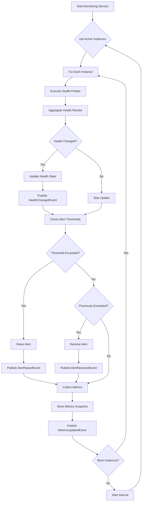

# LDS-01: Agent Monitor

## 1. Metadata & Categorization

| Field | Value |
| :--- | :--- |
| **Feature ID** | `LCM-MON-01` |
| **Feature Name** | Agent Monitor |
| **Target Version** | `v0.12.2b` |
| **Module Scope** | `Lexichord.Modules.Agents` |
| **Swimlane** | Ensemble |
| **License Tier** | WriterPro |
| **Feature Gate Key** | `FeatureFlags.Agents.Lifecycle.Monitor` |
| **Author** | Agent Architecture Lead |
| **Reviewer** | Lead Architect |
| **Status** | Draft |
| **Last Updated** | 2026-02-03 |
| **Parent Spec** | [LCS-SBD-v0.12.2-AGT](./LCS-SBD-v0.12.2-AGT.md) |
| **Depends On** | [v0.12.2a (Spawner)](./LCS-SBD-v0.12.2a-SPW.md), [v0.12.2c (Health Checks)](./LCS-SBD-v0.12.2c-HLT.md) |
| **Estimated Hours** | 10 |

---

## 2. Executive Summary

### 2.1 The Requirement

Running agents need continuous observation to detect failures, track resource usage, and collect performance metrics. Without monitoring, operators cannot identify degraded agents, resource leaks go undetected, and there is no data for capacity planning or debugging issues. The system needs centralized visibility into agent health and behavior.

### 2.2 The Proposed Solution

Implement the `IAgentMonitor` interface providing:
- Continuous health aggregation from pluggable health probes
- Real-time performance metrics collection (memory, CPU, operations)
- Health alert generation when thresholds are exceeded
- Integration with restart policies for automatic recovery
- Metrics exposure for dashboards and external monitoring systems

---

## 3. Architecture & Modular Strategy

### 3.1 Dependencies

**Upstream Modules:**
- `Lexichord.Modules.Agents.Abstractions` — `AgentInstance`, `AgentState`, `AgentMetrics` (v0.12.2a)
- `Lexichord.Modules.Agents` — `IHealthCheckProbe`, `HealthCheckResult` (v0.12.2c)
- `Lexichord.Modules.Security` — `IAuditLogService` (v0.11.2)
- `Lexichord.Host` — `IMediator`

**NuGet Packages:**
- `System.Diagnostics.DiagnosticSource` (metrics)
- `System.Threading.Channels` (event streaming)
- `Microsoft.Extensions.Hosting.Abstractions` (background service)

### 3.2 Licensing Behavior

- **Load Behavior:** [x] **Soft Gate** — Core tier gets basic heartbeat; WriterPro+ gets full metrics.
- **Fallback Experience:**
  - Core: Basic heartbeat health checks only
  - WriterPro: Full health checks + metrics collection
  - Teams: Custom health checks + alerting
  - Enterprise: Extended metrics retention + external export

---

## 4. Data Contract (The API)

### 4.1 Agent Monitor Interface

```csharp
namespace Lexichord.Modules.Agents;

/// <summary>
/// Monitors health and performance metrics of running agent instances.
/// Provides continuous observation and alerts for degraded agents.
/// </summary>
/// <remarks>
/// <para>
/// The monitor runs as a background service, polling health checks at
/// configured intervals and collecting metrics from active instances.
/// </para>
/// <para>
/// Health state is determined by aggregating results from all configured
/// health probes. A single failing probe triggers Degraded state; multiple
/// consecutive failures trigger Unhealthy state.
/// </para>
/// </remarks>
public interface IAgentMonitor
{
    /// <summary>
    /// Manually triggers a health check for an agent instance.
    /// </summary>
    /// <param name="agentInstanceId">The instance to check.</param>
    /// <param name="ct">Cancellation token.</param>
    /// <returns>Current health status after the check.</returns>
    /// <exception cref="AgentNotFoundException">Instance not found.</exception>
    /// <remarks>
    /// This bypasses the normal polling interval and performs an immediate check.
    /// Useful for on-demand verification after configuration changes.
    /// </remarks>
    Task<AgentHealthStatus> CheckHealthAsync(
        Guid agentInstanceId,
        CancellationToken ct = default);

    /// <summary>
    /// Gets the current metrics snapshot for an agent instance.
    /// </summary>
    /// <param name="agentInstanceId">The instance to query.</param>
    /// <param name="ct">Cancellation token.</param>
    /// <returns>Current metrics, or null if not available.</returns>
    /// <remarks>
    /// Metrics are collected periodically (default: every 5 seconds).
    /// This returns the most recent snapshot.
    /// </remarks>
    Task<AgentMetrics?> GetMetricsAsync(
        Guid agentInstanceId,
        CancellationToken ct = default);

    /// <summary>
    /// Gets historical metrics for an agent instance.
    /// </summary>
    /// <param name="agentInstanceId">The instance to query.</param>
    /// <param name="since">Start of the time range.</param>
    /// <param name="until">End of the time range (default: now).</param>
    /// <param name="ct">Cancellation token.</param>
    /// <returns>List of metrics snapshots in chronological order.</returns>
    /// <remarks>
    /// Metrics retention depends on license tier:
    /// WriterPro: 1 hour, Teams: 24 hours, Enterprise: 7 days.
    /// </remarks>
    Task<IReadOnlyList<AgentMetrics>> GetMetricsHistoryAsync(
        Guid agentInstanceId,
        DateTimeOffset since,
        DateTimeOffset? until = null,
        CancellationToken ct = default);

    /// <summary>
    /// Gets active health alerts for an agent instance.
    /// </summary>
    /// <param name="agentInstanceId">The instance to query.</param>
    /// <param name="ct">Cancellation token.</param>
    /// <returns>List of unresolved alerts.</returns>
    Task<IReadOnlyList<HealthAlert>> GetAlertsAsync(
        Guid agentInstanceId,
        CancellationToken ct = default);

    /// <summary>
    /// Gets all active alerts across all instances.
    /// </summary>
    /// <param name="filter">Optional filter criteria.</param>
    /// <param name="ct">Cancellation token.</param>
    /// <returns>List of alerts matching the filter.</returns>
    Task<IReadOnlyList<HealthAlert>> GetAllAlertsAsync(
        AlertFilter? filter = null,
        CancellationToken ct = default);

    /// <summary>
    /// Acknowledges an alert (marks it as seen).
    /// </summary>
    /// <param name="alertId">The alert to acknowledge.</param>
    /// <param name="ct">Cancellation token.</param>
    /// <remarks>
    /// Acknowledged alerts remain active but are filtered from default views.
    /// Alerts auto-resolve when the underlying condition clears.
    /// </remarks>
    Task AcknowledgeAlertAsync(
        Guid alertId,
        CancellationToken ct = default);

    /// <summary>
    /// Gets aggregate metrics across all active instances.
    /// </summary>
    /// <param name="ct">Cancellation token.</param>
    /// <returns>Aggregated metrics summary.</returns>
    Task<AggregateMetrics> GetAggregateMetricsAsync(
        CancellationToken ct = default);

    /// <summary>
    /// Registers a custom metrics collector for an instance.
    /// </summary>
    /// <param name="agentInstanceId">The instance to monitor.</param>
    /// <param name="collector">The custom collector.</param>
    /// <param name="ct">Cancellation token.</param>
    /// <remarks>
    /// Custom collectors are invoked during the normal metrics collection cycle.
    /// Enterprise tier only.
    /// </remarks>
    Task RegisterCollectorAsync(
        Guid agentInstanceId,
        IMetricsCollector collector,
        CancellationToken ct = default);
}
```

### 4.2 Agent Metrics

```csharp
namespace Lexichord.Modules.Agents.Abstractions;

/// <summary>
/// Performance and resource metrics for an agent instance.
/// Collected periodically by <see cref="IAgentMonitor"/>.
/// </summary>
public sealed record AgentMetrics
{
    /// <summary>
    /// Instance this metrics snapshot belongs to.
    /// </summary>
    public required Guid InstanceId { get; init; }

    /// <summary>
    /// Current memory usage in megabytes.
    /// </summary>
    /// <remarks>
    /// For process-isolated agents, this is the process private bytes.
    /// For thread-isolated agents, this is an estimate based on GC allocations.
    /// </remarks>
    public int MemoryMb { get; init; }

    /// <summary>
    /// Current CPU usage percentage (0-100).
    /// </summary>
    /// <remarks>
    /// Averaged over the collection interval.
    /// For thread-isolated agents, this is an estimate.
    /// </remarks>
    public double CpuPercent { get; init; }

    /// <summary>
    /// Total operations completed since spawn.
    /// </summary>
    public long OperationsCompleted { get; init; }

    /// <summary>
    /// Total operations failed since spawn.
    /// </summary>
    public long OperationsFailed { get; init; }

    /// <summary>
    /// Average operation duration in milliseconds.
    /// </summary>
    public double AvgOperationDurationMs { get; init; }

    /// <summary>
    /// P95 operation duration in milliseconds.
    /// </summary>
    public double P95OperationDurationMs { get; init; }

    /// <summary>
    /// P99 operation duration in milliseconds.
    /// </summary>
    public double P99OperationDurationMs { get; init; }

    /// <summary>
    /// Number of operations currently in progress.
    /// </summary>
    public int ActiveOperations { get; init; }

    /// <summary>
    /// Number of operations queued for execution.
    /// </summary>
    public int QueuedOperations { get; init; }

    /// <summary>
    /// Total LLM tokens consumed since spawn.
    /// </summary>
    public long TotalTokensConsumed { get; init; }

    /// <summary>
    /// Tokens consumed in the last minute.
    /// </summary>
    public int TokensLastMinute { get; init; }

    /// <summary>
    /// Current uptime since spawn.
    /// </summary>
    public TimeSpan Uptime { get; init; }

    /// <summary>
    /// When this metrics snapshot was collected.
    /// </summary>
    public DateTimeOffset CollectedAt { get; init; }

    /// <summary>
    /// Additional custom metrics from collectors.
    /// </summary>
    public IReadOnlyDictionary<string, double>? CustomMetrics { get; init; }

    /// <summary>
    /// Calculates the success rate (0.0 - 1.0).
    /// </summary>
    public double SuccessRate =>
        OperationsCompleted + OperationsFailed == 0
            ? 1.0
            : (double)OperationsCompleted / (OperationsCompleted + OperationsFailed);

    /// <summary>
    /// Calculates operations per minute rate.
    /// </summary>
    public double OperationsPerMinute =>
        Uptime.TotalMinutes < 1
            ? OperationsCompleted
            : OperationsCompleted / Uptime.TotalMinutes;
}
```

### 4.3 Health Alert

```csharp
namespace Lexichord.Modules.Agents.Abstractions;

/// <summary>
/// A health alert raised when an agent exhibits problems.
/// </summary>
public sealed record HealthAlert
{
    /// <summary>
    /// Unique identifier for this alert.
    /// </summary>
    public required Guid AlertId { get; init; }

    /// <summary>
    /// The instance this alert relates to.
    /// </summary>
    public required Guid AgentInstanceId { get; init; }

    /// <summary>
    /// Severity level of the alert.
    /// </summary>
    public required HealthAlertLevel Level { get; init; }

    /// <summary>
    /// Alert type/category.
    /// </summary>
    public required HealthAlertType Type { get; init; }

    /// <summary>
    /// Human-readable alert message.
    /// </summary>
    public required string Message { get; init; }

    /// <summary>
    /// When the alert was raised.
    /// </summary>
    public required DateTimeOffset RaisedAt { get; init; }

    /// <summary>
    /// When the alert was resolved (null if still active).
    /// </summary>
    public DateTimeOffset? ResolvedAt { get; init; }

    /// <summary>
    /// When the alert was acknowledged (null if not acknowledged).
    /// </summary>
    public DateTimeOffset? AcknowledgedAt { get; init; }

    /// <summary>
    /// User who acknowledged the alert.
    /// </summary>
    public Guid? AcknowledgedBy { get; init; }

    /// <summary>
    /// Additional context data.
    /// </summary>
    public IReadOnlyDictionary<string, object>? Context { get; init; }

    /// <summary>
    /// Whether the alert is currently active (not resolved).
    /// </summary>
    public bool IsActive => ResolvedAt == null;

    /// <summary>
    /// Duration the alert has been active.
    /// </summary>
    public TimeSpan Duration => (ResolvedAt ?? DateTimeOffset.UtcNow) - RaisedAt;
}

/// <summary>
/// Severity levels for health alerts.
/// </summary>
public enum HealthAlertLevel
{
    /// <summary>
    /// Informational alert, no action required.
    /// </summary>
    Info = 0,

    /// <summary>
    /// Warning: potential issue detected, may require attention.
    /// </summary>
    Warning = 1,

    /// <summary>
    /// Error: definite problem affecting agent operation.
    /// </summary>
    Error = 2,

    /// <summary>
    /// Critical: severe problem requiring immediate attention.
    /// </summary>
    Critical = 3
}

/// <summary>
/// Types of health alerts.
/// </summary>
public enum HealthAlertType
{
    /// <summary>
    /// Health check is failing.
    /// </summary>
    HealthCheckFailing = 0,

    /// <summary>
    /// Memory usage exceeds threshold.
    /// </summary>
    HighMemoryUsage = 1,

    /// <summary>
    /// CPU usage exceeds threshold.
    /// </summary>
    HighCpuUsage = 2,

    /// <summary>
    /// Operation latency exceeds threshold.
    /// </summary>
    HighLatency = 3,

    /// <summary>
    /// Error rate exceeds threshold.
    /// </summary>
    HighErrorRate = 4,

    /// <summary>
    /// Agent is unresponsive.
    /// </summary>
    Unresponsive = 5,

    /// <summary>
    /// Token consumption rate is high.
    /// </summary>
    HighTokenUsage = 6,

    /// <summary>
    /// Agent has restarted multiple times.
    /// </summary>
    FrequentRestarts = 7,

    /// <summary>
    /// Queue depth is growing.
    /// </summary>
    QueueBacklog = 8,

    /// <summary>
    /// Custom alert from user-defined rule.
    /// </summary>
    Custom = 99
}
```

### 4.4 Alert Filter

```csharp
namespace Lexichord.Modules.Agents.Abstractions;

/// <summary>
/// Filter criteria for querying alerts.
/// </summary>
public sealed record AlertFilter
{
    /// <summary>
    /// Filter by instance ID.
    /// </summary>
    public Guid? InstanceId { get; init; }

    /// <summary>
    /// Filter by minimum severity level.
    /// </summary>
    public HealthAlertLevel? MinLevel { get; init; }

    /// <summary>
    /// Filter by alert type.
    /// </summary>
    public HealthAlertType? Type { get; init; }

    /// <summary>
    /// Include only active (unresolved) alerts.
    /// </summary>
    public bool? ActiveOnly { get; init; } = true;

    /// <summary>
    /// Include acknowledged alerts.
    /// </summary>
    public bool IncludeAcknowledged { get; init; } = false;

    /// <summary>
    /// Minimum raise time.
    /// </summary>
    public DateTimeOffset? Since { get; init; }

    /// <summary>
    /// Maximum results to return.
    /// </summary>
    public int Limit { get; init; } = 100;
}
```

### 4.5 Aggregate Metrics

```csharp
namespace Lexichord.Modules.Agents.Abstractions;

/// <summary>
/// Aggregated metrics across all active agent instances.
/// </summary>
public sealed record AggregateMetrics
{
    /// <summary>
    /// Number of active instances.
    /// </summary>
    public required int ActiveInstances { get; init; }

    /// <summary>
    /// Total memory used by all instances (MB).
    /// </summary>
    public required int TotalMemoryMb { get; init; }

    /// <summary>
    /// Average CPU usage across instances.
    /// </summary>
    public required double AvgCpuPercent { get; init; }

    /// <summary>
    /// Total operations completed across all instances.
    /// </summary>
    public required long TotalOperationsCompleted { get; init; }

    /// <summary>
    /// Total operations failed across all instances.
    /// </summary>
    public required long TotalOperationsFailed { get; init; }

    /// <summary>
    /// Average operation latency across instances.
    /// </summary>
    public required double AvgOperationDurationMs { get; init; }

    /// <summary>
    /// Total tokens consumed across all instances.
    /// </summary>
    public required long TotalTokensConsumed { get; init; }

    /// <summary>
    /// Number of active health alerts.
    /// </summary>
    public required int ActiveAlerts { get; init; }

    /// <summary>
    /// Breakdown of alerts by level.
    /// </summary>
    public required IReadOnlyDictionary<HealthAlertLevel, int> AlertsByLevel { get; init; }

    /// <summary>
    /// Instances by health state.
    /// </summary>
    public required IReadOnlyDictionary<HealthState, int> InstancesByHealth { get; init; }

    /// <summary>
    /// When these aggregates were computed.
    /// </summary>
    public required DateTimeOffset ComputedAt { get; init; }
}
```

### 4.6 Custom Metrics Collector

```csharp
namespace Lexichord.Modules.Agents.Abstractions;

/// <summary>
/// Interface for custom metrics collection.
/// Implement this to add agent-specific metrics.
/// </summary>
public interface IMetricsCollector
{
    /// <summary>
    /// Unique name for this collector.
    /// </summary>
    string Name { get; }

    /// <summary>
    /// Collects custom metrics for an agent.
    /// </summary>
    /// <param name="instanceId">The instance to collect for.</param>
    /// <param name="ct">Cancellation token.</param>
    /// <returns>Dictionary of metric name to value.</returns>
    /// <remarks>
    /// This is called during each metrics collection cycle.
    /// Keep collection fast (&lt;100ms) to avoid blocking.
    /// </remarks>
    Task<IReadOnlyDictionary<string, double>> CollectAsync(
        Guid instanceId,
        CancellationToken ct = default);
}
```

---

## 5. Implementation Logic

### 5.1 Monitoring Loop



### 5.2 Health Aggregation Logic

```csharp
/// <summary>
/// Aggregates individual health check results into overall health state.
/// </summary>
public static HealthState AggregateHealth(IReadOnlyList<HealthCheckResult> results)
{
    if (results.Count == 0)
        return HealthState.Unknown;

    var failures = results.Count(r => !r.IsHealthy);
    var total = results.Count;

    return failures switch
    {
        0 => HealthState.Healthy,
        1 when total > 1 => HealthState.Degraded,
        _ when failures < total => HealthState.Degraded,
        _ => HealthState.Unhealthy
    };
}
```

---

## 6. Data Persistence (Database)

### 6.1 FluentMigrator Migration

```csharp
[Migration(20260203_1410, "Create agent monitoring tables")]
public class CreateAgentMonitoringTables : Migration
{
    public override void Up()
    {
        Create.Table("agent_metrics_snapshots")
            .WithColumn("id").AsGuid().PrimaryKey().WithDefault(SystemMethods.NewGuid)
            .WithColumn("instance_id").AsGuid().NotNullable()
                .ForeignKey("fk_metrics_instance", "agent_instances", "id")
                .OnDelete(Rule.Cascade)
            .WithColumn("memory_mb").AsInt32().NotNullable()
            .WithColumn("cpu_percent").AsDouble().NotNullable()
            .WithColumn("operations_completed").AsInt64().NotNullable()
            .WithColumn("operations_failed").AsInt64().NotNullable()
            .WithColumn("avg_duration_ms").AsDouble().NotNullable()
            .WithColumn("p95_duration_ms").AsDouble().NotNullable()
            .WithColumn("p99_duration_ms").AsDouble().NotNullable()
            .WithColumn("active_operations").AsInt32().NotNullable()
            .WithColumn("queued_operations").AsInt32().NotNullable()
            .WithColumn("tokens_consumed").AsInt64().NotNullable()
            .WithColumn("custom_metrics_json").AsString(int.MaxValue).Nullable()
            .WithColumn("collected_at").AsDateTimeOffset().NotNullable()
                .WithDefault(SystemMethods.CurrentUTCDateTime);

        Create.Index("idx_metrics_instance_time")
            .OnTable("agent_metrics_snapshots")
            .OnColumn("instance_id").Ascending()
            .OnColumn("collected_at").Descending();

        // Retention policy: delete old snapshots
        Execute.Sql(@"
            CREATE INDEX idx_metrics_retention
            ON agent_metrics_snapshots (collected_at)
            WHERE collected_at < NOW() - INTERVAL '7 days';
        ");

        Create.Table("agent_health_alerts")
            .WithColumn("id").AsGuid().PrimaryKey().WithDefault(SystemMethods.NewGuid)
            .WithColumn("instance_id").AsGuid().NotNullable()
                .ForeignKey("fk_alerts_instance", "agent_instances", "id")
                .OnDelete(Rule.Cascade)
            .WithColumn("level").AsString(20).NotNullable()
            .WithColumn("type").AsString(50).NotNullable()
            .WithColumn("message").AsString(1000).NotNullable()
            .WithColumn("context_json").AsString(int.MaxValue).Nullable()
            .WithColumn("raised_at").AsDateTimeOffset().NotNullable()
                .WithDefault(SystemMethods.CurrentUTCDateTime)
            .WithColumn("resolved_at").AsDateTimeOffset().Nullable()
            .WithColumn("acknowledged_at").AsDateTimeOffset().Nullable()
            .WithColumn("acknowledged_by").AsGuid().Nullable();

        Create.Index("idx_alerts_instance_active")
            .OnTable("agent_health_alerts")
            .OnColumn("instance_id").Ascending()
            .OnColumn("resolved_at").Ascending();

        Create.Index("idx_alerts_level")
            .OnTable("agent_health_alerts")
            .OnColumn("level")
            .Ascending()
            .OnColumn("resolved_at")
            .Ascending();
    }

    public override void Down()
    {
        Delete.Table("agent_health_alerts");
        Delete.Table("agent_metrics_snapshots");
    }
}
```

---

## 7. Observability & Logging

### 7.1 Log Templates

| Level | Template |
|:------|:---------|
| **Debug** | `[MON] Collecting metrics for {Count} active instances` |
| **Debug** | `[MON] Instance {InstanceId} metrics: Mem={MemoryMb}MB, CPU={CpuPercent}%, Ops={OpsCount}` |
| **Info** | `[MON] Health changed for {InstanceId}: {OldHealth} → {NewHealth}` |
| **Info** | `[MON] Alert raised for {InstanceId}: [{Level}] {Type} - {Message}` |
| **Info** | `[MON] Alert resolved for {InstanceId}: {AlertId}` |
| **Warn** | `[MON] High memory usage for {InstanceId}: {MemoryMb}MB (threshold: {Threshold}MB)` |
| **Warn** | `[MON] High error rate for {InstanceId}: {ErrorRate:P1} (threshold: {Threshold:P1})` |
| **Error** | `[MON] Metrics collection failed for {InstanceId}: {Error}` |

### 7.2 Metrics

| Metric | Type | Description |
|:-------|:-----|:------------|
| `monitor.collection.duration` | Histogram | Metrics collection cycle time |
| `monitor.alerts.active` | Gauge | Currently active alerts |
| `monitor.alerts.by_level` | Gauge | Alerts by severity level |
| `monitor.alerts.raised.count` | Counter | Total alerts raised |
| `monitor.alerts.resolved.count` | Counter | Total alerts resolved |
| `monitor.health.by_state` | Gauge | Instances by health state |
| `monitor.metrics.stored` | Counter | Metrics snapshots stored |

---

## 8. Security & Safety

- **Authorization:** Metrics access requires `Agents.Lifecycle.Monitor` permission.
- **Data Privacy:** Metrics are scoped to user/workspace; cross-workspace access requires Enterprise.
- **Retention:** Old metrics automatically purged per tier limits.
- **Alert Suppression:** Duplicate alerts suppressed within cooldown period.

---

## 9. Acceptance Criteria (QA)

1. **[Functional]** `CheckHealthAsync` returns current health status within 100ms.
2. **[Functional]** `GetMetricsAsync` returns latest metrics snapshot.
3. **[Functional]** Alerts are raised when thresholds exceeded.
4. **[Functional]** Alerts auto-resolve when condition clears.
5. **[Performance]** Metrics collection for 100 instances < 1s.
6. **[Retention]** Old metrics purged per tier limits.
7. **[Events]** Health changes published via MediatR.

---

## 10. Test Scenarios

### 10.1 Unit Tests

**Scenario: `HealthAggregation_AllPassing_ReturnsHealthy`**
- **Setup:** 3 passing health check results.
- **Action:** Call `AggregateHealth()`.
- **Assertion:** Returns `HealthState.Healthy`.

**Scenario: `HealthAggregation_OneFailing_ReturnsDegraded`**
- **Setup:** 2 passing, 1 failing health check results.
- **Action:** Call `AggregateHealth()`.
- **Assertion:** Returns `HealthState.Degraded`.

**Scenario: `AlertRaised_WhenThresholdExceeded`**
- **Setup:** Instance with 90% memory usage, threshold 80%.
- **Action:** Run monitoring cycle.
- **Assertion:** `HighMemoryUsage` alert raised.

### 10.2 Integration Tests

**Scenario: `MetricsHistory_ReturnsSnapshots`**
- **Setup:** Instance running for 5 minutes, metrics every 5s.
- **Action:** `GetMetricsHistoryAsync(since: 5m ago)`.
- **Assertion:** Returns ~60 snapshots.

---

## 11. Changelog

| Date | Author | Changes |
|:-----|:-------|:--------|
| 2026-02-03 | Agent Architecture Lead | Initial specification draft |
