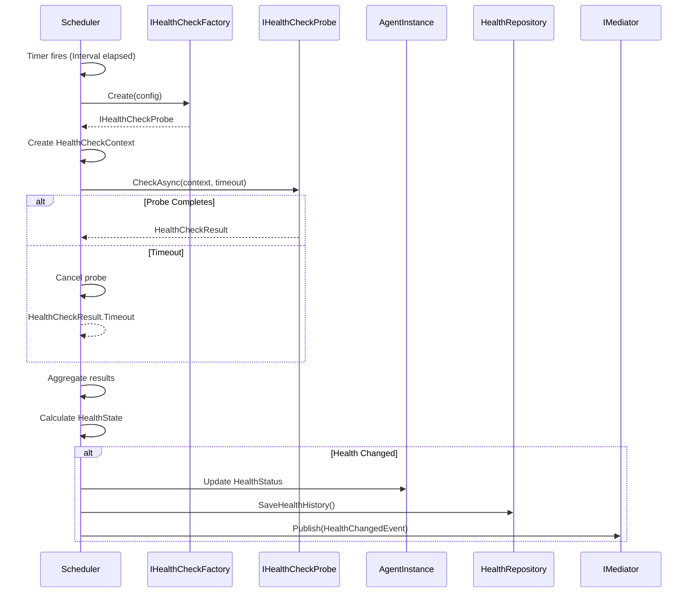
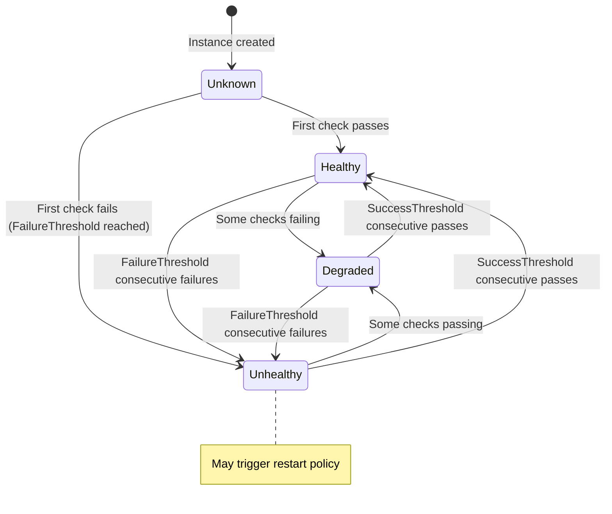

# LDS-01: Health Check System

## 1. Metadata & Categorization

| Field | Value |
| :--- | :--- |
| **Feature ID** | `LCM-HLT-01` |
| **Feature Name** | Health Check System |
| **Target Version** | `v0.12.2c` |
| **Module Scope** | `Lexichord.Modules.Agents` |
| **Swimlane** | Ensemble |
| **License Tier** | WriterPro |
| **Feature Gate Key** | `FeatureFlags.Agents.Lifecycle.HealthChecks` |
| **Author** | Agent Architecture Lead |
| **Reviewer** | Lead Architect |
| **Status** | Draft |
| **Last Updated** | 2026-02-03 |
| **Parent Spec** | [LCS-SBD-v0.12.2-AGT](./LCS-SBD-v0.12.2-AGT.md) |
| **Depends On** | [v0.12.2a (Spawner)](./LCS-SBD-v0.12.2a-SPW.md), [v0.12.1a (Agent Schema)](../v0.12.1/LCS-SBD-v0.12.1a-SCH.md) |
| **Estimated Hours** | 8 |

---

## 2. Executive Summary

### 2.1 The Requirement

Determining whether an agent is functioning correctly requires more than just checking if the process is alive. Different agents have different health indicators—some expose HTTP endpoints, others need custom validation logic. The system needs a pluggable health check framework that supports various probe types and allows agents to define their own health criteria.

### 2.2 The Proposed Solution

Implement a pluggable health check system providing:
- `IHealthCheckProbe` interface for custom health probes
- Built-in probes: Heartbeat, HTTP, TCP, Custom expression
- `IHealthCheckFactory` for creating probes from configuration
- Configurable check intervals, timeouts, and failure thresholds
- Aggregation into `AgentHealthStatus` with `HealthState` enum
- Integration with the monitoring system for automated health tracking

---

## 3. Architecture & Modular Strategy

### 3.1 Dependencies

**Upstream Modules:**
- `Lexichord.Modules.Agents.Abstractions` — `AgentInstance`, `AgentState` (v0.12.2a)
- `Lexichord.Host` — HTTP client factory, logging

**NuGet Packages:**
- `Microsoft.Extensions.Http` (HTTP health checks)
- `System.Net.Sockets` (TCP health checks)

### 3.2 Licensing Behavior

- **Load Behavior:** [x] **Soft Gate** — Core gets heartbeat only; WriterPro+ gets all probe types.
- **Fallback Experience:**
  - Core: Heartbeat probe only
  - WriterPro: Heartbeat, HTTP, TCP probes
  - Teams: All probes + custom expressions
  - Enterprise: All probes + external integrations

---

## 4. Data Contract (The API)

### 4.1 Health Check Probe Interface

```csharp
namespace Lexichord.Modules.Agents.Abstractions;

/// <summary>
/// Interface for health check probes that determine agent health.
/// Implement this to create custom health checks.
/// </summary>
public interface IHealthCheckProbe
{
    /// <summary>
    /// Unique name for this probe type.
    /// </summary>
    /// <remarks>
    /// Used in logs and configuration. Must be lowercase alphanumeric.
    /// </remarks>
    string Name { get; }

    /// <summary>
    /// Executes the health check.
    /// </summary>
    /// <param name="context">Context containing instance info and configuration.</param>
    /// <param name="ct">Cancellation token with configured timeout.</param>
    /// <returns>Result indicating health status.</returns>
    /// <remarks>
    /// <para>
    /// Implementations MUST complete within the configured timeout.
    /// If the check takes too long, the caller will cancel and treat
    /// the result as a timeout failure.
    /// </para>
    /// <para>
    /// Do NOT catch exceptions for flow control; let them propagate
    /// for proper error handling and logging.
    /// </para>
    /// </remarks>
    Task<HealthCheckResult> CheckAsync(
        HealthCheckContext context,
        CancellationToken ct = default);
}
```

### 4.2 Health Check Context

```csharp
namespace Lexichord.Modules.Agents.Abstractions;

/// <summary>
/// Context provided to health check probes during execution.
/// </summary>
public sealed record HealthCheckContext
{
    /// <summary>
    /// The agent instance being checked.
    /// </summary>
    public required Guid InstanceId { get; init; }

    /// <summary>
    /// Reference to the running agent (if accessible).
    /// </summary>
    /// <remarks>
    /// May be null for process-isolated or container-isolated agents.
    /// </remarks>
    public IAgent? Agent { get; init; }

    /// <summary>
    /// Health check configuration.
    /// </summary>
    public required HealthCheckConfig Config { get; init; }

    /// <summary>
    /// Previous health check result (null if first check).
    /// </summary>
    public HealthCheckResult? PreviousResult { get; init; }

    /// <summary>
    /// Consecutive failure count before this check.
    /// </summary>
    public int ConsecutiveFailures { get; init; }

    /// <summary>
    /// Additional data passed from spawn options.
    /// </summary>
    public IReadOnlyDictionary<string, object>? Data { get; init; }
}
```

### 4.3 Health Check Result

```csharp
namespace Lexichord.Modules.Agents.Abstractions;

/// <summary>
/// Result of a single health check probe execution.
/// </summary>
public sealed record HealthCheckResult
{
    /// <summary>
    /// Whether the check passed.
    /// </summary>
    public required bool IsHealthy { get; init; }

    /// <summary>
    /// Name of the probe that produced this result.
    /// </summary>
    public required string ProbeName { get; init; }

    /// <summary>
    /// Human-readable description of the result.
    /// </summary>
    public string? Description { get; init; }

    /// <summary>
    /// Exception if the check failed due to an error.
    /// </summary>
    public Exception? Exception { get; init; }

    /// <summary>
    /// How long the check took.
    /// </summary>
    public TimeSpan Duration { get; init; }

    /// <summary>
    /// When the check was executed.
    /// </summary>
    public DateTimeOffset CheckedAt { get; init; } = DateTimeOffset.UtcNow;

    /// <summary>
    /// Additional diagnostic data.
    /// </summary>
    public IReadOnlyDictionary<string, object>? Data { get; init; }

    /// <summary>
    /// Creates a successful health check result.
    /// </summary>
    public static HealthCheckResult Healthy(string probeName, string? description = null) =>
        new()
        {
            IsHealthy = true,
            ProbeName = probeName,
            Description = description ?? "Check passed"
        };

    /// <summary>
    /// Creates a failed health check result.
    /// </summary>
    public static HealthCheckResult Unhealthy(
        string probeName,
        string description,
        Exception? exception = null) =>
        new()
        {
            IsHealthy = false,
            ProbeName = probeName,
            Description = description,
            Exception = exception
        };

    /// <summary>
    /// Creates a timeout result.
    /// </summary>
    public static HealthCheckResult Timeout(string probeName, TimeSpan timeout) =>
        new()
        {
            IsHealthy = false,
            ProbeName = probeName,
            Description = $"Health check timed out after {timeout.TotalSeconds:F1}s",
            Duration = timeout
        };
}
```

### 4.4 Health Check Configuration

```csharp
namespace Lexichord.Modules.Agents.Abstractions;

/// <summary>
/// Configuration for health checks applied to an agent instance.
/// </summary>
public sealed record HealthCheckConfig
{
    /// <summary>
    /// Interval between health checks.
    /// </summary>
    /// <remarks>
    /// Shorter intervals = faster detection but more overhead.
    /// Default: 5 seconds. Range: 1 second - 5 minutes.
    /// </remarks>
    public TimeSpan Interval { get; init; } = TimeSpan.FromSeconds(5);

    /// <summary>
    /// Timeout for each health check.
    /// </summary>
    /// <remarks>
    /// Must be less than Interval to avoid overlapping checks.
    /// Default: 3 seconds. Range: 100ms - Interval.
    /// </remarks>
    public TimeSpan Timeout { get; init; } = TimeSpan.FromSeconds(3);

    /// <summary>
    /// Number of consecutive failures before marking unhealthy.
    /// </summary>
    /// <remarks>
    /// Prevents flapping due to transient issues.
    /// Default: 3. Range: 1-10.
    /// </remarks>
    public int FailureThreshold { get; init; } = 3;

    /// <summary>
    /// Number of consecutive successes to recover from unhealthy.
    /// </summary>
    /// <remarks>
    /// Ensures stability before marking healthy again.
    /// Default: 2. Range: 1-5.
    /// </remarks>
    public int SuccessThreshold { get; init; } = 2;

    /// <summary>
    /// Type of primary health check probe.
    /// </summary>
    public HealthCheckType Type { get; init; } = HealthCheckType.Heartbeat;

    /// <summary>
    /// HTTP endpoint for HTTP health checks.
    /// </summary>
    /// <remarks>
    /// Must be a valid HTTP(S) URL. The probe performs a GET request
    /// and expects a 2xx response.
    /// </remarks>
    public Uri? HttpEndpoint { get; init; }

    /// <summary>
    /// Expected HTTP status codes (default: 200-299).
    /// </summary>
    public IReadOnlyList<int>? ExpectedStatusCodes { get; init; }

    /// <summary>
    /// TCP host:port for TCP health checks.
    /// </summary>
    public string? TcpEndpoint { get; init; }

    /// <summary>
    /// Custom health check expression for Custom type.
    /// </summary>
    /// <remarks>
    /// <para>
    /// Expression evaluated against agent state. Must return boolean.
    /// Available variables: agent, state, metrics, uptime.
    /// </para>
    /// <example>
    /// "metrics.ErrorRate &lt; 0.1 &amp;&amp; metrics.MemoryMb &lt; 1024"
    /// </example>
    /// </remarks>
    public string? CustomExpression { get; init; }

    /// <summary>
    /// Additional probes to run (beyond the primary).
    /// </summary>
    public IReadOnlyList<HealthCheckConfig>? AdditionalProbes { get; init; }

    /// <summary>
    /// Whether to include this check in health reporting.
    /// </summary>
    /// <remarks>
    /// Set to false for optional/advisory checks that shouldn't
    /// affect overall health state.
    /// </remarks>
    public bool IncludeInAggregate { get; init; } = true;

    /// <summary>
    /// Validates the health check configuration.
    /// </summary>
    public ValidationResult Validate()
    {
        var errors = new List<string>();

        if (Interval < TimeSpan.FromSeconds(1) || Interval > TimeSpan.FromMinutes(5))
            errors.Add("Interval must be 1 second - 5 minutes");

        if (Timeout < TimeSpan.FromMilliseconds(100) || Timeout >= Interval)
            errors.Add("Timeout must be 100ms - Interval");

        if (FailureThreshold < 1 || FailureThreshold > 10)
            errors.Add("FailureThreshold must be 1-10");

        if (Type == HealthCheckType.Http && HttpEndpoint == null)
            errors.Add("HttpEndpoint required for HTTP health checks");

        if (Type == HealthCheckType.TcpConnection && string.IsNullOrWhiteSpace(TcpEndpoint))
            errors.Add("TcpEndpoint required for TCP health checks");

        if (Type == HealthCheckType.Custom && string.IsNullOrWhiteSpace(CustomExpression))
            errors.Add("CustomExpression required for custom health checks");

        return errors.Count == 0
            ? ValidationResult.Success()
            : ValidationResult.Failure(errors);
    }

    /// <summary>
    /// Default heartbeat-only configuration.
    /// </summary>
    public static HealthCheckConfig Default => new();
}

/// <summary>
/// Types of health check probes.
/// </summary>
public enum HealthCheckType
{
    /// <summary>
    /// Simple heartbeat check (is process/thread alive?).
    /// Available on all tiers. Lowest overhead.
    /// </summary>
    Heartbeat = 0,

    /// <summary>
    /// HTTP GET to health endpoint.
    /// Requires WriterPro tier. Verifies application-level health.
    /// </summary>
    Http = 1,

    /// <summary>
    /// TCP connection check to port.
    /// Requires WriterPro tier. Verifies network connectivity.
    /// </summary>
    TcpConnection = 2,

    /// <summary>
    /// Custom expression evaluation.
    /// Requires Teams tier. Maximum flexibility.
    /// </summary>
    Custom = 3
}
```

### 4.5 Health Check Factory

```csharp
namespace Lexichord.Modules.Agents;

/// <summary>
/// Factory for creating health check probes from configuration.
/// </summary>
public interface IHealthCheckFactory
{
    /// <summary>
    /// Creates a health check probe from configuration.
    /// </summary>
    /// <param name="config">The health check configuration.</param>
    /// <returns>A configured probe instance.</returns>
    /// <exception cref="ArgumentException">Invalid configuration.</exception>
    /// <exception cref="LicenseException">Probe type not available for tier.</exception>
    IHealthCheckProbe Create(HealthCheckConfig config);

    /// <summary>
    /// Gets all available probe types for the current license tier.
    /// </summary>
    IReadOnlyList<HealthCheckType> GetAvailableProbeTypes();

    /// <summary>
    /// Registers a custom probe type.
    /// </summary>
    /// <param name="name">Unique probe name.</param>
    /// <param name="probeFactory">Factory function to create the probe.</param>
    /// <remarks>
    /// Enterprise tier only. Custom probes can be referenced via
    /// HealthCheckType.Custom with the name in CustomExpression.
    /// </remarks>
    void RegisterCustomProbe(
        string name,
        Func<HealthCheckConfig, IHealthCheckProbe> probeFactory);
}
```

### 4.6 Agent Health Status

```csharp
namespace Lexichord.Modules.Agents.Abstractions;

/// <summary>
/// Aggregated health status for an agent instance.
/// </summary>
public sealed record AgentHealthStatus
{
    /// <summary>
    /// Overall health state.
    /// </summary>
    public required HealthState State { get; init; }

    /// <summary>
    /// When health was last checked.
    /// </summary>
    public required DateTimeOffset LastCheckedAt { get; init; }

    /// <summary>
    /// Number of consecutive health check failures.
    /// </summary>
    public int FailureCount { get; init; }

    /// <summary>
    /// Human-readable health summary.
    /// </summary>
    public string? Summary { get; init; }

    /// <summary>
    /// Individual probe results from the last check.
    /// </summary>
    public IReadOnlyList<HealthCheckResult>? ProbeResults { get; init; }

    /// <summary>
    /// How long the agent has been in the current health state.
    /// </summary>
    public TimeSpan StateAge => DateTimeOffset.UtcNow - LastCheckedAt;

    /// <summary>
    /// Creates a healthy status.
    /// </summary>
    public static AgentHealthStatus Healthy() => new()
    {
        State = HealthState.Healthy,
        LastCheckedAt = DateTimeOffset.UtcNow,
        Summary = "All health checks passing"
    };

    /// <summary>
    /// Creates an unknown status (not yet checked).
    /// </summary>
    public static AgentHealthStatus Unknown() => new()
    {
        State = HealthState.Unknown,
        LastCheckedAt = DateTimeOffset.UtcNow,
        Summary = "Health not yet determined"
    };
}

/// <summary>
/// Overall health states for an agent.
/// </summary>
public enum HealthState
{
    /// <summary>
    /// All health checks passing. Agent is fully operational.
    /// </summary>
    Healthy = 0,

    /// <summary>
    /// Some checks failing but agent is still usable.
    /// May indicate partial functionality or high load.
    /// </summary>
    Degraded = 1,

    /// <summary>
    /// Most/all checks failing. Agent is not operational.
    /// May trigger restart policy.
    /// </summary>
    Unhealthy = 2,

    /// <summary>
    /// Health not yet determined or check timed out.
    /// Agent is in an indeterminate state.
    /// </summary>
    Unknown = 3
}
```

### 4.7 Built-in Probe Implementations

```csharp
namespace Lexichord.Modules.Agents.HealthChecks;

/// <summary>
/// Heartbeat probe that checks if the agent thread/process is alive.
/// </summary>
public sealed class HeartbeatProbe : IHealthCheckProbe
{
    public string Name => "heartbeat";

    /// <summary>
    /// Checks if the agent is responding to a simple ping.
    /// </summary>
    public async Task<HealthCheckResult> CheckAsync(
        HealthCheckContext context,
        CancellationToken ct)
    {
        var sw = Stopwatch.StartNew();

        try
        {
            // For in-process agents, call the agent directly
            if (context.Agent is not null)
            {
                // Simple state check - if we can read state, agent is alive
                var state = context.Agent.State;

                // Verify agent is in a valid operational state
                if (state is AgentState.Terminated or AgentState.Failed)
                {
                    return HealthCheckResult.Unhealthy(
                        Name,
                        $"Agent is in terminal state: {state}");
                }

                sw.Stop();
                return new HealthCheckResult
                {
                    IsHealthy = true,
                    ProbeName = Name,
                    Description = $"Agent responding, state: {state}",
                    Duration = sw.Elapsed
                };
            }

            // For process-isolated agents, check if process is running
            // This would be implemented via IPC
            return HealthCheckResult.Unhealthy(
                Name,
                "Cannot verify agent health - no agent reference available");
        }
        catch (Exception ex) when (ex is not OperationCanceledException)
        {
            sw.Stop();
            return HealthCheckResult.Unhealthy(Name, ex.Message, ex);
        }
    }
}

/// <summary>
/// HTTP probe that checks a health endpoint.
/// </summary>
public sealed class HttpProbe : IHealthCheckProbe
{
    private readonly IHttpClientFactory _httpClientFactory;
    private readonly ILogger<HttpProbe> _logger;

    public HttpProbe(
        IHttpClientFactory httpClientFactory,
        ILogger<HttpProbe> logger)
    {
        _httpClientFactory = httpClientFactory;
        _logger = logger;
    }

    public string Name => "http";

    /// <summary>
    /// Performs an HTTP GET to the configured endpoint.
    /// </summary>
    public async Task<HealthCheckResult> CheckAsync(
        HealthCheckContext context,
        CancellationToken ct)
    {
        var sw = Stopwatch.StartNew();
        var endpoint = context.Config.HttpEndpoint;

        if (endpoint is null)
        {
            return HealthCheckResult.Unhealthy(Name, "No HTTP endpoint configured");
        }

        try
        {
            using var client = _httpClientFactory.CreateClient("HealthCheck");
            client.Timeout = context.Config.Timeout;

            _logger.LogDebug(
                "[HLT] HTTP health check for {InstanceId} to {Endpoint}",
                context.InstanceId, endpoint);

            using var response = await client.GetAsync(endpoint, ct);
            sw.Stop();

            var expectedCodes = context.Config.ExpectedStatusCodes
                ?? Enumerable.Range(200, 100).ToList();

            if (expectedCodes.Contains((int)response.StatusCode))
            {
                return new HealthCheckResult
                {
                    IsHealthy = true,
                    ProbeName = Name,
                    Description = $"HTTP {(int)response.StatusCode} {response.StatusCode}",
                    Duration = sw.Elapsed,
                    Data = new Dictionary<string, object>
                    {
                        ["statusCode"] = (int)response.StatusCode,
                        ["endpoint"] = endpoint.ToString()
                    }
                };
            }

            return HealthCheckResult.Unhealthy(
                Name,
                $"Unexpected status code: {(int)response.StatusCode} {response.StatusCode}");
        }
        catch (HttpRequestException ex)
        {
            sw.Stop();
            return HealthCheckResult.Unhealthy(Name, $"HTTP request failed: {ex.Message}", ex);
        }
        catch (TaskCanceledException) when (ct.IsCancellationRequested)
        {
            throw; // Propagate cancellation
        }
        catch (TaskCanceledException)
        {
            sw.Stop();
            return HealthCheckResult.Timeout(Name, context.Config.Timeout);
        }
    }
}

/// <summary>
/// TCP probe that checks if a port is accepting connections.
/// </summary>
public sealed class TcpProbe : IHealthCheckProbe
{
    private readonly ILogger<TcpProbe> _logger;

    public TcpProbe(ILogger<TcpProbe> logger)
    {
        _logger = logger;
    }

    public string Name => "tcp";

    /// <summary>
    /// Attempts to establish a TCP connection.
    /// </summary>
    public async Task<HealthCheckResult> CheckAsync(
        HealthCheckContext context,
        CancellationToken ct)
    {
        var sw = Stopwatch.StartNew();
        var endpoint = context.Config.TcpEndpoint;

        if (string.IsNullOrWhiteSpace(endpoint))
        {
            return HealthCheckResult.Unhealthy(Name, "No TCP endpoint configured");
        }

        // Parse host:port
        var parts = endpoint.Split(':');
        if (parts.Length != 2 || !int.TryParse(parts[1], out var port))
        {
            return HealthCheckResult.Unhealthy(Name, $"Invalid endpoint format: {endpoint}");
        }

        var host = parts[0];

        try
        {
            using var client = new TcpClient();

            _logger.LogDebug(
                "[HLT] TCP health check for {InstanceId} to {Host}:{Port}",
                context.InstanceId, host, port);

            using var cts = CancellationTokenSource.CreateLinkedTokenSource(ct);
            cts.CancelAfter(context.Config.Timeout);

            await client.ConnectAsync(host, port, cts.Token);
            sw.Stop();

            return new HealthCheckResult
            {
                IsHealthy = true,
                ProbeName = Name,
                Description = $"TCP connection established to {host}:{port}",
                Duration = sw.Elapsed,
                Data = new Dictionary<string, object>
                {
                    ["host"] = host,
                    ["port"] = port
                }
            };
        }
        catch (SocketException ex)
        {
            sw.Stop();
            return HealthCheckResult.Unhealthy(Name, $"TCP connection failed: {ex.Message}", ex);
        }
        catch (OperationCanceledException) when (ct.IsCancellationRequested)
        {
            throw;
        }
        catch (OperationCanceledException)
        {
            sw.Stop();
            return HealthCheckResult.Timeout(Name, context.Config.Timeout);
        }
    }
}
```

---

## 5. Implementation Logic

### 5.1 Health Check Execution Flow



### 5.2 Health State Transitions



---

## 6. Data Persistence (Database)

### 6.1 FluentMigrator Migration

```csharp
[Migration(20260203_1420, "Create health check history table")]
public class CreateHealthCheckHistoryTable : Migration
{
    public override void Up()
    {
        Create.Table("agent_health_checks")
            .WithColumn("id").AsGuid().PrimaryKey().WithDefault(SystemMethods.NewGuid)
            .WithColumn("instance_id").AsGuid().NotNullable()
                .ForeignKey("fk_health_instance", "agent_instances", "id")
                .OnDelete(Rule.Cascade)
            .WithColumn("probe_name").AsString(50).NotNullable()
            .WithColumn("is_healthy").AsBoolean().NotNullable()
            .WithColumn("description").AsString(500).Nullable()
            .WithColumn("duration_ms").AsInt32().NotNullable()
            .WithColumn("data_json").AsString(int.MaxValue).Nullable()
            .WithColumn("checked_at").AsDateTimeOffset().NotNullable()
                .WithDefault(SystemMethods.CurrentUTCDateTime);

        Create.Index("idx_health_checks_instance")
            .OnTable("agent_health_checks")
            .OnColumn("instance_id").Ascending()
            .OnColumn("checked_at").Descending();

        Create.Index("idx_health_checks_probe")
            .OnTable("agent_health_checks")
            .OnColumn("probe_name").Ascending()
            .OnColumn("checked_at").Descending();
    }

    public override void Down()
    {
        Delete.Table("agent_health_checks");
    }
}
```

---

## 7. Observability & Logging

### 7.1 Log Templates

| Level | Template |
|:------|:---------|
| **Debug** | `[HLT] Starting health check for {InstanceId} using {ProbeName} probe` |
| **Debug** | `[HLT] Health check completed for {InstanceId}: {IsHealthy} in {DurationMs}ms` |
| **Info** | `[HLT] Health state changed for {InstanceId}: {OldState} → {NewState}` |
| **Warn** | `[HLT] Health check failed for {InstanceId}: {Description}` |
| **Warn** | `[HLT] Health check timeout for {InstanceId} after {TimeoutMs}ms` |
| **Error** | `[HLT] Health check exception for {InstanceId}: {Error}` |

### 7.2 Metrics

| Metric | Type | Description |
|:-------|:-----|:------------|
| `health.checks.duration` | Histogram | Health check execution time |
| `health.checks.success` | Counter | Successful health checks |
| `health.checks.failure` | Counter | Failed health checks |
| `health.checks.timeout` | Counter | Timed out health checks |
| `health.state.by_instance` | Gauge | Health state per instance |
| `health.state.transitions` | Counter | Health state transitions |

---

## 8. Security & Safety

- **HTTP Endpoint Validation:** Only allow HTTP/HTTPS URLs on allowed hosts.
- **Custom Expression Sandboxing:** Execute custom expressions in restricted context.
- **Timeout Enforcement:** All probes have hard timeout to prevent hangs.
- **Rate Limiting:** Minimum interval prevents DoS via frequent checks.

---

## 9. Acceptance Criteria (QA)

1. **[Functional]** Heartbeat probe detects alive/dead agents.
2. **[Functional]** HTTP probe verifies endpoint health.
3. **[Functional]** TCP probe verifies port connectivity.
4. **[Functional]** FailureThreshold prevents flapping.
5. **[Functional]** SuccessThreshold ensures stable recovery.
6. **[Performance]** Health checks complete within configured timeout.
7. **[Security]** Custom expressions execute in sandboxed context.

---

## 10. Test Scenarios

### 10.1 Unit Tests

**Scenario: `HeartbeatProbe_AgentAlive_ReturnsHealthy`**
- **Setup:** Running agent in Ready state.
- **Action:** Execute heartbeat probe.
- **Assertion:** Returns IsHealthy = true.

**Scenario: `HttpProbe_Endpoint200_ReturnsHealthy`**
- **Setup:** Mock HTTP endpoint returning 200.
- **Action:** Execute HTTP probe.
- **Assertion:** Returns IsHealthy = true.

**Scenario: `HttpProbe_Timeout_ReturnsUnhealthy`**
- **Setup:** Mock HTTP endpoint that delays beyond timeout.
- **Action:** Execute HTTP probe.
- **Assertion:** Returns IsHealthy = false with timeout description.

**Scenario: `HealthAggregation_FailureThresholdRespected`**
- **Setup:** 2 consecutive failures, threshold = 3.
- **Action:** Check aggregated state.
- **Assertion:** State is Degraded, not Unhealthy.

### 10.2 Integration Tests

**Scenario: `HealthCheckCycle_DetectsUnhealthy`**
- **Setup:** Agent with failing HTTP endpoint.
- **Action:** Run 3 health check cycles.
- **Assertion:** State transitions: Unknown → Degraded → Unhealthy.

---

## 11. Changelog

| Date | Author | Changes |
|:-----|:-------|:--------|
| 2026-02-03 | Agent Architecture Lead | Initial specification draft |
