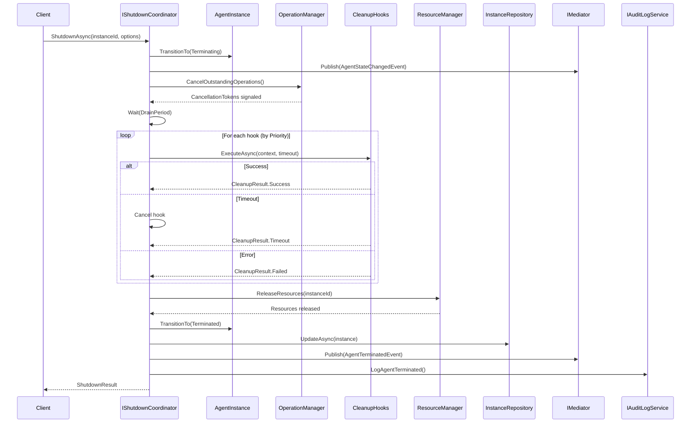
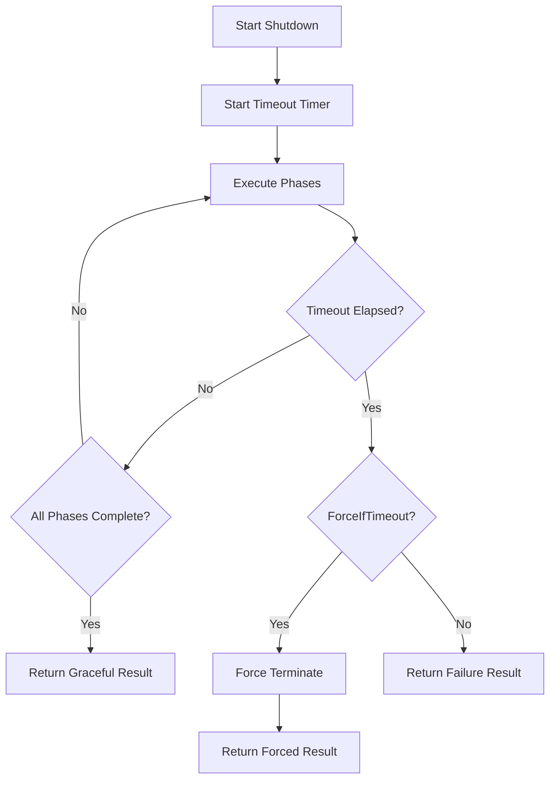

# LDS-01: Graceful Shutdown

## 1. Metadata & Categorization

| Field | Value |
| :--- | :--- |
| **Feature ID** | `LCM-SHD-01` |
| **Feature Name** | Graceful Shutdown |
| **Target Version** | `v0.12.2d` |
| **Module Scope** | `Lexichord.Modules.Agents` |
| **Swimlane** | Ensemble |
| **License Tier** | Core |
| **Feature Gate Key** | `FeatureFlags.Agents.Lifecycle.Shutdown` |
| **Author** | Agent Architecture Lead |
| **Reviewer** | Lead Architect |
| **Status** | Draft |
| **Last Updated** | 2026-02-03 |
| **Parent Spec** | [LCS-SBD-v0.12.2-AGT](./LCS-SBD-v0.12.2-AGT.md) |
| **Depends On** | [v0.12.2a (Spawner)](./LCS-SBD-v0.12.2a-SPW.md), [v0.12.2b (Monitor)](./LCS-SBD-v0.12.2b-MON.md) |
| **Estimated Hours** | 8 |

---

## 2. Executive Summary

### 2.1 The Requirement

Agents must be terminated safely without data loss, resource leaks, or corruption. Abrupt termination can leave files in inconsistent states, network connections hanging, and caches unsaved. The system needs a coordinated shutdown process that gives agents time to finish work, execute cleanup tasks, and release resources properly.

### 2.2 The Proposed Solution

Implement a graceful shutdown system providing:
- `IShutdownCoordinator` interface for orchestrating shutdown
- `ICleanupHook` interface for registering cleanup callbacks
- Configurable timeout with optional force termination
- Outstanding operation cancellation with drain period
- Resource release coordination
- Shutdown state persistence for debugging
- Full audit trail of shutdown events

---

## 3. Architecture & Modular Strategy

### 3.1 Dependencies

**Upstream Modules:**
- `Lexichord.Modules.Agents.Abstractions` — `IAgent`, `AgentInstance`, `AgentState` (v0.12.2a)
- `Lexichord.Modules.Agents` — `IAgentMonitor` (v0.12.2b)
- `Lexichord.Modules.Security` — `IAuditLogService` (v0.11.2)
- `Lexichord.Host` — `IMediator`

**NuGet Packages:**
- `MediatR` (event publishing)
- `Microsoft.Extensions.Logging.Abstractions` (logging)

### 3.2 Licensing Behavior

- **Load Behavior:** [x] **Hard Gate** — All tiers get graceful shutdown; it's essential for safety.
- **Fallback Experience:** N/A - always available.

---

## 4. Data Contract (The API)

### 4.1 Shutdown Coordinator Interface

```csharp
namespace Lexichord.Modules.Agents;

/// <summary>
/// Coordinates the graceful shutdown of agent instances.
/// Ensures cleanup hooks execute and resources are released properly.
/// </summary>
/// <remarks>
/// <para>
/// The shutdown process follows this sequence:
/// 1. Transition to Terminating state
/// 2. Cancel outstanding operations
/// 3. Wait for drain period
/// 4. Execute cleanup hooks
/// 5. Release resources
/// 6. Transition to Terminated state
/// </para>
/// <para>
/// If the graceful timeout is exceeded and force is enabled,
/// the coordinator will forcibly terminate the agent.
/// </para>
/// </remarks>
public interface IShutdownCoordinator
{
    /// <summary>
    /// Initiates graceful shutdown for an agent instance.
    /// </summary>
    /// <param name="instanceId">The instance to shut down.</param>
    /// <param name="options">Shutdown configuration.</param>
    /// <param name="ct">Cancellation token.</param>
    /// <returns>Result indicating success and whether shutdown was graceful.</returns>
    /// <exception cref="AgentNotFoundException">Instance not found.</exception>
    /// <exception cref="InvalidOperationException">Instance already terminated.</exception>
    Task<ShutdownResult> ShutdownAsync(
        Guid instanceId,
        ShutdownOptions options,
        CancellationToken ct = default);

    /// <summary>
    /// Registers a cleanup hook to be executed during shutdown.
    /// </summary>
    /// <param name="instanceId">The instance to register for.</param>
    /// <param name="hook">The cleanup hook.</param>
    /// <param name="ct">Cancellation token.</param>
    /// <remarks>
    /// Hooks are executed in registration order. Each hook has a
    /// timeout; if exceeded, the hook is cancelled and the next executes.
    /// </remarks>
    Task RegisterCleanupHookAsync(
        Guid instanceId,
        ICleanupHook hook,
        CancellationToken ct = default);

    /// <summary>
    /// Unregisters a cleanup hook.
    /// </summary>
    /// <param name="instanceId">The instance to unregister from.</param>
    /// <param name="hookName">Name of the hook to remove.</param>
    /// <param name="ct">Cancellation token.</param>
    Task UnregisterCleanupHookAsync(
        Guid instanceId,
        string hookName,
        CancellationToken ct = default);

    /// <summary>
    /// Gets the status of an ongoing shutdown.
    /// </summary>
    /// <param name="instanceId">The instance to check.</param>
    /// <param name="ct">Cancellation token.</param>
    /// <returns>Shutdown status, or null if not shutting down.</returns>
    Task<ShutdownStatus?> GetShutdownStatusAsync(
        Guid instanceId,
        CancellationToken ct = default);

    /// <summary>
    /// Forcibly terminates an agent without graceful shutdown.
    /// </summary>
    /// <param name="instanceId">The instance to terminate.</param>
    /// <param name="reason">Reason for force termination.</param>
    /// <param name="ct">Cancellation token.</param>
    /// <remarks>
    /// Use sparingly. Skips cleanup hooks and may cause resource leaks.
    /// Primarily for emergency situations or hung agents.
    /// </remarks>
    Task ForceTerminateAsync(
        Guid instanceId,
        string reason,
        CancellationToken ct = default);
}
```

### 4.2 Cleanup Hook Interface

```csharp
namespace Lexichord.Modules.Agents.Abstractions;

/// <summary>
/// Interface for cleanup callbacks executed during agent shutdown.
/// </summary>
/// <remarks>
/// Implement this to perform cleanup tasks such as:
/// - Flushing caches to disk
/// - Closing network connections
/// - Releasing external resources
/// - Saving state for recovery
/// </remarks>
public interface ICleanupHook
{
    /// <summary>
    /// Unique name for this hook (for logging and unregistration).
    /// </summary>
    string Name { get; }

    /// <summary>
    /// Priority for execution order (lower = earlier).
    /// </summary>
    /// <remarks>
    /// Default: 100. Range: 0-1000.
    /// System hooks use 0-10, user hooks should use 100+.
    /// </remarks>
    int Priority { get; }

    /// <summary>
    /// Timeout for this hook's execution.
    /// </summary>
    /// <remarks>
    /// If exceeded, the hook is cancelled and marked as timed out.
    /// Default: 5 seconds.
    /// </remarks>
    TimeSpan Timeout { get; }

    /// <summary>
    /// Executes the cleanup logic.
    /// </summary>
    /// <param name="context">Shutdown context with instance info.</param>
    /// <param name="ct">Cancellation token (respects Timeout).</param>
    /// <returns>Result indicating success or failure.</returns>
    /// <remarks>
    /// <para>
    /// Exceptions are caught and logged but don't stop subsequent hooks.
    /// Use the cancellation token to detect timeout and abort cleanly.
    /// </para>
    /// <para>
    /// Avoid blocking operations; use async throughout.
    /// </para>
    /// </remarks>
    Task<CleanupResult> ExecuteAsync(
        ShutdownContext context,
        CancellationToken ct = default);
}
```

### 4.3 Shutdown Context

```csharp
namespace Lexichord.Modules.Agents.Abstractions;

/// <summary>
/// Context provided to cleanup hooks during shutdown.
/// </summary>
public sealed record ShutdownContext
{
    /// <summary>
    /// The instance being shut down.
    /// </summary>
    public required AgentInstance Instance { get; init; }

    /// <summary>
    /// Reason for the termination.
    /// </summary>
    public required TerminationReason Reason { get; init; }

    /// <summary>
    /// User-provided reason message.
    /// </summary>
    public string? ReasonMessage { get; init; }

    /// <summary>
    /// Time remaining before force termination.
    /// </summary>
    public TimeSpan RemainingTime { get; init; }

    /// <summary>
    /// Whether this is a forced (non-graceful) shutdown.
    /// </summary>
    public bool IsForced { get; init; }

    /// <summary>
    /// Reference to the agent (if still accessible).
    /// </summary>
    public IAgent? Agent { get; init; }

    /// <summary>
    /// Logger for cleanup operations.
    /// </summary>
    public ILogger? Logger { get; init; }
}

/// <summary>
/// Reasons for agent termination via the lifecycle manager.
/// </summary>
/// <remarks>
/// <para>
/// IMPORTANT: This enum is distinct from
/// <see cref="Lexichord.Modules.Agents.Abstractions.ShutdownReason"/>
/// which is used at the IAgent.ShutdownAsync level for agent-internal shutdown.
/// </para>
/// <para>
/// TerminationReason describes WHY the lifecycle manager is terminating an agent,
/// while ShutdownReason describes the shutdown mode passed to the agent itself.
/// </para>
/// </remarks>
public enum TerminationReason
{
    /// <summary>
    /// User or API requested termination.
    /// </summary>
    UserRequested = 0,

    /// <summary>
    /// System is shutting down.
    /// </summary>
    SystemShutdown = 1,

    /// <summary>
    /// License expired or limit exceeded.
    /// </summary>
    LicenseExpired = 2,

    /// <summary>
    /// Health checks failed repeatedly.
    /// </summary>
    Unhealthy = 3,

    /// <summary>
    /// Resource limits exceeded.
    /// </summary>
    ResourceLimitExceeded = 4,

    /// <summary>
    /// Agent crashed and restart policy exhausted.
    /// </summary>
    CrashedNoRestart = 5,

    /// <summary>
    /// Idle timeout exceeded.
    /// </summary>
    IdleTimeout = 6,

    /// <summary>
    /// Replaced by newer version.
    /// </summary>
    Replaced = 7,

    /// <summary>
    /// Administrative action.
    /// </summary>
    Administrative = 8
}
```

### 4.4 Cleanup Result

```csharp
namespace Lexichord.Modules.Agents.Abstractions;

/// <summary>
/// Result of a cleanup hook execution.
/// </summary>
public sealed record CleanupResult
{
    /// <summary>
    /// Whether the cleanup succeeded.
    /// </summary>
    public required bool Success { get; init; }

    /// <summary>
    /// Name of the hook that produced this result.
    /// </summary>
    public required string HookName { get; init; }

    /// <summary>
    /// Human-readable message.
    /// </summary>
    public string? Message { get; init; }

    /// <summary>
    /// Exception if cleanup failed.
    /// </summary>
    public Exception? Exception { get; init; }

    /// <summary>
    /// How long the cleanup took.
    /// </summary>
    public TimeSpan Duration { get; init; }

    /// <summary>
    /// Whether the hook was cancelled due to timeout.
    /// </summary>
    public bool TimedOut { get; init; }

    /// <summary>
    /// Creates a successful result.
    /// </summary>
    public static CleanupResult Succeeded(string hookName, string? message = null) =>
        new()
        {
            Success = true,
            HookName = hookName,
            Message = message ?? "Cleanup completed successfully"
        };

    /// <summary>
    /// Creates a failed result.
    /// </summary>
    public static CleanupResult Failed(string hookName, string message, Exception? ex = null) =>
        new()
        {
            Success = false,
            HookName = hookName,
            Message = message,
            Exception = ex
        };

    /// <summary>
    /// Creates a timeout result.
    /// </summary>
    public static CleanupResult Timeout(string hookName, TimeSpan duration) =>
        new()
        {
            Success = false,
            HookName = hookName,
            Message = $"Cleanup timed out after {duration.TotalSeconds:F1}s",
            Duration = duration,
            TimedOut = true
        };
}
```

### 4.5 Shutdown Options and Result

```csharp
namespace Lexichord.Modules.Agents.Abstractions;

/// <summary>
/// Options for shutdown operation.
/// </summary>
public sealed record ShutdownOptions
{
    /// <summary>
    /// Reason for the termination.
    /// </summary>
    public TerminationReason Reason { get; init; } = TerminationReason.UserRequested;

    /// <summary>
    /// Human-readable reason message.
    /// </summary>
    public string? ReasonMessage { get; init; }

    /// <summary>
    /// Maximum time to wait for graceful shutdown.
    /// </summary>
    /// <remarks>
    /// Includes time for drain period and all cleanup hooks.
    /// Default: 30 seconds. Range: 1 second - 5 minutes.
    /// </remarks>
    public TimeSpan GracefulTimeout { get; init; } = TimeSpan.FromSeconds(30);

    /// <summary>
    /// Time to wait for outstanding operations to complete.
    /// </summary>
    /// <remarks>
    /// Part of GracefulTimeout, not additional.
    /// Default: 10 seconds.
    /// </remarks>
    public TimeSpan DrainPeriod { get; init; } = TimeSpan.FromSeconds(10);

    /// <summary>
    /// Whether to force terminate if graceful shutdown times out.
    /// </summary>
    public bool ForceIfTimeout { get; init; } = true;

    /// <summary>
    /// Whether to save agent state for debugging.
    /// </summary>
    public bool SaveState { get; init; } = false;

    /// <summary>
    /// Whether to wait for cleanup hooks to complete.
    /// </summary>
    public bool WaitForCleanup { get; init; } = true;

    /// <summary>
    /// Default shutdown options.
    /// </summary>
    public static ShutdownOptions Default => new();

    /// <summary>
    /// Immediate shutdown with minimal waiting.
    /// </summary>
    public static ShutdownOptions Immediate => new()
    {
        GracefulTimeout = TimeSpan.FromSeconds(5),
        DrainPeriod = TimeSpan.FromSeconds(1),
        ForceIfTimeout = true,
        WaitForCleanup = false
    };
}

/// <summary>
/// Result of a shutdown operation.
/// </summary>
public sealed record ShutdownResult
{
    /// <summary>
    /// Whether shutdown completed successfully.
    /// </summary>
    public required bool Success { get; init; }

    /// <summary>
    /// Whether the shutdown was graceful.
    /// </summary>
    public required bool WasGraceful { get; init; }

    /// <summary>
    /// Final state of the agent.
    /// </summary>
    public required AgentState FinalState { get; init; }

    /// <summary>
    /// Total shutdown duration.
    /// </summary>
    public required TimeSpan Duration { get; init; }

    /// <summary>
    /// Results from cleanup hooks.
    /// </summary>
    public IReadOnlyList<CleanupResult>? CleanupResults { get; init; }

    /// <summary>
    /// Error message if shutdown failed.
    /// </summary>
    public string? ErrorMessage { get; init; }

    /// <summary>
    /// Number of operations that were cancelled.
    /// </summary>
    public int CancelledOperations { get; init; }

    /// <summary>
    /// Path to saved state file (if SaveState was requested).
    /// </summary>
    public string? SavedStatePath { get; init; }

    /// <summary>
    /// Creates a successful graceful shutdown result.
    /// </summary>
    public static ShutdownResult Graceful(
        TimeSpan duration,
        IReadOnlyList<CleanupResult>? cleanupResults = null) =>
        new()
        {
            Success = true,
            WasGraceful = true,
            FinalState = AgentState.Terminated,
            Duration = duration,
            CleanupResults = cleanupResults
        };

    /// <summary>
    /// Creates a forced shutdown result.
    /// </summary>
    public static ShutdownResult Forced(TimeSpan duration, string reason) =>
        new()
        {
            Success = true,
            WasGraceful = false,
            FinalState = AgentState.Terminated,
            Duration = duration,
            ErrorMessage = $"Forced: {reason}"
        };
}

/// <summary>
/// Status of an ongoing shutdown.
/// </summary>
public sealed record ShutdownStatus
{
    /// <summary>
    /// Instance being shut down.
    /// </summary>
    public required Guid InstanceId { get; init; }

    /// <summary>
    /// Current phase of shutdown.
    /// </summary>
    public required ShutdownPhase Phase { get; init; }

    /// <summary>
    /// When shutdown started.
    /// </summary>
    public required DateTimeOffset StartedAt { get; init; }

    /// <summary>
    /// Time remaining before timeout.
    /// </summary>
    public required TimeSpan RemainingTime { get; init; }

    /// <summary>
    /// Cleanup hooks executed so far.
    /// </summary>
    public int HooksCompleted { get; init; }

    /// <summary>
    /// Total cleanup hooks to execute.
    /// </summary>
    public int HooksTotal { get; init; }

    /// <summary>
    /// Outstanding operations still running.
    /// </summary>
    public int OutstandingOperations { get; init; }
}

/// <summary>
/// Phases of the shutdown process.
/// </summary>
public enum ShutdownPhase
{
    /// <summary>
    /// Initiating shutdown, transitioning to Terminating state.
    /// </summary>
    Initiating = 0,

    /// <summary>
    /// Cancelling outstanding operations.
    /// </summary>
    CancellingOperations = 1,

    /// <summary>
    /// Waiting for operations to drain.
    /// </summary>
    Draining = 2,

    /// <summary>
    /// Executing cleanup hooks.
    /// </summary>
    ExecutingCleanup = 3,

    /// <summary>
    /// Releasing resources.
    /// </summary>
    ReleasingResources = 4,

    /// <summary>
    /// Finalizing and persisting state.
    /// </summary>
    Finalizing = 5,

    /// <summary>
    /// Shutdown complete.
    /// </summary>
    Complete = 6
}
```

### 4.6 Built-in Cleanup Hooks

```csharp
namespace Lexichord.Modules.Agents.Cleanup;

/// <summary>
/// Cleanup hook that flushes agent caches.
/// </summary>
public sealed class CacheFlushHook : ICleanupHook
{
    public string Name => "cache-flush";
    public int Priority => 10;
    public TimeSpan Timeout => TimeSpan.FromSeconds(5);

    public async Task<CleanupResult> ExecuteAsync(
        ShutdownContext context,
        CancellationToken ct)
    {
        var sw = Stopwatch.StartNew();

        try
        {
            context.Logger?.LogDebug(
                "[SHD] Flushing caches for {InstanceId}",
                context.Instance.InstanceId);

            // Agent-specific cache flushing would be implemented here
            // For now, just a placeholder
            await Task.Delay(100, ct);

            sw.Stop();
            return new CleanupResult
            {
                Success = true,
                HookName = Name,
                Message = "Caches flushed successfully",
                Duration = sw.Elapsed
            };
        }
        catch (OperationCanceledException) when (ct.IsCancellationRequested)
        {
            sw.Stop();
            return CleanupResult.Timeout(Name, sw.Elapsed);
        }
        catch (Exception ex)
        {
            sw.Stop();
            return CleanupResult.Failed(Name, ex.Message, ex);
        }
    }
}

/// <summary>
/// Cleanup hook that closes network connections.
/// </summary>
public sealed class ConnectionCloseHook : ICleanupHook
{
    public string Name => "connection-close";
    public int Priority => 20;
    public TimeSpan Timeout => TimeSpan.FromSeconds(3);

    public async Task<CleanupResult> ExecuteAsync(
        ShutdownContext context,
        CancellationToken ct)
    {
        var sw = Stopwatch.StartNew();

        try
        {
            context.Logger?.LogDebug(
                "[SHD] Closing connections for {InstanceId}",
                context.Instance.InstanceId);

            // Connection cleanup would be implemented here
            await Task.Delay(50, ct);

            sw.Stop();
            return new CleanupResult
            {
                Success = true,
                HookName = Name,
                Message = "Connections closed",
                Duration = sw.Elapsed
            };
        }
        catch (OperationCanceledException) when (ct.IsCancellationRequested)
        {
            sw.Stop();
            return CleanupResult.Timeout(Name, sw.Elapsed);
        }
        catch (Exception ex)
        {
            sw.Stop();
            return CleanupResult.Failed(Name, ex.Message, ex);
        }
    }
}

/// <summary>
/// Cleanup hook that saves agent state for debugging.
/// </summary>
public sealed class StateSaveHook : ICleanupHook
{
    private readonly IAgentStateSerializer _serializer;

    public StateSaveHook(IAgentStateSerializer serializer)
    {
        _serializer = serializer;
    }

    public string Name => "state-save";
    public int Priority => 50;
    public TimeSpan Timeout => TimeSpan.FromSeconds(10);

    public async Task<CleanupResult> ExecuteAsync(
        ShutdownContext context,
        CancellationToken ct)
    {
        var sw = Stopwatch.StartNew();

        try
        {
            context.Logger?.LogDebug(
                "[SHD] Saving state for {InstanceId}",
                context.Instance.InstanceId);

            var path = await _serializer.SaveStateAsync(
                context.Instance.InstanceId,
                context.Agent,
                ct);

            sw.Stop();
            return new CleanupResult
            {
                Success = true,
                HookName = Name,
                Message = $"State saved to {path}",
                Duration = sw.Elapsed
            };
        }
        catch (OperationCanceledException) when (ct.IsCancellationRequested)
        {
            sw.Stop();
            return CleanupResult.Timeout(Name, sw.Elapsed);
        }
        catch (Exception ex)
        {
            sw.Stop();
            return CleanupResult.Failed(Name, ex.Message, ex);
        }
    }
}
```

---

## 5. Implementation Logic

### 5.1 Shutdown Flow



### 5.2 Timeout Handling



---

## 6. Observability & Logging

### 6.1 Log Templates

| Level | Template |
|:------|:---------|
| **Debug** | `[SHD] Starting shutdown for {InstanceId}, reason: {Reason}` |
| **Debug** | `[SHD] Phase transition: {OldPhase} → {NewPhase}` |
| **Debug** | `[SHD] Executing cleanup hook: {HookName} (priority: {Priority})` |
| **Info** | `[SHD] Agent {InstanceId} terminated gracefully in {Duration}ms` |
| **Info** | `[SHD] Agent {InstanceId} force terminated: {Reason}` |
| **Warn** | `[SHD] Cleanup hook {HookName} timed out after {Timeout}ms` |
| **Warn** | `[SHD] Graceful shutdown timeout for {InstanceId}, forcing termination` |
| **Error** | `[SHD] Cleanup hook {HookName} failed: {Error}` |

### 6.2 Metrics

| Metric | Type | Description |
|:-------|:-----|:------------|
| `shutdown.duration` | Histogram | Total shutdown time |
| `shutdown.graceful.count` | Counter | Graceful shutdowns |
| `shutdown.forced.count` | Counter | Forced shutdowns |
| `shutdown.hooks.duration` | Histogram | Individual hook execution time |
| `shutdown.hooks.success` | Counter | Successful hook executions |
| `shutdown.hooks.failure` | Counter | Failed hook executions |
| `shutdown.hooks.timeout` | Counter | Timed out hooks |

---

## 7. Security & Safety

- **Authorization:** Shutdown requires `Agents.Lifecycle.Terminate` permission.
- **Audit Trail:** All shutdowns logged with reason and outcome.
- **Timeout Enforcement:** Prevents indefinite shutdown hangs.
- **Resource Cleanup:** Ensures no resource leaks even on force terminate.

---

## 8. Acceptance Criteria (QA)

1. **[Functional]** Graceful shutdown completes within timeout.
2. **[Functional]** Cleanup hooks execute in priority order.
3. **[Functional]** Outstanding operations are cancelled.
4. **[Functional]** Force terminate works when graceful times out.
5. **[Functional]** Resources are released after shutdown.
6. **[Performance]** Shutdown completes within configured timeout.
7. **[Audit]** All shutdowns appear in audit log.

---

## 9. Test Scenarios

### 9.1 Unit Tests

**Scenario: `GracefulShutdown_ExecutesHooks`**
- **Setup:** Agent with 3 cleanup hooks.
- **Action:** Call `ShutdownAsync()`.
- **Assertion:** All hooks executed in priority order.

**Scenario: `ShutdownTimeout_ForcesTermination`**
- **Setup:** Agent with hanging cleanup hook.
- **Action:** Call `ShutdownAsync()` with short timeout.
- **Assertion:** Returns `WasGraceful = false`.

**Scenario: `OutstandingOperations_Cancelled`**
- **Setup:** Agent with 5 pending operations.
- **Action:** Call `ShutdownAsync()`.
- **Assertion:** All operations receive cancellation.

### 9.2 Integration Tests

**Scenario: `FullShutdown_CompletesSuccessfully`**
- **Setup:** Running agent with cached data.
- **Action:** Shutdown with SaveState = true.
- **Assertion:** State file created, agent terminated.

---

## 10. Changelog

| Date | Author | Changes |
|:-----|:-------|:--------|
| 2026-02-03 | Agent Architecture Lead | Initial specification draft |
