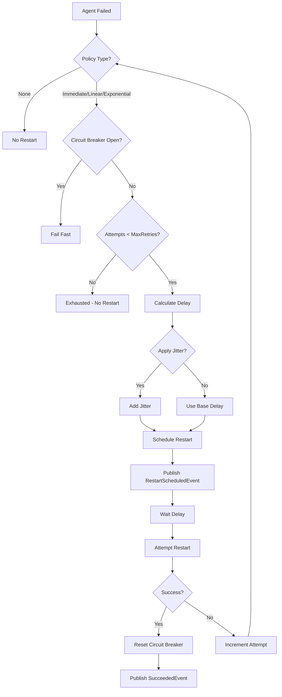
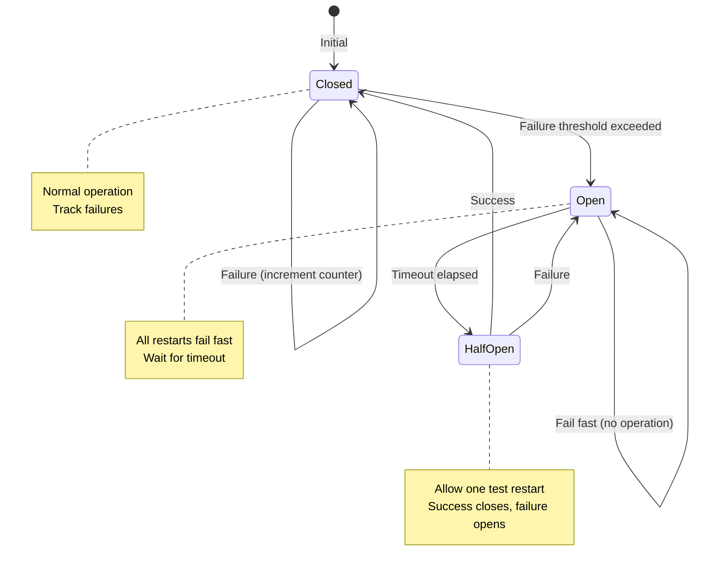

# LDS-01: Agent Restart Policies

## 1. Metadata & Categorization

| Field | Value |
| :--- | :--- |
| **Feature ID** | `LCM-RST-01` |
| **Feature Name** | Agent Restart Policies |
| **Target Version** | `v0.12.2e` |
| **Module Scope** | `Lexichord.Modules.Agents` |
| **Swimlane** | Ensemble |
| **License Tier** | Teams |
| **Feature Gate Key** | `FeatureFlags.Agents.Lifecycle.RestartPolicies` |
| **Author** | Agent Architecture Lead |
| **Reviewer** | Lead Architect |
| **Status** | Draft |
| **Last Updated** | 2026-02-03 |
| **Parent Spec** | [LCS-SBD-v0.12.2-AGT](./LCS-SBD-v0.12.2-AGT.md) |
| **Depends On** | [v0.12.2a (Spawner)](./LCS-SBD-v0.12.2a-SPW.md), [v0.12.2b (Monitor)](./LCS-SBD-v0.12.2b-MON.md) |
| **Estimated Hours** | 8 |

---

## 2. Executive Summary

### 2.1 The Requirement

Agents may fail due to transient issues (network glitches, temporary resource exhaustion) that resolve themselves. Requiring manual intervention for every failure is inefficient and reduces system reliability. The system needs automatic restart capabilities with intelligent backoff to prevent restart storms while enabling recovery from transient failures.

### 2.2 The Proposed Solution

Implement a restart policy system providing:
- `IRestartPolicyEvaluator` interface for restart decisions
- Multiple policy types: None, Immediate, Linear, Exponential
- Configurable retry limits and delays
- Jitter support to prevent thundering herd
- Circuit breaker pattern for persistent failures
- Integration with health monitoring for intelligent restart triggers

---

## 3. Architecture & Modular Strategy

### 3.1 Dependencies

**Upstream Modules:**
- `Lexichord.Modules.Agents.Abstractions` — `AgentInstance`, `RestartPolicy` (v0.12.2a)
- `Lexichord.Modules.Agents` — `IAgentMonitor`, `AgentHealthStatus` (v0.12.2b)
- `Lexichord.Host` — `IMediator`

**NuGet Packages:**
- `MediatR` (event publishing)
- `Microsoft.Extensions.Logging.Abstractions` (logging)

### 3.2 Licensing Behavior

- **Load Behavior:** [x] **Soft Gate** — Core gets None only; higher tiers get more policies.
- **Fallback Experience:**
  - Core: RestartPolicyType.None only
  - WriterPro: None, Immediate, Linear
  - Teams: All policies including Exponential
  - Enterprise: All policies + custom evaluators

---

## 4. Data Contract (The API)

### 4.1 Restart Policy Evaluator Interface

```csharp
namespace Lexichord.Modules.Agents;

/// <summary>
/// Evaluates restart policies to determine if and when an agent should restart.
/// </summary>
/// <remarks>
/// <para>
/// The evaluator considers:
/// - Configured restart policy
/// - Current attempt count vs max retries
/// - Circuit breaker state
/// - Health status history
/// </para>
/// <para>
/// Decisions are published as events for monitoring and auditing.
/// </para>
/// </remarks>
public interface IRestartPolicyEvaluator
{
    /// <summary>
    /// Evaluates whether an agent should be restarted.
    /// </summary>
    /// <param name="context">Context with failure and policy information.</param>
    /// <param name="ct">Cancellation token.</param>
    /// <returns>Decision indicating whether and when to restart.</returns>
    Task<RestartDecision> EvaluateAsync(
        RestartContext context,
        CancellationToken ct = default);

    /// <summary>
    /// Calculates the delay before a restart attempt.
    /// </summary>
    /// <param name="policy">The restart policy.</param>
    /// <param name="attemptNumber">Current attempt (1-based).</param>
    /// <returns>Delay before restart.</returns>
    TimeSpan CalculateDelay(RestartPolicy policy, int attemptNumber);

    /// <summary>
    /// Gets the current circuit breaker state for an instance.
    /// </summary>
    /// <param name="instanceId">The instance to check.</param>
    /// <param name="ct">Cancellation token.</param>
    /// <returns>Current circuit breaker state.</returns>
    Task<CircuitBreakerInfo> GetCircuitBreakerStateAsync(
        Guid instanceId,
        CancellationToken ct = default);

    /// <summary>
    /// Resets the circuit breaker for an instance.
    /// </summary>
    /// <param name="instanceId">The instance to reset.</param>
    /// <param name="ct">Cancellation token.</param>
    /// <remarks>
    /// Typically called when an instance recovers successfully.
    /// </remarks>
    Task ResetCircuitBreakerAsync(
        Guid instanceId,
        CancellationToken ct = default);

    /// <summary>
    /// Records a successful operation (for circuit breaker half-open state).
    /// </summary>
    /// <param name="instanceId">The instance that succeeded.</param>
    /// <param name="ct">Cancellation token.</param>
    Task RecordSuccessAsync(
        Guid instanceId,
        CancellationToken ct = default);
}
```

### 4.2 Restart Context

```csharp
namespace Lexichord.Modules.Agents.Abstractions;

/// <summary>
/// Context for restart policy evaluation.
/// </summary>
public sealed record RestartContext
{
    /// <summary>
    /// The instance that failed.
    /// </summary>
    public required AgentInstance Instance { get; init; }

    /// <summary>
    /// The configured restart policy.
    /// </summary>
    public required RestartPolicy Policy { get; init; }

    /// <summary>
    /// Current restart attempt (0 if first failure).
    /// </summary>
    public int CurrentAttempt { get; init; }

    /// <summary>
    /// When the first failure in this sequence occurred.
    /// </summary>
    public DateTimeOffset FirstFailureAt { get; init; }

    /// <summary>
    /// When the most recent failure occurred.
    /// </summary>
    public DateTimeOffset LastFailureAt { get; init; }

    /// <summary>
    /// Reason for the failure.
    /// </summary>
    public required FailureReason Reason { get; init; }

    /// <summary>
    /// Exception that caused the failure (if any).
    /// </summary>
    public Exception? Exception { get; init; }

    /// <summary>
    /// Current health status.
    /// </summary>
    public AgentHealthStatus? HealthStatus { get; init; }

    /// <summary>
    /// Whether the circuit breaker is currently open.
    /// </summary>
    public bool CircuitBreakerOpen { get; init; }
}

/// <summary>
/// Reasons for agent failure.
/// </summary>
public enum FailureReason
{
    /// <summary>
    /// Unhandled exception in agent code.
    /// </summary>
    UnhandledException = 0,

    /// <summary>
    /// Health checks failed repeatedly.
    /// </summary>
    HealthCheckFailed = 1,

    /// <summary>
    /// Initialization failed.
    /// </summary>
    InitializationFailed = 2,

    /// <summary>
    /// Operation timed out.
    /// </summary>
    Timeout = 3,

    /// <summary>
    /// Resource limit exceeded (memory, CPU).
    /// </summary>
    ResourceExhaustion = 4,

    /// <summary>
    /// External dependency unavailable.
    /// </summary>
    DependencyFailure = 5,

    /// <summary>
    /// Process crashed or was killed.
    /// </summary>
    ProcessCrash = 6,

    /// <summary>
    /// Unknown failure reason.
    /// </summary>
    Unknown = 99
}
```

### 4.3 Restart Decision

```csharp
namespace Lexichord.Modules.Agents.Abstractions;

/// <summary>
/// Decision from restart policy evaluation.
/// </summary>
public sealed record RestartDecision
{
    /// <summary>
    /// Whether to attempt a restart.
    /// </summary>
    public required bool ShouldRestart { get; init; }

    /// <summary>
    /// Delay before restart attempt.
    /// </summary>
    public TimeSpan Delay { get; init; }

    /// <summary>
    /// Reason for the decision.
    /// </summary>
    public required string Reason { get; init; }

    /// <summary>
    /// Attempt number this will be (if restarting).
    /// </summary>
    public int AttemptNumber { get; init; }

    /// <summary>
    /// Whether this is the final attempt.
    /// </summary>
    public bool IsFinalAttempt { get; init; }

    /// <summary>
    /// Whether circuit breaker is now open.
    /// </summary>
    public bool CircuitBreakerTripped { get; init; }

    /// <summary>
    /// When restart should occur (Now + Delay).
    /// </summary>
    public DateTimeOffset RestartAt => DateTimeOffset.UtcNow + Delay;

    /// <summary>
    /// Creates a decision to restart.
    /// </summary>
    public static RestartDecision Restart(
        TimeSpan delay,
        int attemptNumber,
        bool isFinalAttempt = false) =>
        new()
        {
            ShouldRestart = true,
            Delay = delay,
            Reason = $"Restart attempt {attemptNumber}",
            AttemptNumber = attemptNumber,
            IsFinalAttempt = isFinalAttempt
        };

    /// <summary>
    /// Creates a decision to not restart.
    /// </summary>
    public static RestartDecision NoRestart(string reason) =>
        new()
        {
            ShouldRestart = false,
            Reason = reason
        };

    /// <summary>
    /// Creates a decision indicating circuit breaker is open.
    /// </summary>
    public static RestartDecision CircuitOpen(TimeSpan reopenDelay) =>
        new()
        {
            ShouldRestart = false,
            Reason = "Circuit breaker open",
            CircuitBreakerTripped = true,
            Delay = reopenDelay
        };
}
```

### 4.4 Circuit Breaker

```csharp
namespace Lexichord.Modules.Agents.Abstractions;

/// <summary>
/// Circuit breaker state information.
/// </summary>
public sealed record CircuitBreakerInfo
{
    /// <summary>
    /// Current state of the circuit breaker.
    /// </summary>
    public required CircuitBreakerState State { get; init; }

    /// <summary>
    /// Number of failures since last success.
    /// </summary>
    public int FailureCount { get; init; }

    /// <summary>
    /// When the circuit breaker opened (if Open).
    /// </summary>
    public DateTimeOffset? OpenedAt { get; init; }

    /// <summary>
    /// When the circuit breaker will transition to HalfOpen.
    /// </summary>
    public DateTimeOffset? ResetAt { get; init; }

    /// <summary>
    /// Last successful operation (if any).
    /// </summary>
    public DateTimeOffset? LastSuccessAt { get; init; }

    /// <summary>
    /// Last failure time.
    /// </summary>
    public DateTimeOffset? LastFailureAt { get; init; }

    /// <summary>
    /// Creates a closed circuit breaker.
    /// </summary>
    public static CircuitBreakerInfo Closed() =>
        new() { State = CircuitBreakerState.Closed };
}

/// <summary>
/// States of the circuit breaker.
/// </summary>
public enum CircuitBreakerState
{
    /// <summary>
    /// Circuit is closed, operations allowed, failures tracked.
    /// </summary>
    Closed = 0,

    /// <summary>
    /// Circuit is open, operations fail fast, waiting for reset.
    /// </summary>
    Open = 1,

    /// <summary>
    /// Circuit is testing, limited operations allowed.
    /// </summary>
    HalfOpen = 2
}
```

### 4.5 Backoff Calculator

```csharp
namespace Lexichord.Modules.Agents;

/// <summary>
/// Utility class for calculating backoff delays.
/// </summary>
public static class BackoffCalculator
{
    private static readonly Random Jitter = new();

    /// <summary>
    /// Calculates the delay for a restart attempt.
    /// </summary>
    /// <param name="policy">The restart policy.</param>
    /// <param name="attemptNumber">Current attempt (1-based).</param>
    /// <returns>Calculated delay.</returns>
    public static TimeSpan CalculateDelay(RestartPolicy policy, int attemptNumber)
    {
        if (attemptNumber < 1)
            throw new ArgumentOutOfRangeException(nameof(attemptNumber));

        var baseDelay = policy.Type switch
        {
            RestartPolicyType.None => TimeSpan.Zero,
            RestartPolicyType.Immediate => TimeSpan.Zero,
            RestartPolicyType.Linear => CalculateLinear(policy, attemptNumber),
            RestartPolicyType.Exponential => CalculateExponential(policy, attemptNumber),
            _ => throw new ArgumentOutOfRangeException(nameof(policy.Type))
        };

        // Apply max delay cap
        if (baseDelay > policy.MaxDelay)
            baseDelay = policy.MaxDelay;

        // Apply jitter if enabled
        if (policy.UseJitter && baseDelay > TimeSpan.Zero)
            baseDelay = ApplyJitter(baseDelay);

        return baseDelay;
    }

    /// <summary>
    /// Calculates linear backoff: delay = initialDelay * attemptNumber.
    /// </summary>
    private static TimeSpan CalculateLinear(RestartPolicy policy, int attemptNumber)
    {
        return TimeSpan.FromTicks(policy.InitialDelay.Ticks * attemptNumber);
    }

    /// <summary>
    /// Calculates exponential backoff: delay = initialDelay * (multiplier ^ (attemptNumber - 1)).
    /// </summary>
    private static TimeSpan CalculateExponential(RestartPolicy policy, int attemptNumber)
    {
        var multiplier = Math.Pow(policy.BackoffMultiplier, attemptNumber - 1);
        var delayTicks = (long)(policy.InitialDelay.Ticks * multiplier);

        // Prevent overflow
        if (delayTicks < 0 || delayTicks > policy.MaxDelay.Ticks)
            return policy.MaxDelay;

        return TimeSpan.FromTicks(delayTicks);
    }

    /// <summary>
    /// Applies ±25% random jitter to prevent thundering herd.
    /// </summary>
    private static TimeSpan ApplyJitter(TimeSpan delay)
    {
        // Generate factor between 0.75 and 1.25
        var factor = 0.75 + (Jitter.NextDouble() * 0.5);
        return TimeSpan.FromTicks((long)(delay.Ticks * factor));
    }

    /// <summary>
    /// Calculates the total time for all retry attempts.
    /// </summary>
    /// <param name="policy">The restart policy.</param>
    /// <returns>Total time for all retries (without jitter).</returns>
    public static TimeSpan CalculateTotalRetryTime(RestartPolicy policy)
    {
        if (policy.Type == RestartPolicyType.None || policy.MaxRetries == 0)
            return TimeSpan.Zero;

        var total = TimeSpan.Zero;
        for (var i = 1; i <= policy.MaxRetries; i++)
        {
            total += CalculateDelay(policy with { UseJitter = false }, i);
        }
        return total;
    }
}
```

### 4.6 Restart Events

```csharp
namespace Lexichord.Modules.Agents.Events;

/// <summary>
/// Published when a restart is scheduled.
/// </summary>
public sealed record AgentRestartScheduledEvent : INotification
{
    public required Guid InstanceId { get; init; }
    public required int AttemptNumber { get; init; }
    public required int MaxAttempts { get; init; }
    public required TimeSpan Delay { get; init; }
    public required DateTimeOffset ScheduledAt { get; init; }
    public required FailureReason FailureReason { get; init; }
}

/// <summary>
/// Published when a restart attempt begins.
/// </summary>
public sealed record AgentRestartStartedEvent : INotification
{
    public required Guid InstanceId { get; init; }
    public required int AttemptNumber { get; init; }
    public required DateTimeOffset StartedAt { get; init; }
}

/// <summary>
/// Published when a restart attempt succeeds.
/// </summary>
public sealed record AgentRestartSucceededEvent : INotification
{
    public required Guid InstanceId { get; init; }
    public required int AttemptNumber { get; init; }
    public required TimeSpan Duration { get; init; }
    public required DateTimeOffset CompletedAt { get; init; }
}

/// <summary>
/// Published when a restart attempt fails.
/// </summary>
public sealed record AgentRestartFailedEvent : INotification
{
    public required Guid InstanceId { get; init; }
    public required int AttemptNumber { get; init; }
    public required string FailureReason { get; init; }
    public required bool WillRetry { get; init; }
    public TimeSpan? NextRetryDelay { get; init; }
}

/// <summary>
/// Published when restart attempts are exhausted.
/// </summary>
public sealed record AgentRestartExhaustedEvent : INotification
{
    public required Guid InstanceId { get; init; }
    public required int TotalAttempts { get; init; }
    public required TimeSpan TotalDuration { get; init; }
    public required DateTimeOffset AbandonedAt { get; init; }
}

/// <summary>
/// Published when circuit breaker state changes.
/// </summary>
public sealed record CircuitBreakerStateChangedEvent : INotification
{
    public required Guid InstanceId { get; init; }
    public required CircuitBreakerState OldState { get; init; }
    public required CircuitBreakerState NewState { get; init; }
    public required DateTimeOffset ChangedAt { get; init; }
    public TimeSpan? ResetDelay { get; init; }
}
```

---

## 5. Implementation Logic

### 5.1 Restart Decision Flow



### 5.2 Circuit Breaker Flow



---

## 6. Observability & Logging

### 6.1 Log Templates

| Level | Template |
|:------|:---------|
| **Debug** | `[RST] Evaluating restart for {InstanceId}, attempt {Attempt}/{Max}` |
| **Debug** | `[RST] Calculated delay: {Delay}ms (policy: {PolicyType}, jitter: {JitterEnabled})` |
| **Info** | `[RST] Restart scheduled for {InstanceId} at {ScheduledTime} (attempt {Attempt})` |
| **Info** | `[RST] Restart succeeded for {InstanceId} on attempt {Attempt}` |
| **Warn** | `[RST] Restart failed for {InstanceId}: {Reason}` |
| **Warn** | `[RST] Circuit breaker opened for {InstanceId}, reset in {ResetDelay}` |
| **Error** | `[RST] Restart attempts exhausted for {InstanceId} after {TotalAttempts} attempts` |

### 6.2 Metrics

| Metric | Type | Description |
|:-------|:-----|:------------|
| `restart.attempts.total` | Counter | Total restart attempts |
| `restart.attempts.success` | Counter | Successful restarts |
| `restart.attempts.failure` | Counter | Failed restart attempts |
| `restart.delay.calculated` | Histogram | Calculated delay distribution |
| `restart.delay.actual` | Histogram | Actual delay (with jitter) |
| `restart.exhausted.count` | Counter | Times restart exhausted |
| `circuit_breaker.state` | Gauge | Current circuit breaker state |
| `circuit_breaker.trips` | Counter | Circuit breaker trip count |

---

## 7. Security & Safety

- **License Enforcement:** Advanced policies require appropriate tier.
- **Resource Protection:** Circuit breaker prevents restart storms.
- **Audit Trail:** All restart decisions logged.
- **Configuration Validation:** Invalid policies rejected at spawn time.

---

## 8. Acceptance Criteria (QA)

1. **[Functional]** Exponential backoff delays calculated correctly.
2. **[Functional]** Jitter applies ±25% randomization.
3. **[Functional]** MaxRetries respected, no extra attempts.
4. **[Functional]** Circuit breaker opens after continuous failures.
5. **[Functional]** Circuit breaker transitions through HalfOpen on timeout.
6. **[Licensing]** Exponential policy requires Teams tier.
7. **[Performance]** Restart evaluation <10ms.

---

## 9. Test Scenarios

### 9.1 Unit Tests

**Scenario: `ExponentialBackoff_CalculatesCorrectly`**
- **Setup:** Policy with InitialDelay=1s, Multiplier=2.0.
- **Action:** Calculate delays for attempts 1-5.
- **Assertion:** Delays are 1s, 2s, 4s, 8s, 16s.

**Scenario: `Jitter_AppliesRandomization`**
- **Setup:** Policy with UseJitter=true, base delay 10s.
- **Action:** Calculate 100 delays.
- **Assertion:** All delays between 7.5s and 12.5s.

**Scenario: `CircuitBreaker_TripsAfterThreshold`**
- **Setup:** CircuitBreakerTimeout=5min, 5 consecutive failures.
- **Action:** Evaluate restart.
- **Assertion:** Returns CircuitOpen decision.

### 9.2 Integration Tests

**Scenario: `RestartSequence_RecoversOnThirdAttempt`**
- **Setup:** Agent that fails twice then succeeds.
- **Action:** Let restart policy execute.
- **Assertion:** Agent running after 3rd attempt, circuit breaker reset.

---

## 10. Changelog

| Date | Author | Changes |
|:-----|:-------|:--------|
| 2026-02-03 | Agent Architecture Lead | Initial specification draft |
