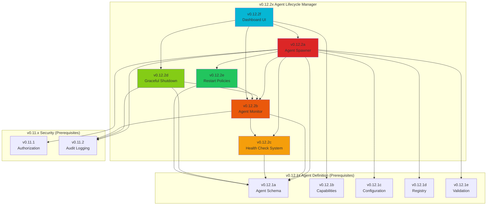

# v0.12.2x Sub-Part Index — Agent Lifecycle Manager

## Document Control

| Field            | Value                                                        |
| :--------------- | :----------------------------------------------------------- |
| **Document ID**  | LCS-SBD-v0.12.2x-INDEX                                       |
| **Version**      | v0.12.2                                                      |
| **Codename**     | Agent Lifecycle Manager Sub-Part Index                       |
| **Status**       | Draft                                                        |
| **Last Updated** | 2026-02-03                                                   |
| **Owner**        | Agent Architecture Lead                                      |
| **Parent Spec**  | [LCS-SBD-v0.12.2-AGT](./LCS-SBD-v0.12.2-AGT.md)              |

---

## 1. Overview

This document serves as the master index for all v0.12.2x sub-part specifications implementing the **Agent Lifecycle Manager** system. The Lifecycle Manager provides comprehensive runtime management for spawning, monitoring, health checking, graceful shutdown, and restart policies for agent instances.

### 1.1 Design Philosophy

The Lifecycle Manager follows these core principles:

1. **Resilience First:** Automatic restart policies with exponential backoff ensure agents recover from transient failures
2. **Observable by Default:** Health checks and metrics provide real-time visibility into agent health
3. **Resource Governance:** License-aware concurrency limits and resource constraints prevent abuse
4. **Graceful Degradation:** Clean shutdown ensures no data loss or resource leaks
5. **State Machine Integrity:** All state transitions follow the defined state machine

---

## 2. Sub-Part Registry

| Sub-Part | Document | Feature ID | Title | Est. Hours | Status |
|:---------|:---------|:-----------|:------|:-----------|:-------|
| v0.12.2a | [LCS-SBD-v0.12.2a-SPW](./LCS-SBD-v0.12.2a-SPW.md) | `LCM-SPW-01` | Agent Spawner | 10 | Draft |
| v0.12.2b | [LCS-SBD-v0.12.2b-MON](./LCS-SBD-v0.12.2b-MON.md) | `LCM-MON-01` | Agent Monitor | 10 | Draft |
| v0.12.2c | [LCS-SBD-v0.12.2c-HLT](./LCS-SBD-v0.12.2c-HLT.md) | `LCM-HLT-01` | Health Check System | 8 | Draft |
| v0.12.2d | [LCS-SBD-v0.12.2d-SHD](./LCS-SBD-v0.12.2d-SHD.md) | `LCM-SHD-01` | Graceful Shutdown | 8 | Draft |
| v0.12.2e | [LCS-SBD-v0.12.2e-RST](./LCS-SBD-v0.12.2e-RST.md) | `LCM-RST-01` | Agent Restart Policies | 8 | Draft |
| v0.12.2f | [LCS-SBD-v0.12.2f-UI](./LCS-SBD-v0.12.2f-UI.md) | `LCM-UI-01` | Lifecycle Dashboard UI | 8 | Draft |
| **Total** | | | | **52 hours** | |

---

## 3. Feature Gate Keys

| Sub-Part | Feature Gate Key | License Tier |
|:---------|:-----------------|:-------------|
| v0.12.2a | `FeatureFlags.Agents.Lifecycle.Spawn` | Core |
| v0.12.2b | `FeatureFlags.Agents.Lifecycle.Monitor` | WriterPro |
| v0.12.2c | `FeatureFlags.Agents.Lifecycle.HealthChecks` | WriterPro |
| v0.12.2d | `FeatureFlags.Agents.Lifecycle.Shutdown` | Core |
| v0.12.2e | `FeatureFlags.Agents.Lifecycle.RestartPolicies` | Teams |
| v0.12.2f | `FeatureFlags.Agents.Lifecycle.Dashboard` | WriterPro |

### Concurrent Agent Limits by Tier

| Tier | Concurrent Agents | Isolation Options | Restart Policies |
|:-----|:------------------|:------------------|:-----------------|
| **Core** | 2 | None, Thread | None only |
| **WriterPro** | 5 | None, Thread | None, Immediate, Linear |
| **Teams** | 20 | None, Thread, Process | All policies |
| **Enterprise** | Unlimited | All including Container | All + custom policies |

---

## 4. Dependency Graph



---

## 5. Implementation Order

Based on dependency analysis, sub-parts MUST be implemented in this sequence:

```
Phase 1 (Foundation):
├── v0.12.2a: Agent Spawner (core lifecycle manager interface)
│
Phase 2 (Monitoring Layer):
├── v0.12.2c: Health Check System (pluggable probes)
├── v0.12.2b: Agent Monitor (health + metrics aggregation)
│
Phase 3 (Resilience Layer):
├── v0.12.2d: Graceful Shutdown (cleanup and termination)
├── v0.12.2e: Restart Policies (backoff and circuit breaker)
│
Phase 4 (Presentation):
└── v0.12.2f: Lifecycle Dashboard UI (visualization)
```

---

## 6. Key Interfaces by Sub-Part

### v0.12.2a: Agent Spawner

| Type | Kind | Description |
|:-----|:-----|:------------|
| `IAgentLifecycleManager` | Interface | Core spawn/terminate/observe operations |
| `SpawnRequest` | Record | Agent spawn parameters |
| `AgentSpawnOptions` | Record | Isolation, limits, restart policy config |
| `ResourceLimits` | Record | Memory, CPU, thread constraints |
| `IsolationLevel` | Enum | None/Thread/Process/Container |
| `RestartPolicy` | Record | Backoff configuration |
| `RestartPolicyType` | Enum | None/Immediate/Linear/Exponential |
| `AgentInstance` | Record | Running instance state |
| `TerminationOptions` | Record | Shutdown configuration |
| `TerminationResult` | Record | Shutdown outcome |
| `GetInstancesFilter` | Record | Instance query filter |
| `ObservationOptions` | Record | Event subscription config |

### v0.12.2b: Agent Monitor

| Type | Kind | Description |
|:-----|:-----|:------------|
| `IAgentMonitor` | Interface | Health/metrics monitoring |
| `AgentMetrics` | Record | Performance metrics |
| `HealthAlert` | Record | Alert notification |
| `HealthAlertLevel` | Enum | Info/Warning/Error/Critical |

### v0.12.2c: Health Check System

| Type | Kind | Description |
|:-----|:-----|:------------|
| `IHealthCheckProbe` | Interface | Pluggable health probe |
| `IHealthCheckFactory` | Interface | Probe creation factory |
| `HealthCheckConfig` | Record | Probe configuration |
| `HealthCheckType` | Enum | Heartbeat/Http/TcpConnection/Custom |
| `HealthCheckResult` | Record | Single check outcome |
| `AgentHealthStatus` | Record | Aggregated health state |
| `HealthState` | Enum | Healthy/Degraded/Unhealthy/Unknown |

### v0.12.2d: Graceful Shutdown

| Type | Kind | Description |
|:-----|:-----|:------------|
| `IShutdownCoordinator` | Interface | Shutdown orchestration |
| `ICleanupHook` | Interface | Agent cleanup callback |
| `ShutdownContext` | Record | Shutdown execution context |
| `CleanupResult` | Record | Cleanup operation outcome |

### v0.12.2e: Restart Policies

| Type | Kind | Description |
|:-----|:-----|:------------|
| `IRestartPolicyEvaluator` | Interface | Policy decision logic |
| `RestartDecision` | Record | Restart evaluation result |
| `CircuitBreakerState` | Enum | Closed/Open/HalfOpen |
| `BackoffCalculator` | Static | Delay calculation utilities |

### v0.12.2f: Lifecycle Dashboard UI

| Type | Kind | Description |
|:-----|:-----|:------------|
| `LifecycleDashboardViewModel` | ViewModel | Main dashboard VM |
| `AgentInstanceViewModel` | ViewModel | Instance row VM |
| `AgentDetailViewModel` | ViewModel | Detail panel VM |
| `HealthChartViewModel` | ViewModel | Health visualization VM |

---

## 7. MediatR Events

| Event | Sub-Part | Description |
|:------|:---------|:------------|
| `AgentSpawnedEvent` | v0.12.2a | Agent instance created |
| `AgentStateChangedEvent` | v0.12.2a | State machine transition |
| `AgentTerminatedEvent` | v0.12.2d | Agent shutdown complete |
| `AgentHealthChangedEvent` | v0.12.2c | Health state transition |
| `AgentRestartingEvent` | v0.12.2e | Restart attempt initiated |
| `AgentErrorEvent` | v0.12.2b | Unhandled error occurred |
| `AgentMetricsUpdatedEvent` | v0.12.2b | Metrics refresh |
| `HealthAlertRaisedEvent` | v0.12.2c | Health alert triggered |
| `HealthAlertResolvedEvent` | v0.12.2c | Health alert cleared |

---

## 8. Database Schema

### Tables (via FluentMigrator)

| Table | Sub-Part | Description |
|:------|:---------|:------------|
| `agent_instances` | v0.12.2a | Running instance records |
| `agent_instance_events` | v0.12.2a | State change audit log |
| `agent_health_checks` | v0.12.2c | Health check history |
| `agent_health_alerts` | v0.12.2c | Alert records |
| `agent_metrics_snapshots` | v0.12.2b | Periodic metrics |

---

## 9. Cross-Cutting Concerns

### 9.1 Observability

All sub-parts MUST implement:
- Structured logging via Serilog with correlation IDs
- Metrics exposed via `Lexichord.Observability.Metrics`
- Distributed tracing spans for spawn/terminate operations
- Health status in `/health` endpoint

### 9.2 Security

All sub-parts MUST:
- Validate authorization via `IAuthorizationService` (v0.11.1)
- Log actions via `IAuditLogService` (v0.11.2)
- Enforce license limits at spawn time
- Sanitize all external inputs (HTTP endpoints, custom expressions)

### 9.3 Error Handling

All sub-parts MUST:
- Use `Result<T>` pattern for recoverable errors
- Throw typed exceptions for unrecoverable errors
- Include correlation IDs in all error messages
- Log errors with full context before propagating

---

## 10. Acceptance Criteria Summary

| Sub-Part | Key Acceptance Criteria |
|:---------|:------------------------|
| v0.12.2a | Spawn <2s P95, license limits enforced, state transitions audited |
| v0.12.2b | Metrics collected every 5s, alerts raised within 10s of threshold |
| v0.12.2c | Health checks <100ms P95, failure threshold before unhealthy |
| v0.12.2d | Graceful shutdown within timeout, cleanup hooks execute |
| v0.12.2e | Exponential backoff correct, circuit breaker trips at threshold |
| v0.12.2f | Dashboard loads <500ms, real-time updates via events |

---

## 11. Related Documents

| Document | Purpose |
|:---------|:--------|
| [wf-design-spec.md](../../workflows/wf-design-spec.md) | Specification authoring workflow |
| [template-design-spec.md](../../templates/template-design-spec.md) | LDS-01 template |
| [LCS-SBD-v0.12.1-AGT.md](../v0.12.1/LCS-SBD-v0.12.1-AGT.md) | Dependency: Agent Definition |
| [LCS-SBD-v0.12.1x-INDEX.md](../v0.12.1/LCS-SBD-v0.12.1x-INDEX.md) | Dependency: Sub-part index |
| [LCS-SBD-v0.11.1-SEC.md](../../v0.11.x/v0.11.1/LCS-SBD-v0.11.1-SEC.md) | Dependency: Authorization |
| [LCS-SBD-v0.12.3-AGT.md](../v0.12.3/LCS-SBD-v0.12.3-AGT.md) | Next: Agent Communication Bus |

---

## 12. Changelog

| Date | Author | Changes |
|:-----|:-------|:--------|
| 2026-02-03 | Agent Architecture Lead | Initial draft of v0.12.2x index |
