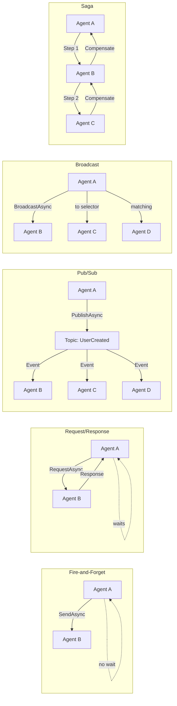
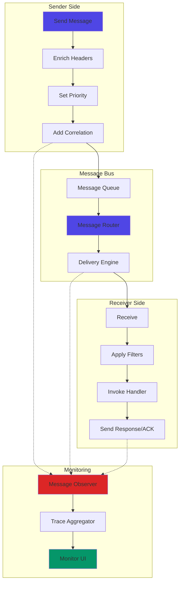
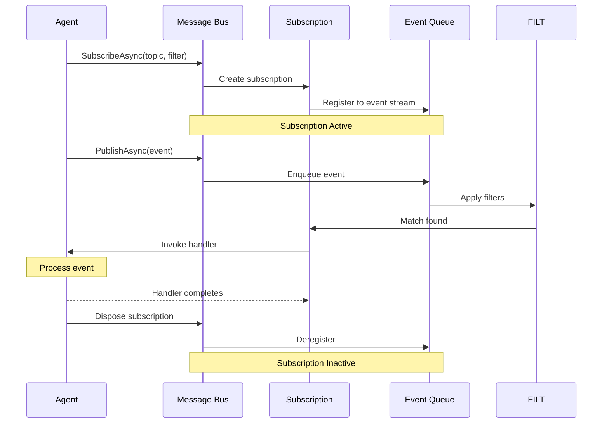
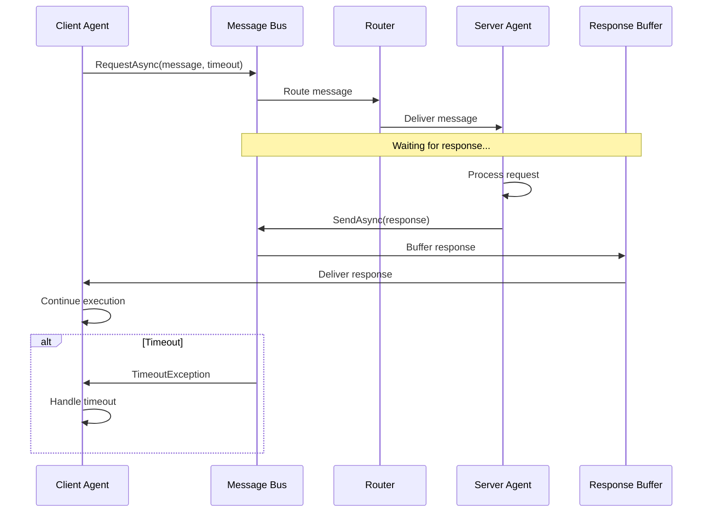

# LCS-SBD-123-AGT: Scope Overview — Agent Communication Bus

## Document Control

| Field            | Value                                                        |
| :--------------- | :----------------------------------------------------------- |
| **Document ID**  | LCS-SBD-123-AGT                                              |
| **Version**      | v0.12.3                                                      |
| **Codename**     | Agent Communication Bus (Agent Framework Phase 3)            |
| **Status**       | Draft                                                        |
| **Last Updated** | 2026-01-31                                                   |
| **Owner**        | Agent Architecture Lead                                      |
| **Depends On**   | v0.12.1-AGT (Agent Definition), v0.12.2-AGT (Lifecycle Manager), v0.11.2-SEC (Audit Logging) |

---

## 1. Executive Summary

### 1.1 The Vision

**v0.12.3-AGT** delivers **Agent Communication Bus** — a comprehensive, scalable messaging infrastructure for inter-agent communication. This provides:

- Synchronous request/response patterns with timeout and retry semantics
- Asynchronous publish/subscribe messaging with topic filtering
- Broadcast and multicast capabilities for group communication
- Intelligent message routing with multiple strategies (round-robin, least-busy, broadcast)
- Real-time communication monitoring and debugging interface
- Support for complex communication patterns (fire-and-forget, sagas)

### 1.2 Business Value

- **Scalability:** Enable distributed multi-agent systems without centralized bottlenecks.
- **Reliability:** Request/response with automatic retries and timeout handling.
- **Flexibility:** Multiple communication patterns for different use cases.
- **Observability:** Full message tracing and communication monitoring.
- **Enterprise Features:** Sagas, message routing, broadcast communication at higher tiers.
- **Non-blocking:** Fire-and-forget messaging for latency-sensitive operations.

### 1.3 Success Criteria

1. Core message bus supporting direct messaging between agents.
2. Pub/sub with event filtering and multiple subscribers per topic.
3. Request/response with configurable timeout and automatic retries.
4. Broadcast messaging to multiple agents or agent groups.
5. Flexible message routing with multiple strategy algorithms.
6. Message latency <50ms (P95) for direct messaging.
7. Support for correlation and causation tracking across message chains.
8. Real-time monitoring UI for communication debugging.
9. Message delivery guarantees (at-least-once for events, exactly-once for requests).

---

## 2. Key Deliverables

### 2.1 Sub-Parts

| Sub-Part | Title | Description | Est. Hours |
|:---------|:------|:------------|:-----------|
| v0.12.3a | Message Bus Core | Core messaging, send/request operations | 10 |
| v0.12.3b | Event System | Pub/Sub events, subscriptions, filtering | 8 |
| v0.12.3c | Request/Response | Synchronous request patterns, timeouts | 10 |
| v0.12.3d | Broadcast & Multicast | Group messaging, selector-based targeting | 8 |
| v0.12.3e | Message Routing | Route definitions, routing strategies | 8 |
| v0.12.3f | Communication Monitor UI | Debugging UI for message tracing | 6 |
| **Total** | | | **50 hours** |

### 2.2 Key Interfaces

```csharp
/// <summary>
/// Core message bus for agent communication.
/// </summary>
public interface IAgentMessageBus
{
    /// <summary>
    /// Sends a message to a target agent asynchronously (fire-and-forget).
    /// </summary>
    Task SendAsync(
        AgentMessage message,
        CancellationToken ct = default);

    /// <summary>
    /// Sends a message and waits for a response synchronously.
    /// </summary>
    Task<AgentMessage> RequestAsync(
        AgentMessage message,
        TimeSpan? timeout = null,
        CancellationToken ct = default);

    /// <summary>
    /// Publishes an event to all subscribers of a topic.
    /// </summary>
    Task PublishAsync(
        AgentEvent @event,
        CancellationToken ct = default);

    /// <summary>
    /// Subscribes to events on a topic with optional filtering.
    /// </summary>
    IDisposable SubscribeAsync(
        string topic,
        Func<AgentEvent, Task> handler,
        AgentEventFilter? filter = null);

    /// <summary>
    /// Broadcasts a message to multiple agents matching a selector.
    /// </summary>
    Task BroadcastAsync(
        AgentMessage message,
        AgentSelector selector,
        CancellationToken ct = default);

    /// <summary>
    /// Observes all messages on the bus (for monitoring/debugging).
    /// </summary>
    IDisposable ObserveAsync(
        Func<AgentMessage, Task> observer);
}

/// <summary>
/// A message sent between agents.
/// </summary>
public record AgentMessage
{
    // Message identification
    public Guid Id { get; init; } = Guid.NewGuid();
    public required Guid SenderId { get; init; }
    public required Guid TargetId { get; init; }
    public required MessageType Type { get; init; }

    // Payload
    public required object Payload { get; init; }

    // Priority and timing
    public MessagePriority Priority { get; init; } = MessagePriority.Normal;
    public DateTimeOffset Timestamp { get; init; } = DateTimeOffset.UtcNow;
    public TimeSpan? TimeToLive { get; init; }

    // Correlation
    public Guid? CorrelationId { get; init; }
    public Guid? CausationId { get; init; }

    // Headers for extensibility
    public IReadOnlyDictionary<string, string> Headers { get; init; } =
        new Dictionary<string, string>();
}

public enum MessageType
{
    /// <summary>Direct message (fire-and-forget)</summary>
    Message,

    /// <summary>Request expecting a response</summary>
    Request,

    /// <summary>Response to a request</summary>
    Response,

    /// <summary>Event published to a topic</summary>
    Event
}

public enum MessagePriority
{
    Low = 0,
    Normal = 1,
    High = 2,
    Critical = 3
}

/// <summary>
/// Event published to a topic.
/// </summary>
public record AgentEvent
{
    // Event identification
    public Guid Id { get; init; } = Guid.NewGuid();
    public required string EventType { get; init; }
    public required Guid SourceId { get; init; }

    // Payload and metadata
    public required object Data { get; init; }
    public DateTimeOffset Timestamp { get; init; } = DateTimeOffset.UtcNow;
    public IReadOnlyList<string> Tags { get; init; } = [];
}

/// <summary>
/// Filter for event subscriptions.
/// </summary>
public record AgentEventFilter
{
    /// <summary>
    /// Event types to subscribe to (null = all types).
    /// </summary>
    public IReadOnlyList<string>? EventTypes { get; init; }

    /// <summary>
    /// Source agent IDs to filter by (null = all sources).
    /// </summary>
    public IReadOnlyList<Guid>? SourceIds { get; init; }

    /// <summary>
    /// Tags that event must contain (any match).
    /// </summary>
    public IReadOnlyList<string>? Tags { get; init; }

    /// <summary>
    /// Custom filter predicate.
    /// </summary>
    public Func<AgentEvent, bool>? CustomFilter { get; init; }
}

/// <summary>
/// Selector for targeting agents in broadcast operations.
/// </summary>
public record AgentSelector
{
    /// <summary>
    /// Target all agents.
    /// </summary>
    public static AgentSelector All() => new();

    /// <summary>
    /// Target agents by IDs.
    /// </summary>
    public static AgentSelector ByIds(params Guid[] agentIds) =>
        new() { AgentIds = agentIds };

    /// <summary>
    /// Target agents by group name.
    /// </summary>
    public static AgentSelector ByGroup(string groupName) =>
        new() { Group = groupName };

    /// <summary>
    /// Target agents by role.
    /// </summary>
    public static AgentSelector ByRole(string role) =>
        new() { Role = role };

    /// <summary>
    /// Target agents matching a custom predicate.
    /// </summary>
    public static AgentSelector Custom(Func<AgentDefinition, bool> predicate) =>
        new() { CustomPredicate = predicate };

    public IReadOnlyList<Guid>? AgentIds { get; init; }
    public string? Group { get; init; }
    public string? Role { get; init; }
    public Func<AgentDefinition, bool>? CustomPredicate { get; init; }
}

/// <summary>
/// Routes messages to target agents based on strategies.
/// </summary>
public interface IMessageRouter
{
    /// <summary>
    /// Routes a message to target agent(s).
    /// </summary>
    Task<IReadOnlyList<Guid>> RouteAsync(
        AgentMessage message,
        CancellationToken ct = default);

    /// <summary>
    /// Registers a route definition.
    /// </summary>
    Task RegisterRouteAsync(
        RouteDefinition route,
        CancellationToken ct = default);

    /// <summary>
    /// Unregisters a route.
    /// </summary>
    Task UnregisterRouteAsync(
        string routeName,
        CancellationToken ct = default);
}

/// <summary>
/// Defines a message route with strategy and selectors.
/// </summary>
public record RouteDefinition
{
    public required string Name { get; init; }
    public string? Description { get; init; }

    /// <summary>
    /// Pattern to match target agent IDs.
    /// </summary>
    public required AgentSelector Selector { get; init; }

    /// <summary>
    /// Routing strategy for multiple targets.
    /// </summary>
    public RoutingStrategy Strategy { get; init; } = RoutingStrategy.First;

    /// <summary>
    /// Whether route is enabled.
    /// </summary>
    public bool IsEnabled { get; init; } = true;

    /// <summary>
    /// Priority for route evaluation order.
    /// </summary>
    public int Priority { get; init; } = 0;
}

/// <summary>
/// Strategy for routing to multiple targets.
/// </summary>
public enum RoutingStrategy
{
    /// <summary>Route to first matching agent</summary>
    First,

    /// <summary>Route to next agent in round-robin order</summary>
    RoundRobin,

    /// <summary>Route to agent with least active messages</summary>
    LeastBusy,

    /// <summary>Route to all matching agents</summary>
    Broadcast,

    /// <summary>Route to random matching agent</summary>
    Random
}

/// <summary>
/// Message identifiers with semantic meaning.
/// </summary>
public record MessageId
{
    public Guid Value { get; init; }

    public static MessageId New() => new() { Value = Guid.NewGuid() };

    public override string ToString() => Value.ToString("N");
}
```

### 2.3 Communication Patterns



### 2.4 Message Flow Architecture



### 2.5 Subscription Lifecycle



### 2.6 Request/Response Flow



---

## 3. Component Interactions

### 3.1 Message Bus Core (v0.12.3a)

**Responsibilities:**
- Direct point-to-point messaging between agents
- Message queuing and ordering guarantees
- Header enrichment (correlation, causation, timestamps)
- Priority-based message handling
- Time-to-live (TTL) enforcement

**Key Deliverables:**
- `IAgentMessageBus.SendAsync()` implementation
- `AgentMessage` record definition
- Message ID and priority enums
- In-memory message queue with priority ordering
- TTL expiration handling

### 3.2 Event System (v0.12.3b)

**Responsibilities:**
- Topic-based event publishing
- Event filtering and subscription management
- Multiple subscribers per topic
- Event payload serialization
- Event ordering guarantees

**Key Deliverables:**
- `IAgentMessageBus.PublishAsync()` implementation
- `IAgentMessageBus.SubscribeAsync()` implementation
- `AgentEvent` record definition
- `AgentEventFilter` with predicate support
- Topic manager with subscription tracking

### 3.3 Request/Response (v0.12.3c)

**Responsibilities:**
- Synchronous request-response semantics
- Response buffering and correlation
- Timeout handling and automatic retries
- Exception propagation from responder to requester
- Exactly-once delivery semantics

**Key Deliverables:**
- `IAgentMessageBus.RequestAsync()` implementation
- Response waiting mechanism
- Timeout configuration and enforcement
- Retry policy implementation
- Correlation ID tracking

### 3.4 Broadcast & Multicast (v0.12.3d)

**Responsibilities:**
- Send messages to multiple agents
- Agent selection via groups, roles, or predicates
- Broadcast delivery guarantees
- Fallback handling for unreachable agents
- Multicast load distribution

**Key Deliverables:**
- `IAgentMessageBus.BroadcastAsync()` implementation
- `AgentSelector` with multiple targeting modes
- Selector resolution engine
- Broadcast delivery engine
- Fallback strategy handling

### 3.5 Message Routing (v0.12.3e)

**Responsibilities:**
- Route definitions with priorities
- Intelligent routing strategy selection
- Dynamic route registration/unregistration
- Load-aware routing (LeastBusy strategy)
- Round-robin and random strategies

**Key Deliverables:**
- `IMessageRouter` interface and implementation
- `RouteDefinition` configuration
- `RoutingStrategy` enum (First, RoundRobin, LeastBusy, Broadcast, Random)
- Route evaluation engine
- Load balancing logic

### 3.6 Communication Monitor UI (v0.12.3f)

**Responsibilities:**
- Real-time message tracing
- Agent communication visualization
- Message history and correlation chains
- Performance metrics (latency, throughput)
- Debugging interface for development

**Key Deliverables:**
- Message observer interface and implementation
- Trace aggregation service
- Real-time WebSocket updates
- React-based UI dashboard
- Trace filtering and search

---

## 4. Message Lifecycle

```
┌────────────────────────────────────────────────────────────┐
│ Message Creation                                           │
│ • Generate Message ID                                      │
│ • Set Sender and Target IDs                               │
│ • Capture Timestamp                                        │
│ • Assign Priority                                          │
└────────────────────────────────────────────────────────────┘
                             ↓
┌────────────────────────────────────────────────────────────┐
│ Message Enrichment                                         │
│ • Add Correlation ID (if not present)                     │
│ • Set Causation ID (chain causality)                      │
│ • Add Audit headers                                        │
│ • Serialize Payload                                        │
└────────────────────────────────────────────────────────────┘
                             ↓
┌────────────────────────────────────────────────────────────┐
│ Routing Decision                                           │
│ • Resolve target Agent ID(s)                              │
│ • Apply routing strategy if multiple                      │
│ • Check TTL expiration                                     │
└────────────────────────────────────────────────────────────┘
                             ↓
┌────────────────────────────────────────────────────────────┐
│ Queue Placement                                            │
│ • Sort by priority                                         │
│ • Maintain FIFO within priority level                     │
│ • Observe message (for monitoring)                         │
└────────────────────────────────────────────────────────────┘
                             ↓
┌────────────────────────────────────────────────────────────┐
│ Delivery                                                   │
│ • Retrieve from queue                                      │
│ • Invoke target agent handler                             │
│ • For Requests: buffer response                           │
│ • For Events: dispatch to all subscribers                 │
└────────────────────────────────────────────────────────────┘
                             ↓
┌────────────────────────────────────────────────────────────┐
│ Completion                                                 │
│ • For Fire-and-Forget: done                               │
│ • For Request/Response: send response back                │
│ • For Events: notify subscribers                          │
│ • Audit trail via v0.11.2-SEC                            │
└────────────────────────────────────────────────────────────┘
```

---

## 5. License Gating

| Tier | Capabilities |
|:-----|:-------------|
| **Core** | • Direct messaging (SendAsync) only • Point-to-point communication • Basic message priorities |
| **WriterPro** | • Core features + Pub/Sub (5 topics max) + Event filtering + Basic monitoring |
| **Teams** | • WriterPro + Request/Response • Broadcast messaging • Message routing • Unlimited topics • Advanced filtering |
| **Enterprise** | • Teams + Saga support • Unlimited routing rules • Advanced monitoring UI • Message persistence • Custom routing strategies • SLA-backed delivery guarantees |

---

## 6. Dependencies

| Component | Source | Usage | Required By |
|:----------|:-------|:------|:-----------|
| `IAgentDefinition` | v0.12.1-AGT | Agent identity and capabilities | Message Bus Core |
| `IAgentLifecycleManager` | v0.12.2-AGT | Agent status for routing | Broadcast & Routing |
| `IAuditLogger` | v0.11.2-SEC | Security audit trail | Message Bus (for compliance) |
| `IMessageRouter` | v0.12.3e | Routing logic | Message Bus Core |
| In-Memory Queue | Built-in | Message buffering | All components |

---

## 7. Performance Targets

| Metric | Target | Measurement | Notes |
|:-------|:-------|:------------|:------|
| Direct message latency | <50ms | P95 end-to-end | Send -> Deliver |
| Request/response latency | <100ms | P95 end-to-end | Request -> Response |
| Event publish latency | <20ms | P95 per subscriber | Publish -> Handler invocation |
| Broadcast latency | <100ms | P95 max recipient | To slowest recipient |
| Message routing decision | <10ms | P95 | Route lookup + strategy |
| Topic subscription | <5ms | Creation time | New subscription |
| Queue throughput | >10k msg/s | Per bus instance | With 4 threads |

---

## 8. Reliability & Guarantees

| Pattern | Guarantee | Notes |
|:--------|:----------|:------|
| Fire-and-Forget (Send) | At-least-once | Re-queued on delivery failure |
| Request/Response | Exactly-once | Within single timeout window |
| Pub/Sub (Publish) | At-least-once | Per subscriber re-delivery on failure |
| Broadcast | At-least-once | To each matched agent |
| Correlation | Preserved | Across entire message chain |
| Ordering | FIFO per sender | Within same priority level |
| TTL | Enforced | Messages expired before delivery dropped |

---

## 9. Communication Patterns Overview

### 9.1 Fire-and-Forget
- **Use Case:** One-way notifications, logging events
- **Semantics:** `SendAsync()` - non-blocking, at-least-once
- **License:** Core+
- **Example:** Agent logs status update to monitoring agent

### 9.2 Request/Response
- **Use Case:** Synchronous queries, configuration requests
- **Semantics:** `RequestAsync()` - blocking with timeout, exactly-once
- **License:** Teams+
- **Example:** Agent queries another agent for current state

### 9.3 Pub/Sub
- **Use Case:** Event-driven architecture, data replication
- **Semantics:** `PublishAsync() + SubscribeAsync()` - at-least-once
- **License:** WriterPro+
- **Example:** User created event published to 5 subscriber agents

### 9.4 Broadcast
- **Use Case:** Configuration updates, group notifications
- **Semantics:** `BroadcastAsync()` with selector - at-least-once per target
- **License:** Teams+
- **Example:** Broadcast configuration change to all data agents

### 9.5 Saga
- **Use Case:** Multi-step distributed transactions
- **Semantics:** Orchestrated request chains with compensation
- **License:** Enterprise
- **Example:** Multi-agent workflow with rollback capability

---

## 10. Monitoring & Observability

### 10.1 Message Observer
```csharp
// Real-time message tracing for debugging
bus.ObserveAsync(async message => {
    _tracingService.Record(message);
    _metricsService.RecordLatency(message);
});
```

### 10.2 Trace Data Collected
- Message ID, type, sender/target
- Latency (queue + delivery)
- Correlation and causation chains
- Payload size (for performance analysis)
- Handler execution time
- Errors and exceptions
- Retry attempts

### 10.3 Monitor UI Features
- Real-time message flow visualization
- Agent communication graph
- Latency heatmaps
- Throughput metrics
- Message search and filtering
- Correlation chain visualization
- Performance bottleneck detection

---

## 11. Risks & Mitigations

| Risk | Probability | Impact | Mitigation |
|:-----|:-----------|:-------|:-----------|
| Message queue explosion | Medium | High | Implement backpressure, TTL enforcement, max queue sizes |
| Deadlocks in request/response | Medium | High | Timeout enforcement, circular dependency detection |
| Route resolution complexity | Low | Medium | Pre-computed route tables, caching strategies |
| Observer overhead in monitoring | Medium | Medium | Configurable observer sampling, async aggregation |
| Memory leaks in subscriptions | Low | High | Subscription lifecycle management, cleanup on agent shutdown |
| Message loss on bus crash | Medium | High | Optional persistence (Enterprise), correlation for retries |
| Saga compensation failures | Low | High | Compensation state tracking, manual intervention UI (Enterprise) |
| Broadcast to unreachable agents | Medium | Medium | Fallback strategies, retry with exponential backoff |

---

## 12. Interoperability

### 12.1 Message Format
- Standardized JSON serialization for payloads
- Supports custom serializers for binary data
- Header-based content type negotiation

### 12.2 External Integration
- HTTP bridge adapters (for REST integration)
- gRPC adapters (for service-to-service)
- Event stream export (Kafka, RabbitMQ connectors in Enterprise)

### 12.3 Audit Trail Integration
- All messages logged via v0.11.2-SEC
- Correlation ID threading through audit logs
- Forensic message replay capability (Enterprise)

---

## 13. Testing Strategy

### 13.1 Unit Tests
- Message enrichment logic
- Priority queue ordering
- Filter predicate evaluation
- Route resolution algorithms

### 13.2 Integration Tests
- Full message lifecycle (send -> deliver)
- Request/response with timeouts
- Pub/Sub with multiple subscribers
- Broadcast to agent groups

### 13.3 Performance Tests
- Latency benchmarks (50ms target)
- Throughput under load (>10k msg/s)
- Memory usage with large queues
- Route lookup performance

### 13.4 Chaos Tests
- Agent failure handling
- Network delay simulation
- Message queue overflow
- Circular request detection

---

## 14. Future Considerations (Out of Scope)

- Message persistence across bus restarts (Enterprise future release)
- Stream processing (complex event processing language)
- Cross-instance bus clustering
- Message encryption at rest
- Custom serialization protocols
- GraphQL subscription support

---

## 15. Glossary

| Term | Definition |
|:-----|:-----------|
| **Correlation ID** | Unique identifier linking related messages across a transaction |
| **Causation ID** | References the immediate parent message in a chain |
| **TTL** | Time-to-Live: duration before message expires and is discarded |
| **Selector** | Predicate for targeting agents (by ID, group, role, or custom) |
| **Routing Strategy** | Algorithm for choosing target(s) when multiple match (First, RoundRobin, LeastBusy, etc.) |
| **Fire-and-Forget** | Non-blocking send without waiting for response |
| **Saga** | Multi-step distributed transaction with compensation steps |
| **Backpressure** | Flow control to prevent queue overflow |
| **Handler** | Callback function invoked when agent receives message/event |
| **Observer** | Listener that traces all messages for monitoring purposes |

---

## Document History

| Version | Date | Changes |
|:--------|:-----|:--------|
| v0.12.3 | 2026-01-31 | Initial scope breakdown for Agent Communication Bus |

---

**End of Document**
