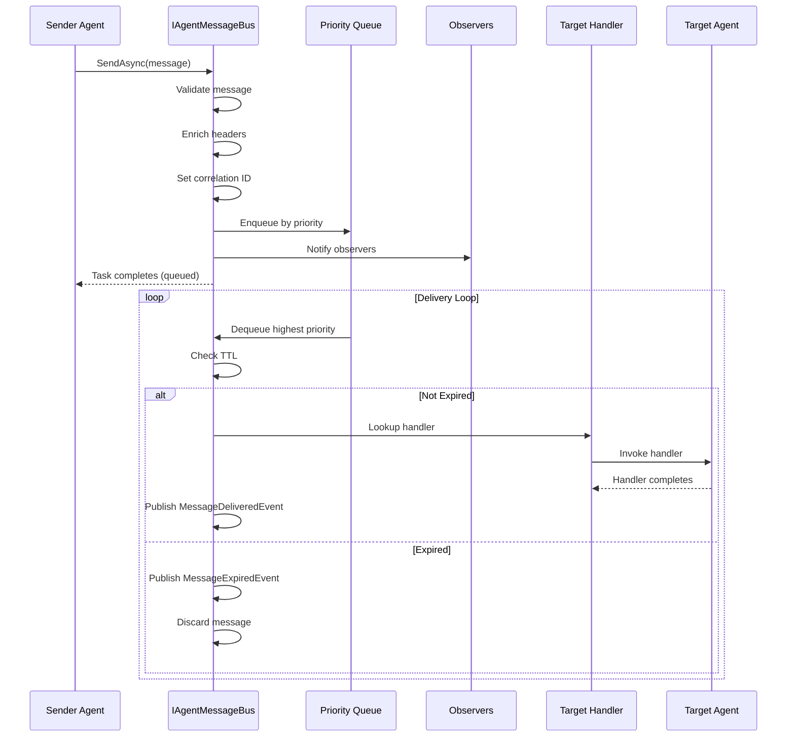

# LDS-01: Message Bus Core

## 1. Metadata & Categorization

| Field | Value |
| :--- | :--- |
| **Feature ID** | `CMB-BUS-01` |
| **Feature Name** | Message Bus Core |
| **Target Version** | `v0.12.3a` |
| **Module Scope** | `Lexichord.Modules.Agents` |
| **Swimlane** | Ensemble |
| **License Tier** | Core |
| **Feature Gate Key** | `FeatureFlags.Agents.Communication.MessageBus` |
| **Author** | Agent Architecture Lead |
| **Reviewer** | Lead Architect |
| **Status** | Draft |
| **Last Updated** | 2026-02-03 |
| **Parent Spec** | [LCS-SBD-v0.12.3-AGT](./LCS-SBD-v0.12.3-AGT.md) |
| **Depends On** | [v0.12.1a (Agent Schema)](../v0.12.1/LCS-SBD-v0.12.1a-SCH.md), [v0.12.2a (Spawner)](../v0.12.2/LCS-SBD-v0.12.2a-SPW.md) |
| **Estimated Hours** | 10 |

---

## 2. Executive Summary

### 2.1 The Requirement

Agents need a reliable, low-latency mechanism to communicate with each other. Without a centralized message bus, agents would need to know about each other directly, creating tight coupling and making the system difficult to scale or modify. The system needs fire-and-forget messaging with priority support, correlation tracking, and time-to-live enforcement.

### 2.2 The Proposed Solution

Implement a core message bus providing:
- `IAgentMessageBus` interface for inter-agent communication
- `AgentMessage` record with full metadata support
- Priority-based message queuing with FIFO ordering within priority levels
- Correlation and causation ID tracking for message chains
- Time-to-live (TTL) enforcement for message expiration
- Message observation for monitoring and debugging
- Thread-safe in-memory queue implementation

---

## 3. Architecture & Modular Strategy

### 3.1 Dependencies

**Upstream Modules:**
- `Lexichord.Modules.Agents.Abstractions` — `IAgent`, `AgentId` (v0.12.1a)
- `Lexichord.Modules.Agents` — `IAgentLifecycleManager`, `AgentInstance` (v0.12.2a)
- `Lexichord.Modules.Security` — `IAuditLogService` (v0.11.2)
- `Lexichord.Host` — `IMediator`

**NuGet Packages:**
- `System.Threading.Channels` (high-performance queue)
- `MediatR` (event publishing)
- `Microsoft.Extensions.Logging.Abstractions` (logging)

### 3.2 Licensing Behavior

- **Load Behavior:** [x] **Soft Gate** — Core tier gets direct messaging only; advanced features return `NotAuthorized`.
- **Fallback Experience:** Core users can send direct messages. Pub/Sub, Request/Response, Broadcast return feature-locked error.

---

## 4. Data Contract (The API)

### 4.1 Message Bus Interface

```csharp
namespace Lexichord.Modules.Agents;

/// <summary>
/// Central message bus for inter-agent communication.
/// Provides fire-and-forget messaging, message observation, and queue management.
/// </summary>
/// <remarks>
/// <para>
/// The message bus is the foundation of agent communication in Lexichord.
/// All messages pass through this bus, enabling centralized monitoring,
/// routing, and delivery guarantees.
/// </para>
/// <para>
/// Messages are processed in priority order (Critical > High > Normal > Low),
/// with FIFO ordering maintained within each priority level.
/// </para>
/// <para>
/// Thread Safety: All methods are thread-safe and can be called concurrently.
/// </para>
/// </remarks>
public interface IAgentMessageBus
{
    /// <summary>
    /// Sends a message to a target agent asynchronously (fire-and-forget).
    /// </summary>
    /// <param name="message">The message to send.</param>
    /// <param name="ct">Cancellation token.</param>
    /// <returns>Task completing when message is queued (not delivered).</returns>
    /// <exception cref="ArgumentNullException">Message is null.</exception>
    /// <exception cref="ArgumentException">Message missing required fields.</exception>
    /// <exception cref="AgentNotFoundException">Target agent not found.</exception>
    /// <remarks>
    /// <para>
    /// This is fire-and-forget: the method returns when the message is queued,
    /// not when it is delivered. Use <see cref="ObserveAsync"/> to track delivery.
    /// </para>
    /// <para>
    /// Messages with expired TTL are silently discarded during delivery.
    /// </para>
    /// </remarks>
    Task SendAsync(
        AgentMessage message,
        CancellationToken ct = default);

    /// <summary>
    /// Gets the current queue depth for monitoring purposes.
    /// </summary>
    /// <returns>Number of messages pending delivery.</returns>
    int GetQueueDepth();

    /// <summary>
    /// Gets queue depth by priority level.
    /// </summary>
    /// <param name="priority">The priority level to check.</param>
    /// <returns>Number of messages at this priority level.</returns>
    int GetQueueDepth(MessagePriority priority);

    /// <summary>
    /// Registers a message handler for an agent.
    /// </summary>
    /// <param name="agentId">The agent to register handler for.</param>
    /// <param name="handler">The handler to invoke when messages arrive.</param>
    /// <param name="ct">Cancellation token.</param>
    /// <returns>Disposable to unregister the handler.</returns>
    /// <remarks>
    /// Only one handler per agent is allowed. Registering a new handler
    /// replaces the previous one.
    /// </remarks>
    IDisposable RegisterHandler(
        AgentId agentId,
        Func<AgentMessage, CancellationToken, Task> handler,
        CancellationToken ct = default);

    /// <summary>
    /// Unregisters the message handler for an agent.
    /// </summary>
    /// <param name="agentId">The agent to unregister.</param>
    void UnregisterHandler(AgentId agentId);

    /// <summary>
    /// Observes all messages passing through the bus (for monitoring).
    /// </summary>
    /// <param name="observer">Callback invoked for each message.</param>
    /// <returns>Disposable to stop observing.</returns>
    /// <remarks>
    /// <para>
    /// Observers see messages at queue time, before delivery.
    /// Use this for monitoring, tracing, and debugging.
    /// </para>
    /// <para>
    /// Observer exceptions are logged but do not affect message delivery.
    /// </para>
    /// </remarks>
    IDisposable Observe(
        Func<AgentMessage, Task> observer);

    /// <summary>
    /// Purges all messages from the queue.
    /// </summary>
    /// <param name="ct">Cancellation token.</param>
    /// <returns>Number of messages purged.</returns>
    /// <remarks>
    /// Use with caution. This discards all pending messages.
    /// Primarily for testing and emergency recovery.
    /// </remarks>
    Task<int> PurgeAsync(CancellationToken ct = default);

    /// <summary>
    /// Gets bus statistics for monitoring.
    /// </summary>
    /// <param name="ct">Cancellation token.</param>
    /// <returns>Current bus statistics.</returns>
    Task<MessageBusStatistics> GetStatisticsAsync(CancellationToken ct = default);
}
```

### 4.2 Agent Message Record

```csharp
namespace Lexichord.Modules.Agents.Abstractions;

/// <summary>
/// A message sent between agents via the message bus.
/// </summary>
/// <remarks>
/// <para>
/// Messages are immutable once created. Use the <c>with</c> expression
/// to create modified copies if needed.
/// </para>
/// <para>
/// The <see cref="CorrelationId"/> links related messages across a transaction.
/// The <see cref="CausationId"/> references the immediate parent message.
/// </para>
/// </remarks>
public sealed record AgentMessage
{
    /// <summary>
    /// Unique identifier for this message.
    /// </summary>
    public MessageId Id { get; init; } = MessageId.New();

    /// <summary>
    /// ID of the agent sending this message.
    /// </summary>
    public required AgentId SenderId { get; init; }

    /// <summary>
    /// ID of the target agent to receive this message.
    /// </summary>
    public required AgentId TargetId { get; init; }

    /// <summary>
    /// Type of this message (Message, Request, Response, Event).
    /// </summary>
    public required MessageType Type { get; init; }

    /// <summary>
    /// The message payload.
    /// </summary>
    /// <remarks>
    /// Payload MUST be serializable. Complex types should implement
    /// proper JSON serialization attributes.
    /// </remarks>
    public required object Payload { get; init; }

    /// <summary>
    /// Priority for queue ordering.
    /// </summary>
    public MessagePriority Priority { get; init; } = MessagePriority.Normal;

    /// <summary>
    /// When this message was created.
    /// </summary>
    public DateTimeOffset Timestamp { get; init; } = DateTimeOffset.UtcNow;

    /// <summary>
    /// Time-to-live: message expires after this duration.
    /// </summary>
    /// <remarks>
    /// Null means no expiration. Expired messages are discarded
    /// during delivery attempt.
    /// </remarks>
    public TimeSpan? TimeToLive { get; init; }

    /// <summary>
    /// Correlation ID linking related messages across a transaction.
    /// </summary>
    /// <remarks>
    /// If not set, defaults to <see cref="Id"/> for the first message
    /// in a chain. Subsequent messages inherit the correlation ID.
    /// </remarks>
    public MessageId? CorrelationId { get; init; }

    /// <summary>
    /// Causation ID referencing the immediate parent message.
    /// </summary>
    /// <remarks>
    /// Forms a chain of causality: A caused B, B caused C, etc.
    /// Null for initial messages with no parent.
    /// </remarks>
    public MessageId? CausationId { get; init; }

    /// <summary>
    /// Extensible headers for custom metadata.
    /// </summary>
    public IReadOnlyDictionary<string, string> Headers { get; init; } =
        new Dictionary<string, string>();

    /// <summary>
    /// Checks if this message has expired.
    /// </summary>
    public bool IsExpired =>
        TimeToLive.HasValue &&
        DateTimeOffset.UtcNow > Timestamp.Add(TimeToLive.Value);

    /// <summary>
    /// Gets the effective correlation ID (defaults to message ID if not set).
    /// </summary>
    public MessageId EffectiveCorrelationId =>
        CorrelationId ?? Id;

    /// <summary>
    /// Creates a reply message to this message.
    /// </summary>
    /// <param name="senderId">The replying agent's ID.</param>
    /// <param name="payload">The reply payload.</param>
    /// <returns>A new message configured as a reply.</returns>
    public AgentMessage CreateReply(AgentId senderId, object payload) =>
        new()
        {
            SenderId = senderId,
            TargetId = SenderId, // Reply goes back to original sender
            Type = MessageType.Response,
            Payload = payload,
            Priority = Priority,
            CorrelationId = EffectiveCorrelationId,
            CausationId = Id
        };

    /// <summary>
    /// Creates a forwarded message to a new target.
    /// </summary>
    /// <param name="newTarget">The new target agent.</param>
    /// <returns>A new message forwarded to the target.</returns>
    public AgentMessage Forward(AgentId newTarget) =>
        this with
        {
            Id = MessageId.New(),
            TargetId = newTarget,
            CausationId = Id,
            Timestamp = DateTimeOffset.UtcNow
        };
}
```

### 4.3 Message Identifier

```csharp
namespace Lexichord.Modules.Agents.Abstractions;

/// <summary>
/// Unique identifier for a message.
/// </summary>
/// <remarks>
/// <para>
/// MessageId is a value type wrapper around Guid for type safety.
/// It prevents accidentally passing other Guids where a MessageId is expected.
/// </para>
/// </remarks>
public readonly record struct MessageId
{
    /// <summary>
    /// The underlying GUID value.
    /// </summary>
    public Guid Value { get; }

    /// <summary>
    /// Creates a MessageId from a GUID.
    /// </summary>
    /// <param name="value">The GUID value.</param>
    /// <exception cref="ArgumentException">Value is empty GUID.</exception>
    public MessageId(Guid value)
    {
        if (value == Guid.Empty)
            throw new ArgumentException("MessageId cannot be empty", nameof(value));
        Value = value;
    }

    /// <summary>
    /// Creates a new unique MessageId.
    /// </summary>
    public static MessageId New() => new(Guid.NewGuid());

    /// <summary>
    /// Parses a MessageId from a string.
    /// </summary>
    /// <param name="s">String representation of the GUID.</param>
    /// <returns>Parsed MessageId.</returns>
    /// <exception cref="FormatException">Invalid GUID format.</exception>
    public static MessageId Parse(string s) => new(Guid.Parse(s));

    /// <summary>
    /// Tries to parse a MessageId from a string.
    /// </summary>
    /// <param name="s">String to parse.</param>
    /// <param name="result">Parsed MessageId if successful.</param>
    /// <returns>True if parsing succeeded.</returns>
    public static bool TryParse(string s, out MessageId result)
    {
        if (Guid.TryParse(s, out var guid) && guid != Guid.Empty)
        {
            result = new MessageId(guid);
            return true;
        }
        result = default;
        return false;
    }

    /// <summary>
    /// Returns the N-format string (32 hex digits, no hyphens).
    /// </summary>
    public override string ToString() => $"msg:{Value:N}";

    /// <summary>
    /// Implicit conversion to Guid for interop.
    /// </summary>
    public static implicit operator Guid(MessageId id) => id.Value;
}
```

### 4.4 Message Type and Priority Enums

```csharp
namespace Lexichord.Modules.Agents.Abstractions;

/// <summary>
/// Type of message being sent.
/// </summary>
public enum MessageType
{
    /// <summary>
    /// Direct message (fire-and-forget).
    /// </summary>
    Message = 0,

    /// <summary>
    /// Request expecting a response.
    /// </summary>
    Request = 1,

    /// <summary>
    /// Response to a request.
    /// </summary>
    Response = 2,

    /// <summary>
    /// Event published to subscribers.
    /// </summary>
    Event = 3
}

/// <summary>
/// Message priority for queue ordering.
/// </summary>
/// <remarks>
/// Messages are delivered in priority order (Critical first).
/// Within the same priority level, FIFO order is maintained.
/// </remarks>
public enum MessagePriority
{
    /// <summary>
    /// Low priority, processed after all higher priorities.
    /// </summary>
    Low = 0,

    /// <summary>
    /// Normal priority (default).
    /// </summary>
    Normal = 1,

    /// <summary>
    /// High priority, processed before Normal and Low.
    /// </summary>
    High = 2,

    /// <summary>
    /// Critical priority, processed first.
    /// </summary>
    /// <remarks>
    /// Use sparingly. Critical messages may starve lower priorities.
    /// </remarks>
    Critical = 3
}
```

### 4.5 Message Bus Statistics

```csharp
namespace Lexichord.Modules.Agents.Abstractions;

/// <summary>
/// Statistics about the message bus operation.
/// </summary>
public sealed record MessageBusStatistics
{
    /// <summary>
    /// Total messages sent since bus started.
    /// </summary>
    public long TotalMessagesSent { get; init; }

    /// <summary>
    /// Total messages delivered successfully.
    /// </summary>
    public long TotalMessagesDelivered { get; init; }

    /// <summary>
    /// Total messages that failed delivery.
    /// </summary>
    public long TotalMessagesFailed { get; init; }

    /// <summary>
    /// Total messages expired (TTL exceeded).
    /// </summary>
    public long TotalMessagesExpired { get; init; }

    /// <summary>
    /// Current queue depth (pending messages).
    /// </summary>
    public int CurrentQueueDepth { get; init; }

    /// <summary>
    /// Queue depth by priority level.
    /// </summary>
    public IReadOnlyDictionary<MessagePriority, int> QueueDepthByPriority { get; init; } =
        new Dictionary<MessagePriority, int>();

    /// <summary>
    /// Number of registered message handlers.
    /// </summary>
    public int RegisteredHandlers { get; init; }

    /// <summary>
    /// Number of active observers.
    /// </summary>
    public int ActiveObservers { get; init; }

    /// <summary>
    /// Average delivery latency (milliseconds).
    /// </summary>
    public double AverageLatencyMs { get; init; }

    /// <summary>
    /// 95th percentile delivery latency (milliseconds).
    /// </summary>
    public double P95LatencyMs { get; init; }

    /// <summary>
    /// When the bus was started.
    /// </summary>
    public DateTimeOffset StartedAt { get; init; }

    /// <summary>
    /// Bus uptime.
    /// </summary>
    public TimeSpan Uptime => DateTimeOffset.UtcNow - StartedAt;
}
```

### 4.6 MediatR Events

```csharp
namespace Lexichord.Modules.Agents.Events;

/// <summary>
/// Published when a message is sent to the bus.
/// </summary>
public sealed record MessageSentEvent : INotification
{
    public required MessageId MessageId { get; init; }
    public required AgentId SenderId { get; init; }
    public required AgentId TargetId { get; init; }
    public required MessageType Type { get; init; }
    public required MessagePriority Priority { get; init; }
    public required DateTimeOffset Timestamp { get; init; }
    public MessageId? CorrelationId { get; init; }
}

/// <summary>
/// Published when a message is successfully delivered.
/// </summary>
public sealed record MessageDeliveredEvent : INotification
{
    public required MessageId MessageId { get; init; }
    public required AgentId TargetId { get; init; }
    public required TimeSpan DeliveryLatency { get; init; }
    public required DateTimeOffset DeliveredAt { get; init; }
}

/// <summary>
/// Published when message delivery fails.
/// </summary>
public sealed record MessageFailedEvent : INotification
{
    public required MessageId MessageId { get; init; }
    public required AgentId TargetId { get; init; }
    public required string FailureReason { get; init; }
    public Exception? Exception { get; init; }
    public required DateTimeOffset FailedAt { get; init; }
}

/// <summary>
/// Published when a message expires due to TTL.
/// </summary>
public sealed record MessageExpiredEvent : INotification
{
    public required MessageId MessageId { get; init; }
    public required AgentId TargetId { get; init; }
    public required TimeSpan TimeToLive { get; init; }
    public required DateTimeOffset ExpiredAt { get; init; }
}
```

---

## 5. Implementation Logic

### 5.1 Flow Diagram



### 5.2 Priority Queue Implementation

```csharp
/// <summary>
/// Thread-safe priority queue for messages.
/// </summary>
/// <remarks>
/// Uses System.Threading.Channels for high-performance queuing.
/// Maintains separate channels per priority level.
/// </remarks>
internal sealed class PriorityMessageQueue
{
    private readonly Channel<AgentMessage>[] _channels;
    private readonly ILogger<PriorityMessageQueue> _logger;

    public PriorityMessageQueue(ILogger<PriorityMessageQueue> logger)
    {
        _logger = logger;
        _channels = new Channel<AgentMessage>[4];

        // Create unbounded channels for each priority level
        for (int i = 0; i < 4; i++)
        {
            _channels[i] = Channel.CreateUnbounded<AgentMessage>(
                new UnboundedChannelOptions
                {
                    SingleReader = false,
                    SingleWriter = false
                });
        }
    }

    /// <summary>
    /// Enqueues a message at its priority level.
    /// </summary>
    public async ValueTask EnqueueAsync(AgentMessage message, CancellationToken ct)
    {
        var priority = (int)message.Priority;
        await _channels[priority].Writer.WriteAsync(message, ct);

        _logger.LogDebug(
            "Message {MessageId} enqueued at priority {Priority}",
            message.Id,
            message.Priority);
    }

    /// <summary>
    /// Dequeues the highest priority message available.
    /// </summary>
    public async ValueTask<AgentMessage?> DequeueAsync(CancellationToken ct)
    {
        // Check channels in priority order (Critical -> Low)
        for (int i = 3; i >= 0; i--)
        {
            if (_channels[i].Reader.TryRead(out var message))
            {
                return message;
            }
        }

        // Wait for any message
        var tasks = _channels.Select(c => c.Reader.WaitToReadAsync(ct).AsTask()).ToArray();
        await Task.WhenAny(tasks);

        // Try again after waiting
        for (int i = 3; i >= 0; i--)
        {
            if (_channels[i].Reader.TryRead(out var message))
            {
                return message;
            }
        }

        return null;
    }

    /// <summary>
    /// Gets the total queue depth.
    /// </summary>
    public int GetDepth() => _channels.Sum(c => c.Reader.Count);

    /// <summary>
    /// Gets queue depth at a specific priority.
    /// </summary>
    public int GetDepth(MessagePriority priority) =>
        _channels[(int)priority].Reader.Count;
}
```

### 5.3 Key Implementation Notes

1. **Thread Safety:** All queue operations use `System.Threading.Channels` for lock-free concurrency.
2. **Delivery Loop:** A background task continuously dequeues and delivers messages.
3. **Handler Registration:** Handlers are stored in a `ConcurrentDictionary<AgentId, Func<...>>`.
4. **Observer Pattern:** Observers stored in a thread-safe list, invoked asynchronously.
5. **TTL Enforcement:** Checked at delivery time, not at queue time.
6. **Correlation Tracking:** Automatically set if not provided by sender.

---

## 6. Data Persistence (Database)

This sub-part does not introduce database tables. The message bus is in-memory only.

**Note:** Enterprise tier persistence is planned for future release (out of scope for v0.12.3).

---

## 7. Observability & Logging

### 7.1 Log Messages

| Level | Template |
|:------|:---------|
| Debug | `"Message {MessageId} enqueued at priority {Priority}"` |
| Debug | `"Message {MessageId} delivered to agent {TargetId} in {LatencyMs}ms"` |
| Info | `"Message bus started with {HandlerCount} registered handlers"` |
| Warning | `"Message {MessageId} expired (TTL: {TimeToLive})"` |
| Warning | `"No handler registered for agent {TargetId}, message {MessageId} dropped"` |
| Error | `"Message {MessageId} delivery failed: {ErrorMessage}"` |

### 7.2 Metrics

| Metric | Type | Description |
|:-------|:-----|:------------|
| `agents.messagebus.sent_total` | Counter | Total messages sent |
| `agents.messagebus.delivered_total` | Counter | Total messages delivered |
| `agents.messagebus.failed_total` | Counter | Total delivery failures |
| `agents.messagebus.expired_total` | Counter | Total TTL expirations |
| `agents.messagebus.queue_depth` | Gauge | Current queue depth |
| `agents.messagebus.latency_ms` | Histogram | Delivery latency |

---

## 8. Security & Safety

### 8.1 Audit Trail

All messages are audited via `IAuditLogService` (v0.11.2):
- Message ID, sender, target, type, priority
- Delivery status (success/failure/expired)
- Correlation and causation chain

### 8.2 Input Validation

- `SenderId` and `TargetId` MUST be valid `AgentId` values
- `Payload` MUST be non-null and serializable
- `Headers` keys MUST NOT contain control characters
- `TimeToLive` MUST be positive if specified

### 8.3 Resource Protection

- Queue depth is monitored; backpressure applied if exceeding 10,000 messages
- Observer exceptions are caught and logged, never propagate
- Handler timeout of 30 seconds to prevent blocking

---

## 9. Acceptance Criteria (QA)

### 9.1 Functional Criteria

1. **[Message Send]** Agent A can send a message to Agent B and B receives it.
2. **[Priority Order]** Critical messages are delivered before Normal messages.
3. **[TTL Enforcement]** Messages with expired TTL are not delivered.
4. **[Correlation]** Reply messages automatically inherit correlation ID.
5. **[Observer]** Registered observers see all messages passing through the bus.

### 9.2 Non-Functional Criteria

1. **[Latency]** P95 delivery latency < 50ms.
2. **[Throughput]** Bus handles > 10,000 messages/second.
3. **[Concurrency]** Multiple agents can send/receive simultaneously without deadlock.

---

## 10. Test Scenarios

### 10.1 Unit Tests

```gherkin
Scenario: Send message to registered agent
  Given Agent "A" is registered with a handler
  And Agent "B" has a reference to the message bus
  When Agent "B" sends a message to Agent "A"
  Then Agent "A" receives the message
  And MessageDeliveredEvent is published

Scenario: Priority ordering
  Given Agent "A" is registered with a handler
  When a Low priority message is sent
  And a Critical priority message is sent
  Then Critical message is delivered first

Scenario: TTL expiration
  Given Agent "A" is registered with a handler
  And a message is sent with TTL of 1ms
  When 10ms passes before delivery
  Then the message is not delivered
  And MessageExpiredEvent is published

Scenario: Unregistered target
  Given Agent "A" is NOT registered
  When a message is sent to Agent "A"
  Then MessageFailedEvent is published with "No handler registered"
```

### 10.2 Integration Tests

```gherkin
Scenario: Full message lifecycle
  Given the message bus is running
  And two agents are spawned and registered
  When Agent A sends a message to Agent B
  Then Agent B's handler is invoked
  And the message contains correct sender, target, and payload

Scenario: Observer sees all messages
  Given an observer is registered
  When 100 messages are sent
  Then the observer callback is invoked 100 times
```

---

## 11. Changelog

| Version | Date | Author | Changes |
|:--------|:-----|:-------|:--------|
| 1.0.0 | 2026-02-03 | Agent Architecture Lead | Initial specification |

---

**End of Specification**
