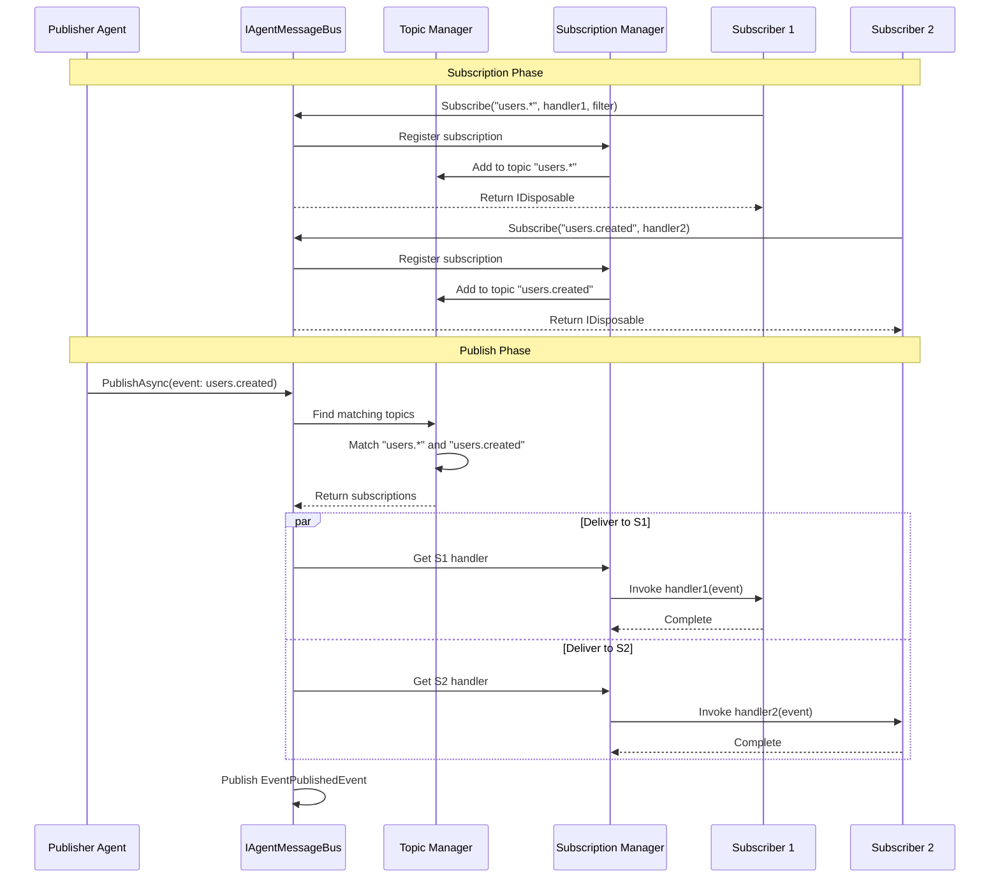

# LDS-01: Event System

## 1. Metadata & Categorization

| Field | Value |
| :--- | :--- |
| **Feature ID** | `CMB-EVT-01` |
| **Feature Name** | Event System |
| **Target Version** | `v0.12.3b` |
| **Module Scope** | `Lexichord.Modules.Agents` |
| **Swimlane** | Ensemble |
| **License Tier** | WriterPro |
| **Feature Gate Key** | `FeatureFlags.Agents.Communication.Events` |
| **Author** | Agent Architecture Lead |
| **Reviewer** | Lead Architect |
| **Status** | Draft |
| **Last Updated** | 2026-02-03 |
| **Parent Spec** | [LCS-SBD-v0.12.3-AGT](./LCS-SBD-v0.12.3-AGT.md) |
| **Depends On** | [v0.12.3a (Message Bus Core)](./LCS-SBD-v0.12.3a-BUS.md) |
| **Estimated Hours** | 8 |

---

## 2. Executive Summary

### 2.1 The Requirement

Agents need a decoupled way to communicate events without knowing which agents will consume them. Direct messaging requires the sender to know the target, creating tight coupling. The system needs publish/subscribe semantics where agents can publish events to topics and other agents can subscribe to receive them with optional filtering.

### 2.2 The Proposed Solution

Implement a pub/sub event system providing:
- `PublishAsync` method for publishing events to topics
- `SubscribeAsync` method for subscribing to event topics
- `AgentEvent` record for event data
- `AgentEventFilter` for filtering subscriptions
- Subscription lifecycle management with proper cleanup
- At-least-once delivery guarantee per subscriber
- Topic-based routing with wildcard support

---

## 3. Architecture & Modular Strategy

### 3.1 Dependencies

**Upstream Modules:**
- `Lexichord.Modules.Agents` — `IAgentMessageBus`, `AgentMessage` (v0.12.3a)
- `Lexichord.Modules.Agents.Abstractions` — `AgentId` (v0.12.1a)
- `Lexichord.Modules.Security` — `IAuditLogService` (v0.11.2)
- `Lexichord.Host` — `IMediator`, `ILicenseService`

**NuGet Packages:**
- `System.Threading.Channels` (subscriber queues)
- `MediatR` (event publishing)
- `Microsoft.Extensions.Logging.Abstractions` (logging)

### 3.2 Licensing Behavior

- **Load Behavior:** [x] **Soft Gate** — WriterPro gets up to 5 topics; Teams/Enterprise get unlimited.
- **Fallback Experience:** Core users get `LicenseException` when calling `PublishAsync` or `SubscribeAsync`. UI shows upgrade prompt.

---

## 4. Data Contract (The API)

### 4.1 Event Publishing Interface Extension

```csharp
namespace Lexichord.Modules.Agents;

/// <summary>
/// Extension to IAgentMessageBus for pub/sub event support.
/// </summary>
public partial interface IAgentMessageBus
{
    /// <summary>
    /// Publishes an event to all subscribers of the event type.
    /// </summary>
    /// <param name="event">The event to publish.</param>
    /// <param name="ct">Cancellation token.</param>
    /// <returns>Task completing when event is queued for all subscribers.</returns>
    /// <exception cref="ArgumentNullException">Event is null.</exception>
    /// <exception cref="LicenseException">Pub/Sub requires WriterPro or higher.</exception>
    /// <remarks>
    /// <para>
    /// Events are delivered asynchronously to all matching subscribers.
    /// The method returns when the event is queued, not when all subscribers
    /// have processed it.
    /// </para>
    /// <para>
    /// Each subscriber receives a copy of the event, ensuring isolation.
    /// </para>
    /// </remarks>
    Task PublishAsync(
        AgentEvent @event,
        CancellationToken ct = default);

    /// <summary>
    /// Subscribes to events matching the specified filter.
    /// </summary>
    /// <param name="topic">The topic pattern to subscribe to.</param>
    /// <param name="handler">Callback invoked for each matching event.</param>
    /// <param name="filter">Optional filter for fine-grained matching.</param>
    /// <returns>Disposable subscription. Dispose to unsubscribe.</returns>
    /// <exception cref="ArgumentNullException">Topic or handler is null.</exception>
    /// <exception cref="LicenseException">Pub/Sub requires WriterPro or higher.</exception>
    /// <exception cref="TopicLimitExceededException">Maximum topic limit reached (WriterPro: 5).</exception>
    /// <remarks>
    /// <para>
    /// Topic patterns support wildcards:
    /// <list type="bullet">
    ///   <item><c>users.created</c> - exact match</item>
    ///   <item><c>users.*</c> - matches users.created, users.deleted, etc.</item>
    ///   <item><c>*.created</c> - matches users.created, orders.created, etc.</item>
    ///   <item><c>#</c> - matches all events</item>
    /// </list>
    /// </para>
    /// <para>
    /// The subscription remains active until disposed. Always dispose
    /// subscriptions to prevent memory leaks.
    /// </para>
    /// </remarks>
    IDisposable Subscribe(
        string topic,
        Func<AgentEvent, CancellationToken, Task> handler,
        AgentEventFilter? filter = null);

    /// <summary>
    /// Gets all active subscriptions for an agent.
    /// </summary>
    /// <param name="agentId">The agent to query.</param>
    /// <returns>List of active subscriptions.</returns>
    IReadOnlyList<Subscription> GetSubscriptions(AgentId agentId);

    /// <summary>
    /// Gets all active topics with subscriber counts.
    /// </summary>
    /// <returns>Dictionary of topic to subscriber count.</returns>
    IReadOnlyDictionary<string, int> GetTopics();
}
```

### 4.2 Agent Event Record

```csharp
namespace Lexichord.Modules.Agents.Abstractions;

/// <summary>
/// An event published to the message bus for subscriber consumption.
/// </summary>
/// <remarks>
/// <para>
/// Events are immutable once created. They carry data about something
/// that happened, not commands to do something.
/// </para>
/// <para>
/// Naming convention: Use past tense (UserCreated, OrderCompleted, FileDeleted).
/// </para>
/// </remarks>
public sealed record AgentEvent
{
    /// <summary>
    /// Unique identifier for this event.
    /// </summary>
    public Guid Id { get; init; } = Guid.NewGuid();

    /// <summary>
    /// The event type/topic (e.g., "users.created", "orders.completed").
    /// </summary>
    /// <remarks>
    /// Convention: Use dot-separated hierarchy (domain.action).
    /// Subscribers can use wildcards to match multiple event types.
    /// </remarks>
    public required string EventType { get; init; }

    /// <summary>
    /// ID of the agent that published this event.
    /// </summary>
    public required AgentId SourceId { get; init; }

    /// <summary>
    /// The event data payload.
    /// </summary>
    /// <remarks>
    /// Payload MUST be serializable. Use records or DTOs, not complex objects.
    /// </remarks>
    public required object Data { get; init; }

    /// <summary>
    /// When this event occurred.
    /// </summary>
    public DateTimeOffset Timestamp { get; init; } = DateTimeOffset.UtcNow;

    /// <summary>
    /// Tags for additional filtering and categorization.
    /// </summary>
    public IReadOnlyList<string> Tags { get; init; } = [];

    /// <summary>
    /// Optional correlation ID for event chains.
    /// </summary>
    public Guid? CorrelationId { get; init; }

    /// <summary>
    /// Optional causation ID (what triggered this event).
    /// </summary>
    public Guid? CausationId { get; init; }

    /// <summary>
    /// Extensible metadata.
    /// </summary>
    public IReadOnlyDictionary<string, string> Metadata { get; init; } =
        new Dictionary<string, string>();

    /// <summary>
    /// Gets the domain portion of the event type (before first dot).
    /// </summary>
    public string Domain => EventType.Contains('.')
        ? EventType[..EventType.IndexOf('.')]
        : EventType;

    /// <summary>
    /// Gets the action portion of the event type (after last dot).
    /// </summary>
    public string Action => EventType.Contains('.')
        ? EventType[(EventType.LastIndexOf('.') + 1)..]
        : EventType;
}
```

### 4.3 Event Filter

```csharp
namespace Lexichord.Modules.Agents.Abstractions;

/// <summary>
/// Filter for event subscriptions.
/// </summary>
/// <remarks>
/// <para>
/// Filters are evaluated in addition to topic matching.
/// All specified criteria must match (AND logic).
/// </para>
/// <para>
/// Null properties mean "no filter" (match all).
/// </para>
/// </remarks>
public sealed record AgentEventFilter
{
    /// <summary>
    /// Specific event types to match (exact match, no wildcards).
    /// </summary>
    /// <remarks>
    /// Null means match all event types within the subscribed topic pattern.
    /// </remarks>
    public IReadOnlyList<string>? EventTypes { get; init; }

    /// <summary>
    /// Source agent IDs to filter by.
    /// </summary>
    /// <remarks>
    /// Only events from these sources will match.
    /// Null means accept from any source.
    /// </remarks>
    public IReadOnlyList<AgentId>? SourceIds { get; init; }

    /// <summary>
    /// Tags that the event must contain (any match).
    /// </summary>
    /// <remarks>
    /// Event must contain at least one of these tags to match.
    /// Null means no tag filtering.
    /// </remarks>
    public IReadOnlyList<string>? Tags { get; init; }

    /// <summary>
    /// Custom filter predicate for complex filtering.
    /// </summary>
    /// <remarks>
    /// Use sparingly as this prevents filter optimization.
    /// Called after all other filters pass.
    /// </remarks>
    public Func<AgentEvent, bool>? CustomFilter { get; init; }

    /// <summary>
    /// Evaluates if an event matches this filter.
    /// </summary>
    /// <param name="event">The event to evaluate.</param>
    /// <returns>True if event matches all filter criteria.</returns>
    public bool Matches(AgentEvent @event)
    {
        // Event type filter
        if (EventTypes is not null && !EventTypes.Contains(@event.EventType))
            return false;

        // Source ID filter
        if (SourceIds is not null && !SourceIds.Contains(@event.SourceId))
            return false;

        // Tag filter (any match)
        if (Tags is not null && !@event.Tags.Any(t => Tags.Contains(t)))
            return false;

        // Custom filter
        if (CustomFilter is not null && !CustomFilter(@event))
            return false;

        return true;
    }

    /// <summary>
    /// Creates a filter for specific source agents.
    /// </summary>
    public static AgentEventFilter FromSources(params AgentId[] sourceIds) =>
        new() { SourceIds = sourceIds };

    /// <summary>
    /// Creates a filter for specific tags.
    /// </summary>
    public static AgentEventFilter WithTags(params string[] tags) =>
        new() { Tags = tags };
}
```

### 4.4 Subscription Record

```csharp
namespace Lexichord.Modules.Agents.Abstractions;

/// <summary>
/// Represents an active event subscription.
/// </summary>
public sealed record Subscription
{
    /// <summary>
    /// Unique identifier for this subscription.
    /// </summary>
    public Guid Id { get; init; } = Guid.NewGuid();

    /// <summary>
    /// The topic pattern subscribed to.
    /// </summary>
    public required string Topic { get; init; }

    /// <summary>
    /// The subscriber agent ID.
    /// </summary>
    public required AgentId SubscriberId { get; init; }

    /// <summary>
    /// When the subscription was created.
    /// </summary>
    public DateTimeOffset CreatedAt { get; init; } = DateTimeOffset.UtcNow;

    /// <summary>
    /// Filter applied to this subscription.
    /// </summary>
    public AgentEventFilter? Filter { get; init; }

    /// <summary>
    /// Number of events delivered to this subscription.
    /// </summary>
    public long EventsDelivered { get; init; }

    /// <summary>
    /// Whether the subscription is still active.
    /// </summary>
    public bool IsActive { get; init; } = true;
}
```

### 4.5 MediatR Events

```csharp
namespace Lexichord.Modules.Agents.Events;

/// <summary>
/// Published when an agent event is published to the bus.
/// </summary>
public sealed record EventPublishedEvent : INotification
{
    public required Guid EventId { get; init; }
    public required string EventType { get; init; }
    public required AgentId SourceId { get; init; }
    public required int SubscriberCount { get; init; }
    public required DateTimeOffset Timestamp { get; init; }
}

/// <summary>
/// Published when a subscription is created.
/// </summary>
public sealed record SubscriptionCreatedEvent : INotification
{
    public required Guid SubscriptionId { get; init; }
    public required string Topic { get; init; }
    public required AgentId SubscriberId { get; init; }
    public required DateTimeOffset CreatedAt { get; init; }
}

/// <summary>
/// Published when a subscription is removed.
/// </summary>
public sealed record SubscriptionRemovedEvent : INotification
{
    public required Guid SubscriptionId { get; init; }
    public required string Topic { get; init; }
    public required AgentId SubscriberId { get; init; }
    public required long EventsDelivered { get; init; }
    public required DateTimeOffset RemovedAt { get; init; }
}

/// <summary>
/// Published when event delivery to a subscriber fails.
/// </summary>
public sealed record EventDeliveryFailedEvent : INotification
{
    public required Guid EventId { get; init; }
    public required Guid SubscriptionId { get; init; }
    public required AgentId SubscriberId { get; init; }
    public required string FailureReason { get; init; }
    public Exception? Exception { get; init; }
    public required DateTimeOffset FailedAt { get; init; }
}
```

---

## 5. Implementation Logic

### 5.1 Flow Diagram



### 5.2 Topic Matching Algorithm

```csharp
/// <summary>
/// Matches event types against topic patterns with wildcard support.
/// </summary>
internal static class TopicMatcher
{
    /// <summary>
    /// Checks if an event type matches a topic pattern.
    /// </summary>
    /// <param name="eventType">The event type (e.g., "users.created").</param>
    /// <param name="pattern">The topic pattern (e.g., "users.*").</param>
    /// <returns>True if pattern matches event type.</returns>
    /// <remarks>
    /// <para>
    /// Pattern syntax:
    /// <list type="bullet">
    ///   <item><c>*</c> matches any single segment</item>
    ///   <item><c>#</c> matches any number of segments (must be last)</item>
    /// </list>
    /// </para>
    /// </remarks>
    public static bool Matches(string eventType, string pattern)
    {
        // Exact match
        if (eventType == pattern)
            return true;

        // Match all
        if (pattern == "#")
            return true;

        var eventParts = eventType.Split('.');
        var patternParts = pattern.Split('.');

        // Multi-segment wildcard
        if (patternParts.Last() == "#")
        {
            // Pattern without # must be prefix of event
            for (int i = 0; i < patternParts.Length - 1; i++)
            {
                if (i >= eventParts.Length)
                    return false;
                if (patternParts[i] != "*" && patternParts[i] != eventParts[i])
                    return false;
            }
            return true;
        }

        // Same number of segments required
        if (eventParts.Length != patternParts.Length)
            return false;

        // Match each segment
        for (int i = 0; i < patternParts.Length; i++)
        {
            if (patternParts[i] != "*" && patternParts[i] != eventParts[i])
                return false;
        }

        return true;
    }
}
```

---

## 6. Data Persistence (Database)

### 6.1 Migration

**Migration ID:** `Migration_20260203_002_CreateMessageBusSubscriptions`

```csharp
[Migration(20260203002)]
public class CreateMessageBusSubscriptions : Migration
{
    public override void Up()
    {
        Create.Table("message_bus_subscriptions")
            .InSchema("agents")
            .WithColumn("id").AsGuid().PrimaryKey()
            .WithColumn("topic").AsString(256).NotNullable().Indexed()
            .WithColumn("subscriber_id").AsGuid().NotNullable().Indexed()
            .WithColumn("filter_json").AsString(4096).Nullable()
            .WithColumn("events_delivered").AsInt64().NotNullable().WithDefaultValue(0)
            .WithColumn("is_active").AsBoolean().NotNullable().WithDefaultValue(true)
            .WithColumn("created_at").AsDateTimeOffset().NotNullable()
            .WithColumn("updated_at").AsDateTimeOffset().NotNullable();

        Create.Index("ix_subscriptions_topic_active")
            .OnTable("message_bus_subscriptions").InSchema("agents")
            .OnColumn("topic").Ascending()
            .OnColumn("is_active").Ascending();
    }

    public override void Down()
    {
        Delete.Table("message_bus_subscriptions").InSchema("agents");
    }
}
```

---

## 7. Observability & Logging

### 7.1 Log Messages

| Level | Template |
|:------|:---------|
| Debug | `"Event {EventId} type {EventType} published to {SubscriberCount} subscribers"` |
| Debug | `"Subscription {SubscriptionId} created for topic {Topic} by agent {SubscriberId}"` |
| Info | `"Topic {Topic} now has {SubscriberCount} active subscribers"` |
| Warning | `"Event delivery to subscriber {SubscriberId} failed: {ErrorMessage}"` |
| Warning | `"Topic limit exceeded for license tier. Max: {MaxTopics}, Current: {CurrentTopics}"` |
| Error | `"Event {EventId} failed to deliver to all subscribers"` |

### 7.2 Metrics

| Metric | Type | Description |
|:-------|:-----|:------------|
| `agents.events.published_total` | Counter | Total events published |
| `agents.events.delivered_total` | Counter | Total event deliveries |
| `agents.events.failed_total` | Counter | Total delivery failures |
| `agents.subscriptions.active` | Gauge | Current active subscriptions |
| `agents.subscriptions.by_topic` | Gauge (labeled) | Subscriptions per topic |
| `agents.events.latency_ms` | Histogram | Event delivery latency |

---

## 8. Security & Safety

### 8.1 License Enforcement

```csharp
// Topic limit enforcement
private void ValidateTopicLimit(AgentId subscriberId)
{
    var currentTopics = GetSubscriptions(subscriberId)
        .Select(s => s.Topic)
        .Distinct()
        .Count();

    var maxTopics = _licenseService.GetFeatureLimit(
        "Agents.Communication.MaxTopics",
        defaultCore: 0,
        defaultWriterPro: 5,
        defaultTeams: int.MaxValue,
        defaultEnterprise: int.MaxValue);

    if (currentTopics >= maxTopics)
    {
        throw new TopicLimitExceededException(
            $"Maximum topic limit ({maxTopics}) reached for license tier");
    }
}
```

### 8.2 Subscription Cleanup

- Subscriptions are automatically cleaned up when:
  - `IDisposable.Dispose()` is called
  - Agent terminates (via `AgentTerminatedEvent` handler)
  - Application shuts down

---

## 9. Acceptance Criteria (QA)

1. **[Publish]** Agent can publish event and all matching subscribers receive it.
2. **[Subscribe]** Agent can subscribe to topic pattern and receive matching events.
3. **[Filter]** Subscription filter correctly excludes non-matching events.
4. **[Wildcard]** Wildcard patterns `*` and `#` work correctly.
5. **[Unsubscribe]** Disposing subscription stops event delivery.
6. **[License]** Core tier gets `LicenseException` when attempting pub/sub.
7. **[Topic Limit]** WriterPro limited to 5 topics.

---

## 10. Test Scenarios

### 10.1 Unit Tests

```gherkin
Scenario: Publish to single subscriber
  Given Subscriber A subscribes to "users.created"
  When Publisher publishes event type "users.created"
  Then Subscriber A receives the event

Scenario: Wildcard subscription
  Given Subscriber A subscribes to "users.*"
  When Publisher publishes event type "users.created"
  And Publisher publishes event type "users.deleted"
  Then Subscriber A receives both events

Scenario: Filter by source
  Given Subscriber A subscribes to "#" with filter SourceIds=[Agent1]
  When Agent1 publishes event
  And Agent2 publishes event
  Then Subscriber A receives only Agent1's event

Scenario: Topic limit enforcement
  Given WriterPro license
  And Subscriber has 5 existing subscriptions
  When Subscriber attempts to subscribe to new topic
  Then TopicLimitExceededException is thrown
```

---

## 11. Changelog

| Version | Date | Author | Changes |
|:--------|:-----|:-------|:--------|
| 1.0.0 | 2026-02-03 | Agent Architecture Lead | Initial specification |

---

**End of Specification**
