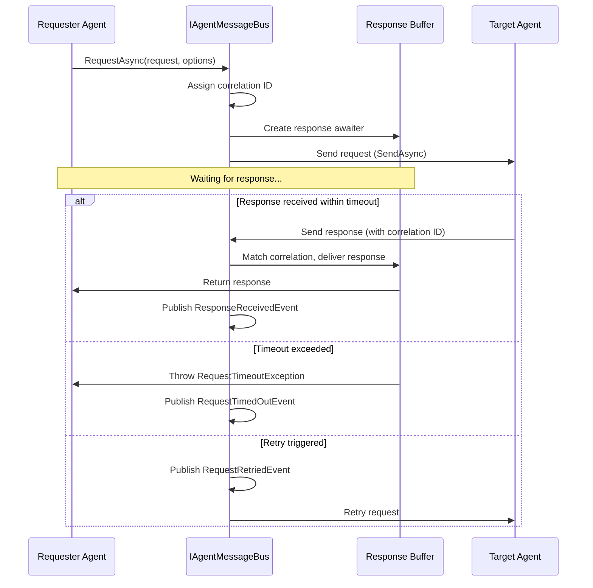

# LDS-01: Request/Response

## 1. Metadata & Categorization

| Field | Value |
| :--- | :--- |
| **Feature ID** | `CMB-RRQ-01` |
| **Feature Name** | Request/Response |
| **Target Version** | `v0.12.3c` |
| **Module Scope** | `Lexichord.Modules.Agents` |
| **Swimlane** | Ensemble |
| **License Tier** | Teams |
| **Feature Gate Key** | `FeatureFlags.Agents.Communication.RequestResponse` |
| **Author** | Agent Architecture Lead |
| **Reviewer** | Lead Architect |
| **Status** | Draft |
| **Last Updated** | 2026-02-03 |
| **Parent Spec** | [LCS-SBD-v0.12.3-AGT](./LCS-SBD-v0.12.3-AGT.md) |
| **Depends On** | [v0.12.3a (Message Bus Core)](./LCS-SBD-v0.12.3a-BUS.md), [v0.12.3b (Event System)](./LCS-SBD-v0.12.3b-EVT.md) |
| **Estimated Hours** | 10 |

---

## 2. Executive Summary

### 2.1 The Requirement

Some agent interactions require waiting for a response before continuing. Fire-and-forget messaging doesn't provide a way for the sender to receive data back from the target. The system needs synchronous request/response semantics where the caller waits for a reply, with proper timeout handling and correlation tracking.

### 2.2 The Proposed Solution

Implement request/response communication providing:
- `RequestAsync` method for synchronous request/response
- Automatic correlation ID tracking between request and response
- Configurable timeout with automatic cancellation
- Retry policy support for transient failures
- Exactly-once delivery semantics within timeout window
- Response buffering for pending requests
- Exception propagation from responder to requester

---

## 3. Architecture & Modular Strategy

### 3.1 Dependencies

**Upstream Modules:**
- `Lexichord.Modules.Agents` — `IAgentMessageBus`, `AgentMessage`, `MessageId` (v0.12.3a)
- `Lexichord.Modules.Agents.Abstractions` — `AgentId` (v0.12.1a)
- `Lexichord.Modules.Security` — `IAuditLogService` (v0.11.2)
- `Lexichord.Host` — `IMediator`, `ILicenseService`

**NuGet Packages:**
- `Polly` (retry policies)
- `MediatR` (event publishing)
- `Microsoft.Extensions.Logging.Abstractions` (logging)

### 3.2 Licensing Behavior

- **Load Behavior:** [x] **Soft Gate** — Teams tier required for request/response.
- **Fallback Experience:** Core/WriterPro users get `LicenseException`. UI shows upgrade prompt.

---

## 4. Data Contract (The API)

### 4.1 Request/Response Interface Extension

```csharp
namespace Lexichord.Modules.Agents;

/// <summary>
/// Extension to IAgentMessageBus for request/response support.
/// </summary>
public partial interface IAgentMessageBus
{
    /// <summary>
    /// Sends a request and waits for a response.
    /// </summary>
    /// <param name="request">The request message.</param>
    /// <param name="options">Request options (timeout, retries).</param>
    /// <param name="ct">Cancellation token.</param>
    /// <returns>The response message from the target agent.</returns>
    /// <exception cref="ArgumentNullException">Request is null.</exception>
    /// <exception cref="LicenseException">Request/Response requires Teams or higher.</exception>
    /// <exception cref="RequestTimeoutException">No response within timeout.</exception>
    /// <exception cref="AgentNotFoundException">Target agent not found.</exception>
    /// <exception cref="RequestFailedException">Target agent threw an exception.</exception>
    /// <remarks>
    /// <para>
    /// This is a synchronous operation: the method blocks until a response
    /// is received or the timeout expires.
    /// </para>
    /// <para>
    /// The request is automatically assigned a correlation ID if not present.
    /// The response MUST include this correlation ID to be matched.
    /// </para>
    /// <para>
    /// Retry policy is applied for transient failures (e.g., target busy).
    /// </para>
    /// </remarks>
    Task<AgentMessage> RequestAsync(
        AgentMessage request,
        RequestOptions? options = null,
        CancellationToken ct = default);

    /// <summary>
    /// Sends a typed request and waits for a typed response.
    /// </summary>
    /// <typeparam name="TRequest">Request payload type.</typeparam>
    /// <typeparam name="TResponse">Expected response payload type.</typeparam>
    /// <param name="targetId">Target agent ID.</param>
    /// <param name="request">Request payload.</param>
    /// <param name="options">Request options.</param>
    /// <param name="ct">Cancellation token.</param>
    /// <returns>Typed response payload.</returns>
    /// <exception cref="InvalidCastException">Response payload type mismatch.</exception>
    Task<TResponse> RequestAsync<TRequest, TResponse>(
        AgentId targetId,
        TRequest request,
        RequestOptions? options = null,
        CancellationToken ct = default);

    /// <summary>
    /// Registers a request handler for an agent.
    /// </summary>
    /// <param name="agentId">Agent handling requests.</param>
    /// <param name="handler">Handler that processes requests and returns responses.</param>
    /// <returns>Disposable to unregister the handler.</returns>
    /// <remarks>
    /// <para>
    /// The handler receives the request and MUST return a response.
    /// Throwing an exception sends an error response to the requester.
    /// </para>
    /// <para>
    /// Only one request handler per agent is allowed.
    /// </para>
    /// </remarks>
    IDisposable RegisterRequestHandler(
        AgentId agentId,
        Func<AgentMessage, CancellationToken, Task<AgentMessage>> handler);

    /// <summary>
    /// Gets pending requests waiting for responses.
    /// </summary>
    /// <returns>List of pending request correlation IDs with timeouts.</returns>
    IReadOnlyList<PendingRequest> GetPendingRequests();
}
```

### 4.2 Request Options

```csharp
namespace Lexichord.Modules.Agents.Abstractions;

/// <summary>
/// Options for request/response operations.
/// </summary>
public sealed record RequestOptions
{
    /// <summary>
    /// Maximum time to wait for a response.
    /// </summary>
    /// <remarks>
    /// Default: 30 seconds. Range: 1 second to 5 minutes.
    /// </remarks>
    public TimeSpan Timeout { get; init; } = TimeSpan.FromSeconds(30);

    /// <summary>
    /// Number of retry attempts for transient failures.
    /// </summary>
    /// <remarks>
    /// Default: 0 (no retries). Max: 5.
    /// Retries use exponential backoff.
    /// </remarks>
    public int RetryCount { get; init; } = 0;

    /// <summary>
    /// Initial delay between retries.
    /// </summary>
    public TimeSpan RetryDelay { get; init; } = TimeSpan.FromSeconds(1);

    /// <summary>
    /// Whether to propagate exceptions from the responder.
    /// </summary>
    /// <remarks>
    /// If true, exceptions thrown by the handler are wrapped in
    /// RequestFailedException. If false, error responses are returned
    /// as-is.
    /// </remarks>
    public bool PropagateExceptions { get; init; } = true;

    /// <summary>
    /// Priority for the request message.
    /// </summary>
    public MessagePriority Priority { get; init; } = MessagePriority.Normal;

    /// <summary>
    /// Default request options.
    /// </summary>
    public static RequestOptions Default => new();

    /// <summary>
    /// Quick request with short timeout and no retries.
    /// </summary>
    public static RequestOptions Quick => new()
    {
        Timeout = TimeSpan.FromSeconds(5),
        RetryCount = 0
    };

    /// <summary>
    /// Resilient request with retries.
    /// </summary>
    public static RequestOptions Resilient => new()
    {
        Timeout = TimeSpan.FromSeconds(60),
        RetryCount = 3,
        RetryDelay = TimeSpan.FromSeconds(2)
    };
}
```

### 4.3 Pending Request Record

```csharp
namespace Lexichord.Modules.Agents.Abstractions;

/// <summary>
/// Information about a request awaiting response.
/// </summary>
public sealed record PendingRequest
{
    /// <summary>
    /// Correlation ID of the request.
    /// </summary>
    public required MessageId CorrelationId { get; init; }

    /// <summary>
    /// Agent that sent the request.
    /// </summary>
    public required AgentId RequesterId { get; init; }

    /// <summary>
    /// Target agent for the request.
    /// </summary>
    public required AgentId TargetId { get; init; }

    /// <summary>
    /// When the request was sent.
    /// </summary>
    public required DateTimeOffset SentAt { get; init; }

    /// <summary>
    /// When the request will timeout.
    /// </summary>
    public required DateTimeOffset TimeoutAt { get; init; }

    /// <summary>
    /// Time remaining before timeout.
    /// </summary>
    public TimeSpan TimeRemaining => TimeoutAt - DateTimeOffset.UtcNow;

    /// <summary>
    /// Whether the request has timed out.
    /// </summary>
    public bool IsTimedOut => DateTimeOffset.UtcNow >= TimeoutAt;
}
```

### 4.4 Response Builder

```csharp
namespace Lexichord.Modules.Agents.Abstractions;

/// <summary>
/// Helper for building response messages.
/// </summary>
public static class ResponseBuilder
{
    /// <summary>
    /// Creates a success response.
    /// </summary>
    /// <param name="request">The original request.</param>
    /// <param name="responderId">The responding agent's ID.</param>
    /// <param name="payload">Response payload.</param>
    public static AgentMessage Success(
        AgentMessage request,
        AgentId responderId,
        object payload) =>
        new()
        {
            SenderId = responderId,
            TargetId = request.SenderId,
            Type = MessageType.Response,
            Payload = payload,
            Priority = request.Priority,
            CorrelationId = request.EffectiveCorrelationId,
            CausationId = request.Id,
            Headers = new Dictionary<string, string>
            {
                ["x-response-status"] = "success"
            }
        };

    /// <summary>
    /// Creates an error response.
    /// </summary>
    /// <param name="request">The original request.</param>
    /// <param name="responderId">The responding agent's ID.</param>
    /// <param name="errorMessage">Error description.</param>
    /// <param name="errorCode">Optional error code.</param>
    public static AgentMessage Error(
        AgentMessage request,
        AgentId responderId,
        string errorMessage,
        string? errorCode = null) =>
        new()
        {
            SenderId = responderId,
            TargetId = request.SenderId,
            Type = MessageType.Response,
            Payload = new ErrorPayload(errorMessage, errorCode),
            Priority = request.Priority,
            CorrelationId = request.EffectiveCorrelationId,
            CausationId = request.Id,
            Headers = new Dictionary<string, string>
            {
                ["x-response-status"] = "error",
                ["x-error-code"] = errorCode ?? "UNKNOWN"
            }
        };

    /// <summary>
    /// Creates an error response from an exception.
    /// </summary>
    public static AgentMessage FromException(
        AgentMessage request,
        AgentId responderId,
        Exception ex) =>
        Error(request, responderId, ex.Message, ex.GetType().Name);
}

/// <summary>
/// Standard error payload.
/// </summary>
public sealed record ErrorPayload(
    string Message,
    string? ErrorCode = null,
    string? StackTrace = null);
```

### 4.5 Exceptions

```csharp
namespace Lexichord.Modules.Agents;

/// <summary>
/// Thrown when a request times out waiting for response.
/// </summary>
public sealed class RequestTimeoutException : Exception
{
    public MessageId CorrelationId { get; }
    public AgentId TargetId { get; }
    public TimeSpan Timeout { get; }

    public RequestTimeoutException(
        MessageId correlationId,
        AgentId targetId,
        TimeSpan timeout)
        : base($"Request {correlationId} to agent {targetId} timed out after {timeout.TotalSeconds}s")
    {
        CorrelationId = correlationId;
        TargetId = targetId;
        Timeout = timeout;
    }
}

/// <summary>
/// Thrown when the target agent returns an error response.
/// </summary>
public sealed class RequestFailedException : Exception
{
    public MessageId CorrelationId { get; }
    public AgentId TargetId { get; }
    public string? ErrorCode { get; }

    public RequestFailedException(
        MessageId correlationId,
        AgentId targetId,
        string message,
        string? errorCode = null)
        : base(message)
    {
        CorrelationId = correlationId;
        TargetId = targetId;
        ErrorCode = errorCode;
    }
}
```

### 4.6 MediatR Events

```csharp
namespace Lexichord.Modules.Agents.Events;

/// <summary>
/// Published when a request is sent.
/// </summary>
public sealed record RequestSentEvent : INotification
{
    public required MessageId CorrelationId { get; init; }
    public required AgentId RequesterId { get; init; }
    public required AgentId TargetId { get; init; }
    public required TimeSpan Timeout { get; init; }
    public required DateTimeOffset SentAt { get; init; }
}

/// <summary>
/// Published when a response is received.
/// </summary>
public sealed record ResponseReceivedEvent : INotification
{
    public required MessageId CorrelationId { get; init; }
    public required AgentId ResponderId { get; init; }
    public required bool IsSuccess { get; init; }
    public required TimeSpan RoundTripTime { get; init; }
    public required DateTimeOffset ReceivedAt { get; init; }
}

/// <summary>
/// Published when a request times out.
/// </summary>
public sealed record RequestTimedOutEvent : INotification
{
    public required MessageId CorrelationId { get; init; }
    public required AgentId RequesterId { get; init; }
    public required AgentId TargetId { get; init; }
    public required TimeSpan Timeout { get; init; }
    public required DateTimeOffset TimedOutAt { get; init; }
}

/// <summary>
/// Published when a request is retried.
/// </summary>
public sealed record RequestRetriedEvent : INotification
{
    public required MessageId CorrelationId { get; init; }
    public required int AttemptNumber { get; init; }
    public required string RetryReason { get; init; }
    public required TimeSpan RetryDelay { get; init; }
}
```

---

## 5. Implementation Logic

### 5.1 Flow Diagram



### 5.2 Response Buffer Implementation

```csharp
/// <summary>
/// Buffers pending requests and matches responses.
/// </summary>
internal sealed class ResponseBuffer : IDisposable
{
    private readonly ConcurrentDictionary<MessageId, TaskCompletionSource<AgentMessage>> _pending;
    private readonly ILogger<ResponseBuffer> _logger;
    private readonly Timer _timeoutChecker;

    public ResponseBuffer(ILogger<ResponseBuffer> logger)
    {
        _pending = new ConcurrentDictionary<MessageId, TaskCompletionSource<AgentMessage>>();
        _logger = logger;
        _timeoutChecker = new Timer(CheckTimeouts, null,
            TimeSpan.FromSeconds(1), TimeSpan.FromSeconds(1));
    }

    /// <summary>
    /// Creates a response awaiter for a request.
    /// </summary>
    public Task<AgentMessage> CreateAwaiter(
        MessageId correlationId,
        TimeSpan timeout,
        CancellationToken ct)
    {
        var tcs = new TaskCompletionSource<AgentMessage>(
            TaskCreationOptions.RunContinuationsAsynchronously);

        if (!_pending.TryAdd(correlationId, tcs))
        {
            throw new InvalidOperationException(
                $"Request {correlationId} already has pending awaiter");
        }

        // Setup timeout
        var cts = CancellationTokenSource.CreateLinkedTokenSource(ct);
        cts.CancelAfter(timeout);
        cts.Token.Register(() =>
        {
            if (_pending.TryRemove(correlationId, out var removed))
            {
                removed.TrySetException(new RequestTimeoutException(
                    correlationId, default, timeout));
            }
        });

        return tcs.Task;
    }

    /// <summary>
    /// Delivers a response to the waiting requester.
    /// </summary>
    public bool DeliverResponse(AgentMessage response)
    {
        if (response.CorrelationId is null)
        {
            _logger.LogWarning(
                "Response {MessageId} has no correlation ID, cannot match",
                response.Id);
            return false;
        }

        if (_pending.TryRemove(response.CorrelationId.Value, out var tcs))
        {
            tcs.TrySetResult(response);
            return true;
        }

        _logger.LogWarning(
            "No pending request for correlation {CorrelationId}",
            response.CorrelationId);
        return false;
    }

    public IReadOnlyList<PendingRequest> GetPendingRequests() =>
        _pending.Keys.Select(k => new PendingRequest
        {
            CorrelationId = k,
            // Additional fields would be stored in extended structure
        }).ToList();

    public void Dispose()
    {
        _timeoutChecker.Dispose();
        foreach (var pending in _pending.Values)
        {
            pending.TrySetCanceled();
        }
        _pending.Clear();
    }
}
```

---

## 6. Data Persistence (Database)

This sub-part does not introduce database tables. Request state is managed in-memory.

---

## 7. Observability & Logging

### 7.1 Log Messages

| Level | Template |
|:------|:---------|
| Debug | `"Request {CorrelationId} sent to agent {TargetId} with timeout {Timeout}s"` |
| Debug | `"Response received for {CorrelationId} in {RoundTripMs}ms"` |
| Info | `"Request {CorrelationId} completed successfully"` |
| Warning | `"Request {CorrelationId} timed out after {Timeout}s"` |
| Warning | `"Request {CorrelationId} failed: {ErrorMessage}"` |
| Warning | `"Retrying request {CorrelationId}, attempt {Attempt}/{MaxAttempts}"` |
| Error | `"Request handler for agent {AgentId} threw exception: {ErrorMessage}"` |

### 7.2 Metrics

| Metric | Type | Description |
|:-------|:-----|:------------|
| `agents.requests.sent_total` | Counter | Total requests sent |
| `agents.requests.succeeded_total` | Counter | Successful responses |
| `agents.requests.failed_total` | Counter | Failed requests |
| `agents.requests.timeout_total` | Counter | Timed out requests |
| `agents.requests.retried_total` | Counter | Retry attempts |
| `agents.requests.pending` | Gauge | Current pending requests |
| `agents.requests.latency_ms` | Histogram | Round-trip time |

---

## 8. Security & Safety

### 8.1 Circular Request Detection

```csharp
// Detect and prevent circular requests
private void ValidateNotCircular(AgentMessage request)
{
    // Check if this request was caused by a request from the same target
    if (request.CausationId is not null)
    {
        var causationChain = GetCausationChain(request.CausationId.Value);
        if (causationChain.Any(c => c.SenderId == request.TargetId))
        {
            throw new CircularRequestException(
                $"Circular request detected: {request.SenderId} -> {request.TargetId}");
        }
    }
}
```

### 8.2 Handler Timeout

Request handlers have a 30-second execution timeout to prevent blocking.

---

## 9. Acceptance Criteria (QA)

1. **[Request/Response]** Requester receives response from target.
2. **[Timeout]** Request times out after configured duration.
3. **[Retry]** Transient failures trigger retry with backoff.
4. **[Correlation]** Response is matched to correct request via correlation ID.
5. **[Exception]** Handler exceptions are propagated to requester.
6. **[License]** Core/WriterPro users get `LicenseException`.

---

## 10. Test Scenarios

```gherkin
Scenario: Successful request/response
  Given Agent A has a request handler returning "hello"
  When Agent B sends request to Agent A
  Then Agent B receives response with payload "hello"
  And round-trip time is recorded

Scenario: Request timeout
  Given Agent A has a handler that takes 10 seconds
  When Agent B sends request with 1 second timeout
  Then RequestTimeoutException is thrown
  And RequestTimedOutEvent is published

Scenario: Handler exception propagation
  Given Agent A has a handler that throws ArgumentException
  When Agent B sends request with PropagateExceptions=true
  Then RequestFailedException is thrown with message from ArgumentException
```

---

## 11. Changelog

| Version | Date | Author | Changes |
|:--------|:-----|:-------|:--------|
| 1.0.0 | 2026-02-03 | Agent Architecture Lead | Initial specification |

---

**End of Specification**
