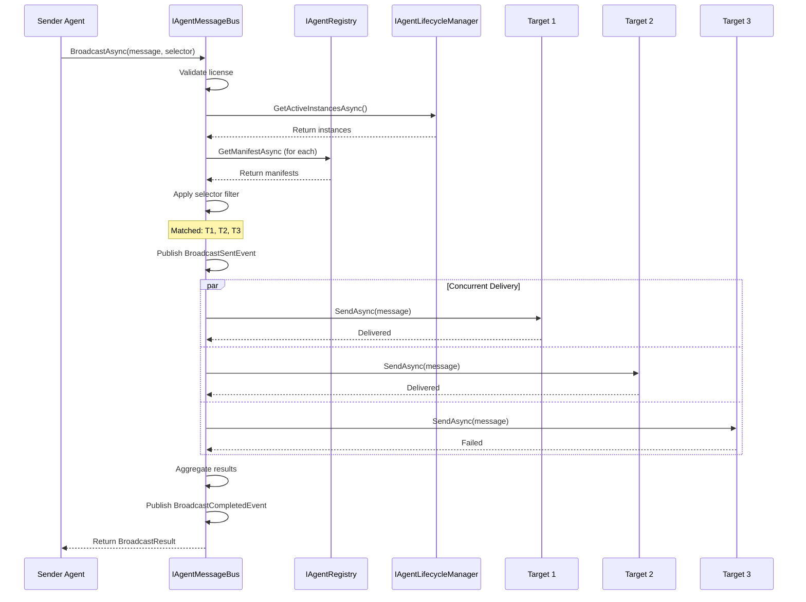

# LDS-01: Broadcast & Multicast

## 1. Metadata & Categorization

| Field | Value |
| :--- | :--- |
| **Feature ID** | `CMB-BCT-01` |
| **Feature Name** | Broadcast & Multicast |
| **Target Version** | `v0.12.3d` |
| **Module Scope** | `Lexichord.Modules.Agents` |
| **Swimlane** | Ensemble |
| **License Tier** | Teams |
| **Feature Gate Key** | `FeatureFlags.Agents.Communication.Broadcast` |
| **Author** | Agent Architecture Lead |
| **Reviewer** | Lead Architect |
| **Status** | Draft |
| **Last Updated** | 2026-02-03 |
| **Parent Spec** | [LCS-SBD-v0.12.3-AGT](./LCS-SBD-v0.12.3-AGT.md) |
| **Depends On** | [v0.12.3a (Message Bus Core)](./LCS-SBD-v0.12.3a-BUS.md), [v0.12.1d (Registry)](../v0.12.1/LCS-SBD-v0.12.1d-REG.md), [v0.12.2a (Spawner)](../v0.12.2/LCS-SBD-v0.12.2a-SPW.md) |
| **Estimated Hours** | 8 |

---

## 2. Executive Summary

### 2.1 The Requirement

Agents often need to send the same message to multiple targets without knowing their exact IDs. System-wide configuration updates, shutdown signals, and group notifications all require broadcasting to multiple agents based on criteria like role, group membership, or custom predicates.

### 2.2 The Proposed Solution

Implement broadcast and multicast communication providing:
- `BroadcastAsync` method for sending to multiple agents
- `AgentSelector` for flexible agent targeting
- Targeting by ID, group, role, capability, or custom predicate
- At-least-once delivery to each matched agent
- Fallback handling for unreachable agents
- Broadcast completion tracking

---

## 3. Architecture & Modular Strategy

### 3.1 Dependencies

**Upstream Modules:**
- `Lexichord.Modules.Agents` — `IAgentMessageBus`, `AgentMessage` (v0.12.3a)
- `Lexichord.Modules.Agents.Abstractions` — `IAgentRegistry`, `AgentManifest` (v0.12.1d)
- `Lexichord.Modules.Agents` — `IAgentLifecycleManager`, `AgentInstance` (v0.12.2a)
- `Lexichord.Modules.Security` — `IAuditLogService` (v0.11.2)
- `Lexichord.Host` — `IMediator`, `ILicenseService`

**NuGet Packages:**
- `MediatR` (event publishing)
- `Microsoft.Extensions.Logging.Abstractions` (logging)

### 3.2 Licensing Behavior

- **Load Behavior:** [x] **Soft Gate** — Teams tier required for broadcast.
- **Fallback Experience:** Core/WriterPro users get `LicenseException`. UI shows upgrade prompt.

---

## 4. Data Contract (The API)

### 4.1 Broadcast Interface Extension

```csharp
namespace Lexichord.Modules.Agents;

/// <summary>
/// Extension to IAgentMessageBus for broadcast support.
/// </summary>
public partial interface IAgentMessageBus
{
    /// <summary>
    /// Broadcasts a message to all agents matching the selector.
    /// </summary>
    /// <param name="message">The message to broadcast.</param>
    /// <param name="selector">Criteria for selecting target agents.</param>
    /// <param name="options">Broadcast options.</param>
    /// <param name="ct">Cancellation token.</param>
    /// <returns>Result with delivery status for each target.</returns>
    /// <exception cref="ArgumentNullException">Message or selector is null.</exception>
    /// <exception cref="LicenseException">Broadcast requires Teams or higher.</exception>
    /// <remarks>
    /// <para>
    /// Broadcast delivers to ALL matching agents. Use selectors to target
    /// specific groups, roles, or custom criteria.
    /// </para>
    /// <para>
    /// Delivery is at-least-once per target. Failed deliveries are recorded
    /// in the result but do not stop other deliveries.
    /// </para>
    /// </remarks>
    Task<BroadcastResult> BroadcastAsync(
        AgentMessage message,
        AgentSelector selector,
        BroadcastOptions? options = null,
        CancellationToken ct = default);

    /// <summary>
    /// Broadcasts to a named group.
    /// </summary>
    /// <param name="message">The message to broadcast.</param>
    /// <param name="groupName">Name of the agent group.</param>
    /// <param name="ct">Cancellation token.</param>
    /// <returns>Broadcast result.</returns>
    Task<BroadcastResult> BroadcastToGroupAsync(
        AgentMessage message,
        string groupName,
        CancellationToken ct = default);

    /// <summary>
    /// Broadcasts to all agents.
    /// </summary>
    /// <param name="message">The message to broadcast.</param>
    /// <param name="ct">Cancellation token.</param>
    /// <returns>Broadcast result.</returns>
    /// <remarks>
    /// Use with caution - sends to ALL active agents.
    /// </remarks>
    Task<BroadcastResult> BroadcastAllAsync(
        AgentMessage message,
        CancellationToken ct = default);
}
```

### 4.2 Agent Selector

```csharp
namespace Lexichord.Modules.Agents.Abstractions;

/// <summary>
/// Selects agents for broadcast and routing operations.
/// </summary>
/// <remarks>
/// <para>
/// Selectors define which agents should receive a broadcast message.
/// Multiple criteria can be combined (AND logic within selector,
/// OR logic with <see cref="Or"/> method).
/// </para>
/// </remarks>
public sealed record AgentSelector
{
    /// <summary>
    /// Specific agent IDs to target.
    /// </summary>
    public IReadOnlyList<AgentId>? AgentIds { get; init; }

    /// <summary>
    /// Agent group name to target.
    /// </summary>
    public string? Group { get; init; }

    /// <summary>
    /// Agent role to target.
    /// </summary>
    public string? Role { get; init; }

    /// <summary>
    /// Agent type to target.
    /// </summary>
    public AgentType? AgentType { get; init; }

    /// <summary>
    /// Required capability category.
    /// </summary>
    public CapabilityCategory? Capability { get; init; }

    /// <summary>
    /// Tags that agents must have (any match).
    /// </summary>
    public IReadOnlyList<string>? Tags { get; init; }

    /// <summary>
    /// Custom predicate for complex filtering.
    /// </summary>
    public Func<AgentInstance, bool>? CustomPredicate { get; init; }

    /// <summary>
    /// Whether to include suspended agents.
    /// </summary>
    public bool IncludeSuspended { get; init; } = false;

    /// <summary>
    /// Selects all active agents.
    /// </summary>
    public static AgentSelector All => new();

    /// <summary>
    /// Selects no agents (empty result).
    /// </summary>
    public static AgentSelector None => new() { AgentIds = [] };

    /// <summary>
    /// Selects specific agents by ID.
    /// </summary>
    public static AgentSelector ByIds(params AgentId[] agentIds) =>
        new() { AgentIds = agentIds };

    /// <summary>
    /// Selects agents in a group.
    /// </summary>
    public static AgentSelector ByGroup(string groupName) =>
        new() { Group = groupName };

    /// <summary>
    /// Selects agents with a role.
    /// </summary>
    public static AgentSelector ByRole(string role) =>
        new() { Role = role };

    /// <summary>
    /// Selects agents of a specific type.
    /// </summary>
    public static AgentSelector ByType(AgentType agentType) =>
        new() { AgentType = agentType };

    /// <summary>
    /// Selects agents with a capability.
    /// </summary>
    public static AgentSelector ByCapability(CapabilityCategory capability) =>
        new() { Capability = capability };

    /// <summary>
    /// Selects agents with specific tags.
    /// </summary>
    public static AgentSelector ByTags(params string[] tags) =>
        new() { Tags = tags };

    /// <summary>
    /// Selects agents matching a custom predicate.
    /// </summary>
    public static AgentSelector Custom(Func<AgentInstance, bool> predicate) =>
        new() { CustomPredicate = predicate };

    /// <summary>
    /// Evaluates if an agent matches this selector.
    /// </summary>
    /// <param name="instance">The agent instance to evaluate.</param>
    /// <param name="manifest">The agent's manifest.</param>
    /// <returns>True if agent matches all criteria.</returns>
    public bool Matches(AgentInstance instance, AgentManifest? manifest)
    {
        // Check state
        if (!IncludeSuspended && instance.State == AgentState.Suspended)
            return false;

        // Only target active agents
        if (instance.State == AgentState.Terminated ||
            instance.State == AgentState.Failed ||
            instance.State == AgentState.Terminating)
            return false;

        // ID filter
        if (AgentIds is not null && !AgentIds.Contains(instance.AgentId))
            return false;

        // Group filter (from tags)
        if (Group is not null && !instance.Tags.Contains($"group:{Group}"))
            return false;

        // Role filter (from tags)
        if (Role is not null && !instance.Tags.Contains($"role:{Role}"))
            return false;

        // Type filter
        if (AgentType is not null && manifest?.Type != AgentType)
            return false;

        // Capability filter
        if (Capability is not null && manifest is not null)
        {
            if (!manifest.Capabilities.Any(c => c.Category == Capability))
                return false;
        }

        // Tag filter (any match)
        if (Tags is not null && !instance.Tags.Any(t => Tags.Contains(t)))
            return false;

        // Custom predicate
        if (CustomPredicate is not null && !CustomPredicate(instance))
            return false;

        return true;
    }

    /// <summary>
    /// Combines this selector with another using OR logic.
    /// </summary>
    public AgentSelector Or(AgentSelector other) =>
        Custom(instance => Matches(instance, null) || other.Matches(instance, null));
}
```

### 4.3 Broadcast Options and Result

```csharp
namespace Lexichord.Modules.Agents.Abstractions;

/// <summary>
/// Options for broadcast operations.
/// </summary>
public sealed record BroadcastOptions
{
    /// <summary>
    /// Maximum time to wait for all deliveries.
    /// </summary>
    public TimeSpan Timeout { get; init; } = TimeSpan.FromSeconds(30);

    /// <summary>
    /// Whether to continue on individual delivery failures.
    /// </summary>
    public bool ContinueOnFailure { get; init; } = true;

    /// <summary>
    /// Maximum number of concurrent deliveries.
    /// </summary>
    public int MaxConcurrency { get; init; } = 10;

    /// <summary>
    /// Whether to wait for all deliveries to complete.
    /// </summary>
    /// <remarks>
    /// If false, method returns after queuing, not after delivery.
    /// </remarks>
    public bool WaitForCompletion { get; init; } = true;

    /// <summary>
    /// Default broadcast options.
    /// </summary>
    public static BroadcastOptions Default => new();
}

/// <summary>
/// Result of a broadcast operation.
/// </summary>
public sealed record BroadcastResult
{
    /// <summary>
    /// Whether all deliveries succeeded.
    /// </summary>
    public required bool AllSucceeded { get; init; }

    /// <summary>
    /// Total number of target agents.
    /// </summary>
    public required int TotalTargets { get; init; }

    /// <summary>
    /// Number of successful deliveries.
    /// </summary>
    public required int SuccessCount { get; init; }

    /// <summary>
    /// Number of failed deliveries.
    /// </summary>
    public required int FailureCount { get; init; }

    /// <summary>
    /// Total time for broadcast operation.
    /// </summary>
    public required TimeSpan Duration { get; init; }

    /// <summary>
    /// Details for each delivery.
    /// </summary>
    public IReadOnlyList<DeliveryDetail> Details { get; init; } = [];

    /// <summary>
    /// Summary of failures if any.
    /// </summary>
    public string? FailureSummary => FailureCount > 0
        ? $"{FailureCount} of {TotalTargets} deliveries failed"
        : null;
}

/// <summary>
/// Detail for a single delivery in a broadcast.
/// </summary>
public sealed record DeliveryDetail
{
    /// <summary>
    /// Target agent ID.
    /// </summary>
    public required AgentId TargetId { get; init; }

    /// <summary>
    /// Whether delivery succeeded.
    /// </summary>
    public required bool Success { get; init; }

    /// <summary>
    /// Error message if delivery failed.
    /// </summary>
    public string? ErrorMessage { get; init; }

    /// <summary>
    /// Delivery latency.
    /// </summary>
    public TimeSpan Latency { get; init; }
}
```

### 4.4 MediatR Events

```csharp
namespace Lexichord.Modules.Agents.Events;

/// <summary>
/// Published when a broadcast is initiated.
/// </summary>
public sealed record BroadcastSentEvent : INotification
{
    public required Guid BroadcastId { get; init; }
    public required AgentId SenderId { get; init; }
    public required int TargetCount { get; init; }
    public required string SelectorDescription { get; init; }
    public required DateTimeOffset SentAt { get; init; }
}

/// <summary>
/// Published when a broadcast completes.
/// </summary>
public sealed record BroadcastCompletedEvent : INotification
{
    public required Guid BroadcastId { get; init; }
    public required bool AllSucceeded { get; init; }
    public required int SuccessCount { get; init; }
    public required int FailureCount { get; init; }
    public required TimeSpan Duration { get; init; }
    public required DateTimeOffset CompletedAt { get; init; }
}

/// <summary>
/// Published when a broadcast delivery fails.
/// </summary>
public sealed record BroadcastDeliveryFailedEvent : INotification
{
    public required Guid BroadcastId { get; init; }
    public required AgentId TargetId { get; init; }
    public required string FailureReason { get; init; }
    public required DateTimeOffset FailedAt { get; init; }
}
```

---

## 5. Implementation Logic

### 5.1 Flow Diagram



### 5.2 Selector Resolution

```csharp
/// <summary>
/// Resolves agents matching a selector.
/// </summary>
internal sealed class SelectorResolver
{
    private readonly IAgentLifecycleManager _lifecycleManager;
    private readonly IAgentRegistry _registry;
    private readonly ILogger<SelectorResolver> _logger;

    public async Task<IReadOnlyList<AgentId>> ResolveAsync(
        AgentSelector selector,
        CancellationToken ct)
    {
        // Get all active instances
        var instances = await _lifecycleManager.GetActiveInstancesAsync(ct: ct);

        var matched = new List<AgentId>();

        foreach (var instance in instances)
        {
            // Get manifest for capability/type filtering
            var manifest = await _registry.GetManifestAsync(
                instance.AgentName, ct);

            if (selector.Matches(instance, manifest))
            {
                matched.Add(instance.AgentId);
            }
        }

        _logger.LogDebug(
            "Selector resolved to {MatchedCount} of {TotalCount} agents",
            matched.Count, instances.Count);

        return matched;
    }
}
```

---

## 6. Data Persistence (Database)

This sub-part does not introduce database tables.

---

## 7. Observability & Logging

### 7.1 Log Messages

| Level | Template |
|:------|:---------|
| Debug | `"Broadcast {BroadcastId} targeting {TargetCount} agents"` |
| Debug | `"Broadcast delivery to {TargetId} succeeded in {LatencyMs}ms"` |
| Info | `"Broadcast {BroadcastId} completed: {SuccessCount}/{TotalCount} succeeded"` |
| Warning | `"Broadcast delivery to {TargetId} failed: {ErrorMessage}"` |
| Warning | `"Selector matched 0 agents for broadcast"` |

### 7.2 Metrics

| Metric | Type | Description |
|:-------|:-----|:------------|
| `agents.broadcast.sent_total` | Counter | Total broadcasts initiated |
| `agents.broadcast.deliveries_total` | Counter | Total delivery attempts |
| `agents.broadcast.failures_total` | Counter | Failed deliveries |
| `agents.broadcast.targets` | Histogram | Targets per broadcast |
| `agents.broadcast.duration_ms` | Histogram | Broadcast duration |

---

## 8. Security & Safety

### 8.1 Broadcast Limits

- Maximum 100 targets per broadcast (configurable)
- Rate limiting: 10 broadcasts per second per agent
- Enterprise tier removes limits

### 8.2 Audit Trail

All broadcasts are logged with:
- Sender ID
- Selector criteria
- Target list
- Delivery results

---

## 9. Acceptance Criteria (QA)

1. **[Broadcast]** Message delivered to all matching agents.
2. **[Selector]** Each selector type correctly filters agents.
3. **[Failure Handling]** Failed deliveries don't stop other deliveries.
4. **[Result]** BroadcastResult accurately reports success/failure counts.
5. **[License]** Core/WriterPro users get `LicenseException`.

---

## 10. Test Scenarios

```gherkin
Scenario: Broadcast to group
  Given 3 agents in group "workers"
  And 2 agents in group "managers"
  When broadcast to group "workers"
  Then 3 agents receive the message
  And 2 agents do not

Scenario: Partial delivery failure
  Given 3 target agents
  And Agent 2 handler throws exception
  When broadcast with ContinueOnFailure=true
  Then Agents 1 and 3 receive the message
  And BroadcastResult.FailureCount = 1

Scenario: Empty selector result
  Given no agents with role "admin"
  When broadcast to role "admin"
  Then BroadcastResult.TotalTargets = 0
  And no deliveries attempted
```

---

## 11. Changelog

| Version | Date | Author | Changes |
|:--------|:-----|:-------|:--------|
| 1.0.0 | 2026-02-03 | Agent Architecture Lead | Initial specification |

---

**End of Specification**
