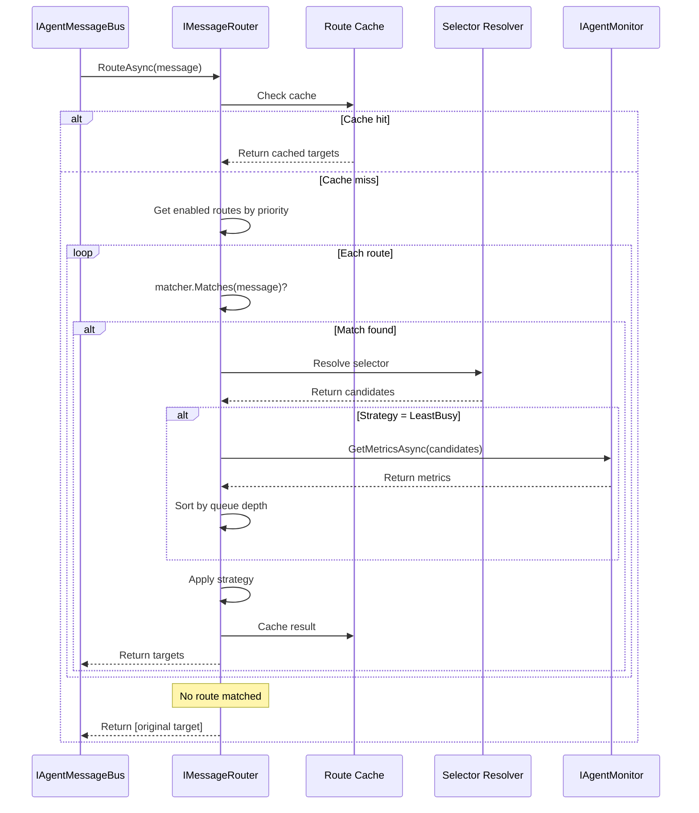

# LDS-01: Message Routing

## 1. Metadata & Categorization

| Field | Value |
| :--- | :--- |
| **Feature ID** | `CMB-RTE-01` |
| **Feature Name** | Message Routing |
| **Target Version** | `v0.12.3e` |
| **Module Scope** | `Lexichord.Modules.Agents` |
| **Swimlane** | Ensemble |
| **License Tier** | Teams |
| **Feature Gate Key** | `FeatureFlags.Agents.Communication.Routing` |
| **Author** | Agent Architecture Lead |
| **Reviewer** | Lead Architect |
| **Status** | Draft |
| **Last Updated** | 2026-02-03 |
| **Parent Spec** | [LCS-SBD-v0.12.3-AGT](./LCS-SBD-v0.12.3-AGT.md) |
| **Depends On** | [v0.12.3a (Message Bus Core)](./LCS-SBD-v0.12.3a-BUS.md), [v0.12.3d (Broadcast)](./LCS-SBD-v0.12.3d-BCT.md), [v0.12.1d (Registry)](../v0.12.1/LCS-SBD-v0.12.1d-REG.md) |
| **Estimated Hours** | 8 |

---

## 2. Executive Summary

### 2.1 The Requirement

Complex agent systems need intelligent message routing beyond direct addressing. Messages should be routed based on content, load balancing, or custom rules. The system needs configurable routing strategies that can distribute load, handle failover, and route messages to appropriate handlers without tight coupling.

### 2.2 The Proposed Solution

Implement a message routing system providing:
- `IMessageRouter` interface for routing logic
- `RouteDefinition` for configurable route rules
- Multiple `RoutingStrategy` options (First, RoundRobin, LeastBusy, Broadcast, Random)
- Dynamic route registration and unregistration
- Priority-based route evaluation
- Load-aware routing with agent metrics integration

---

## 3. Architecture & Modular Strategy

### 3.1 Dependencies

**Upstream Modules:**
- `Lexichord.Modules.Agents` — `IAgentMessageBus`, `AgentMessage` (v0.12.3a)
- `Lexichord.Modules.Agents.Abstractions` — `AgentSelector` (v0.12.3d)
- `Lexichord.Modules.Agents.Abstractions` — `IAgentRegistry` (v0.12.1d)
- `Lexichord.Modules.Agents` — `IAgentMonitor`, `AgentMetrics` (v0.12.2b)
- `Lexichord.Modules.Security` — `IAuditLogService` (v0.11.2)
- `Lexichord.Host` — `IMediator`, `ILicenseService`

**NuGet Packages:**
- `MediatR` (event publishing)
- `Microsoft.Extensions.Logging.Abstractions` (logging)

### 3.2 Licensing Behavior

- **Load Behavior:** [x] **Soft Gate** — Teams tier required for custom routing.
- **Fallback Experience:** Core/WriterPro use default direct routing only.

---

## 4. Data Contract (The API)

### 4.1 Message Router Interface

```csharp
namespace Lexichord.Modules.Agents;

/// <summary>
/// Routes messages to appropriate target agents based on configured rules.
/// </summary>
/// <remarks>
/// <para>
/// The router intercepts messages and determines the actual target(s)
/// based on registered routes. This enables load balancing, failover,
/// and content-based routing.
/// </para>
/// <para>
/// Routes are evaluated in priority order (highest first). The first
/// matching route determines the routing strategy.
/// </para>
/// </remarks>
public interface IMessageRouter
{
    /// <summary>
    /// Routes a message to target agent(s).
    /// </summary>
    /// <param name="message">The message to route.</param>
    /// <param name="ct">Cancellation token.</param>
    /// <returns>List of target agent IDs to deliver to.</returns>
    /// <remarks>
    /// Returns original target if no matching route is found.
    /// </remarks>
    Task<IReadOnlyList<AgentId>> RouteAsync(
        AgentMessage message,
        CancellationToken ct = default);

    /// <summary>
    /// Registers a new route definition.
    /// </summary>
    /// <param name="route">The route to register.</param>
    /// <param name="ct">Cancellation token.</param>
    /// <exception cref="ArgumentNullException">Route is null.</exception>
    /// <exception cref="DuplicateRouteException">Route name already exists.</exception>
    /// <exception cref="LicenseException">Custom routing requires Teams or higher.</exception>
    Task RegisterRouteAsync(
        RouteDefinition route,
        CancellationToken ct = default);

    /// <summary>
    /// Unregisters a route by name.
    /// </summary>
    /// <param name="routeName">Name of the route to remove.</param>
    /// <param name="ct">Cancellation token.</param>
    /// <returns>True if route was found and removed.</returns>
    Task<bool> UnregisterRouteAsync(
        string routeName,
        CancellationToken ct = default);

    /// <summary>
    /// Updates an existing route.
    /// </summary>
    /// <param name="route">The updated route definition.</param>
    /// <param name="ct">Cancellation token.</param>
    /// <exception cref="RouteNotFoundException">Route not found.</exception>
    Task UpdateRouteAsync(
        RouteDefinition route,
        CancellationToken ct = default);

    /// <summary>
    /// Gets all registered routes.
    /// </summary>
    /// <param name="ct">Cancellation token.</param>
    /// <returns>List of route definitions.</returns>
    Task<IReadOnlyList<RouteDefinition>> GetRoutesAsync(
        CancellationToken ct = default);

    /// <summary>
    /// Gets a specific route by name.
    /// </summary>
    /// <param name="routeName">Name of the route.</param>
    /// <param name="ct">Cancellation token.</param>
    /// <returns>Route definition, or null if not found.</returns>
    Task<RouteDefinition?> GetRouteAsync(
        string routeName,
        CancellationToken ct = default);

    /// <summary>
    /// Enables or disables a route.
    /// </summary>
    /// <param name="routeName">Name of the route.</param>
    /// <param name="enabled">Whether to enable the route.</param>
    /// <param name="ct">Cancellation token.</param>
    Task SetRouteEnabledAsync(
        string routeName,
        bool enabled,
        CancellationToken ct = default);

    /// <summary>
    /// Gets routing statistics.
    /// </summary>
    /// <param name="ct">Cancellation token.</param>
    /// <returns>Router statistics.</returns>
    Task<RouterStatistics> GetStatisticsAsync(
        CancellationToken ct = default);
}
```

### 4.2 Route Definition

```csharp
namespace Lexichord.Modules.Agents.Abstractions;

/// <summary>
/// Defines a message routing rule.
/// </summary>
/// <remarks>
/// <para>
/// Routes match messages based on various criteria and determine
/// how the message should be delivered (to which agents, using which strategy).
/// </para>
/// </remarks>
public sealed record RouteDefinition
{
    /// <summary>
    /// Unique name for this route.
    /// </summary>
    public required string Name { get; init; }

    /// <summary>
    /// Human-readable description.
    /// </summary>
    public string? Description { get; init; }

    /// <summary>
    /// Selector defining which agents can receive routed messages.
    /// </summary>
    public required AgentSelector Selector { get; init; }

    /// <summary>
    /// Matcher defining which messages this route applies to.
    /// </summary>
    public required MessageMatcher Matcher { get; init; }

    /// <summary>
    /// Strategy for selecting among multiple matching agents.
    /// </summary>
    public RoutingStrategy Strategy { get; init; } = RoutingStrategy.First;

    /// <summary>
    /// Priority for route evaluation (higher = evaluated first).
    /// </summary>
    /// <remarks>
    /// Range: 0-1000. System routes use 900+. User routes should use 0-100.
    /// </remarks>
    public int Priority { get; init; } = 0;

    /// <summary>
    /// Whether this route is enabled.
    /// </summary>
    public bool IsEnabled { get; init; } = true;

    /// <summary>
    /// Maximum number of targets for Broadcast strategy.
    /// </summary>
    public int? MaxTargets { get; init; }

    /// <summary>
    /// Optional timeout override for this route.
    /// </summary>
    public TimeSpan? Timeout { get; init; }

    /// <summary>
    /// Tags for categorization and filtering.
    /// </summary>
    public IReadOnlyList<string> Tags { get; init; } = [];

    /// <summary>
    /// When this route was created.
    /// </summary>
    public DateTimeOffset CreatedAt { get; init; } = DateTimeOffset.UtcNow;

    /// <summary>
    /// When this route was last updated.
    /// </summary>
    public DateTimeOffset UpdatedAt { get; init; } = DateTimeOffset.UtcNow;
}
```

### 4.3 Message Matcher

```csharp
namespace Lexichord.Modules.Agents.Abstractions;

/// <summary>
/// Defines criteria for matching messages to routes.
/// </summary>
public sealed record MessageMatcher
{
    /// <summary>
    /// Message types to match.
    /// </summary>
    public IReadOnlyList<MessageType>? MessageTypes { get; init; }

    /// <summary>
    /// Sender agent IDs to match.
    /// </summary>
    public IReadOnlyList<AgentId>? SenderIds { get; init; }

    /// <summary>
    /// Target patterns to match (supports wildcards).
    /// </summary>
    /// <remarks>
    /// E.g., "worker-*" matches "worker-1", "worker-2", etc.
    /// </remarks>
    public string? TargetPattern { get; init; }

    /// <summary>
    /// Required headers for match.
    /// </summary>
    public IReadOnlyDictionary<string, string>? RequiredHeaders { get; init; }

    /// <summary>
    /// Priority levels to match.
    /// </summary>
    public IReadOnlyList<MessagePriority>? Priorities { get; init; }

    /// <summary>
    /// Custom predicate for complex matching.
    /// </summary>
    public Func<AgentMessage, bool>? CustomPredicate { get; init; }

    /// <summary>
    /// Creates a matcher that matches all messages.
    /// </summary>
    public static MessageMatcher All => new();

    /// <summary>
    /// Creates a matcher for specific message types.
    /// </summary>
    public static MessageMatcher ForTypes(params MessageType[] types) =>
        new() { MessageTypes = types };

    /// <summary>
    /// Creates a matcher for specific senders.
    /// </summary>
    public static MessageMatcher FromSenders(params AgentId[] senderIds) =>
        new() { SenderIds = senderIds };

    /// <summary>
    /// Evaluates if a message matches this matcher.
    /// </summary>
    public bool Matches(AgentMessage message)
    {
        // Message type filter
        if (MessageTypes is not null && !MessageTypes.Contains(message.Type))
            return false;

        // Sender filter
        if (SenderIds is not null && !SenderIds.Contains(message.SenderId))
            return false;

        // Target pattern
        if (TargetPattern is not null)
        {
            var targetStr = message.TargetId.ToString();
            if (!MatchesPattern(targetStr, TargetPattern))
                return false;
        }

        // Required headers
        if (RequiredHeaders is not null)
        {
            foreach (var (key, value) in RequiredHeaders)
            {
                if (!message.Headers.TryGetValue(key, out var headerValue) ||
                    headerValue != value)
                    return false;
            }
        }

        // Priority filter
        if (Priorities is not null && !Priorities.Contains(message.Priority))
            return false;

        // Custom predicate
        if (CustomPredicate is not null && !CustomPredicate(message))
            return false;

        return true;
    }

    private static bool MatchesPattern(string input, string pattern)
    {
        // Simple wildcard matching (* matches any characters)
        var regex = "^" + Regex.Escape(pattern).Replace("\\*", ".*") + "$";
        return Regex.IsMatch(input, regex);
    }
}
```

### 4.4 Routing Strategy

```csharp
namespace Lexichord.Modules.Agents.Abstractions;

/// <summary>
/// Strategy for selecting target agent(s) from matching candidates.
/// </summary>
public enum RoutingStrategy
{
    /// <summary>
    /// Route to the first matching agent.
    /// </summary>
    /// <remarks>
    /// Deterministic: always routes to the same agent if available.
    /// Good for sticky routing.
    /// </remarks>
    First = 0,

    /// <summary>
    /// Route to agents in round-robin order.
    /// </summary>
    /// <remarks>
    /// Distributes load evenly across all matching agents.
    /// State maintained per route.
    /// </remarks>
    RoundRobin = 1,

    /// <summary>
    /// Route to the agent with least active messages.
    /// </summary>
    /// <remarks>
    /// Requires integration with IAgentMonitor for metrics.
    /// Best for load balancing with variable processing times.
    /// </remarks>
    LeastBusy = 2,

    /// <summary>
    /// Route to all matching agents (broadcast).
    /// </summary>
    /// <remarks>
    /// Message delivered to ALL matching agents.
    /// Use MaxTargets to limit recipients.
    /// </remarks>
    Broadcast = 3,

    /// <summary>
    /// Route to a random matching agent.
    /// </summary>
    /// <remarks>
    /// Non-deterministic distribution.
    /// Good for simple load distribution.
    /// </remarks>
    Random = 4,

    /// <summary>
    /// Route based on message hash (consistent hashing).
    /// </summary>
    /// <remarks>
    /// Same message always routes to same agent.
    /// Enterprise tier only.
    /// </remarks>
    ConsistentHash = 5,

    /// <summary>
    /// Route based on agent priority/weight.
    /// </summary>
    /// <remarks>
    /// Weighted random selection.
    /// Enterprise tier only.
    /// </remarks>
    Weighted = 6
}
```

### 4.5 Router Statistics

```csharp
namespace Lexichord.Modules.Agents.Abstractions;

/// <summary>
/// Statistics about router operation.
/// </summary>
public sealed record RouterStatistics
{
    /// <summary>
    /// Total messages routed.
    /// </summary>
    public long TotalMessagesRouted { get; init; }

    /// <summary>
    /// Messages routed per route.
    /// </summary>
    public IReadOnlyDictionary<string, long> MessagesPerRoute { get; init; } =
        new Dictionary<string, long>();

    /// <summary>
    /// Total registered routes.
    /// </summary>
    public int TotalRoutes { get; init; }

    /// <summary>
    /// Active (enabled) routes.
    /// </summary>
    public int ActiveRoutes { get; init; }

    /// <summary>
    /// Average route evaluation time.
    /// </summary>
    public double AverageEvaluationTimeMs { get; init; }

    /// <summary>
    /// Cache hit rate for route matching.
    /// </summary>
    public double CacheHitRate { get; init; }
}
```

### 4.6 MediatR Events

```csharp
namespace Lexichord.Modules.Agents.Events;

/// <summary>
/// Published when a route is registered.
/// </summary>
public sealed record RouteRegisteredEvent : INotification
{
    public required string RouteName { get; init; }
    public required RoutingStrategy Strategy { get; init; }
    public required int Priority { get; init; }
    public required DateTimeOffset RegisteredAt { get; init; }
}

/// <summary>
/// Published when a route is unregistered.
/// </summary>
public sealed record RouteUnregisteredEvent : INotification
{
    public required string RouteName { get; init; }
    public required long MessagesRouted { get; init; }
    public required DateTimeOffset UnregisteredAt { get; init; }
}

/// <summary>
/// Published when a message is routed.
/// </summary>
public sealed record MessageRoutedEvent : INotification
{
    public required MessageId MessageId { get; init; }
    public required string RouteName { get; init; }
    public required RoutingStrategy Strategy { get; init; }
    public required int TargetCount { get; init; }
    public required TimeSpan EvaluationTime { get; init; }
}
```

---

## 5. Implementation Logic

### 5.1 Flow Diagram



### 5.2 Strategy Implementations

```csharp
internal static class RoutingStrategies
{
    public static IReadOnlyList<AgentId> Apply(
        RoutingStrategy strategy,
        IReadOnlyList<AgentId> candidates,
        AgentMessage message,
        RouteState state,
        IAgentMonitor? monitor)
    {
        if (candidates.Count == 0)
            return [];

        return strategy switch
        {
            RoutingStrategy.First => [candidates[0]],

            RoutingStrategy.RoundRobin =>
                [candidates[state.IncrementAndGet() % candidates.Count]],

            RoutingStrategy.LeastBusy => SelectLeastBusy(candidates, monitor),

            RoutingStrategy.Broadcast => candidates,

            RoutingStrategy.Random =>
                [candidates[Random.Shared.Next(candidates.Count)]],

            RoutingStrategy.ConsistentHash =>
                [SelectByHash(candidates, message)],

            _ => [candidates[0]]
        };
    }

    private static IReadOnlyList<AgentId> SelectLeastBusy(
        IReadOnlyList<AgentId> candidates,
        IAgentMonitor? monitor)
    {
        if (monitor is null)
            return [candidates[0]];

        // Get metrics for all candidates
        var metrics = candidates
            .Select(async id => (Id: id, Metrics: await monitor.GetMetricsAsync(id)))
            .Select(t => t.Result)
            .Where(t => t.Metrics is not null)
            .OrderBy(t => t.Metrics!.ActiveRequests)
            .ToList();

        return metrics.Count > 0 ? [metrics[0].Id] : [candidates[0]];
    }

    private static AgentId SelectByHash(
        IReadOnlyList<AgentId> candidates,
        AgentMessage message)
    {
        // Consistent hash based on message correlation
        var hash = message.EffectiveCorrelationId.Value.GetHashCode();
        var index = Math.Abs(hash) % candidates.Count;
        return candidates[index];
    }
}
```

---

## 6. Data Persistence (Database)

### 6.1 Migration

**Migration ID:** `Migration_20260203_001_CreateMessageBusRoutes`

```csharp
[Migration(20260203001)]
public class CreateMessageBusRoutes : Migration
{
    public override void Up()
    {
        Create.Table("message_bus_routes")
            .InSchema("agents")
            .WithColumn("id").AsGuid().PrimaryKey()
            .WithColumn("name").AsString(128).NotNullable().Unique()
            .WithColumn("description").AsString(512).Nullable()
            .WithColumn("selector_json").AsString(4096).NotNullable()
            .WithColumn("matcher_json").AsString(4096).NotNullable()
            .WithColumn("strategy").AsInt32().NotNullable()
            .WithColumn("priority").AsInt32().NotNullable().WithDefaultValue(0)
            .WithColumn("is_enabled").AsBoolean().NotNullable().WithDefaultValue(true)
            .WithColumn("max_targets").AsInt32().Nullable()
            .WithColumn("timeout_ms").AsInt32().Nullable()
            .WithColumn("tags").AsString(1024).Nullable()
            .WithColumn("messages_routed").AsInt64().NotNullable().WithDefaultValue(0)
            .WithColumn("created_at").AsDateTimeOffset().NotNullable()
            .WithColumn("updated_at").AsDateTimeOffset().NotNullable();

        Create.Index("ix_routes_priority")
            .OnTable("message_bus_routes").InSchema("agents")
            .OnColumn("priority").Descending()
            .OnColumn("is_enabled").Ascending();
    }

    public override void Down()
    {
        Delete.Table("message_bus_routes").InSchema("agents");
    }
}
```

---

## 7. Observability & Logging

### 7.1 Log Messages

| Level | Template |
|:------|:---------|
| Debug | `"Evaluating {RouteCount} routes for message {MessageId}"` |
| Debug | `"Route {RouteName} matched, strategy: {Strategy}, targets: {TargetCount}"` |
| Info | `"Route {RouteName} registered with priority {Priority}"` |
| Warning | `"No routes matched for message {MessageId}, using direct routing"` |
| Warning | `"Route {RouteName} selector resolved to 0 candidates"` |

### 7.2 Metrics

| Metric | Type | Description |
|:-------|:-----|:------------|
| `agents.router.evaluations_total` | Counter | Total route evaluations |
| `agents.router.matches_total` | Counter (labeled by route) | Route match counts |
| `agents.router.evaluation_ms` | Histogram | Route evaluation time |
| `agents.router.cache_hits` | Counter | Route cache hits |
| `agents.router.active_routes` | Gauge | Currently enabled routes |

---

## 8. Security & Safety

### 8.1 Route Validation

- Route names must be unique
- Selectors validated to prevent matching all agents accidentally
- Custom predicates sandboxed (timeout after 100ms)

---

## 9. Acceptance Criteria (QA)

1. **[Route Registration]** Routes can be registered and unregistered.
2. **[Route Matching]** Messages routed to matching routes in priority order.
3. **[Strategies]** Each routing strategy correctly selects targets.
4. **[Persistence]** Routes survive application restart.
5. **[License]** Core/WriterPro users cannot create custom routes.

---

## 10. Test Scenarios

```gherkin
Scenario: Round-robin routing
  Given route "workers" with RoundRobin strategy
  And 3 agents matching selector
  When 6 messages are sent
  Then each agent receives exactly 2 messages

Scenario: LeastBusy routing
  Given route "workers" with LeastBusy strategy
  And Agent A has 5 active requests
  And Agent B has 2 active requests
  When message is sent
  Then Agent B receives the message

Scenario: Route priority
  Given route "high" with priority 100 and strategy First
  And route "low" with priority 50 and strategy RoundRobin
  When message matches both routes
  Then "high" route is used (First strategy)
```

---

## 11. Changelog

| Version | Date | Author | Changes |
|:--------|:-----|:-------|:--------|
| 1.0.0 | 2026-02-03 | Agent Architecture Lead | Initial specification |

---

**End of Specification**
