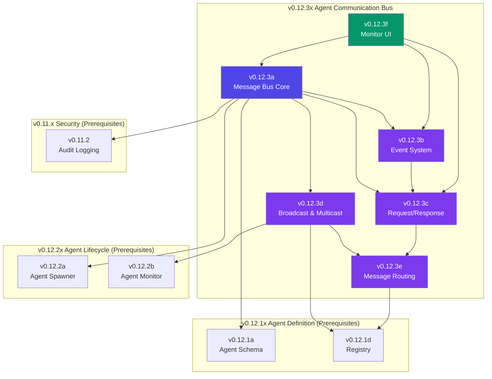

# v0.12.3x Sub-Part Index — Agent Communication Bus

## Document Control

| Field            | Value                                                        |
| :--------------- | :----------------------------------------------------------- |
| **Document ID**  | LCS-SBD-v0.12.3x-INDEX                                       |
| **Version**      | v0.12.3                                                      |
| **Codename**     | Agent Communication Bus Sub-Part Index                       |
| **Status**       | Draft                                                        |
| **Last Updated** | 2026-02-03                                                   |
| **Owner**        | Agent Architecture Lead                                      |
| **Parent Spec**  | [LCS-SBD-v0.12.3-AGT](./LCS-SBD-v0.12.3-AGT.md)              |

---

## 1. Overview

This document serves as the master index for all v0.12.3x sub-part specifications implementing the **Agent Communication Bus** system. The Communication Bus provides comprehensive messaging infrastructure for inter-agent communication, including direct messaging, pub/sub events, request/response patterns, broadcast capabilities, and intelligent message routing.

### 1.1 Design Philosophy

The Communication Bus follows these core principles:

1. **Pattern Flexibility:** Support multiple communication patterns (fire-and-forget, request/response, pub/sub, broadcast)
2. **Low Latency:** <50ms P95 for direct messaging, optimized in-memory queue implementation
3. **Reliability:** At-least-once delivery for events, exactly-once for request/response
4. **Observable:** Full message tracing with correlation and causation chains
5. **Scalable:** Support for topic-based routing and intelligent load distribution
6. **License-Tiered:** Progressive feature enablement from Core to Enterprise

---

## 2. Sub-Part Registry

| Sub-Part | Document | Feature ID | Title | Est. Hours | Status |
|:---------|:---------|:-----------|:------|:-----------|:-------|
| v0.12.3a | [LCS-SBD-v0.12.3a-BUS](./LCS-SBD-v0.12.3a-BUS.md) | `CMB-BUS-01` | Message Bus Core | 10 | Draft |
| v0.12.3b | [LCS-SBD-v0.12.3b-EVT](./LCS-SBD-v0.12.3b-EVT.md) | `CMB-EVT-01` | Event System | 8 | Draft |
| v0.12.3c | [LCS-SBD-v0.12.3c-RRQ](./LCS-SBD-v0.12.3c-RRQ.md) | `CMB-RRQ-01` | Request/Response | 10 | Draft |
| v0.12.3d | [LCS-SBD-v0.12.3d-BCT](./LCS-SBD-v0.12.3d-BCT.md) | `CMB-BCT-01` | Broadcast & Multicast | 8 | Draft |
| v0.12.3e | [LCS-SBD-v0.12.3e-RTE](./LCS-SBD-v0.12.3e-RTE.md) | `CMB-RTE-01` | Message Routing | 8 | Draft |
| v0.12.3f | [LCS-SBD-v0.12.3f-UI](./LCS-SBD-v0.12.3f-UI.md) | `CMB-UI-01` | Communication Monitor UI | 6 | Draft |
| **Total** | | | | **50 hours** | |

---

## 3. Feature Gate Keys

| Sub-Part | Feature Gate Key | License Tier |
|:---------|:-----------------|:-------------|
| v0.12.3a | `FeatureFlags.Agents.Communication.MessageBus` | Core |
| v0.12.3b | `FeatureFlags.Agents.Communication.Events` | WriterPro |
| v0.12.3c | `FeatureFlags.Agents.Communication.RequestResponse` | Teams |
| v0.12.3d | `FeatureFlags.Agents.Communication.Broadcast` | Teams |
| v0.12.3e | `FeatureFlags.Agents.Communication.Routing` | Teams |
| v0.12.3f | `FeatureFlags.Agents.Communication.Monitor` | WriterPro |

### Communication Capabilities by Tier

| Tier | Messaging | Pub/Sub | Request/Response | Broadcast | Routing | Monitor |
|:-----|:----------|:--------|:-----------------|:----------|:--------|:--------|
| **Core** | Direct only | - | - | - | - | - |
| **WriterPro** | Direct | 5 topics max | - | - | - | Basic |
| **Teams** | Direct | Unlimited | Yes | Yes | Yes | Advanced |
| **Enterprise** | Direct | Unlimited | Yes + Saga | Yes | Custom strategies | Full |

---

## 4. Dependency Graph



---

## 5. Implementation Order

The sub-parts MUST be implemented in this order due to dependencies:

```
Phase 1: Foundation
├── v0.12.3a (Message Bus Core) ──────────────────────── 10 hours
│   └── Provides: IAgentMessageBus, AgentMessage, MessageId, MessagePriority
│
Phase 2: Communication Patterns
├── v0.12.3b (Event System) ──────────────────────────── 8 hours
│   └── Provides: AgentEvent, AgentEventFilter, PublishAsync, SubscribeAsync
│   └── Requires: v0.12.3a
│
├── v0.12.3c (Request/Response) ──────────────────────── 10 hours
│   └── Provides: RequestAsync, response correlation, timeout handling
│   └── Requires: v0.12.3a, v0.12.3b
│
Phase 3: Advanced Messaging
├── v0.12.3d (Broadcast & Multicast) ─────────────────── 8 hours
│   └── Provides: BroadcastAsync, AgentSelector
│   └── Requires: v0.12.3a, v0.12.2a, v0.12.1d
│
├── v0.12.3e (Message Routing) ───────────────────────── 8 hours
│   └── Provides: IMessageRouter, RouteDefinition, RoutingStrategy
│   └── Requires: v0.12.3a, v0.12.3d, v0.12.1d
│
Phase 4: Observability
└── v0.12.3f (Communication Monitor UI) ──────────────── 6 hours
    └── Provides: Message tracing UI, communication visualization
    └── Requires: v0.12.3a, v0.12.3b, v0.12.3c
```

---

## 6. Interface Summary

### 6.1 Core Interfaces (v0.12.3a)

| Interface | Module | Purpose |
|:----------|:-------|:--------|
| `IAgentMessageBus` | `Lexichord.Modules.Agents.Core` | Central message bus for all inter-agent communication |

### 6.2 Records & Enums

| Type | Sub-Part | Module | Purpose |
|:-----|:---------|:-------|:--------|
| `AgentMessage` | v0.12.3a | Abstractions | Message sent between agents |
| `MessageId` | v0.12.3a | Abstractions | Unique message identifier |
| `MessageType` | v0.12.3a | Abstractions | Message/Request/Response/Event |
| `MessagePriority` | v0.12.3a | Abstractions | Low/Normal/High/Critical |
| `AgentEvent` | v0.12.3b | Abstractions | Event published to topic |
| `AgentEventFilter` | v0.12.3b | Abstractions | Event subscription filter |
| `Subscription` | v0.12.3b | Abstractions | Active event subscription |
| `RequestOptions` | v0.12.3c | Abstractions | Request timeout and retry config |
| `AgentSelector` | v0.12.3d | Abstractions | Target agent selector |
| `IMessageRouter` | v0.12.3e | Core | Message routing logic |
| `RouteDefinition` | v0.12.3e | Abstractions | Route configuration |
| `RoutingStrategy` | v0.12.3e | Abstractions | First/RoundRobin/LeastBusy/Broadcast/Random |

---

## 7. Database Schema Overview

### 7.1 Tables Introduced

| Table | Sub-Part | Purpose |
|:------|:---------|:--------|
| `message_bus_routes` | v0.12.3e | Persisted route definitions |
| `message_bus_subscriptions` | v0.12.3b | Active subscriptions (for recovery) |
| `message_traces` | v0.12.3f | Message trace history (Enterprise) |

### 7.2 Migration Sequence

```
Migration_20260203_001_CreateMessageBusRoutes      (v0.12.3e)
Migration_20260203_002_CreateMessageBusSubscriptions (v0.12.3b)
Migration_20260203_003_CreateMessageTraces          (v0.12.3f)
```

---

## 8. MediatR Events

| Event | Sub-Part | Published When |
|:------|:---------|:---------------|
| `MessageSentEvent` | v0.12.3a | Message sent via SendAsync |
| `MessageDeliveredEvent` | v0.12.3a | Message delivered to target |
| `MessageFailedEvent` | v0.12.3a | Message delivery failed |
| `EventPublishedEvent` | v0.12.3b | Event published to topic |
| `SubscriptionCreatedEvent` | v0.12.3b | New subscription registered |
| `SubscriptionRemovedEvent` | v0.12.3b | Subscription disposed |
| `RequestSentEvent` | v0.12.3c | Request sent via RequestAsync |
| `ResponseReceivedEvent` | v0.12.3c | Response received for request |
| `RequestTimedOutEvent` | v0.12.3c | Request exceeded timeout |
| `BroadcastSentEvent` | v0.12.3d | Broadcast initiated |
| `BroadcastCompletedEvent` | v0.12.3d | Broadcast delivered to all targets |
| `RouteRegisteredEvent` | v0.12.3e | New route registered |
| `RouteUnregisteredEvent` | v0.12.3e | Route removed |

---

## 9. Performance Targets

| Metric | Target | Sub-Part |
|:-------|:-------|:---------|
| Direct message latency | <50ms P95 | v0.12.3a |
| Event publish latency | <20ms P95 | v0.12.3b |
| Request/response latency | <100ms P95 | v0.12.3c |
| Broadcast latency (max recipient) | <100ms P95 | v0.12.3d |
| Route lookup | <10ms P95 | v0.12.3e |
| Queue throughput | >10k msg/s | v0.12.3a |

---

## 10. Testing Requirements

### 10.1 Unit Test Coverage

| Sub-Part | Minimum Coverage | Key Test Areas |
|:---------|:-----------------|:---------------|
| v0.12.3a | 90% | Message queuing, priority ordering, TTL |
| v0.12.3b | 85% | Event filtering, subscription lifecycle |
| v0.12.3c | 90% | Timeout handling, correlation, retries |
| v0.12.3d | 85% | Selector resolution, broadcast delivery |
| v0.12.3e | 85% | Route matching, strategy algorithms |
| v0.12.3f | 75% | ViewModel logic, trace aggregation |

### 10.2 Integration Test Scenarios

1. **Full message lifecycle:** Send → Route → Deliver → ACK
2. **Pub/Sub with multiple subscribers:** Publish → Filter → Deliver to all
3. **Request/Response with timeout:** Request → Wait → Response or Timeout
4. **Broadcast to agent group:** Select → Broadcast → Verify all received
5. **Route-based delivery:** Register route → Send → Verify routing strategy

---

## 11. Cross-References

### 11.1 Upstream Dependencies

| Dependency | Version | Usage |
|:-----------|:--------|:------|
| `IAgent` | v0.12.1a | Agent identity for message addressing |
| `AgentId` | v0.12.1a | Message sender/target identification |
| `IAgentRegistry` | v0.12.1d | Agent lookup for broadcast/routing |
| `IAgentLifecycleManager` | v0.12.2a | Agent status for routing decisions |
| `AgentInstance` | v0.12.2a | Active agent information |
| `IAuditLogService` | v0.11.2 | Security audit trail |

### 11.2 Downstream Consumers

| Consumer | Version | Usage |
|:---------|:--------|:------|
| Agent Memory | v0.12.4 | Memory sharing via messages |
| Agent Tools | v0.12.5 | Tool invocation via request/response |
| Orchestration | v0.13.x | Multi-agent coordination |

---

## 12. Changelog

| Date | Version | Changes |
|:-----|:--------|:--------|
| 2026-02-03 | 1.0.0 | Initial sub-part index creation |

---

**End of Index Document**
