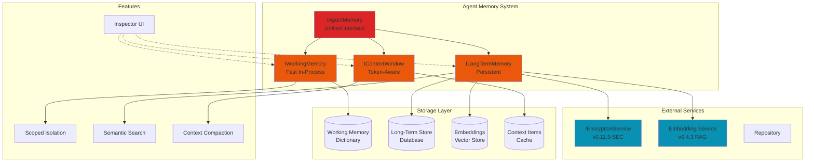
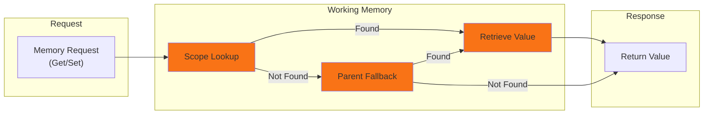
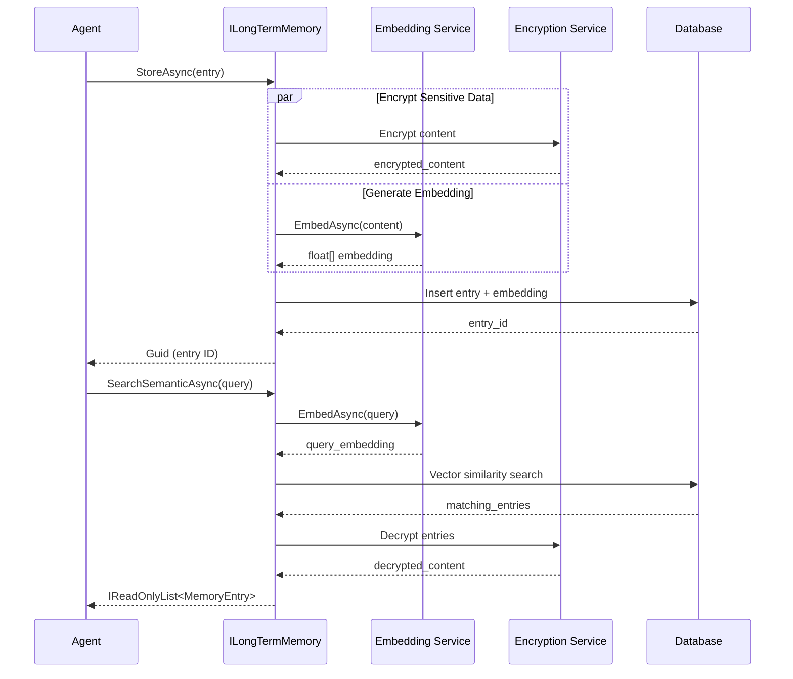
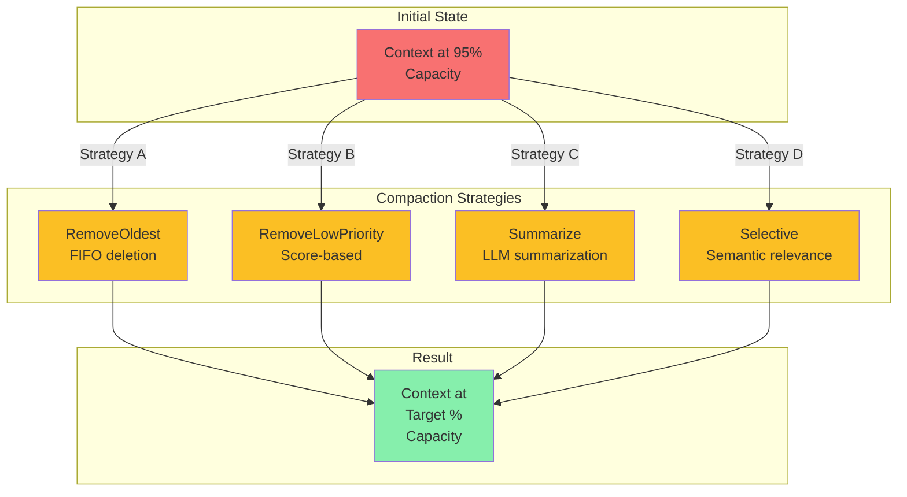

# LCS-SBD-v0.12.4-AGT: Scope Overview — Agent Memory & Context

## Document Control

| Field            | Value                                                        |
| :--------------- | :----------------------------------------------------------- |
| **Document ID**  | LCS-SBD-v0.12.4-AGT                                          |
| **Version**      | v0.12.4                                                      |
| **Codename**     | Agent Memory & Context (Agent Development Phase 4)           |
| **Status**       | Draft                                                        |
| **Last Updated** | 2026-01-31                                                   |
| **Owner**        | Agent Architecture Lead                                      |
| **Depends On**   | v0.12.1-AGT (Agent Definition), v0.4.3 (RAG Service), v0.11.3-SEC (Encryption) |

---

## 1. Executive Summary

### 1.1 The Vision

**v0.12.4-AGT** delivers **Agent Memory & Context** — a comprehensive memory system enabling agents to maintain state across conversations, retrieve relevant information, and manage token-efficient context windows. This ensures:

- Agents can maintain working and long-term memory across interactions
- Efficient context window management with intelligent compaction strategies
- Semantic memory retrieval for intelligent decision-making
- Sensitive memory encryption and controlled persistence
- Real-time memory inspection and debugging capabilities

### 1.2 Business Value

- **Context Efficiency:** Maximize agent reasoning within token limits through smart context management
- **Continuity:** Persistent memory enables coherent multi-turn conversations and learning
- **Intelligence:** Semantic search and retrieval support informed agent decisions
- **Compliance:** Encrypted storage of sensitive information with retention policies
- **Debugging:** Memory inspector UI enables developers to understand agent reasoning
- **Scalability:** License-tiered memory storage supports teams and enterprises

### 1.3 Success Criteria

1. Working memory with scoped isolation for concurrent conversations
2. Long-term memory with semantic search and retention policies
3. Context window manager with multiple compaction strategies
4. Memory retrieval achieving >90% semantic relevance on common queries
5. Sub-100ms retrieval latency (P95) for working memory operations
6. Encrypted storage of sensitive memory entries
7. Admin UI for memory inspection and management
8. License-gated storage limits (100MB WriterPro, 1GB Teams, Unlimited Enterprise)

---

## 2. Key Deliverables

### 2.1 Sub-Parts

| Sub-Part | Title | Description | Est. Hours |
|:---------|:------|:------------|:-----------|
| v0.12.4a | Working Memory | In-process memory for active conversation state | 10 |
| v0.12.4b | Long-Term Memory | Persistent semantic memory with embeddings | 10 |
| v0.12.4c | Context Window Manager | Token-aware context composition and optimization | 10 |
| v0.12.4d | Memory Retrieval | Semantic search and relevant memory extraction | 8 |
| v0.12.4e | Memory Persistence | Encrypted storage and retention policies | 6 |
| v0.12.4f | Memory Inspector UI | Admin interface for memory visualization | 4 |
| **Total** | | | **48 hours** |

---

## 3. Key Interfaces

### 3.1 IAgentMemory (Primary Agent Memory Interface)

```csharp
/// <summary>
/// Unified agent memory system managing working, long-term, and context memory.
/// </summary>
public interface IAgentMemory
{
    /// <summary>
    /// Gets the working memory system for active conversation state.
    /// </summary>
    IWorkingMemory WorkingMemory { get; }

    /// <summary>
    /// Gets the long-term memory system for persistent knowledge.
    /// </summary>
    ILongTermMemory LongTermMemory { get; }

    /// <summary>
    /// Gets the context window manager for token-aware composition.
    /// </summary>
    IContextWindow ContextWindow { get; }

    /// <summary>
    /// Creates a snapshot of all memory systems for persistence.
    /// </summary>
    Task<MemorySnapshot> SnapshotAsync(
        CancellationToken ct = default);

    /// <summary>
    /// Restores agent memory from a previous snapshot.
    /// </summary>
    Task RestoreAsync(
        MemorySnapshot snapshot,
        CancellationToken ct = default);

    /// <summary>
    /// Clears all memory systems (working, long-term, and context).
    /// </summary>
    Task ClearAsync(
        MemoryClearOptions? options = null,
        CancellationToken ct = default);
}

public record MemorySnapshot
{
    public Guid AgentId { get; init; }
    public DateTimeOffset CreatedAt { get; init; }
    public IReadOnlyList<MemoryEntry> WorkingMemoryEntries { get; init; } = [];
    public IReadOnlyList<MemoryEntry> LongTermMemoryEntries { get; init; } = [];
    public ContextSnapshot ContextSnapshot { get; init; } = new();
    public int TotalTokensUsed { get; init; }
}

public record MemoryClearOptions
{
    public bool ClearWorking { get; init; } = true;
    public bool ClearLongTerm { get; init; } = false;
    public bool ClearContext { get; init; } = true;
    public DateTime? BeforeDate { get; init; }
    public MemoryType[]? OnlyTypes { get; init; }
}
```

### 3.2 IWorkingMemory (Active Conversation State)

```csharp
/// <summary>
/// Fast, in-process memory for active conversation state.
/// </summary>
public interface IWorkingMemory
{
    /// <summary>
    /// Stores a value in working memory, overwriting if exists.
    /// </summary>
    Task SetAsync<T>(
        string key,
        T value,
        MemoryEntryMetadata? metadata = null,
        CancellationToken ct = default);

    /// <summary>
    /// Retrieves a value from working memory.
    /// </summary>
    Task<T?> GetAsync<T>(
        string key,
        CancellationToken ct = default);

    /// <summary>
    /// Checks if a key exists in working memory.
    /// </summary>
    Task<bool> ContainsAsync(
        string key,
        CancellationToken ct = default);

    /// <summary>
    /// Removes a value from working memory.
    /// </summary>
    Task RemoveAsync(
        string key,
        CancellationToken ct = default);

    /// <summary>
    /// Gets all working memory entries.
    /// </summary>
    Task<IReadOnlyDictionary<string, MemoryEntry>> GetAllAsync(
        CancellationToken ct = default);

    /// <summary>
    /// Creates a child scope for isolated memory (e.g., sub-conversations).
    /// </summary>
    IWorkingMemoryScope CreateScope(string scopeName);
}

/// <summary>
/// Isolated memory scope for nested or parallel conversations.
/// </summary>
public interface IWorkingMemoryScope
{
    /// <summary>
    /// Stores a value in this scope's memory.
    /// </summary>
    Task SetAsync<T>(
        string key,
        T value,
        MemoryEntryMetadata? metadata = null,
        CancellationToken ct = default);

    /// <summary>
    /// Retrieves a value from this scope's memory (with parent fallback).
    /// </summary>
    Task<T?> GetAsync<T>(
        string key,
        CancellationToken ct = default);
}
```

### 3.3 ILongTermMemory (Persistent Semantic Memory)

```csharp
/// <summary>
/// Persistent semantic memory with embeddings and search capabilities.
/// </summary>
public interface ILongTermMemory
{
    /// <summary>
    /// Stores an entry in long-term memory with semantic embedding.
    /// </summary>
    Task<Guid> StoreAsync(
        MemoryEntry entry,
        CancellationToken ct = default);

    /// <summary>
    /// Retrieves a specific memory entry by ID.
    /// </summary>
    Task<MemoryEntry?> RetrieveAsync(
        Guid entryId,
        CancellationToken ct = default);

    /// <summary>
    /// Performs semantic search on memory entries.
    /// </summary>
    Task<IReadOnlyList<MemoryEntry>> SearchSemanticAsync(
        string query,
        int limit = 10,
        float minSimilarity = 0.6f,
        CancellationToken ct = default);

    /// <summary>
    /// Marks an entry as forgotten (soft delete with retention).
    /// </summary>
    Task ForgetAsync(
        Guid entryId,
        bool permanent = false,
        CancellationToken ct = default);

    /// <summary>
    /// Gets memory statistics and storage usage.
    /// </summary>
    Task<MemoryStats> GetStatsAsync(
        CancellationToken ct = default);
}

/// <summary>
/// A single memory entry with content, metadata, and embedding.
/// </summary>
public record MemoryEntry
{
    public Guid Id { get; init; } = Guid.NewGuid();
    public required string Content { get; init; }
    public MemoryType Type { get; init; }
    public float Importance { get; init; } = 0.5f;  // 0-1 scale
    public DateTimeOffset Timestamp { get; init; } = DateTimeOffset.UtcNow;
    public IReadOnlyList<string> Tags { get; init; } = [];
    public IReadOnlyDictionary<string, object>? Metadata { get; init; }
    public float[]? Embedding { get; init; }  // Vector embedding (nullable until computed)
}

/// <summary>
/// Types of memories for classification and retrieval.
/// </summary>
public enum MemoryType
{
    Fact,           // Static knowledge
    Event,          // Historical occurrences
    Insight,        // Derived knowledge or conclusions
    Preference,     // User/agent preferences
    Correction,     // Corrections to previous information
    Conversation    // Dialog history and context
}

/// <summary>
/// Metadata for memory entries.
/// </summary>
public record MemoryEntryMetadata
{
    public float? Importance { get; init; }
    public IReadOnlyList<string>? Tags { get; init; }
    public IReadOnlyDictionary<string, object>? CustomMetadata { get; init; }
    public int? ExpiryDays { get; init; }
}

/// <summary>
/// Statistics about memory storage and usage.
/// </summary>
public record MemoryStats
{
    public long TotalEntriesWorking { get; init; }
    public long TotalEntriesLongTerm { get; init; }
    public long TotalEntriesForgotten { get; init; }
    public long StorageBytesUsed { get; init; }
    public long StorageBytesLimit { get; init; }
    public float StoragePercentUsed => StorageBytesLimit > 0
        ? (StorageBytesUsed / (float)StorageBytesLimit) * 100f
        : 0f;
    public DateTimeOffset OldestEntry { get; init; }
    public DateTimeOffset NewestEntry { get; init; }
}
```

### 3.4 IContextWindow (Token-Aware Context Management)

```csharp
/// <summary>
/// Manages token-aware context composition with compaction strategies.
/// </summary>
public interface IContextWindow
{
    /// <summary>
    /// Maximum tokens available in the context window.
    /// </summary>
    int MaxTokens { get; }

    /// <summary>
    /// Currently used tokens in the context.
    /// </summary>
    int CurrentTokens { get; }

    /// <summary>
    /// Available tokens remaining.
    /// </summary>
    int AvailableTokens => MaxTokens - CurrentTokens;

    /// <summary>
    /// Builds the complete context for the model, respecting token limits.
    /// </summary>
    Task<string> BuildAsync(
        BuildContextOptions? options = null,
        CancellationToken ct = default);

    /// <summary>
    /// Adds an item to the context window.
    /// </summary>
    Task AddAsync(
        ContextItem item,
        CancellationToken ct = default);

    /// <summary>
    /// Compacts the context using the specified strategy when approaching limits.
    /// </summary>
    Task CompactAsync(
        CompactionStrategy strategy = CompactionStrategy.RemoveLowPriority,
        CancellationToken ct = default);

    /// <summary>
    /// Clears all context items except pinned items.
    /// </summary>
    Task ClearAsync(
        bool includePinned = false,
        CancellationToken ct = default);

    /// <summary>
    /// Gets all context items currently in the window.
    /// </summary>
    IReadOnlyList<ContextItem> GetItems();
}

/// <summary>
/// A single item in the context window.
/// </summary>
public record ContextItem
{
    public Guid Id { get; init; } = Guid.NewGuid();
    public required string Content { get; init; }
    public ContextItemType Type { get; init; }
    public int Priority { get; init; } = 50;  // 0-100 scale
    public int TokenCount { get; init; }
    public bool Pinned { get; init; } = false;
    public DateTimeOffset AddedAt { get; init; } = DateTimeOffset.UtcNow;
}

/// <summary>
/// Types of context items for categorization.
/// </summary>
public enum ContextItemType
{
    SystemPrompt,        // Core system instructions
    UserMessage,         // User input
    AssistantMessage,    // Agent response
    ToolResult,          // Output from tools
    RetrievedDocument,   // Documents fetched from retrieval
    WorkingMemory,       // Items from working memory
    Instruction          // Operational instructions
}

/// <summary>
/// Options for building context.
/// </summary>
public record BuildContextOptions
{
    public bool IncludeSystemPrompt { get; init; } = true;
    public bool IncludeRecentHistory { get; init; } = true;
    public bool IncludeRelevantMemory { get; init; } = true;
    public int MaxHistoryItems { get; init; } = 10;
    public string? QueryForMemoryRetrieval { get; init; }
}

/// <summary>
/// Strategies for compacting context when approaching token limits.
/// </summary>
public enum CompactionStrategy
{
    RemoveOldest,       // Remove oldest context items first
    RemoveLowPriority,  // Remove items with lowest priority scores
    Summarize,          // Summarize low-priority items (requires model)
    Selective           // Intelligently select most relevant items (requires semantic analysis)
}

/// <summary>
/// Context snapshot for persistence.
/// </summary>
public record ContextSnapshot
{
    public int MaxTokens { get; init; }
    public IReadOnlyList<ContextItem> Items { get; init; } = [];
    public DateTimeOffset CreatedAt { get; init; } = DateTimeOffset.UtcNow;
}
```

---

## 4. Memory Architecture

### 4.1 System Architecture Diagram



### 4.2 Working Memory Flow



### 4.3 Long-Term Memory Persistence Flow



### 4.4 Context Window Compaction



---

## 5. Memory Inspector UI

```
┌────────────────────────────────────────────────────────────────────────────┐
│ Memory Inspector: Agent-12345                                  [Refresh]   │
├────────────────────────────────────────────────────────────────────────────┤
│                                                                            │
│ [Tabs] Working Memory    Long-Term Memory    Context Window    Statistics  │
│                                                                            │
│ ════════════════════════════════════════════════════════════════════════  │
│ Working Memory                                                            │
│ ════════════════════════════════════════════════════════════════════════  │
│                                                                            │
│ Scopes: [Global] [conversation-123] [subtask-456]                        │
│                                                                            │
│ Global Scope (3 entries)                                                  │
│ ┌─────────────────────────────────────────────────────────────────────┐  │
│ │ Key              │ Type    │ Value Preview          │ Actions       │  │
│ ├─────────────────────────────────────────────────────────────────────┤  │
│ │ current_user     │ Object  │ { id: user-123, ... } │ [View] [Edit] │  │
│ │ conversation_id  │ String  │ "conv-789"            │ [View] [Edit] │  │
│ │ task_status      │ String  │ "in_progress"         │ [View] [Edit] │  │
│ └─────────────────────────────────────────────────────────────────────┘  │
│                                                                            │
│ conversation-123 Scope (5 entries)                                        │
│ ┌─────────────────────────────────────────────────────────────────────┐  │
│ │ Key              │ Type    │ Value Preview          │ Actions       │  │
│ ├─────────────────────────────────────────────────────────────────────┤  │
│ │ turn_count       │ Number  │ 7                      │ [View] [Edit] │  │
│ │ last_response    │ String  │ "Let me help with... "│ [View] [Edit] │  │
│ │ intent           │ String  │ "question"            │ [View] [Edit] │  │
│ │ confidence       │ Number  │ 0.94                  │ [View] [Edit] │  │
│ │ entities         │ Array   │ [{"type": "person"... │ [View] [Edit] │  │
│ └─────────────────────────────────────────────────────────────────────┘  │
│                                                                            │
│ [+ Add Entry]                                                              │
└────────────────────────────────────────────────────────────────────────────┘

┌────────────────────────────────────────────────────────────────────────────┐
│ Memory Inspector: Agent-12345                                  [Refresh]   │
├────────────────────────────────────────────────────────────────────────────┤
│                                                                            │
│ [Tabs] Working Memory    Long-Term Memory ► Context Window    Statistics  │
│                                                                            │
│ ════════════════════════════════════════════════════════════════════════  │
│ Long-Term Memory (342 entries, 156.3 MB / 1 GB)                          │
│ ════════════════════════════════════════════════════════════════════════  │
│                                                                            │
│ [Filter by Type] [Fact ▼] [Search] [semantic-search-box...] [Go]        │
│                                                                            │
│ Results (12 of 342 shown):                                                │
│ ┌─────────────────────────────────────────────────────────────────────┐  │
│ │ ID                    │ Type      │ Importance │ Age     │ Actions   │  │
│ ├─────────────────────────────────────────────────────────────────────┤  │
│ │ mem-001aaa...         │ Fact      │ ████░░░░░░ 0.82    │ 2 days   │ [View] [Forget] │  │
│ │ mem-002bbb...         │ Insight   │ ██░░░░░░░░ 0.25    │ 5 days   │ [View] [Forget] │  │
│ │ mem-003ccc...         │ Event     │ ███████░░░ 0.73    │ 1 day    │ [View] [Forget] │  │
│ │ mem-004ddd...         │ Preference│ █████░░░░░ 0.55    │ 3 days   │ [View] [Forget] │  │
│ │ mem-005eee...         │ Conversation│ ██████░░░░ 0.68   │ <1 hour  │ [View] [Forget] │  │
│ └─────────────────────────────────────────────────────────────────────┘  │
│                                                                            │
│ Storage Usage: ████████░░ 15.6% (156.3 MB / 1 GB)                        │
│ Retention Policy: Delete after 90 days unless marked important           │
│ Last Cleanup: 2 hours ago                                                │
│                                                                            │
│ [+ Add Manual Entry]  [Export Entries]  [Cleanup Forgotten]              │
└────────────────────────────────────────────────────────────────────────────┘

┌────────────────────────────────────────────────────────────────────────────┐
│ Memory Inspector: Agent-12345                                  [Refresh]   │
├────────────────────────────────────────────────────────────────────────────┤
│                                                                            │
│ [Tabs] Working Memory    Long-Term Memory    Context Window ►  Statistics │
│                                                                            │
│ ════════════════════════════════════════════════════════════════════════  │
│ Context Window Status                          Max: 4096 tokens           │
│ ════════════════════════════════════════════════════════════════════════  │
│                                                                            │
│ Token Usage: ███████░░░░░░░░░░░░░░░░░░░░░░░░░░░░░░░░░░░░ 2,847 / 4,096  │
│ Available:                                      1,249 tokens             │
│                                                                            │
│ Context Items (18 items):                                                │
│ ┌─────────────────────────────────────────────────────────────────────┐  │
│ │ Priority │ Type             │ Tokens │ Pinned │ Age      │ Actions   │  │
│ ├─────────────────────────────────────────────────────────────────────┤  │
│ │ 100 ●●●●●│ SystemPrompt     │ 512    │ ✓      │ 0 sec   │ [View]    │  │
│ │ 95  ●●●●●│ UserMessage      │ 156    │ ✓      │ 2 sec   │ [View]    │  │
│ │ 90  ●●●●●│ AssistantMessage │ 234    │ ✗      │ 1 sec   │ [View]    │  │
│ │ 85  ●●●●░│ RetrievedDoc     │ 389    │ ✗      │ 10 sec  │ [View]    │  │
│ │ 60  ●●●░░│ ToolResult       │ 145    │ ✗      │ 30 sec  │ [View]    │  │
│ │ 45  ●●░░░│ WorkingMemory    │ 234    │ ✗      │ 1 min   │ [View]    │  │
│ │ 35  ●░░░░│ UserMessage      │ 198    │ ✗      │ 5 min   │ [View]    │  │
│ └─────────────────────────────────────────────────────────────────────┘  │
│                                                                            │
│ Compaction Needed: When usage reaches 85% (3,482 tokens)                 │
│ Compaction Strategy: [RemoveLowPriority ▼]  [Manual Compact]             │
│                                                                            │
│ [Preview Context] [Export Context]                                        │
└────────────────────────────────────────────────────────────────────────────┘
```

---

## 6. Integration Points

### 6.1 Agent Lifecycle Integration

```
┌─────────────────────────────────────────────────────────────────┐
│                    Agent Lifecycle                              │
├─────────────────────────────────────────────────────────────────┤
│                                                                 │
│  Initialize Agent                                               │
│      ↓                                                          │
│  Create IAgentMemory ← Working & Long-Term initialized         │
│      ↓                                                          │
│  Process Message                                                │
│      ├─→ Retrieve relevant memory (SearchSemanticAsync)        │
│      ├─→ Build context (BuildAsync)                           │
│      ├─→ Execute agent logic                                  │
│      ├─→ Store outcome (StoreAsync)                           │
│      └─→ Manage context window (CompactAsync)                 │
│      ↓                                                          │
│  Save Session Snapshot                                          │
│      ├─→ SnapshotAsync                                        │
│      └─→ Persist to long-term storage                         │
│      ↓                                                          │
│  Next Message                                                   │
│      └─→ RestoreAsync (if resuming)                           │
│                                                                 │
└─────────────────────────────────────────────────────────────────┘
```

### 6.2 Memory Retrieval Workflow

```
Query Input
    ↓
[1] Embed Query (v0.4.3 RAG Service)
    ↓
[2] Vector Similarity Search (Long-Term Memory)
    ↓
[3] Decrypt Sensitive Results (v0.11.3-SEC)
    ↓
[4] Rank by Relevance + Importance
    ↓
[5] Add to Context Window
    ↓
Model Input
```

---

## 7. Dependencies

| Component | Source | Usage |
|:----------|:-------|:------|
| `v0.12.1-AGT` | Agent Definition | Agent context and configuration |
| `v0.4.3` | RAG Service | Vector embeddings for semantic search |
| `v0.11.3-SEC` | Security Phase 3 | Encryption for sensitive memory entries |
| `IRepository` | Data Layer | Persistence for long-term memory |
| `ITokenCounter` | Model Service | Token estimation for context management |
| `IEmbeddingProvider` | RAG Service | Vector embedding generation |

---

## 8. License Gating

| Tier | Working Memory | Long-Term Memory | Semantic Search | Storage Limit | Custom Retention |
|:-----|:---------------|:-----------------|:-----------------|:--------------|:-----------------|
| **Core** | ✓ | ✗ | ✗ | — | ✗ |
| **WriterPro** | ✓ | ✓ | ✗ | 100 MB | ✗ |
| **Teams** | ✓ | ✓ | ✓ | 1 GB | ✓ |
| **Enterprise** | ✓ | ✓ | ✓ | Unlimited | ✓ |

### 8.1 Enforcement Points

- **Core Tier:** Long-term memory interface unavailable; throws `LicenseRestrictionException`
- **WriterPro Tier:** Semantic search returns error; fallback to tag-based filtering available
- **Teams Tier:** Full semantic search; 1 GB storage quota enforced
- **Enterprise Tier:** All features enabled; custom retention policies supported

---

## 9. Performance Targets

| Metric | Target | Measurement | Notes |
|:-------|:-------|:------------|:------|
| Working memory Get | <5ms | P95 | In-process, no I/O |
| Working memory Set | <10ms | P95 | Includes scope lookup |
| Long-term memory Store | <50ms | P95 | Includes encryption + embedding generation |
| Semantic search latency | <100ms | P95 | Vector DB + filtering |
| Memory retrieval (top 10) | <100ms | P95 | End-to-end retrieval |
| Context build | <200ms | P95 | Includes compaction logic |
| Memory retrieval with decryption | <150ms | P95 | Including encryption overhead |
| Memory Inspector load | <500ms | P95 | UI data population |

---

## 10. Security Considerations

| Concern | Mitigation |
|:--------|:-----------|
| Sensitive data exposure | Encrypt all long-term memory entries using v0.11.3-SEC |
| Memory leakage | Clear memory on agent termination; audit all access |
| Embedding leakage | Keep embeddings in secure vector store; never log |
| Unauthorized access | License gating; role-based access to Inspector UI |
| Memory manipulation | Cryptographic signatures on important entries |
| Retention violations | Automatic cleanup based on retention policies |

---

## 11. Risks & Mitigations

| Risk | Impact | Likelihood | Mitigation |
|:-----|:-------|:-----------|:-----------|
| Token limits exceeded | Model error or truncation | Medium | Implement aggressive context compaction with fallback strategy |
| Semantic search hallucination | Incorrect decision-making | Medium | Implement similarity thresholds; provide confidence scores |
| Memory storage explosion | Quota exceeded; dropped entries | Medium | Implement retention policies; monitor storage usage |
| Decryption performance | Latency spike on retrieval | Low | Cache decrypted entries with TTL; use key derivation caching |
| Embedding generation cost | High computational overhead | Medium | Batch embed operations; cache embeddings; consider async embedding |
| Memory scope collision | Data leakage between conversations | Low | Use cryptographic scope IDs; add integration tests |
| Inspector UI performance | Admin tool slowdown | Low | Paginate results; lazy load entries; optimize UI queries |
| Migration from v0.12.1 | Data loss or inconsistency | Low | Provide snapshot compatibility layer; test restore logic thoroughly |

---

## 12. Future Enhancements

- **v0.12.5:** Agent Reasoning Trace (record decision paths)
- **v0.13.x:** Distributed Memory (multi-instance agent coordination)
- **v0.14.x:** Memory Compression (summarization strategies)
- **v0.15.x:** Federated Learning (cross-agent knowledge sharing)

---

## 13. Implementation Checklist

### v0.12.4a: Working Memory
- [ ] Implement `IWorkingMemory` interface
- [ ] Create in-process dictionary store
- [ ] Implement scope creation and inheritance
- [ ] Add fallback resolution for scoped lookups
- [ ] Unit tests for all operations

### v0.12.4b: Long-Term Memory
- [ ] Implement `ILongTermMemory` interface
- [ ] Create database schema for memory entries
- [ ] Implement encryption/decryption wrapper
- [ ] Add `MemoryEntry` model serialization
- [ ] Integration tests with database

### v0.12.4c: Context Window Manager
- [ ] Implement `IContextWindow` interface
- [ ] Create token counter integration
- [ ] Implement all compaction strategies
- [ ] Add priority-based context composition
- [ ] Performance tests for large contexts

### v0.12.4d: Memory Retrieval
- [ ] Integrate with v0.4.3 embedding service
- [ ] Implement semantic search via vector similarity
- [ ] Add filtering by type, tags, importance
- [ ] Implement result ranking and truncation
- [ ] Performance tests for search latency

### v0.12.4e: Memory Persistence
- [ ] Implement encrypted storage
- [ ] Create retention policy engine
- [ ] Add automatic cleanup scheduler
- [ ] Implement snapshot/restore logic
- [ ] Data recovery tests

### v0.12.4f: Memory Inspector UI
- [ ] Design memory inspection dashboard
- [ ] Implement working memory viewer
- [ ] Implement long-term memory browser
- [ ] Create context window visualizer
- [ ] Add statistics and monitoring views

---

## 14. Document History

| Version | Date | Author | Changes |
|:--------|:-----|:-------|:--------|
| 1.0 | 2026-01-31 | Agent Architecture Lead | Initial scope document |

---

**End of SBD-v0.12.4-AGT**
