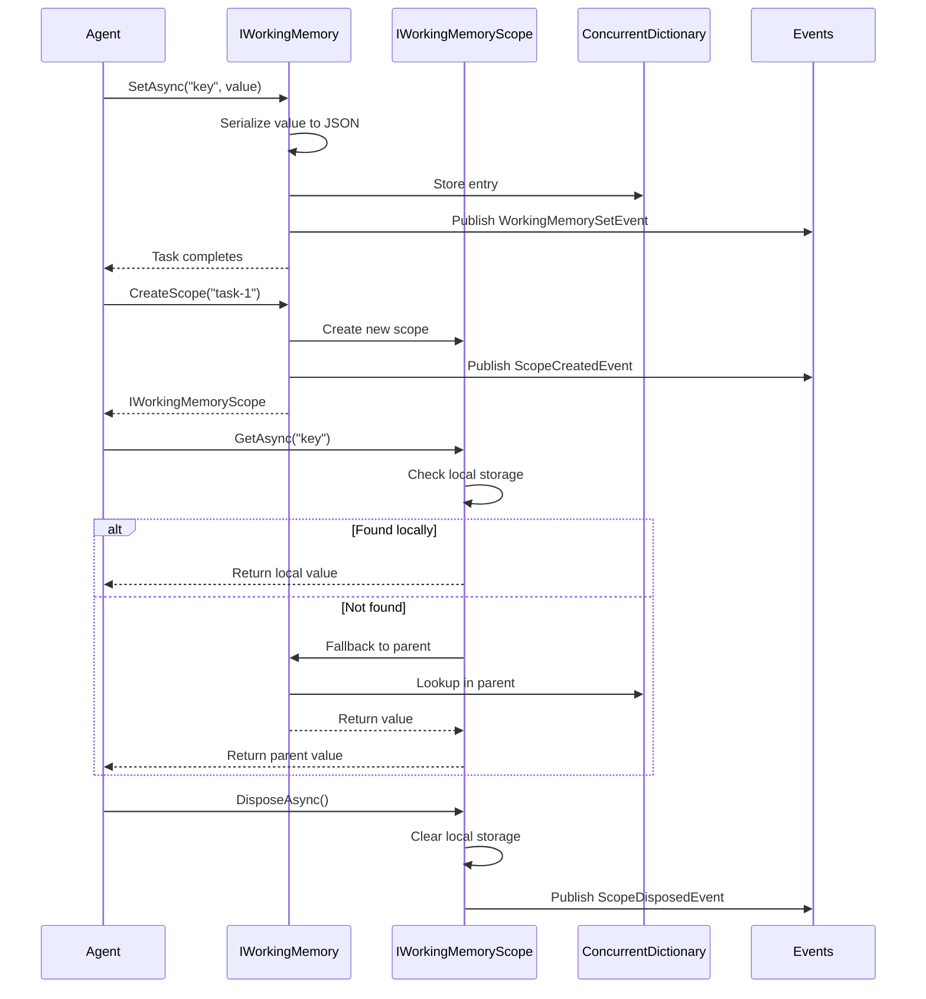
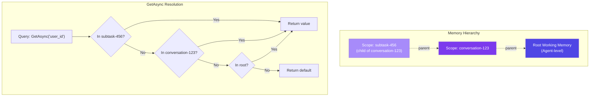

# LDS-01: Working Memory

## 1. Metadata & Categorization

| Field | Value |
| :--- | :--- |
| **Feature ID** | `MEM-WRK-01` |
| **Feature Name** | Working Memory |
| **Target Version** | `v0.12.4a` |
| **Module Scope** | `Lexichord.Modules.Agents` |
| **Swimlane** | Memory |
| **License Tier** | Core |
| **Feature Gate Key** | `FeatureFlags.Agents.Memory.Working` |
| **Author** | Agent Architecture Lead |
| **Reviewer** | Lead Architect |
| **Status** | Draft |
| **Last Updated** | 2026-02-04 |
| **Parent Spec** | [LCS-SBD-v0.12.4-AGT](./LCS-SBD-v0.12.4-AGT.md) |
| **Depends On** | [v0.12.1a (Agent Schema)](../v0.12.1/LCS-SBD-v0.12.1a-SCH.md) |
| **Estimated Hours** | 10 |

---

## 2. Executive Summary

### 2.1 The Requirement

Agents need fast, in-process memory for active conversation state. Without working memory, agents cannot track conversation context, user intent, or task progress within a session. The system needs key-value storage with scoped isolation for concurrent conversations and hierarchical fallback for nested tasks.

### 2.2 The Proposed Solution

Implement a working memory system providing:
- `IAgentMemory` unified interface coordinating all memory subsystems
- `IWorkingMemory` interface for fast key-value storage
- `IWorkingMemoryScope` for isolated memory containers with parent fallback
- Thread-safe in-memory dictionary implementation
- Serialization support for complex objects
- Automatic cleanup on scope disposal

---

## 3. Architecture & Modular Strategy

### 3.1 Dependencies

**Upstream Modules:**
- `Lexichord.Modules.Agents.Abstractions` — `IAgent`, `AgentId` (v0.12.1a)
- `Lexichord.Host` — `IMediator`
- `Microsoft.Extensions.Logging.Abstractions` — Logging

**NuGet Packages:**
- `System.Text.Json` (serialization)
- `MediatR` (event publishing)
- `Microsoft.Extensions.Logging.Abstractions` (logging)

### 3.2 Licensing Behavior

- **Load Behavior:** [x] **Soft Gate** — Core tier gets full working memory; long-term and semantic features unavailable.
- **Fallback Experience:** Core users have complete working memory functionality. Attempting to access `LongTermMemory` returns `LicenseRestrictionException`.

---

## 4. Data Contract (The API)

### 4.1 Unified Agent Memory Interface

```csharp
namespace Lexichord.Modules.Agents;

/// <summary>
/// Unified agent memory system managing working, long-term, and context memory.
/// </summary>
/// <remarks>
/// <para>
/// IAgentMemory is the primary entry point for all agent memory operations.
/// It coordinates the three memory subsystems: working memory for active
/// conversation state, long-term memory for persistent knowledge, and
/// context window for token-aware LLM input composition.
/// </para>
/// <para>
/// Each agent instance receives its own IAgentMemory instance with isolated
/// storage to prevent cross-agent memory leakage.
/// </para>
/// <para>
/// Thread Safety: All methods are thread-safe and can be called concurrently.
/// </para>
/// </remarks>
public interface IAgentMemory
{
    /// <summary>
    /// Gets the ID of the agent this memory belongs to.
    /// </summary>
    AgentId AgentId { get; }

    /// <summary>
    /// Gets the working memory system for active conversation state.
    /// </summary>
    /// <remarks>
    /// Working memory is always available regardless of license tier.
    /// It provides fast, in-process storage for session-scoped data.
    /// </remarks>
    IWorkingMemory WorkingMemory { get; }

    /// <summary>
    /// Gets the long-term memory system for persistent knowledge.
    /// </summary>
    /// <remarks>
    /// Long-term memory requires WriterPro tier or higher.
    /// Core tier users will receive a stub that throws LicenseRestrictionException.
    /// </remarks>
    /// <exception cref="LicenseRestrictionException">
    /// Thrown when accessed by Core tier users.
    /// </exception>
    ILongTermMemory LongTermMemory { get; }

    /// <summary>
    /// Gets the context window manager for token-aware composition.
    /// </summary>
    /// <remarks>
    /// Context window is available to all tiers with basic functionality.
    /// Advanced compaction strategies require Teams tier or higher.
    /// </remarks>
    IContextWindow ContextWindow { get; }

    /// <summary>
    /// Creates a snapshot of all memory systems for persistence.
    /// </summary>
    /// <param name="ct">Cancellation token.</param>
    /// <returns>Complete memory snapshot including working, long-term, and context.</returns>
    /// <remarks>
    /// <para>
    /// Snapshots capture the complete memory state at a point in time.
    /// Use RestoreAsync to restore from a snapshot.
    /// </para>
    /// <para>
    /// Note: Working memory is included; sensitive data is encrypted
    /// before serialization using v0.11.3-SEC.
    /// </para>
    /// </remarks>
    Task<MemorySnapshot> SnapshotAsync(
        CancellationToken ct = default);

    /// <summary>
    /// Restores agent memory from a previous snapshot.
    /// </summary>
    /// <param name="snapshot">The snapshot to restore.</param>
    /// <param name="ct">Cancellation token.</param>
    /// <returns>Task completing when restoration is complete.</returns>
    /// <exception cref="ArgumentNullException">Snapshot is null.</exception>
    /// <exception cref="ArgumentException">Snapshot agent ID does not match.</exception>
    /// <remarks>
    /// Restoration replaces current memory state. Any unsaved changes
    /// will be lost. Use SnapshotAsync first if preservation is needed.
    /// </remarks>
    Task RestoreAsync(
        MemorySnapshot snapshot,
        CancellationToken ct = default);

    /// <summary>
    /// Clears all memory systems (working, long-term, and context).
    /// </summary>
    /// <param name="options">Options controlling what to clear.</param>
    /// <param name="ct">Cancellation token.</param>
    /// <returns>Task completing when clear is complete.</returns>
    /// <remarks>
    /// <para>
    /// By default, clears working memory and context but not long-term memory.
    /// Use options to specify exactly what to clear.
    /// </para>
    /// <para>
    /// This operation is irreversible. Use SnapshotAsync first if
    /// preservation is needed.
    /// </para>
    /// </remarks>
    Task ClearAsync(
        MemoryClearOptions? options = null,
        CancellationToken ct = default);

    /// <summary>
    /// Gets aggregate statistics across all memory systems.
    /// </summary>
    /// <param name="ct">Cancellation token.</param>
    /// <returns>Combined memory statistics.</returns>
    Task<MemoryStats> GetStatsAsync(
        CancellationToken ct = default);
}
```

### 4.2 Working Memory Interface

```csharp
namespace Lexichord.Modules.Agents;

/// <summary>
/// Fast, in-process memory for active conversation state.
/// </summary>
/// <remarks>
/// <para>
/// Working memory provides key-value storage for session-scoped data.
/// It is designed for high-frequency access with sub-5ms latency.
/// </para>
/// <para>
/// Values are stored as serialized JSON internally. Complex objects
/// must be JSON-serializable. Use System.Text.Json attributes to
/// control serialization behavior.
/// </para>
/// <para>
/// Working memory supports hierarchical scopes for nested conversations
/// or parallel tasks. Child scopes inherit from parent with fallback
/// resolution.
/// </para>
/// <para>
/// Thread Safety: All methods are thread-safe and can be called concurrently.
/// </para>
/// </remarks>
public interface IWorkingMemory
{
    /// <summary>
    /// Gets the number of entries in this memory (excluding scopes).
    /// </summary>
    int Count { get; }

    /// <summary>
    /// Gets all keys currently stored in this memory.
    /// </summary>
    IReadOnlyCollection<string> Keys { get; }

    /// <summary>
    /// Stores a value in working memory, overwriting if exists.
    /// </summary>
    /// <typeparam name="T">Type of value to store.</typeparam>
    /// <param name="key">The key to store under.</param>
    /// <param name="value">The value to store.</param>
    /// <param name="metadata">Optional metadata for the entry.</param>
    /// <param name="ct">Cancellation token.</param>
    /// <returns>Task completing when stored.</returns>
    /// <exception cref="ArgumentNullException">Key is null or empty.</exception>
    /// <exception cref="ArgumentException">Value is not JSON-serializable.</exception>
    /// <remarks>
    /// <para>
    /// Keys are case-sensitive. Use consistent casing conventions.
    /// </para>
    /// <para>
    /// If the key exists, the previous value is overwritten.
    /// The timestamp and metadata are updated.
    /// </para>
    /// </remarks>
    Task SetAsync<T>(
        string key,
        T value,
        MemoryEntryMetadata? metadata = null,
        CancellationToken ct = default);

    /// <summary>
    /// Retrieves a value from working memory.
    /// </summary>
    /// <typeparam name="T">Expected type of the value.</typeparam>
    /// <param name="key">The key to retrieve.</param>
    /// <param name="ct">Cancellation token.</param>
    /// <returns>The value if found; default(T) if not found.</returns>
    /// <exception cref="ArgumentNullException">Key is null or empty.</exception>
    /// <exception cref="JsonException">Value cannot be deserialized to T.</exception>
    /// <remarks>
    /// Returns default(T) if key not found. Use ContainsAsync to check
    /// existence before retrieval if distinction is needed.
    /// </remarks>
    Task<T?> GetAsync<T>(
        string key,
        CancellationToken ct = default);

    /// <summary>
    /// Gets a value or sets it if not present.
    /// </summary>
    /// <typeparam name="T">Type of the value.</typeparam>
    /// <param name="key">The key to retrieve or set.</param>
    /// <param name="factory">Factory to create value if not present.</param>
    /// <param name="ct">Cancellation token.</param>
    /// <returns>The existing or newly created value.</returns>
    /// <remarks>
    /// This is an atomic operation. The factory is only called if the
    /// key does not exist, and the value is stored before returning.
    /// </remarks>
    Task<T> GetOrSetAsync<T>(
        string key,
        Func<Task<T>> factory,
        CancellationToken ct = default);

    /// <summary>
    /// Checks if a key exists in working memory.
    /// </summary>
    /// <param name="key">The key to check.</param>
    /// <param name="ct">Cancellation token.</param>
    /// <returns>True if the key exists.</returns>
    Task<bool> ContainsAsync(
        string key,
        CancellationToken ct = default);

    /// <summary>
    /// Removes a value from working memory.
    /// </summary>
    /// <param name="key">The key to remove.</param>
    /// <param name="ct">Cancellation token.</param>
    /// <returns>True if the key was removed; false if not found.</returns>
    Task<bool> RemoveAsync(
        string key,
        CancellationToken ct = default);

    /// <summary>
    /// Gets all working memory entries.
    /// </summary>
    /// <param name="ct">Cancellation token.</param>
    /// <returns>Dictionary of all key-value pairs.</returns>
    Task<IReadOnlyDictionary<string, MemoryEntry>> GetAllAsync(
        CancellationToken ct = default);

    /// <summary>
    /// Clears all entries from this working memory.
    /// </summary>
    /// <param name="ct">Cancellation token.</param>
    /// <returns>Number of entries cleared.</returns>
    Task<int> ClearAsync(CancellationToken ct = default);

    /// <summary>
    /// Creates a child scope for isolated memory (e.g., sub-conversations).
    /// </summary>
    /// <param name="scopeName">Name for the scope (for debugging/logging).</param>
    /// <returns>A new isolated scope with fallback to this memory.</returns>
    /// <exception cref="ArgumentNullException">ScopeName is null or empty.</exception>
    /// <remarks>
    /// <para>
    /// Child scopes provide isolation for nested tasks while maintaining
    /// access to parent values via fallback resolution.
    /// </para>
    /// <para>
    /// When GetAsync is called on a scope, it first checks the scope's
    /// local storage. If not found, it falls back to the parent memory.
    /// SetAsync always writes to the local scope.
    /// </para>
    /// <para>
    /// Dispose the scope when done to release resources and prevent
    /// memory leaks.
    /// </para>
    /// </remarks>
    IWorkingMemoryScope CreateScope(string scopeName);

    /// <summary>
    /// Gets all active child scopes.
    /// </summary>
    /// <returns>List of active scope names.</returns>
    IReadOnlyList<string> GetActiveScopes();
}
```

### 4.3 Working Memory Scope Interface

```csharp
namespace Lexichord.Modules.Agents.Abstractions;

/// <summary>
/// Isolated memory scope for nested or parallel conversations.
/// </summary>
/// <remarks>
/// <para>
/// Scopes provide isolation for sub-tasks while maintaining read access
/// to parent memory via fallback resolution.
/// </para>
/// <para>
/// Scopes are created via IWorkingMemory.CreateScope(). Each scope has
/// its own local storage that shadows parent values when the same key
/// is used.
/// </para>
/// <para>
/// Memory Resolution Order:
/// 1. Check local scope storage
/// 2. If not found, check parent memory
/// 3. If parent is also a scope, continue up the chain
/// 4. Return default if not found in any level
/// </para>
/// <para>
/// Thread Safety: All methods are thread-safe.
/// </para>
/// </remarks>
public interface IWorkingMemoryScope : IAsyncDisposable
{
    /// <summary>
    /// Gets the name of this scope (for debugging).
    /// </summary>
    string ScopeName { get; }

    /// <summary>
    /// Gets the unique ID of this scope.
    /// </summary>
    Guid ScopeId { get; }

    /// <summary>
    /// Gets whether this scope has been disposed.
    /// </summary>
    bool IsDisposed { get; }

    /// <summary>
    /// Gets the number of entries in this scope (excluding inherited).
    /// </summary>
    int LocalCount { get; }

    /// <summary>
    /// Stores a value in this scope's memory.
    /// </summary>
    /// <typeparam name="T">Type of value to store.</typeparam>
    /// <param name="key">The key to store under.</param>
    /// <param name="value">The value to store.</param>
    /// <param name="metadata">Optional metadata for the entry.</param>
    /// <param name="ct">Cancellation token.</param>
    /// <returns>Task completing when stored.</returns>
    /// <exception cref="ObjectDisposedException">Scope has been disposed.</exception>
    /// <remarks>
    /// Values are stored in the local scope storage, shadowing any
    /// parent values with the same key.
    /// </remarks>
    Task SetAsync<T>(
        string key,
        T value,
        MemoryEntryMetadata? metadata = null,
        CancellationToken ct = default);

    /// <summary>
    /// Retrieves a value from this scope's memory (with parent fallback).
    /// </summary>
    /// <typeparam name="T">Expected type of the value.</typeparam>
    /// <param name="key">The key to retrieve.</param>
    /// <param name="ct">Cancellation token.</param>
    /// <returns>The value if found in scope or parent; default(T) if not found.</returns>
    /// <exception cref="ObjectDisposedException">Scope has been disposed.</exception>
    /// <remarks>
    /// Resolution order: local scope -> parent memory -> default(T).
    /// </remarks>
    Task<T?> GetAsync<T>(
        string key,
        CancellationToken ct = default);

    /// <summary>
    /// Gets a value from local scope only (no parent fallback).
    /// </summary>
    /// <typeparam name="T">Expected type of the value.</typeparam>
    /// <param name="key">The key to retrieve.</param>
    /// <param name="ct">Cancellation token.</param>
    /// <returns>The value if found in local scope; default(T) otherwise.</returns>
    Task<T?> GetLocalAsync<T>(
        string key,
        CancellationToken ct = default);

    /// <summary>
    /// Checks if a key exists in local scope or parent.
    /// </summary>
    /// <param name="key">The key to check.</param>
    /// <param name="ct">Cancellation token.</param>
    /// <returns>True if found in scope or parent.</returns>
    Task<bool> ContainsAsync(
        string key,
        CancellationToken ct = default);

    /// <summary>
    /// Checks if a key exists in local scope only.
    /// </summary>
    /// <param name="key">The key to check.</param>
    /// <param name="ct">Cancellation token.</param>
    /// <returns>True if found in local scope.</returns>
    Task<bool> ContainsLocalAsync(
        string key,
        CancellationToken ct = default);

    /// <summary>
    /// Removes a value from local scope.
    /// </summary>
    /// <param name="key">The key to remove.</param>
    /// <param name="ct">Cancellation token.</param>
    /// <returns>True if removed from local scope.</returns>
    /// <remarks>
    /// Only removes from local scope. Parent values are unchanged
    /// and will become visible after removal.
    /// </remarks>
    Task<bool> RemoveAsync(
        string key,
        CancellationToken ct = default);

    /// <summary>
    /// Gets all entries in local scope (excluding inherited).
    /// </summary>
    /// <param name="ct">Cancellation token.</param>
    /// <returns>Dictionary of local key-value pairs.</returns>
    Task<IReadOnlyDictionary<string, MemoryEntry>> GetLocalEntriesAsync(
        CancellationToken ct = default);

    /// <summary>
    /// Creates a nested child scope.
    /// </summary>
    /// <param name="scopeName">Name for the child scope.</param>
    /// <returns>A new scope with fallback to this scope.</returns>
    IWorkingMemoryScope CreateChildScope(string scopeName);

    /// <summary>
    /// Merges local scope entries into parent memory.
    /// </summary>
    /// <param name="overwrite">Whether to overwrite existing parent values.</param>
    /// <param name="ct">Cancellation token.</param>
    /// <returns>Number of entries merged.</returns>
    /// <remarks>
    /// Use this to promote scope-local values to the parent before
    /// disposing the scope.
    /// </remarks>
    Task<int> MergeToParentAsync(
        bool overwrite = true,
        CancellationToken ct = default);
}
```

### 4.4 Supporting Types

```csharp
namespace Lexichord.Modules.Agents.Abstractions;

/// <summary>
/// A single memory entry with content, metadata, and embedding.
/// </summary>
/// <remarks>
/// <para>
/// MemoryEntry is used by both working memory and long-term memory.
/// The Embedding property is only populated for long-term memory entries.
/// </para>
/// </remarks>
public record MemoryEntry
{
    /// <summary>
    /// Unique identifier for this entry.
    /// </summary>
    public Guid Id { get; init; } = Guid.NewGuid();

    /// <summary>
    /// The serialized content as JSON.
    /// </summary>
    public required string Content { get; init; }

    /// <summary>
    /// The CLR type name of the original value.
    /// </summary>
    public required string TypeName { get; init; }

    /// <summary>
    /// Type of memory (for long-term memory classification).
    /// </summary>
    public MemoryType Type { get; init; } = MemoryType.Fact;

    /// <summary>
    /// Importance score (0-1 scale).
    /// </summary>
    /// <remarks>
    /// Higher importance entries are retained longer and prioritized
    /// in retrieval results. Default is 0.5 (normal importance).
    /// </remarks>
    public float Importance { get; init; } = 0.5f;

    /// <summary>
    /// When this entry was created or last updated.
    /// </summary>
    public DateTimeOffset Timestamp { get; init; } = DateTimeOffset.UtcNow;

    /// <summary>
    /// Tags for categorization and filtering.
    /// </summary>
    public IReadOnlyList<string> Tags { get; init; } = [];

    /// <summary>
    /// Custom metadata key-value pairs.
    /// </summary>
    public IReadOnlyDictionary<string, object>? Metadata { get; init; }

    /// <summary>
    /// Vector embedding for semantic search (nullable until computed).
    /// </summary>
    /// <remarks>
    /// Populated only for long-term memory entries that have been embedded.
    /// Working memory entries do not have embeddings.
    /// </remarks>
    public float[]? Embedding { get; init; }

    /// <summary>
    /// Number of times this entry has been accessed.
    /// </summary>
    public int AccessCount { get; init; }

    /// <summary>
    /// When this entry was last accessed.
    /// </summary>
    public DateTimeOffset? LastAccessedAt { get; init; }
}

/// <summary>
/// Metadata for memory entries.
/// </summary>
public record MemoryEntryMetadata
{
    /// <summary>
    /// Importance score (0-1 scale).
    /// </summary>
    public float? Importance { get; init; }

    /// <summary>
    /// Tags for categorization.
    /// </summary>
    public IReadOnlyList<string>? Tags { get; init; }

    /// <summary>
    /// Custom metadata key-value pairs.
    /// </summary>
    public IReadOnlyDictionary<string, object>? CustomMetadata { get; init; }

    /// <summary>
    /// Number of days until this entry expires (null = no expiry).
    /// </summary>
    public int? ExpiryDays { get; init; }

    /// <summary>
    /// Memory type classification.
    /// </summary>
    public MemoryType? MemoryType { get; init; }
}

/// <summary>
/// Types of memories for classification and retrieval.
/// </summary>
public enum MemoryType
{
    /// <summary>
    /// Static knowledge facts.
    /// </summary>
    Fact = 0,

    /// <summary>
    /// Historical occurrences or events.
    /// </summary>
    Event = 1,

    /// <summary>
    /// Derived knowledge or conclusions.
    /// </summary>
    Insight = 2,

    /// <summary>
    /// User or agent preferences.
    /// </summary>
    Preference = 3,

    /// <summary>
    /// Corrections to previous information.
    /// </summary>
    Correction = 4,

    /// <summary>
    /// Dialog history and conversational context.
    /// </summary>
    Conversation = 5
}

/// <summary>
/// Statistics about memory storage and usage.
/// </summary>
public record MemoryStats
{
    /// <summary>
    /// Number of entries in working memory.
    /// </summary>
    public long TotalEntriesWorking { get; init; }

    /// <summary>
    /// Number of active working memory scopes.
    /// </summary>
    public int ActiveWorkingScopes { get; init; }

    /// <summary>
    /// Number of entries in long-term memory.
    /// </summary>
    public long TotalEntriesLongTerm { get; init; }

    /// <summary>
    /// Number of forgotten (soft-deleted) entries.
    /// </summary>
    public long TotalEntriesForgotten { get; init; }

    /// <summary>
    /// Storage bytes used across all memory systems.
    /// </summary>
    public long StorageBytesUsed { get; init; }

    /// <summary>
    /// Storage limit based on license tier.
    /// </summary>
    public long StorageBytesLimit { get; init; }

    /// <summary>
    /// Percentage of storage limit used.
    /// </summary>
    public float StoragePercentUsed => StorageBytesLimit > 0
        ? (StorageBytesUsed / (float)StorageBytesLimit) * 100f
        : 0f;

    /// <summary>
    /// Timestamp of oldest entry across all systems.
    /// </summary>
    public DateTimeOffset OldestEntry { get; init; }

    /// <summary>
    /// Timestamp of newest entry.
    /// </summary>
    public DateTimeOffset NewestEntry { get; init; }

    /// <summary>
    /// Current context window token usage.
    /// </summary>
    public int ContextTokensUsed { get; init; }

    /// <summary>
    /// Maximum context window tokens.
    /// </summary>
    public int ContextTokensMax { get; init; }
}
```

### 4.5 MediatR Events

```csharp
namespace Lexichord.Modules.Agents.Events;

/// <summary>
/// Published when a value is stored in working memory.
/// </summary>
public sealed record WorkingMemorySetEvent : INotification
{
    public required AgentId AgentId { get; init; }
    public required string Key { get; init; }
    public required string TypeName { get; init; }
    public required DateTimeOffset Timestamp { get; init; }
    public string? ScopeName { get; init; }
    public Guid? ScopeId { get; init; }
    public bool IsUpdate { get; init; }
}

/// <summary>
/// Published when a value is removed from working memory.
/// </summary>
public sealed record WorkingMemoryRemovedEvent : INotification
{
    public required AgentId AgentId { get; init; }
    public required string Key { get; init; }
    public required DateTimeOffset Timestamp { get; init; }
    public string? ScopeName { get; init; }
    public Guid? ScopeId { get; init; }
}

/// <summary>
/// Published when a working memory scope is created.
/// </summary>
public sealed record WorkingMemoryScopeCreatedEvent : INotification
{
    public required AgentId AgentId { get; init; }
    public required string ScopeName { get; init; }
    public required Guid ScopeId { get; init; }
    public Guid? ParentScopeId { get; init; }
    public required DateTimeOffset Timestamp { get; init; }
}

/// <summary>
/// Published when a working memory scope is disposed.
/// </summary>
public sealed record WorkingMemoryScopeDisposedEvent : INotification
{
    public required AgentId AgentId { get; init; }
    public required string ScopeName { get; init; }
    public required Guid ScopeId { get; init; }
    public required int EntriesCleared { get; init; }
    public required DateTimeOffset Timestamp { get; init; }
}

/// <summary>
/// Published when working memory is cleared.
/// </summary>
public sealed record WorkingMemoryClearedEvent : INotification
{
    public required AgentId AgentId { get; init; }
    public required int EntriesCleared { get; init; }
    public required DateTimeOffset Timestamp { get; init; }
}
```

---

## 5. Implementation Logic

### 5.1 Flow Diagram



### 5.2 Scope Resolution Flow



### 5.3 Implementation Notes

```csharp
namespace Lexichord.Modules.Agents.Memory;

/// <summary>
/// Thread-safe working memory implementation.
/// </summary>
internal sealed class WorkingMemory : IWorkingMemory
{
    private readonly ConcurrentDictionary<string, MemoryEntry> _entries = new();
    private readonly ConcurrentDictionary<Guid, WorkingMemoryScope> _scopes = new();
    private readonly AgentId _agentId;
    private readonly IMediator _mediator;
    private readonly ILogger<WorkingMemory> _logger;

    public WorkingMemory(
        AgentId agentId,
        IMediator mediator,
        ILogger<WorkingMemory> logger)
    {
        _agentId = agentId;
        _mediator = mediator;
        _logger = logger;
    }

    public int Count => _entries.Count;

    public IReadOnlyCollection<string> Keys => _entries.Keys.ToList().AsReadOnly();

    public async Task SetAsync<T>(
        string key,
        T value,
        MemoryEntryMetadata? metadata = null,
        CancellationToken ct = default)
    {
        ArgumentException.ThrowIfNullOrWhiteSpace(key);

        var json = JsonSerializer.Serialize(value);
        var isUpdate = _entries.ContainsKey(key);

        var entry = new MemoryEntry
        {
            Content = json,
            TypeName = typeof(T).FullName ?? typeof(T).Name,
            Type = metadata?.MemoryType ?? MemoryType.Fact,
            Importance = metadata?.Importance ?? 0.5f,
            Tags = metadata?.Tags ?? [],
            Metadata = metadata?.CustomMetadata
        };

        _entries[key] = entry;

        _logger.LogDebug(
            "Working memory {Operation} for key {Key} by agent {AgentId}",
            isUpdate ? "updated" : "set",
            key,
            _agentId);

        await _mediator.Publish(new WorkingMemorySetEvent
        {
            AgentId = _agentId,
            Key = key,
            TypeName = entry.TypeName,
            Timestamp = entry.Timestamp,
            IsUpdate = isUpdate
        }, ct);
    }

    public Task<T?> GetAsync<T>(string key, CancellationToken ct = default)
    {
        ArgumentException.ThrowIfNullOrWhiteSpace(key);

        if (_entries.TryGetValue(key, out var entry))
        {
            var value = JsonSerializer.Deserialize<T>(entry.Content);
            return Task.FromResult(value);
        }

        return Task.FromResult(default(T?));
    }

    public IWorkingMemoryScope CreateScope(string scopeName)
    {
        ArgumentException.ThrowIfNullOrWhiteSpace(scopeName);

        var scope = new WorkingMemoryScope(
            scopeName,
            _agentId,
            this,
            null,
            _mediator,
            _logger);

        _scopes[scope.ScopeId] = scope;

        _logger.LogDebug(
            "Created working memory scope {ScopeName} ({ScopeId}) for agent {AgentId}",
            scopeName,
            scope.ScopeId,
            _agentId);

        return scope;
    }

    internal void RemoveScope(Guid scopeId)
    {
        _scopes.TryRemove(scopeId, out _);
    }

    // ... additional implementation
}
```

---

## 6. Data Persistence (Database)

Working memory is in-process only and does not persist to database. Persistence is handled by v0.12.4e (Memory Persistence) via snapshots.

**Note:** Working memory contents can be included in memory snapshots for session recovery.

---

## 7. Observability & Logging

### 7.1 Log Messages

| Level | Template |
|:------|:---------|
| Debug | `"Working memory {Operation} for key {Key} by agent {AgentId}"` |
| Debug | `"Working memory scope {ScopeName} ({ScopeId}) lookup for key {Key}: {Found}"` |
| Debug | `"Created working memory scope {ScopeName} ({ScopeId}) for agent {AgentId}"` |
| Debug | `"Disposed working memory scope {ScopeName} ({ScopeId}), cleared {Count} entries"` |
| Info | `"Working memory initialized for agent {AgentId}"` |
| Info | `"Working memory cleared for agent {AgentId}, removed {Count} entries"` |
| Warning | `"Working memory scope {ScopeId} already disposed, operation ignored"` |
| Error | `"Failed to serialize value for key {Key}: {ErrorMessage}"` |

### 7.2 Metrics

| Metric | Type | Description |
|:-------|:-----|:------------|
| `agents.memory.working.entries` | Gauge | Current entry count |
| `agents.memory.working.scopes` | Gauge | Active scope count |
| `agents.memory.working.get_latency_ms` | Histogram | Get operation latency |
| `agents.memory.working.set_latency_ms` | Histogram | Set operation latency |
| `agents.memory.working.scope_fallback_total` | Counter | Parent fallback operations |

---

## 8. Security & Safety

### 8.1 Memory Isolation

- Each agent has isolated working memory (no cross-agent access)
- Scopes provide additional isolation within an agent
- Agent ID is verified on all operations

### 8.2 Input Validation

- Keys MUST be non-null, non-empty strings
- Keys MUST NOT contain control characters
- Values MUST be JSON-serializable
- Scope names MUST be non-null, non-empty

### 8.3 Resource Protection

- Maximum entries per agent: 10,000 (configurable)
- Maximum entry size: 1 MB
- Maximum scopes per agent: 100
- Automatic cleanup on agent termination

---

## 9. Acceptance Criteria (QA)

### 9.1 Functional Criteria

1. **[Set/Get]** SetAsync stores a value; GetAsync retrieves it correctly.
2. **[Type Safety]** GetAsync deserializes to the correct type.
3. **[Scope Isolation]** Values set in a scope do not affect parent.
4. **[Parent Fallback]** Scope GetAsync falls back to parent when key not in scope.
5. **[Scope Disposal]** Disposing scope clears its entries and publishes event.

### 9.2 Non-Functional Criteria

1. **[Latency]** GetAsync P95 < 5ms.
2. **[Latency]** SetAsync P95 < 10ms.
3. **[Concurrency]** Multiple concurrent Set/Get operations do not deadlock.
4. **[Memory]** 10,000 entries consume < 100MB memory.

---

## 10. Test Scenarios

### 10.1 Unit Tests

```gherkin
Scenario: Store and retrieve value
  Given working memory is initialized for agent "A"
  When I call SetAsync with key "user_id" and value "user-123"
  Then GetAsync with key "user_id" returns "user-123"
  And WorkingMemorySetEvent is published

Scenario: Retrieve non-existent key
  Given working memory is initialized for agent "A"
  When I call GetAsync with key "non_existent"
  Then the result is default(T)

Scenario: Scope isolation
  Given working memory is initialized for agent "A"
  And SetAsync stores "global_key" = "global_value"
  When I create scope "task-1"
  And I call SetAsync on scope with "global_key" = "local_value"
  Then GetAsync on scope returns "local_value"
  And GetAsync on root returns "global_value"

Scenario: Scope parent fallback
  Given working memory is initialized for agent "A"
  And SetAsync stores "parent_key" = "parent_value"
  When I create scope "task-1"
  And I call GetAsync on scope with "parent_key"
  Then the result is "parent_value"

Scenario: Scope disposal
  Given working memory is initialized for agent "A"
  And scope "task-1" exists with 5 entries
  When I dispose scope "task-1"
  Then WorkingMemoryScopeDisposedEvent is published with EntriesCleared = 5
  And the scope is removed from active scopes
```

### 10.2 Integration Tests

```gherkin
Scenario: Full working memory lifecycle
  Given an agent is spawned
  When the agent stores 100 key-value pairs
  And creates 3 nested scopes
  And performs lookups across scopes
  Then all lookups resolve correctly via fallback
  And memory stats reflect accurate counts

Scenario: Concurrent access
  Given working memory is initialized
  When 10 concurrent tasks perform Set/Get operations
  Then all operations complete without deadlock
  And final state is consistent
```

---

## 11. Changelog

| Version | Date | Author | Changes |
|:--------|:-----|:-------|:--------|
| 1.0.0 | 2026-02-04 | Agent Architecture Lead | Initial specification |

---

**End of Specification**
