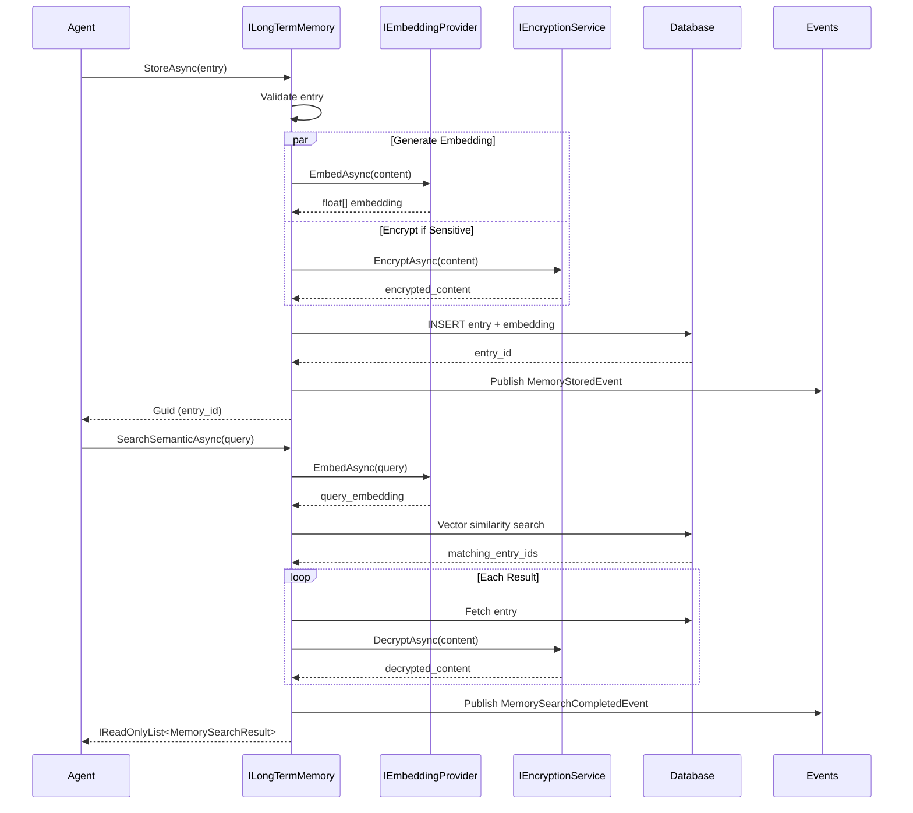
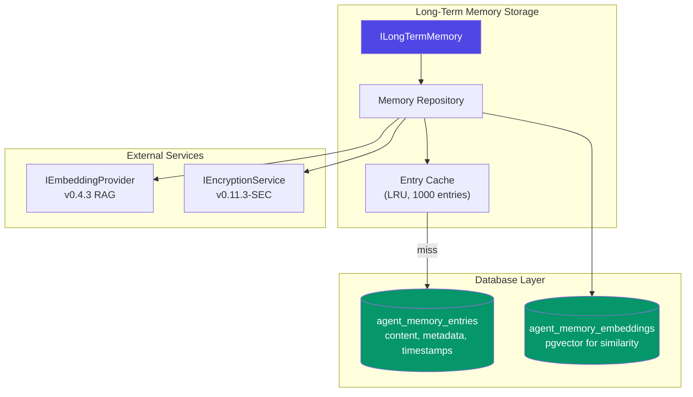

# LDS-01: Long-Term Memory

## 1. Metadata & Categorization

| Field | Value |
| :--- | :--- |
| **Feature ID** | `MEM-LTM-01` |
| **Feature Name** | Long-Term Memory |
| **Target Version** | `v0.12.4b` |
| **Module Scope** | `Lexichord.Modules.Agents` |
| **Swimlane** | Memory |
| **License Tier** | WriterPro |
| **Feature Gate Key** | `FeatureFlags.Agents.Memory.LongTerm` |
| **Author** | Agent Architecture Lead |
| **Reviewer** | Lead Architect |
| **Status** | Draft |
| **Last Updated** | 2026-02-04 |
| **Parent Spec** | [LCS-SBD-v0.12.4-AGT](./LCS-SBD-v0.12.4-AGT.md) |
| **Depends On** | [v0.12.4a (Working Memory)](./LCS-SBD-v0.12.4a-WRK.md), [v0.4.3 RAG Service], [v0.11.3-SEC Encryption] |
| **Estimated Hours** | 10 |

---

## 2. Executive Summary

### 2.1 The Requirement

Agents need persistent memory that survives across sessions and enables semantic retrieval of relevant information. Without long-term memory, agents cannot learn from past interactions, build knowledge bases, or recall relevant context when needed. The system needs encrypted storage, vector embeddings for semantic search, and importance-based retention.

### 2.2 The Proposed Solution

Implement a long-term memory system providing:
- `ILongTermMemory` interface for persistent semantic memory
- `MemoryEntry` records with content, metadata, and vector embeddings
- `MemoryType` classification for organizational categorization
- Integration with v0.4.3 RAG Service for embedding generation
- Encryption via v0.11.3-SEC for sensitive content
- Soft-delete (forget) with retention policies
- Storage quotas based on license tier

---

## 3. Architecture & Modular Strategy

### 3.1 Dependencies

**Upstream Modules:**
- `Lexichord.Modules.Agents.Abstractions` — `IAgent`, `AgentId` (v0.12.1a)
- `Lexichord.Modules.Agents` — `IWorkingMemory`, `MemoryEntry` (v0.12.4a)
- `Lexichord.Modules.Rag` — `IEmbeddingProvider` (v0.4.3)
- `Lexichord.Modules.Security` — `IEncryptionService` (v0.11.3-SEC)
- `Lexichord.Host` — `IMediator`, `IRepository`

**NuGet Packages:**
- `System.Text.Json` (serialization)
- `MediatR` (event publishing)
- `Microsoft.Extensions.Logging.Abstractions` (logging)
- `Npgsql` (PostgreSQL with pgvector)

### 3.2 Licensing Behavior

- **Load Behavior:** [x] **Hard Gate** — Core tier receives stub implementation that throws `LicenseRestrictionException`.
- **Fallback Experience:** Core users see "Upgrade to WriterPro for persistent memory" message. WriterPro gets 100MB storage; Teams gets 1GB; Enterprise gets unlimited.

---

## 4. Data Contract (The API)

### 4.1 Long-Term Memory Interface

```csharp
namespace Lexichord.Modules.Agents;

/// <summary>
/// Persistent semantic memory with embeddings and search capabilities.
/// </summary>
/// <remarks>
/// <para>
/// Long-term memory provides persistent storage for agent knowledge that
/// survives across sessions. Each entry is embedded for semantic search
/// and optionally encrypted for sensitive content.
/// </para>
/// <para>
/// Storage is subject to license tier limits:
/// - WriterPro: 100 MB
/// - Teams: 1 GB
/// - Enterprise: Unlimited
/// </para>
/// <para>
/// Entries can be "forgotten" (soft-deleted) with configurable retention.
/// Forgotten entries are excluded from search but retained for compliance.
/// </para>
/// <para>
/// Thread Safety: All methods are thread-safe and can be called concurrently.
/// </para>
/// </remarks>
public interface ILongTermMemory
{
    /// <summary>
    /// Gets the agent ID this memory belongs to.
    /// </summary>
    AgentId AgentId { get; }

    /// <summary>
    /// Gets the total number of active (non-forgotten) entries.
    /// </summary>
    Task<long> GetCountAsync(CancellationToken ct = default);

    /// <summary>
    /// Stores an entry in long-term memory with semantic embedding.
    /// </summary>
    /// <param name="entry">The memory entry to store.</param>
    /// <param name="ct">Cancellation token.</param>
    /// <returns>The ID of the stored entry.</returns>
    /// <exception cref="ArgumentNullException">Entry is null.</exception>
    /// <exception cref="ArgumentException">Entry content is empty.</exception>
    /// <exception cref="StorageQuotaExceededException">Storage limit reached.</exception>
    /// <remarks>
    /// <para>
    /// If entry.Embedding is null, an embedding will be generated automatically
    /// using the v0.4.3 RAG Service embedding provider.
    /// </para>
    /// <para>
    /// Sensitive content (determined by metadata or content analysis) is
    /// encrypted before storage using v0.11.3-SEC.
    /// </para>
    /// </remarks>
    Task<Guid> StoreAsync(
        MemoryEntry entry,
        CancellationToken ct = default);

    /// <summary>
    /// Stores multiple entries in a batch operation.
    /// </summary>
    /// <param name="entries">The entries to store.</param>
    /// <param name="ct">Cancellation token.</param>
    /// <returns>List of stored entry IDs.</returns>
    /// <remarks>
    /// Batch storage is more efficient for multiple entries as embeddings
    /// can be generated in parallel.
    /// </remarks>
    Task<IReadOnlyList<Guid>> StoreBatchAsync(
        IEnumerable<MemoryEntry> entries,
        CancellationToken ct = default);

    /// <summary>
    /// Retrieves a specific memory entry by ID.
    /// </summary>
    /// <param name="entryId">The ID of the entry to retrieve.</param>
    /// <param name="ct">Cancellation token.</param>
    /// <returns>The entry if found; null if not found or forgotten.</returns>
    /// <remarks>
    /// Forgotten entries return null unless includeForgotten is specified
    /// in query options.
    /// </remarks>
    Task<MemoryEntry?> RetrieveAsync(
        Guid entryId,
        CancellationToken ct = default);

    /// <summary>
    /// Retrieves multiple entries by their IDs.
    /// </summary>
    /// <param name="entryIds">The IDs to retrieve.</param>
    /// <param name="ct">Cancellation token.</param>
    /// <returns>Dictionary mapping IDs to entries (missing IDs are omitted).</returns>
    Task<IReadOnlyDictionary<Guid, MemoryEntry>> RetrieveBatchAsync(
        IEnumerable<Guid> entryIds,
        CancellationToken ct = default);

    /// <summary>
    /// Performs semantic search on memory entries.
    /// </summary>
    /// <param name="query">The natural language query.</param>
    /// <param name="limit">Maximum number of results (default 10).</param>
    /// <param name="minSimilarity">Minimum similarity threshold 0-1 (default 0.6).</param>
    /// <param name="ct">Cancellation token.</param>
    /// <returns>Matching entries ranked by semantic similarity.</returns>
    /// <exception cref="LicenseRestrictionException">
    /// Thrown for Core/WriterPro tiers (semantic search requires Teams+).
    /// </exception>
    /// <remarks>
    /// <para>
    /// The query is embedded and compared against stored entry embeddings
    /// using cosine similarity.
    /// </para>
    /// <para>
    /// Results are ranked by similarity score. Use minSimilarity to filter
    /// out low-relevance matches.
    /// </para>
    /// </remarks>
    Task<IReadOnlyList<MemorySearchResult>> SearchSemanticAsync(
        string query,
        int limit = 10,
        float minSimilarity = 0.6f,
        CancellationToken ct = default);

    /// <summary>
    /// Searches memory entries by filters (non-semantic).
    /// </summary>
    /// <param name="filter">Filter criteria.</param>
    /// <param name="ct">Cancellation token.</param>
    /// <returns>Entries matching the filter criteria.</returns>
    /// <remarks>
    /// Filter-based search is available to all tiers (WriterPro+).
    /// For semantic search, use SearchSemanticAsync (Teams+).
    /// </remarks>
    Task<IReadOnlyList<MemoryEntry>> SearchByFilterAsync(
        MemoryFilter filter,
        CancellationToken ct = default);

    /// <summary>
    /// Updates an existing memory entry.
    /// </summary>
    /// <param name="entryId">The ID of the entry to update.</param>
    /// <param name="update">The update to apply.</param>
    /// <param name="ct">Cancellation token.</param>
    /// <returns>True if updated; false if not found.</returns>
    /// <remarks>
    /// If content is updated, a new embedding is generated automatically.
    /// </remarks>
    Task<bool> UpdateAsync(
        Guid entryId,
        MemoryEntryUpdate update,
        CancellationToken ct = default);

    /// <summary>
    /// Marks an entry as forgotten (soft delete with retention).
    /// </summary>
    /// <param name="entryId">The ID of the entry to forget.</param>
    /// <param name="permanent">If true, permanently delete (no retention).</param>
    /// <param name="ct">Cancellation token.</param>
    /// <returns>True if forgotten; false if not found.</returns>
    /// <remarks>
    /// <para>
    /// Soft-deleted entries are excluded from search results but retained
    /// according to retention policy (default 90 days).
    /// </para>
    /// <para>
    /// Use permanent=true for immediate deletion (bypasses retention).
    /// This is irreversible.
    /// </para>
    /// </remarks>
    Task<bool> ForgetAsync(
        Guid entryId,
        bool permanent = false,
        CancellationToken ct = default);

    /// <summary>
    /// Restores a forgotten entry (if still within retention period).
    /// </summary>
    /// <param name="entryId">The ID of the entry to restore.</param>
    /// <param name="ct">Cancellation token.</param>
    /// <returns>True if restored; false if not found or permanently deleted.</returns>
    Task<bool> RestoreAsync(
        Guid entryId,
        CancellationToken ct = default);

    /// <summary>
    /// Gets memory statistics and storage usage.
    /// </summary>
    /// <param name="ct">Cancellation token.</param>
    /// <returns>Current memory statistics.</returns>
    Task<LongTermMemoryStats> GetStatsAsync(
        CancellationToken ct = default);

    /// <summary>
    /// Gets entries by memory type.
    /// </summary>
    /// <param name="type">The memory type to filter by.</param>
    /// <param name="limit">Maximum results.</param>
    /// <param name="ct">Cancellation token.</param>
    /// <returns>Entries of the specified type.</returns>
    Task<IReadOnlyList<MemoryEntry>> GetByTypeAsync(
        MemoryType type,
        int limit = 100,
        CancellationToken ct = default);

    /// <summary>
    /// Gets entries by tag.
    /// </summary>
    /// <param name="tag">The tag to filter by.</param>
    /// <param name="limit">Maximum results.</param>
    /// <param name="ct">Cancellation token.</param>
    /// <returns>Entries with the specified tag.</returns>
    Task<IReadOnlyList<MemoryEntry>> GetByTagAsync(
        string tag,
        int limit = 100,
        CancellationToken ct = default);

    /// <summary>
    /// Gets the most recently accessed entries.
    /// </summary>
    /// <param name="limit">Maximum results.</param>
    /// <param name="ct">Cancellation token.</param>
    /// <returns>Recently accessed entries ordered by access time.</returns>
    Task<IReadOnlyList<MemoryEntry>> GetRecentAsync(
        int limit = 10,
        CancellationToken ct = default);

    /// <summary>
    /// Gets the most important entries (by importance score).
    /// </summary>
    /// <param name="limit">Maximum results.</param>
    /// <param name="ct">Cancellation token.</param>
    /// <returns>Important entries ordered by importance descending.</returns>
    Task<IReadOnlyList<MemoryEntry>> GetImportantAsync(
        int limit = 10,
        CancellationToken ct = default);
}
```

### 4.2 Supporting Types

```csharp
namespace Lexichord.Modules.Agents.Abstractions;

/// <summary>
/// Result of a semantic memory search.
/// </summary>
public sealed record MemorySearchResult
{
    /// <summary>
    /// The matching memory entry.
    /// </summary>
    public required MemoryEntry Entry { get; init; }

    /// <summary>
    /// Similarity score (0-1, higher is more similar).
    /// </summary>
    public required float Similarity { get; init; }

    /// <summary>
    /// Rank in the result set (1-based).
    /// </summary>
    public required int Rank { get; init; }
}

/// <summary>
/// Filter criteria for non-semantic memory search.
/// </summary>
public sealed record MemoryFilter
{
    /// <summary>
    /// Filter by memory types.
    /// </summary>
    public IReadOnlyList<MemoryType>? Types { get; init; }

    /// <summary>
    /// Filter by tags (entries must have ALL specified tags).
    /// </summary>
    public IReadOnlyList<string>? Tags { get; init; }

    /// <summary>
    /// Filter by tags (entries must have ANY specified tag).
    /// </summary>
    public IReadOnlyList<string>? AnyTags { get; init; }

    /// <summary>
    /// Minimum importance score (0-1).
    /// </summary>
    public float? MinImportance { get; init; }

    /// <summary>
    /// Created after this date.
    /// </summary>
    public DateTimeOffset? CreatedAfter { get; init; }

    /// <summary>
    /// Created before this date.
    /// </summary>
    public DateTimeOffset? CreatedBefore { get; init; }

    /// <summary>
    /// Content contains this text (case-insensitive).
    /// </summary>
    public string? ContentContains { get; init; }

    /// <summary>
    /// Include forgotten entries.
    /// </summary>
    public bool IncludeForgotten { get; init; } = false;

    /// <summary>
    /// Maximum results to return.
    /// </summary>
    public int Limit { get; init; } = 100;

    /// <summary>
    /// Offset for pagination.
    /// </summary>
    public int Offset { get; init; } = 0;

    /// <summary>
    /// Sort order.
    /// </summary>
    public MemorySortOrder SortBy { get; init; } = MemorySortOrder.CreatedDescending;
}

/// <summary>
/// Sort order for memory queries.
/// </summary>
public enum MemorySortOrder
{
    CreatedDescending,
    CreatedAscending,
    ImportanceDescending,
    AccessedDescending,
    AccessCountDescending
}

/// <summary>
/// Update specification for a memory entry.
/// </summary>
public sealed record MemoryEntryUpdate
{
    /// <summary>
    /// New content (null to keep existing).
    /// </summary>
    public string? Content { get; init; }

    /// <summary>
    /// New importance score (null to keep existing).
    /// </summary>
    public float? Importance { get; init; }

    /// <summary>
    /// Tags to add.
    /// </summary>
    public IReadOnlyList<string>? AddTags { get; init; }

    /// <summary>
    /// Tags to remove.
    /// </summary>
    public IReadOnlyList<string>? RemoveTags { get; init; }

    /// <summary>
    /// New memory type (null to keep existing).
    /// </summary>
    public MemoryType? Type { get; init; }

    /// <summary>
    /// Custom metadata to merge (null to keep existing).
    /// </summary>
    public IReadOnlyDictionary<string, object>? Metadata { get; init; }
}

/// <summary>
/// Statistics about long-term memory storage.
/// </summary>
public sealed record LongTermMemoryStats
{
    /// <summary>
    /// Total active (non-forgotten) entries.
    /// </summary>
    public long ActiveEntries { get; init; }

    /// <summary>
    /// Total forgotten entries.
    /// </summary>
    public long ForgottenEntries { get; init; }

    /// <summary>
    /// Storage bytes used.
    /// </summary>
    public long StorageBytesUsed { get; init; }

    /// <summary>
    /// Storage limit based on license tier.
    /// </summary>
    public long StorageBytesLimit { get; init; }

    /// <summary>
    /// Percentage of storage used.
    /// </summary>
    public float StoragePercentUsed => StorageBytesLimit > 0
        ? (StorageBytesUsed / (float)StorageBytesLimit) * 100f
        : 0f;

    /// <summary>
    /// Entry counts by memory type.
    /// </summary>
    public IReadOnlyDictionary<MemoryType, long> EntriesByType { get; init; } =
        new Dictionary<MemoryType, long>();

    /// <summary>
    /// Most used tags with counts.
    /// </summary>
    public IReadOnlyList<TagUsage> TopTags { get; init; } = [];

    /// <summary>
    /// Timestamp of oldest entry.
    /// </summary>
    public DateTimeOffset? OldestEntry { get; init; }

    /// <summary>
    /// Timestamp of newest entry.
    /// </summary>
    public DateTimeOffset? NewestEntry { get; init; }

    /// <summary>
    /// Average embedding generation time (ms).
    /// </summary>
    public double AverageEmbeddingTimeMs { get; init; }

    /// <summary>
    /// Total embeddings generated.
    /// </summary>
    public long TotalEmbeddingsGenerated { get; init; }
}

/// <summary>
/// Tag usage statistics.
/// </summary>
public sealed record TagUsage
{
    public required string Tag { get; init; }
    public required long Count { get; init; }
}

/// <summary>
/// Exception thrown when storage quota is exceeded.
/// </summary>
public sealed class StorageQuotaExceededException : Exception
{
    public long CurrentUsage { get; }
    public long Limit { get; }
    public string LicenseTier { get; }

    public StorageQuotaExceededException(
        long currentUsage,
        long limit,
        string licenseTier)
        : base($"Storage quota exceeded. Current: {currentUsage} bytes, Limit: {limit} bytes ({licenseTier} tier)")
    {
        CurrentUsage = currentUsage;
        Limit = limit;
        LicenseTier = licenseTier;
    }
}
```

### 4.3 MediatR Events

```csharp
namespace Lexichord.Modules.Agents.Events;

/// <summary>
/// Published when a memory entry is stored.
/// </summary>
public sealed record MemoryStoredEvent : INotification
{
    public required AgentId AgentId { get; init; }
    public required Guid EntryId { get; init; }
    public required MemoryType Type { get; init; }
    public required float Importance { get; init; }
    public required int ContentLength { get; init; }
    public required bool WasEncrypted { get; init; }
    public required TimeSpan EmbeddingTime { get; init; }
    public required DateTimeOffset Timestamp { get; init; }
}

/// <summary>
/// Published when a memory entry is retrieved.
/// </summary>
public sealed record MemoryRetrievedEvent : INotification
{
    public required AgentId AgentId { get; init; }
    public required Guid EntryId { get; init; }
    public required MemoryType Type { get; init; }
    public required bool WasDecrypted { get; init; }
    public required DateTimeOffset Timestamp { get; init; }
}

/// <summary>
/// Published when a memory entry is forgotten.
/// </summary>
public sealed record MemoryForgottenEvent : INotification
{
    public required AgentId AgentId { get; init; }
    public required Guid EntryId { get; init; }
    public required bool Permanent { get; init; }
    public required DateTimeOffset Timestamp { get; init; }
}

/// <summary>
/// Published when a semantic search is completed.
/// </summary>
public sealed record MemorySearchCompletedEvent : INotification
{
    public required AgentId AgentId { get; init; }
    public required string Query { get; init; }
    public required int ResultCount { get; init; }
    public required TimeSpan SearchTime { get; init; }
    public required DateTimeOffset Timestamp { get; init; }
}

/// <summary>
/// Published when memory storage quota is approaching limit.
/// </summary>
public sealed record MemoryQuotaWarningEvent : INotification
{
    public required AgentId AgentId { get; init; }
    public required long CurrentUsage { get; init; }
    public required long Limit { get; init; }
    public required float PercentUsed { get; init; }
    public required DateTimeOffset Timestamp { get; init; }
}
```

---

## 5. Implementation Logic

### 5.1 Flow Diagram



### 5.2 Storage Architecture



### 5.3 Implementation Notes

```csharp
namespace Lexichord.Modules.Agents.Memory;

/// <summary>
/// Long-term memory implementation with vector search.
/// </summary>
internal sealed class LongTermMemory : ILongTermMemory
{
    private readonly AgentId _agentId;
    private readonly IRepository<MemoryEntryEntity> _repository;
    private readonly IEmbeddingProvider _embeddingProvider;
    private readonly IEncryptionService _encryptionService;
    private readonly ILicenseService _licenseService;
    private readonly IMediator _mediator;
    private readonly ILogger<LongTermMemory> _logger;
    private readonly MemoryCache _cache;

    private static readonly long WriterProLimit = 100 * 1024 * 1024;  // 100 MB
    private static readonly long TeamsLimit = 1024 * 1024 * 1024;     // 1 GB

    public AgentId AgentId => _agentId;

    public async Task<Guid> StoreAsync(
        MemoryEntry entry,
        CancellationToken ct = default)
    {
        ArgumentNullException.ThrowIfNull(entry);
        if (string.IsNullOrWhiteSpace(entry.Content))
            throw new ArgumentException("Entry content cannot be empty", nameof(entry));

        // Check storage quota
        var stats = await GetStatsAsync(ct);
        var entrySize = Encoding.UTF8.GetByteCount(entry.Content);

        if (stats.StorageBytesUsed + entrySize > stats.StorageBytesLimit)
        {
            throw new StorageQuotaExceededException(
                stats.StorageBytesUsed,
                stats.StorageBytesLimit,
                GetLicenseTierName());
        }

        var stopwatch = Stopwatch.StartNew();

        // Generate embedding if not provided
        float[] embedding = entry.Embedding ?? await GenerateEmbeddingAsync(entry.Content, ct);

        // Encrypt sensitive content
        var (content, wasEncrypted) = await EncryptIfSensitiveAsync(entry.Content, entry.Metadata, ct);

        var entity = new MemoryEntryEntity
        {
            Id = entry.Id,
            AgentId = _agentId.Value,
            Content = content,
            TypeName = entry.TypeName,
            MemoryType = entry.Type,
            Importance = entry.Importance,
            Tags = entry.Tags.ToList(),
            Metadata = entry.Metadata,
            Embedding = embedding,
            IsEncrypted = wasEncrypted,
            CreatedAt = entry.Timestamp,
            UpdatedAt = DateTimeOffset.UtcNow
        };

        await _repository.AddAsync(entity, ct);

        stopwatch.Stop();

        _logger.LogDebug(
            "Stored memory entry {EntryId} for agent {AgentId}, type={Type}, size={Size}bytes, encrypted={Encrypted}",
            entry.Id,
            _agentId,
            entry.Type,
            entrySize,
            wasEncrypted);

        await _mediator.Publish(new MemoryStoredEvent
        {
            AgentId = _agentId,
            EntryId = entry.Id,
            Type = entry.Type,
            Importance = entry.Importance,
            ContentLength = entrySize,
            WasEncrypted = wasEncrypted,
            EmbeddingTime = stopwatch.Elapsed,
            Timestamp = DateTimeOffset.UtcNow
        }, ct);

        // Quota warning at 80%
        if (stats.StoragePercentUsed >= 80)
        {
            await _mediator.Publish(new MemoryQuotaWarningEvent
            {
                AgentId = _agentId,
                CurrentUsage = stats.StorageBytesUsed + entrySize,
                Limit = stats.StorageBytesLimit,
                PercentUsed = stats.StoragePercentUsed,
                Timestamp = DateTimeOffset.UtcNow
            }, ct);
        }

        return entry.Id;
    }

    public async Task<IReadOnlyList<MemorySearchResult>> SearchSemanticAsync(
        string query,
        int limit = 10,
        float minSimilarity = 0.6f,
        CancellationToken ct = default)
    {
        // Require Teams tier for semantic search
        if (!_licenseService.HasFeature("FeatureFlags.Agents.Memory.SemanticRetrieval"))
        {
            throw new LicenseRestrictionException(
                "Semantic search requires Teams tier or higher",
                "FeatureFlags.Agents.Memory.SemanticRetrieval");
        }

        var stopwatch = Stopwatch.StartNew();

        // Embed the query
        var queryEmbedding = await GenerateEmbeddingAsync(query, ct);

        // Vector similarity search using pgvector
        var results = await _repository.QueryAsync<MemorySearchResultEntity>(
            @"SELECT e.*, 1 - (e.embedding <=> @embedding) as similarity
              FROM agent_memory_entries e
              WHERE e.agent_id = @agentId
                AND e.is_forgotten = false
                AND 1 - (e.embedding <=> @embedding) >= @minSimilarity
              ORDER BY similarity DESC
              LIMIT @limit",
            new
            {
                agentId = _agentId.Value,
                embedding = queryEmbedding,
                minSimilarity,
                limit
            },
            ct);

        var searchResults = new List<MemorySearchResult>();
        var rank = 1;

        foreach (var result in results)
        {
            var entry = await DecryptEntryAsync(result.ToMemoryEntry(), ct);
            searchResults.Add(new MemorySearchResult
            {
                Entry = entry,
                Similarity = result.Similarity,
                Rank = rank++
            });
        }

        stopwatch.Stop();

        _logger.LogDebug(
            "Semantic search for agent {AgentId}: query='{Query}', results={Count}, time={Time}ms",
            _agentId,
            query.Length > 50 ? query[..50] + "..." : query,
            searchResults.Count,
            stopwatch.ElapsedMilliseconds);

        await _mediator.Publish(new MemorySearchCompletedEvent
        {
            AgentId = _agentId,
            Query = query,
            ResultCount = searchResults.Count,
            SearchTime = stopwatch.Elapsed,
            Timestamp = DateTimeOffset.UtcNow
        }, ct);

        return searchResults;
    }

    private async Task<float[]> GenerateEmbeddingAsync(string content, CancellationToken ct)
    {
        return await _embeddingProvider.EmbedAsync(content, ct);
    }

    private async Task<(string content, bool wasEncrypted)> EncryptIfSensitiveAsync(
        string content,
        IReadOnlyDictionary<string, object>? metadata,
        CancellationToken ct)
    {
        // Check if marked as sensitive in metadata
        var isSensitive = metadata?.TryGetValue("sensitive", out var val) == true && val is true;

        if (isSensitive)
        {
            var encrypted = await _encryptionService.EncryptAsync(content, ct);
            return (encrypted, true);
        }

        return (content, false);
    }

    private async Task<MemoryEntry> DecryptEntryAsync(MemoryEntry entry, CancellationToken ct)
    {
        if (entry.Metadata?.TryGetValue("encrypted", out var val) == true && val is true)
        {
            var decrypted = await _encryptionService.DecryptAsync(entry.Content, ct);
            return entry with { Content = decrypted };
        }
        return entry;
    }

    // ... additional implementation
}
```

---

## 6. Data Persistence (Database)

### 6.1 Migration

```csharp
[Migration(20260204_001)]
public class CreateAgentMemoryEntries : Migration
{
    public override void Up()
    {
        Create.Table("agent_memory_entries")
            .WithColumn("id").AsGuid().PrimaryKey()
            .WithColumn("agent_id").AsGuid().NotNullable().Indexed()
            .WithColumn("content").AsString(int.MaxValue).NotNullable()
            .WithColumn("type_name").AsString(500).NotNullable()
            .WithColumn("memory_type").AsInt32().NotNullable()
            .WithColumn("importance").AsFloat().NotNullable().WithDefaultValue(0.5f)
            .WithColumn("tags").AsString(int.MaxValue).Nullable()  // JSON array
            .WithColumn("metadata").AsString(int.MaxValue).Nullable()  // JSON object
            .WithColumn("is_encrypted").AsBoolean().NotNullable().WithDefaultValue(false)
            .WithColumn("is_forgotten").AsBoolean().NotNullable().WithDefaultValue(false)
            .WithColumn("forgotten_at").AsDateTimeOffset().Nullable()
            .WithColumn("access_count").AsInt32().NotNullable().WithDefaultValue(0)
            .WithColumn("last_accessed_at").AsDateTimeOffset().Nullable()
            .WithColumn("created_at").AsDateTimeOffset().NotNullable()
            .WithColumn("updated_at").AsDateTimeOffset().NotNullable();

        Create.Index("ix_agent_memory_entries_agent_type")
            .OnTable("agent_memory_entries")
            .OnColumn("agent_id").Ascending()
            .OnColumn("memory_type").Ascending();

        Create.Index("ix_agent_memory_entries_agent_forgotten")
            .OnTable("agent_memory_entries")
            .OnColumn("agent_id").Ascending()
            .OnColumn("is_forgotten").Ascending();
    }

    public override void Down()
    {
        Delete.Table("agent_memory_entries");
    }
}

[Migration(20260204_002)]
public class CreateAgentMemoryEmbeddings : Migration
{
    public override void Up()
    {
        // Enable pgvector extension
        Execute.Sql("CREATE EXTENSION IF NOT EXISTS vector");

        Create.Table("agent_memory_embeddings")
            .WithColumn("entry_id").AsGuid().PrimaryKey()
            .WithColumn("embedding").AsCustom("vector(1536)").NotNullable()
            .WithColumn("created_at").AsDateTimeOffset().NotNullable();

        // Create vector similarity index (IVFFlat for large datasets)
        Execute.Sql(@"
            CREATE INDEX ix_agent_memory_embeddings_vector
            ON agent_memory_embeddings
            USING ivfflat (embedding vector_cosine_ops)
            WITH (lists = 100)");
    }

    public override void Down()
    {
        Delete.Table("agent_memory_embeddings");
    }
}
```

---

## 7. Observability & Logging

### 7.1 Log Messages

| Level | Template |
|:------|:---------|
| Debug | `"Stored memory entry {EntryId} for agent {AgentId}, type={Type}, size={Size}bytes, encrypted={Encrypted}"` |
| Debug | `"Retrieved memory entry {EntryId} for agent {AgentId}"` |
| Debug | `"Semantic search for agent {AgentId}: query='{Query}', results={Count}, time={Time}ms"` |
| Info | `"Long-term memory initialized for agent {AgentId}"` |
| Info | `"Memory entry {EntryId} forgotten for agent {AgentId}, permanent={Permanent}"` |
| Warning | `"Storage quota at {Percent}% for agent {AgentId}"` |
| Warning | `"Embedding generation slow: {Time}ms for entry {EntryId}"` |
| Error | `"Failed to store memory entry: {ErrorMessage}"` |
| Error | `"Failed to decrypt memory entry {EntryId}: {ErrorMessage}"` |

### 7.2 Metrics

| Metric | Type | Description |
|:-------|:-----|:------------|
| `agents.memory.longterm.entries` | Gauge | Active entry count |
| `agents.memory.longterm.storage_bytes` | Gauge | Storage bytes used |
| `agents.memory.longterm.store_latency_ms` | Histogram | Store operation latency |
| `agents.memory.longterm.retrieve_latency_ms` | Histogram | Retrieve operation latency |
| `agents.memory.longterm.search_latency_ms` | Histogram | Search operation latency |
| `agents.memory.longterm.embedding_time_ms` | Histogram | Embedding generation time |
| `agents.memory.longterm.search_results` | Histogram | Search result count |

---

## 8. Security & Safety

### 8.1 Data Protection

- Sensitive entries encrypted using v0.11.3-SEC before storage
- Encryption key derived from agent-specific context
- Embeddings stored separately from content (prevents content reconstruction)
- Decryption only on authorized retrieval

### 8.2 Access Control

- Each agent can only access its own long-term memory
- Agent ID verified on all operations
- License tier enforced for semantic search

### 8.3 Input Validation

- Content MUST be non-null, non-empty
- Importance MUST be 0-1 range
- Tags MUST NOT contain control characters
- Entry size MUST NOT exceed 10 MB

---

## 9. Acceptance Criteria (QA)

### 9.1 Functional Criteria

1. **[Store/Retrieve]** StoreAsync stores an entry; RetrieveAsync retrieves it.
2. **[Embedding]** Entries without embeddings get embeddings generated automatically.
3. **[Semantic Search]** SearchSemanticAsync returns relevant results ranked by similarity.
4. **[Encryption]** Sensitive entries are encrypted before storage.
5. **[Forget/Restore]** ForgetAsync soft-deletes; RestoreAsync recovers.
6. **[Quota]** StoreAsync throws StorageQuotaExceededException when limit reached.

### 9.2 Non-Functional Criteria

1. **[Latency]** StoreAsync P95 < 50ms (excluding embedding).
2. **[Latency]** SearchSemanticAsync P95 < 100ms.
3. **[Throughput]** Handle 100 concurrent store operations.
4. **[Accuracy]** Semantic search achieves >90% relevance on benchmark queries.

---

## 10. Test Scenarios

### 10.1 Unit Tests

```gherkin
Scenario: Store and retrieve memory entry
  Given long-term memory is initialized for agent "A"
  When I store an entry with content "The user prefers dark mode"
  Then the entry is stored with an embedding
  And RetrieveAsync returns the entry

Scenario: Semantic search finds relevant entries
  Given long-term memory contains entries about "user preferences"
  When I search for "What theme does the user prefer?"
  Then results include the dark mode preference entry
  And similarity score is > 0.7

Scenario: Encryption of sensitive data
  Given an entry marked as sensitive
  When I store the entry
  Then the content is encrypted in storage
  And RetrieveAsync decrypts and returns original content

Scenario: Storage quota enforcement
  Given storage is at 99% capacity
  When I attempt to store a large entry
  Then StorageQuotaExceededException is thrown
```

### 10.2 Integration Tests

```gherkin
Scenario: Full memory lifecycle
  Given an agent is spawned
  When the agent stores 50 memory entries
  And performs semantic searches
  And forgets some entries
  Then all operations complete successfully
  And stats reflect accurate counts

Scenario: Concurrent store operations
  Given long-term memory is initialized
  When 100 concurrent store operations execute
  Then all entries are stored without conflict
  And all embeddings are generated
```

---

## 11. Changelog

| Version | Date | Author | Changes |
|:--------|:-----|:-------|:--------|
| 1.0.0 | 2026-02-04 | Agent Architecture Lead | Initial specification |

---

**End of Specification**
