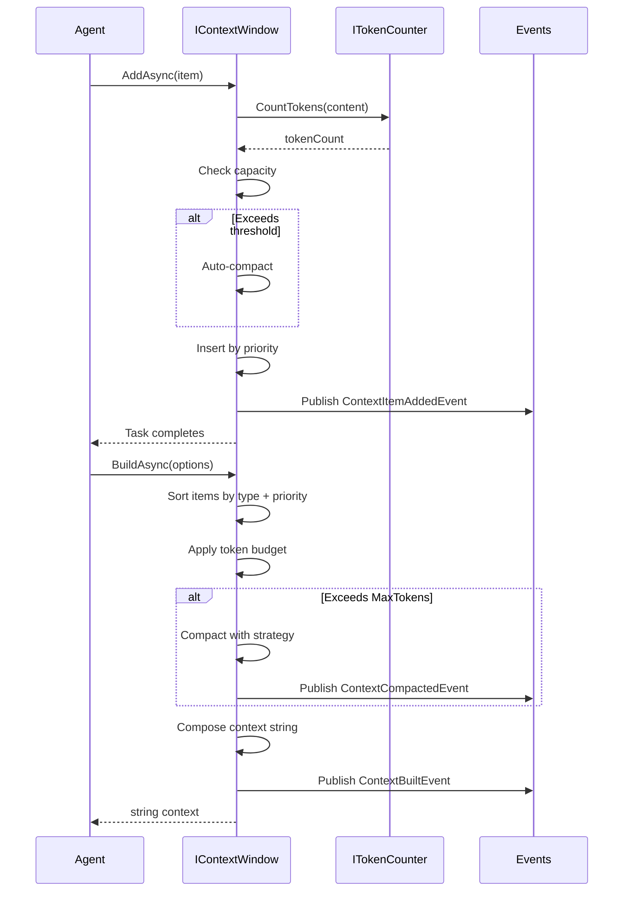
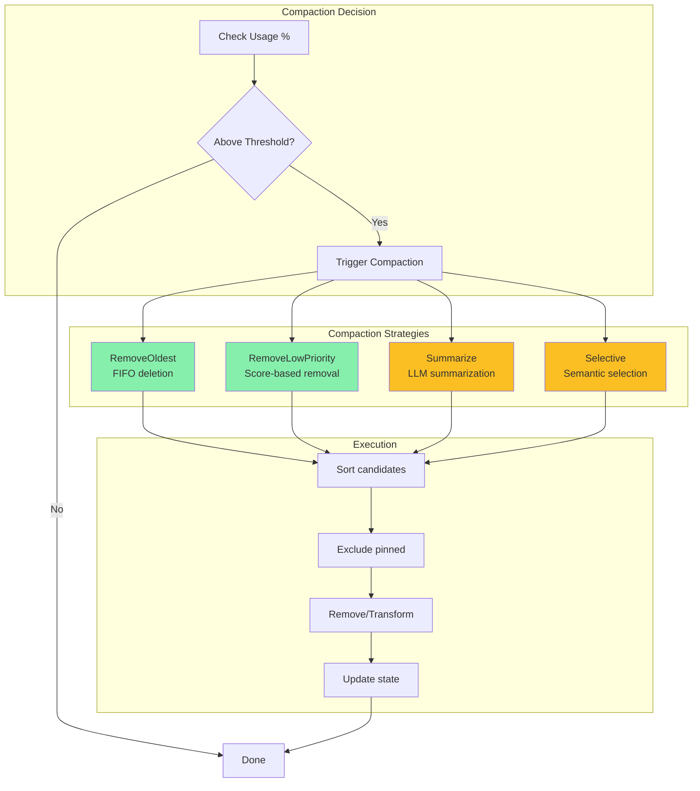

# LDS-01: Context Window Manager

## 1. Metadata & Categorization

| Field | Value |
| :--- | :--- |
| **Feature ID** | `MEM-CTX-01` |
| **Feature Name** | Context Window Manager |
| **Target Version** | `v0.12.4c` |
| **Module Scope** | `Lexichord.Modules.Agents` |
| **Swimlane** | Memory |
| **License Tier** | Core |
| **Feature Gate Key** | `FeatureFlags.Agents.Memory.ContextWindow` |
| **Author** | Agent Architecture Lead |
| **Reviewer** | Lead Architect |
| **Status** | Draft |
| **Last Updated** | 2026-02-04 |
| **Parent Spec** | [LCS-SBD-v0.12.4-AGT](./LCS-SBD-v0.12.4-AGT.md) |
| **Depends On** | [v0.12.4a (Working Memory)](./LCS-SBD-v0.12.4a-WRK.md) |
| **Estimated Hours** | 10 |

---

## 2. Executive Summary

### 2.1 The Requirement

Agents need to compose context for LLM calls within strict token limits. Without intelligent context management, agents risk truncation, context overflow, or inefficient use of available tokens. The system needs token-aware composition, priority-based ordering, and automatic compaction when approaching limits.

### 2.2 The Proposed Solution

Implement a context window manager providing:
- `IContextWindow` interface for token-aware context composition
- `ContextItem` records with priority, type, and token counts
- `ContextItemType` classification for organizational ordering
- `CompactionStrategy` enum for automatic context reduction
- Token counting integration for accurate budget management
- Pinned items that survive compaction
- Build/Compact/Clear lifecycle methods

---

## 3. Architecture & Modular Strategy

### 3.1 Dependencies

**Upstream Modules:**
- `Lexichord.Modules.Agents.Abstractions` — `IAgent`, `AgentId` (v0.12.1a)
- `Lexichord.Modules.Agents` — `IWorkingMemory` (v0.12.4a)
- `Lexichord.Host` — `IMediator`, `ITokenCounter`

**NuGet Packages:**
- `System.Text.Json` (serialization)
- `MediatR` (event publishing)
- `Microsoft.Extensions.Logging.Abstractions` (logging)
- `Microsoft.ML.Tokenizers` (token counting)

### 3.2 Licensing Behavior

- **Load Behavior:** [x] **Soft Gate** — Core tier gets basic compaction (RemoveOldest, RemoveLowPriority). Advanced strategies (Summarize, Selective) require Teams+.
- **Fallback Experience:** Core users have full context window management with basic compaction. Advanced compaction strategies return `LicenseRestrictionException` for Core/WriterPro.

---

## 4. Data Contract (The API)

### 4.1 Context Window Interface

```csharp
namespace Lexichord.Modules.Agents;

/// <summary>
/// Manages token-aware context composition with compaction strategies.
/// </summary>
/// <remarks>
/// <para>
/// The context window manages what information is included in LLM prompts.
/// It tracks token usage and automatically handles context that exceeds
/// the configured maximum tokens.
/// </para>
/// <para>
/// Items are ordered by type priority (SystemPrompt > UserMessage > etc.)
/// and then by individual priority within each type.
/// </para>
/// <para>
/// Compaction is triggered automatically when token usage exceeds a threshold
/// (default 85%). Manual compaction can also be invoked.
/// </para>
/// <para>
/// Thread Safety: All methods are thread-safe and can be called concurrently.
/// </para>
/// </remarks>
public interface IContextWindow
{
    /// <summary>
    /// Gets the agent ID this context window belongs to.
    /// </summary>
    AgentId AgentId { get; }

    /// <summary>
    /// Maximum tokens available in the context window.
    /// </summary>
    /// <remarks>
    /// Set based on the model configuration. Typical values:
    /// - GPT-4: 8,192 or 32,768
    /// - GPT-4 Turbo: 128,000
    /// - Claude: 100,000 or 200,000
    /// </remarks>
    int MaxTokens { get; }

    /// <summary>
    /// Currently used tokens in the context.
    /// </summary>
    int CurrentTokens { get; }

    /// <summary>
    /// Available tokens remaining.
    /// </summary>
    int AvailableTokens => MaxTokens - CurrentTokens;

    /// <summary>
    /// Percentage of context used (0-100).
    /// </summary>
    float UsagePercent => MaxTokens > 0
        ? (CurrentTokens / (float)MaxTokens) * 100f
        : 0f;

    /// <summary>
    /// Threshold percentage at which automatic compaction triggers (default 85).
    /// </summary>
    float CompactionThreshold { get; set; }

    /// <summary>
    /// Default compaction strategy for automatic compaction.
    /// </summary>
    CompactionStrategy DefaultCompactionStrategy { get; set; }

    /// <summary>
    /// Number of items currently in the context window.
    /// </summary>
    int ItemCount { get; }

    /// <summary>
    /// Adds an item to the context window.
    /// </summary>
    /// <param name="item">The item to add.</param>
    /// <param name="ct">Cancellation token.</param>
    /// <returns>Task completing when item is added.</returns>
    /// <exception cref="ArgumentNullException">Item is null.</exception>
    /// <exception cref="ArgumentException">Item content is empty.</exception>
    /// <remarks>
    /// <para>
    /// If adding the item would exceed MaxTokens and no compaction strategy
    /// can make room, ContextWindowFullException is thrown.
    /// </para>
    /// <para>
    /// Token count is calculated automatically if not provided.
    /// </para>
    /// </remarks>
    Task AddAsync(
        ContextItem item,
        CancellationToken ct = default);

    /// <summary>
    /// Adds multiple items in a batch operation.
    /// </summary>
    /// <param name="items">The items to add.</param>
    /// <param name="ct">Cancellation token.</param>
    /// <returns>Number of items successfully added.</returns>
    Task<int> AddRangeAsync(
        IEnumerable<ContextItem> items,
        CancellationToken ct = default);

    /// <summary>
    /// Removes a specific item from the context window.
    /// </summary>
    /// <param name="itemId">The ID of the item to remove.</param>
    /// <param name="ct">Cancellation token.</param>
    /// <returns>True if removed; false if not found.</returns>
    Task<bool> RemoveAsync(
        Guid itemId,
        CancellationToken ct = default);

    /// <summary>
    /// Updates the priority of an existing item.
    /// </summary>
    /// <param name="itemId">The ID of the item to update.</param>
    /// <param name="newPriority">The new priority (0-100).</param>
    /// <param name="ct">Cancellation token.</param>
    /// <returns>True if updated; false if not found.</returns>
    Task<bool> UpdatePriorityAsync(
        Guid itemId,
        int newPriority,
        CancellationToken ct = default);

    /// <summary>
    /// Pins an item so it survives compaction.
    /// </summary>
    /// <param name="itemId">The ID of the item to pin.</param>
    /// <param name="ct">Cancellation token.</param>
    /// <returns>True if pinned; false if not found.</returns>
    Task<bool> PinAsync(
        Guid itemId,
        CancellationToken ct = default);

    /// <summary>
    /// Unpins an item, allowing it to be compacted.
    /// </summary>
    /// <param name="itemId">The ID of the item to unpin.</param>
    /// <param name="ct">Cancellation token.</param>
    /// <returns>True if unpinned; false if not found.</returns>
    Task<bool> UnpinAsync(
        Guid itemId,
        CancellationToken ct = default);

    /// <summary>
    /// Builds the complete context string for the model.
    /// </summary>
    /// <param name="options">Options controlling context building.</param>
    /// <param name="ct">Cancellation token.</param>
    /// <returns>The composed context string respecting token limits.</returns>
    /// <remarks>
    /// <para>
    /// Items are ordered by type priority then individual priority.
    /// Pinned items are always included first.
    /// </para>
    /// <para>
    /// If context exceeds MaxTokens, automatic compaction is applied.
    /// </para>
    /// </remarks>
    Task<string> BuildAsync(
        BuildContextOptions? options = null,
        CancellationToken ct = default);

    /// <summary>
    /// Builds context and returns structured output with metadata.
    /// </summary>
    /// <param name="options">Options controlling context building.</param>
    /// <param name="ct">Cancellation token.</param>
    /// <returns>Built context with metadata about included items.</returns>
    Task<BuiltContext> BuildStructuredAsync(
        BuildContextOptions? options = null,
        CancellationToken ct = default);

    /// <summary>
    /// Compacts the context using the specified strategy.
    /// </summary>
    /// <param name="strategy">The compaction strategy to use.</param>
    /// <param name="targetPercent">Target usage percentage after compaction (default 70).</param>
    /// <param name="ct">Cancellation token.</param>
    /// <returns>Number of tokens freed by compaction.</returns>
    /// <exception cref="LicenseRestrictionException">
    /// Thrown for Summarize/Selective strategies on Core/WriterPro tiers.
    /// </exception>
    /// <remarks>
    /// <para>
    /// Pinned items are never removed during compaction.
    /// </para>
    /// <para>
    /// Compaction strategies:
    /// - RemoveOldest: FIFO removal (Core+)
    /// - RemoveLowPriority: Priority-based removal (Core+)
    /// - Summarize: LLM summarization of low-priority items (Teams+)
    /// - Selective: Semantic relevance-based selection (Teams+)
    /// </para>
    /// </remarks>
    Task<int> CompactAsync(
        CompactionStrategy strategy = CompactionStrategy.RemoveLowPriority,
        float targetPercent = 70f,
        CancellationToken ct = default);

    /// <summary>
    /// Clears all context items except pinned items.
    /// </summary>
    /// <param name="includePinned">If true, also clear pinned items.</param>
    /// <param name="ct">Cancellation token.</param>
    /// <returns>Number of items cleared.</returns>
    Task<int> ClearAsync(
        bool includePinned = false,
        CancellationToken ct = default);

    /// <summary>
    /// Gets all context items currently in the window.
    /// </summary>
    /// <returns>Ordered list of context items.</returns>
    IReadOnlyList<ContextItem> GetItems();

    /// <summary>
    /// Gets items by type.
    /// </summary>
    /// <param name="type">The type to filter by.</param>
    /// <returns>Items of the specified type.</returns>
    IReadOnlyList<ContextItem> GetItems(ContextItemType type);

    /// <summary>
    /// Gets pinned items only.
    /// </summary>
    /// <returns>All pinned items.</returns>
    IReadOnlyList<ContextItem> GetPinnedItems();

    /// <summary>
    /// Creates a snapshot of the current context state.
    /// </summary>
    /// <returns>Context snapshot for persistence.</returns>
    ContextSnapshot CreateSnapshot();

    /// <summary>
    /// Restores context from a snapshot.
    /// </summary>
    /// <param name="snapshot">The snapshot to restore.</param>
    /// <param name="ct">Cancellation token.</param>
    /// <returns>Task completing when restored.</returns>
    Task RestoreFromSnapshotAsync(
        ContextSnapshot snapshot,
        CancellationToken ct = default);

    /// <summary>
    /// Gets context window statistics.
    /// </summary>
    /// <returns>Current statistics.</returns>
    ContextWindowStats GetStats();
}
```

### 4.2 Context Item Record

```csharp
namespace Lexichord.Modules.Agents.Abstractions;

/// <summary>
/// A single item in the context window.
/// </summary>
/// <remarks>
/// <para>
/// Context items represent discrete pieces of information that compose
/// the LLM context. Each item has a type, priority, and token count.
/// </para>
/// <para>
/// Items are ordered by type priority (SystemPrompt first, then by
/// ContextItemType enum order), then by individual priority descending
/// within each type.
/// </para>
/// </remarks>
public sealed record ContextItem
{
    /// <summary>
    /// Unique identifier for this item.
    /// </summary>
    public Guid Id { get; init; } = Guid.NewGuid();

    /// <summary>
    /// The text content of this item.
    /// </summary>
    public required string Content { get; init; }

    /// <summary>
    /// Type of context item for categorization and ordering.
    /// </summary>
    public required ContextItemType Type { get; init; }

    /// <summary>
    /// Priority within type (0-100, higher = more important).
    /// </summary>
    /// <remarks>
    /// Default is 50 (normal priority). Use 0-30 for low priority,
    /// 31-70 for normal, 71-100 for high priority items.
    /// </remarks>
    public int Priority { get; init; } = 50;

    /// <summary>
    /// Number of tokens this item consumes.
    /// </summary>
    /// <remarks>
    /// If not provided, will be calculated automatically using
    /// the configured token counter.
    /// </remarks>
    public int TokenCount { get; init; }

    /// <summary>
    /// Whether this item is pinned (survives compaction).
    /// </summary>
    public bool Pinned { get; init; } = false;

    /// <summary>
    /// When this item was added to the context.
    /// </summary>
    public DateTimeOffset AddedAt { get; init; } = DateTimeOffset.UtcNow;

    /// <summary>
    /// Optional source reference (e.g., memory entry ID, message ID).
    /// </summary>
    public string? SourceRef { get; init; }

    /// <summary>
    /// Optional role for message-type items (user, assistant, system).
    /// </summary>
    public string? Role { get; init; }

    /// <summary>
    /// Custom metadata for this item.
    /// </summary>
    public IReadOnlyDictionary<string, object>? Metadata { get; init; }
}

/// <summary>
/// Types of context items for categorization and ordering.
/// </summary>
/// <remarks>
/// Items are ordered by type in this enum's order (lower value = higher priority).
/// </remarks>
public enum ContextItemType
{
    /// <summary>
    /// Core system instructions (always first).
    /// </summary>
    SystemPrompt = 0,

    /// <summary>
    /// Operational instructions for the current task.
    /// </summary>
    Instruction = 1,

    /// <summary>
    /// Retrieved documents from RAG or memory.
    /// </summary>
    RetrievedDocument = 2,

    /// <summary>
    /// Items from working memory.
    /// </summary>
    WorkingMemory = 3,

    /// <summary>
    /// Output from tool executions.
    /// </summary>
    ToolResult = 4,

    /// <summary>
    /// User input messages.
    /// </summary>
    UserMessage = 5,

    /// <summary>
    /// Agent/assistant response messages.
    /// </summary>
    AssistantMessage = 6,

    /// <summary>
    /// Miscellaneous context items.
    /// </summary>
    Other = 99
}

/// <summary>
/// Strategies for compacting context when approaching token limits.
/// </summary>
public enum CompactionStrategy
{
    /// <summary>
    /// Remove oldest items first (FIFO).
    /// </summary>
    /// <remarks>
    /// Available to all tiers. Simple and predictable but may remove
    /// important older context.
    /// </remarks>
    RemoveOldest = 0,

    /// <summary>
    /// Remove items with lowest priority scores.
    /// </summary>
    /// <remarks>
    /// Available to all tiers. Respects priority hints but doesn't
    /// consider semantic relevance.
    /// </remarks>
    RemoveLowPriority = 1,

    /// <summary>
    /// Summarize low-priority items using LLM.
    /// </summary>
    /// <remarks>
    /// Requires Teams tier. Preserves information through summarization
    /// but incurs additional LLM cost.
    /// </remarks>
    Summarize = 2,

    /// <summary>
    /// Intelligently select most relevant items using semantic analysis.
    /// </summary>
    /// <remarks>
    /// Requires Teams tier. Uses embeddings to select items most
    /// relevant to the current query/task.
    /// </remarks>
    Selective = 3
}

/// <summary>
/// Options for building context.
/// </summary>
public sealed record BuildContextOptions
{
    /// <summary>
    /// Include system prompt items.
    /// </summary>
    public bool IncludeSystemPrompt { get; init; } = true;

    /// <summary>
    /// Include instruction items.
    /// </summary>
    public bool IncludeInstructions { get; init; } = true;

    /// <summary>
    /// Include recent conversation history.
    /// </summary>
    public bool IncludeRecentHistory { get; init; } = true;

    /// <summary>
    /// Maximum number of history items to include.
    /// </summary>
    public int MaxHistoryItems { get; init; } = 10;

    /// <summary>
    /// Include relevant memory items.
    /// </summary>
    public bool IncludeRelevantMemory { get; init; } = true;

    /// <summary>
    /// Query for memory retrieval (for selective inclusion).
    /// </summary>
    public string? QueryForMemoryRetrieval { get; init; }

    /// <summary>
    /// Separator between context sections.
    /// </summary>
    public string SectionSeparator { get; init; } = "\n\n---\n\n";

    /// <summary>
    /// Format for message-type items.
    /// </summary>
    /// <remarks>
    /// Use {role} and {content} placeholders.
    /// Example: "[{role}]: {content}"
    /// </remarks>
    public string? MessageFormat { get; init; }

    /// <summary>
    /// Reserve tokens for response (excluded from context budget).
    /// </summary>
    public int ReserveForResponse { get; init; } = 1000;
}

/// <summary>
/// Result of building context with metadata.
/// </summary>
public sealed record BuiltContext
{
    /// <summary>
    /// The composed context string.
    /// </summary>
    public required string Content { get; init; }

    /// <summary>
    /// Total tokens in the built context.
    /// </summary>
    public required int TotalTokens { get; init; }

    /// <summary>
    /// IDs of items included in the context.
    /// </summary>
    public required IReadOnlyList<Guid> IncludedItemIds { get; init; }

    /// <summary>
    /// IDs of items excluded due to limits.
    /// </summary>
    public required IReadOnlyList<Guid> ExcludedItemIds { get; init; }

    /// <summary>
    /// Whether compaction was applied.
    /// </summary>
    public required bool WasCompacted { get; init; }

    /// <summary>
    /// Tokens freed by compaction (0 if not compacted).
    /// </summary>
    public int TokensFreedByCompaction { get; init; }
}

/// <summary>
/// Context snapshot for persistence.
/// </summary>
public sealed record ContextSnapshot
{
    /// <summary>
    /// Maximum tokens configuration.
    /// </summary>
    public int MaxTokens { get; init; }

    /// <summary>
    /// All context items at snapshot time.
    /// </summary>
    public IReadOnlyList<ContextItem> Items { get; init; } = [];

    /// <summary>
    /// When the snapshot was created.
    /// </summary>
    public DateTimeOffset CreatedAt { get; init; } = DateTimeOffset.UtcNow;

    /// <summary>
    /// Compaction threshold at snapshot time.
    /// </summary>
    public float CompactionThreshold { get; init; }

    /// <summary>
    /// Default strategy at snapshot time.
    /// </summary>
    public CompactionStrategy DefaultStrategy { get; init; }
}

/// <summary>
/// Statistics about context window state.
/// </summary>
public sealed record ContextWindowStats
{
    /// <summary>
    /// Total items in the window.
    /// </summary>
    public int TotalItems { get; init; }

    /// <summary>
    /// Pinned item count.
    /// </summary>
    public int PinnedItems { get; init; }

    /// <summary>
    /// Current token usage.
    /// </summary>
    public int CurrentTokens { get; init; }

    /// <summary>
    /// Maximum tokens allowed.
    /// </summary>
    public int MaxTokens { get; init; }

    /// <summary>
    /// Available tokens.
    /// </summary>
    public int AvailableTokens => MaxTokens - CurrentTokens;

    /// <summary>
    /// Usage percentage.
    /// </summary>
    public float UsagePercent { get; init; }

    /// <summary>
    /// Item counts by type.
    /// </summary>
    public IReadOnlyDictionary<ContextItemType, int> ItemsByType { get; init; } =
        new Dictionary<ContextItemType, int>();

    /// <summary>
    /// Token counts by type.
    /// </summary>
    public IReadOnlyDictionary<ContextItemType, int> TokensByType { get; init; } =
        new Dictionary<ContextItemType, int>();

    /// <summary>
    /// Number of compactions performed.
    /// </summary>
    public int CompactionCount { get; init; }

    /// <summary>
    /// Total tokens freed by compaction.
    /// </summary>
    public long TotalTokensFreed { get; init; }
}
```

### 4.3 MediatR Events

```csharp
namespace Lexichord.Modules.Agents.Events;

/// <summary>
/// Published when an item is added to the context window.
/// </summary>
public sealed record ContextItemAddedEvent : INotification
{
    public required AgentId AgentId { get; init; }
    public required Guid ItemId { get; init; }
    public required ContextItemType Type { get; init; }
    public required int TokenCount { get; init; }
    public required int TotalTokensAfter { get; init; }
    public required DateTimeOffset Timestamp { get; init; }
}

/// <summary>
/// Published when an item is removed from the context window.
/// </summary>
public sealed record ContextItemRemovedEvent : INotification
{
    public required AgentId AgentId { get; init; }
    public required Guid ItemId { get; init; }
    public required ContextItemType Type { get; init; }
    public required int TokenCount { get; init; }
    public required string Reason { get; init; }  // "Manual", "Compaction", "Clear"
    public required DateTimeOffset Timestamp { get; init; }
}

/// <summary>
/// Published when context is compacted.
/// </summary>
public sealed record ContextCompactedEvent : INotification
{
    public required AgentId AgentId { get; init; }
    public required CompactionStrategy Strategy { get; init; }
    public required int ItemsRemoved { get; init; }
    public required int TokensFreed { get; init; }
    public required float UsageBeforePercent { get; init; }
    public required float UsageAfterPercent { get; init; }
    public required DateTimeOffset Timestamp { get; init; }
}

/// <summary>
/// Published when context is cleared.
/// </summary>
public sealed record ContextClearedEvent : INotification
{
    public required AgentId AgentId { get; init; }
    public required int ItemsCleared { get; init; }
    public required int TokensCleared { get; init; }
    public required bool IncludedPinned { get; init; }
    public required DateTimeOffset Timestamp { get; init; }
}

/// <summary>
/// Published when context is built.
/// </summary>
public sealed record ContextBuiltEvent : INotification
{
    public required AgentId AgentId { get; init; }
    public required int ItemsIncluded { get; init; }
    public required int ItemsExcluded { get; init; }
    public required int TotalTokens { get; init; }
    public required bool WasCompacted { get; init; }
    public required TimeSpan BuildTime { get; init; }
    public required DateTimeOffset Timestamp { get; init; }
}
```

---

## 5. Implementation Logic

### 5.1 Flow Diagram



### 5.2 Compaction Flow



### 5.3 Implementation Notes

```csharp
namespace Lexichord.Modules.Agents.Memory;

/// <summary>
/// Context window implementation with priority ordering and compaction.
/// </summary>
internal sealed class ContextWindow : IContextWindow
{
    private readonly AgentId _agentId;
    private readonly ITokenCounter _tokenCounter;
    private readonly ILicenseService _licenseService;
    private readonly IMediator _mediator;
    private readonly ILogger<ContextWindow> _logger;

    private readonly SortedList<ContextItemKey, ContextItem> _items = new();
    private readonly object _lock = new();

    private int _currentTokens;
    private int _compactionCount;
    private long _totalTokensFreed;

    public AgentId AgentId => _agentId;
    public int MaxTokens { get; }
    public int CurrentTokens => _currentTokens;
    public float CompactionThreshold { get; set; } = 85f;
    public CompactionStrategy DefaultCompactionStrategy { get; set; } =
        CompactionStrategy.RemoveLowPriority;

    public int ItemCount
    {
        get { lock (_lock) return _items.Count; }
    }

    public async Task AddAsync(
        ContextItem item,
        CancellationToken ct = default)
    {
        ArgumentNullException.ThrowIfNull(item);
        if (string.IsNullOrWhiteSpace(item.Content))
            throw new ArgumentException("Item content cannot be empty", nameof(item));

        // Calculate tokens if not provided
        var tokenCount = item.TokenCount > 0
            ? item.TokenCount
            : _tokenCounter.CountTokens(item.Content);

        var itemWithTokens = item with { TokenCount = tokenCount };

        lock (_lock)
        {
            // Check if we need to compact
            var projectedUsage = (_currentTokens + tokenCount) / (float)MaxTokens * 100f;
            if (projectedUsage > CompactionThreshold)
            {
                CompactInternal(DefaultCompactionStrategy, CompactionThreshold - 15);
            }

            // Check if there's room now
            if (_currentTokens + tokenCount > MaxTokens)
            {
                throw new ContextWindowFullException(
                    _currentTokens,
                    MaxTokens,
                    tokenCount);
            }

            var key = new ContextItemKey(item.Type, item.Priority, item.AddedAt);
            _items.Add(key, itemWithTokens);
            _currentTokens += tokenCount;
        }

        _logger.LogDebug(
            "Added context item {ItemId} type={Type} tokens={Tokens} for agent {AgentId}",
            item.Id,
            item.Type,
            tokenCount,
            _agentId);

        await _mediator.Publish(new ContextItemAddedEvent
        {
            AgentId = _agentId,
            ItemId = item.Id,
            Type = item.Type,
            TokenCount = tokenCount,
            TotalTokensAfter = _currentTokens,
            Timestamp = DateTimeOffset.UtcNow
        }, ct);
    }

    public async Task<string> BuildAsync(
        BuildContextOptions? options = null,
        CancellationToken ct = default)
    {
        var result = await BuildStructuredAsync(options, ct);
        return result.Content;
    }

    public async Task<BuiltContext> BuildStructuredAsync(
        BuildContextOptions? options = null,
        CancellationToken ct = default)
    {
        options ??= new BuildContextOptions();
        var stopwatch = Stopwatch.StartNew();

        List<ContextItem> itemsToInclude;
        List<Guid> excludedIds = new();
        var wasCompacted = false;
        var tokensFreed = 0;

        lock (_lock)
        {
            var budget = MaxTokens - options.ReserveForResponse;

            // Check if compaction needed
            if (_currentTokens > budget)
            {
                tokensFreed = CompactInternal(DefaultCompactionStrategy, 70);
                wasCompacted = true;
            }

            // Collect items respecting options
            itemsToInclude = CollectItemsForBuild(options, budget, excludedIds);
        }

        // Build the context string
        var sb = new StringBuilder();
        var separator = options.SectionSeparator;
        var messageFormat = options.MessageFormat ?? "[{role}]: {content}";
        var includedIds = new List<Guid>();
        var totalTokens = 0;

        foreach (var item in itemsToInclude)
        {
            if (sb.Length > 0)
                sb.Append(separator);

            var content = item.Role != null
                ? messageFormat.Replace("{role}", item.Role).Replace("{content}", item.Content)
                : item.Content;

            sb.Append(content);
            includedIds.Add(item.Id);
            totalTokens += item.TokenCount;
        }

        stopwatch.Stop();

        await _mediator.Publish(new ContextBuiltEvent
        {
            AgentId = _agentId,
            ItemsIncluded = includedIds.Count,
            ItemsExcluded = excludedIds.Count,
            TotalTokens = totalTokens,
            WasCompacted = wasCompacted,
            BuildTime = stopwatch.Elapsed,
            Timestamp = DateTimeOffset.UtcNow
        }, ct);

        return new BuiltContext
        {
            Content = sb.ToString(),
            TotalTokens = totalTokens,
            IncludedItemIds = includedIds,
            ExcludedItemIds = excludedIds,
            WasCompacted = wasCompacted,
            TokensFreedByCompaction = tokensFreed
        };
    }

    public async Task<int> CompactAsync(
        CompactionStrategy strategy = CompactionStrategy.RemoveLowPriority,
        float targetPercent = 70f,
        CancellationToken ct = default)
    {
        // Check license for advanced strategies
        if (strategy is CompactionStrategy.Summarize or CompactionStrategy.Selective)
        {
            if (!_licenseService.HasFeature("FeatureFlags.Agents.Memory.ContextWindow.Advanced"))
            {
                throw new LicenseRestrictionException(
                    $"Compaction strategy '{strategy}' requires Teams tier or higher",
                    "FeatureFlags.Agents.Memory.ContextWindow.Advanced");
            }
        }

        int tokensFreed;
        float usageBefore;
        float usageAfter;
        int itemsRemoved;

        lock (_lock)
        {
            usageBefore = UsagePercent;
            var countBefore = _items.Count;
            tokensFreed = CompactInternal(strategy, targetPercent);
            itemsRemoved = countBefore - _items.Count;
            usageAfter = UsagePercent;
        }

        _logger.LogInfo(
            "Compacted context for agent {AgentId}: strategy={Strategy}, freed={Tokens}tokens, usage {Before}%→{After}%",
            _agentId,
            strategy,
            tokensFreed,
            usageBefore,
            usageAfter);

        await _mediator.Publish(new ContextCompactedEvent
        {
            AgentId = _agentId,
            Strategy = strategy,
            ItemsRemoved = itemsRemoved,
            TokensFreed = tokensFreed,
            UsageBeforePercent = usageBefore,
            UsageAfterPercent = usageAfter,
            Timestamp = DateTimeOffset.UtcNow
        }, ct);

        return tokensFreed;
    }

    private int CompactInternal(CompactionStrategy strategy, float targetPercent)
    {
        var targetTokens = (int)(MaxTokens * (targetPercent / 100f));
        var tokensToFree = _currentTokens - targetTokens;

        if (tokensToFree <= 0)
            return 0;

        var tokensFreed = 0;
        var candidates = _items
            .Where(kvp => !kvp.Value.Pinned)
            .ToList();

        // Sort candidates by strategy
        candidates = strategy switch
        {
            CompactionStrategy.RemoveOldest =>
                candidates.OrderBy(kvp => kvp.Value.AddedAt).ToList(),

            CompactionStrategy.RemoveLowPriority =>
                candidates.OrderBy(kvp => kvp.Value.Priority)
                          .ThenBy(kvp => kvp.Value.AddedAt).ToList(),

            _ => candidates.OrderBy(kvp => kvp.Value.Priority).ToList()
        };

        foreach (var kvp in candidates)
        {
            if (tokensFreed >= tokensToFree)
                break;

            _items.Remove(kvp.Key);
            tokensFreed += kvp.Value.TokenCount;
            _currentTokens -= kvp.Value.TokenCount;
        }

        _compactionCount++;
        _totalTokensFreed += tokensFreed;

        return tokensFreed;
    }

    // ... additional implementation
}

/// <summary>
/// Composite key for sorted context items.
/// </summary>
internal readonly record struct ContextItemKey : IComparable<ContextItemKey>
{
    public ContextItemType Type { get; }
    public int Priority { get; }
    public DateTimeOffset AddedAt { get; }

    public ContextItemKey(ContextItemType type, int priority, DateTimeOffset addedAt)
    {
        Type = type;
        Priority = priority;
        AddedAt = addedAt;
    }

    public int CompareTo(ContextItemKey other)
    {
        // Lower type value = higher priority
        var typeCompare = Type.CompareTo(other.Type);
        if (typeCompare != 0) return typeCompare;

        // Higher priority value = higher priority (descending)
        var priorityCompare = other.Priority.CompareTo(Priority);
        if (priorityCompare != 0) return priorityCompare;

        // Older items first (ascending)
        return AddedAt.CompareTo(other.AddedAt);
    }
}
```

---

## 6. Data Persistence (Database)

Context window state is not persisted to database directly. Persistence is handled via `ContextSnapshot` in v0.12.4e (Memory Persistence).

---

## 7. Observability & Logging

### 7.1 Log Messages

| Level | Template |
|:------|:---------|
| Debug | `"Added context item {ItemId} type={Type} tokens={Tokens} for agent {AgentId}"` |
| Debug | `"Removed context item {ItemId} reason={Reason} for agent {AgentId}"` |
| Debug | `"Built context: {ItemCount} items, {Tokens} tokens for agent {AgentId}"` |
| Info | `"Context window initialized for agent {AgentId}, max={MaxTokens} tokens"` |
| Info | `"Compacted context for agent {AgentId}: strategy={Strategy}, freed={Tokens}tokens"` |
| Warning | `"Context usage at {Percent}% for agent {AgentId}, triggering compaction"` |
| Error | `"Context window full for agent {AgentId}: current={Current}, max={Max}, requested={Requested}"` |

### 7.2 Metrics

| Metric | Type | Description |
|:-------|:-----|:------------|
| `agents.context.items` | Gauge | Current item count |
| `agents.context.tokens` | Gauge | Current token usage |
| `agents.context.usage_percent` | Gauge | Usage percentage |
| `agents.context.add_latency_ms` | Histogram | Add operation latency |
| `agents.context.build_latency_ms` | Histogram | Build operation latency |
| `agents.context.compaction_total` | Counter | Total compaction operations |
| `agents.context.tokens_freed_total` | Counter | Total tokens freed by compaction |

---

## 8. Security & Safety

### 8.1 Resource Protection

- Token budget enforced strictly (no overflow)
- Compaction threshold prevents context overflow
- Maximum items per window: 1,000

### 8.2 Input Validation

- Content MUST be non-null, non-empty
- Priority MUST be 0-100
- Type MUST be valid enum value

---

## 9. Acceptance Criteria (QA)

### 9.1 Functional Criteria

1. **[Add/Get]** AddAsync adds item; GetItems returns it in correct order.
2. **[Token Tracking]** CurrentTokens accurately reflects item token counts.
3. **[Compaction]** CompactAsync reduces tokens to target percentage.
4. **[Priority Order]** Items ordered by type then priority.
5. **[Pinning]** Pinned items survive compaction.

### 9.2 Non-Functional Criteria

1. **[Latency]** AddAsync P95 < 10ms.
2. **[Latency]** BuildAsync P95 < 200ms.
3. **[Accuracy]** Token counting within 5% of actual model tokenization.

---

## 10. Test Scenarios

### 10.1 Unit Tests

```gherkin
Scenario: Add items and verify ordering
  Given context window with 4096 max tokens
  When I add SystemPrompt with priority 50
  And I add UserMessage with priority 80
  And I add UserMessage with priority 30
  Then GetItems returns SystemPrompt first
  And UserMessage(80) before UserMessage(30)

Scenario: Automatic compaction on threshold
  Given context window at 84% capacity
  And CompactionThreshold is 85%
  When I add an item that would reach 90%
  Then automatic compaction is triggered
  And item is added successfully

Scenario: Pinned items survive compaction
  Given context window with pinned and unpinned items
  When I compact with RemoveLowPriority strategy
  Then pinned items remain
  And only unpinned items are removed
```

### 10.2 Integration Tests

```gherkin
Scenario: Build context respects token budget
  Given context window with 1000 max tokens
  And 10 items totaling 1500 tokens
  When I build context with 200 reserved for response
  Then built context is <= 800 tokens
  And lower priority items are excluded

Scenario: Context snapshot and restore
  Given context window with 5 items
  When I create a snapshot
  And clear the context
  And restore from snapshot
  Then all 5 items are restored
  And ordering is preserved
```

---

## 11. Changelog

| Version | Date | Author | Changes |
|:--------|:-----|:-------|:--------|
| 1.0.0 | 2026-02-04 | Agent Architecture Lead | Initial specification |

---

**End of Specification**
