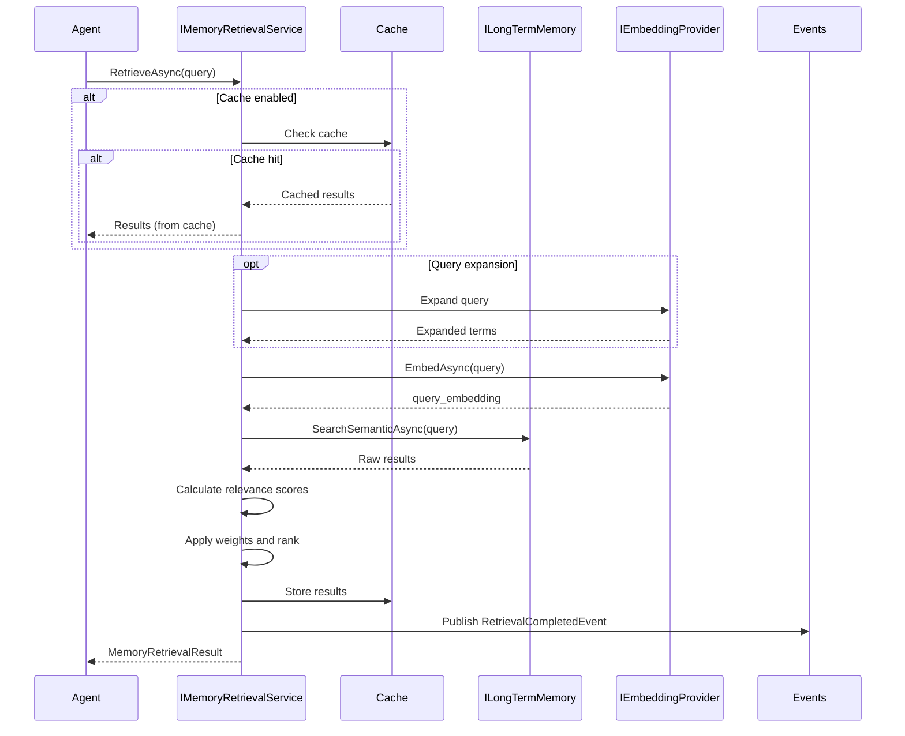
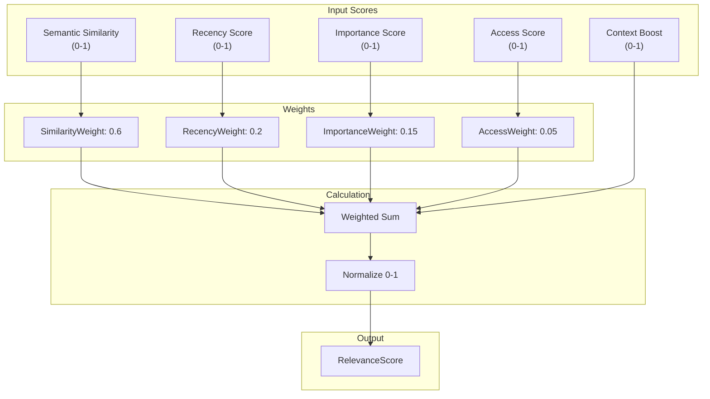

# LDS-01: Memory Retrieval

## 1. Metadata & Categorization

| Field | Value |
| :--- | :--- |
| **Feature ID** | `MEM-RET-01` |
| **Feature Name** | Memory Retrieval |
| **Target Version** | `v0.12.4d` |
| **Module Scope** | `Lexichord.Modules.Agents` |
| **Swimlane** | Memory |
| **License Tier** | Teams |
| **Feature Gate Key** | `FeatureFlags.Agents.Memory.SemanticRetrieval` |
| **Author** | Agent Architecture Lead |
| **Reviewer** | Lead Architect |
| **Status** | Draft |
| **Last Updated** | 2026-02-04 |
| **Parent Spec** | [LCS-SBD-v0.12.4-AGT](./LCS-SBD-v0.12.4-AGT.md) |
| **Depends On** | [v0.12.4b (Long-Term Memory)](./LCS-SBD-v0.12.4b-LTM.md), [v0.12.4c (Context Window)](./LCS-SBD-v0.12.4c-CTX.md), [v0.4.3 RAG Service] |
| **Estimated Hours** | 8 |

---

## 2. Executive Summary

### 2.1 The Requirement

Agents need intelligent memory retrieval that surfaces the most relevant information for the current task. Without semantic retrieval, agents must rely on exact matches or manual tagging, missing valuable context stored in long-term memory. The system needs semantic search, relevance ranking, and automatic context augmentation.

### 2.2 The Proposed Solution

Implement a memory retrieval system providing:
- `MemoryQuery` record for structured retrieval requests
- Semantic search via vector similarity (v0.4.3 RAG Service)
- Relevance ranking with configurable scoring factors
- Automatic context window augmentation
- Query expansion and refinement
- Retrieval caching for performance

---

## 3. Architecture & Modular Strategy

### 3.1 Dependencies

**Upstream Modules:**
- `Lexichord.Modules.Agents` — `ILongTermMemory`, `MemoryEntry` (v0.12.4b)
- `Lexichord.Modules.Agents` — `IContextWindow`, `ContextItem` (v0.12.4c)
- `Lexichord.Modules.Rag` — `IEmbeddingProvider` (v0.4.3)
- `Lexichord.Host` — `IMediator`

**NuGet Packages:**
- `MediatR` (event publishing)
- `Microsoft.Extensions.Caching.Memory` (retrieval caching)
- `Microsoft.Extensions.Logging.Abstractions` (logging)

### 3.2 Licensing Behavior

- **Load Behavior:** [x] **Hard Gate** — Semantic retrieval requires Teams tier. Core/WriterPro receive `LicenseRestrictionException`.
- **Fallback Experience:** Core/WriterPro users see "Upgrade to Teams for intelligent memory retrieval" message. Filter-based retrieval via `ILongTermMemory.SearchByFilterAsync` remains available to WriterPro.

---

## 4. Data Contract (The API)

### 4.1 Memory Retrieval Service

```csharp
namespace Lexichord.Modules.Agents;

/// <summary>
/// Service for intelligent memory retrieval with semantic search and ranking.
/// </summary>
/// <remarks>
/// <para>
/// The memory retrieval service provides advanced query capabilities over
/// long-term memory. It combines semantic similarity with recency, importance,
/// and access patterns to surface the most relevant memories.
/// </para>
/// <para>
/// Retrieval can automatically augment the context window with relevant
/// memories, reducing manual context management overhead.
/// </para>
/// <para>
/// Thread Safety: All methods are thread-safe.
/// </para>
/// </remarks>
public interface IMemoryRetrievalService
{
    /// <summary>
    /// Retrieves memories matching a structured query.
    /// </summary>
    /// <param name="query">The retrieval query specification.</param>
    /// <param name="ct">Cancellation token.</param>
    /// <returns>Ranked list of matching memories.</returns>
    /// <exception cref="LicenseRestrictionException">
    /// Thrown for Core/WriterPro tiers when using semantic search.
    /// </exception>
    Task<MemoryRetrievalResult> RetrieveAsync(
        MemoryQuery query,
        CancellationToken ct = default);

    /// <summary>
    /// Retrieves memories and automatically adds them to context window.
    /// </summary>
    /// <param name="query">The retrieval query specification.</param>
    /// <param name="contextWindow">The context window to augment.</param>
    /// <param name="ct">Cancellation token.</param>
    /// <returns>Number of items added to context.</returns>
    /// <remarks>
    /// <para>
    /// Retrieved memories are added as ContextItemType.RetrievedDocument
    /// with priority based on relevance score.
    /// </para>
    /// <para>
    /// Respects context window token budget; may not add all retrieved items.
    /// </para>
    /// </remarks>
    Task<int> RetrieveToContextAsync(
        MemoryQuery query,
        IContextWindow contextWindow,
        CancellationToken ct = default);

    /// <summary>
    /// Finds memories similar to a reference memory.
    /// </summary>
    /// <param name="referenceId">ID of the reference memory.</param>
    /// <param name="limit">Maximum results.</param>
    /// <param name="ct">Cancellation token.</param>
    /// <returns>Similar memories ranked by similarity.</returns>
    Task<IReadOnlyList<MemorySearchResult>> FindSimilarAsync(
        Guid referenceId,
        int limit = 10,
        CancellationToken ct = default);

    /// <summary>
    /// Gets suggested queries based on recent conversation context.
    /// </summary>
    /// <param name="conversationContext">Recent conversation text.</param>
    /// <param name="ct">Cancellation token.</param>
    /// <returns>Suggested queries to retrieve relevant memories.</returns>
    Task<IReadOnlyList<string>> SuggestQueriesAsync(
        string conversationContext,
        CancellationToken ct = default);

    /// <summary>
    /// Expands a query with related terms and concepts.
    /// </summary>
    /// <param name="query">The original query.</param>
    /// <param name="ct">Cancellation token.</param>
    /// <returns>Expanded query with additional terms.</returns>
    Task<ExpandedQuery> ExpandQueryAsync(
        string query,
        CancellationToken ct = default);

    /// <summary>
    /// Gets retrieval statistics.
    /// </summary>
    /// <param name="ct">Cancellation token.</param>
    /// <returns>Retrieval service statistics.</returns>
    Task<RetrievalStats> GetStatsAsync(CancellationToken ct = default);
}
```

### 4.2 Memory Query Record

```csharp
namespace Lexichord.Modules.Agents.Abstractions;

/// <summary>
/// Structured query for memory retrieval.
/// </summary>
/// <remarks>
/// <para>
/// MemoryQuery combines semantic search, filters, and ranking parameters
/// into a single retrieval request. At minimum, provide a Query or Filters.
/// </para>
/// <para>
/// The final relevance score combines:
/// - Semantic similarity (if Query provided)
/// - Recency weight
/// - Importance weight
/// - Access frequency weight
/// </para>
/// </remarks>
public sealed record MemoryQuery
{
    /// <summary>
    /// Natural language query for semantic search.
    /// </summary>
    /// <remarks>
    /// If null, only filter-based retrieval is performed.
    /// </remarks>
    public string? Query { get; init; }

    /// <summary>
    /// Filter criteria to narrow results.
    /// </summary>
    public MemoryFilter? Filters { get; init; }

    /// <summary>
    /// Maximum results to return.
    /// </summary>
    public int Limit { get; init; } = 10;

    /// <summary>
    /// Minimum relevance score (0-1).
    /// </summary>
    public float MinRelevance { get; init; } = 0.5f;

    /// <summary>
    /// Weight for semantic similarity in scoring (0-1).
    /// </summary>
    public float SimilarityWeight { get; init; } = 0.6f;

    /// <summary>
    /// Weight for recency in scoring (0-1).
    /// </summary>
    /// <remarks>
    /// Higher weight favors recently created memories.
    /// </remarks>
    public float RecencyWeight { get; init; } = 0.2f;

    /// <summary>
    /// Weight for importance in scoring (0-1).
    /// </summary>
    public float ImportanceWeight { get; init; } = 0.15f;

    /// <summary>
    /// Weight for access frequency in scoring (0-1).
    /// </summary>
    public float AccessWeight { get; init; } = 0.05f;

    /// <summary>
    /// Whether to expand the query with related terms.
    /// </summary>
    public bool ExpandQuery { get; init; } = false;

    /// <summary>
    /// Whether to use cached results if available.
    /// </summary>
    public bool UseCache { get; init; } = true;

    /// <summary>
    /// Cache TTL for this query (default 5 minutes).
    /// </summary>
    public TimeSpan CacheTtl { get; init; } = TimeSpan.FromMinutes(5);

    /// <summary>
    /// Context to boost relevance of related memories.
    /// </summary>
    /// <remarks>
    /// Provide recent conversation or task context to improve
    /// relevance scoring of retrieved memories.
    /// </remarks>
    public string? ContextBoost { get; init; }

    /// <summary>
    /// Memory IDs to exclude from results.
    /// </summary>
    public IReadOnlyList<Guid>? ExcludeIds { get; init; }

    /// <summary>
    /// Creates a simple semantic query.
    /// </summary>
    public static MemoryQuery Semantic(string query, int limit = 10) =>
        new() { Query = query, Limit = limit };

    /// <summary>
    /// Creates a filter-only query.
    /// </summary>
    public static MemoryQuery Filtered(MemoryFilter filter, int limit = 100) =>
        new() { Filters = filter, Limit = limit };
}

/// <summary>
/// Result of a memory retrieval operation.
/// </summary>
public sealed record MemoryRetrievalResult
{
    /// <summary>
    /// Retrieved memories ranked by relevance.
    /// </summary>
    public required IReadOnlyList<RankedMemory> Results { get; init; }

    /// <summary>
    /// Total matches found (may exceed returned limit).
    /// </summary>
    public required int TotalMatches { get; init; }

    /// <summary>
    /// The original query used.
    /// </summary>
    public required string OriginalQuery { get; init; }

    /// <summary>
    /// Expanded query if expansion was enabled.
    /// </summary>
    public string? ExpandedQuery { get; init; }

    /// <summary>
    /// Whether results came from cache.
    /// </summary>
    public required bool FromCache { get; init; }

    /// <summary>
    /// Time taken for retrieval.
    /// </summary>
    public required TimeSpan RetrievalTime { get; init; }
}

/// <summary>
/// A memory entry with relevance scoring.
/// </summary>
public sealed record RankedMemory
{
    /// <summary>
    /// The memory entry.
    /// </summary>
    public required MemoryEntry Entry { get; init; }

    /// <summary>
    /// Rank in result set (1-based).
    /// </summary>
    public required int Rank { get; init; }

    /// <summary>
    /// Overall relevance score (0-1).
    /// </summary>
    public required float RelevanceScore { get; init; }

    /// <summary>
    /// Component scores for transparency.
    /// </summary>
    public required RelevanceScores Scores { get; init; }
}

/// <summary>
/// Breakdown of relevance score components.
/// </summary>
public sealed record RelevanceScores
{
    /// <summary>
    /// Semantic similarity score (0-1).
    /// </summary>
    public float Similarity { get; init; }

    /// <summary>
    /// Recency score (0-1).
    /// </summary>
    public float Recency { get; init; }

    /// <summary>
    /// Importance score (0-1).
    /// </summary>
    public float Importance { get; init; }

    /// <summary>
    /// Access frequency score (0-1).
    /// </summary>
    public float AccessFrequency { get; init; }

    /// <summary>
    /// Context boost score (0-1).
    /// </summary>
    public float ContextBoost { get; init; }
}

/// <summary>
/// Result of query expansion.
/// </summary>
public sealed record ExpandedQuery
{
    /// <summary>
    /// Original query.
    /// </summary>
    public required string Original { get; init; }

    /// <summary>
    /// Expanded query with additional terms.
    /// </summary>
    public required string Expanded { get; init; }

    /// <summary>
    /// Terms added during expansion.
    /// </summary>
    public required IReadOnlyList<string> AddedTerms { get; init; }

    /// <summary>
    /// Confidence in the expansion (0-1).
    /// </summary>
    public required float Confidence { get; init; }
}

/// <summary>
/// Retrieval service statistics.
/// </summary>
public sealed record RetrievalStats
{
    /// <summary>
    /// Total retrievals performed.
    /// </summary>
    public long TotalRetrievals { get; init; }

    /// <summary>
    /// Cache hit rate (0-100%).
    /// </summary>
    public float CacheHitRate { get; init; }

    /// <summary>
    /// Average retrieval time (ms).
    /// </summary>
    public double AverageRetrievalTimeMs { get; init; }

    /// <summary>
    /// P95 retrieval time (ms).
    /// </summary>
    public double P95RetrievalTimeMs { get; init; }

    /// <summary>
    /// Average results per query.
    /// </summary>
    public double AverageResultsPerQuery { get; init; }

    /// <summary>
    /// Query expansion usage rate (0-100%).
    /// </summary>
    public float ExpansionUsageRate { get; init; }

    /// <summary>
    /// Context augmentation count.
    /// </summary>
    public long ContextAugmentations { get; init; }
}
```

### 4.3 MediatR Events

```csharp
namespace Lexichord.Modules.Agents.Events;

/// <summary>
/// Published when memory retrieval is completed.
/// </summary>
public sealed record MemoryRetrievalCompletedEvent : INotification
{
    public required AgentId AgentId { get; init; }
    public required string Query { get; init; }
    public required int ResultCount { get; init; }
    public required int TotalMatches { get; init; }
    public required bool FromCache { get; init; }
    public required TimeSpan RetrievalTime { get; init; }
    public required DateTimeOffset Timestamp { get; init; }
}

/// <summary>
/// Published when context is augmented with retrieved memories.
/// </summary>
public sealed record ContextAugmentedEvent : INotification
{
    public required AgentId AgentId { get; init; }
    public required string Query { get; init; }
    public required int ItemsAdded { get; init; }
    public required int TokensAdded { get; init; }
    public required DateTimeOffset Timestamp { get; init; }
}

/// <summary>
/// Published when query expansion is performed.
/// </summary>
public sealed record QueryExpandedEvent : INotification
{
    public required AgentId AgentId { get; init; }
    public required string OriginalQuery { get; init; }
    public required string ExpandedQuery { get; init; }
    public required int TermsAdded { get; init; }
    public required float Confidence { get; init; }
    public required DateTimeOffset Timestamp { get; init; }
}
```

---

## 5. Implementation Logic

### 5.1 Flow Diagram



### 5.2 Relevance Scoring Algorithm



### 5.3 Implementation Notes

```csharp
namespace Lexichord.Modules.Agents.Memory;

/// <summary>
/// Memory retrieval service with semantic search and ranking.
/// </summary>
internal sealed class MemoryRetrievalService : IMemoryRetrievalService
{
    private readonly ILongTermMemory _longTermMemory;
    private readonly IEmbeddingProvider _embeddingProvider;
    private readonly IMemoryCache _cache;
    private readonly IMediator _mediator;
    private readonly ILogger<MemoryRetrievalService> _logger;

    private long _totalRetrievals;
    private long _cacheHits;
    private readonly List<double> _retrievalTimes = new();

    public async Task<MemoryRetrievalResult> RetrieveAsync(
        MemoryQuery query,
        CancellationToken ct = default)
    {
        var stopwatch = Stopwatch.StartNew();
        var queryText = query.Query ?? string.Empty;

        // Check cache
        if (query.UseCache)
        {
            var cacheKey = ComputeCacheKey(query);
            if (_cache.TryGetValue(cacheKey, out MemoryRetrievalResult? cached))
            {
                Interlocked.Increment(ref _cacheHits);
                return cached with { FromCache = true };
            }
        }

        // Expand query if requested
        string effectiveQuery = queryText;
        string? expandedQuery = null;

        if (query.ExpandQuery && !string.IsNullOrEmpty(queryText))
        {
            var expansion = await ExpandQueryAsync(queryText, ct);
            effectiveQuery = expansion.Expanded;
            expandedQuery = expansion.Expanded;
        }

        // Perform semantic search
        IReadOnlyList<MemorySearchResult> rawResults;

        if (!string.IsNullOrEmpty(effectiveQuery))
        {
            rawResults = await _longTermMemory.SearchSemanticAsync(
                effectiveQuery,
                query.Limit * 2, // Fetch extra for filtering
                0.3f, // Lower threshold, filter later
                ct);
        }
        else if (query.Filters != null)
        {
            var filtered = await _longTermMemory.SearchByFilterAsync(query.Filters, ct);
            rawResults = filtered.Select((e, i) => new MemorySearchResult
            {
                Entry = e,
                Similarity = 1f, // No semantic score for filter-only
                Rank = i + 1
            }).ToList();
        }
        else
        {
            throw new ArgumentException("Query must have either Query or Filters");
        }

        // Calculate relevance scores
        var rankedResults = await RankResultsAsync(
            rawResults,
            query,
            ct);

        // Apply minimum relevance filter
        var filteredResults = rankedResults
            .Where(r => r.RelevanceScore >= query.MinRelevance)
            .Take(query.Limit)
            .ToList();

        // Assign final ranks
        for (int i = 0; i < filteredResults.Count; i++)
        {
            filteredResults[i] = filteredResults[i] with { Rank = i + 1 };
        }

        stopwatch.Stop();
        Interlocked.Increment(ref _totalRetrievals);
        lock (_retrievalTimes) _retrievalTimes.Add(stopwatch.Elapsed.TotalMilliseconds);

        var result = new MemoryRetrievalResult
        {
            Results = filteredResults,
            TotalMatches = rawResults.Count,
            OriginalQuery = queryText,
            ExpandedQuery = expandedQuery,
            FromCache = false,
            RetrievalTime = stopwatch.Elapsed
        };

        // Cache results
        if (query.UseCache)
        {
            var cacheKey = ComputeCacheKey(query);
            _cache.Set(cacheKey, result, query.CacheTtl);
        }

        _logger.LogDebug(
            "Retrieved {Count}/{Total} memories for query '{Query}' in {Time}ms",
            filteredResults.Count,
            rawResults.Count,
            queryText.Length > 50 ? queryText[..50] + "..." : queryText,
            stopwatch.ElapsedMilliseconds);

        await _mediator.Publish(new MemoryRetrievalCompletedEvent
        {
            AgentId = _longTermMemory.AgentId,
            Query = queryText,
            ResultCount = filteredResults.Count,
            TotalMatches = rawResults.Count,
            FromCache = false,
            RetrievalTime = stopwatch.Elapsed,
            Timestamp = DateTimeOffset.UtcNow
        }, ct);

        return result;
    }

    public async Task<int> RetrieveToContextAsync(
        MemoryQuery query,
        IContextWindow contextWindow,
        CancellationToken ct = default)
    {
        var results = await RetrieveAsync(query, ct);
        var itemsAdded = 0;
        var tokensAdded = 0;

        foreach (var ranked in results.Results)
        {
            // Calculate priority based on relevance (50-90 range)
            var priority = (int)(50 + ranked.RelevanceScore * 40);

            var contextItem = new ContextItem
            {
                Content = ranked.Entry.Content,
                Type = ContextItemType.RetrievedDocument,
                Priority = priority,
                SourceRef = ranked.Entry.Id.ToString(),
                Metadata = new Dictionary<string, object>
                {
                    ["relevance"] = ranked.RelevanceScore,
                    ["memory_type"] = ranked.Entry.Type.ToString()
                }
            };

            try
            {
                await contextWindow.AddAsync(contextItem, ct);
                itemsAdded++;
                tokensAdded += contextItem.TokenCount;
            }
            catch (ContextWindowFullException)
            {
                // Context full, stop adding
                break;
            }
        }

        _logger.LogDebug(
            "Augmented context with {Items} retrieved memories ({Tokens} tokens)",
            itemsAdded,
            tokensAdded);

        await _mediator.Publish(new ContextAugmentedEvent
        {
            AgentId = _longTermMemory.AgentId,
            Query = query.Query ?? "[filter-only]",
            ItemsAdded = itemsAdded,
            TokensAdded = tokensAdded,
            Timestamp = DateTimeOffset.UtcNow
        }, ct);

        return itemsAdded;
    }

    private async Task<List<RankedMemory>> RankResultsAsync(
        IReadOnlyList<MemorySearchResult> rawResults,
        MemoryQuery query,
        CancellationToken ct)
    {
        var now = DateTimeOffset.UtcNow;
        var maxAge = TimeSpan.FromDays(365); // Normalize over 1 year
        var ranked = new List<RankedMemory>();

        foreach (var result in rawResults)
        {
            var entry = result.Entry;

            // Calculate component scores
            var similarityScore = result.Similarity;

            var age = now - entry.Timestamp;
            var recencyScore = (float)Math.Max(0, 1 - (age.TotalDays / maxAge.TotalDays));

            var importanceScore = entry.Importance;

            var accessScore = entry.AccessCount > 0
                ? (float)Math.Min(1, Math.Log10(entry.AccessCount + 1) / 3)
                : 0f;

            // Context boost if provided
            var contextBoostScore = 0f;
            if (!string.IsNullOrEmpty(query.ContextBoost))
            {
                // Could compute additional similarity with context
                contextBoostScore = 0.1f; // Simplified
            }

            // Calculate weighted relevance
            var relevance =
                similarityScore * query.SimilarityWeight +
                recencyScore * query.RecencyWeight +
                importanceScore * query.ImportanceWeight +
                accessScore * query.AccessWeight +
                contextBoostScore;

            // Normalize to 0-1
            var totalWeight = query.SimilarityWeight + query.RecencyWeight +
                             query.ImportanceWeight + query.AccessWeight;
            relevance = Math.Clamp(relevance / totalWeight, 0f, 1f);

            ranked.Add(new RankedMemory
            {
                Entry = entry,
                Rank = 0, // Will be set after sorting
                RelevanceScore = relevance,
                Scores = new RelevanceScores
                {
                    Similarity = similarityScore,
                    Recency = recencyScore,
                    Importance = importanceScore,
                    AccessFrequency = accessScore,
                    ContextBoost = contextBoostScore
                }
            });
        }

        // Sort by relevance descending
        return ranked.OrderByDescending(r => r.RelevanceScore).ToList();
    }

    private static string ComputeCacheKey(MemoryQuery query)
    {
        var hash = HashCode.Combine(
            query.Query,
            query.Limit,
            query.MinRelevance,
            query.SimilarityWeight,
            query.Filters?.GetHashCode() ?? 0);
        return $"mem_ret_{hash}";
    }

    // ... additional implementation
}
```

---

## 6. Data Persistence (Database)

Memory retrieval does not introduce new database tables. It queries existing tables from v0.12.4b (Long-Term Memory).

---

## 7. Observability & Logging

### 7.1 Log Messages

| Level | Template |
|:------|:---------|
| Debug | `"Retrieved {Count}/{Total} memories for query '{Query}' in {Time}ms"` |
| Debug | `"Augmented context with {Items} retrieved memories ({Tokens} tokens)"` |
| Debug | `"Expanded query '{Original}' to '{Expanded}' (+{Terms} terms)"` |
| Debug | `"Cache hit for retrieval query, returning cached results"` |
| Info | `"Memory retrieval service initialized for agent {AgentId}"` |
| Warning | `"Retrieval returned no results for query '{Query}'"` |
| Warning | `"Query expansion confidence low ({Confidence}), using original query"` |

### 7.2 Metrics

| Metric | Type | Description |
|:-------|:-----|:------------|
| `agents.memory.retrieval.total` | Counter | Total retrieval operations |
| `agents.memory.retrieval.cache_hits` | Counter | Cache hit count |
| `agents.memory.retrieval.latency_ms` | Histogram | Retrieval latency |
| `agents.memory.retrieval.results` | Histogram | Results per query |
| `agents.memory.retrieval.augmentations` | Counter | Context augmentations |

---

## 8. Security & Safety

### 8.1 License Enforcement

- Semantic retrieval requires Teams tier
- Filter-based retrieval available to WriterPro
- Core tier receives `LicenseRestrictionException`

### 8.2 Input Validation

- Query string MUST NOT exceed 10,000 characters
- Limit MUST be 1-1000
- Weights MUST be 0-1

---

## 9. Acceptance Criteria (QA)

### 9.1 Functional Criteria

1. **[Semantic Search]** RetrieveAsync returns semantically relevant memories.
2. **[Ranking]** Results are ranked by weighted relevance score.
3. **[Context Augmentation]** RetrieveToContextAsync adds items to context window.
4. **[Caching]** Repeated queries return cached results.
5. **[Query Expansion]** Expanded queries improve recall.

### 9.2 Non-Functional Criteria

1. **[Latency]** RetrieveAsync P95 < 100ms.
2. **[Relevance]** >90% of top-3 results are relevant on benchmark queries.
3. **[Cache Hit Rate]** >50% for repeated queries.

---

## 10. Test Scenarios

### 10.1 Unit Tests

```gherkin
Scenario: Semantic retrieval returns ranked results
  Given long-term memory contains diverse entries
  When I retrieve with query "user preferences"
  Then results are ordered by relevance score
  And top result has highest similarity

Scenario: Relevance scoring applies weights
  Given query with SimilarityWeight=0.8, RecencyWeight=0.2
  When I retrieve memories
  Then relevance scores reflect weight distribution

Scenario: Context augmentation respects token budget
  Given context window with 500 available tokens
  When I retrieve 10 memories to context
  Then only items fitting budget are added
```

### 10.2 Integration Tests

```gherkin
Scenario: End-to-end retrieval workflow
  Given an agent with 100 long-term memories
  When I perform semantic retrieval
  And augment context with results
  Then context contains relevant memories
  And agent can reason over retrieved context
```

---

## 11. Changelog

| Version | Date | Author | Changes |
|:--------|:-----|:-------|:--------|
| 1.0.0 | 2026-02-04 | Agent Architecture Lead | Initial specification |

---

**End of Specification**
