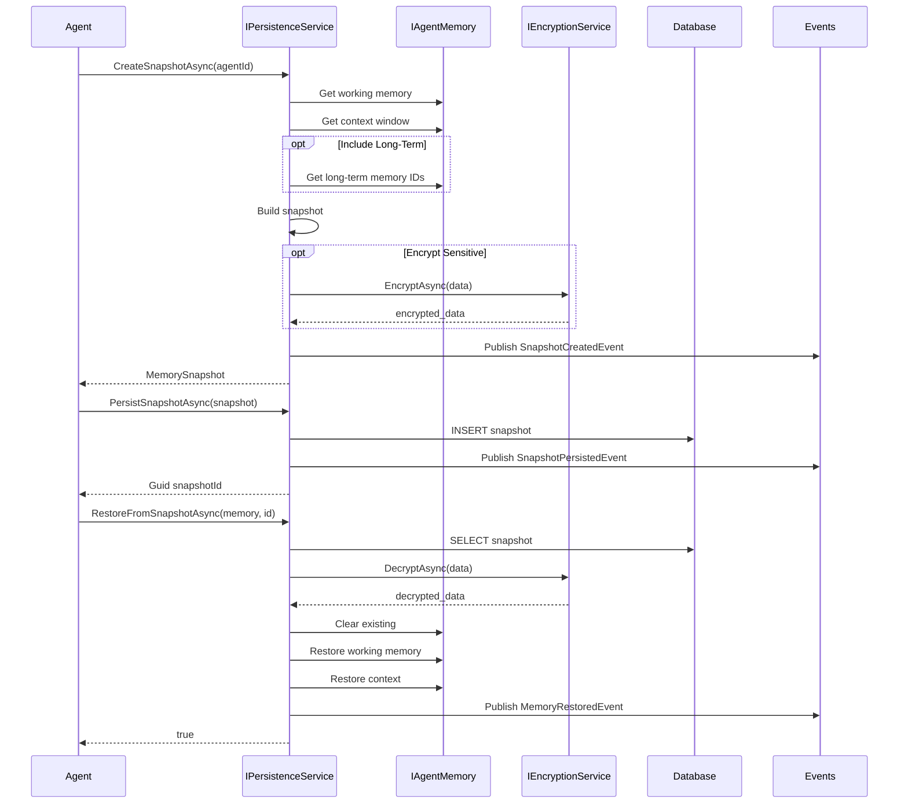
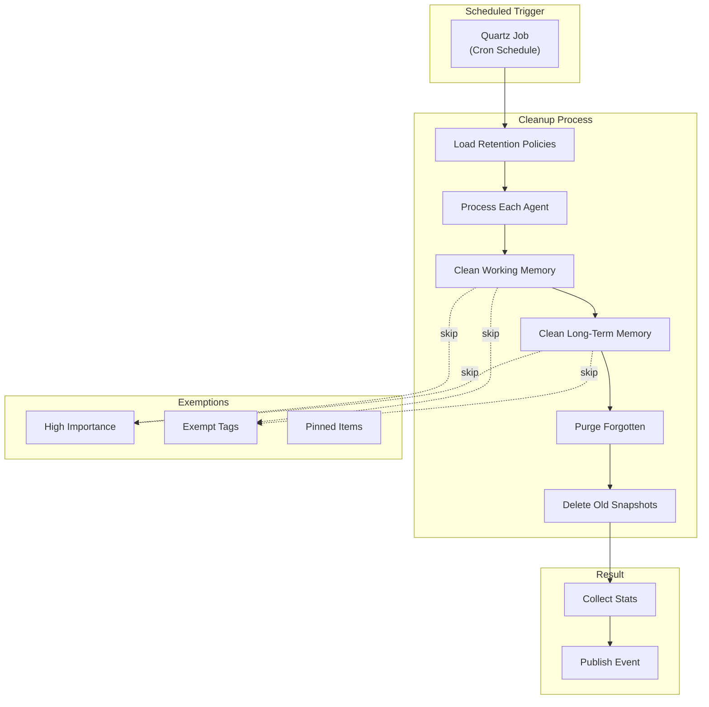

# LDS-01: Memory Persistence

## 1. Metadata & Categorization

| Field | Value |
| :--- | :--- |
| **Feature ID** | `MEM-PER-01` |
| **Feature Name** | Memory Persistence |
| **Target Version** | `v0.12.4e` |
| **Module Scope** | `Lexichord.Modules.Agents` |
| **Swimlane** | Memory |
| **License Tier** | WriterPro |
| **Feature Gate Key** | `FeatureFlags.Agents.Memory.Persistence` |
| **Author** | Agent Architecture Lead |
| **Reviewer** | Lead Architect |
| **Status** | Draft |
| **Last Updated** | 2026-02-04 |
| **Parent Spec** | [LCS-SBD-v0.12.4-AGT](./LCS-SBD-v0.12.4-AGT.md) |
| **Depends On** | [v0.12.4b (Long-Term Memory)](./LCS-SBD-v0.12.4b-LTM.md), [v0.11.3-SEC Encryption] |
| **Estimated Hours** | 6 |

---

## 2. Executive Summary

### 2.1 The Requirement

Agents need to persist memory state for session recovery, backup, and compliance. Without persistence, working memory and context are lost on restart, and long-term memory lacks retention management. The system needs snapshot/restore capabilities, automated retention policies, and encrypted storage for sensitive data.

### 2.2 The Proposed Solution

Implement a memory persistence system providing:
- `MemorySnapshot` for complete memory state capture
- Snapshot/Restore operations for session recovery
- Retention policies for automatic cleanup
- Encrypted storage via v0.11.3-SEC
- Scheduled backup support
- Export/Import for portability

---

## 3. Architecture & Modular Strategy

### 3.1 Dependencies

**Upstream Modules:**
- `Lexichord.Modules.Agents` — `IAgentMemory`, `IWorkingMemory` (v0.12.4a)
- `Lexichord.Modules.Agents` — `ILongTermMemory`, `MemoryEntry` (v0.12.4b)
- `Lexichord.Modules.Security` — `IEncryptionService` (v0.11.3-SEC)
- `Lexichord.Host` — `IMediator`, `IRepository`

**NuGet Packages:**
- `System.Text.Json` (serialization)
- `MediatR` (event publishing)
- `Microsoft.Extensions.Logging.Abstractions` (logging)
- `Quartz.NET` (scheduled jobs)

### 3.2 Licensing Behavior

- **Load Behavior:** [x] **Soft Gate** — Core tier can create snapshots but not persist to database. WriterPro gets full persistence. Teams/Enterprise get retention policies.
- **Fallback Experience:** Core users can create in-memory snapshots only. WriterPro gets database persistence. Teams adds custom retention policies.

---

## 4. Data Contract (The API)

### 4.1 Memory Persistence Service

```csharp
namespace Lexichord.Modules.Agents;

/// <summary>
/// Service for persisting and restoring agent memory state.
/// </summary>
/// <remarks>
/// <para>
/// Memory persistence enables session recovery, backup, and compliance
/// through snapshot-based state management.
/// </para>
/// <para>
/// Snapshots capture working memory, context window, and optionally
/// long-term memory state. Sensitive data is encrypted before storage.
/// </para>
/// <para>
/// Retention policies automatically clean up old data based on
/// configurable rules (Teams tier required).
/// </para>
/// <para>
/// Thread Safety: All methods are thread-safe.
/// </para>
/// </remarks>
public interface IMemoryPersistenceService
{
    /// <summary>
    /// Creates a snapshot of agent memory state.
    /// </summary>
    /// <param name="agentId">The agent to snapshot.</param>
    /// <param name="options">Snapshot creation options.</param>
    /// <param name="ct">Cancellation token.</param>
    /// <returns>The created snapshot.</returns>
    /// <remarks>
    /// Snapshot captures working memory and context by default.
    /// Include long-term memory with options.IncludeLongTermMemory.
    /// </remarks>
    Task<MemorySnapshot> CreateSnapshotAsync(
        AgentId agentId,
        SnapshotOptions? options = null,
        CancellationToken ct = default);

    /// <summary>
    /// Persists a snapshot to storage.
    /// </summary>
    /// <param name="snapshot">The snapshot to persist.</param>
    /// <param name="ct">Cancellation token.</param>
    /// <returns>The persisted snapshot ID.</returns>
    /// <exception cref="LicenseRestrictionException">
    /// Thrown for Core tier (persistence requires WriterPro+).
    /// </exception>
    Task<Guid> PersistSnapshotAsync(
        MemorySnapshot snapshot,
        CancellationToken ct = default);

    /// <summary>
    /// Retrieves a persisted snapshot.
    /// </summary>
    /// <param name="snapshotId">The snapshot ID.</param>
    /// <param name="ct">Cancellation token.</param>
    /// <returns>The snapshot if found; null otherwise.</returns>
    Task<MemorySnapshot?> GetSnapshotAsync(
        Guid snapshotId,
        CancellationToken ct = default);

    /// <summary>
    /// Lists snapshots for an agent.
    /// </summary>
    /// <param name="agentId">The agent ID.</param>
    /// <param name="limit">Maximum results.</param>
    /// <param name="ct">Cancellation token.</param>
    /// <returns>List of snapshot summaries.</returns>
    Task<IReadOnlyList<SnapshotSummary>> ListSnapshotsAsync(
        AgentId agentId,
        int limit = 50,
        CancellationToken ct = default);

    /// <summary>
    /// Restores agent memory from a snapshot.
    /// </summary>
    /// <param name="agentMemory">The agent memory to restore into.</param>
    /// <param name="snapshotId">The snapshot ID to restore.</param>
    /// <param name="options">Restore options.</param>
    /// <param name="ct">Cancellation token.</param>
    /// <returns>True if restored successfully.</returns>
    Task<bool> RestoreFromSnapshotAsync(
        IAgentMemory agentMemory,
        Guid snapshotId,
        RestoreOptions? options = null,
        CancellationToken ct = default);

    /// <summary>
    /// Deletes a persisted snapshot.
    /// </summary>
    /// <param name="snapshotId">The snapshot ID to delete.</param>
    /// <param name="ct">Cancellation token.</param>
    /// <returns>True if deleted; false if not found.</returns>
    Task<bool> DeleteSnapshotAsync(
        Guid snapshotId,
        CancellationToken ct = default);

    /// <summary>
    /// Exports a snapshot to portable format.
    /// </summary>
    /// <param name="snapshotId">The snapshot ID.</param>
    /// <param name="format">Export format.</param>
    /// <param name="ct">Cancellation token.</param>
    /// <returns>Exported data stream.</returns>
    Task<Stream> ExportSnapshotAsync(
        Guid snapshotId,
        ExportFormat format = ExportFormat.Json,
        CancellationToken ct = default);

    /// <summary>
    /// Imports a snapshot from portable format.
    /// </summary>
    /// <param name="data">The import data stream.</param>
    /// <param name="format">Import format.</param>
    /// <param name="ct">Cancellation token.</param>
    /// <returns>The imported snapshot.</returns>
    Task<MemorySnapshot> ImportSnapshotAsync(
        Stream data,
        ExportFormat format = ExportFormat.Json,
        CancellationToken ct = default);

    /// <summary>
    /// Configures retention policy for an agent.
    /// </summary>
    /// <param name="agentId">The agent ID.</param>
    /// <param name="policy">The retention policy.</param>
    /// <param name="ct">Cancellation token.</param>
    /// <exception cref="LicenseRestrictionException">
    /// Thrown for Core/WriterPro tiers (retention requires Teams+).
    /// </exception>
    Task SetRetentionPolicyAsync(
        AgentId agentId,
        RetentionPolicy policy,
        CancellationToken ct = default);

    /// <summary>
    /// Gets the current retention policy for an agent.
    /// </summary>
    /// <param name="agentId">The agent ID.</param>
    /// <param name="ct">Cancellation token.</param>
    /// <returns>The retention policy if set; null otherwise.</returns>
    Task<RetentionPolicy?> GetRetentionPolicyAsync(
        AgentId agentId,
        CancellationToken ct = default);

    /// <summary>
    /// Runs retention cleanup immediately.
    /// </summary>
    /// <param name="agentId">Optional agent ID (null = all agents).</param>
    /// <param name="ct">Cancellation token.</param>
    /// <returns>Cleanup result summary.</returns>
    Task<RetentionCleanupResult> RunRetentionCleanupAsync(
        AgentId? agentId = null,
        CancellationToken ct = default);

    /// <summary>
    /// Gets persistence statistics.
    /// </summary>
    /// <param name="agentId">Optional agent ID filter.</param>
    /// <param name="ct">Cancellation token.</param>
    /// <returns>Persistence statistics.</returns>
    Task<PersistenceStats> GetStatsAsync(
        AgentId? agentId = null,
        CancellationToken ct = default);
}
```

### 4.2 Supporting Types

```csharp
namespace Lexichord.Modules.Agents.Abstractions;

/// <summary>
/// Complete snapshot of agent memory state.
/// </summary>
public sealed record MemorySnapshot
{
    /// <summary>
    /// Unique snapshot identifier.
    /// </summary>
    public Guid Id { get; init; } = Guid.NewGuid();

    /// <summary>
    /// Agent this snapshot belongs to.
    /// </summary>
    public required AgentId AgentId { get; init; }

    /// <summary>
    /// When the snapshot was created.
    /// </summary>
    public DateTimeOffset CreatedAt { get; init; } = DateTimeOffset.UtcNow;

    /// <summary>
    /// Optional name/description for the snapshot.
    /// </summary>
    public string? Name { get; init; }

    /// <summary>
    /// Working memory entries at snapshot time.
    /// </summary>
    public IReadOnlyList<MemoryEntry> WorkingMemoryEntries { get; init; } = [];

    /// <summary>
    /// Working memory scope snapshots.
    /// </summary>
    public IReadOnlyList<WorkingMemoryScopeSnapshot> WorkingMemoryScopes { get; init; } = [];

    /// <summary>
    /// Long-term memory entry IDs (full entries stored separately).
    /// </summary>
    /// <remarks>
    /// Only included if IncludeLongTermMemory option is true.
    /// Contains IDs rather than full entries to avoid duplication.
    /// </remarks>
    public IReadOnlyList<Guid>? LongTermMemoryIds { get; init; }

    /// <summary>
    /// Context window snapshot.
    /// </summary>
    public ContextSnapshot ContextSnapshot { get; init; } = new();

    /// <summary>
    /// Total tokens used across all memory systems.
    /// </summary>
    public int TotalTokensUsed { get; init; }

    /// <summary>
    /// Total storage size in bytes.
    /// </summary>
    public long StorageSizeBytes { get; init; }

    /// <summary>
    /// Whether sensitive data is encrypted.
    /// </summary>
    public bool IsEncrypted { get; init; }

    /// <summary>
    /// Snapshot format version for compatibility.
    /// </summary>
    public int FormatVersion { get; init; } = 1;

    /// <summary>
    /// Custom metadata.
    /// </summary>
    public IReadOnlyDictionary<string, object>? Metadata { get; init; }
}

/// <summary>
/// Snapshot of a working memory scope.
/// </summary>
public sealed record WorkingMemoryScopeSnapshot
{
    public required Guid ScopeId { get; init; }
    public required string ScopeName { get; init; }
    public Guid? ParentScopeId { get; init; }
    public IReadOnlyList<MemoryEntry> Entries { get; init; } = [];
}

/// <summary>
/// Summary of a persisted snapshot.
/// </summary>
public sealed record SnapshotSummary
{
    public required Guid Id { get; init; }
    public required AgentId AgentId { get; init; }
    public string? Name { get; init; }
    public required DateTimeOffset CreatedAt { get; init; }
    public required long StorageSizeBytes { get; init; }
    public required int WorkingMemoryCount { get; init; }
    public required int ContextItemCount { get; init; }
    public int? LongTermMemoryCount { get; init; }
    public required bool IsEncrypted { get; init; }
}

/// <summary>
/// Options for creating a snapshot.
/// </summary>
public sealed record SnapshotOptions
{
    /// <summary>
    /// Optional name for the snapshot.
    /// </summary>
    public string? Name { get; init; }

    /// <summary>
    /// Include long-term memory in snapshot.
    /// </summary>
    /// <remarks>
    /// Default is false (only working memory and context).
    /// Including long-term memory can significantly increase snapshot size.
    /// </remarks>
    public bool IncludeLongTermMemory { get; init; } = false;

    /// <summary>
    /// Encrypt sensitive data before storage.
    /// </summary>
    public bool EncryptSensitive { get; init; } = true;

    /// <summary>
    /// Custom metadata to include.
    /// </summary>
    public IReadOnlyDictionary<string, object>? Metadata { get; init; }
}

/// <summary>
/// Options for restoring from a snapshot.
/// </summary>
public sealed record RestoreOptions
{
    /// <summary>
    /// Clear existing memory before restore.
    /// </summary>
    public bool ClearExisting { get; init; } = true;

    /// <summary>
    /// Restore working memory.
    /// </summary>
    public bool RestoreWorkingMemory { get; init; } = true;

    /// <summary>
    /// Restore context window.
    /// </summary>
    public bool RestoreContext { get; init; } = true;

    /// <summary>
    /// Restore long-term memory (if included in snapshot).
    /// </summary>
    public bool RestoreLongTermMemory { get; init; } = false;
}

/// <summary>
/// Export format for snapshots.
/// </summary>
public enum ExportFormat
{
    /// <summary>
    /// JSON format (human-readable).
    /// </summary>
    Json,

    /// <summary>
    /// Binary format (compact).
    /// </summary>
    Binary,

    /// <summary>
    /// Encrypted binary format.
    /// </summary>
    EncryptedBinary
}

/// <summary>
/// Retention policy for automatic cleanup.
/// </summary>
public sealed record RetentionPolicy
{
    /// <summary>
    /// Maximum age for working memory entries.
    /// </summary>
    public TimeSpan? WorkingMemoryMaxAge { get; init; }

    /// <summary>
    /// Maximum age for long-term memory entries.
    /// </summary>
    public TimeSpan? LongTermMemoryMaxAge { get; init; }

    /// <summary>
    /// Maximum age for forgotten entries before permanent deletion.
    /// </summary>
    public TimeSpan ForgottenRetention { get; init; } = TimeSpan.FromDays(90);

    /// <summary>
    /// Maximum snapshots to keep.
    /// </summary>
    public int? MaxSnapshots { get; init; }

    /// <summary>
    /// Maximum age for snapshots.
    /// </summary>
    public TimeSpan? SnapshotMaxAge { get; init; }

    /// <summary>
    /// Minimum importance to exempt from age-based cleanup.
    /// </summary>
    /// <remarks>
    /// Entries with importance >= this value are not deleted by age rules.
    /// </remarks>
    public float? ImportanceExemptionThreshold { get; init; }

    /// <summary>
    /// Tags that exempt entries from cleanup.
    /// </summary>
    public IReadOnlyList<string>? ExemptTags { get; init; }

    /// <summary>
    /// Whether to run cleanup automatically on schedule.
    /// </summary>
    public bool AutoCleanup { get; init; } = true;

    /// <summary>
    /// Cleanup schedule (cron expression).
    /// </summary>
    public string CleanupSchedule { get; init; } = "0 0 * * *"; // Daily at midnight

    /// <summary>
    /// Default policy with 90-day retention.
    /// </summary>
    public static RetentionPolicy Default => new()
    {
        LongTermMemoryMaxAge = TimeSpan.FromDays(365),
        ForgottenRetention = TimeSpan.FromDays(90),
        MaxSnapshots = 10,
        SnapshotMaxAge = TimeSpan.FromDays(30)
    };
}

/// <summary>
/// Result of retention cleanup.
/// </summary>
public sealed record RetentionCleanupResult
{
    public required DateTimeOffset StartedAt { get; init; }
    public required DateTimeOffset CompletedAt { get; init; }
    public required int WorkingMemoryEntriesDeleted { get; init; }
    public required int LongTermMemoryEntriesDeleted { get; init; }
    public required int ForgottenEntriesPurged { get; init; }
    public required int SnapshotsDeleted { get; init; }
    public required long BytesFreed { get; init; }
    public required int AgentsProcessed { get; init; }
    public IReadOnlyList<string>? Errors { get; init; }
}

/// <summary>
/// Persistence service statistics.
/// </summary>
public sealed record PersistenceStats
{
    public long TotalSnapshots { get; init; }
    public long TotalSnapshotBytes { get; init; }
    public long SnapshotsCreatedLast24h { get; init; }
    public long RestoresLast24h { get; init; }
    public DateTimeOffset? LastCleanup { get; init; }
    public long LastCleanupBytesFreed { get; init; }
    public double AverageSnapshotSizeBytes { get; init; }
    public double AverageSnapshotTimeMs { get; init; }
}
```

### 4.3 MediatR Events

```csharp
namespace Lexichord.Modules.Agents.Events;

/// <summary>
/// Published when a memory snapshot is created.
/// </summary>
public sealed record MemorySnapshotCreatedEvent : INotification
{
    public required AgentId AgentId { get; init; }
    public required Guid SnapshotId { get; init; }
    public required long SizeBytes { get; init; }
    public required bool IncludesLongTermMemory { get; init; }
    public required TimeSpan CreationTime { get; init; }
    public required DateTimeOffset Timestamp { get; init; }
}

/// <summary>
/// Published when memory is restored from a snapshot.
/// </summary>
public sealed record MemoryRestoredEvent : INotification
{
    public required AgentId AgentId { get; init; }
    public required Guid SnapshotId { get; init; }
    public required int WorkingMemoryEntriesRestored { get; init; }
    public required int ContextItemsRestored { get; init; }
    public required TimeSpan RestoreTime { get; init; }
    public required DateTimeOffset Timestamp { get; init; }
}

/// <summary>
/// Published when retention cleanup completes.
/// </summary>
public sealed record RetentionCleanupCompletedEvent : INotification
{
    public AgentId? AgentId { get; init; }
    public required int EntriesDeleted { get; init; }
    public required int SnapshotsDeleted { get; init; }
    public required long BytesFreed { get; init; }
    public required TimeSpan Duration { get; init; }
    public required DateTimeOffset Timestamp { get; init; }
}

/// <summary>
/// Published when snapshot is persisted.
/// </summary>
public sealed record SnapshotPersistedEvent : INotification
{
    public required AgentId AgentId { get; init; }
    public required Guid SnapshotId { get; init; }
    public required long SizeBytes { get; init; }
    public required DateTimeOffset Timestamp { get; init; }
}
```

---

## 5. Implementation Logic

### 5.1 Flow Diagram



### 5.2 Retention Cleanup Flow



### 5.3 Implementation Notes

```csharp
namespace Lexichord.Modules.Agents.Memory;

/// <summary>
/// Memory persistence service implementation.
/// </summary>
internal sealed class MemoryPersistenceService : IMemoryPersistenceService
{
    private readonly IRepository<SnapshotEntity> _snapshotRepository;
    private readonly IRepository<RetentionPolicyEntity> _policyRepository;
    private readonly IEncryptionService _encryptionService;
    private readonly ILicenseService _licenseService;
    private readonly IMediator _mediator;
    private readonly ILogger<MemoryPersistenceService> _logger;

    public async Task<MemorySnapshot> CreateSnapshotAsync(
        AgentId agentId,
        SnapshotOptions? options = null,
        CancellationToken ct = default)
    {
        options ??= new SnapshotOptions();
        var stopwatch = Stopwatch.StartNew();

        // Get the agent's memory
        var agentMemory = await GetAgentMemoryAsync(agentId, ct);

        // Capture working memory
        var workingEntries = await agentMemory.WorkingMemory.GetAllAsync(ct);
        var scopeSnapshots = CaptureWorkingScopes(agentMemory.WorkingMemory);

        // Capture context
        var contextSnapshot = agentMemory.ContextWindow.CreateSnapshot();

        // Optionally capture long-term memory IDs
        IReadOnlyList<Guid>? longTermIds = null;
        if (options.IncludeLongTermMemory)
        {
            var ltmEntries = await agentMemory.LongTermMemory.SearchByFilterAsync(
                new MemoryFilter { Limit = 10000 }, ct);
            longTermIds = ltmEntries.Select(e => e.Id).ToList();
        }

        // Build snapshot
        var snapshot = new MemorySnapshot
        {
            AgentId = agentId,
            Name = options.Name,
            WorkingMemoryEntries = workingEntries.Values.ToList(),
            WorkingMemoryScopes = scopeSnapshots,
            LongTermMemoryIds = longTermIds,
            ContextSnapshot = contextSnapshot,
            IsEncrypted = options.EncryptSensitive,
            Metadata = options.Metadata
        };

        // Calculate storage size
        var json = JsonSerializer.Serialize(snapshot);
        snapshot = snapshot with { StorageSizeBytes = Encoding.UTF8.GetByteCount(json) };

        stopwatch.Stop();

        _logger.LogDebug(
            "Created snapshot {SnapshotId} for agent {AgentId}: {Size}bytes in {Time}ms",
            snapshot.Id,
            agentId,
            snapshot.StorageSizeBytes,
            stopwatch.ElapsedMilliseconds);

        await _mediator.Publish(new MemorySnapshotCreatedEvent
        {
            AgentId = agentId,
            SnapshotId = snapshot.Id,
            SizeBytes = snapshot.StorageSizeBytes,
            IncludesLongTermMemory = longTermIds != null,
            CreationTime = stopwatch.Elapsed,
            Timestamp = DateTimeOffset.UtcNow
        }, ct);

        return snapshot;
    }

    public async Task<Guid> PersistSnapshotAsync(
        MemorySnapshot snapshot,
        CancellationToken ct = default)
    {
        // Require WriterPro for persistence
        if (!_licenseService.HasFeature("FeatureFlags.Agents.Memory.Persistence"))
        {
            throw new LicenseRestrictionException(
                "Snapshot persistence requires WriterPro tier or higher",
                "FeatureFlags.Agents.Memory.Persistence");
        }

        // Serialize snapshot
        var json = JsonSerializer.Serialize(snapshot);

        // Encrypt if requested
        string content = json;
        if (snapshot.IsEncrypted)
        {
            content = await _encryptionService.EncryptAsync(json, ct);
        }

        var entity = new SnapshotEntity
        {
            Id = snapshot.Id,
            AgentId = snapshot.AgentId.Value,
            Name = snapshot.Name,
            Content = content,
            IsEncrypted = snapshot.IsEncrypted,
            SizeBytes = Encoding.UTF8.GetByteCount(content),
            CreatedAt = snapshot.CreatedAt
        };

        await _snapshotRepository.AddAsync(entity, ct);

        _logger.LogInfo(
            "Persisted snapshot {SnapshotId} for agent {AgentId}",
            snapshot.Id,
            snapshot.AgentId);

        await _mediator.Publish(new SnapshotPersistedEvent
        {
            AgentId = snapshot.AgentId,
            SnapshotId = snapshot.Id,
            SizeBytes = entity.SizeBytes,
            Timestamp = DateTimeOffset.UtcNow
        }, ct);

        return snapshot.Id;
    }

    public async Task<RetentionCleanupResult> RunRetentionCleanupAsync(
        AgentId? agentId = null,
        CancellationToken ct = default)
    {
        var startedAt = DateTimeOffset.UtcNow;
        var result = new RetentionCleanupResult
        {
            StartedAt = startedAt,
            CompletedAt = startedAt,
            WorkingMemoryEntriesDeleted = 0,
            LongTermMemoryEntriesDeleted = 0,
            ForgottenEntriesPurged = 0,
            SnapshotsDeleted = 0,
            BytesFreed = 0,
            AgentsProcessed = 0
        };

        var policies = await LoadPoliciesAsync(agentId, ct);
        var errors = new List<string>();

        foreach (var (policyAgentId, policy) in policies)
        {
            try
            {
                var agentResult = await CleanupAgentAsync(policyAgentId, policy, ct);
                result = result with
                {
                    WorkingMemoryEntriesDeleted = result.WorkingMemoryEntriesDeleted + agentResult.WorkingMemoryEntriesDeleted,
                    LongTermMemoryEntriesDeleted = result.LongTermMemoryEntriesDeleted + agentResult.LongTermMemoryEntriesDeleted,
                    ForgottenEntriesPurged = result.ForgottenEntriesPurged + agentResult.ForgottenEntriesPurged,
                    SnapshotsDeleted = result.SnapshotsDeleted + agentResult.SnapshotsDeleted,
                    BytesFreed = result.BytesFreed + agentResult.BytesFreed,
                    AgentsProcessed = result.AgentsProcessed + 1
                };
            }
            catch (Exception ex)
            {
                errors.Add($"Agent {policyAgentId}: {ex.Message}");
                _logger.LogError(ex, "Retention cleanup failed for agent {AgentId}", policyAgentId);
            }
        }

        result = result with
        {
            CompletedAt = DateTimeOffset.UtcNow,
            Errors = errors.Count > 0 ? errors : null
        };

        _logger.LogInfo(
            "Retention cleanup completed: {Entries} entries deleted, {Bytes}bytes freed",
            result.LongTermMemoryEntriesDeleted + result.ForgottenEntriesPurged,
            result.BytesFreed);

        await _mediator.Publish(new RetentionCleanupCompletedEvent
        {
            AgentId = agentId,
            EntriesDeleted = result.LongTermMemoryEntriesDeleted + result.ForgottenEntriesPurged,
            SnapshotsDeleted = result.SnapshotsDeleted,
            BytesFreed = result.BytesFreed,
            Duration = result.CompletedAt - result.StartedAt,
            Timestamp = DateTimeOffset.UtcNow
        }, ct);

        return result;
    }

    // ... additional implementation
}
```

---

## 6. Data Persistence (Database)

### 6.1 Migration

```csharp
[Migration(20260204_003)]
public class CreateAgentMemorySnapshots : Migration
{
    public override void Up()
    {
        Create.Table("agent_memory_snapshots")
            .WithColumn("id").AsGuid().PrimaryKey()
            .WithColumn("agent_id").AsGuid().NotNullable().Indexed()
            .WithColumn("name").AsString(500).Nullable()
            .WithColumn("content").AsString(int.MaxValue).NotNullable()
            .WithColumn("is_encrypted").AsBoolean().NotNullable()
            .WithColumn("size_bytes").AsInt64().NotNullable()
            .WithColumn("format_version").AsInt32().NotNullable().WithDefaultValue(1)
            .WithColumn("created_at").AsDateTimeOffset().NotNullable();

        Create.Index("ix_agent_memory_snapshots_agent_created")
            .OnTable("agent_memory_snapshots")
            .OnColumn("agent_id").Ascending()
            .OnColumn("created_at").Descending();
    }

    public override void Down()
    {
        Delete.Table("agent_memory_snapshots");
    }
}

[Migration(20260204_004)]
public class CreateAgentRetentionPolicies : Migration
{
    public override void Up()
    {
        Create.Table("agent_retention_policies")
            .WithColumn("id").AsGuid().PrimaryKey()
            .WithColumn("agent_id").AsGuid().NotNullable().Unique()
            .WithColumn("policy_json").AsString(int.MaxValue).NotNullable()
            .WithColumn("created_at").AsDateTimeOffset().NotNullable()
            .WithColumn("updated_at").AsDateTimeOffset().NotNullable();
    }

    public override void Down()
    {
        Delete.Table("agent_retention_policies");
    }
}
```

---

## 7. Observability & Logging

### 7.1 Log Messages

| Level | Template |
|:------|:---------|
| Debug | `"Created snapshot {SnapshotId} for agent {AgentId}: {Size}bytes in {Time}ms"` |
| Debug | `"Restored {Count} working memory entries from snapshot {SnapshotId}"` |
| Info | `"Persisted snapshot {SnapshotId} for agent {AgentId}"` |
| Info | `"Retention cleanup completed: {Entries} entries deleted, {Bytes}bytes freed"` |
| Warning | `"Snapshot {SnapshotId} not found for agent {AgentId}"` |
| Error | `"Failed to persist snapshot: {ErrorMessage}"` |
| Error | `"Retention cleanup failed for agent {AgentId}: {ErrorMessage}"` |

### 7.2 Metrics

| Metric | Type | Description |
|:-------|:-----|:------------|
| `agents.memory.snapshots.total` | Gauge | Total snapshots stored |
| `agents.memory.snapshots.size_bytes` | Gauge | Total snapshot storage |
| `agents.memory.snapshot_create_ms` | Histogram | Snapshot creation time |
| `agents.memory.snapshot_restore_ms` | Histogram | Restore time |
| `agents.memory.retention.bytes_freed` | Counter | Bytes freed by retention |

---

## 8. Security & Safety

### 8.1 Encryption

- Sensitive data encrypted via v0.11.3-SEC before storage
- Encryption optional but recommended
- Keys derived from agent-specific context

### 8.2 Access Control

- Snapshots scoped to owning agent
- Cross-agent access prevented
- License tier enforced for persistence features

---

## 9. Acceptance Criteria (QA)

### 9.1 Functional Criteria

1. **[Snapshot]** CreateSnapshotAsync captures working memory and context.
2. **[Persist]** PersistSnapshotAsync stores snapshot to database.
3. **[Restore]** RestoreFromSnapshotAsync restores memory state correctly.
4. **[Retention]** RunRetentionCleanupAsync deletes entries per policy.
5. **[Export/Import]** Snapshots can be exported and imported.

### 9.2 Non-Functional Criteria

1. **[Latency]** Snapshot creation P95 < 500ms.
2. **[Latency]** Restore P95 < 1000ms.
3. **[Size]** Encrypted snapshots < 1.1x unencrypted size.

---

## 10. Test Scenarios

### 10.1 Unit Tests

```gherkin
Scenario: Create and restore snapshot
  Given agent with working memory entries
  When I create a snapshot
  And clear memory
  And restore from snapshot
  Then working memory contains original entries

Scenario: Retention cleanup deletes old entries
  Given retention policy with 30-day max age
  And entries older than 30 days
  When retention cleanup runs
  Then old entries are deleted
  And important entries are preserved
```

### 10.2 Integration Tests

```gherkin
Scenario: Full persistence lifecycle
  Given an agent with populated memory
  When snapshot is created and persisted
  And agent is restarted
  And memory is restored from snapshot
  Then agent continues with previous state
```

---

## 11. Changelog

| Version | Date | Author | Changes |
|:--------|:-----|:-------|:--------|
| 1.0.0 | 2026-02-04 | Agent Architecture Lead | Initial specification |

---

**End of Specification**
