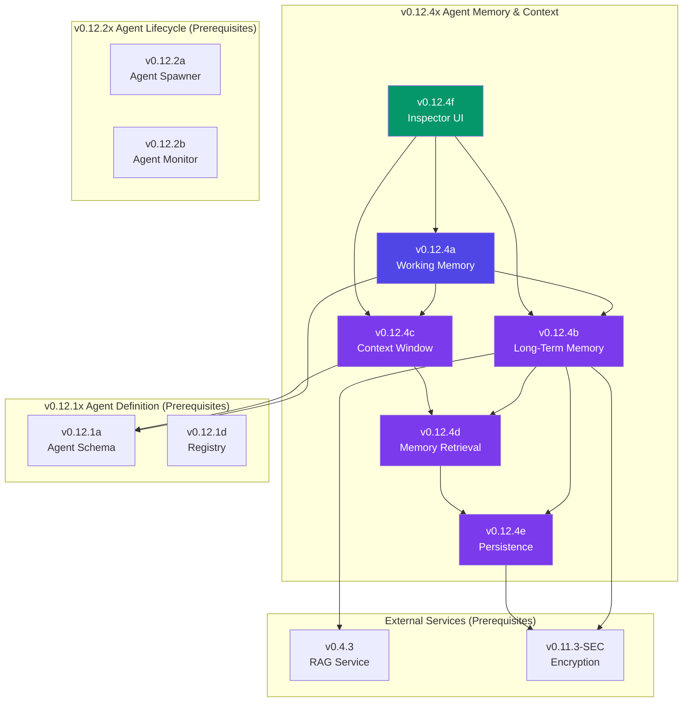

# v0.12.4x Sub-Part Index — Agent Memory & Context

## Document Control

| Field            | Value                                                        |
| :--------------- | :----------------------------------------------------------- |
| **Document ID**  | LCS-SBD-v0.12.4x-INDEX                                       |
| **Version**      | v0.12.4                                                      |
| **Codename**     | Agent Memory & Context Sub-Part Index                        |
| **Status**       | Draft                                                        |
| **Last Updated** | 2026-02-04                                                   |
| **Owner**        | Agent Architecture Lead                                      |
| **Parent Spec**  | [LCS-SBD-v0.12.4-AGT](./LCS-SBD-v0.12.4-AGT.md)              |

---

## 1. Overview

This document serves as the master index for all v0.12.4x sub-part specifications implementing the **Agent Memory & Context** system. The Memory & Context system provides comprehensive memory infrastructure for agents, including working memory for active conversations, long-term semantic memory with embeddings, and token-aware context window management.

### 1.1 Design Philosophy

The Memory & Context system follows these core principles:

1. **Separation of Concerns:** Distinct memory subsystems (working, long-term, context) with unified access
2. **Performance:** Sub-5ms working memory access, sub-100ms semantic retrieval (P95)
3. **Semantic Intelligence:** Vector embeddings enable semantic search and relevant memory retrieval
4. **Token Efficiency:** Context window management maximizes reasoning within LLM token limits
5. **Security:** Sensitive memory encrypted via v0.11.3-SEC; scoped isolation prevents leakage
6. **License-Tiered:** Progressive feature enablement from Core to Enterprise

---

## 2. Sub-Part Registry

| Sub-Part | Document | Feature ID | Title | Est. Hours | Status |
|:---------|:---------|:-----------|:------|:-----------|:-------|
| v0.12.4a | [LCS-SBD-v0.12.4a-WRK](./LCS-SBD-v0.12.4a-WRK.md) | `MEM-WRK-01` | Working Memory | 10 | Draft |
| v0.12.4b | [LCS-SBD-v0.12.4b-LTM](./LCS-SBD-v0.12.4b-LTM.md) | `MEM-LTM-01` | Long-Term Memory | 10 | Draft |
| v0.12.4c | [LCS-SBD-v0.12.4c-CTX](./LCS-SBD-v0.12.4c-CTX.md) | `MEM-CTX-01` | Context Window Manager | 10 | Draft |
| v0.12.4d | [LCS-SBD-v0.12.4d-RET](./LCS-SBD-v0.12.4d-RET.md) | `MEM-RET-01` | Memory Retrieval | 8 | Draft |
| v0.12.4e | [LCS-SBD-v0.12.4e-PER](./LCS-SBD-v0.12.4e-PER.md) | `MEM-PER-01` | Memory Persistence | 6 | Draft |
| v0.12.4f | [LCS-SBD-v0.12.4f-UI](./LCS-SBD-v0.12.4f-UI.md) | `MEM-UI-01` | Memory Inspector UI | 4 | Draft |
| **Total** | | | | **48 hours** | |

---

## 3. Feature Gate Keys

| Sub-Part | Feature Gate Key | License Tier |
|:---------|:-----------------|:-------------|
| v0.12.4a | `FeatureFlags.Agents.Memory.Working` | Core |
| v0.12.4b | `FeatureFlags.Agents.Memory.LongTerm` | WriterPro |
| v0.12.4c | `FeatureFlags.Agents.Memory.ContextWindow` | Core |
| v0.12.4d | `FeatureFlags.Agents.Memory.SemanticRetrieval` | Teams |
| v0.12.4e | `FeatureFlags.Agents.Memory.Persistence` | WriterPro |
| v0.12.4f | `FeatureFlags.Agents.Memory.Inspector` | WriterPro |

### Memory Capabilities by Tier

| Tier | Working Memory | Long-Term | Semantic Search | Storage | Inspector | Custom Retention |
|:-----|:---------------|:----------|:----------------|:--------|:----------|:-----------------|
| **Core** | ✓ | - | - | — | - | - |
| **WriterPro** | ✓ | ✓ | - | 100 MB | Basic | - |
| **Teams** | ✓ | ✓ | ✓ | 1 GB | Advanced | ✓ |
| **Enterprise** | ✓ | ✓ | ✓ | Unlimited | Full | ✓ |

---

## 4. Dependency Graph



---

## 5. Implementation Order

The sub-parts MUST be implemented in this order due to dependencies:

```
Phase 1: Foundation
├── v0.12.4a (Working Memory) ──────────────────────── 10 hours
│   └── Provides: IAgentMemory, IWorkingMemory, IWorkingMemoryScope
│
Phase 2: Persistent Memory
├── v0.12.4b (Long-Term Memory) ────────────────────── 10 hours
│   └── Provides: ILongTermMemory, MemoryEntry, MemoryType
│   └── Requires: v0.12.4a, v0.4.3 RAG, v0.11.3-SEC
│
├── v0.12.4c (Context Window Manager) ──────────────── 10 hours
│   └── Provides: IContextWindow, ContextItem, ContextItemType, CompactionStrategy
│   └── Requires: v0.12.4a
│
Phase 3: Advanced Features
├── v0.12.4d (Memory Retrieval) ────────────────────── 8 hours
│   └── Provides: MemoryQuery, semantic search, relevance ranking
│   └── Requires: v0.12.4b, v0.12.4c, v0.4.3 RAG
│
├── v0.12.4e (Memory Persistence) ──────────────────── 6 hours
│   └── Provides: MemorySnapshot, retention policies, encrypted storage
│   └── Requires: v0.12.4b, v0.11.3-SEC
│
Phase 4: Observability
└── v0.12.4f (Memory Inspector UI) ─────────────────── 4 hours
    └── Provides: Memory inspection dashboard, visualization
    └── Requires: v0.12.4a, v0.12.4b, v0.12.4c
```

---

## 6. Interface Summary

### 6.1 Core Interfaces

| Interface | Sub-Part | Module | Purpose |
|:----------|:---------|:-------|:--------|
| `IAgentMemory` | v0.12.4a | `Lexichord.Modules.Agents.Core` | Unified memory system access |
| `IWorkingMemory` | v0.12.4a | `Lexichord.Modules.Agents.Core` | Fast in-process session memory |
| `ILongTermMemory` | v0.12.4b | `Lexichord.Modules.Agents.Core` | Persistent semantic memory |
| `IContextWindow` | v0.12.4c | `Lexichord.Modules.Agents.Core` | Token-aware context management |

### 6.2 Records & Enums

| Type | Sub-Part | Module | Purpose |
|:-----|:---------|:-------|:--------|
| `IWorkingMemoryScope` | v0.12.4a | Abstractions | Scoped memory container |
| `MemoryEntry` | v0.12.4b | Abstractions | Stored memory record with embedding |
| `MemoryType` | v0.12.4b | Abstractions | Fact/Event/Insight/Preference/Correction/Conversation |
| `MemoryEntryMetadata` | v0.12.4b | Abstractions | Metadata for memory entries |
| `MemoryStats` | v0.12.4b | Abstractions | Memory storage statistics |
| `ContextItem` | v0.12.4c | Abstractions | Context window item |
| `ContextItemType` | v0.12.4c | Abstractions | SystemPrompt/UserMessage/AssistantMessage/etc. |
| `CompactionStrategy` | v0.12.4c | Abstractions | RemoveOldest/RemoveLowPriority/Summarize/Selective |
| `BuildContextOptions` | v0.12.4c | Abstractions | Context build configuration |
| `ContextSnapshot` | v0.12.4c | Abstractions | Context state for persistence |
| `MemoryQuery` | v0.12.4d | Abstractions | Memory retrieval query |
| `MemorySnapshot` | v0.12.4e | Abstractions | Full memory state snapshot |
| `MemoryClearOptions` | v0.12.4e | Abstractions | Memory clear configuration |

---

## 7. Database Schema Overview

### 7.1 Tables Introduced

| Table | Sub-Part | Purpose |
|:------|:---------|:--------|
| `agent_memory_entries` | v0.12.4b | Long-term memory storage |
| `agent_memory_embeddings` | v0.12.4b | Vector embeddings for semantic search |
| `agent_memory_snapshots` | v0.12.4e | Memory snapshots for recovery |
| `agent_retention_policies` | v0.12.4e | Custom retention policy definitions |

### 7.2 Migration Sequence

```
Migration_20260204_001_CreateAgentMemoryEntries      (v0.12.4b)
Migration_20260204_002_CreateAgentMemoryEmbeddings   (v0.12.4b)
Migration_20260204_003_CreateAgentMemorySnapshots    (v0.12.4e)
Migration_20260204_004_CreateAgentRetentionPolicies  (v0.12.4e)
```

---

## 8. MediatR Events

| Event | Sub-Part | Published When |
|:------|:---------|:---------------|
| `WorkingMemorySetEvent` | v0.12.4a | Value stored in working memory |
| `WorkingMemoryRemovedEvent` | v0.12.4a | Value removed from working memory |
| `WorkingMemoryScopeCreatedEvent` | v0.12.4a | New memory scope created |
| `WorkingMemoryScopeDisposedEvent` | v0.12.4a | Memory scope disposed |
| `MemoryStoredEvent` | v0.12.4b | Entry stored in long-term memory |
| `MemoryRetrievedEvent` | v0.12.4b | Entry retrieved from long-term memory |
| `MemoryForgottenEvent` | v0.12.4b | Entry marked as forgotten |
| `ContextItemAddedEvent` | v0.12.4c | Item added to context window |
| `ContextCompactedEvent` | v0.12.4c | Context window compacted |
| `ContextClearedEvent` | v0.12.4c | Context window cleared |
| `MemorySearchCompletedEvent` | v0.12.4d | Semantic search completed |
| `MemorySnapshotCreatedEvent` | v0.12.4e | Memory snapshot created |
| `MemoryRestoredEvent` | v0.12.4e | Memory restored from snapshot |
| `RetentionCleanupCompletedEvent` | v0.12.4e | Retention policy cleanup ran |

---

## 9. Performance Targets

| Metric | Target | Sub-Part |
|:-------|:-------|:---------|
| Working memory Get | <5ms P95 | v0.12.4a |
| Working memory Set | <10ms P95 | v0.12.4a |
| Scope creation | <5ms P95 | v0.12.4a |
| Long-term Store | <50ms P95 | v0.12.4b |
| Long-term Retrieve | <20ms P95 | v0.12.4b |
| Context Build | <200ms P95 | v0.12.4c |
| Context Compaction | <100ms P95 | v0.12.4c |
| Semantic search | <100ms P95 | v0.12.4d |
| Embedding generation | <30ms P95 | v0.12.4d |
| Snapshot creation | <500ms P95 | v0.12.4e |
| Snapshot restore | <1000ms P95 | v0.12.4e |
| Inspector UI load | <500ms P95 | v0.12.4f |

---

## 10. Testing Requirements

### 10.1 Unit Test Coverage

| Sub-Part | Minimum Coverage | Key Test Areas |
|:---------|:-----------------|:---------------|
| v0.12.4a | 90% | Get/Set operations, scope isolation, parent fallback |
| v0.12.4b | 90% | Store/Retrieve, embedding generation, encryption |
| v0.12.4c | 90% | Token counting, compaction strategies, pinned items |
| v0.12.4d | 85% | Semantic similarity, ranking, filtering |
| v0.12.4e | 85% | Snapshot/restore, retention policies, encryption |
| v0.12.4f | 75% | ViewModel logic, data binding |

### 10.2 Integration Test Scenarios

1. **Working memory scope isolation:** Create scopes, verify parent fallback and isolation
2. **Long-term memory full cycle:** Store → Embed → Search → Retrieve → Forget
3. **Context window compaction:** Fill window → Compact → Verify priority ordering
4. **Semantic search accuracy:** Store related entries → Query → Verify relevance ranking
5. **Snapshot recovery:** Create snapshot → Clear memory → Restore → Verify state

---

## 11. Cross-References

### 11.1 Upstream Dependencies

| Dependency | Version | Usage |
|:-----------|:--------|:------|
| `IAgent` | v0.12.1a | Agent identity for memory isolation |
| `AgentId` | v0.12.1a | Memory ownership identification |
| `IAgentRegistry` | v0.12.1d | Agent lookup for memory sharing |
| `IAgentLifecycleManager` | v0.12.2a | Agent lifecycle for memory cleanup |
| `AgentInstance` | v0.12.2a | Active agent for memory binding |
| `IEmbeddingProvider` | v0.4.3 | Vector embedding generation |
| `IEncryptionService` | v0.11.3-SEC | Sensitive memory encryption |

### 11.2 Downstream Consumers

| Consumer | Version | Usage |
|:---------|:--------|:------|
| Agent Tools | v0.12.5 | Tool context via memory retrieval |
| Agent Reasoning | v0.12.6 | Decision-making via memory access |
| Orchestration | v0.13.x | Multi-agent memory sharing |

---

## 12. Changelog

| Date | Version | Changes |
|:-----|:--------|:--------|
| 2026-02-04 | 1.0.0 | Initial sub-part index creation |

---

**End of Index Document**
