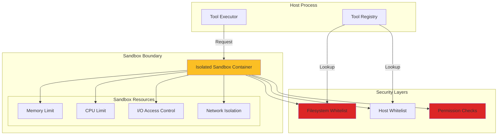
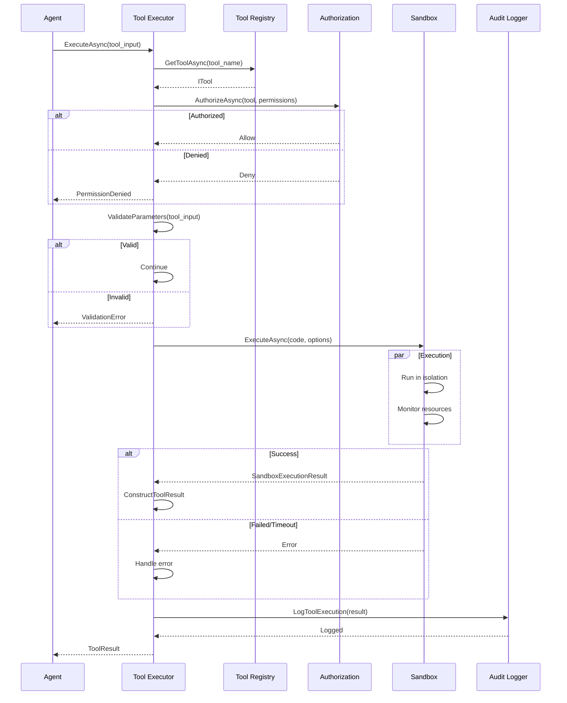

# LCS-SBD-v0.12.5-AGT: Scope Overview — Agent Tool System

## Document Control

| Field            | Value                                                        |
| :--------------- | :----------------------------------------------------------- |
| **Document ID**  | LCS-SBD-v0.12.5-AGT                                          |
| **Version**      | v0.12.5                                                      |
| **Codename**     | Agent Tool System                                             |
| **Status**       | Draft                                                        |
| **Last Updated** | 2026-01-31                                                   |
| **Owner**        | Agent Architecture Lead                                       |
| **Depends On**   | v0.12.1-AGT (Agent Definition), v0.11.1-SEC (Authorization), v0.11.2-SEC (Audit Logging) |

---

## 1. Executive Summary

### 1.1 The Vision

**v0.12.5-AGT** delivers the **Agent Tool System** — a comprehensive framework for defining, registering, executing, and managing tools that agents can access and invoke. This ensures:

- Tools can be defined declaratively with schema validation
- Tools are discoverable and organized by category
- Tool execution is isolated in controlled sandbox environments
- Results are validated and tracked
- Tool access is controlled via license gating and permissions
- Tool lifecycle is managed through a central registry

### 1.2 Business Value

- **Agent Extensibility:** Enable agents to discover and use a growing library of tools
- **Safety:** Sandbox execution prevents malicious tool code from affecting the system
- **Auditability:** All tool invocations are logged with inputs, outputs, and outcomes
- **Control:** Administrators can manage which tools are available per license tier
- **Integration:** Built-in tools reduce external dependencies and licensing costs
- **Reliability:** Robust result handling and error recovery patterns

### 1.3 Success Criteria

1. Tool registry with full CRUD operations on tool definitions
2. Sandboxed execution with configurable resource limits
3. Support for built-in tools and custom tool registration
4. License-based tool availability (core, pro, teams, enterprise)
5. Complete audit trail for all tool executions
6. Tool result latency <500ms for simple operations (P95)
7. Sandbox memory overhead <50MB per execution
8. Support for batch tool execution

---

## 2. Key Deliverables

### 2.1 Sub-Parts

| Sub-Part | Title | Description | Est. Hours |
|:---------|:------|:------------|:-----------|
| v0.12.5a | Tool Definition Schema | Define tool metadata, parameters, constraints, and validation | 8 |
| v0.12.5b | Tool Registry | Implementation of ITool Registry with CRUD and discovery | 8 |
| v0.12.5c | Tool Executor | Tool execution orchestration with error handling | 12 |
| v0.12.5d | Execution Sandbox | Isolated execution environment with resource limits | 10 |
| v0.12.5e | Result Handling | Result validation, transformation, and storage | 6 |
| v0.12.5f | Tool Management UI | Admin interface for viewing, enabling, and configuring tools | 6 |
| **Total** | | | **50 hours** |

### 2.2 Key Interfaces

```csharp
/// <summary>
/// Represents a tool that an agent can invoke.
/// </summary>
public interface ITool
{
    /// <summary>
    /// Gets the tool definition (metadata, parameters, constraints).
    /// </summary>
    ToolDefinition Definition { get; }

    /// <summary>
    /// Executes the tool with the given input.
    /// </summary>
    Task<ToolResult> ExecuteAsync(
        ToolInput input,
        ToolExecutionOptions options,
        CancellationToken ct = default);
}

/// <summary>
/// Complete definition of a tool.
/// </summary>
public record ToolDefinition
{
    public required string Name { get; init; }
    public required string Description { get; init; }
    public ToolCategory Category { get; init; }
    public IReadOnlyList<ToolParameter> Parameters { get; init; } = [];
    public object? OutputSchema { get; init; }
    public ToolConstraints? Constraints { get; init; }
    public IReadOnlyList<string> RequiredPermissions { get; init; } = [];
    public bool RequiresConfirmation { get; init; } = false;
    public string? Version { get; init; }
    public IReadOnlyDictionary<string, object>? Metadata { get; init; }
}

/// <summary>
/// Tool category for organization and filtering.
/// </summary>
public enum ToolCategory
{
    FileSystem,
    Network,
    Database,
    CodeExecution,
    ExternalApi,
    Knowledge,
    Communication,
    System
}

/// <summary>
/// Definition of a tool parameter.
/// </summary>
public record ToolParameter
{
    public required string Name { get; init; }
    public required string Description { get; init; }
    public ToolParameterType Type { get; init; }
    public bool Required { get; init; } = false;
    public object? Default { get; init; }
    public IReadOnlyList<object>? Enum { get; init; }
    public object? Schema { get; init; }  // JSON Schema for complex types
}

/// <summary>
/// Supported parameter types.
/// </summary>
public enum ToolParameterType
{
    String,
    Integer,
    Number,
    Boolean,
    Array,
    Object
}

/// <summary>
/// Constraints on tool execution.
/// </summary>
public record ToolConstraints
{
    public TimeSpan? MaxExecutionTime { get; init; }
    public long? MaxOutputSize { get; init; }  // Bytes
    public bool AllowSideEffects { get; init; } = true;
    public SandboxIsolationLevel RequiredIsolation { get; init; } = SandboxIsolationLevel.Standard;
}

public enum SandboxIsolationLevel
{
    None,
    Standard,
    Strict,
    Restricted
}

/// <summary>
/// Registry for discovering and managing tools.
/// </summary>
public interface IToolRegistry
{
    /// <summary>
    /// Registers a new tool.
    /// </summary>
    Task RegisterAsync(
        ToolDefinition definition,
        ITool implementation,
        CancellationToken ct = default);

    /// <summary>
    /// Unregisters a tool by name.
    /// </summary>
    Task UnregisterAsync(
        string toolName,
        CancellationToken ct = default);

    /// <summary>
    /// Gets a tool by name.
    /// </summary>
    Task<ITool?> GetToolAsync(
        string toolName,
        CancellationToken ct = default);

    /// <summary>
    /// Gets all available tools (filtered by permissions).
    /// </summary>
    Task<IReadOnlyList<ITool>> GetAvailableToolsAsync(
        CancellationToken ct = default);

    /// <summary>
    /// Finds tools in a specific category.
    /// </summary>
    Task<IReadOnlyList<ITool>> FindByCategoryAsync(
        ToolCategory category,
        CancellationToken ct = default);
}

/// <summary>
/// Input to a tool execution.
/// </summary>
public record ToolInput
{
    public string ToolName { get; init; }
    public IReadOnlyDictionary<string, object?> Parameters { get; init; } = new Dictionary<string, object?>();
}

/// <summary>
/// Options controlling tool execution.
/// </summary>
public record ToolExecutionOptions
{
    public Guid ExecutionId { get; init; } = Guid.NewGuid();
    public TimeSpan? Timeout { get; init; }
    public bool RequireConfirmation { get; init; } = false;
    public IReadOnlyDictionary<string, object>? Context { get; init; }
}

/// <summary>
/// Result of tool execution.
/// </summary>
public record ToolResult
{
    public required ToolInput Input { get; init; }
    public required ToolResultMetadata Metadata { get; init; }
    public object? Output { get; init; }
    public ToolExecutionStatus Status { get; init; }
    public string? ErrorMessage { get; init; }
    public string? ErrorCode { get; init; }
}

/// <summary>
/// Metadata about tool execution.
/// </summary>
public record ToolResultMetadata
{
    public Guid ExecutionId { get; init; }
    public DateTimeOffset StartedAt { get; init; }
    public DateTimeOffset CompletedAt { get; init; }
    public TimeSpan Duration { get; init; }
    public long? OutputSize { get; init; }  // Bytes
    public string? SandboxId { get; init; }
    public IReadOnlyDictionary<string, object>? ExecutionMetrics { get; init; }
}

public enum ToolExecutionStatus
{
    Success,
    Failed,
    Timeout,
    Cancelled,
    RequiresConfirmation,
    SandboxError,
    PermissionDenied,
    ValidationError
}

/// <summary>
/// Executes tools with isolation and error handling.
/// </summary>
public interface IToolExecutor
{
    /// <summary>
    /// Executes a single tool.
    /// </summary>
    Task<ToolResult> ExecuteAsync(
        ToolInput input,
        ToolExecutionOptions options,
        CancellationToken ct = default);

    /// <summary>
    /// Executes multiple tools sequentially.
    /// </summary>
    Task<IReadOnlyList<ToolResult>> ExecuteBatchAsync(
        IReadOnlyList<ToolInput> inputs,
        ToolExecutionOptions options,
        CancellationToken ct = default);

    /// <summary>
    /// Observes execution progress and metrics.
    /// </summary>
    IAsyncEnumerable<ToolExecutionEvent> ObserveAsync(
        Guid executionId,
        CancellationToken ct = default);
}

public record ToolExecutionEvent
{
    public Guid ExecutionId { get; init; }
    public ToolExecutionEventType EventType { get; init; }
    public string? Message { get; init; }
    public DateTimeOffset Timestamp { get; init; }
}

public enum ToolExecutionEventType
{
    Started,
    InProgress,
    Completed,
    Failed,
    Timeout,
    Warning
}

/// <summary>
/// Options for sandbox execution.
/// </summary>
public record SandboxOptions
{
    public IReadOnlyList<string>? AllowedPaths { get; init; }
    public IReadOnlyList<string>? AllowedHosts { get; init; }
    public long MaxMemoryBytes { get; init; } = 256 * 1024 * 1024;  // 256MB
    public TimeSpan MaxCpuTime { get; init; } = TimeSpan.FromMinutes(5);
    public bool AllowNetworkAccess { get; init; } = false;
    public bool AllowFilesystemAccess { get; init; } = false;
}

/// <summary>
/// Sandbox for isolated tool execution.
/// </summary>
public interface IToolSandbox
{
    /// <summary>
    /// Executes code/tool in the sandbox.
    /// </summary>
    Task<SandboxExecutionResult> ExecuteAsync(
        string code,
        SandboxOptions options,
        CancellationToken ct = default);
}

public record SandboxExecutionResult
{
    public bool Success { get; init; }
    public object? Output { get; init; }
    public string? ErrorMessage { get; init; }
    public SandboxResourceMetrics? ResourceMetrics { get; init; }
}

public record SandboxResourceMetrics
{
    public long PeakMemoryBytes { get; init; }
    public TimeSpan CpuTime { get; init; }
    public long FilesystemOperations { get; init; }
    public long NetworkRequests { get; init; }
}
```

### 2.3 Built-In Tools

The system provides 8 built-in tools available in the Core tier:

| Tool Name | Category | Description |
|:----------|:---------|:------------|
| `read_file` | FileSystem | Read file contents with size limits |
| `write_file` | FileSystem | Write or append to files with path restrictions |
| `search_knowledge` | Knowledge | Search the knowledge graph |
| `web_fetch` | Network | Fetch web content with timeout and size limits |
| `execute_ckvs_query` | Database | Execute CKVS queries with permission checks |
| `send_message` | Communication | Send messages (requires confirmation) |
| `create_entity` | Knowledge | Create new entities in the knowledge graph |
| `validate_content` | System | Validate content against schemas |

---

## 3. Tool Execution Flow

```mermaid
graph TB
    subgraph "Request"
        REQ[Agent Request]
        TOOL[Tool Input]
    end

    subgraph "Authorization"
        AUTH[Check Permissions]
        LIC[Check License Tier]
        CONFIRM[Require Confirmation?]
    end

    subgraph "Validation"
        VALIDATE[Validate Parameters]
        SCHEMA[Check Output Schema]
    end

    subgraph "Execution"
        SANDBOX[Sandbox Execution]
        EXEC[Tool Executor]
        MONITOR[Monitor Resources]
    end

    subgraph "Result"
        RESULT[Tool Result]
        META[Execution Metadata]
        AUDIT[Audit Log]
    end

    REQ --> TOOL
    TOOL --> AUTH
    AUTH --> LIC
    LIC --> CONFIRM
    CONFIRM --> VALIDATE
    VALIDATE --> SCHEMA
    SCHEMA --> SANDBOX
    SANDBOX --> EXEC
    EXEC --> MONITOR
    MONITOR --> RESULT
    RESULT --> META
    META --> AUDIT

    style AUTH fill:#dc2626
    style SANDBOX fill:#dc2626
    style AUDIT fill:#1f2937
```



---

## 4. Sandbox Architecture



---

## 5. Execution Sequence



---

## 6. Tool Definition Example

```json
{
  "name": "read_file",
  "description": "Read the contents of a file",
  "category": "FileSystem",
  "parameters": [
    {
      "name": "path",
      "description": "The file path to read",
      "type": "String",
      "required": true
    },
    {
      "name": "encoding",
      "description": "File encoding (default: utf-8)",
      "type": "String",
      "required": false,
      "default": "utf-8",
      "enum": ["utf-8", "ascii", "utf-16"]
    }
  ],
  "outputSchema": {
    "type": "object",
    "properties": {
      "content": { "type": "string" },
      "size": { "type": "integer" },
      "encoding": { "type": "string" }
    }
  },
  "constraints": {
    "maxExecutionTime": "PT30S",
    "maxOutputSize": 10485760,
    "allowSideEffects": false,
    "requiredIsolation": "Standard"
  },
  "requiredPermissions": [
    "tool.filesystem.read"
  ],
  "requiresConfirmation": false,
  "version": "1.0.0",
  "metadata": {
    "riskLevel": "low",
    "category": "file_operations"
  }
}
```

---

## 7. License Gating

| Tier | Built-In Tools | Custom Tools | Sandbox | Notes |
|:-----|:---------------|:------------|:---------|:------|
| Core | 5 tools | 0 | Standard | read_file, write_file, search_knowledge, web_fetch, execute_ckvs_query |
| WriterPro | 5 tools | +10 custom | Standard | Support for custom tool registration |
| Teams | 8 tools | +50 custom | Standard | All built-in tools + unlimited custom |
| Enterprise | 8 tools | Unlimited | Custom | Full customization including custom sandboxes |

**Built-In Tool Tiers:**
- Core: read_file, write_file, search_knowledge, web_fetch, execute_ckvs_query
- WriterPro: + (no additional)
- Teams: + send_message, create_entity, validate_content
- Enterprise: All + future tools

---

## 8. Dependencies

| Component | Source | Usage |
|:----------|:-------|:------|
| `IAgentDefinition` | v0.12.1-AGT | Agent tool requirements |
| `IAuthorizationService` | v0.11.1-SEC | Permission checks on tool execution |
| `IAuditLogService` | v0.11.2-SEC | Log all tool invocations |
| `ILicenseContext` | v0.9.2 | License-based tool availability |
| `IGraphRepository` | v0.4.5e | Knowledge graph access for tools |
| `IMediator` | v0.0.7a | Tool execution events |

---

## 9. Performance Targets

| Metric | Target | Measurement |
|:-------|:-------|:------------|
| Tool lookup | <5ms | P95 timing |
| Parameter validation | <10ms | P95 timing |
| Simple tool execution | <500ms | P95 timing (excluding sandbox setup) |
| Sandbox initialization | <100ms | P95 timing |
| Batch execution (10 tools) | <5s | P95 timing |
| Sandbox memory overhead | <50MB | Per active execution |

---

## 10. Security Considerations

| Concern | Mitigation |
|:--------|:-----------|
| Arbitrary code execution | Process-based sandbox with capability restrictions |
| Resource exhaustion | Memory, CPU, and I/O limits per execution |
| Unauthorized access | Permission checks before execution + sandbox isolation |
| Data leakage | Network and filesystem whitelisting |
| Confirmation bypass | Confirmation state tracked and enforced |
| Supply chain attacks | Tool definitions signed and versioned |

---

## 11. Risks & Mitigations

| Risk | Impact | Mitigation |
|:-----|:-------|:-----------|
| Sandbox escape vulnerability | High | Use OS-level isolation, regular security audits |
| Slow tool execution blocking agent | Medium | Timeout enforcement, async execution, batch optimization |
| Tool state pollution | Medium | Isolated sandboxes per execution, state cleanup |
| License enforcement bypass | Medium | Server-side validation, audit logging of all executions |
| Custom tool misconfiguration | Low | Validation framework, schema enforcement |
| Tool registry becomes bottleneck | Low | Caching, in-memory registry with periodic sync |
| Confirmation UX complexity | Low | Clear confirmation UI, batch confirmation support |

---

## 12. Implementation Notes

### 12.1 Registry Storage
The tool registry uses an in-memory dictionary for built-in tools with optional persistent storage for custom tools via the CKVS.

### 12.2 Sandbox Implementation
Sandbox implementation is abstraction-friendly to support multiple backends:
- Process-based isolation (default)
- Container-based isolation (future)
- Language-specific VMs for specific tool types

### 12.3 Result Validation
Tool results are validated against the declared output schema. Invalid outputs are wrapped in an error result rather than returning raw data.

### 12.4 Batch Execution
Batch execution runs tools sequentially by default to maintain ordering guarantees. Parallel execution is available via configuration for tools without dependencies.

### 12.5 Built-In Tool Categories
- **FileSystem:** File read/write with path restrictions
- **Knowledge:** CKVS and knowledge graph operations
- **Network:** Web fetching and external API calls
- **Communication:** Messaging and notifications
- **System:** Validation, content processing

---

## 13. Success Metrics

- Tool definition schema validated in all 50 test cases
- Registry handles 1000+ tool registrations with <10ms lookup
- Sandbox executions maintain resource limits within 5% variance
- 100% audit logging of tool executions with full context
- License gating enforced for all tool access paths
- Zero tool execution bypasses authorization checks
- Confirmation UI provides clear feedback for 100% of confirmation-required tools

---
